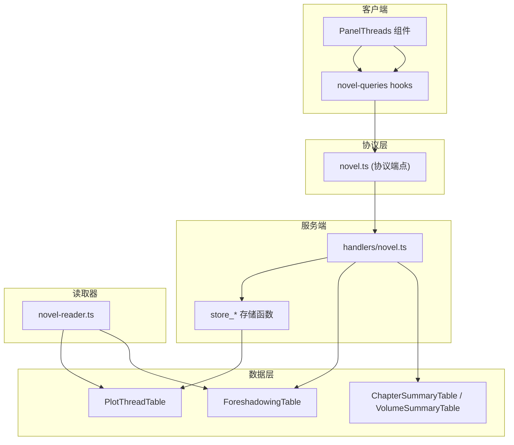
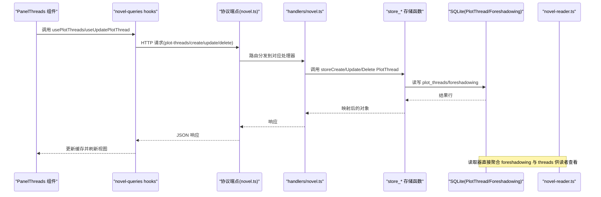
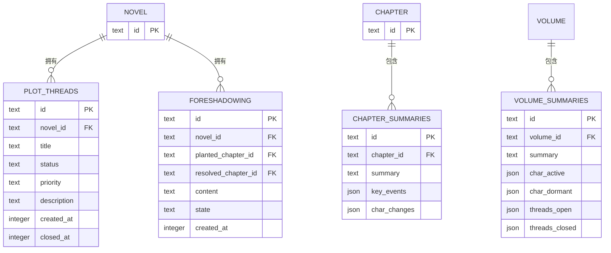
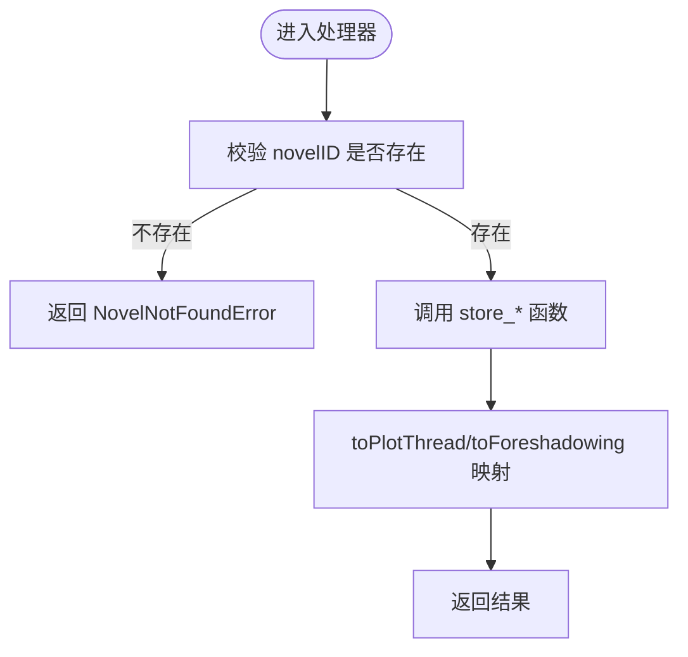
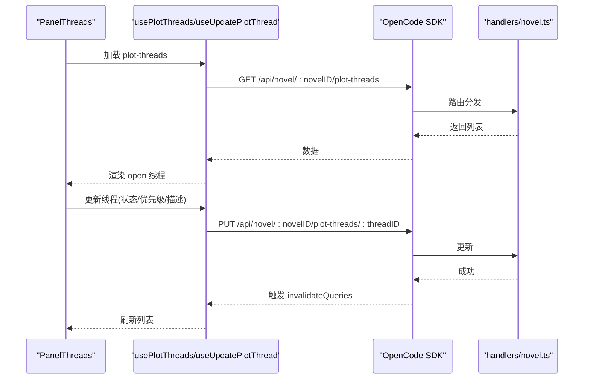
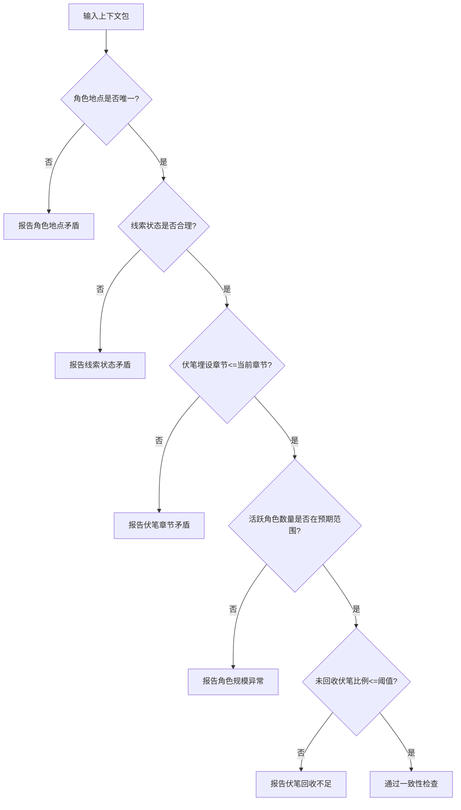

# 情节服务

<cite>
**本文引用的文件**   
- [packages/core/src/session/sql.ts](file://packages/core/src/session/sql.ts)
- [packages/server/src/handlers/novel.ts](file://packages/server/src/handlers/novel.ts)
- [packages/protocol/src/groups/novel.ts](file://packages/protocol/src/groups/novel.ts)
- [packages/app/src/context/novel-queries.ts](file://packages/app/src/context/novel-queries.ts)
- [packages/app/src/pages/novel/panel-threads.tsx](file://packages/app/src/pages/novel/panel-threads.tsx)
- [packages/opencode/src/server/routes/instance/httpapi/novel-reader.ts](file://packages/opencode/src/server/routes/instance/httpapi/novel-reader.ts)
- [packages/plugin/test/novel-writer/scale.test.ts](file://packages/plugin/test/novel-writer/scale.test.ts)
</cite>

## 目录
1. [简介](#简介)
2. [项目结构](#项目结构)
3. [核心组件](#核心组件)
4. [架构总览](#架构总览)
5. [详细组件分析](#详细组件分析)
6. [依赖关系分析](#依赖关系分析)
7. [性能考虑](#性能考虑)
8. [故障排查指南](#故障排查指南)
9. [结论](#结论)
10. [附录：API 参考](#附录api-参考)

## 简介
本文件为 openNovel 的“情节服务”提供系统化文档，聚焦于情节线索（plot threads）与伏笔（foreshadowing）的创建、管理与追踪机制。内容涵盖：
- 主线、副线、支线情节的组织与优先级管理
- 情节节点状态机（构思/发展中/完成/废弃等）及转换规则
- 与角色、章节的时间线关联
- 冲突检测与逻辑一致性检查
- 可视化展示与编辑的 API 接口说明

## 项目结构
围绕情节服务的代码分布在协议定义、服务端处理器、客户端查询与 UI 面板、以及数据库表结构等位置：
- 协议层：HTTP API 端点与输入输出类型定义
- 服务端：业务处理函数与存储调用
- 客户端：Solid Query hooks 与页面组件
- 数据层：SQLite 表结构与索引
- 读取器：面向读者的只读聚合接口

**图表来源** 
- [packages/app/src/pages/novel/panel-threads.tsx:1-30](file://packages/app/src/pages/novel/panel-threads.tsx#L1-L30)
- [packages/app/src/context/novel-queries.ts:155-178](file://packages/app/src/context/novel-queries.ts#L155-L178)
- [packages/protocol/src/groups/novel.ts:770-795](file://packages/protocol/src/groups/novel.ts#L770-L795)
- [packages/server/src/handlers/novel.ts:1148-1178](file://packages/server/src/handlers/novel.ts#L1148-L1178)
- [packages/core/src/session/sql.ts:336-373](file://packages/core/src/session/sql.ts#L336-L373)
- [packages/opencode/src/server/routes/instance/httpapi/novel-reader.ts:148-158](file://packages/opencode/src/server/routes/instance/httpapi/novel-reader.ts#L148-L158)

**章节来源**
- [packages/app/src/pages/novel/panel-threads.tsx:1-30](file://packages/app/src/pages/novel/panel-threads.tsx#L1-L30)
- [packages/app/src/context/novel-queries.ts:155-178](file://packages/app/src/context/novel-queries.ts#L155-L178)
- [packages/protocol/src/groups/novel.ts:770-795](file://packages/protocol/src/groups/novel.ts#L770-L795)
- [packages/server/src/handlers/novel.ts:1148-1178](file://packages/server/src/handlers/novel.ts#L1148-L1178)
- [packages/core/src/session/sql.ts:336-373](file://packages/core/src/session/sql.ts#L336-L373)
- [packages/opencode/src/server/routes/instance/httpapi/novel-reader.ts:148-158](file://packages/opencode/src/server/routes/instance/httpapi/novel-reader.ts#L148-L158)

## 核心组件
- 数据模型
  - 剧情线索表 plot_threads：id、novel_id、title、status、priority、description、created_at、closed_at
  - 伏笔表 foreshadowing：id、novel_id、planted_chapter_id、resolved_chapter_id、content、state、created_at
  - 章节摘要 chapter_summaries：chapter_id、summary、key_events、char_changes
  - 卷摘要 volume_summaries：volume_id、summary、char_active、char_dormant、threads_open、threads_closed
- 服务端处理器
  - createPlotThread/updatePlotThread/deletePlotThread
  - createForeshadowing/updateForeshadowing/deleteForeshadowing
- 客户端查询与 UI
  - usePlotThreads/useCreatePlotThread/useUpdatePlotThread/useDeletePlotThread
  - PanelThreads 面板：过滤 open 线程、编辑标题/优先级/描述、删除
- 读取器接口
  - GET /api/novels/:novelId/foreshadowing：返回 { foreshadowing, threads } 聚合数据

**章节来源**
- [packages/core/src/session/sql.ts:336-373](file://packages/core/src/session/sql.ts#L336-L373)
- [packages/server/src/handlers/novel.ts:1148-1178](file://packages/server/src/handlers/novel.ts#L1148-L1178)
- [packages/app/src/context/novel-queries.ts:155-178](file://packages/app/src/context/novel-queries.ts#L155-L178)
- [packages/app/src/pages/novel/panel-threads.tsx:1-30](file://packages/app/src/pages/novel/panel-threads.tsx#L1-L30)
- [packages/opencode/src/server/routes/instance/httpapi/novel-reader.ts:148-158](file://packages/opencode/src/server/routes/instance/httpapi/novel-reader.ts#L148-L158)

## 架构总览
下图展示了从前端到后端再到数据库的完整调用链路，以及读取器的只读聚合路径。

**图表来源** 
- [packages/app/src/pages/novel/panel-threads.tsx:1-30](file://packages/app/src/pages/novel/panel-threads.tsx#L1-L30)
- [packages/app/src/context/novel-queries.ts:155-178](file://packages/app/src/context/novel-queries.ts#L155-L178)
- [packages/protocol/src/groups/novel.ts:770-795](file://packages/protocol/src/groups/novel.ts#L770-L795)
- [packages/server/src/handlers/novel.ts:1148-1178](file://packages/server/src/handlers/novel.ts#L1148-L1178)
- [packages/opencode/src/server/routes/instance/httpapi/novel-reader.ts:148-158](file://packages/opencode/src/server/routes/instance/httpapi/novel-reader.ts#L148-L158)

## 详细组件分析

### 数据模型与状态机
- 剧情线索 plot_threads
  - 字段：id、novel_id、title、status、priority、description、created_at、closed_at
  - 状态 status：open（进行中）、closed（已关闭）。closed_at 记录关闭时间
  - 优先级 priority：high/medium/low，用于区分主线、副线、支线
- 伏笔 foreshadowing
  - 字段：id、novel_id、planted_chapter_id、resolved_chapter_id、content、state、created_at
  - 状态 state：planted（埋设）、resolved（回收）
- 章节摘要 chapter_summaries
  - 字段：chapter_id、summary、key_events、char_changes
  - 作用：将关键事件与角色变化与章节绑定，便于回溯
- 卷摘要 volume_summaries
  - 字段：volume_id、summary、char_active、char_dormant、threads_open、threads_closed
  - 作用：按卷维度压缩和汇总活跃/休眠角色与线索状态

**图表来源** 
- [packages/core/src/session/sql.ts:336-373](file://packages/core/src/session/sql.ts#L336-L373)
- [packages/core/src/session/sql.ts:396-426](file://packages/core/src/session/sql.ts#L396-L426)

**章节来源**
- [packages/core/src/session/sql.ts:336-373](file://packages/core/src/session/sql.ts#L336-L373)
- [packages/core/src/session/sql.ts:396-426](file://packages/core/src/session/sql.ts#L396-L426)

### 服务端处理器与存储调用
- createPlotThread：校验小说存在，调用 storeCreatePlotThread，返回 toPlotThread
- updatePlotThread：校验小说存在，调用 storeUpdatePlotThread，返回 toPlotThread
- deletePlotThread：校验小说存在，调用 storeDeletePlotThread，返回 deleted:true
- createForeshadowing/updateForeshadowing/deleteForeshadowing：同理，操作 foreshadowing 表

**图表来源** 
- [packages/server/src/handlers/novel.ts:1148-1178](file://packages/server/src/handlers/novel.ts#L1148-L1178)

**章节来源**
- [packages/server/src/handlers/novel.ts:1148-1178](file://packages/server/src/handlers/novel.ts#L1148-L1178)

### 客户端查询与 UI 面板
- usePlotThreads：获取 plot-threads 列表
- useUpdatePlotThread：更新标题/状态/优先级/描述，成功后失效 plot-threads 缓存
- PanelThreads：过滤 open 线程，支持新增、编辑、删除

**图表来源** 
- [packages/app/src/context/novel-queries.ts:155-178](file://packages/app/src/context/novel-queries.ts#L155-L178)
- [packages/app/src/context/novel-queries.ts:1037-1066](file://packages/app/src/context/novel-queries.ts#L1037-L1066)
- [packages/app/src/pages/novel/panel-threads.tsx:1-30](file://packages/app/src/pages/novel/panel-threads.tsx#L1-L30)
- [packages/server/src/handlers/novel.ts:1148-1178](file://packages/server/src/handlers/novel.ts#L1148-L1178)

**章节来源**
- [packages/app/src/context/novel-queries.ts:155-178](file://packages/app/src/context/novel-queries.ts#L155-L178)
- [packages/app/src/context/novel-queries.ts:1037-1066](file://packages/app/src/context/novel-queries.ts#L1037-L1066)
- [packages/app/src/pages/novel/panel-threads.tsx:1-30](file://packages/app/src/pages/novel/panel-threads.tsx#L1-L30)

### 读取器聚合接口
- GET /api/novels/:novelId/foreshadowing：返回 { foreshadowing, threads } 聚合数据，便于读者侧统一展示

**章节来源**
- [packages/opencode/src/server/routes/instance/httpapi/novel-reader.ts:148-158](file://packages/opencode/src/server/routes/instance/httpapi/novel-reader.ts#L148-L158)

### 冲突检测与逻辑一致性检查
- 审计测试中定义了常见矛盾模式：
  - 角色地点矛盾（同一角色出现在多个不同地点）
  - 线索状态矛盾（高优先级线索被标记为 closed）
  - 伏笔埋设章节超出当前章节数
  - 角色规模异常（活跃角色过多）
  - 未回收伏笔比例过高
- 这些规则可用于在写入或生成上下文时进行前置校验，避免不一致状态落库

**图表来源** 
- [packages/plugin/test/novel-writer/scale.test.ts:364-442](file://packages/plugin/test/novel-writer/scale.test.ts#L364-L442)

**章节来源**
- [packages/plugin/test/novel-writer/scale.test.ts:364-442](file://packages/plugin/test/novel-writer/scale.test.ts#L364-L442)

### 时间线与章节关联
- 章节摘要 chapter_summaries 将 key_events 与 char_changes 与章节绑定
- 卷摘要 volume_summaries 汇总 threads_open/threads_closed，便于跨章节时间线概览
- 伏笔埋设/回收通过 planted_chapter_id/resolved_chapter_id 与章节建立时间线关联

**章节来源**
- [packages/core/src/session/sql.ts:396-426](file://packages/core/src/session/sql.ts#L396-L426)
- [packages/core/src/session/sql.ts:336-373](file://packages/core/src/session/sql.ts#L336-L373)

## 依赖关系分析
- 协议层依赖 handlers 实现；handlers 依赖 store_* 与 to* 映射；store_* 依赖 SQLite 表结构
- 客户端通过 OpenCode SDK 调用协议端点；hooks 使用 Solid Query 管理缓存与失效
- 读取器独立于写流程，仅聚合 foreshadowing 与 threads

**图表来源** 
- [packages/protocol/src/groups/novel.ts:770-795](file://packages/protocol/src/groups/novel.ts#L770-L795)
- [packages/server/src/handlers/novel.ts:1148-1178](file://packages/server/src/handlers/novel.ts#L1148-L1178)
- [packages/core/src/session/sql.ts:336-373](file://packages/core/src/session/sql.ts#L336-L373)
- [packages/opencode/src/server/routes/instance/httpapi/novel-reader.ts:148-158](file://packages/opencode/src/server/routes/instance/httpapi/novel-reader.ts#L148-L158)

**章节来源**
- [packages/protocol/src/groups/novel.ts:770-795](file://packages/protocol/src/groups/novel.ts#L770-L795)
- [packages/server/src/handlers/novel.ts:1148-1178](file://packages/server/src/handlers/novel.ts#L1148-L1178)
- [packages/core/src/session/sql.ts:336-373](file://packages/core/src/session/sql.ts#L336-L373)
- [packages/opencode/src/server/routes/instance/httpapi/novel-reader.ts:148-158](file://packages/opencode/src/server/routes/instance/httpapi/novel-reader.ts#L148-L158)

## 性能考虑
- 索引优化
  - plot_threads_novel_id_idx、plot_threads_status_idx
  - foreshadowing_novel_id_idx、foreshadowing_state_idx
  - chapter_summaries_chapter_id_idx、volume_summaries_volume_id_idx
- 只读聚合
  - novel-reader 聚合接口减少多次往返，提升读者端加载速度
- 缓存策略
  - Solid Query 的 queryKey 与 invalidateQueries 确保局部刷新，避免全量重拉

[本节为通用指导，不直接分析具体文件]

## 故障排查指南
- 常见问题定位
  - NovelNotFoundError：确认 novelID 有效且存在于数据库中
  - 状态不一致：检查 plot_threads.status 与 closed_at 是否匹配
  - 伏笔未回收：统计 foreshadowing.state=planted 的比例，必要时提示回收
  - 角色地点矛盾：审计 activeCharacters 的 location 唯一性
- 建议步骤
  - 使用 novel-reader 聚合接口验证数据一致性
  - 通过 hooks 的 onSuccess 回调观察缓存失效是否生效
  - 在写入前运行审计规则，提前拦截矛盾

**章节来源**
- [packages/server/src/handlers/novel.ts:1148-1178](file://packages/server/src/handlers/novel.ts#L1148-L1178)
- [packages/opencode/src/server/routes/instance/httpapi/novel-reader.ts:148-158](file://packages/opencode/src/server/routes/instance/httpapi/novel-reader.ts#L148-L158)
- [packages/plugin/test/novel-writer/scale.test.ts:364-442](file://packages/plugin/test/novel-writer/scale.test.ts#L364-L442)

## 结论
openNovel 的情节服务以清晰的表结构与分层架构实现了情节线索与伏笔的全生命周期管理。通过协议、处理器、存储与读取器的解耦设计，既保证了写操作的严谨性与一致性，也提供了高效的只读聚合能力。结合审计规则与缓存策略，可在大规模写作场景下维持良好的性能与可维护性。

[本节为总结，不直接分析具体文件]

## 附录：API 参考
- 创建情节线索
  - 方法：POST
  - 路径：/api/novel/:novelID/plot-threads
  - 入参：CreatePlotThreadInput（title、priority、description）
  - 返回：PlotThread
- 更新情节线索
  - 方法：PUT
  - 路径：/api/novel/:novelID/plot-threads/:threadID
  - 入参：UpdatePlotThreadInput（title、status、priority、description）
  - 返回：PlotThread
- 删除情节线索
  - 方法：DELETE
  - 路径：/api/novel/:novelID/plot-threads/:threadID
  - 返回：{ deleted: boolean }
- 获取情节线索列表
  - 方法：GET
  - 路径：/api/novel/:novelID/plot-threads
  - 返回：PlotThread[]
- 获取伏笔与线索聚合（读者）
  - 方法：GET
  - 路径：/api/novels/:novelId/foreshadowing
  - 返回：{ foreshadowing: Foreshadowing[], threads: PlotThread[] }

**章节来源**
- [packages/protocol/src/groups/novel.ts:770-795](file://packages/protocol/src/groups/novel.ts#L770-795)
- [packages/opencode/src/server/routes/instance/httpapi/novel-reader.ts:148-158](file://packages/opencode/src/server/routes/instance/httpapi/novel-reader.ts#L148-L158)