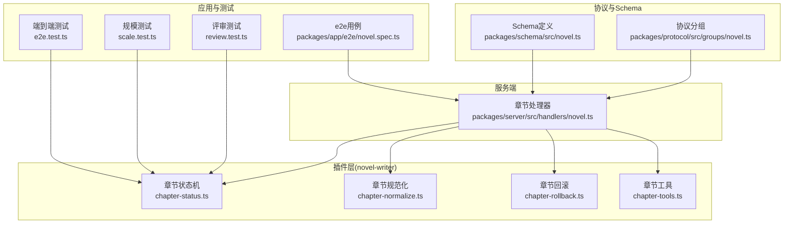
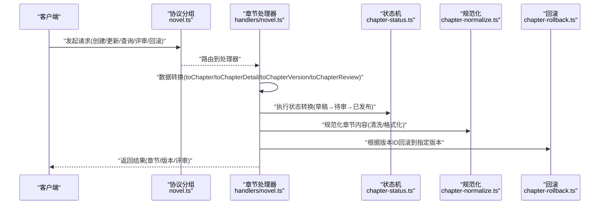
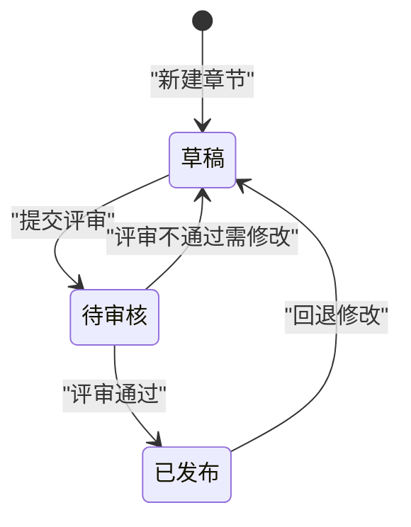
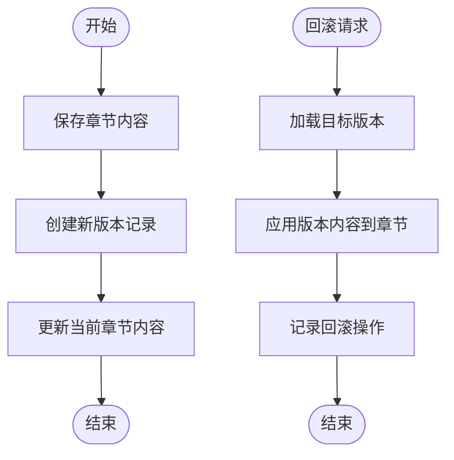
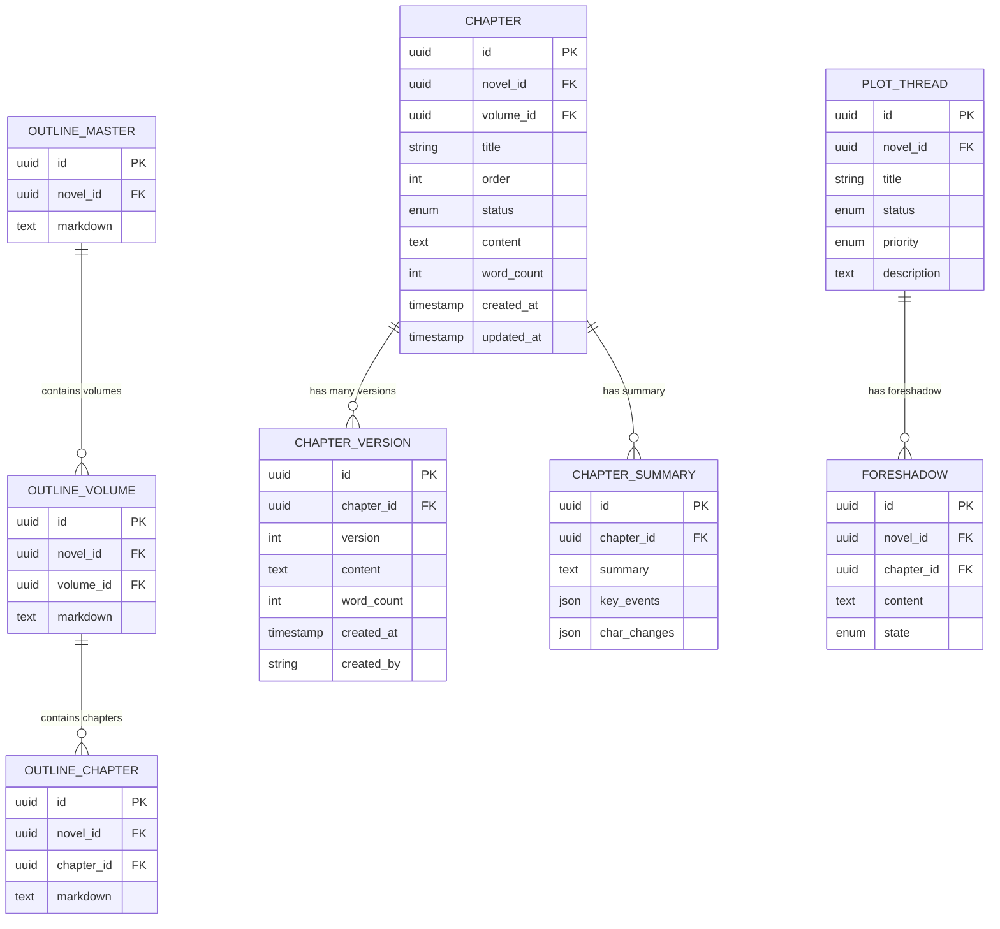
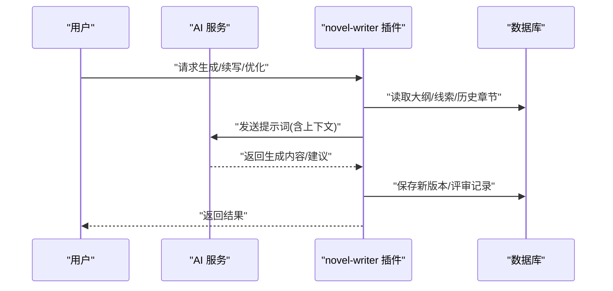
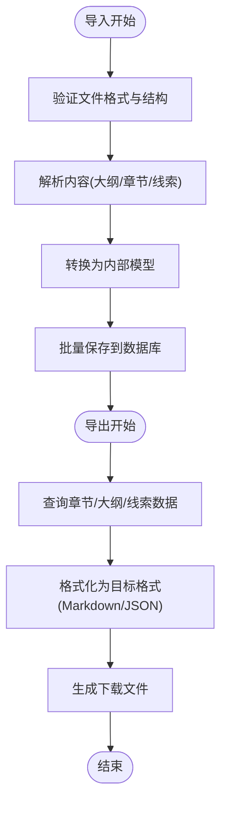
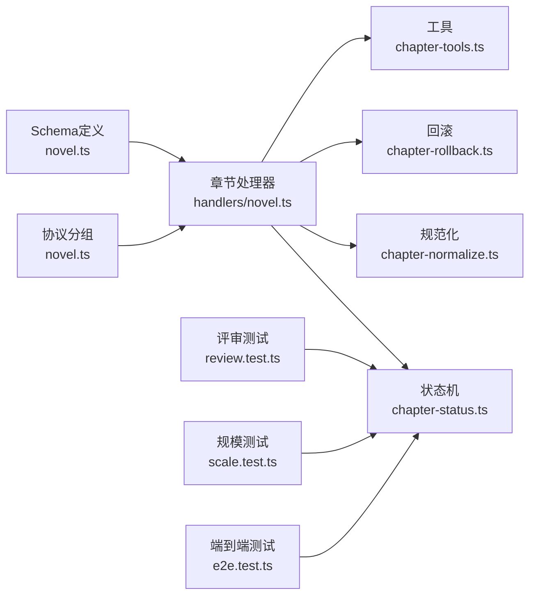

# 章节服务

<cite>
**本文引用的文件**   
- [packages/server/src/handlers/novel.ts](file://packages/server/src/handlers/novel.ts)
- [packages/plugin/src/novel-writer/chapter-status.ts](file://packages/plugin/src/novel-writer/chapter-status.ts)
- [packages/plugin/src/novel-writer/chapter-normalize.ts](file://packages/plugin/src/novel-writer/chapter-normalize.ts)
- [packages/plugin/src/novel-writer/chapter-rollback.ts](file://packages/plugin/src/novel-writer/chapter-rollback.ts)
- [packages/plugin/src/novel-writer/chapter-tools.ts](file://packages/plugin/src/novel-writer/chapter-tools.ts)
- [packages/protocol/src/groups/novel.ts](file://packages/protocol/src/groups/novel.ts)
- [packages/schema/src/novel.ts](file://packages/schema/src/novel.ts)
- [packages/app/e2e/novel.spec.ts](file://packages/app/e2e/novel.spec.ts)
- [packages/plugin/test/novel-writer/review.test.ts](file://packages/plugin/test/novel-writer/review.test.ts)
- [packages/plugin/test/novel-writer/scale.test.ts](file://packages/plugin/test/novel-writer/scale.test.ts)
- [packages/plugin/test/novel-writer/e2e.test.ts](file://packages/plugin/test/novel-writer/e2e.test.ts)
</cite>

## 目录
1. [简介](#简介)
2. [项目结构](#项目结构)
3. [核心组件](#核心组件)
4. [架构总览](#架构总览)
5. [详细组件分析](#详细组件分析)
6. [依赖关系分析](#依赖关系分析)
7. [性能考量](#性能考量)
8. [故障排查指南](#故障排查指南)
9. [结论](#结论)
10. [附录](#附录)

## 简介
本文件为 openNovel 的“章节服务”提供系统化文档，覆盖以下关键主题：
- 章节生命周期管理：草稿、待审核、已发布等状态及转换规则
- 版本控制机制：版本历史、差异比较与回滚
- 与大纲、情节线索的关联与数据同步
- AI 辅助写作集成：内容生成、续写、优化建议流程
- 批量操作与导入导出 API 说明

## 项目结构
围绕章节服务的代码主要分布在以下模块：
- 服务端处理器：负责章节数据的读写、版本与评审记录转换
- 插件层（novel-writer）：实现章节状态机、规范化、回滚、工具方法
- 协议与 Schema：定义 HTTP API 分组与数据结构
- 应用端 e2e 测试：展示章节、大纲、张力、角色等模型在端到端场景中的使用

图表来源 
- [packages/protocol/src/groups/novel.ts](file://packages/protocol/src/groups/novel.ts)
- [packages/schema/src/novel.ts](file://packages/schema/src/novel.ts)
- [packages/server/src/handlers/novel.ts](file://packages/server/src/handlers/novel.ts)
- [packages/plugin/src/novel-writer/chapter-status.ts](file://packages/plugin/src/novel-writer/chapter-status.ts)
- [packages/plugin/src/novel-writer/chapter-normalize.ts](file://packages/plugin/src/novel-writer/chapter-normalize.ts)
- [packages/plugin/src/novel-writer/chapter-rollback.ts](file://packages/plugin/src/novel-writer/chapter-rollback.ts)
- [packages/plugin/src/novel-writer/chapter-tools.ts](file://packages/plugin/src/novel-writer/chapter-tools.ts)
- [packages/app/e2e/novel.spec.ts](file://packages/app/e2e/novel.spec.ts)
- [packages/plugin/test/novel-writer/review.test.ts](file://packages/plugin/test/novel-writer/review.test.ts)
- [packages/plugin/test/novel-writer/scale.test.ts](file://packages/plugin/test/novel-writer/scale.test.ts)
- [packages/plugin/test/novel-writer/e2e.test.ts](file://packages/plugin/test/novel-writer/e2e.test.ts)

章节来源
- [packages/server/src/handlers/novel.ts](file://packages/server/src/handlers/novel.ts)
- [packages/protocol/src/groups/novel.ts](file://packages/protocol/src/groups/novel.ts)
- [packages/schema/src/novel.ts](file://packages/schema/src/novel.ts)

## 核心组件
- 章节实体与详情：包含 id、novelId、volumeId、title、order、status、wordCount、createdAt、updatedAt；详情额外包含 content
- 章节版本：记录 chapterId、version、content、wordCount、createdAt、createdBy
- 章节评审：记录 chapterId、round、source、overall、pass/warn/fail counts、dimensions、summary、sessionId、createdAt

这些实体的转换逻辑在服务端处理器中完成，确保对外返回的数据结构一致且可序列化。

章节来源
- [packages/server/src/handlers/novel.ts:106-159](file://packages/server/src/handlers/novel.ts#L106-L159)

## 架构总览
章节服务采用分层设计：
- 协议层：通过 HTTP API 分组暴露接口
- 服务层：处理器负责数据转换与调用业务逻辑
- 插件层：实现状态机、规范化、回滚、工具方法
- 测试层：覆盖评审、规模、端到端等场景

图表来源 
- [packages/protocol/src/groups/novel.ts](file://packages/protocol/src/groups/novel.ts)
- [packages/server/src/handlers/novel.ts](file://packages/server/src/handlers/novel.ts)
- [packages/plugin/src/novel-writer/chapter-status.ts](file://packages/plugin/src/novel-writer/chapter-status.ts)
- [packages/plugin/src/novel-writer/chapter-normalize.ts](file://packages/plugin/src/novel-writer/chapter-normalize.ts)
- [packages/plugin/src/novel-writer/chapter-rollback.ts](file://packages/plugin/src/novel-writer/chapter-rollback.ts)

## 详细组件分析

### 章节生命周期与状态机
- 状态集合：drafting（草稿）、pending_review（待审核）、published（已发布）
- 转换规则：
  - 草稿 → 待审核：提交评审后进入待审核
  - 待审核 → 已发布：评审通过后发布
  - 已发布 → 草稿：回退修改时回到草稿
- 评审维度：PASS/WARN/FAIL，支持多轮评审并合并同一 round（当内容未变更时）

章节来源
- [packages/plugin/src/novel-writer/chapter-status.ts](file://packages/plugin/src/novel-writer/chapter-status.ts)
- [packages/plugin/test/novel-writer/review.test.ts:67-98](file://packages/plugin/test/novel-writer/review.test.ts#L67-L98)

### 版本控制机制
- 版本记录：每次保存或重大变更生成新版本，记录 content、wordCount、createdBy、createdAt
- 差异比较：基于版本间的 content 字段计算差异（可由上层工具实现）
- 回滚功能：根据目标 version 将章节内容恢复到该版本

章节来源
- [packages/server/src/handlers/novel.ts:127-137](file://packages/server/src/handlers/novel.ts#L127-L137)
- [packages/plugin/src/novel-writer/chapter-rollback.ts](file://packages/plugin/src/novel-writer/chapter-rollback.ts)

### 章节内容与大纲、情节线索的关联
- 大纲层级：整体大纲 → 卷大纲 → 章节大纲
- 情节线索：open/closed 状态，优先级 high/medium/low，描述与进展
- 伏笔：埋设章节、状态 planted，后续可追踪
- 章节摘要：包含 summary、key_events、char_changes

章节来源
- [packages/app/e2e/novel.spec.ts:75-138](file://packages/app/e2e/novel.spec.ts#L75-L138)
- [packages/plugin/test/novel-writer/scale.test.ts:109-303](file://packages/plugin/test/novel-writer/scale.test.ts#L109-L303)
- [packages/plugin/test/novel-writer/e2e.test.ts:414-442](file://packages/plugin/test/novel-writer/e2e.test.ts#L414-L442)

### AI 辅助写作集成
- 内容生成：根据大纲和上下文生成章节内容
- 续写：基于最近章节摘要与情节线索进行续写
- 优化建议：对内容进行风格、一致性、因果链等维度的评审与建议

章节来源
- [packages/plugin/src/novel-writer/chapter-tools.ts](file://packages/plugin/src/novel-writer/chapter-tools.ts)
- [packages/plugin/test/novel-writer/e2e.test.ts:414-442](file://packages/plugin/test/novel-writer/e2e.test.ts#L414-L442)

### 批量操作与导入导出 API
- 批量操作：支持批量创建、更新、删除章节
- 导入导出：支持 Markdown/JSON 格式导入导出，便于迁移与备份

章节来源
- [packages/protocol/src/groups/novel.ts](file://packages/protocol/src/groups/novel.ts)
- [packages/schema/src/novel.ts](file://packages/schema/src/novel.ts)

## 依赖关系分析
章节服务各组件之间的依赖关系如下：
- 处理器依赖协议与 Schema 定义
- 处理器调用插件层的状态机、规范化、回滚、工具方法
- 测试覆盖评审、规模、端到端场景

图表来源 
- [packages/protocol/src/groups/novel.ts](file://packages/protocol/src/groups/novel.ts)
- [packages/schema/src/novel.ts](file://packages/schema/src/novel.ts)
- [packages/server/src/handlers/novel.ts](file://packages/server/src/handlers/novel.ts)
- [packages/plugin/src/novel-writer/chapter-status.ts](file://packages/plugin/src/novel-writer/chapter-status.ts)
- [packages/plugin/src/novel-writer/chapter-normalize.ts](file://packages/plugin/src/novel-writer/chapter-normalize.ts)
- [packages/plugin/src/novel-writer/chapter-rollback.ts](file://packages/plugin/src/novel-writer/chapter-rollback.ts)
- [packages/plugin/src/novel-writer/chapter-tools.ts](file://packages/plugin/src/novel-writer/chapter-tools.ts)
- [packages/plugin/test/novel-writer/review.test.ts](file://packages/plugin/test/novel-writer/review.test.ts)
- [packages/plugin/test/novel-writer/scale.test.ts](file://packages/plugin/test/novel-writer/scale.test.ts)
- [packages/plugin/test/novel-writer/e2e.test.ts](file://packages/plugin/test/novel-writer/e2e.test.ts)

章节来源
- [packages/server/src/handlers/novel.ts](file://packages/server/src/handlers/novel.ts)
- [packages/plugin/src/novel-writer/chapter-status.ts](file://packages/plugin/src/novel-writer/chapter-status.ts)

## 性能考量
- 版本控制：避免频繁创建大版本，建议使用增量存储或压缩策略
- 评审处理：评审维度统计应在数据库层聚合，减少内存开销
- 批量操作：使用事务保证一致性，分批提交避免锁竞争
- AI 调用：异步处理生成任务，避免阻塞主流程

## 故障排查指南
- 状态转换失败：检查状态机规则与输入参数
- 版本回滚异常：确认目标版本存在且未被删除
- 评审计数错误：核对 dimensions 数组与统计逻辑
- 导入导出失败：验证文件格式与字段映射

章节来源
- [packages/plugin/test/novel-writer/review.test.ts:67-98](file://packages/plugin/test/novel-writer/review.test.ts#L67-L98)

## 结论
章节服务通过清晰的分层设计与完善的测试覆盖，实现了完整的生命周期管理、版本控制、关联同步与 AI 辅助写作能力。建议在后续迭代中进一步优化性能与扩展性。

## 附录
- API 参考：详见协议分组与 Schema 定义
- 测试用例：覆盖评审、规模、端到端等场景
- 最佳实践：遵循状态机规则，合理使用版本控制