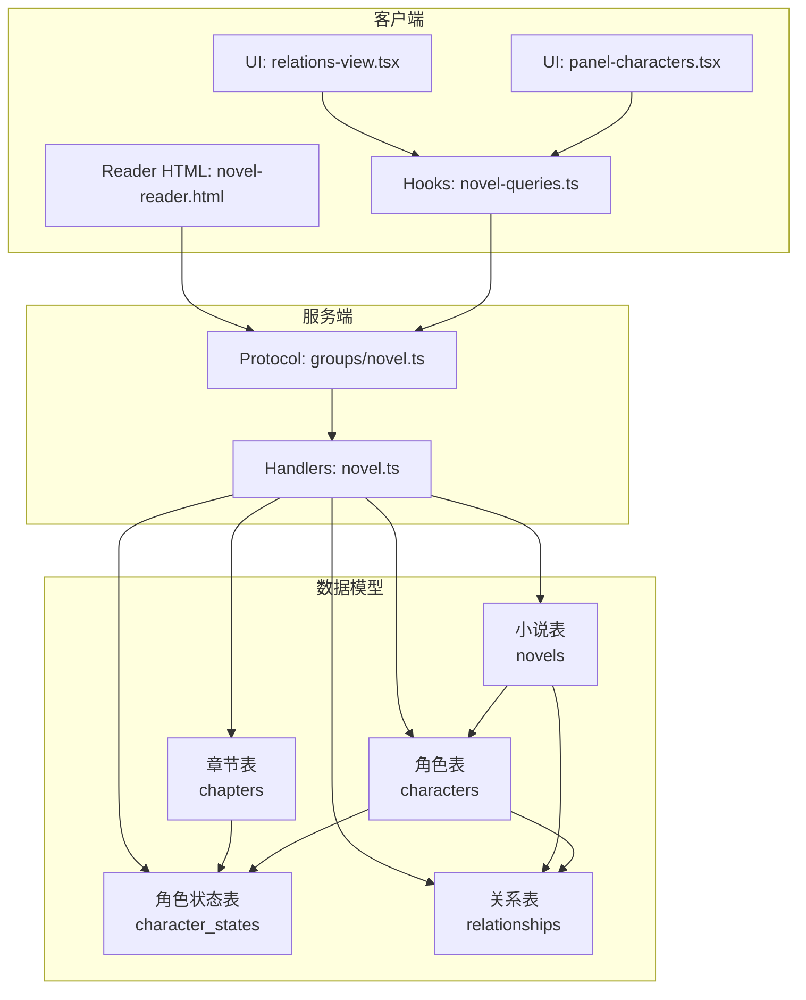
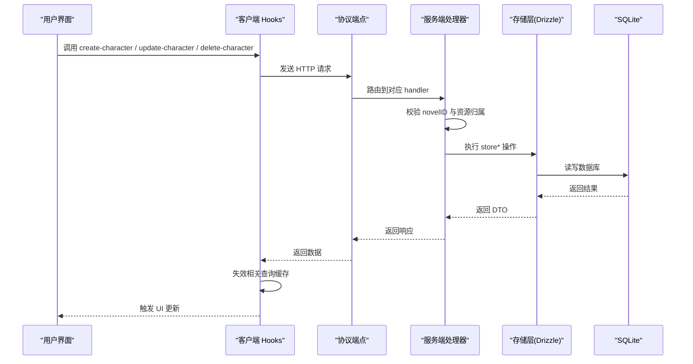
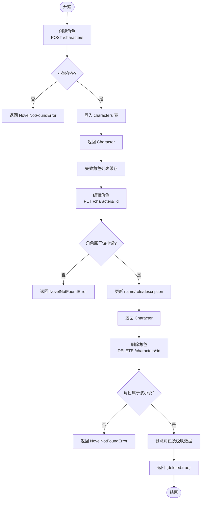
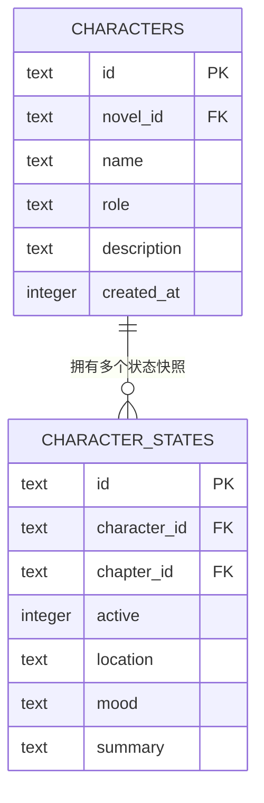
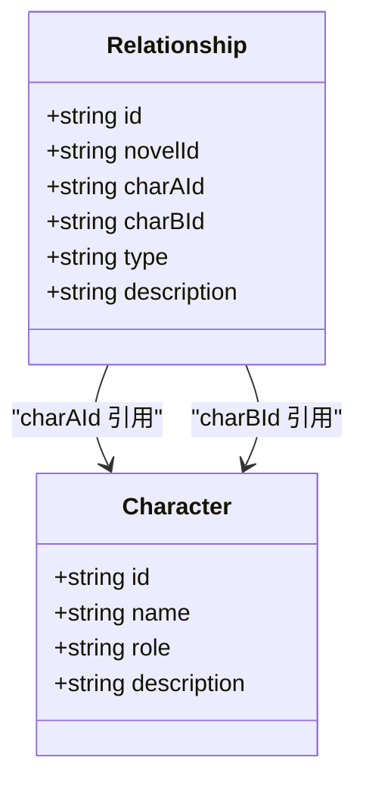
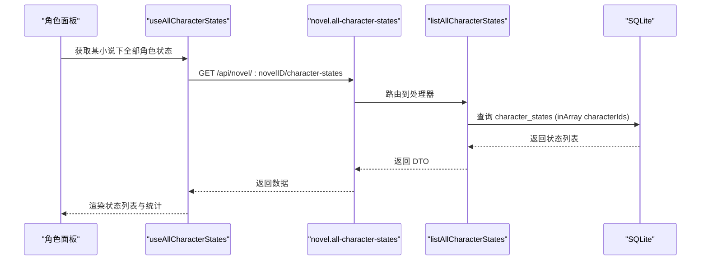
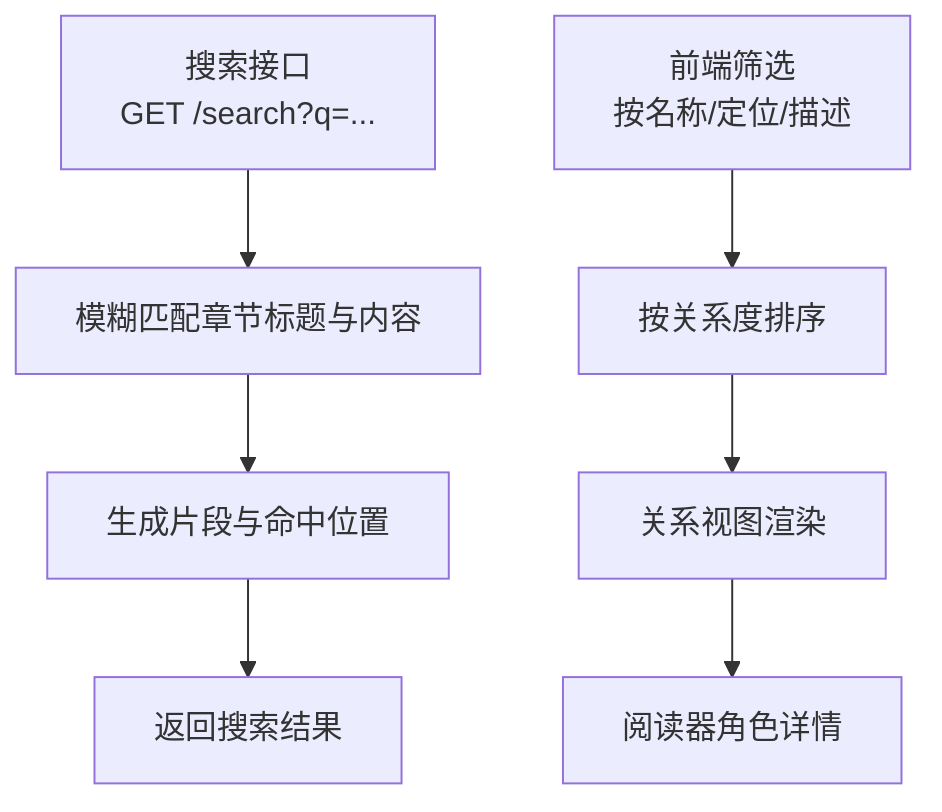
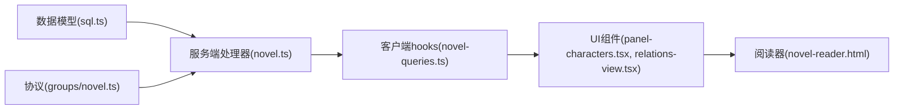

# 角色服务

<cite>
**本文档引用的文件**   
- [packages/core/src/session/sql.ts](file://packages/core/src/session/sql.ts)
- [packages/server/src/handlers/novel.ts](file://packages/server/src/handlers/novel.ts)
- [packages/protocol/src/groups/novel.ts](file://packages/protocol/src/groups/novel.ts)
- [packages/app/src/context/novel-queries.ts](file://packages/app/src/context/novel-queries.ts)
- [packages/app/src/pages/novel/panel-characters.tsx](file://packages/app/src/pages/novel/panel-characters.tsx)
- [packages/app/src/pages/novel/relations-view.tsx](file://packages/app/src/pages/novel/relations-view.tsx)
- [packages/opencode/src/server/routes/instance/httpapi/novel-reader.html](file://packages/opencode/src/server/routes/instance/httpapi/novel-reader.html)
</cite>

## 目录
1. [简介](#简介)
2. [项目结构](#项目结构)
3. [核心组件](#核心组件)
4. [架构总览](#架构总览)
5. [详细组件分析](#详细组件分析)
6. [依赖关系分析](#依赖关系分析)
7. [性能考量](#性能考量)
8. [故障排查指南](#故障排查指南)
9. [结论](#结论)
10. [附录](#附录)

## 简介
本文件为 openNovel 的“角色服务”提供完整、系统的技术文档。内容覆盖：
- 角色实体的全生命周期（创建、编辑、归档/删除）
- 角色属性管理系统（基本信息、外貌特征、性格特点、背景故事等结构化存储）
- 角色关系图谱建模与维护（亲属、朋友、敌对等复杂关系）
- 角色在章节中的出现追踪与出场统计
- 角色搜索、筛选与可视化接口说明

该服务基于 SQLite 持久化，通过 Effect + Drizzle ORM 实现数据访问，HTTP API 暴露统一接口，前端以 React/Solid 组件进行交互与可视化。

## 项目结构
围绕角色服务的代码分布在以下层次：
- 数据模型层：定义小说、卷、章节、角色、角色状态、关系等表结构
- 服务端处理层：将 HTTP 请求映射到领域操作，校验权限与归属，调用存储层
- 协议与类型层：声明 API 端点、输入输出结构与错误类型
- 客户端集成层：React/Solid hooks 封装查询与变更，驱动 UI 更新
- 展示层：角色面板、关系视图、阅读器内嵌的角色详情与关系展示

图表来源 
- [packages/core/src/session/sql.ts:272-334](file://packages/core/src/session/sql.ts#L272-L334)
- [packages/server/src/handlers/novel.ts:1251-1599](file://packages/server/src/handlers/novel.ts#L1251-L1599)
- [packages/protocol/src/groups/novel.ts:704-737](file://packages/protocol/src/groups/novel.ts#L704-L737)
- [packages/app/src/context/novel-queries.ts:882-951](file://packages/app/src/context/novel-queries.ts#L882-L951)
- [packages/app/src/pages/novel/panel-characters.tsx:40-383](file://packages/app/src/pages/novel/panel-characters.tsx#L40-L383)
- [packages/app/src/pages/novel/relations-view.tsx:365-397](file://packages/app/src/pages/novel/relations-view.tsx#L365-L397)
- [packages/opencode/src/server/routes/instance/httpapi/novel-reader.html:1610-1676](file://packages/opencode/src/server/routes/instance/httpapi/novel-reader.html#L1610-L1676)

章节来源
- [packages/core/src/session/sql.ts:272-334](file://packages/core/src/session/sql.ts#L272-L334)
- [packages/server/src/handlers/novel.ts:1251-1599](file://packages/server/src/handlers/novel.ts#L1251-L1599)
- [packages/protocol/src/groups/novel.ts:704-737](file://packages/protocol/src/groups/novel.ts#L704-L737)
- [packages/app/src/context/novel-queries.ts:882-951](file://packages/app/src/context/novel-queries.ts#L882-L951)
- [packages/app/src/pages/novel/panel-characters.tsx:40-383](file://packages/app/src/pages/novel/panel-characters.tsx#L40-L383)
- [packages/app/src/pages/novel/relations-view.tsx:365-397](file://packages/app/src/pages/novel/relations-view.tsx#L365-L397)
- [packages/opencode/src/server/routes/instance/httpapi/novel-reader.html:1610-1676](file://packages/opencode/src/server/routes/instance/httpapi/novel-reader.html#L1610-L1676)

## 核心组件
- 数据模型
  - 角色表：id、novel_id、name、role、description、created_at
  - 角色状态表：id、character_id、chapter_id、active、location、mood、summary
  - 关系表：id、novel_id、char_a_id、char_b_id、type、description
- 服务端处理器
  - 角色 CRUD：createCharacter、updateCharacter、deleteCharacter
  - 关系 CRUD：listRelationships、createRelationshipEndpoint、updateRelationshipEndpoint、deleteRelationshipEndpoint
  - 角色状态 CRUD：listCharacterStates、listAllCharacterStates、createCharacterStateEndpoint、updateCharacterStateEndpoint、deleteCharacterStateEndpoint
- 协议与类型
  - 定义角色、关系、角色状态的输入输出结构与错误类型
- 客户端集成
  - useCreateCharacter、useUpdateCharacter、useDeleteCharacter
  - useCreateCharacterState、useUpdateCharacterState、useDeleteCharacterState
  - useCharacters、useRelationships、useAllCharacterStates
- 展示与交互
  - 角色面板：列表、详情、编辑、描述渲染、状态管理、关系管理
  - 关系视图：按关系度排序、选择角色、显示直接关系数量徽标
  - 阅读器：角色卡片与详情、关系标签与描述

章节来源
- [packages/core/src/session/sql.ts:272-334](file://packages/core/src/session/sql.ts#L272-L334)
- [packages/server/src/handlers/novel.ts:867-1103](file://packages/server/src/handlers/novel.ts#L867-L1103)
- [packages/protocol/src/groups/novel.ts:704-737](file://packages/protocol/src/groups/novel.ts#L704-L737)
- [packages/app/src/context/novel-queries.ts:720-951](file://packages/app/src/context/novel-queries.ts#L720-L951)
- [packages/app/src/pages/novel/panel-characters.tsx:278-468](file://packages/app/src/pages/novel/panel-characters.tsx#L278-L468)
- [packages/app/src/pages/novel/relations-view.tsx:365-397](file://packages/app/src/pages/novel/relations-view.tsx#L365-L397)
- [packages/opencode/src/server/routes/instance/httpapi/novel-reader.html:1610-1676](file://packages/opencode/src/server/routes/instance/httpapi/novel-reader.html#L1610-L1676)

## 架构总览
角色服务采用分层架构：
- 协议层：使用 Effect HTTP API 定义端点与类型
- 处理层：路由到具体函数，校验小说归属与资源存在性，调用存储层
- 存储层：Drizzle ORM 操作 SQLite，维护角色、状态、关系等表
- 客户端层：React/Solid hooks 封装查询与变更，自动失效缓存并刷新 UI
- 展示层：面板与关系视图提供增删改查与可视化

图表来源 
- [packages/protocol/src/groups/novel.ts:704-737](file://packages/protocol/src/groups/novel.ts#L704-L737)
- [packages/server/src/handlers/novel.ts:1251-1599](file://packages/server/src/handlers/novel.ts#L1251-L1599)
- [packages/app/src/context/novel-queries.ts:882-951](file://packages/app/src/context/novel-queries.ts#L882-L951)

章节来源
- [packages/protocol/src/groups/novel.ts:704-737](file://packages/protocol/src/groups/novel.ts#L704-L737)
- [packages/server/src/handlers/novel.ts:1251-1599](file://packages/server/src/handlers/novel.ts#L1251-L1599)
- [packages/app/src/context/novel-queries.ts:882-951](file://packages/app/src/context/novel-queries.ts#L882-L951)

## 详细组件分析

### 角色实体生命周期
- 创建
  - 客户端通过 useCreateCharacter 发起 POST /api/novel/:novelID/characters
  - 服务端校验 novel 存在后，调用 storeCreateCharacter 写入 characters 表
  - 返回 Character DTO，客户端失效 character 列表缓存
- 编辑
  - 客户端通过 useUpdateCharacter 发起 PUT /api/novel/:novelID/characters/:characterID
  - 服务端校验归属后，调用 storeUpdateCharacter 更新 name/role/description
  - 返回更新后的 Character DTO
- 删除
  - 客户端通过 useDeleteCharacter 发起 DELETE /api/novel/:novelID/characters/:characterID
  - 服务端校验归属后，调用 storeDeleteCharacter 删除角色及其级联数据
  - 返回 { deleted: true }，客户端失效列表缓存

图表来源 
- [packages/protocol/src/groups/novel.ts:704-737](file://packages/protocol/src/groups/novel.ts#L704-L737)
- [packages/server/src/handlers/novel.ts:1073-1103](file://packages/server/src/handlers/novel.ts#L1073-L1103)
- [packages/app/src/context/novel-queries.ts:882-951](file://packages/app/src/context/novel-queries.ts#L882-L951)

章节来源
- [packages/protocol/src/groups/novel.ts:704-737](file://packages/protocol/src/groups/novel.ts#L704-L737)
- [packages/server/src/handlers/novel.ts:1073-1103](file://packages/server/src/handlers/novel.ts#L1073-L1103)
- [packages/app/src/context/novel-queries.ts:882-951](file://packages/app/src/context/novel-queries.ts#L882-L951)

### 角色属性管理系统
- 基本字段
  - name：角色名称
  - role：角色定位/身份（如主角、配角、反派等）
  - description：背景故事与设定（支持 Markdown 渲染）
- 扩展属性（通过角色状态表）
  - location：当前所在地点
  - mood：情绪状态
  - summary：章节摘要或状态总结
  - active：是否活跃参与当前章节
  - chapter_id：关联章节，用于追踪出场与快照

图表来源 
- [packages/core/src/session/sql.ts:272-310](file://packages/core/src/session/sql.ts#L272-L310)

章节来源
- [packages/core/src/session/sql.ts:272-310](file://packages/core/src/session/sql.ts#L272-L310)
- [packages/server/src/handlers/novel.ts:231-241](file://packages/server/src/handlers/novel.ts#L231-L241)
- [packages/app/src/pages/novel/panel-characters.tsx:363-468](file://packages/app/src/pages/novel/panel-characters.tsx#L363-L468)

### 角色关系图谱建模与维护
- 关系表字段
  - char_a_id、char_b_id：双向关系两端角色
  - type：关系类型（如“道侣”、“朋友”、“敌对”等）
  - description：关系描述
- 关系操作
  - 列出关系：GET /api/novel/:novelID/relationships
  - 创建关系：POST /api/novel/:novelID/relationships
  - 更新关系：PUT /api/novel/:novelID/relationships/:relationshipID
  - 删除关系：DELETE /api/novel/:novelID/relationships/:relationshipID
- 前端展示
  - 关系视图按每个角色的直接关系数量排序，并在徽标中显示度数
  - 角色详情面板可添加/删除关系，并显示关系类型与描述

图表来源 
- [packages/core/src/session/sql.ts:312-334](file://packages/core/src/session/sql.ts#L312-L334)
- [packages/server/src/handlers/novel.ts:220-229](file://packages/server/src/handlers/novel.ts#L220-L229)
- [packages/app/src/pages/novel/relations-view.tsx:365-397](file://packages/app/src/pages/novel/relations-view.tsx#L365-L397)
- [packages/app/src/pages/novel/panel-characters.tsx:568-651](file://packages/app/src/pages/novel/panel-characters.tsx#L568-L651)

章节来源
- [packages/core/src/session/sql.ts:312-334](file://packages/core/src/session/sql.ts#L312-L334)
- [packages/server/src/handlers/novel.ts:867-911](file://packages/server/src/handlers/novel.ts#L867-L911)
- [packages/app/src/pages/novel/relations-view.tsx:365-397](file://packages/app/src/pages/novel/relations-view.tsx#L365-L397)
- [packages/app/src/pages/novel/panel-characters.tsx:568-651](file://packages/app/src/pages/novel/panel-characters.tsx#L568-L651)

### 角色在章节中的出现追踪与出场统计
- 数据结构
  - character_states 表记录每章的角色状态快照，包含 active、location、mood、summary、chapter_id
- 查询能力
  - listCharacterStates：按角色列出所有状态
  - listAllCharacterStates：按小说列出所有角色的状态
- 前端使用
  - panel-characters.tsx 中 StatesSection 负责新增/更新/删除状态，并过滤当前章节的状态用于统计

图表来源 
- [packages/server/src/handlers/novel.ts:927-946](file://packages/server/src/handlers/novel.ts#L927-L946)
- [packages/app/src/pages/novel/panel-characters.tsx:440-468](file://packages/app/src/pages/novel/panel-characters.tsx#L440-L468)

章节来源
- [packages/core/src/session/sql.ts:290-310](file://packages/core/src/session/sql.ts#L290-L310)
- [packages/server/src/handlers/novel.ts:927-946](file://packages/server/src/handlers/novel.ts#L927-L946)
- [packages/app/src/pages/novel/panel-characters.tsx:440-468](file://packages/app/src/pages/novel/panel-characters.tsx#L440-L468)

### 角色搜索、筛选与可视化接口
- 搜索
  - 全文搜索接口：GET /api/novel/:novelID/search?q=...
  - 服务端在章节标题与内容中进行模糊匹配，返回片段与章节信息
- 筛选
  - 前端根据角色名、角色定位、描述进行本地筛选与排序
- 可视化
  - 关系视图按关系度排序，显示徽标计数
  - 阅读器内嵌角色卡片与详情，展示角色头像、定位标签、描述与关系列表

图表来源 
- [packages/protocol/src/groups/novel.ts:621-639](file://packages/protocol/src/groups/novel.ts#L621-L639)
- [packages/server/src/handlers/novel.ts:1014-1041](file://packages/server/src/handlers/novel.ts#L1014-L1041)
- [packages/app/src/pages/novel/relations-view.tsx:365-397](file://packages/app/src/pages/novel/relations-view.tsx#L365-L397)
- [packages/opencode/src/server/routes/instance/httpapi/novel-reader.html:1610-1676](file://packages/opencode/src/server/routes/instance/httpapi/novel-reader.html#L1610-L1676)

章节来源
- [packages/protocol/src/groups/novel.ts:621-639](file://packages/protocol/src/groups/novel.ts#L621-L639)
- [packages/server/src/handlers/novel.ts:1014-1041](file://packages/server/src/handlers/novel.ts#L1014-L1041)
- [packages/app/src/pages/novel/relations-view.tsx:365-397](file://packages/app/src/pages/novel/relations-view.tsx#L365-L397)
- [packages/opencode/src/server/routes/instance/httpapi/novel-reader.html:1610-1676](file://packages/opencode/src/server/routes/instance/httpapi/novel-reader.html#L1610-L1676)

## 依赖关系分析
- 数据模型依赖
  - characters 被 character_states 与 relationships 外键引用，删除时级联清理
  - chapters 被 character_states 引用，确保状态快照与章节关联
- 服务端依赖
  - handlers/novel.ts 引入 Drizzle ORM 与存储层函数，完成 CRUD
  - protocol 定义端点与类型，保证前后端契约一致
- 客户端依赖
  - hooks 封装查询与变更，使用 queryClient.invalidateQueries 保持数据一致性
  - UI 组件消费 hooks 提供的数据与动作，驱动交互

图表来源 
- [packages/core/src/session/sql.ts:272-334](file://packages/core/src/session/sql.ts#L272-L334)
- [packages/server/src/handlers/novel.ts:1251-1599](file://packages/server/src/handlers/novel.ts#L1251-L1599)
- [packages/protocol/src/groups/novel.ts:704-737](file://packages/protocol/src/groups/novel.ts#L704-L737)
- [packages/app/src/context/novel-queries.ts:882-951](file://packages/app/src/context/novel-queries.ts#L882-L951)
- [packages/app/src/pages/novel/panel-characters.tsx:40-383](file://packages/app/src/pages/novel/panel-characters.tsx#L40-L383)
- [packages/app/src/pages/novel/relations-view.tsx:365-397](file://packages/app/src/pages/novel/relations-view.tsx#L365-L397)
- [packages/opencode/src/server/routes/instance/httpapi/novel-reader.html:1610-1676](file://packages/opencode/src/server/routes/instance/httpapi/novel-reader.html#L1610-L1676)

章节来源
- [packages/core/src/session/sql.ts:272-334](file://packages/core/src/session/sql.ts#L272-L334)
- [packages/server/src/handlers/novel.ts:1251-1599](file://packages/server/src/handlers/novel.ts#L1251-L1599)
- [packages/protocol/src/groups/novel.ts:704-737](file://packages/protocol/src/groups/novel.ts#L704-L737)
- [packages/app/src/context/novel-queries.ts:882-951](file://packages/app/src/context/novel-queries.ts#L882-L951)
- [packages/app/src/pages/novel/panel-characters.tsx:40-383](file://packages/app/src/pages/novel/panel-characters.tsx#L40-L383)
- [packages/app/src/pages/novel/relations-view.tsx:365-397](file://packages/app/src/pages/novel/relations-view.tsx#L365-L397)
- [packages/opencode/src/server/routes/instance/httpapi/novel-reader.html:1610-1676](file://packages/opencode/src/server/routes/instance/httpapi/novel-reader.html#L1610-L1676)

## 性能考量
- 索引优化
  - characters_novel_id_idx、character_states_character_id_idx、character_states_chapter_id_idx、relationships_*_idx 提升查询效率
- 批量查询
  - listAllCharacterStates 使用 inArray 批量过滤，减少多次往返
- 缓存策略
  - 客户端使用 queryClient.invalidateQueries 精准失效，避免全量刷新
- 前端计算
  - 关系度计算使用 Map 累加，时间复杂度 O(R)，R 为关系数量

[本节为通用指导，无需特定文件来源]

## 故障排查指南
- 常见错误
  - NovelNotFoundError：小说不存在或资源不属于该小说
  - ChapterNotFoundError：章节不存在或不属于该小说
  - NovelValidationError：输入校验失败（如 genre 不合法）
- 排查步骤
  - 检查 novelID 是否正确传递
  - 确认角色/关系/状态是否存在且归属正确
  - 查看服务端日志与数据库约束（外键、索引）
  - 验证前端缓存失效逻辑是否生效

章节来源
- [packages/server/src/handlers/novel.ts:287-309](file://packages/server/src/handlers/novel.ts#L287-L309)
- [packages/protocol/src/groups/novel.ts:54-80](file://packages/protocol/src/groups/novel.ts#L54-L80)

## 结论
openNovel 的角色服务通过清晰的分层设计与完善的 API 契约，实现了角色全生命周期管理、结构化属性存储、关系图谱建模与章节出场追踪。前端提供了丰富的交互与可视化能力，后端通过索引与批量查询保障性能。整体架构可扩展性强，便于后续增加更多角色维度与关系类型。

[本节为总结，无需特定文件来源]

## 附录
- 关键接口清单
  - 角色：create/update/delete/list
  - 关系：create/update/delete/list
  - 角色状态：create/update/delete/list/all
  - 搜索：GET /search?q=...
- 数据模型要点
  - 外键级联删除确保数据一致性
  - 索引覆盖常用查询路径
  - 状态快照支持章节维度的角色追踪

[本节为补充信息，无需特定文件来源]