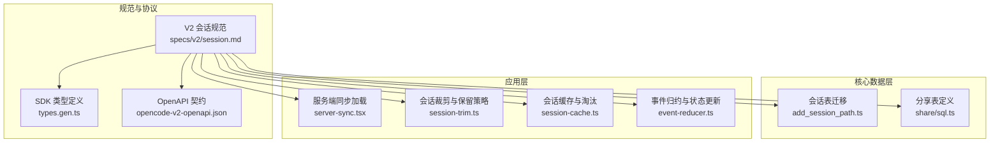
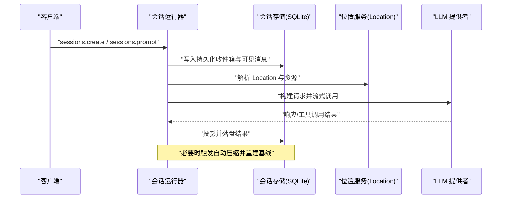
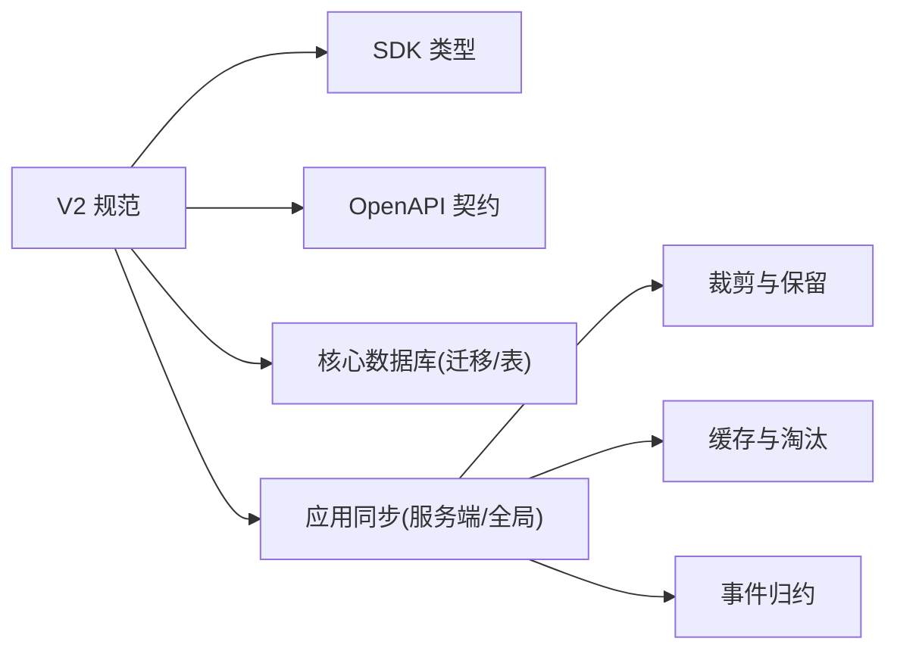
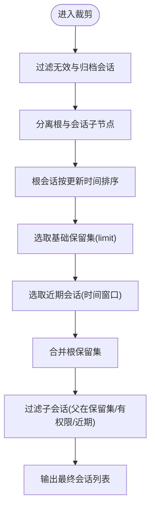

# 会话管理

<cite>
**本文引用的文件**   
- [specs/v2/session.md](file://specs/v2/session.md)
- [packages/core/src/database/migration/20260428004200_add_session_path.ts](file://packages/core/src/database/migration/20260428004200_add_session_path.ts)
- [packages/core/src/share/sql.ts](file://packages/core/src/share/sql.ts)
- [packages/app/src/context/server-sync.tsx](file://packages/app/src/context/server-sync.tsx)
- [packages/app/src/context/global-sync/session-trim.ts](file://packages/app/src/context/global-sync/session-trim.ts)
- [packages/app/src/context/global-sync/session-cache.ts](file://packages/app/src/context/global-sync/session-cache.ts)
- [packages/app/src/context/global-sync/event-reducer.ts](file://packages/app/src/context/global-sync/event-reducer.ts)
- [packages/sdk/js/src/v2/gen/types.gen.ts](file://packages/sdk/js/src/v2/gen/types.gen.ts)
- [packages/schema/src/session-compaction-event.ts](file://packages/schema/src/session-compaction-event.ts)
- [packages/codemode/test/fixtures/opencode-v2-openapi.json](file://packages/codemode/test/fixtures/opencode-v2-openapi.json)
- [packages/plugin/test/novel-writer/db-consistency.test.ts](file://packages/plugin/test/novel-writer/db-consistency.test.ts)
</cite>

## 目录
1. [简介](#简介)
2. [项目结构](#项目结构)
3. [核心组件](#核心组件)
4. [架构总览](#架构总览)
5. [详细组件分析](#详细组件分析)
6. [依赖关系分析](#依赖关系分析)
7. [性能考量](#性能考量)
8. [故障排查指南](#故障排查指南)
9. [结论](#结论)
10. [附录](#附录)

## 简介
本文件面向 openNovel 的会话管理系统，系统化阐述会话生命周期（创建、更新、过期与清理）、存储策略（内存、文件与可扩展至 Redis 集群）、序列化与安全、分布式同步与一致性保证、监控统计与性能优化，以及安全最佳实践（会话劫持防护、CSRF 保护等）。文档以仓库现有实现为依据，结合 V2 规范与事件模型进行说明。

## 项目结构
与会话相关的代码分布在以下层次：
- 规范层：V2 会话规范定义事件、执行流、上下文时区与自动压缩等语义。
- 核心数据层：数据库迁移与表结构（会话表扩展 path 字段、分享表等）。
- 应用层：服务端同步、全局状态同步、事件归约、会话裁剪与缓存淘汰。
- SDK/协议层：类型定义、OpenAPI 契约、事件流格式。
- 插件与测试：持久化路径约定与行为验证。

图表来源
- [specs/v2/session.md](file://specs/v2/session.md)
- [packages/sdk/js/src/v2/gen/types.gen.ts](file://packages/sdk/js/src/v2/gen/types.gen.ts)
- [packages/codemode/test/fixtures/opencode-v2-openapi.json](file://packages/codemode/test/fixtures/opencode-v2-openapi.json)
- [packages/core/src/database/migration/20260428004200_add_session_path.ts](file://packages/core/src/database/migration/20260428004200_add_session_path.ts)
- [packages/core/src/share/sql.ts](file://packages/core/src/share/sql.ts)
- [packages/app/src/context/server-sync.tsx](file://packages/app/src/context/server-sync.tsx)
- [packages/app/src/context/global-sync/session-trim.ts](file://packages/app/src/context/global-sync/session-trim.ts)
- [packages/app/src/context/global-sync/session-cache.ts](file://packages/app/src/context/global-sync/session-cache.ts)
- [packages/app/src/context/global-sync/event-reducer.ts](file://packages/app/src/context/global-sync/event-reducer.ts)

章节来源
- [specs/v2/session.md](file://specs/v2/session.md)
- [packages/core/src/database/migration/20260428004200_add_session_path.ts](file://packages/core/src/database/migration/20260428004200_add_session_path.ts)
- [packages/core/src/share/sql.ts](file://packages/core/src/share/sql.ts)
- [packages/app/src/context/server-sync.tsx](file://packages/app/src/context/server-sync.tsx)
- [packages/app/src/context/global-sync/session-trim.ts](file://packages/app/src/context/global-sync/session-trim.ts)
- [packages/app/src/context/global-sync/session-cache.ts](file://packages/app/src/context/global-sync/session-cache.ts)
- [packages/app/src/context/global-sync/event-reducer.ts](file://packages/app/src/context/global-sync/event-reducer.ts)

## 核心组件
- 会话生命周期与执行
  - 创建与准入：通过 sessions.create 生成或复用会话 ID；sessions.prompt 将用户输入纳入持久化收件箱并可选择立即调度执行。
  - 中断与恢复：sessions.interrupt 停止当前进程内执行，保留持久化收件箱以便后续唤醒；sessions.active 返回当前进程的前台会话快照。
  - 执行路由：基于 SessionExecution.resume -> SessionStore.get -> LocationServiceMap.get -> SessionRunner.run 的路径定位与运行。
- 上下文与时区
  - Context Epoch 保存不可变提供者缓存基线与结构化快照，随变更以时序消息推进，原子性提交。
- 自动压缩
  - 在每次提供者轮次前估算请求大小，超过预算则触发压缩；压缩过程发布 started/ended 事件，完成后重建基线并重试原轮次。
- 事件与回放
  - session.next.* 事件族提供可重放与实时订阅能力；历史 API 提供有限分页读取。

章节来源
- [specs/v2/session.md](file://specs/v2/session.md)

## 架构总览
下图展示从客户端到运行器的关键交互，包括准入、执行、上下文对齐与压缩流程。

图表来源
- [specs/v2/session.md](file://specs/v2/session.md)

## 详细组件分析

### 会话生命周期管理
- 创建
  - sessions.create 支持传入或自动生成会话 ID；重复 ID 返回已有身份。
  - sessions.prompt 生成消息 ID 并插入持久化收件箱；支持 resume 控制是否立即调度执行。
- 更新与可见性
  - 通过 PromptAdmitted 记录已接纳输入，随后由 runner 投影为可见的用户消息，并在同一事件事务中标记入队行已提升。
- 中断与恢复
  - sessions.interrupt 停止当前进程内的活跃执行，等待清理与结算，保留收件箱以供后续唤醒；对空闲或缺失会话为无操作。
- 活动状态
  - sessions.active 仅返回当前进程拥有的前台会话 ID 快照，重启后不持久。

章节来源
- [specs/v2/session.md](file://specs/v2/session.md)

### 会话存储策略（内存、文件、可扩展至 Redis）
- 文件存储（SQLite）
  - 会话表存在迁移以扩展 path 字段，用于标识会话所在路径。
  - 分享功能使用独立的 session_share 表，包含 secret、url 等字段。
- 内存存储
  - 应用层维护会话列表、状态、消息、权限等缓存，配合裁剪与淘汰策略控制内存占用。
- 可扩展至 Redis 集群
  - 当前仓库未直接实现 Redis 存储；可通过统一存储抽象替换底层适配器，保持事务与迁移语义一致。

章节来源
- [packages/core/src/database/migration/20260428004200_add_session_path.ts](file://packages/core/src/database/migration/20260428004200_add_session_path.ts)
- [packages/core/src/share/sql.ts](file://packages/core/src/share/sql.ts)
- [packages/plugin/test/novel-writer/db-consistency.test.ts](file://packages/plugin/test/novel-writer/db-consistency.test.ts)

### 会话数据的序列化、加密与安全考虑
- 序列化
  - 事件与类型由 SDK 类型定义与 OpenAPI 契约约束，确保跨端一致性与可回放性。
- 加密与安全
  - 分享表包含 secret 字段，用于访问控制；具体加密策略需结合传输层与存储层配置。
  - 建议启用 HTTPS、设置安全的 Cookie/Token 策略、最小权限原则与审计日志。

章节来源
- [packages/sdk/js/src/v2/gen/types.gen.ts](file://packages/sdk/js/src/v2/gen/types.gen.ts)
- [packages/codemode/test/fixtures/opencode-v2-openapi.json](file://packages/codemode/test/fixtures/opencode-v2-openapi.json)
- [packages/core/src/share/sql.ts](file://packages/core/src/share/sql.ts)

### 分布式环境下的会话同步与一致性保证
- 事件回放与尾读
  - session.next.* 事件族支持重放与实时订阅；历史 API 提供有限分页，游标基于持久化序列号。
- 并发与协调
  - 进程级 SessionRunCoordinator 串行化本地会话执行，不同会话可并发运行；中断不影响持久化收件箱。
- 一致性
  - 投影与落盘在同一事务边界完成；压缩前后基线重建保证上下文一致性。

章节来源
- [specs/v2/session.md](file://specs/v2/session.md)

### 会话监控、统计分析与性能优化
- 监控点
  - 观察延迟、不可用源、竞争、基线大小、时序更新增长等指标。
- 优化策略
  - 自动压缩避免上下文溢出；批量合并投递与队列限制防止无限增长；按需加载与裁剪减少渲染压力。

章节来源
- [specs/v2/session.md](file://specs/v2/session.md)

### 安全最佳实践（会话劫持防护、CSRF 保护）
- 传输安全
  - 强制 HTTPS、启用 HSTS、严格证书校验。
- 认证与授权
  - 使用短期 Token、刷新机制、最小权限与细粒度授权检查。
- CSRF 防护
  - 同源策略、SameSite Cookie、双重提交令牌或自定义头校验。
- 会话固定与劫持防护
  - 登录后重新生成会话标识、绑定用户代理指纹、异常检测与主动失效。

[本节为通用安全指导，不直接分析具体文件]

## 依赖关系分析

图表来源
- [specs/v2/session.md](file://specs/v2/session.md)
- [packages/sdk/js/src/v2/gen/types.gen.ts](file://packages/sdk/js/src/v2/gen/types.gen.ts)
- [packages/codemode/test/fixtures/opencode-v2-openapi.json](file://packages/codemode/test/fixtures/opencode-v2-openapi.json)
- [packages/core/src/database/migration/20260428004200_add_session_path.ts](file://packages/core/src/database/migration/20260428004200_add_session_path.ts)
- [packages/core/src/share/sql.ts](file://packages/core/src/share/sql.ts)
- [packages/app/src/context/server-sync.tsx](file://packages/app/src/context/server-sync.tsx)
- [packages/app/src/context/global-sync/session-trim.ts](file://packages/app/src/context/global-sync/session-trim.ts)
- [packages/app/src/context/global-sync/session-cache.ts](file://packages/app/src/context/global-sync/session-cache.ts)
- [packages/app/src/context/global-sync/event-reducer.ts](file://packages/app/src/context/global-sync/event-reducer.ts)

章节来源
- [specs/v2/session.md](file://specs/v2/session.md)
- [packages/sdk/js/src/v2/gen/types.gen.ts](file://packages/sdk/js/src/v2/gen/types.gen.ts)
- [packages/codemode/test/fixtures/opencode-v2-openapi.json](file://packages/codemode/test/fixtures/opencode-v2-openapi.json)
- [packages/core/src/database/migration/20260428004200_add_session_path.ts](file://packages/core/src/database/migration/20260428004200_add_session_path.ts)
- [packages/core/src/share/sql.ts](file://packages/core/src/share/sql.ts)
- [packages/app/src/context/server-sync.tsx](file://packages/app/src/context/server-sync.tsx)
- [packages/app/src/context/global-sync/session-trim.ts](file://packages/app/src/context/global-sync/session-trim.ts)
- [packages/app/src/context/global-sync/session-cache.ts](file://packages/app/src/context/global-sync/session-cache.ts)
- [packages/app/src/context/global-sync/event-reducer.ts](file://packages/app/src/context/global-sync/event-reducer.ts)

## 性能考量
- 自动压缩
  - 在请求超出上下文预算时触发，避免 LLM 拒绝；完成后重建基线并重试。
- 事件回放与尾读
  - 使用滑动容量信号与 SQLite 行级提交保证幂等与顺序；避免重复查询与锁竞争。
- 内存与渲染
  - 会话裁剪与缓存淘汰策略降低内存占用与重绘开销；按权限与时间窗口选择性保留。

章节来源
- [specs/v2/session.md](file://specs/v2/session.md)
- [packages/app/src/context/global-sync/session-trim.ts](file://packages/app/src/context/global-sync/session-trim.ts)
- [packages/app/src/context/global-sync/session-cache.ts](file://packages/app/src/context/global-sync/session-cache.ts)

## 故障排查指南
- 常见问题
  - 会话无法列出或获取：检查目录键与权限映射、会话元数据限制。
  - 子会话缺失：确认父会话保留集合与权限过滤逻辑。
  - 压缩失败：查看 started/ended 事件，确认基线重建与重试逻辑。
- 调试要点
  - 关注事件归约中的删除/更新分支，核对索引与去重逻辑。
  - 检查缓存淘汰策略是否误删活跃会话。

章节来源
- [packages/app/src/context/server-sync.tsx](file://packages/app/src/context/server-sync.tsx)
- [packages/app/src/context/global-sync/event-reducer.ts](file://packages/app/src/context/global-sync/event-reducer.ts)
- [packages/app/src/context/global-sync/session-cache.ts](file://packages/app/src/context/global-sync/session-cache.ts)

## 结论
openNovel 的会话管理以 V2 规范为核心，围绕事件驱动、上下文时区与自动压缩构建了高可靠、可回放、可扩展的会话系统。存储层以 SQLite 为主，具备迁移与分享能力；应用层通过裁剪与缓存策略保障性能与体验。未来可在统一存储抽象下引入 Redis 集群，增强分布式一致性与横向扩展能力。

[本节为总结性内容，不直接分析具体文件]

## 附录

### 会话裁剪与保留算法流程图

图表来源
- [packages/app/src/context/global-sync/session-trim.ts](file://packages/app/src/context/global-sync/session-trim.ts)

### 事件与压缩相关类型与契约
- 事件类型
  - session.next.compaction.started.1 / ended.1 描述压缩开始与结束，携带会话 ID、消息 ID 与原因。
- OpenAPI 契约
  - 定义会话历史与事件流的请求/响应结构与错误码。

章节来源
- [packages/sdk/js/src/v2/gen/types.gen.ts](file://packages/sdk/js/src/v2/gen/types.gen.ts)
- [packages/schema/src/session-compaction-event.ts](file://packages/schema/src/session-compaction-event.ts)
- [packages/codemode/test/fixtures/opencode-v2-openapi.json](file://packages/codemode/test/fixtures/opencode-v2-openapi.json)