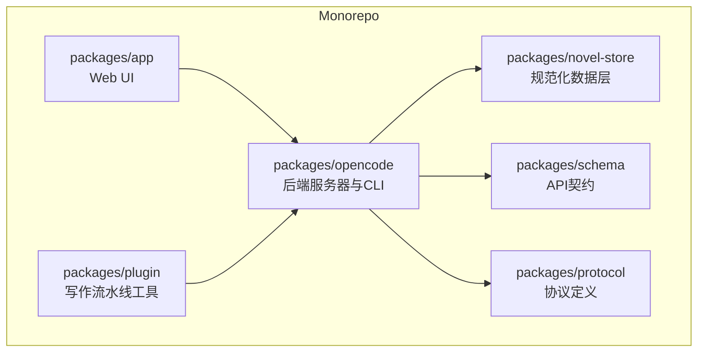
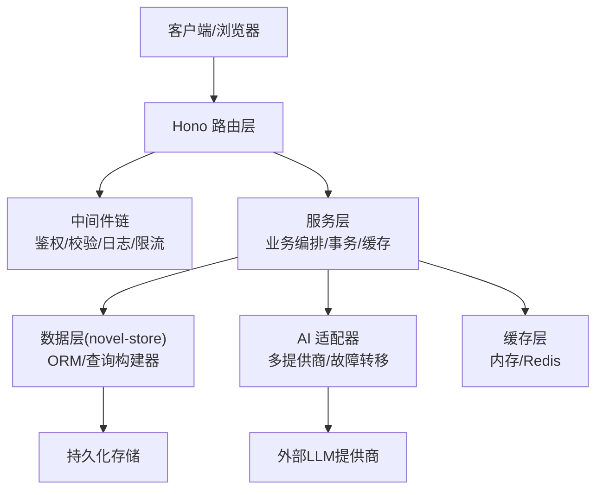
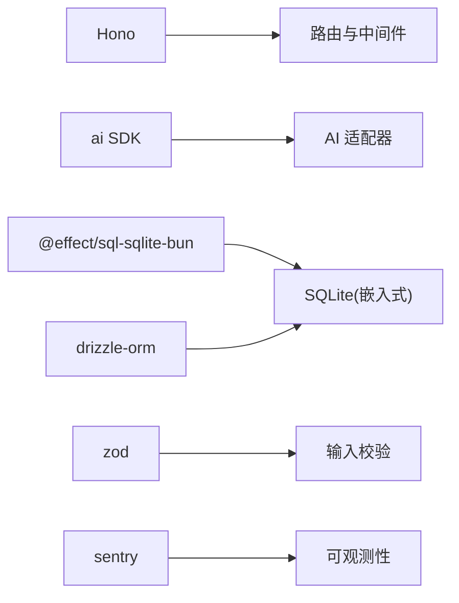

# 后端服务

<cite>
**本文引用的文件**   
- [README.md](file://README.md)
- [package.json](file://package.json)
</cite>

## 目录
1. [简介](#简介)
2. [项目结构](#项目结构)
3. [核心组件](#核心组件)
4. [架构总览](#架构总览)
5. [详细组件分析](#详细组件分析)
6. [依赖分析](#依赖分析)
7. [性能考虑](#性能考虑)
8. [故障排查指南](#故障排查指南)
9. [结论](#结论)
10. [附录](#附录) 

## 简介
本文件为 openNovel 后端服务的权威技术文档，聚焦基于 Hono 的服务器架构、路由与中间件设计、错误处理机制；业务层的服务化架构、事务管理与缓存策略；AI 集成的多提供商适配、统一接口与故障转移；数据库操作、会话管理与并发模型；以及安全、权限控制、数据校验、性能优化与监控方案。文档以仓库现有信息为依据，结合工程实践给出可操作的指导。

## 项目结构
openNovel 采用 Bun monorepo 组织，后端相关能力主要分布在以下包：
- packages/opencode：后端服务器与 CLI（入口与运行脚本）
- packages/novel-store：规范化的数据层（小说、章节、角色、审校等）
- packages/schema + packages/protocol：前后端共享 API 契约
- packages/app：SolidJS Web UI（书架、工作台、审批流）
- packages/plugin：写作流水线工具（草稿、连续性审校、提交审校）

快速启动说明显示后端默认监听端口 4096，Web UI 默认 4444。开发命令通过 bun run dev:all 同时启动后端与前端。

图表来源
- [README.md:60-69](file://README.md#L60-L69)

章节来源
- [README.md:34-58](file://README.md#L34-L58)
- [README.md:60-69](file://README.md#L60-L69)

## 核心组件
- 服务器框架：Hono（轻量、高性能 HTTP 框架），用于构建 REST/JSON API 与服务编排
- 数据层：novel-store 提供领域实体与持久化抽象，配合 schema/protocol 保证契约一致性
- AI 集成：通过统一的 LLM 调用抽象，支持多提供商接入与故障转移
- 中间件系统：鉴权、限流、日志、请求校验、跨域、压缩等通用横切能力
- 错误处理：标准化错误码、结构化错误响应、可观测性埋点
- 会话管理：无状态或基于 Token 的会话，结合服务端存储实现幂等与上下文传递
- 并发模型：Bun 事件循环 + 异步 I/O，配合连接池与队列控制吞吐

章节来源
- [package.json:68-71](file://package.json#L68-L71)
- [README.md:60-69](file://README.md#L60-L69)

## 架构总览
下图展示后端服务在 monorepo 中的位置及关键交互关系。

图表来源
- [README.md:60-69](file://README.md#L60-L69)
- [package.json:68-71](file://package.json#L68-L71)

## 详细组件分析

### 服务器与路由（Hono）
- 路由分层：按领域划分模块路由，集中挂载到根应用实例
- 中间件顺序：鉴权 → 参数校验 → 速率限制 → 日志追踪 → 业务处理器
- 错误边界：全局错误处理器捕获未处理异常，返回统一 JSON 错误体
- 版本化：URL 前缀或 Header 控制 API 版本演进

建议的路由组织方式
- /api/v1/*：REST 资源路由
- /ws/*：WebSocket 实时通道（如协作编辑、进度推送）
- /health：健康检查与就绪探针

章节来源
- [package.json:70-71](file://package.json#L70-L71)

### 中间件系统
- 鉴权中间件：解析 Token、校验签名、注入用户上下文
- 校验中间件：使用 Zod/Hono Validator 对请求体与路径参数进行强类型校验
- 限流中间件：基于 IP/用户维度令牌桶或滑动窗口
- 日志中间件：结构化日志（traceId、耗时、状态码）
- 压缩与 CORS：按需启用 gzip/brotli，配置跨域白名单

章节来源
- [package.json:42-44](file://package.json#L42-L44)

### 错误处理机制
- 统一错误码：业务错误与系统错误分类编码
- 错误响应体：包含 code、message、details、traceId
- 降级与熔断：对外部依赖失败时快速失败并回退
- 可观测性：错误上报至监控系统（Sentry/自研）

章节来源
- [package.json:91-94](file://package.json#L91-L94)

### 业务层与服务架构
- 服务层职责：编排用例、事务边界、缓存读写、消息发布
- 领域服务：小说、章节、角色、审校、工作区等
- 事务管理：写操作包裹事务，确保一致性；读操作走缓存优先
- 缓存策略：多级缓存（内存 + 分布式），热点数据 TTL 与失效策略

章节来源
- [README.md:64-66](file://README.md#L64-L66)

### 事务管理与缓存策略
- 事务模式：单写库事务，必要时分片/分区；长事务避免
- 缓存一致性：先更新 DB 再失效缓存，或双写+延迟校验
- 缓存键设计：按领域聚合，避免键冲突
- 命中率监控：统计命中率与过期率，动态调优 TTL

章节来源
- [README.md:64-66](file://README.md#L64-L66)

### AI 集成（多提供商适配与故障转移）
- 统一接口：抽象生成/续写/审校等能力，屏蔽提供商差异
- 提供商适配：OpenAI、Claude、Google、本地模型等
- 故障转移：主备切换、重试、超时与熔断
- 结果校验：输出格式校验、敏感词过滤、质量评分

章节来源
- [package.json:68](file://package.json#L68)

### 数据库操作与会话管理
- 数据层：novel-store 提供领域模型与查询封装
- ORM/驱动：Drizzle 或 Effect SQL SQLite（根据部署环境选择）
- 连接池：合理设置最大连接数与超时
- 会话管理：无状态 Token + 可选服务端会话存储（Redis/SQLite）

章节来源
- [README.md:64-66](file://README.md#L64-L66)
- [package.json:65-67](file://package.json#L65-L67)

### 并发处理与资源控制
- 事件循环：Bun 高并发 I/O，注意 CPU 密集型任务隔离
- 队列与限流：写入队列、批量合并、背压控制
- 资源上限：CPU 亲和、内存限制、GC 调优

章节来源
- [package.json:7](file://package.json#L7)

### 安全、权限控制与数据验证
- 身份认证：JWT/短期令牌，签名校验与刷新机制
- 授权模型：RBAC/ABAC，细粒度到章节/角色级别
- 输入校验：Zod/Hono Validator 全量校验，防注入
- 安全头：CSP、HSTS、X-Frame-Options 等

章节来源
- [package.json:42-44](file://package.json#L42-L44)

### 性能优化建议
- 路由与中间件精简：减少不必要的转换与序列化
- 缓存命中：热点数据预取与懒加载
- 数据库索引：覆盖查询字段，避免全表扫描
- 批处理：批量写入与合并更新
- 压缩与 CDN：静态资源与响应体压缩

[本节为通用优化建议，不直接分析具体文件]

### 监控与可观测性
- 指标：QPS、延迟分布、错误率、缓存命中率、DB 连接池使用率
- 日志：结构化日志，traceId 贯穿链路
- 告警：阈值告警与自动恢复
- 追踪：端到端链路追踪（OpenTelemetry）

章节来源
- [package.json:91-94](file://package.json#L91-L94)

## 依赖分析
后端依赖的关键运行时与库：
- Hono：HTTP 框架与路由
- ai：AI SDK 统一调用
- effect/sql-sqlite-bun：Effect 生态下的 SQLite 驱动（适合本地/嵌入式）
- drizzle-orm：类型安全的 ORM
- zod：运行时数据校验
- sentry：错误追踪与监控

图表来源
- [package.json:65-71](file://package.json#L65-L71)
- [package.json:68](file://package.json#L68)
- [package.json:91-94](file://package.json#L91-L94)

章节来源
- [package.json:65-71](file://package.json#L65-L71)
- [package.json:68](file://package.json#L68)
- [package.json:91-94](file://package.json#L91-L94)

## 性能考虑
- 启动时间：按需加载模块，延迟初始化重型依赖
- 内存占用：避免大对象常驻内存，及时释放引用
- I/O 并行：并发读取与批处理写入
- 缓存预热：冷启动后预热热点数据
- 压测与基准：定期回归测试，关注 P95/P99 延迟

[本节为通用性能建议，不直接分析具体文件]

## 故障排查指南
- 常见问题
  - 端口占用：确认 4096/4444 未被占用
  - 依赖缺失：重新安装依赖并清理缓存
  - 数据库锁：检查连接池与事务时长
  - AI 超时：调整超时与重试策略
- 诊断步骤
  - 查看结构化日志与 traceId
  - 检查健康检查端点
  - 抓取堆快照定位内存泄漏
  - 开启慢查询日志与指标面板

章节来源
- [README.md:34-58](file://README.md#L34-L58)
- [package.json:91-94](file://package.json#L91-L94)

## 结论
openNovel 后端以 Hono 为核心，结合 novel-store 数据层与共享契约，形成清晰的分层架构。通过中间件体系与统一错误处理保障稳定性，借助 AI 适配器实现多提供商兼容与弹性容错。配合缓存、事务与并发控制，可在高并发场景下保持良好性能。建议持续完善监控与可观测性，建立完善的压测与回归流程，确保迭代质量与稳定性。

[本节为总结性内容，不直接分析具体文件]

## 附录
- 快速启动
  - 后端：bun run --conditions=browser ./src/index.ts serve --port 4096
  - 前端：bun dev -- --port 4444
  - 一键启动：bun run dev:all
- 常用端口
  - 后端：4096
  - Web UI：4444

章节来源
- [README.md:34-58](file://README.md#L34-L58)