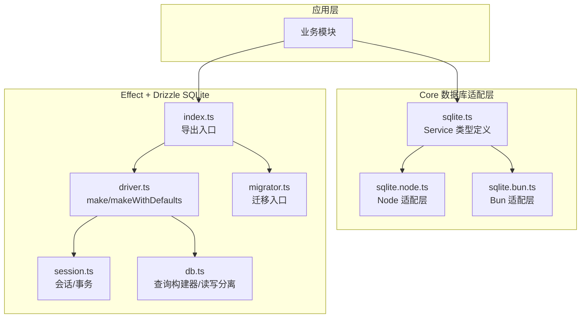
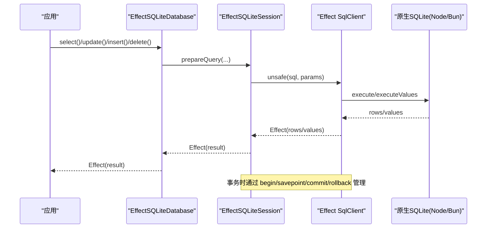
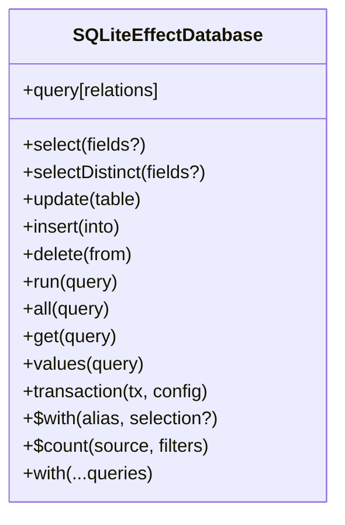
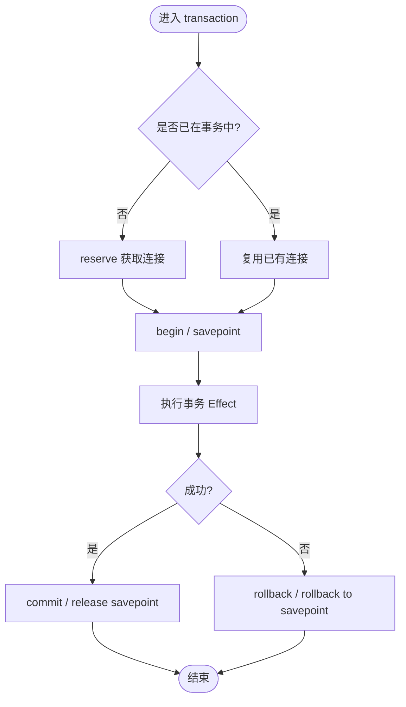
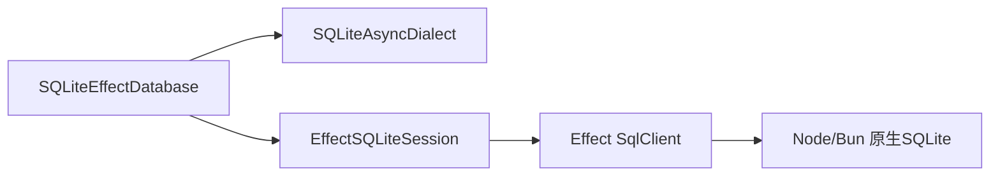

# 数据库层

<cite>
**本文引用的文件**   
- [packages/effect-drizzle-sqlite/src/index.ts](file://packages/effect-drizzle-sqlite/src/index.ts)
- [packages/effect-drizzle-sqlite/src/effect-sqlite/driver.ts](file://packages/effect-drizzle-sqlite/src/effect-sqlite/driver.ts)
- [packages/effect-drizzle-sqlite/src/effect-sqlite/session.ts](file://packages/effect-drizzle-sqlite/src/effect-sqlite/session.ts)
- [packages/effect-drizzle-sqlite/src/effect-sqlite/migrator.ts](file://packages/effect-drizzle-sqlite/src/effect-sqlite/migrator.ts)
- [packages/effect-drizzle-sqlite/src/sqlite-core/effect/db.ts](file://packages/effect-drizzle-sqlite/src/sqlite-core/effect/db.ts)
- [packages/core/src/database/sqlite.ts](file://packages/core/src/database/sqlite.ts)
- [packages/core/src/database/sqlite.node.ts](file://packages/core/src/database/sqlite.node.ts)
- [packages/core/src/database/sqlite.bun.ts](file://packages/core/src/database/sqlite.bun.ts)
- [packages/core/src/database/schema.sql.ts](file://packages/core/src/database/schema.sql.ts)
- [packages/core/src/database/schema.gen.ts](file://packages/core/src/database/schema.gen.ts)
</cite>

## 更新摘要
**所做更改**   
- 更新了包标识符从 `~@opencode-ai/core/database/*` 到 `~@opennovel-ai/core/database/*` 的说明
- 修正了 SQLite Node/Bun 适配层的类型 ID 定义
- 更新了 Core 适配层的 Context Service 标识符
- 保持了整体架构和功能的完整性

## 目录
1. [简介](#简介)
2. [项目结构](#项目结构)
3. [核心组件](#核心组件)
4. [架构总览](#架构总览)
5. [详细组件分析](#详细组件分析)
6. [依赖关系分析](#依赖关系分析)
7. [性能与优化](#性能与优化)
8. [故障排查指南](#故障排查指南)
9. [结论](#结论)
10. [附录：常见查询模式与最佳实践](#附录常见查询模式与最佳实践)

## 简介
本章节面向 openNovel 的数据库层，聚焦基于 Drizzle ORM 的 SQLite 封装、Effect 框架集成、连接池与事务管理、迁移与版本控制、以及索引与查询优化。文档将帮助读者理解从底层驱动到上层查询构建的完整链路，并提供可操作的调优与排错建议。

## 项目结构
openNovel 的数据库层由两部分组成：
- packages/core/src/database：平台适配层（Node/Bun），提供 Effect SqlClient、原生数据库对象与 Drizzle 客户端的 Layer 装配。
- packages/effect-drizzle-sqlite：Effect + Drizzle 的 SQLite 实现，包含数据库实例、会话、事务、迁移工具与核心查询构建器。

图表来源
- [packages/core/src/database/sqlite.ts:1-9](file://packages/core/src/database/sqlite.ts#L1-L9)
- [packages/core/src/database/sqlite.node.ts:1-179](file://packages/core/src/database/sqlite.node.ts#L1-L179)
- [packages/core/src/database/sqlite.bun.ts:1-184](file://packages/core/src/database/sqlite.bun.ts#L1-L184)
- [packages/effect-drizzle-sqlite/src/index.ts:1-7](file://packages/effect-drizzle-sqlite/src/index.ts#L1-L7)
- [packages/effect-drizzle-sqlite/src/effect-sqlite/driver.ts:1-78](file://packages/effect-drizzle-sqlite/src/effect-sqlite/driver.ts#L1-L78)
- [packages/effect-drizzle-sqlite/src/effect-sqlite/session.ts:1-219](file://packages/effect-drizzle-sqlite/src/effect-sqlite/session.ts#L1-L219)
- [packages/effect-drizzle-sqlite/src/sqlite-core/effect/db.ts:1-297](file://packages/effect-drizzle-sqlite/src/sqlite-core/effect/db.ts#L1-L297)
- [packages/effect-drizzle-sqlite/src/effect-sqlite/migrator.ts:1-15](file://packages/effect-drizzle-sqlite/src/effect-sqlite/migrator.ts#L1-L15)

章节来源
- [packages/core/src/database/sqlite.ts:1-9](file://packages/core/src/database/sqlite.ts#L1-L9)
- [packages/core/src/database/sqlite.node.ts:1-179](file://packages/core/src/database/sqlite.node.ts#L1-L179)
- [packages/core/src/database/sqlite.bun.ts:1-184](file://packages/core/src/database/sqlite.bun.ts#L1-L184)
- [packages/effect-drizzle-sqlite/src/index.ts:1-7](file://packages/effect-drizzle-sqlite/src/index.ts#L1-L7)

## 核心组件
- EffectSQLiteDatabase：Effect 驱动的 SQLite 数据库实例，暴露 select/update/insert/delete/raw 等 API，并支持 withReplicas 读多写一。
- EffectSQLiteSession：会话层，负责语句准备、缓存、日志、JIT 映射开关、事务边界与保存点。
- Driver(make/makeWithDefaults)：创建数据库实例，注入默认服务（缓存、日志）与 SqlClient。
- Migrator：读取迁移文件并通过 session 执行迁移。
- Core 适配层：为 Node/Bun 提供统一的 Effect SqlClient、原生数据库对象与 Drizzle 客户端 Layer。

章节来源
- [packages/effect-drizzle-sqlite/src/sqlite-core/effect/db.ts:1-297](file://packages/effect-drizzle-sqlite/src/sqlite-core/effect/db.ts#L1-L297)
- [packages/effect-drizzle-sqlite/src/effect-sqlite/session.ts:1-219](file://packages/effect-drizzle-sqlite/src/effect-sqlite/session.ts#L1-L219)
- [packages/effect-drizzle-sqlite/src/effect-sqlite/driver.ts:1-78](file://packages/effect-drizzle-sqlite/src/effect-sqlite/driver.ts#L1-L78)
- [packages/effect-drizzle-sqlite/src/effect-sqlite/migrator.ts:1-15](file://packages/effect-drizzle-sqlite/src/effect-sqlite/migrator.ts#L1-L15)
- [packages/core/src/database/sqlite.node.ts:1-179](file://packages/core/src/database/sqlite.node.ts#L1-L179)
- [packages/core/src/database/sqlite.bun.ts:1-184](file://packages/core/src/database/sqlite.bun.ts#L1-L184)

## 架构总览
下图展示了从应用调用到 SQLite 执行的完整链路，包括 Effect 上下文、SqlClient、会话与事务、以及 Drizzle 查询构建器。

图表来源
- [packages/effect-drizzle-sqlite/src/sqlite-core/effect/db.ts:168-239](file://packages/effect-drizzle-sqlite/src/sqlite-core/effect/db.ts#L168-L239)
- [packages/effect-drizzle-sqlite/src/effect-sqlite/session.ts:103-117](file://packages/effect-drizzle-sqlite/src/effect-sqlite/session.ts#L103-L117)
- [packages/core/src/database/sqlite.node.ts:89-145](file://packages/core/src/database/sqlite.node.ts#L89-L145)
- [packages/core/src/database/sqlite.bun.ts:88-152](file://packages/core/src/database/sqlite.bun.ts#L88-L152)

## 详细组件分析

### EffectSQLiteDatabase（查询构建与读写分离）
- 提供 select/selectDistinct/update/insert/delete/raw/run/all/get/values 等方法。
- 支持 $with 子查询、$count 计数、withReplicas 读多写一。
- 内部持有 dialect 与 session，所有查询均通过 session 执行。

图表来源
- [packages/effect-drizzle-sqlite/src/sqlite-core/effect/db.ts:30-239](file://packages/effect-drizzle-sqlite/src/sqlite-core/effect/db.ts#L30-L239)

章节来源
- [packages/effect-drizzle-sqlite/src/sqlite-core/effect/db.ts:30-239](file://packages/effect-drizzle-sqlite/src/sqlite-core/effect/db.ts#L30-L239)

### EffectSQLiteSession（会话、缓存、事务与保存点）
- prepareQuery/prepareRelationalQuery：构造预编译查询，注入日志、缓存、JIT 映射与事务状态。
- execute：统一执行路径，区分 values/get/all。
- transaction：基于 Effect 的不可中断掩码与 Scope 管理连接生命周期；使用 begin/savepoint/commit/rollback 保证嵌套事务语义。

图表来源
- [packages/effect-drizzle-sqlite/src/effect-sqlite/session.ts:118-187](file://packages/effect-drizzle-sqlite/src/effect-sqlite/session.ts#L118-L187)

章节来源
- [packages/effect-drizzle-sqlite/src/effect-sqlite/session.ts:1-219](file://packages/effect-drizzle-sqlite/src/effect-sqlite/session.ts#L1-L219)

### Driver（make/makeWithDefaults）
- make：从 Effect 上下文获取 SqlClient、EffectCache、EffectLogger，组装 Dialect、Session 与 Database。
- makeWithDefaults：自动注入 DefaultServices（EffectCache.Default、EffectLogger.Default）。

章节来源
- [packages/effect-drizzle-sqlite/src/effect-sqlite/driver.ts:1-78](file://packages/effect-drizzle-sqlite/src/effect-sqlite/driver.ts#L1-L78)

### Migrator（迁移）
- migrate：读取迁移文件，调用 coreMigrate 通过 session 执行。

章节来源
- [packages/effect-drizzle-sqlite/src/effect-sqlite/migrator.ts:1-15](file://packages/effect-drizzle-sqlite/src/effect-sqlite/migrator.ts#L1-L15)

### Core 适配层（Node/Bun）
- sqlite.node.ts：基于 node:sqlite.DatabaseSync，提供 Statement 编译器、Semaphore 并发控制、WAL 模式、扩展加载与 Drizzle 客户端 Layer。
- sqlite.bun.ts：基于 bun:sqlite.Database，提供 serialize 导出、Statement 编译器、并发控制、WAL 模式与 Drizzle 客户端 Layer。
- sqlite.ts：声明 Native 与 Drizzle 两个 Context Service，供上层按环境注入。

**更新** 包标识符已从 `~@opencode-ai/core/database/*` 更新为 `~@opennovel-ai/core/database/*`

章节来源
- [packages/core/src/database/sqlite.node.ts:1-179](file://packages/core/src/database/sqlite.node.ts#L1-L179)
- [packages/core/src/database/sqlite.bun.ts:1-184](file://packages/core/src/database/sqlite.bun.ts#L1-L184)
- [packages/core/src/database/sqlite.ts:1-9](file://packages/core/src/database/sqlite.ts#L1-L9)

## 依赖关系分析
- EffectSQLiteDatabase 依赖 SQLiteAsyncDialect 与 SQLiteEffectSession。
- Session 依赖 Effect SqlClient，并在事务中使用 transactionService 进行连接共享。
- Core 适配层通过 Layer 组合 Native、SqlClient、Drizzle 客户端，并注入 Reactivity 层。

图表来源
- [packages/effect-drizzle-sqlite/src/sqlite-core/effect/db.ts:46-77](file://packages/effect-drizzle-sqlite/src/sqlite-core/effect/db.ts#L46-L77)
- [packages/effect-drizzle-sqlite/src/effect-sqlite/session.ts:42-49](file://packages/effect-drizzle-sqlite/src/effect-sqlite/session.ts#L42-L49)
- [packages/core/src/database/sqlite.node.ts:126-145](file://packages/core/src/database/sqlite.node.ts#L126-L145)
- [packages/core/src/database/sqlite.bun.ts:132-152](file://packages/core/src/database/sqlite.bun.ts#L132-L152)

章节来源
- [packages/effect-drizzle-sqlite/src/sqlite-core/effect/db.ts:1-297](file://packages/effect-drizzle-sqlite/src/sqlite-core/effect/db.ts#L1-L297)
- [packages/effect-drizzle-sqlite/src/effect-sqlite/session.ts:1-219](file://packages/effect-drizzle-sqlite/src/effect-sqlite/session.ts#L1-L219)
- [packages/core/src/database/sqlite.node.ts:1-179](file://packages/core/src/database/sqlite.node.ts#L1-L179)
- [packages/core/src/database/sqlite.bun.ts:1-184](file://packages/core/src/database/sqlite.bun.ts#L1-L184)

## 性能与优化
- WAL 模式：在 Node/Bun 适配层默认启用 PRAGMA journal_mode = WAL（可通过 disableWAL 关闭），提升并发读性能与稳定性。
- 连接与并发：使用 Semaphore 限制并发访问，避免 SQLite 单文件竞争；事务内复用连接，减少 reserve/close 开销。
- 索引策略：schema.gen.ts 中集中定义了主键、唯一约束与大量复合索引，覆盖高频查询路径（如按 novel_id、session_id、时间戳排序等）。
- JIT 映射：通过 useJitMappers 开关减少结果映射开销，适合高吞吐场景。
- 读多写一：withReplicas 可将读请求路由至副本，降低主库压力。
- 缓存与日志：DefaultServices 提供 EffectCache 与 EffectLogger，便于缓存失效与观测。

章节来源
- [packages/core/src/database/sqlite.node.ts:147-162](file://packages/core/src/database/sqlite.node.ts#L147-L162)
- [packages/core/src/database/sqlite.bun.ts:154-167](file://packages/core/src/database/sqlite.bun.ts#L154-L167)
- [packages/core/src/database/schema.gen.ts:419-483](file://packages/core/src/database/schema.gen.ts#L419-L483)
- [packages/effect-drizzle-sqlite/src/effect-sqlite/driver.ts:28-78](file://packages/effect-drizzle-sqlite/src/effect-sqlite/driver.ts#L28-L78)
- [packages/effect-drizzle-sqlite/src/sqlite-core/effect/db.ts:244-293](file://packages/effect-drizzle-sqlite/src/sqlite-core/effect/db.ts#L244-L293)

## 故障排查指南
- 错误分类：适配层统一将原生异常转换为 SqlError，并标注操作类型（execute/loadExtension/export），便于定位。
- 事务失败回滚：事务分支失败会触发 rollback 或 rollback to savepoint，确保数据一致性。
- 扩展加载失败：loadExtension 捕获异常并包装为 SqlError，检查路径与权限。
- 大整数安全：根据 SafeIntegers 上下文设置 safeIntegers/setReadBigInts，避免精度丢失。
- WAL 相关：若遇到 deferred constraint commit 失败后事务未关闭，代码已内置 catch 并回滚处理。

章节来源
- [packages/core/src/database/sqlite.node.ts:56-87](file://packages/core/src/database/sqlite.node.ts#L56-L87)
- [packages/core/src/database/sqlite.bun.ts:56-86](file://packages/core/src/database/sqlite.bun.ts#L56-L86)
- [packages/effect-drizzle-sqlite/src/effect-sqlite/session.ts:153-176](file://packages/effect-drizzle-sqlite/src/effect-sqlite/session.ts#L153-L176)

## 结论
openNovel 的数据库层以 Effect 为核心，结合 Drizzle ORM 与 SQLite，提供了类型安全的查询构建、稳定的事务与连接管理、完善的迁移机制与丰富的索引优化。通过分层设计与 Layer 装配，既保证了跨平台兼容性，也为性能与可观测性打下基础。

## 附录：常见查询模式与最佳实践
- 基本查询
  - 使用 db.select().from(table).where(...).orderBy(...) 构建高效查询。
  - 对高频过滤字段建立索引（如 novel_id、session_id、status、time_created）。
- 分页与排序
  - 使用 limit/offset 或游标分页，配合 (novel_id, order) 复合索引提升性能。
- 批量写入
  - 使用 insert().values([...]) 批量插入，必要时开启事务保证一致性。
- 关联查询
  - 利用 relations 配置与 query.* 命名空间进行关联查询，避免 N+1。
- 事务与保存点
  - 复杂流程使用 db.transaction(tx => ...) 包裹，嵌套事务使用保存点。
- 原始 SQL
  - 通过 db.run/db.all/db.get/db.values 执行原始 SQL，注意参数绑定与类型安全。
- 备份与恢复
  - Bun 环境可使用 export 导出二进制快照；Node 环境建议使用外部工具（如 sqlite3 .backup）。
- 完整性检查
  - 定期运行 PRAGMA integrity_check，结合索引统计评估查询计划。
- 监控与日志
  - 启用 EffectLogger 记录慢查询与错误，结合 Span Attributes 追踪 db.system.name=sqlite。

章节来源
- [packages/core/src/database/schema.gen.ts:1-487](file://packages/core/src/database/schema.gen.ts#L1-L487)
- [packages/core/src/database/sqlite.bun.ts:104-118](file://packages/core/src/database/sqlite.bun.ts#L104-118)
- [packages/effect-drizzle-sqlite/src/effect-sqlite/driver.ts:28-78](file://packages/effect-drizzle-sqlite/src/effect-sqlite/driver.ts#L28-L78)