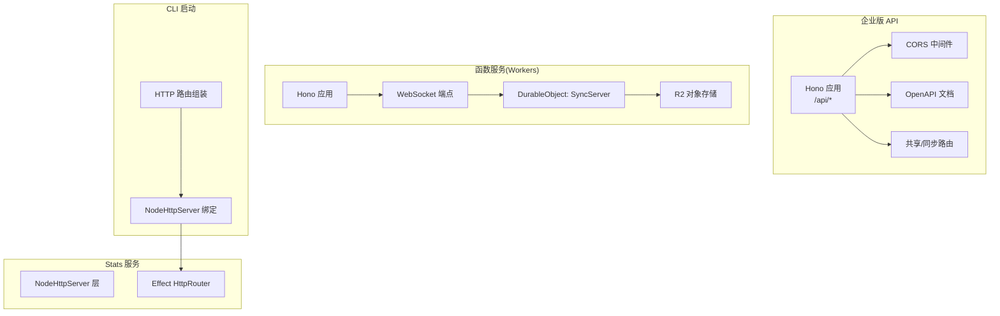
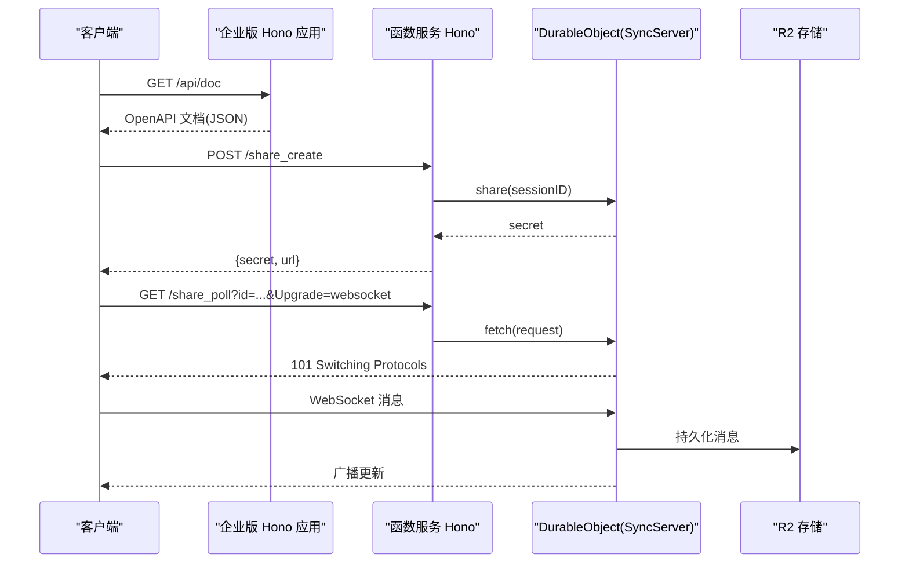
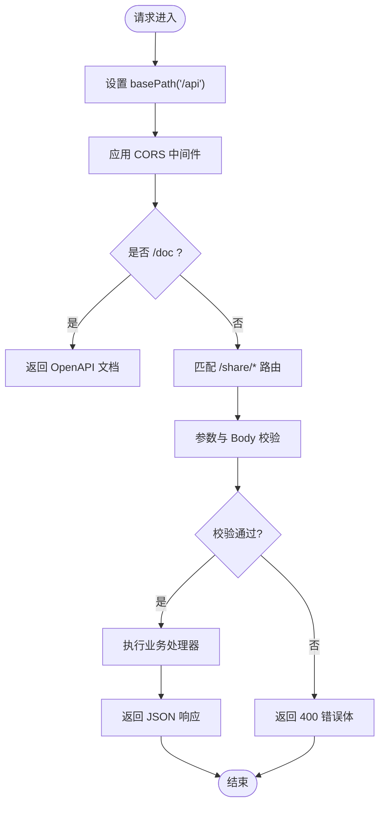
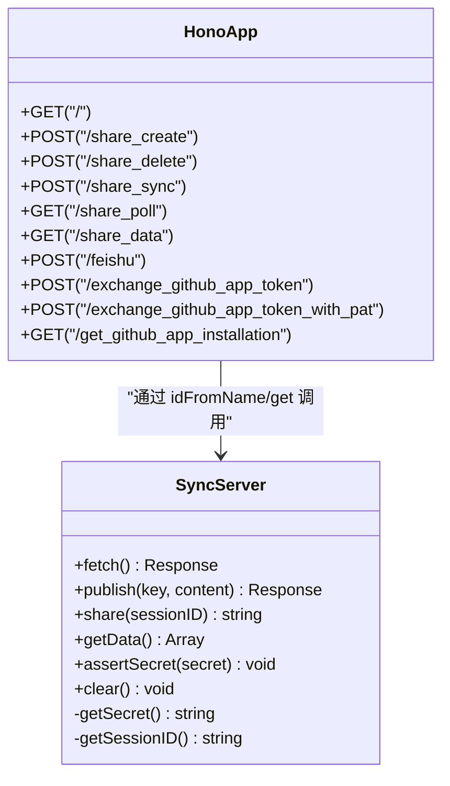
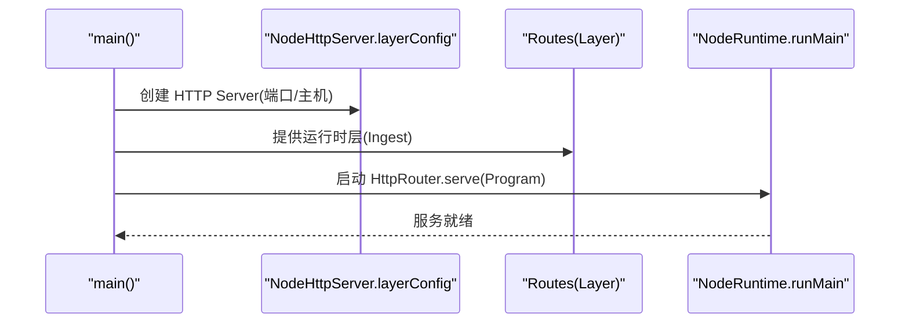
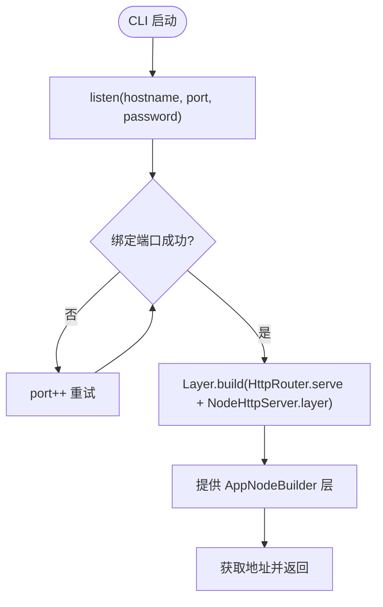
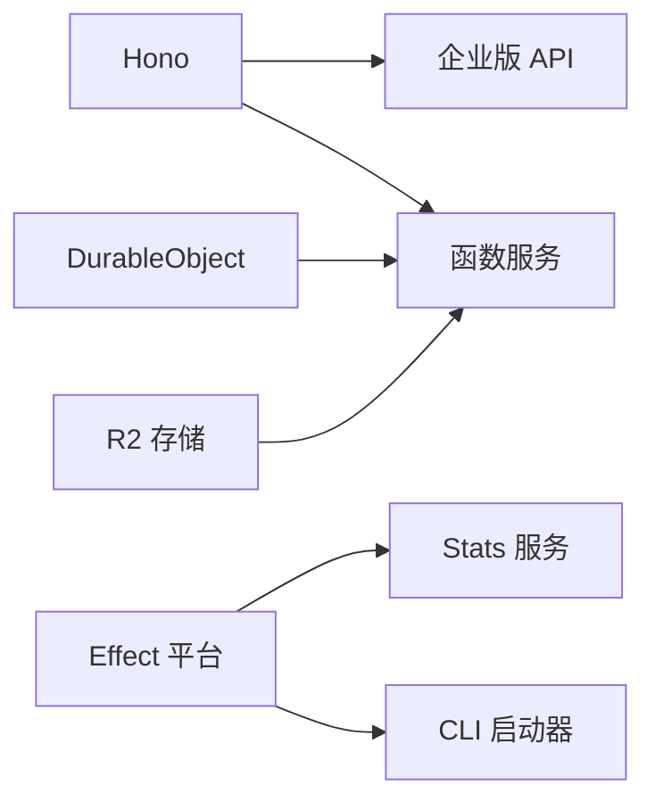

# 服务器架构

<cite>
**本文引用的文件**   
- [packages/enterprise/src/routes/api/[...path].ts](file://packages/enterprise/src/routes/api/%5B...path%5D.ts)
- [packages/function/src/api.ts](file://packages/function/src/api.ts)
- [packages/stats/server/src/server.ts](file://packages/stats/server/src/server.ts)
- [packages/cli/src/commands/handlers/serve.ts](file://packages/cli/src/commands/handlers/serve.ts)
</cite>

## 目录
1. [简介](#简介)
2. [项目结构](#项目结构)
3. [核心组件](#核心组件)
4. [架构总览](#架构总览)
5. [详细组件分析](#详细组件分析)
6. [依赖关系分析](#依赖关系分析)
7. [性能考量](#性能考量)
8. [故障排查指南](#故障排查指南)
9. [结论](#结论)
10. [附录](#附录)

## 简介
本文件面向 openNovel 的服务器架构，聚焦基于 Hono 的 HTTP API 设计、中间件管道与请求处理流程；同时覆盖 WebSocket 实时通信（连接管理、消息广播与状态同步）、安全中间件、CORS 配置、请求限流机制，以及性能监控与日志记录的最佳实践。文档以仓库中实际代码为依据，提供可追溯的文件来源与图示映射，帮助读者快速理解并扩展系统。

## 项目结构
openNovel 采用多包（monorepo）组织，与服务器相关的关键位置包括：
- 企业版 API 路由：使用 Hono 构建 REST 接口，集成 OpenAPI 描述与校验
- 函数服务（Cloudflare Workers）：通过 Hono 暴露 API，并使用 Durable Object 实现 WebSocket 同步
- Stats 服务：基于 Effect 平台与 NodeHttpServer 启动 HTTP 服务
- CLI 启动器：通过 Effect 层组合路由与服务实例，监听端口

图表来源 
- [packages/enterprise/src/routes/api/[...path].ts](file://packages/enterprise/src/routes/api/%5B...path%5D.ts#L1-L172)
- [packages/function/src/api.ts:1-389](file://packages/function/src/api.ts#L1-L389)
- [packages/stats/server/src/server.ts:1-28](file://packages/stats/server/src/server.ts#L1-L28)
- [packages/cli/src/commands/handlers/serve.ts:30-46](file://packages/cli/src/commands/handlers/serve.ts#L30-L46)

章节来源
- [packages/enterprise/src/routes/api/[...path].ts](file://packages/enterprise/src/routes/api/%5B...path%5D.ts#L1-L172)
- [packages/function/src/api.ts:1-389](file://packages/function/src/api.ts#L1-L389)
- [packages/stats/server/src/server.ts:1-28](file://packages/stats/server/src/server.ts#L1-L28)
- [packages/cli/src/commands/handlers/serve.ts:30-46](file://packages/cli/src/commands/handlers/serve.ts#L30-L46)

## 核心组件
- Hono 应用与路由组织
  - 企业版 API：统一 basePath("/api")，挂载 CORS 中间件，定义 OpenAPI 文档与若干共享/同步路由
  - 函数服务：定义多个 REST 端点，并通过 DurableObject 暴露 WebSocket 能力
- 中间件管道
  - CORS：跨域资源共享
  - OpenAPI 描述与参数校验：声明式路由 + 运行时校验
- 启动与配置
  - Stats 服务：通过 Effect 层注入端口与主机配置，创建 Node HTTP Server
  - CLI：动态绑定端口，组合路由与服务层
- 错误响应
  - 统一的 JSON 错误体，包含错误信息与可选问题详情

章节来源
- [packages/enterprise/src/routes/api/[...path].ts](file://packages/enterprise/src/routes/api/%5B...path%5D.ts#L1-L172)
- [packages/function/src/api.ts:1-389](file://packages/function/src/api.ts#L1-L389)
- [packages/stats/server/src/server.ts:1-28](file://packages/stats/server/src/server.ts#L1-L28)
- [packages/cli/src/commands/handlers/serve.ts:30-46](file://packages/cli/src/commands/handlers/serve.ts#L30-L46)

## 架构总览
下图展示从客户端到各服务的请求路径、中间件与数据流向。

图表来源 
- [packages/enterprise/src/routes/api/[...path].ts](file://packages/enterprise/src/routes/api/%5B...path%5D.ts#L1-L172)
- [packages/function/src/api.ts:1-389](file://packages/function/src/api.ts#L1-L389)

## 详细组件分析

### 企业版 API（Hono + OpenAPI + CORS）
- 路由组织
  - 基础路径：/api
  - 文档：/api/doc（OpenAPI 3.1.1）
  - 共享资源：/api/share（创建、同步、获取、删除）
  - 支持接口：/api/support/actions/remove-share（管理员操作）
- 中间件与校验
  - CORS：全局启用
  - OpenAPI：describeRoute + validator 对参数与响应进行声明式校验
- 错误响应格式
  - 成功：JSON 业务体
  - 失败：{ error, issues? } 等结构化错误体，配合 HTTP 状态码

图表来源 
- [packages/enterprise/src/routes/api/[...path].ts](file://packages/enterprise/src/routes/api/%5B...path%5D.ts#L1-L172)

章节来源
- [packages/enterprise/src/routes/api/[...path].ts](file://packages/enterprise/src/routes/api/%5B...path%5D.ts#L1-L172)

### 函数服务（Hono + DurableObject + WebSocket）
- REST 端点
  - /share_create：创建分享会话，返回 secret 与访问 URL
  - /share_delete：按 secret 清理分享数据
  - /share_sync：按 secret 发布消息到指定 session
  - /share_poll：升级 WebSocket 连接到 DurableObject
  - /share_data：拉取聚合后的 session 信息与会话消息
  - 其他：飞书回调、GitHub App Token 交换、安装检查等
- WebSocket 与状态同步
  - 客户端通过 /share_poll 建立 WS 连接
  - DurableObject 在连接时回推历史数据，后续 publish 时广播给所有订阅者
  - 消息持久化至 R2 与本地存储，确保一致性
- 安全与鉴权
  - 基于 secret 的访问控制（assertSecret）
  - 管理员接口使用硬编码密钥或环境变量比对

图表来源 
- [packages/function/src/api.ts:1-389](file://packages/function/src/api.ts#L1-L389)

章节来源
- [packages/function/src/api.ts:1-389](file://packages/function/src/api.ts#L1-L389)

### Stats 服务（Effect + NodeHttpServer）
- 启动流程
  - 通过 NodeHttpServer.layerConfig 创建 Node HTTP Server
  - 读取 PORT/HOST 配置，默认 3000/0.0.0.0
  - 将 Routes 作为程序层启动，合并 ServerLive 层
- 运行环境
  - 使用 Effect Runtime 启动主程序，禁用错误上报以减少噪音

图表来源 
- [packages/stats/server/src/server.ts:1-28](file://packages/stats/server/src/server.ts#L1-L28)

章节来源
- [packages/stats/server/src/server.ts:1-28](file://packages/stats/server/src/server.ts#L1-L28)

### CLI 启动器（Effect + NodeHttpServer）
- 端口绑定策略
  - 从 4096 开始尝试绑定，若失败则递增直到 65535
- 路由与服务组装
  - createRoutes(password) 生成路由
  - NodeHttpServer.layer 绑定 host/port
  - 提供 AppNodeBuilder 的组合层（凭证、权限等）

图表来源 
- [packages/cli/src/commands/handlers/serve.ts:30-46](file://packages/cli/src/commands/handlers/serve.ts#L30-L46)

章节来源
- [packages/cli/src/commands/handlers/serve.ts:30-46](file://packages/cli/src/commands/handlers/serve.ts#L30-L46)

## 依赖关系分析
- 组件耦合
  - 企业版 API 与函数服务均依赖 Hono，前者侧重 OpenAPI 与校验，后者侧重 DurableObject 与 WS
  - Stats 服务与 CLI 均依赖 Effect 与 NodeHttpServer，但职责不同（服务 vs 启动器）
- 外部依赖
  - Cloudflare DurableObject、R2、JWT/Octokit 等用于鉴权与第三方集成
  - Effect 平台用于服务编排与生命周期管理

图表来源 
- [packages/enterprise/src/routes/api/[...path].ts](file://packages/enterprise/src/routes/api/%5B...path%5D.ts#L1-L172)
- [packages/function/src/api.ts:1-389](file://packages/function/src/api.ts#L1-L389)
- [packages/stats/server/src/server.ts:1-28](file://packages/stats/server/src/server.ts#L1-L28)
- [packages/cli/src/commands/handlers/serve.ts:30-46](file://packages/cli/src/commands/handlers/serve.ts#L30-L46)

章节来源
- [packages/enterprise/src/routes/api/[...path].ts](file://packages/enterprise/src/routes/api/%5B...path%5D.ts#L1-L172)
- [packages/function/src/api.ts:1-389](file://packages/function/src/api.ts#L1-L389)
- [packages/stats/server/src/server.ts:1-28](file://packages/stats/server/src/server.ts#L1-L28)
- [packages/cli/src/commands/handlers/serve.ts:30-46](file://packages/cli/src/commands/handlers/serve.ts#L30-L46)

## 性能考量
- 缓存策略
  - 共享数据接口设置 Cache-Control（public、stale-while-revalidate），降低重复读取压力
- 连接与广播
  - WebSocket 直连 DurableObject，减少中间转发开销；批量推送前统计订阅者数量
- 存储优化
  - 消息先写 R2 再写本地存储，保证持久性与一致性；清理接口限制分页大小
- 启动与监听
  - 动态端口绑定避免冲突；Effect 层禁用日志可减少 I/O 开销

[本节为通用指导，不直接分析具体文件]

## 故障排查指南
- 常见问题定位
  - 端口占用：CLI 自动递增端口，确认最终绑定端口
  - 鉴权失败：检查 secret 与管理员密钥是否正确传入
  - WebSocket 升级失败：确认 Upgrade 头为 websocket
  - 数据不一致：检查 R2 与本地存储键空间是否一致
- 错误响应示例
  - 400：参数校验失败，返回 { error, issues }
  - 401：未授权，返回 { error }
  - 426：协议不支持（WS 升级失败）
  - 502：下游服务调用失败（如 Discord 机器人）

章节来源
- [packages/function/src/api.ts:1-389](file://packages/function/src/api.ts#L1-L389)
- [packages/enterprise/src/routes/api/[...path].ts](file://packages/enterprise/src/routes/api/%5B...path%5D.ts#L1-L172)

## 结论
openNovel 的服务器架构以 Hono 为核心，结合 Effect 平台与 Cloudflare DurableObject，形成清晰的 HTTP API 与 WebSocket 实时通信体系。企业版 API 强调 OpenAPI 与校验，函数服务专注分布式同步与存储，Stats 与 CLI 分别承担服务编排与启动职责。通过合理的中间件、错误响应与缓存策略，系统在可扩展性、安全性与性能方面具备良好基础。

[本节为总结，不直接分析具体文件]

## 附录
- 版本控制建议
  - 在 basePath 或路由前缀体现版本（如 /v1），保持向后兼容
- 安全中间件
  - 鉴权：JWT/OAuth/Secret 校验
  - 限流：在网关或入口层实施速率限制
  - CORS：仅允许受信任域名
- 日志与监控
  - 结构化日志（请求 ID、耗时、状态码）
  - 指标采集（QPS、延迟、错误率）
  - 告警规则（阈值与降级策略）

[本节为通用指导，不直接分析具体文件]