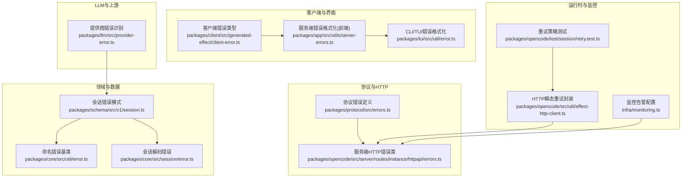
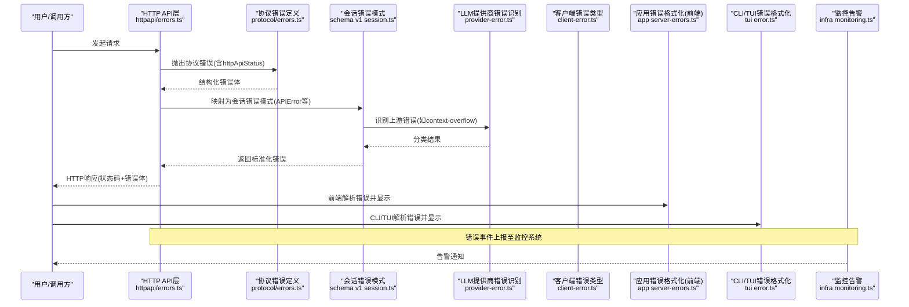
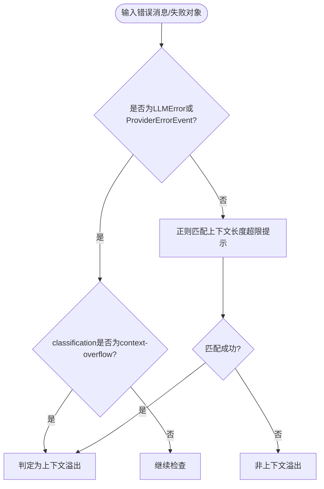
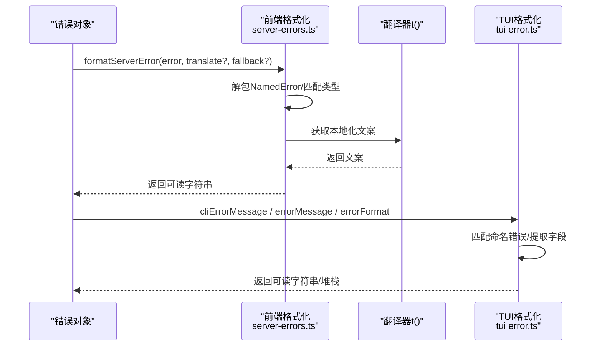
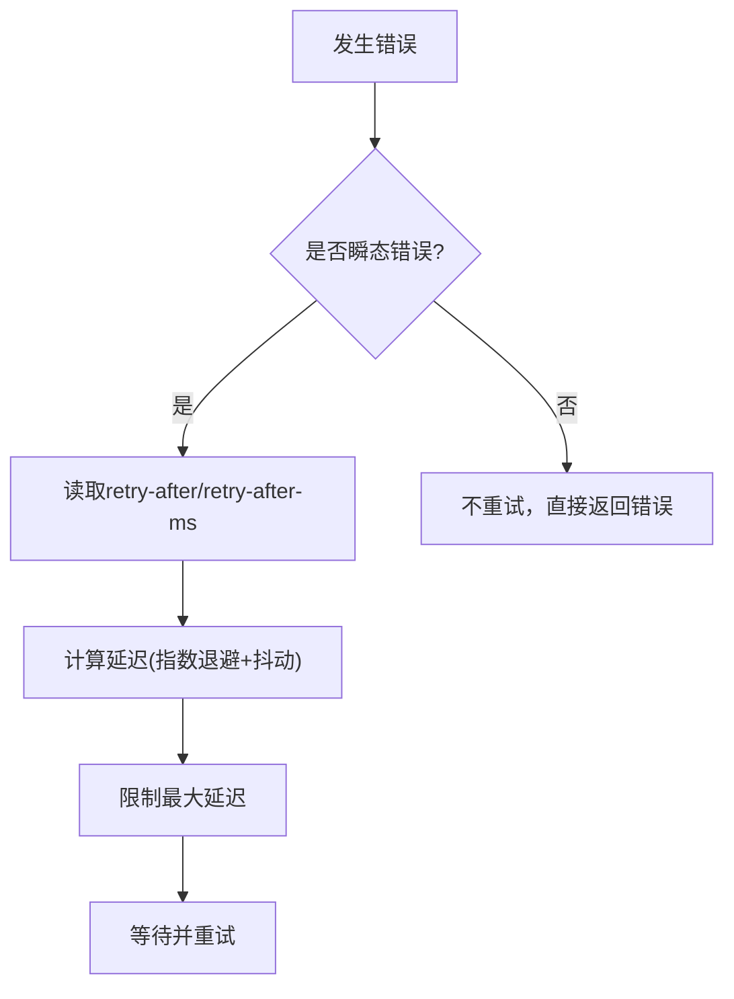
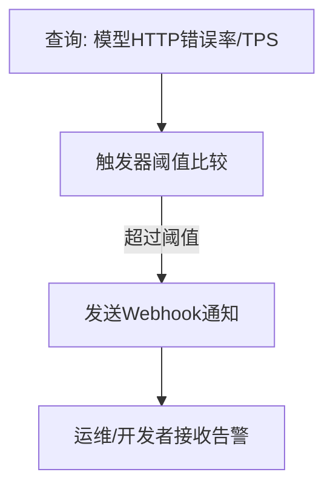
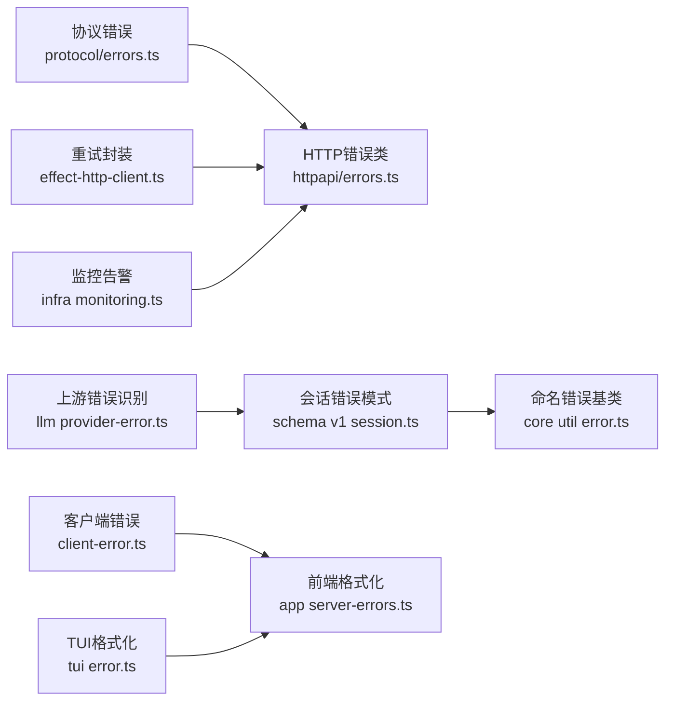

# 错误处理

<cite>
**本文引用的文件**   
- [packages/opencode/src/server/routes/instance/httpapi/errors.ts](file://packages/opencode/src/server/routes/instance/httpapi/errors.ts)
- [packages/protocol/src/errors.ts](file://packages/protocol/src/errors.ts)
- [packages/schema/src/v1/session.ts](file://packages/schema/src/v1/session.ts)
- [packages/core/src/util/error.ts](file://packages/core/src/util/error.ts)
- [packages/core/src/session/error.ts](file://packages/core/src/session/error.ts)
- [packages/llm/src/provider-error.ts](file://packages/llm/src/provider-error.ts)
- [packages/app/src/utils/server-errors.ts](file://packages/app/src/utils/server-errors.ts)
- [packages/tui/src/util/error.ts](file://packages/tui/src/util/error.ts)
- [packages/client/src/generated-effect/client-error.ts](file://packages/client/src/generated-effect/client-error.ts)
- [packages/opencode/test/session/retry.test.ts](file://packages/opencode/test/session/retry.test.ts)
- [packages/opencode/src/util/effect-http-client.ts](file://packages/opencode/src/util/effect-http-client.ts)
- [infra/monitoring.ts](file://infra/monitoring.ts)
</cite>

## 目录
1. [简介](#简介)
2. [项目结构](#项目结构)
3. [核心组件](#核心组件)
4. [架构总览](#架构总览)
5. [详细组件分析](#详细组件分析)
6. [依赖关系分析](#依赖关系分析)
7. [性能考虑](#性能考虑)
8. [故障排查指南](#故障排查指南)
9. [结论](#结论)
10. [附录](#附录)

## 简介
本文件系统化梳理 openNovel 的错误处理体系，覆盖错误分类、标准化格式、错误码与 HTTP 状态映射、异常捕获与传播、降级与重试、日志监控告警、以及开发规范与调试技巧。目标是帮助开发者快速定位问题、统一错误表达、提升系统稳定性与可观测性。

## 项目结构
错误处理贯穿协议层、服务层、会话与 LLM 调用层、客户端与 UI/TUI 展示层，并通过基础设施监控进行告警。关键位置如下：
- 协议与 HTTP API 错误定义：HTTP 状态码与结构化错误体
- 会话与模型错误模式：统一的命名错误与结构化数据
- 上游 LLM 提供商错误识别：上下文溢出等语义判断
- 客户端与 TUI 错误格式化：面向用户的可读消息
- 重试与瞬态错误恢复：指数退避与策略化决策
- 监控告警：基于指标阈值的触发器



**图示来源** 
- [packages/protocol/src/errors.ts:1-112](file://packages/protocol/src/errors.ts#L1-L112)
- [packages/opencode/src/server/routes/instance/httpapi/errors.ts:1-194](file://packages/opencode/src/server/routes/instance/httpapi/errors.ts#L1-L194)
- [packages/schema/src/v1/session.ts:29-67](file://packages/schema/src/v1/session.ts#L29-L67)
- [packages/core/src/util/error.ts:1-71](file://packages/core/src/util/error.ts#L1-L71)
- [packages/core/src/session/error.ts:1-25](file://packages/core/src/session/error.ts#L1-L25)
- [packages/llm/src/provider-error.ts:1-44](file://packages/llm/src/provider-error.ts#L1-L44)
- [packages/client/src/generated-effect/client-error.ts:1-5](file://packages/client/src/generated-effect/client-error.ts#L1-L5)
- [packages/app/src/utils/server-errors.ts:1-110](file://packages/app/src/utils/server-errors.ts#L1-L110)
- [packages/tui/src/util/error.ts:1-183](file://packages/tui/src/util/error.ts#L1-L183)
- [packages/opencode/test/session/retry.test.ts:70-268](file://packages/opencode/test/session/retry.test.ts#L70-L268)
- [packages/opencode/src/util/effect-http-client.ts:1-11](file://packages/opencode/src/util/effect-http-client.ts#L1-L11)
- [infra/monitoring.ts:180-238](file://infra/monitoring.ts#L180-L238)

**章节来源**
- [packages/protocol/src/errors.ts:1-112](file://packages/protocol/src/errors.ts#L1-L112)
- [packages/opencode/src/server/routes/instance/httpapi/errors.ts:1-194](file://packages/opencode/src/server/routes/instance/httpapi/errors.ts#L1-L194)
- [packages/schema/src/v1/session.ts:29-67](file://packages/schema/src/v1/session.ts#L29-L67)
- [packages/core/src/util/error.ts:1-71](file://packages/core/src/util/error.ts#L1-L71)
- [packages/core/src/session/error.ts:1-25](file://packages/core/src/session/error.ts#L1-L25)
- [packages/llm/src/provider-error.ts:1-44](file://packages/llm/src/provider-error.ts#L1-L44)
- [packages/client/src/generated-effect/client-error.ts:1-5](file://packages/client/src/generated-effect/client-error.ts#L1-L5)
- [packages/app/src/utils/server-errors.ts:1-110](file://packages/app/src/utils/server-errors.ts#L1-L110)
- [packages/tui/src/util/error.ts:1-183](file://packages/tui/src/util/error.ts#L1-L183)
- [packages/opencode/test/session/retry.test.ts:70-268](file://packages/opencode/test/session/retry.test.ts#L70-L268)
- [packages/opencode/src/util/effect-http-client.ts:1-11](file://packages/opencode/src/util/effect-http-client.ts#L1-L11)
- [infra/monitoring.ts:180-238](file://infra/monitoring.ts#L180-L238)

## 核心组件
- 协议与HTTP错误类：集中定义业务错误、认证/权限错误、资源未找到、冲突、上游错误、服务不可用、超时与未知错误，并绑定 HTTP 状态码。
- 会话错误模式：以命名错误（name/data）形式描述 APIError、认证失败、输出长度限制、中断、结构化输出失败、上下文溢出、内容过滤等。
- 命名错误基类：提供统一的 name/data 结构与序列化能力，便于跨层传递与解析。
- 上游错误识别：通过正则匹配与分类标签识别“上下文溢出”等特定失败原因。
- 客户端与TUI错误格式化：将结构化错误转换为人类可读信息，支持国际化翻译键。
- 重试与瞬态错误：对网络/网关/限流等场景实施指数退避与抖动，结合响应头与错误码决定延迟与是否重试。
- 监控告警：基于 Honeycomb 触发器对模型 HTTP 错误率与 TPS 下降等进行阈值告警。

**章节来源**
- [packages/protocol/src/errors.ts:1-112](file://packages/protocol/src/errors.ts#L1-L112)
- [packages/opencode/src/server/routes/instance/httpapi/errors.ts:1-194](file://packages/opencode/src/server/routes/instance/httpapi/errors.ts#L1-L194)
- [packages/schema/src/v1/session.ts:29-67](file://packages/schema/src/v1/session.ts#L29-L67)
- [packages/core/src/util/error.ts:1-71](file://packages/core/src/util/error.ts#L1-L71)
- [packages/llm/src/provider-error.ts:1-44](file://packages/llm/src/provider-error.ts#L1-L44)
- [packages/app/src/utils/server-errors.ts:1-110](file://packages/app/src/utils/server-errors.ts#L1-L110)
- [packages/tui/src/util/error.ts:1-183](file://packages/tui/src/util/error.ts#L1-L183)
- [packages/opencode/test/session/retry.test.ts:70-268](file://packages/opencode/test/session/retry.test.ts#L70-L268)
- [packages/opencode/src/util/effect-http-client.ts:1-11](file://packages/opencode/src/util/effect-http-client.ts#L1-L11)
- [infra/monitoring.ts:180-238](file://infra/monitoring.ts#L180-L238)

## 架构总览
错误从上游 LLM/第三方服务进入，经会话与协议层标准化为命名错误，再在 HTTP 层映射为带状态的响应体；客户端与 TUI 负责格式化与国际化展示；重试策略与瞬态错误封装保障鲁棒性；监控告警用于生产可见性。



**图示来源** 
- [packages/opencode/src/server/routes/instance/httpapi/errors.ts:1-194](file://packages/opencode/src/server/routes/instance/httpapi/errors.ts#L1-L194)
- [packages/protocol/src/errors.ts:1-112](file://packages/protocol/src/errors.ts#L1-L112)
- [packages/schema/src/v1/session.ts:29-67](file://packages/schema/src/v1/session.ts#L29-L67)
- [packages/llm/src/provider-error.ts:1-44](file://packages/llm/src/provider-error.ts#L1-L44)
- [packages/client/src/generated-effect/client-error.ts:1-5](file://packages/client/src/generated-effect/client-error.ts#L1-L5)
- [packages/app/src/utils/server-errors.ts:1-110](file://packages/app/src/utils/server-errors.ts#L1-L110)
- [packages/tui/src/util/error.ts:1-183](file://packages/tui/src/util/error.ts#L1-L183)
- [infra/monitoring.ts:180-238](file://infra/monitoring.ts#L180-L238)

## 详细组件分析

### 组件一：HTTP API 错误类与状态码映射
- 职责：定义业务错误、认证/权限错误、资源未找到、冲突、上游错误、服务不可用、超时与未知错误，并绑定 httpApiStatus。
- 关键点：
  - InvalidRequestError(400)、UnauthorizedError(401)、ForbiddenError(403)、ConflictError(409)
  - UpstreamError(502)、ServiceUnavailableError(503)、TimeoutError(504)、UnknownError(500)
  - ProviderNotFoundError(404)、ModelNotFoundError(404)、SessionNotFoundError(404)、MessageNotFoundError(404)
  - 其他：InvalidCursorError(400)、SessionBusyError(409)、QuestionNotFoundError(404)、PermissionNotFoundError(404)、McpServerNotFoundError(404)、PtyNotFoundError(404)、PtyForbiddenError(403)、ProjectNotFoundError(404)
  - NotFound 快捷构造：notFound(message)


**图示来源** 
- [packages/opencode/src/server/routes/instance/httpapi/errors.ts:1-194](file://packages/opencode/src/server/routes/instance/httpapi/errors.ts#L1-L194)

**章节来源**
- [packages/opencode/src/server/routes/instance/httpapi/errors.ts:1-194](file://packages/opencode/src/server/routes/instance/httpapi/errors.ts#L1-L194)

### 组件二：协议错误定义（与HTTP错误类对齐）
- 职责：在协议层定义错误类与字段，确保跨进程/跨语言一致性。
- 关键点：包含 InvalidRequestError、UnauthorizedError、ConflictError、ServiceUnavailableError、UnknownError、ProviderNotFoundError、SessionNotFoundError、MessageNotFoundError、InvalidCursorError、PermissionNotFoundError、QuestionNotFoundError、ForbiddenError、PtyNotFoundError 等，均附带 httpApiStatus。

```mermaid
classDiagram
class Protocol_InvalidRequestError {
+string message
+string kind?
+string field?
+httpApiStatus : 400
}
class Protocol_UnauthorizedError {
+string message
+httpApiStatus : 401
}
class Protocol_ConflictError {
+string message
+string resource?
+httpApiStatus : 409
}
class Protocol_ServiceUnavailableError {
+string message
+string service?
+httpApiStatus : 503
}
class Protocol_UnknownError {
+string message
+string ref?
+httpApiStatus : 500
}
class Protocol_ProviderNotFoundError {
+string providerID
+string message
+httpApiStatus : 404
}
class Protocol_SessionNotFoundError {
+string sessionID
+string message
+httpApiStatus : 404
}
class Protocol_MessageNotFoundError {
+string sessionID
+string messageID
+string message
+httpApiStatus : 404
}
class Protocol_InvalidCursorError {
+string message
+httpApiStatus : 400
}
class Protocol_PermissionNotFoundError {
+string requestID
+string message
+httpApiStatus : 404
}
class Protocol_QuestionNotFoundError {
+string requestID
+string message
+httpApiStatus : 404
}
class Protocol_ForbiddenError {
+string message
+httpApiStatus : 403
}
class Protocol_PtyNotFoundError {
+string ptyID
+string message
+httpApiStatus : 404
}
```



**图示来源** 
- [packages/protocol/src/errors.ts:1-112](file://packages/protocol/src/errors.ts#L1-L112)

**章节来源**
- [packages/protocol/src/errors.ts:1-112](file://packages/protocol/src/errors.ts#L1-L112)

### 组件三：会话错误模式与命名错误基类
- 职责：以 name/data 的结构化方式表达错误，便于跨层传输与解析；提供统一的命名错误基类。
- 关键点：
  - APIError：message、statusCode、isRetryable、responseHeaders、responseBody、metadata
  - AuthError：providerID、message
  - AbortedError：message
  - StructuredOutputError：message、retries
  - ContextOverflowError：message、responseBody
  - ContentFilterError：message
  - NamedError：抽象基类，提供 schema()/toObject()、静态工厂 create(name, data|fields)、Unknown 默认实现

```mermaid
classDiagram
class NamedError {
<<abstract>>
+schema() Top
+toObject() {name : string; data : any}
+create(name, dataOrFields)
+hasName(error, name) bool
+Unknown
}
class APIError {
+string message
+number statusCode?
+boolean isRetryable
+Record~string,string~ responseHeaders?
+string responseBody?
+Record~string,string~ metadata?
}
class AuthError {
+string providerID
+string message
}
class AbortedError {
+string message
}
class StructuredOutputError {
+string message
+number retries
}
class ContextOverflowError {
+string message
+string responseBody?
}
class ContentFilterError {
+string message
}
NamedError <|-- APIError
NamedError <|-- AuthError
NamedError <|-- AbortedError
NamedError <|-- StructuredOutputError
NamedError <|-- ContextOverflowError
NamedError <|-- ContentFilterError
```

**图示来源** 
- [packages/core/src/util/error.ts:1-71](file://packages/core/src/util/error.ts#L1-L71)
- [packages/schema/src/v1/session.ts:29-67](file://packages/schema/src/v1/session.ts#L29-L67)

**章节来源**
- [packages/core/src/util/error.ts:1-71](file://packages/core/src/util/error.ts#L1-L71)
- [packages/schema/src/v1/session.ts:29-67](file://packages/schema/src/v1/session.ts#L29-L67)

### 组件四：上游 LLM 提供商错误识别（上下文溢出）
- 职责：根据错误消息或分类标签识别“上下文溢出”，以便上层采取截断/降级策略。
- 关键点：
  - 大量正则匹配上下文长度超限的常见提示语
  - 排除限流/服务不可用等干扰项
  - 支持 LLMError.reason.classification === "context-overflow" 或 ProviderErrorEvent.classification



**图示来源** 
- [packages/llm/src/provider-error.ts:1-44](file://packages/llm/src/provider-error.ts#L1-L44)

**章节来源**
- [packages/llm/src/provider-error.ts:1-44](file://packages/llm/src/provider-error.ts#L1-L44)

### 组件五：客户端与TUI错误格式化与国际化
- 职责：将结构化错误转换为人类可读文本，支持多语言翻译键与回退。
- 关键点：
  - 前端：formatServerError 解析 ConfigInvalidError、ProviderModelNotFoundError，并拼接友好提示
  - TUI：cliErrorMessage 针对多种命名错误生成中文提示，errorMessage/errorFormat 提取消息与堆栈
  - 国际化：错误链文案通过翻译函数 t(key, vars) 渲染



**图示来源** 
- [packages/app/src/utils/server-errors.ts:1-110](file://packages/app/src/utils/server-errors.ts#L1-L110)
- [packages/tui/src/util/error.ts:1-183](file://packages/tui/src/util/error.ts#L1-L183)

**章节来源**
- [packages/app/src/utils/server-errors.ts:1-110](file://packages/app/src/utils/server-errors.ts#L1-L110)
- [packages/tui/src/util/error.ts:1-183](file://packages/tui/src/util/error.ts#L1-L183)

### 组件六：重试机制与瞬态错误恢复
- 职责：对网络/网关/限流等瞬态错误实施指数退避与抖动，依据响应头与错误码决定是否重试及延迟时长。
- 关键点：
  - withTransientReadRetry：封装 effect HttpClient，启用 errors-and-responses 重试，times=2，指数退避+抖动
  - 重试策略测试：覆盖 too_many_requests、resource_exhausted、500/502/503、ZlibError、free limits 等场景
  - retry-after 头优先，超长值上限保护



**图示来源** 
- [packages/opencode/src/util/effect-http-client.ts:1-11](file://packages/opencode/src/util/effect-http-client.ts#L1-L11)
- [packages/opencode/test/session/retry.test.ts:70-268](file://packages/opencode/test/session/retry.test.ts#L70-L268)

**章节来源**
- [packages/opencode/src/util/effect-http-client.ts:1-11](file://packages/opencode/src/util/effect-http-client.ts#L1-L11)
- [packages/opencode/test/session/retry.test.ts:70-268](file://packages/opencode/test/session/retry.test.ts#L70-L268)

### 组件七：监控告警与可观测性
- 职责：基于 Honeycomb 触发器对模型 HTTP 错误率与低 TPS 进行阈值告警，及时通知运维。
- 关键点：
  - IncreasedModelHttpErrorsZen：模型 HTTP 错误率上升告警
  - LowModelTpsGo/LowModelTpsZen：Go/Zen 引擎 TPS 过低告警
  - 通过 webhook 接收变量化通知



**图示来源** 
- [infra/monitoring.ts:180-238](file://infra/monitoring.ts#L180-L238)

**章节来源**
- [infra/monitoring.ts:180-238](file://infra/monitoring.ts#L180-L238)

## 依赖关系分析
- 协议错误类与 HTTP 错误类保持字段与状态码一致，确保跨层契约稳定。
- 会话错误模式依赖命名错误基类，形成可扩展的错误族谱。
- 上游错误识别依赖会话错误模式中的 classification 字段与消息文本。
- 客户端与 TUI 依赖命名错误结构进行格式化与国际化。
- 重试策略依赖 HTTP 客户端封装与错误码/响应头解析。
- 监控告警依赖错误事件的上报与指标聚合。



**图示来源** 
- [packages/protocol/src/errors.ts:1-112](file://packages/protocol/src/errors.ts#L1-L112)
- [packages/opencode/src/server/routes/instance/httpapi/errors.ts:1-194](file://packages/opencode/src/server/routes/instance/httpapi/errors.ts#L1-L194)
- [packages/schema/src/v1/session.ts:29-67](file://packages/schema/src/v1/session.ts#L29-L67)
- [packages/core/src/util/error.ts:1-71](file://packages/core/src/util/error.ts#L1-L71)
- [packages/llm/src/provider-error.ts:1-44](file://packages/llm/src/provider-error.ts#L1-L44)
- [packages/client/src/generated-effect/client-error.ts:1-5](file://packages/client/src/generated-effect/client-error.ts#L1-L5)
- [packages/app/src/utils/server-errors.ts:1-110](file://packages/app/src/utils/server-errors.ts#L1-L110)
- [packages/tui/src/util/error.ts:1-183](file://packages/tui/src/util/error.ts#L1-L183)
- [packages/opencode/src/util/effect-http-client.ts:1-11](file://packages/opencode/src/util/effect-http-client.ts#L1-L11)
- [infra/monitoring.ts:180-238](file://infra/monitoring.ts#L180-L238)

**章节来源**
- [packages/protocol/src/errors.ts:1-112](file://packages/protocol/src/errors.ts#L1-L112)
- [packages/opencode/src/server/routes/instance/httpapi/errors.ts:1-194](file://packages/opencode/src/server/routes/instance/httpapi/errors.ts#L1-L194)
- [packages/schema/src/v1/session.ts:29-67](file://packages/schema/src/v1/session.ts#L29-L67)
- [packages/core/src/util/error.ts:1-71](file://packages/core/src/util/error.ts#L1-L71)
- [packages/llm/src/provider-error.ts:1-44](file://packages/llm/src/provider-error.ts#L1-L44)
- [packages/client/src/generated-effect/client-error.ts:1-5](file://packages/client/src/generated-effect/client-error.ts#L1-L5)
- [packages/app/src/utils/server-errors.ts:1-110](file://packages/app/src/utils/server-errors.ts#L1-L110)
- [packages/tui/src/util/error.ts:1-183](file://packages/tui/src/util/error.ts#L1-L183)
- [packages/opencode/src/util/effect-http-client.ts:1-11](file://packages/opencode/src/util/effect-http-client.ts#L1-L11)
- [infra/monitoring.ts:180-238](file://infra/monitoring.ts#L180-L238)

## 性能考虑
- 重试策略采用指数退避与抖动，避免雪崩与惊群效应；对超长延迟进行上限保护。
- 错误格式化避免深拷贝与循环引用，使用安全 JSON 序列化与最小必要字段。
- 监控告警使用高效查询与阈值触发，减少误报与延迟。

[本节为通用指导，无需具体文件来源]

## 故障排查指南
- 快速定位错误类型：查看 HTTP 状态码与错误名（name/_tag），区分业务错误、认证/权限错误、上游错误与未知错误。
- 解析结构化错误：优先读取 message，其次 data.message 或 data.responseBody；必要时打印完整 formatted 堆栈。
- 上下文溢出排查：检查消息长度与模型上下文窗口限制，必要时裁剪历史或切换模型。
- 重试与限流：关注 isRetryable、statusCode(5xx)、too_many_requests/resource_exhausted 与 retry-after 头。
- 前端/TUI 提示：确认翻译键存在且正确加载，避免回退到英文或未知错误。
- 监控告警：核对模型 HTTP 错误率与 TPS 指标，定位上游服务健康度。

**章节来源**
- [packages/app/src/utils/server-errors.ts:1-110](file://packages/app/src/utils/server-errors.ts#L1-L110)
- [packages/tui/src/util/error.ts:1-183](file://packages/tui/src/util/error.ts#L1-L183)
- [packages/llm/src/provider-error.ts:1-44](file://packages/llm/src/provider-error.ts#L1-L44)
- [packages/opencode/test/session/retry.test.ts:70-268](file://packages/opencode/test/session/retry.test.ts#L70-L268)
- [infra/monitoring.ts:180-238](file://infra/monitoring.ts#L180-L238)

## 结论
openNovel 的错误处理体系以“命名错误 + 结构化数据”为核心，配合 HTTP 状态码映射、上游错误识别、重试与监控告警，形成了从产生到呈现的全链路闭环。遵循本文规范可实现一致的错误表达、稳定的恢复策略与高效的故障定位。

[本节为总结性内容，无需具体文件来源]

## 附录

### 错误分类与处理策略速览
- 业务错误：InvalidRequestError(400)、ConflictError(409)、SessionBusyError(409) 等，提示修正输入或操作顺序。
- 认证/权限错误：UnauthorizedError(401)、ForbiddenError(403)、PtyForbiddenError(403)，引导重新登录或授权。
- 资源未找到：ProviderNotFoundError(404)、ModelNotFoundError(404)、SessionNotFoundError(404)、MessageNotFoundError(404)、QuestionNotFoundError(404)、PermissionNotFoundError(404)、McpServerNotFoundError(404)、PtyNotFoundError(404)、ProjectNotFoundError(404)，提示检查配置或路径。
- 上游/系统错误：UpstreamError(502)、ServiceUnavailableError(503)、TimeoutError(504)、UnknownError(500)，触发重试或熔断降级。
- 会话错误：APIError、AuthError、AbortedError、StructuredOutputError、ContextOverflowError、ContentFilterError，按字段与分类执行相应策略。

**章节来源**
- [packages/opencode/src/server/routes/instance/httpapi/errors.ts:1-194](file://packages/opencode/src/server/routes/instance/httpapi/errors.ts#L1-L194)
- [packages/protocol/src/errors.ts:1-112](file://packages/protocol/src/errors.ts#L1-L112)
- [packages/schema/src/v1/session.ts:29-67](file://packages/schema/src/v1/session.ts#L29-L67)

### 错误恢复策略与降级建议
- 瞬态错误：指数退避+抖动重试，尊重 retry-after 头，限制最大延迟。
- 限流/过载：退避后重试或切换到备用提供商/模型。
- 上下文溢出：自动裁剪历史、缩短消息或切换更大上下文窗口模型。
- 服务不可用：快速失败并返回友好提示，记录错误参考 ID 便于追踪。

**章节来源**
- [packages/opencode/src/util/effect-http-client.ts:1-11](file://packages/opencode/src/util/effect-http-client.ts#L1-L11)
- [packages/opencode/test/session/retry.test.ts:70-268](file://packages/opencode/test/session/retry.test.ts#L70-L268)
- [packages/llm/src/provider-error.ts:1-44](file://packages/llm/src/provider-error.ts#L1-L44)

### 开发规范与调试技巧
- 统一使用命名错误（name/data）表达错误，避免裸字符串或任意对象。
- 在 HTTP 层明确 httpApiStatus，保证前后端一致。
- 前端/TUI 使用翻译键渲染错误消息，提供回退文案。
- 调试时打印 formatted 堆栈与 cause 链，定位根因。
- 利用监控告警与错误参考 ID 快速关联日志与指标。

**章节来源**
- [packages/core/src/util/error.ts:1-71](file://packages/core/src/util/error.ts#L1-L71)
- [packages/app/src/utils/server-errors.ts:1-110](file://packages/app/src/utils/server-errors.ts#L1-L110)
- [packages/tui/src/util/error.ts:1-183](file://packages/tui/src/util/error.ts#L1-L183)
- [infra/monitoring.ts:180-238](file://infra/monitoring.ts#L180-L238)