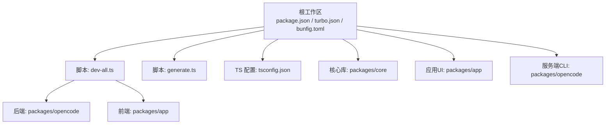
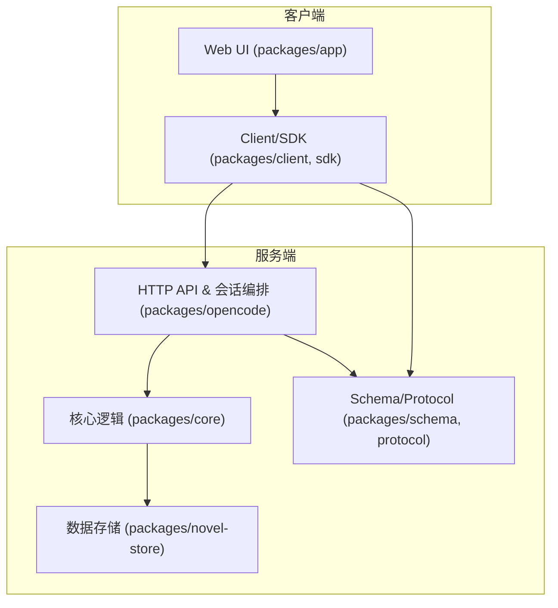
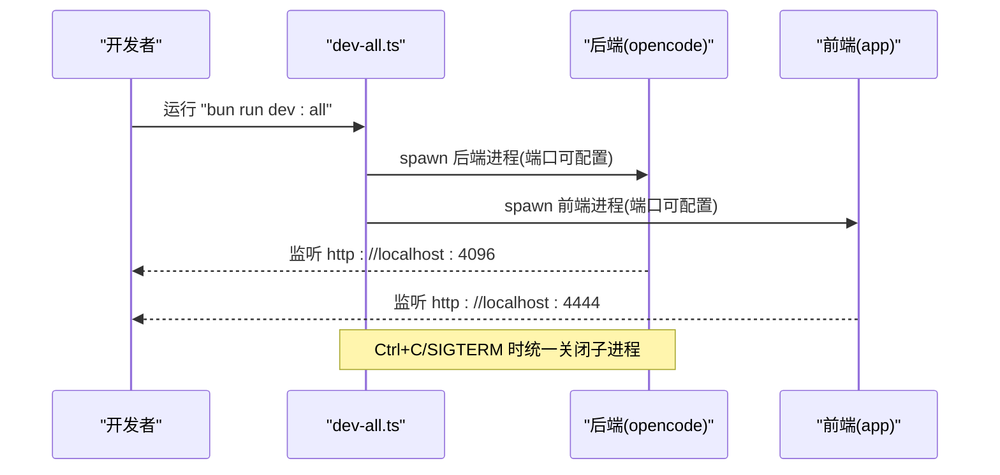
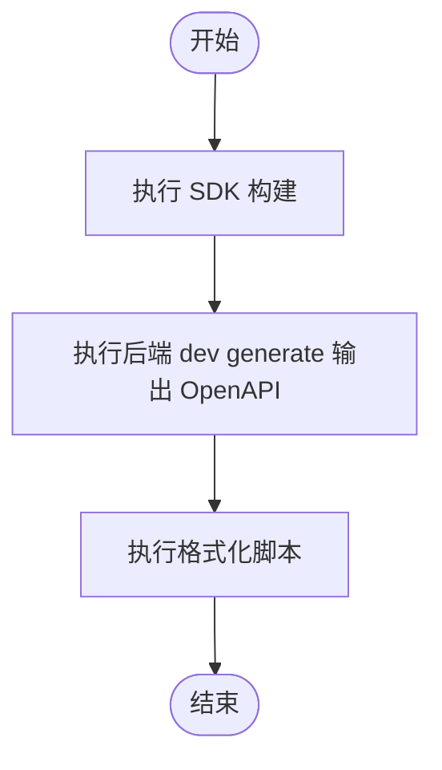
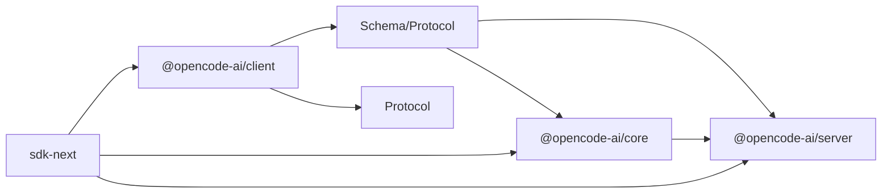
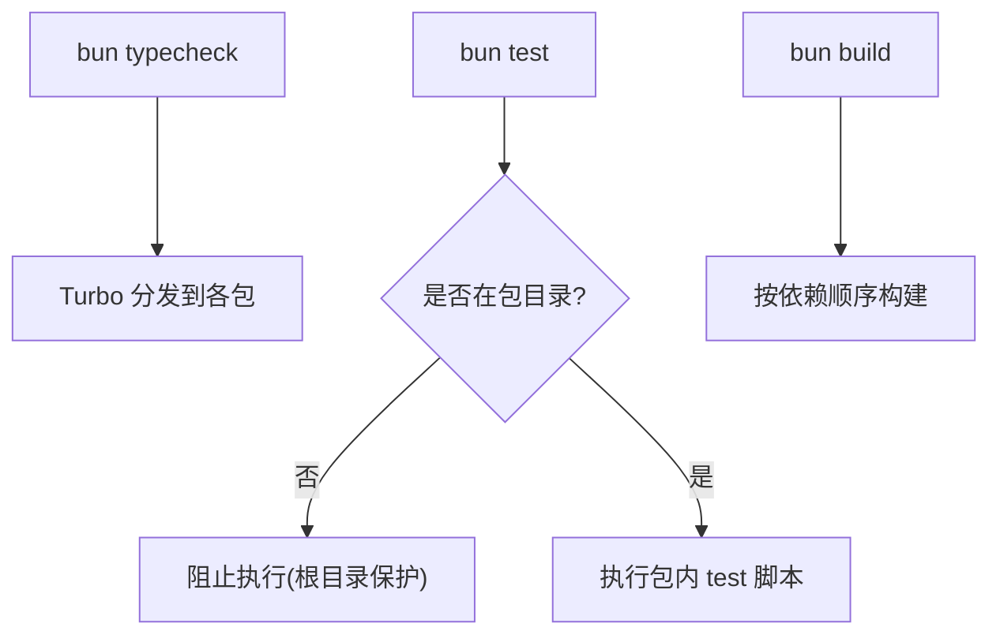
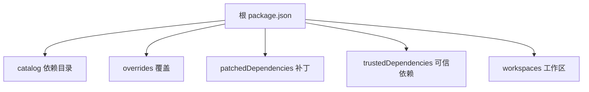

# 开发者指南

<cite>
**本文引用的文件**   
- [package.json](file://package.json)
- [README.md](file://README.md)
- [CONTRIBUTING.md](file://CONTRIBUTING.md)
- [turbo.json](file://turbo.json)
- [bunfig.toml](file://bunfig.toml)
- [AGENTS.md](file://AGENTS.md)
- [tsconfig.json](file://tsconfig.json)
- [script/dev-all.ts](file://script/dev-all.ts)
- [script/generate.ts](file://script/generate.ts)
- [packages/opencode/package.json](file://packages/opencode/package.json)
- [packages/app/package.json](file://packages/app/package.json)
- [packages/core/package.json](file://packages/core/package.json)
</cite>

## 目录
1. [简介](#简介)
2. [项目结构](#项目结构)
3. [核心组件](#核心组件)
4. [架构总览](#架构总览)
5. [详细组件分析](#详细组件分析)
6. [依赖分析](#依赖分析)
7. [性能考虑](#性能考虑)
8. [故障排查指南](#故障排查指南)
9. [结论](#结论)
10. [附录](#附录)

## 简介
openNovel 是一个基于 Bun 的 Monorepo 开源小说写作工具，提供 AI 驱动的 8 步写作流水线与 37 维度连续性审计能力。仓库采用多包组织，包含后端服务、Web UI、核心库、协议与 Schema、插件等模块。开发体验围绕 Bun 生态构建，使用 Turbo 进行任务编排，Husky/Oxlint/Prettier 保障代码质量，并通过脚本统一生成 SDK 与 OpenAPI。

本指南面向贡献者与本地开发者，覆盖环境搭建、开发服务器启动、调试配置、代码规范与贡献流程、Monorepo 模式与包间依赖管理、常见问题与性能优化建议、以及代码审查与质量保证措施。

## 项目结构
- 根级 package.json 定义工作区、脚本命令、依赖版本目录（catalog）、补丁与覆盖策略，并指定包管理器为 bun@1.3.14。
- README 提供快速开始命令与架构概览，说明各包职责：novel-store、schema/protocol、opencode、app、plugin。
- turbo.json 定义全局环境变量与任务（typecheck/build/test）及依赖关系。
- bunfig.toml 锁定安装行为（精确版本、最小发布年龄），并限制测试根路径。
- tsconfig.json 继承 @tsconfig/bun，并设置 Solid JSX 源。
- script/dev-all.ts 一键启动后端与前端，支持端口覆盖与环境信号处理。
- script/generate.ts 统一执行 SDK 构建、OpenAPI 生成与格式化。

图表来源
- [package.json:1-162](file://package.json#L1-L162)
- [turbo.json:1-34](file://turbo.json#L1-L34)
- [bunfig.toml:1-9](file://bunfig.toml#L1-L9)
- [tsconfig.json:1-8](file://tsconfig.json#L1-L8)
- [script/dev-all.ts:1-61](file://script/dev-all.ts#L1-L61)
- [script/generate.ts:1-10](file://script/generate.ts#L1-L10)

章节来源
- [package.json:1-162](file://package.json#L1-L162)
- [README.md:1-77](file://README.md#L1-L77)
- [turbo.json:1-34](file://turbo.json#L1-L34)
- [bunfig.toml:1-9](file://bunfig.toml#L1-L9)
- [tsconfig.json:1-8](file://tsconfig.json#L1-L8)

## 核心组件
- 后端服务与 CLI（packages/opencode）：暴露 opennovel 命令，提供 HTTP API、会话编排、存储与 LLM 集成。
- Web UI（packages/app）：SolidJS 应用，Bookshelf、Workspace、审批流等界面。
- 核心库（packages/core）：Effect 层、Session Runner、系统上下文、数据库与文件系统抽象。
- 协议与 Schema（packages/schema、packages/protocol）：前后端共享契约。
- 插件（packages/plugin）：写作流水线工具（草稿、连续性审计、提交审核）。

章节来源
- [README.md:60-69](file://README.md#L60-L69)
- [packages/opencode/package.json:1-159](file://packages/opencode/package.json#L1-L159)
- [packages/app/package.json:1-97](file://packages/app/package.json#L1-L97)
- [packages/core/package.json:1-133](file://packages/core/package.json#L1-L133)

## 架构总览
openNovel 采用分层与职责分离的架构：
- 数据层：novel-store 负责小说、章节、角色、审校记录等持久化。
- 契约层：schema + protocol 定义 API 与数据结构。
- 服务端：opencode 提供 HTTP API、会话调度、LLM 调用、存储访问。
- 客户端：app 通过 client/sdk 调用 API，渲染 UI。
- 插件：封装写作流水线能力，供服务端或客户端组合使用。

图表来源
- [README.md:60-69](file://README.md#L60-L69)
- [packages/opencode/package.json:1-159](file://packages/opencode/package.json#L1-L159)
- [packages/app/package.json:1-97](file://packages/app/package.json#L1-L97)
- [packages/core/package.json:1-133](file://packages/core/package.json#L1-L133)

## 详细组件分析

### 开发环境与启动
- 前置要求：Bun 运行时。
- 克隆仓库后执行安装；可使用一条命令同时启动后端与前端，或通过两个终端分别启动。
- 默认端口：后端 4096，前端 4444；可通过环境变量覆盖。

图表来源
- [script/dev-all.ts:1-61](file://script/dev-all.ts#L1-L61)
- [README.md:34-58](file://README.md#L34-L58)

章节来源
- [README.md:34-58](file://README.md#L34-L58)
- [script/dev-all.ts:1-61](file://script/dev-all.ts#L1-L61)

### 代码生成与类型检查
- 生成 SDK 与 OpenAPI：根脚本统一调用 SDK 构建、后端 dev generate 输出 OpenAPI、再执行格式化。
- 类型检查：在各包内执行 typecheck（tsgo），避免直接 tsc。
- AGENTS 文档强调：变更公共 Protocol/Server HttpApi 后需重新生成，禁止直接编辑 generated 目录。

图表来源
- [script/generate.ts:1-10](file://script/generate.ts#L1-L10)
- [AGENTS.md:1-10](file://AGENTS.md#L1-L10)

章节来源
- [script/generate.ts:1-10](file://script/generate.ts#L1-L10)
- [AGENTS.md:1-10](file://AGENTS.md#L1-L10)

### 包结构与依赖管理（Monorepo）
- 工作区：根 package.json 声明 workspaces 与 catalog，集中管理依赖版本。
- 包职责：
  - packages/opencode：后端与 CLI，依赖 core、schema、protocol、server、sdk、plugin 等。
  - packages/app：Web UI，依赖 client、core、schema、sdk、session-ui、ui 等。
  - packages/core：核心库，暴露 effect/session/system-context 等导出，依赖 schema、llm、plugin 等。
- 依赖方向约束：Schema → Core/Protocol → Server；Client 仅依赖 Schema/Protocol；sdk-next 组合 Client/Core/Server。

图表来源
- [AGENTS.md:1-10](file://AGENTS.md#L1-L10)
- [packages/opencode/package.json:1-159](file://packages/opencode/package.json#L1-L159)
- [packages/app/package.json:1-97](file://packages/app/package.json#L1-L97)
- [packages/core/package.json:1-133](file://packages/core/package.json#L1-L133)

章节来源
- [package.json:26-96](file://package.json#L26-L96)
- [packages/opencode/package.json:1-159](file://packages/opencode/package.json#L1-L159)
- [packages/app/package.json:1-97](file://packages/app/package.json#L1-L97)
- [packages/core/package.json:1-133](file://packages/core/package.json#L1-L133)

### 任务编排与测试
- Turbo 任务：typecheck、build、test 等，部分测试任务依赖 ^build。
- 测试根限制：bunfig 将测试根指向 do-not-run-tests-from-root，防止在仓库根运行测试。
- 各包 test 脚本：如 opencode 的 httpapi 练习、core 的单元测试、app 的 unit/browser/e2e。

图表来源
- [turbo.json:1-34](file://turbo.json#L1-L34)
- [bunfig.toml:1-9](file://bunfig.toml#L1-L9)
- [packages/opencode/package.json:1-159](file://packages/opencode/package.json#L1-L159)
- [packages/app/package.json:1-97](file://packages/app/package.json#L1-L97)

章节来源
- [turbo.json:1-34](file://turbo.json#L1-L34)
- [bunfig.toml:1-9](file://bunfig.toml#L1-L9)
- [packages/opencode/package.json:1-159](file://packages/opencode/package.json#L1-L159)
- [packages/app/package.json:1-97](file://packages/app/package.json#L1-L97)

## 依赖分析
- 包管理器：Bun，严格版本与最小发布年龄策略提升稳定性。
- 依赖目录（catalog）：统一管理第三方依赖版本，减少冲突。
- 补丁与覆盖：patches 与 overrides 用于修复上游问题与统一版本。
- 可信依赖：trustedDependencies 列出需要信任的原生扩展。

图表来源
- [package.json:1-162](file://package.json#L1-L162)

章节来源
- [package.json:1-162](file://package.json#L1-L162)

## 性能考虑
- 构建与缓存：Turbo 的任务依赖与输出目录（dist/**）有助于增量构建与缓存命中。
- 依赖解析：Bun 的 exact 安装与 minimumReleaseAge 降低不稳定依赖引入的风险。
- 动态导入：AGENTS 建议在启动敏感入口中对重型模块使用动态导入，保持按需加载。
- 资源监控：core 与 opencode 集成 OpenTelemetry，便于追踪与性能分析。

[本节为通用指导，不直接分析具体文件]

## 故障排查指南
- 无法在根目录运行测试：bunfig 限制了测试根路径，请在包目录下执行测试。
- 端口占用：dev:all 支持 OPENNOVEL_SERVER_PORT 与 OPENNOVEL_WEB_PORT 覆盖端口。
- 类型检查失败：在各包目录执行 typecheck（tsgo），不要直接 tsc。
- 生成产物不一致：遵循 AGENTS 指引，变更公共接口后重新生成 SDK/OpenAPI，勿手动修改 generated 目录。
- 原生依赖问题：trustedDependencies 中的 node-pty、esbuild、tree-sitter 等可能需要额外环境准备。

章节来源
- [bunfig.toml:1-9](file://bunfig.toml#L1-L9)
- [script/dev-all.ts:1-61](file://script/dev-all.ts#L1-L61)
- [AGENTS.md:1-10](file://AGENTS.md#L1-L10)
- [package.json:129-138](file://package.json#L129-L138)

## 结论
openNovel 以 Bun 为核心，结合 Turbo、Husky、Oxlint、Prettier 形成高效的 Monorepo 开发体验。通过清晰的包职责与依赖约束、统一的生成与类型检查流程、以及完善的开发与调试脚本，开发者可以快速上手并持续迭代。建议遵循 AGENTS 与 CONTRIBUTING 规范，确保代码质量与协作效率。

[本节为总结性内容，不直接分析具体文件]

## 附录

### 开发命令速查
- 安装依赖：bun install
- 全量开发：bun run dev:all
- 单独启动后端：cd packages/opencode && bun run --conditions=browser ./src/index.ts serve --port 4096
- 单独启动前端：cd packages/app && bun dev -- --port 4444
- 类型检查：bun typecheck（在各包目录执行）
- 代码检查：bun lint（oxlint）
- 生成 SDK/OpenAPI：bun run generate

章节来源
- [README.md:34-58](file://README.md#L34-L58)
- [package.json:8-24](file://package.json#L8-L24)
- [script/dev-all.ts:1-61](file://script/dev-all.ts#L1-L61)
- [script/generate.ts:1-10](file://script/generate.ts#L1-L10)

### 贡献流程与代码规范
- 分支命名：短横线分隔，最多三个词，无斜杠与前缀。
- 提交信息：Conventional Commits，类型包括 feat/fix/docs/chore/refactor/test。
- PR 要求：小而专注、引用 issue、保证测试/类型检查/lint 通过；若变更 API/Protocol，需在 packages/client 下重新生成。
- 代码风格：参考 AGENTS.md，优先 const、早返回、避免 any、使用 Bun API、函数聚焦、谨慎解构、避免星号导入等。

章节来源
- [CONTRIBUTING.md:1-68](file://CONTRIBUTING.md#L1-L68)
- [AGENTS.md:7-34](file://AGENTS.md#L7-L34)
- [AGENTS.md:59-68](file://AGENTS.md#L59-L68)

### 版本管理与发布
- 默认分支：dev
- 版本与发布脚本：根脚本 version.ts/publish.ts 可用于版本与发布流程（由 CI/CD 驱动）。
- 依赖更新：bun install 受 minimumReleaseAge 控制，避免引入未稳定版本。

章节来源
- [CONTRIBUTING.md:6-14](file://CONTRIBUTING.md#L6-L14)
- [package.json:1-10](file://package.json#L1-L10)
- [bunfig.toml:1-5](file://bunfig.toml#L1-L5)