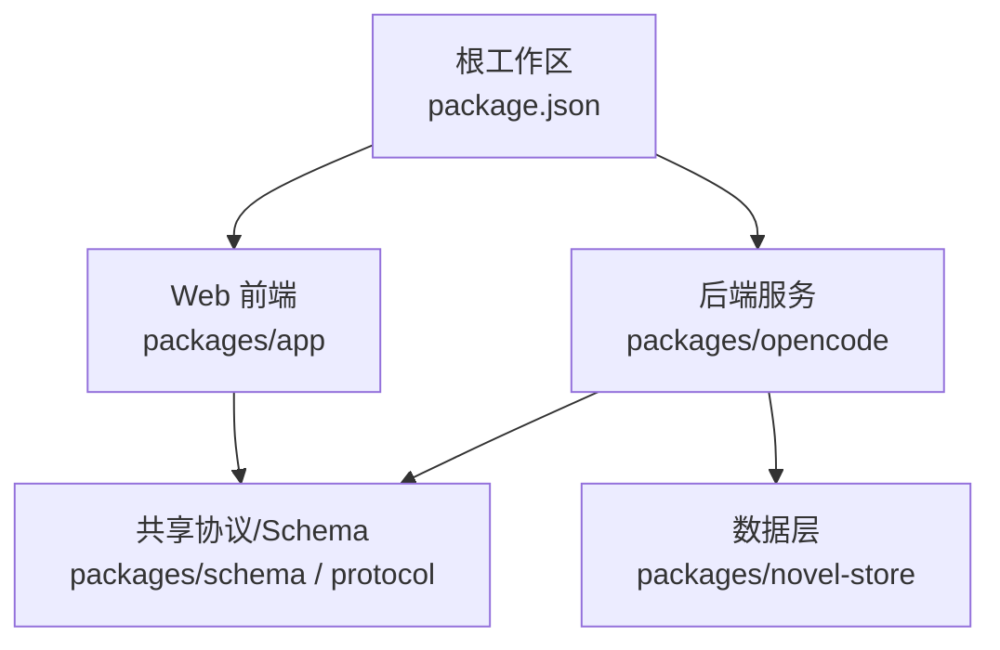
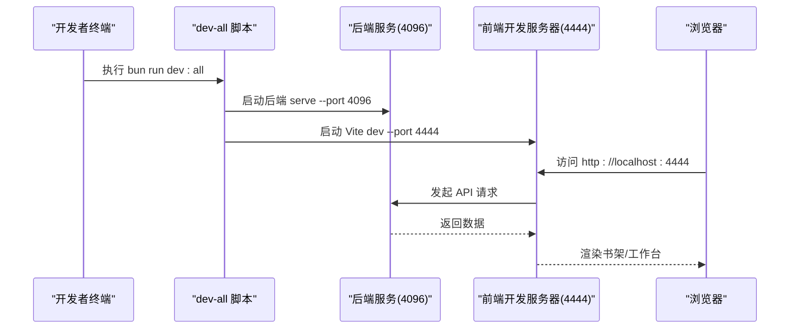
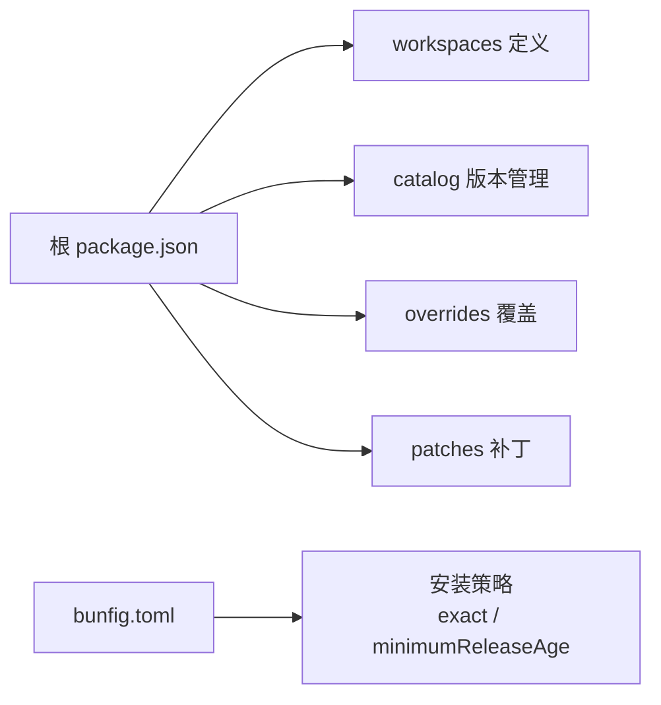

# 快速开始

<cite>
**本文引用的文件**   
- [README.md](file://README.md)
- [README.zh.md](file://README.zh.md)
- [package.json](file://package.json)
- [bunfig.toml](file://bunfig.toml)
- [script/dev-all.ts](file://script/dev-all.ts)
- [packages/opencode/package.json](file://packages/opencode/package.json)
- [packages/app/package.json](file://packages/app/package.json)
</cite>

## 目录
1. [简介](#简介)
2. [项目结构](#项目结构)
3. [核心组件](#核心组件)
4. [架构总览](#架构总览)
5. [详细组件分析](#详细组件分析)
6. [依赖分析](#依赖分析)
7. [性能注意事项](#性能注意事项)
8. [故障排除指南](#故障排除指南)
9. [结论](#结论)
10. [附录](#附录)

## 简介
openNovel 是一款 AI 驱动的小说创作工作台，提供从大纲到审校、修订与导出的完整写作流水线。本快速开始指南将帮助你从零开始准备环境、克隆并安装依赖、启动开发服务，并完成首次使用：打开 Web 界面、添加项目文件夹、创建第一部小说。

## 项目结构
本项目为基于 Bun 的 monorepo，核心模块包括：
- 后端服务与 CLI：packages/opencode
- Web 前端（SolidJS）：packages/app
- 数据层与协议：packages/novel-store、packages/schema、packages/protocol
- 插件与工具链：packages/plugin 等

图表来源
- [package.json:1-162](file://package.json#L1-L162)
- [packages/opencode/package.json:1-159](file://packages/opencode/package.json#L1-L159)
- [packages/app/package.json:1-97](file://packages/app/package.json#L1-L97)

章节来源
- [README.zh.md:34-54](file://README.zh.md#L34-L54)
- [package.json:1-162](file://package.json#L1-L162)

## 核心组件
- 一键启动脚本：通过根命令 bun run dev:all 同时启动后端与前端，默认端口分别为 4096（后端）和 4444（前端）。支持通过环境变量覆盖端口。
- 后端服务：位于 packages/opencode，提供 HTTP API 与 CLI。
- 前端应用：位于 packages/app，基于 Vite + SolidJS，提供书架、工作台与审批流等界面。

章节来源
- [README.zh.md:34-54](file://README.zh.md#L34-L54)
- [script/dev-all.ts:1-61](file://script/dev-all.ts#L1-L61)
- [packages/opencode/package.json:1-159](file://packages/opencode/package.json#L1-L159)
- [packages/app/package.json:1-97](file://packages/app/package.json#L1-L97)

## 架构总览
下图展示“一键启动”流程中各进程与端口的关系，以及前后端交互的基本路径。

图表来源
- [script/dev-all.ts:1-61](file://script/dev-all.ts#L1-L61)
- [packages/app/package.json:14-31](file://packages/app/package.json#L14-L31)
- [packages/opencode/package.json:14-16](file://packages/opencode/package.json#L14-L16)

## 详细组件分析

### 环境准备与环境要求
- 系统要求
  - 操作系统：Windows、macOS、Linux（Bun 官方支持的运行环境）
  - Node/Bun：必须安装 Bun（推荐版本由包管理器锁定）
- 安装 Bun
  - 参考 Bun 官网安装说明完成安装，并确保在命令行可执行 bun
- 验证环境
  - 在终端运行 bun --version 确认已安装成功

章节来源
- [package.json:7](file://package.json#L7)
- [README.zh.md:34-36](file://README.zh.md#L34-L36)

### 克隆仓库与安装依赖
- 克隆仓库
  - git clone https://github.com/MarsQiu007/openNovel.git
  - cd openNovel
- 安装依赖
  - bun install
  - 注意：bunfig.toml 配置了精确版本与最小发布年龄策略，确保依赖稳定

章节来源
- [README.zh.md:38-41](file://README.zh.md#L38-L41)
- [bunfig.toml:1-9](file://bunfig.toml#L1-L9)

### 启动开发环境（两种方法）
- 方法一：一键启动（推荐）
  - 在项目根目录执行：bun run dev:all
  - 后端监听 4096，前端监听 4444；任一进程退出或收到中断信号会统一关闭
  - 可通过环境变量覆盖端口：OPENNOVEL_SERVER_PORT、OPENNOVEL_WEB_PORT
- 方法二：分终端启动
  - 终端 1（后端）：cd packages/opencode && bun run --conditions=browser ./src/index.ts serve --port 4096
  - 终端 2（前端）：cd packages/app && bun dev -- --port 4444

章节来源
- [README.zh.md:43-50](file://README.zh.md#L43-L50)
- [script/dev-all.ts:1-61](file://script/dev-all.ts#L1-L61)
- [packages/app/package.json:14-31](file://packages/app/package.json#L14-L31)
- [packages/opencode/package.json:14-16](file://packages/opencode/package.json#L14-L16)

### 首次使用教程（从打开 Web 到创建第一部小说）
- 打开浏览器访问 http://localhost:4444
- 在界面中添加本地项目文件夹（用于存放你的小说数据）
- 进入书架，使用“创建向导”设置类型、世界观、角色与分卷结构
- 在工作台进行章节树管理、阅读、角色/大纲/节奏面板编辑与全文搜索
- 使用导出功能输出稿件

章节来源
- [README.zh.md:52-54](file://README.zh.md#L52-L54)

### 常用命令速查
- 根命令
  - bun run dev:all：一键启动后端与前端
  - bun typecheck：类型检查
  - bun lint：代码风格检查
- 前端（packages/app）
  - bun dev：启动 Vite 开发服务器
  - bun build：构建生产产物
- 后端（packages/opencode）
  - bun run --conditions=browser ./src/index.ts serve --port 4096：启动后端服务

章节来源
- [package.json:8-24](file://package.json#L8-L24)
- [packages/app/package.json:14-31](file://packages/app/package.json#L14-L31)
- [packages/opencode/package.json:14-16](file://packages/opencode/package.json#L14-L16)

## 依赖分析
- 包管理器与工作区
  - 根 package.json 声明了 workspaces 与 catalog，统一管理依赖版本
  - bunfig.toml 启用 exact 与 minimumReleaseAge，提升依赖稳定性
- 关键依赖
  - 前端：Vite、SolidJS、TailwindCSS 等
  - 后端：Effect、Hono、Drizzle ORM、WebSocket 等
- 补丁与覆盖
  - 部分第三方包通过 patches 与 overrides 进行定制，避免兼容性问题

图表来源
- [package.json:26-96](file://package.json#L26-L96)
- [package.json:139-160](file://package.json#L139-L160)
- [bunfig.toml:1-9](file://bunfig.toml#L1-L9)

章节来源
- [package.json:1-162](file://package.json#L1-L162)
- [bunfig.toml:1-9](file://bunfig.toml#L1-L9)

## 性能注意事项
- 依赖安装策略
  - 使用 exact 与 minimumReleaseAge 减少不稳定依赖引入，降低安装与构建波动
- 开发体验优化
  - 前端使用 Vite 热更新，后端使用 Bun 原生能力，启动与热重载更快
- 资源占用
  - 同时运行前后端时，建议合理分配内存与 CPU 配额，避免并发任务过多导致卡顿

[本节为通用指导，不直接分析具体文件]

## 故障排除指南
- 常见问题与解决思路
  - 无法启动后端
    - 检查端口是否被占用（默认 4096），必要时通过 OPENNOVEL_SERVER_PORT 覆盖
    - 查看终端日志，确认依赖安装完整
  - 前端无法连接后端
    - 确认后端已启动且端口可达
    - 检查跨域与代理配置（如需要）
  - 模型不可用或认证失败
    - 检查 Provider 配置与网络连通性
    - 重新认证或刷新令牌
  - 端口冲突
    - 修改 OPENNOVEL_WEB_PORT 或 OPENNOVEL_SERVER_PORT 后重启
- 调试技巧
  - 使用分终端方式分别启动后端与前端，便于定位问题
  - 观察 dev-all 脚本输出的进程状态与退出码

章节来源
- [script/dev-all.ts:1-61](file://script/dev-all.ts#L1-L61)
- [README.zh.md:43-50](file://README.zh.md#L43-L50)

## 结论
通过以上步骤，你可以在本地快速搭建 openNovel 的开发环境，使用一键命令或分终端方式启动前后端，并在 Web 界面中完成从书架到工作台的完整创作流程。遇到问题时，优先检查端口、依赖与日志，逐步定位与修复。

[本节为总结性内容，不直接分析具体文件]

## 附录
- 相关文档与截图
  - README.zh.md 提供了特性介绍、截图与快速开始说明
- 贡献与规范
  - CONTRIBUTING.md 包含分支命名、提交规范与开发命令说明

章节来源
- [README.zh.md:1-73](file://README.zh.md#L1-L73)
- [CONTRIBUTING.md:1-68](file://CONTRIBUTING.md#L1-L68)