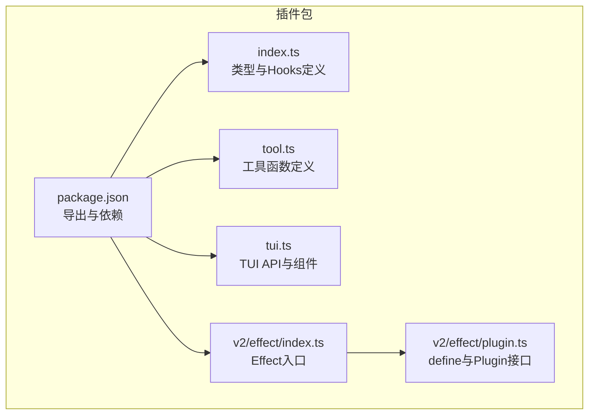
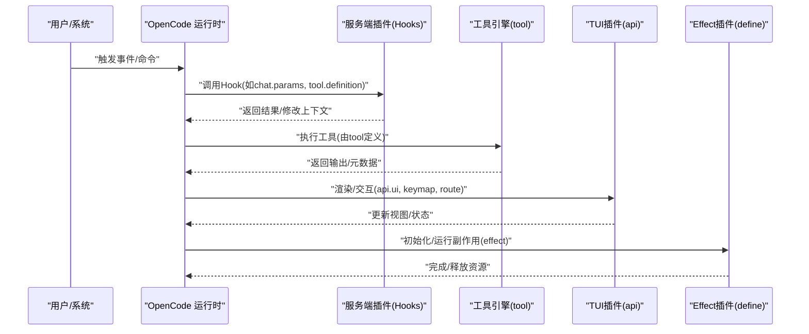
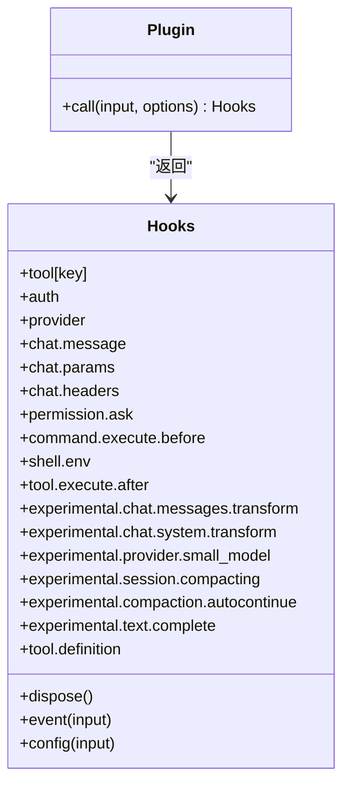
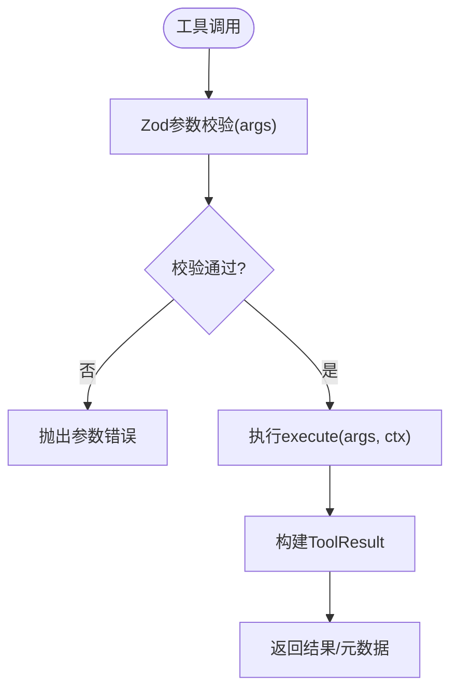
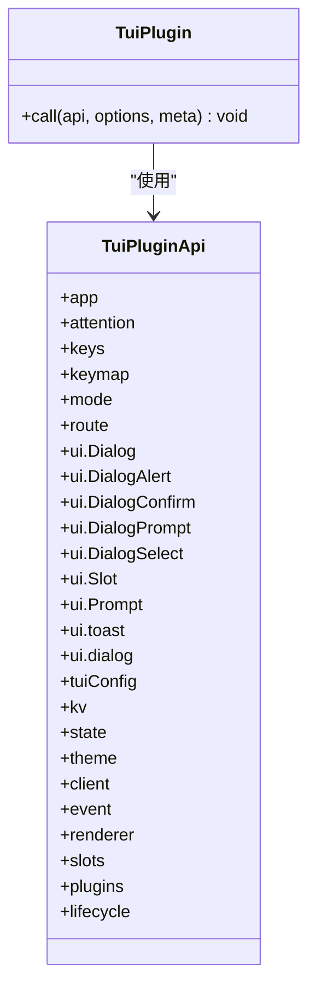
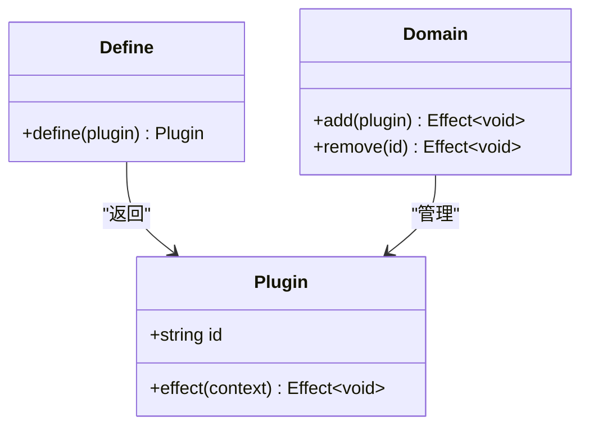
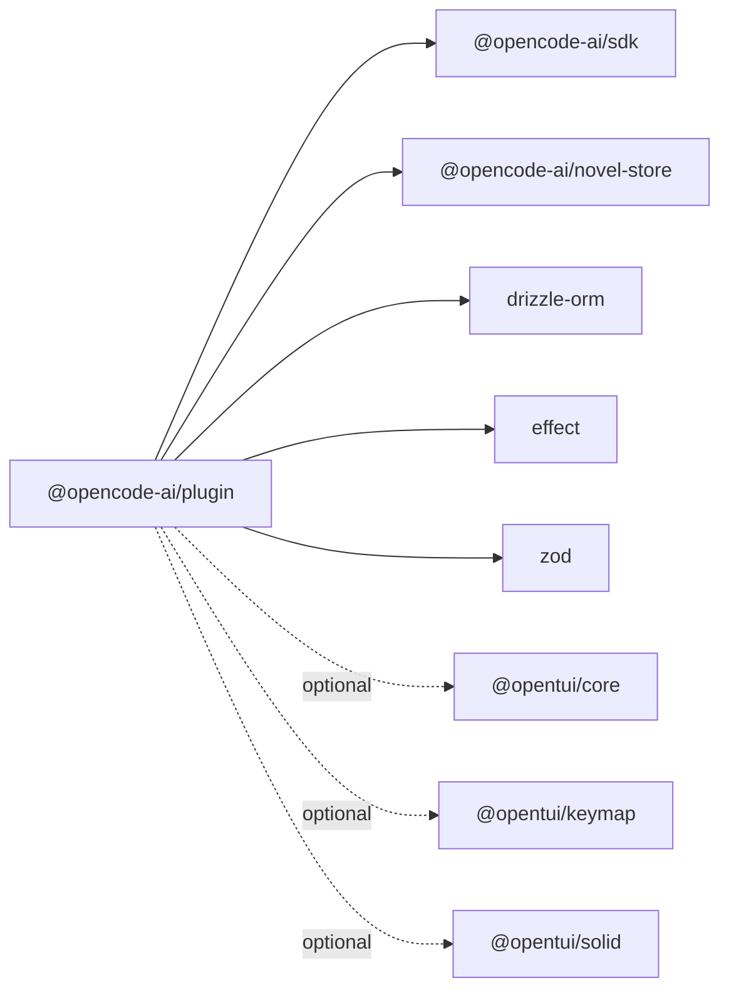

# 插件开发指南

<cite>
**本文引用的文件**   
- [packages/plugin/package.json](file://packages/plugin/package.json)
- [packages/plugin/src/index.ts](file://packages/plugin/src/index.ts)
- [packages/plugin/src/tool.ts](file://packages/plugin/src/tool.ts)
- [packages/plugin/src/tui.ts](file://packages/plugin/src/tui.ts)
- [packages/plugin/src/v2/effect/index.ts](file://packages/plugin/src/v2/effect/index.ts)
- [packages/plugin/src/v2/effect/plugin.ts](file://packages/plugin/src/v2/effect/plugin.ts)
- [packages/web/src/content/docs/zh-cn/plugins.mdx](file://packages/web/src/content/docs/zh-cn/plugins.mdx)
</cite>

## 目录
1. [简介](#简介)
2. [项目结构](#项目结构)
3. [核心组件](#核心组件)
4. [架构总览](#架构总览)
5. [详细组件分析](#详细组件分析)
6. [依赖分析](#依赖分析)
7. [性能考虑](#性能考虑)
8. [故障排查指南](#故障排查指南)
9. [结论](#结论)
10. [附录](#附录)

## 简介
本指南面向 openNovel 插件开发者，系统讲解如何从零开始创建、配置、构建与发布插件。内容涵盖：
- 插件项目的初始化设置、依赖管理与构建流程
- 插件开发模板与自定义选项
- 插件 API：工具函数、TUI 组件与 Effect 集成
- 完整示例：从简单工具到复杂功能的实现思路
- 调试技巧、错误处理与性能优化建议
- 插件测试策略与单元测试编写方法

## 项目结构
插件能力集中在 packages/plugin 包中，提供三类主要入口：
- 服务端插件（server）：通过 Hooks 扩展运行时行为
- TUI 插件（tui）：扩展终端界面交互与状态
- v2 Effect 插件（effect）：基于 Effect 的声明式插件定义

图表来源
- [packages/plugin/package.json:1-61](file://packages/plugin/package.json#L1-L61)
- [packages/plugin/src/index.ts:1-354](file://packages/plugin/src/index.ts#L1-L354)
- [packages/plugin/src/tool.ts:1-55](file://packages/plugin/src/tool.ts#L1-L55)
- [packages/plugin/src/tui.ts:1-635](file://packages/plugin/src/tui.ts#L1-L635)
- [packages/plugin/src/v2/effect/index.ts:1-4](file://packages/plugin/src/v2/effect/index.ts#L1-L4)
- [packages/plugin/src/v2/effect/plugin.ts:1-17](file://packages/plugin/src/v2/effect/plugin.ts#L1-L17)

章节来源
- [packages/plugin/package.json:1-61](file://packages/plugin/package.json#L1-L61)

## 核心组件
- 插件类型与生命周期
  - Plugin：服务端插件入口，返回一组 Hooks
  - TuiPlugin：TUI 插件入口，接收 TuiPluginApi
  - v2 Plugin：基于 Effect 的插件定义，使用 define 包装
- 工具函数
  - tool：声明式工具定义，参数校验由 Zod 驱动
- TUI 能力
  - 路由、键位映射、对话框、主题、KV 存储、事件总线、插槽等
- Effect 集成
  - define 与 Plugin 接口，支持 Scope 资源管理

章节来源
- [packages/plugin/src/index.ts:92-98](file://packages/plugin/src/index.ts#L92-L98)
- [packages/plugin/src/index.ts:240-354](file://packages/plugin/src/index.ts#L240-L354)
- [packages/plugin/src/tool.ts:45-55](file://packages/plugin/src/tool.ts#L45-L55)
- [packages/plugin/src/tui.ts:581-635](file://packages/plugin/src/tui.ts#L581-L635)
- [packages/plugin/src/v2/effect/plugin.ts:4-17](file://packages/plugin/src/v2/effect/plugin.ts#L4-L17)

## 架构总览
下图展示插件在运行时的加载与调用关系：用户或系统触发事件后，OpenCode 调用对应 Hook；工具通过 tool 定义暴露给 LLM/Agent；TUI 插件通过 api 扩展界面；Effect 插件以声明式方式组织副作用。

图表来源
- [packages/plugin/src/index.ts:240-354](file://packages/plugin/src/index.ts#L240-L354)
- [packages/plugin/src/tool.ts:45-55](file://packages/plugin/src/tool.ts#L45-L55)
- [packages/plugin/src/tui.ts:581-635](file://packages/plugin/src/tui.ts#L581-L635)
- [packages/plugin/src/v2/effect/plugin.ts:4-17](file://packages/plugin/src/v2/effect/plugin.ts#L4-L17)

## 详细组件分析

### 服务端插件与 Hooks
- 插件入口
  - Plugin(input, options) => Promise<Hooks>
  - input 包含 client、project、directory、worktree、BunShell($)、实验性 workspace 注册等
- 关键 Hooks
  - event、config、tool、auth、provider
  - chat.message、chat.params、chat.headers
  - permission.ask、command.execute.before/after
  - shell.env
  - experimental.*：消息转换、系统提示注入、会话压缩、文本补全、小模型选择等
- 权限与 Agent 配置
  - PluginPermissionConfig、PluginAgentConfig 扩展 SDK 默认权限与 Agent 配置

图表来源
- [packages/plugin/src/index.ts:92-98](file://packages/plugin/src/index.ts#L92-L98)
- [packages/plugin/src/index.ts:240-354](file://packages/plugin/src/index.ts#L240-L354)

章节来源
- [packages/plugin/src/index.ts:56-90](file://packages/plugin/src/index.ts#L56-L90)
- [packages/plugin/src/index.ts:240-354](file://packages/plugin/src/index.ts#L240-L354)

### 工具函数（tool）
- 声明式工具定义
  - tool({ description, args, execute })
  - args 使用 Zod schema 描述，execute 接收解析后的参数与上下文
- 上下文（ToolContext）
  - sessionID、messageID、agent、directory、worktree、abort、metadata、ask
- 返回值（ToolResult）
  - 字符串或结构化对象（title、output、metadata、attachments）

图表来源
- [packages/plugin/src/tool.ts:45-55](file://packages/plugin/src/tool.ts#L45-L55)

章节来源
- [packages/plugin/src/tool.ts:3-55](file://packages/plugin/src/tool.ts#L3-L55)

### TUI 插件与组件
- 插件入口
  - TuiPlugin(api, options, meta) => Promise<void>
- 可用 API
  - app、attention、keys、keymap、mode、route、ui、tuiConfig、kv、state、theme、client、event、renderer、slots、plugins、lifecycle
- UI 组件
  - Dialog、DialogAlert、DialogConfirm、DialogPrompt、DialogSelect、Slot、Prompt、toast、dialog
- 其他能力
  - 键位映射、主题切换、KV 存储、事件总线、插槽扩展、插件安装/激活

图表来源
- [packages/plugin/src/tui.ts:581-635](file://packages/plugin/src/tui.ts#L581-L635)

章节来源
- [packages/plugin/src/tui.ts:532-635](file://packages/plugin/src/tui.ts#L532-L635)

### Effect 插件（v2）
- 定义插件
  - define(plugin) 返回插件实例
- 插件接口
  - id、effect(context) => Effect<void, never, R>
- 领域管理
  - PluginDomain.add/remove 用于动态注册与卸载

图表来源
- [packages/plugin/src/v2/effect/plugin.ts:4-17](file://packages/plugin/src/v2/effect/plugin.ts#L4-L17)
- [packages/plugin/src/v2/effect/index.ts:1-4](file://packages/plugin/src/v2/effect/index.ts#L1-L4)

章节来源
- [packages/plugin/src/v2/effect/plugin.ts:1-17](file://packages/plugin/src/v2/effect/plugin.ts#L1-L17)
- [packages/plugin/src/v2/effect/index.ts:1-4](file://packages/plugin/src/v2/effect/index.ts#L1-L4)

### 插件加载与配置
- 本地加载
  - .opencode/plugins/ 与 ~/.config/opencode/plugins/ 自动加载
- npm 加载
  - 配置文件指定包名，启动时自动安装并缓存
- 加载顺序
  - 按目录与包名排序，确保依赖顺序可控

章节来源
- [packages/web/src/content/docs/zh-cn/plugins.mdx:18-50](file://packages/web/src/content/docs/zh-cn/plugins.mdx#L18-L50)

## 依赖分析
- 包导出
  - 根导出、tool、tui、novel-writer、v2/effect、v2/promise 等子路径
- 运行时依赖
  - @opencode-ai/sdk、@opencode-ai/novel-store、drizzle-orm、effect、zod
- 对端依赖（peerDependencies）
  - @opentui/core、@opentui/keymap、@opentui/solid（可选）

图表来源
- [packages/plugin/package.json:27-50](file://packages/plugin/package.json#L27-L50)

章节来源
- [packages/plugin/package.json:11-23](file://packages/plugin/package.json#L11-L23)
- [packages/plugin/package.json:27-50](file://packages/plugin/package.json#L27-L50)

## 性能考虑
- 工具执行
  - 使用 Zod 进行快速参数校验，避免重复解析
  - 尽量在 execute 中使用工作树与工作目录，减少路径计算开销
- Hooks 调用
  - 避免在高频 Hook（如 chat.params、chat.headers）中进行重 IO
  - 将耗时逻辑异步化，必要时缓存结果
- TUI 渲染
  - 合理使用 Slot 与路由，避免不必要的重渲染
  - 使用 KV 存储持久化轻量配置，减少重复读取
- Effect 插件
  - 利用 Scope 管理资源，确保及时释放
  - 将副作用收敛到 effect 中，保持纯函数风格

[本节为通用指导，不直接分析具体文件]

## 故障排查指南
- 插件未加载
  - 检查本地插件目录与 npm 包名是否正确
  - 确认配置文件 plugin 字段与加载顺序
- 工具报错
  - 查看 Zod 校验错误信息，修正参数结构
  - 检查 ToolContext 中的 directory/worktree 是否有效
- TUI 异常
  - 确认 api.ui 组件 props 是否符合类型定义
  - 检查 keymap 绑定冲突与路由命名
- Effect 问题
  - 检查 define 返回的插件 id 唯一性
  - 确认 effect 内部资源释放逻辑

章节来源
- [packages/plugin/src/tool.ts:45-55](file://packages/plugin/src/tool.ts#L45-L55)
- [packages/plugin/src/tui.ts:581-635](file://packages/plugin/src/tui.ts#L581-L635)
- [packages/plugin/src/v2/effect/plugin.ts:4-17](file://packages/plugin/src/v2/effect/plugin.ts#L4-L17)

## 结论
通过本指南，你可以掌握 openNovel 插件的核心概念与实现方式：
- 使用 tool 声明式定义工具，结合 Zod 保证参数安全
- 通过 Hooks 扩展运行时行为，灵活接入业务逻辑
- 借助 TUI API 构建丰富的终端交互体验
- 使用 Effect 插件管理副作用与资源
- 遵循性能与可维护性最佳实践，提升插件质量

[本节为总结，不直接分析具体文件]

## 附录

### 插件初始化与构建流程
- 初始化
  - 在 .opencode/plugins/ 下创建 TypeScript/JavaScript 文件
  - 如需外部依赖，在配置目录创建 package.json 或在 npm 发布
- 构建
  - 使用包的 build 脚本（tsc）生成 dist
  - 确保 exports 字段正确指向入口与子模块

章节来源
- [packages/plugin/package.json:7-10](file://packages/plugin/package.json#L7-L10)
- [packages/plugin/package.json:11-23](file://packages/plugin/package.json#L11-L23)
- [packages/web/src/content/docs/zh-cn/plugins.mdx:18-50](file://packages/web/src/content/docs/zh-cn/plugins.mdx#L18-L50)

### 插件开发模板与自定义选项
- 基本模板
  - 导出一个函数，接收输入参数，返回 Hooks
- 自定义选项
  - PluginOptions 允许传递任意键值对
  - TUI 插件可通过 options 与 meta 获取插件元数据

章节来源
- [packages/plugin/src/index.ts:68-90](file://packages/plugin/src/index.ts#L68-L90)
- [packages/plugin/src/tui.ts:532-549](file://packages/plugin/src/tui.ts#L532-L549)

### 完整示例思路
- 简单工具
  - 使用 tool 定义一个只读工具，返回静态信息
- 复杂功能
  - 组合多个 Hooks：system.transform、session.compacting、tool.definition
  - 使用 TUI 插件提供交互式面板与状态展示
  - 使用 Effect 插件编排副作用与资源生命周期

[本节为概念性说明，不直接分析具体文件]

### 调试技巧
- 日志输出
  - 在工具与 Hooks 中打印关键路径与参数
- 断点调试
  - 使用 IDE 调试 TypeScript 源文件
- 插件热重载
  - 本地插件修改后重启以生效

[本节为通用指导，不直接分析具体文件]

### 错误处理与重试
- 参数校验失败
  - 捕获 Zod 错误并返回友好提示
- 网络与 IO
  - 使用 try/catch 包裹，记录错误上下文
- 幂等性
  - 工具设计应支持重复调用不产生副作用

[本节为通用指导，不直接分析具体文件]

### 性能优化建议
- 缓存热点数据
  - 使用 KV 存储或内存缓存
- 批量操作
  - 合并多次数据库查询与文件读写
- 延迟加载
  - 按需加载重型模块与资源

[本节为通用指导，不直接分析具体文件]

### 测试策略与单元测试
- 工具测试
  - 构造 ToolContext 与参数，验证 execute 输出
- Hook 测试
  - 模拟输入与输出，验证行为符合预期
- TUI 测试
  - 使用 mock 渲染与事件触发，验证 UI 状态变化
- Effect 测试
  - 使用 Effect 测试库验证副作用与资源释放

[本节为通用指导，不直接分析具体文件]