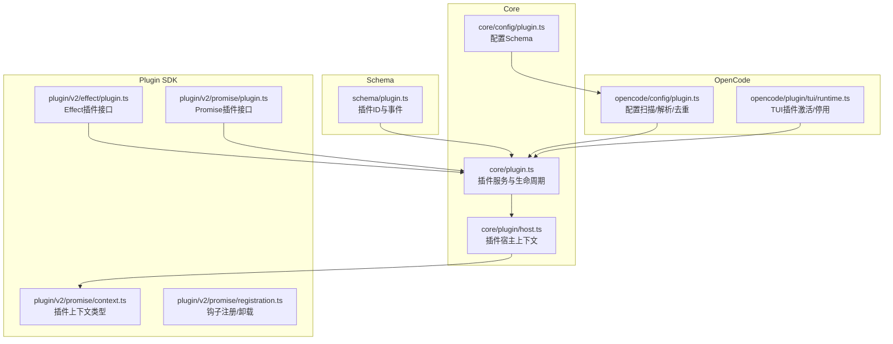
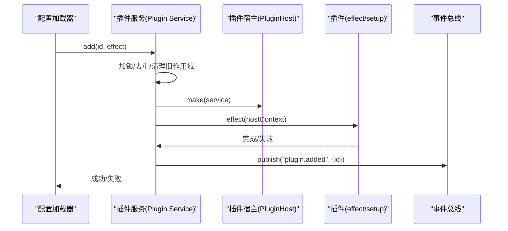
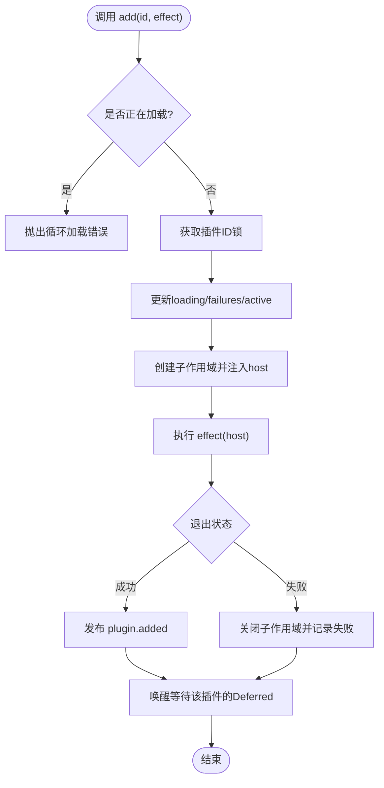
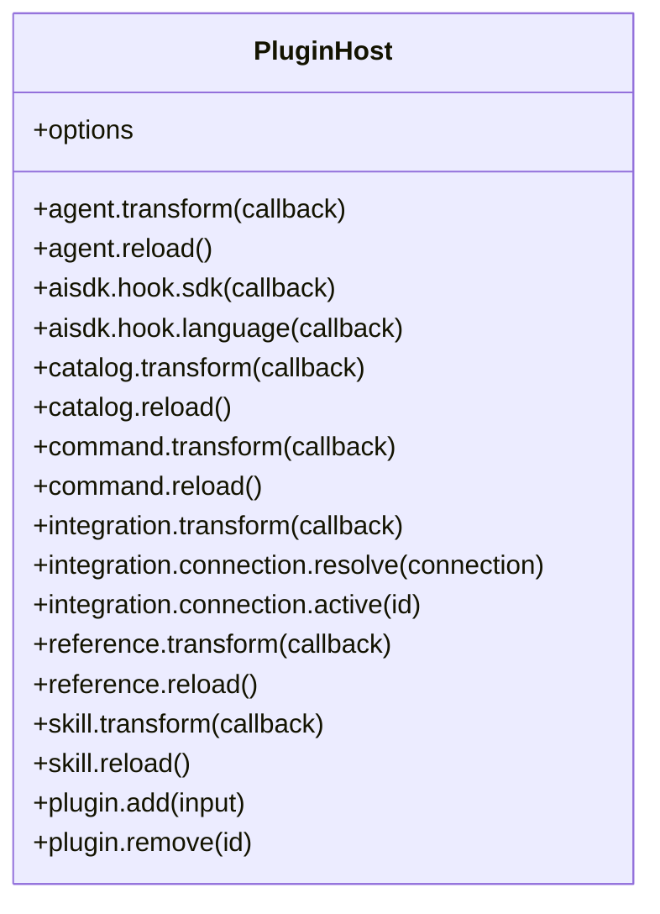
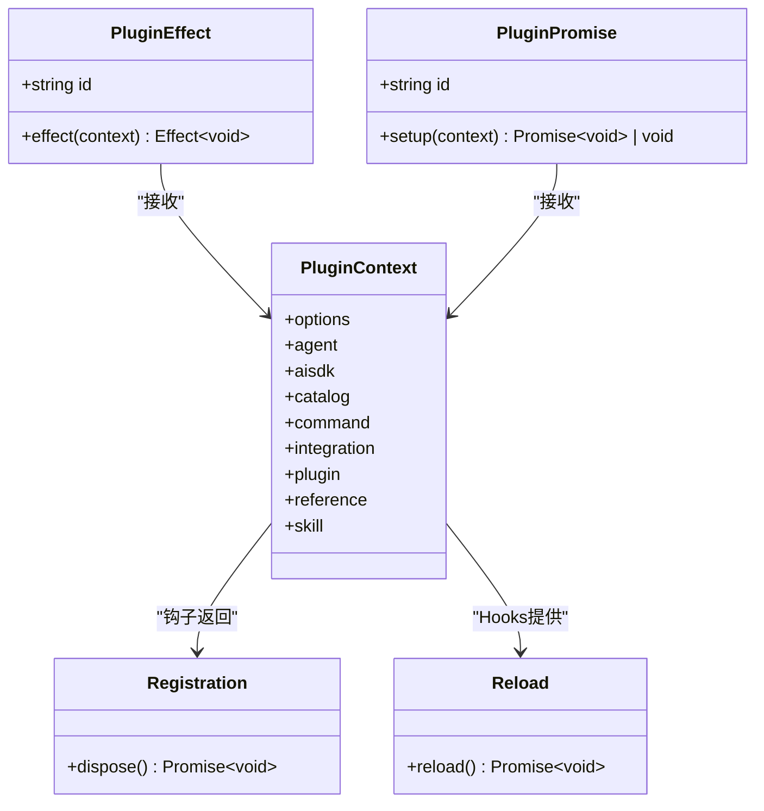
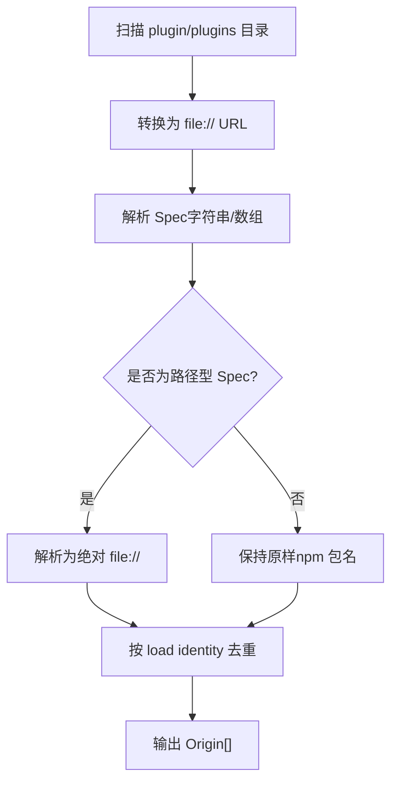
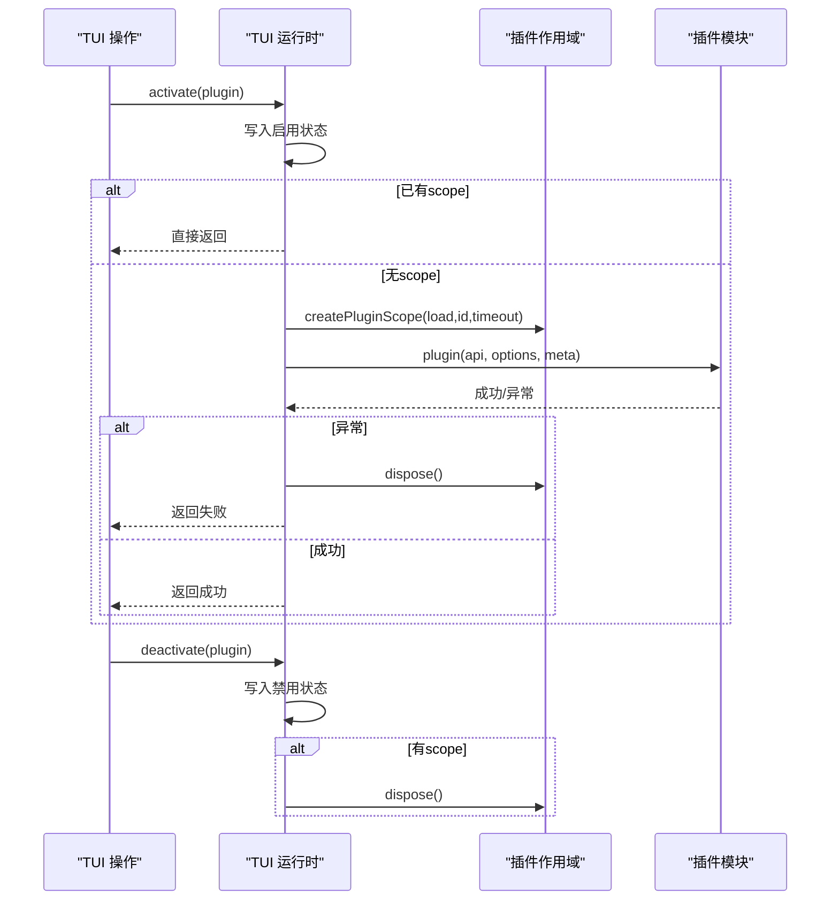
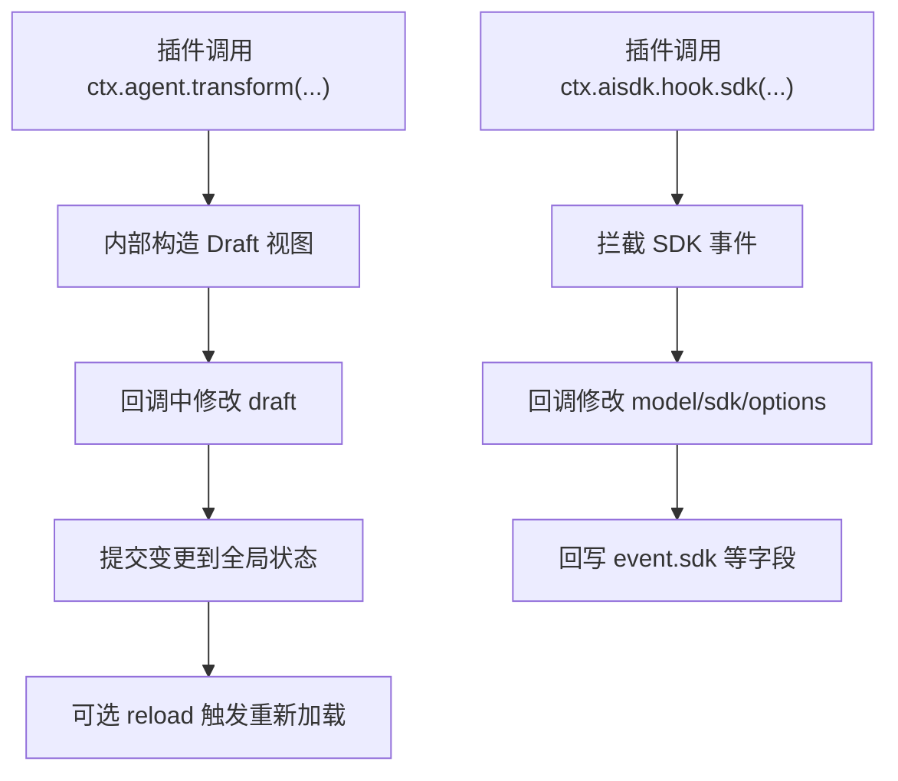
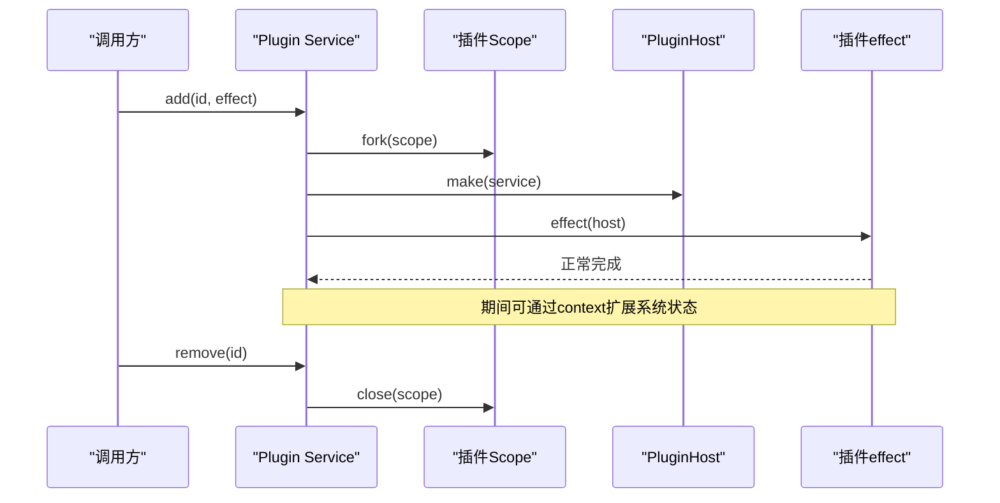
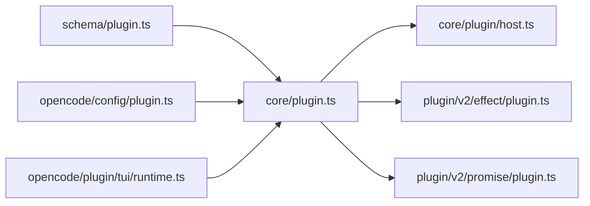

# 插件架构设计

<cite>
**本文引用的文件**   
- [packages/core/src/plugin.ts](file://packages/core/src/plugin.ts)
- [packages/core/src/plugin/host.ts](file://packages/core/src/plugin/host.ts)
- [packages/schema/src/plugin.ts](file://packages/schema/src/plugin.ts)
- [packages/core/src/config/plugin.ts](file://packages/core/src/config/plugin.ts)
- [packages/opencode/src/config/plugin.ts](file://packages/opencode/src/config/plugin.ts)
- [packages/plugin/src/v2/effect/plugin.ts](file://packages/plugin/src/v2/effect/plugin.ts)
- [packages/plugin/src/v2/promise/plugin.ts](file://packages/plugin/src/v2/promise/plugin.ts)
- [packages/plugin/src/v2/promise/context.ts](file://packages/plugin/src/v2/promise/context.ts)
- [packages/plugin/src/v2/promise/registration.ts](file://packages/plugin/src/v2/promise/registration.ts)
- [packages/core/test/plugin/promise.test.ts](file://packages/core/test/plugin/promise.test.ts)
- [packages/opencode/test/plugin/trigger.test.ts](file://packages/opencode/test/plugin/trigger.test.ts)
- [packages/opencode/src/plugin/tui/runtime.ts](file://packages/opencode/src/plugin/tui/runtime.ts)
</cite>

## 目录
1. [简介](#简介)
2. [项目结构](#项目结构)
3. [核心组件](#核心组件)
4. [架构总览](#架构总览)
5. [详细组件分析](#详细组件分析)
6. [依赖关系分析](#依赖关系分析)
7. [性能考量](#性能考量)
8. [故障排查指南](#故障排查指南)
9. [结论](#结论)
10. [附录](#附录)

## 简介
本文件系统化阐述 openNovel 插件系统的架构设计，覆盖高层设计模式、插件生命周期管理、钩子机制与扩展点、加载机制、依赖管理与版本兼容性、插件与核心通信协议和数据交换格式，以及注册、初始化、执行、销毁的完整流程。同时给出插件沙箱安全机制与资源隔离策略说明，并提供架构图与数据流图帮助理解关键概念。

## 项目结构
插件系统由多包协作构成：
- schema 层定义插件 ID 与事件模型
- core 层实现插件服务、宿主上下文（PluginHost）、生命周期与范围管理
- plugin 包提供 v2 Effect/Promise 两种插件接口与上下文类型
- opencode 层负责配置解析、路径解析、去重与 TUI 运行时激活/停用

**图表来源** 
- [packages/schema/src/plugin.ts:1-14](file://packages/schema/src/plugin.ts#L1-L14)
- [packages/core/src/plugin.ts:1-168](file://packages/core/src/plugin.ts#L1-L168)
- [packages/core/src/plugin/host.ts:1-220](file://packages/core/src/plugin/host.ts#L1-L220)
- [packages/core/src/config/plugin.ts:1-14](file://packages/core/src/config/plugin.ts#L1-L14)
- [packages/opencode/src/config/plugin.ts:1-80](file://packages/opencode/src/config/plugin.ts#L1-L80)
- [packages/plugin/src/v2/effect/plugin.ts:1-17](file://packages/plugin/src/v2/effect/plugin.ts#L1-L17)
- [packages/plugin/src/v2/promise/plugin.ts:1-15](file://packages/plugin/src/v2/promise/plugin.ts#L1-L15)
- [packages/plugin/src/v2/promise/context.ts:1-23](file://packages/plugin/src/v2/promise/context.ts#L1-L23)
- [packages/plugin/src/v2/promise/registration.ts:1-11](file://packages/plugin/src/v2/promise/registration.ts#L1-L11)

**章节来源**
- [packages/schema/src/plugin.ts:1-14](file://packages/schema/src/plugin.ts#L1-L14)
- [packages/core/src/plugin.ts:1-168](file://packages/core/src/plugin.ts#L1-L168)
- [packages/core/src/config/plugin.ts:1-14](file://packages/core/src/config/plugin.ts#L1-L14)
- [packages/opencode/src/config/plugin.ts:1-80](file://packages/opencode/src/config/plugin.ts#L1-L80)
- [packages/plugin/src/v2/effect/plugin.ts:1-17](file://packages/plugin/src/v2/effect/plugin.ts#L1-L17)
- [packages/plugin/src/v2/promise/plugin.ts:1-15](file://packages/plugin/src/v2/promise/plugin.ts#L1-L15)
- [packages/plugin/src/v2/promise/context.ts:1-23](file://packages/plugin/src/v2/promise/context.ts#L1-L23)
- [packages/plugin/src/v2/promise/registration.ts:1-11](file://packages/plugin/src/v2/promise/registration.ts#L1-L11)

## 核心组件
- 插件标识与事件
  - 插件 ID 使用带品牌约束的字符串类型，确保类型安全
  - 插件添加事件用于通知外部监听者插件已加入运行期
- 插件服务与生命周期
  - 提供 add/remove/wait 能力，基于 Effect Scope 管理插件作用域
  - 并发控制通过 KeyedMutex 保证同一插件串行化加载/卸载
  - 失败状态缓存与等待队列支持 wait 语义
- 插件宿主上下文（PluginHost）
  - 向插件暴露 agent、aisdk、catalog、command、integration、reference、skill、plugin 等扩展点
  - 所有扩展点以 transform/reload 形式提供可观察的数据变更与重载能力
- 插件接口（v2）
  - Effect 风格：effect(context) => Effect<void>
  - Promise 风格：setup(context) => Promise<void> | void
  - 两者均通过 define 包装，统一入口
- 配置与加载
  - 配置 Schema 支持 package/options 或字符串简写
  - OpenCode 层扫描本地 plugin/plugins 目录，解析 file:// 与 npm 包名，去重并保留 Origin

**章节来源**
- [packages/schema/src/plugin.ts:1-14](file://packages/schema/src/plugin.ts#L1-L14)
- [packages/core/src/plugin.ts:1-168](file://packages/core/src/plugin.ts#L1-L168)
- [packages/core/src/plugin/host.ts:1-220](file://packages/core/src/plugin/host.ts#L1-L220)
- [packages/plugin/src/v2/effect/plugin.ts:1-17](file://packages/plugin/src/v2/effect/plugin.ts#L1-L17)
- [packages/plugin/src/v2/promise/plugin.ts:1-15](file://packages/plugin/src/v2/promise/plugin.ts#L1-L15)
- [packages/core/src/config/plugin.ts:1-14](file://packages/core/src/config/plugin.ts#L1-L14)
- [packages/opencode/src/config/plugin.ts:1-80](file://packages/opencode/src/config/plugin.ts#L1-L80)

## 架构总览
插件系统采用“服务 + 宿主上下文 + 作用域”的分层设计：
- 服务层（Plugin Service）负责插件注册、等待、移除与作用域管理
- 宿主层（PluginHost）将核心能力以只读/可变 Draft 的形式暴露给插件
- 插件层（Effect/Promise）按约定返回副作用或同步逻辑，并通过 Hook 机制参与系统扩展

**图表来源** 
- [packages/core/src/plugin.ts:31-143](file://packages/core/src/plugin.ts#L31-L143)
- [packages/core/src/plugin/host.ts:20-219](file://packages/core/src/plugin/host.ts#L20-L219)
- [packages/schema/src/plugin.ts:9-13](file://packages/schema/src/plugin.ts#L9-L13)

## 详细组件分析

### 插件服务与生命周期（Effect 版）
- 关键职责
  - 维护 active/loading/waiters/failures 状态
  - 使用 Scope 隔离每个插件的作用域，失败时自动关闭
  - 通过 Deferred 实现 wait(id) 的等待语义
  - 发布 Added 事件供外部订阅
- 复杂度与并发
  - 加锁粒度为插件 ID，避免循环加载与并发冲突
  - State.batch 批量更新，减少中间态抖动

**图表来源** 
- [packages/core/src/plugin.ts:31-143](file://packages/core/src/plugin.ts#L31-L143)

**章节来源**
- [packages/core/src/plugin.ts:31-143](file://packages/core/src/plugin.ts#L31-L143)

### 插件宿主上下文（PluginHost）
- 暴露能力
  - agent/catalg/command/integration/reference/skill：transform/reload
  - aisdk：sdk/language 钩子，允许插件修改模型、SDK、语言等
  - plugin：动态 add/remove 其他插件
- 数据访问模式
  - 通过 transform(draft => ...) 提供可变草稿视图，内部合并到全局状态
  - 对 OAuth/方法等复杂对象进行解码与封装，保证类型安全

**图表来源** 
- [packages/core/src/plugin/host.ts:20-219](file://packages/core/src/plugin/host.ts#L20-L219)

**章节来源**
- [packages/core/src/plugin/host.ts:20-219](file://packages/core/src/plugin/host.ts#L20-L219)

### 插件接口（v2 Effect 与 Promise）
- Effect 插件
  - 定义 id 与 effect(context) => Effect<void>
  - 通过 define 包装，便于类型推导
- Promise 插件
  - 定义 id 与 setup(context) => Promise<void> | void
  - 提供 Registration 与 Reload 抽象，支持钩子注册与热重载
- 上下文类型
  - 包含 options 与各领域 Hooks（agent/aisdk/catalog/command/integration/reference/skill）
  - 各 Hooks 通常具备 transform/reload 能力

**图表来源** 
- [packages/plugin/src/v2/effect/plugin.ts:1-17](file://packages/plugin/src/v2/effect/plugin.ts#L1-L17)
- [packages/plugin/src/v2/promise/plugin.ts:1-15](file://packages/plugin/src/v2/promise/plugin.ts#L1-L15)
- [packages/plugin/src/v2/promise/context.ts:1-23](file://packages/plugin/src/v2/promise/context.ts#L1-L23)
- [packages/plugin/src/v2/promise/registration.ts:1-11](file://packages/plugin/src/v2/promise/registration.ts#L1-L11)

**章节来源**
- [packages/plugin/src/v2/effect/plugin.ts:1-17](file://packages/plugin/src/v2/effect/plugin.ts#L1-L17)
- [packages/plugin/src/v2/promise/plugin.ts:1-15](file://packages/plugin/src/v2/promise/plugin.ts#L1-L15)
- [packages/plugin/src/v2/promise/context.ts:1-23](file://packages/plugin/src/v2/promise/context.ts#L1-L23)
- [packages/plugin/src/v2/promise/registration.ts:1-11](file://packages/plugin/src/v2/promise/registration.ts#L1-L11)

### 配置解析与加载（OpenCode）
- 扫描规则
  - 扫描 {plugin,plugins}/*.{ts,js}，生成 file:// URL
- 规范解析
  - 支持字符串或数组[spec, options]
  - 路径类 spec 会相对配置文件解析并转为绝对 file://
  - 支持 npm 包名与导出定位
- 去重策略
  - 基于 load identity（包名或精确 file://）去重，保留最终生效的 Origin

**图表来源** 
- [packages/opencode/src/config/plugin.ts:18-77](file://packages/opencode/src/config/plugin.ts#L18-L77)

**章节来源**
- [packages/opencode/src/config/plugin.ts:18-77](file://packages/opencode/src/config/plugin.ts#L18-L77)
- [packages/core/src/config/plugin.ts:5-11](file://packages/core/src/config/plugin.ts#L5-L11)

### TUI 插件激活/停用流程
- 激活
  - 设置 enabled=true，持久化状态
  - 若存在 scope 则复用，否则创建新 scope 并调用 plugin(api, options, meta)
  - 异常捕获并记录失败信息
- 停用
  - 设置 enabled=false，持久化状态
  - 若存在 scope 则 dispose 释放资源

**图表来源** 
- [packages/opencode/src/plugin/tui/runtime.ts:502-545](file://packages/opencode/src/plugin/tui/runtime.ts#L502-L545)

**章节来源**
- [packages/opencode/src/plugin/tui/runtime.ts:502-545](file://packages/opencode/src/plugin/tui/runtime.ts#L502-L545)

### 钩子机制与扩展点
- 扩展点
  - agent、catalog、command、integration、reference、skill 均提供 transform/reload
  - aisdk 提供 sdk/language 钩子，允许插件在模型/SDK/语言层面介入
- 钩子注册与卸载
  - 通过 Hooks<Spec> 抽象，回调返回 Registration，调用 dispose 即可卸载
- 触发行为
  - 测试用例验证同步与异步钩子均可正确执行

**图表来源** 
- [packages/core/src/plugin/host.ts:31-98](file://packages/core/src/plugin/host.ts#L31-L98)
- [packages/plugin/src/v2/promise/registration.ts:9-11](file://packages/plugin/src/v2/promise/registration.ts#L9-L11)
- [packages/opencode/test/plugin/trigger.test.ts:75-108](file://packages/opencode/test/plugin/trigger.test.ts#L75-L108)

**章节来源**
- [packages/core/src/plugin/host.ts:31-98](file://packages/core/src/plugin/host.ts#L31-L98)
- [packages/plugin/src/v2/promise/registration.ts:9-11](file://packages/plugin/src/v2/promise/registration.ts#L9-L11)
- [packages/opencode/test/plugin/trigger.test.ts:75-108](file://packages/opencode/test/plugin/trigger.test.ts#L75-L108)

### 插件注册、初始化、执行与销毁流程
- 注册
  - 通过 Plugin.Service.add(id, effect) 注册
- 初始化
  - 创建子 Scope，注入 host 上下文，执行 effect
- 执行
  - 插件通过 context 提供的扩展点进行状态变更与钩子注册
- 销毁
  - remove(id) 关闭对应 Scope；或在 Effect.onExit 失败路径自动关闭

**图表来源** 
- [packages/core/src/plugin.ts:43-98](file://packages/core/src/plugin.ts#L43-L98)
- [packages/core/src/plugin/host.ts:20-219](file://packages/core/src/plugin/host.ts#L20-L219)

**章节来源**
- [packages/core/src/plugin.ts:43-98](file://packages/core/src/plugin.ts#L43-L98)
- [packages/core/src/plugin/host.ts:20-219](file://packages/core/src/plugin/host.ts#L20-L219)

### 沙箱安全与资源隔离
- 作用域隔离
  - 每个插件拥有独立 Effect Scope，失败或移除时自动回收资源
- 并发控制
  - 基于 KeyedMutex 的插件级锁，防止循环加载与竞态
- 状态可见性
  - 通过 transform/draft 模式限制插件仅能修改受控视图，避免越界修改
- 超时与错误处理
  - TUI 激活过程支持超时与异常捕获，失败时回滚并释放作用域

**章节来源**
- [packages/core/src/plugin.ts:31-143](file://packages/core/src/plugin.ts#L31-L143)
- [packages/opencode/src/plugin/tui/runtime.ts:502-545](file://packages/opencode/src/plugin/tui/runtime.ts#L502-L545)

### 依赖管理与版本兼容性
- 依赖声明
  - plugin 包通过 peerDependencies 声明 @opentui/* 依赖，兼容不同宿主环境
- 版本兼容
  - v2 同时支持 Effect 与 Promise 两种插件风格，便于渐进迁移
- 配置兼容
  - 支持字符串与数组形式的插件规格，兼容历史配置

**章节来源**
- [packages/plugin/package.json:35-49](file://packages/plugin/package.json#L35-L49)
- [packages/plugin/src/v2/effect/plugin.ts:1-17](file://packages/plugin/src/v2/effect/plugin.ts#L1-L17)
- [packages/plugin/src/v2/promise/plugin.ts:1-15](file://packages/plugin/src/v2/promise/plugin.ts#L1-L15)
- [packages/core/src/config/plugin.ts:5-11](file://packages/core/src/config/plugin.ts#L5-L11)

## 依赖关系分析
- 组件耦合
  - Plugin Service 依赖 EventV2、AgentV2、AISDK、Catalog、CommandV2、Integration、Reference、SkillV2 等位置节点
  - PluginHost 依赖上述服务的 Service 实例，提供 transform/reload 能力
- 外部依赖
  - schema 层定义 ID 与事件，被 core 与 opencode 引用
  - plugin SDK 提供 v2 接口，被 core 与 opencode 消费

**图表来源** 
- [packages/schema/src/plugin.ts:1-14](file://packages/schema/src/plugin.ts#L1-L14)
- [packages/core/src/plugin.ts:1-168](file://packages/core/src/plugin.ts#L1-L168)
- [packages/core/src/plugin/host.ts:1-220](file://packages/core/src/plugin/host.ts#L1-L220)
- [packages/plugin/src/v2/effect/plugin.ts:1-17](file://packages/plugin/src/v2/effect/plugin.ts#L1-L17)
- [packages/plugin/src/v2/promise/plugin.ts:1-15](file://packages/plugin/src/v2/promise/plugin.ts#L1-L15)
- [packages/opencode/src/config/plugin.ts:1-80](file://packages/opencode/src/config/plugin.ts#L1-L80)
- [packages/opencode/src/plugin/tui/runtime.ts:502-545](file://packages/opencode/src/plugin/tui/runtime.ts#L502-L545)

**章节来源**
- [packages/core/src/plugin.ts:154-167](file://packages/core/src/plugin.ts#L154-L167)
- [packages/core/src/plugin/host.ts:1-220](file://packages/core/src/plugin/host.ts#L1-L220)

## 性能考量
- 批处理与延迟
  - State.batch 聚合多次状态更新，降低渲染与事件风暴
- 并发与锁
  - KeyedMutex 保证单插件串行化，避免重复加载与状态竞争
- 作用域回收
  - 失败路径立即关闭 Scope，避免资源泄漏
- 等待与唤醒
  - Deferred 队列按需唤醒，避免忙轮询

[本节为通用指导，不直接分析具体文件]

## 故障排查指南
- 循环加载检测
  - 当检测到 loading 中存在相同 id 时抛出错误，检查插件间相互引入
- 等待超时与失败传播
  - wait(id) 会等待加载结果，失败时会传播 Exit 信息
- 钩子执行异常
  - 同步/异步钩子均需正确处理异常，必要时返回空 Effect 或忽略
- 卸载未生效
  - 确认 Registration.dispose 被调用，或插件作用域被正确关闭

**章节来源**
- [packages/core/src/plugin.ts:44-44](file://packages/core/src/plugin.ts#L44-L44)
- [packages/core/src/plugin.ts:100-126](file://packages/core/src/plugin.ts#L100-L126)
- [packages/core/test/plugin/promise.test.ts:43-67](file://packages/core/test/plugin/promise.test.ts#L43-L67)
- [packages/opencode/test/plugin/trigger.test.ts:75-108](file://packages/opencode/test/plugin/trigger.test.ts#L75-L108)

## 结论
openNovel 插件系统通过清晰的分层与严格的类型/作用域管理，实现了可扩展、可观测且安全的插件生态。Effect/Promise 双栈兼容降低了接入成本，Hook 机制与扩展点提供了强大的定制能力。配合配置解析与去重策略，系统在易用性与稳定性之间取得良好平衡。

[本节为总结性内容，不直接分析具体文件]

## 附录
- 术语
  - 插件：遵循 v2 接口的功能模块
  - 宿主：PluginHost，向插件暴露系统能力
  - 扩展点：agent/catalog/command/integration/reference/skill/aisdk 等可插拔能力
  - 钩子：通过 transform/reload/hook 注册的回调
- 最佳实践
  - 尽量使用 transform/draft 模式修改状态
  - 合理拆分插件作用域，及时释放资源
  - 使用 Registration 管理钩子生命周期
  - 在配置中使用去重友好的命名与路径

[本节为补充说明，不直接分析具体文件]