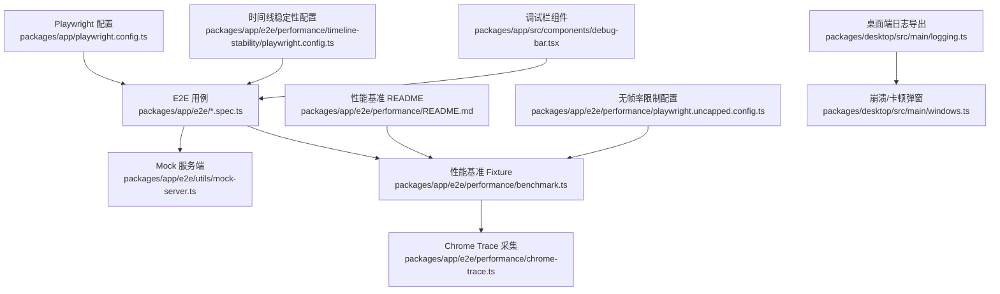
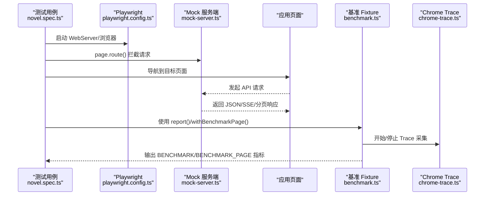
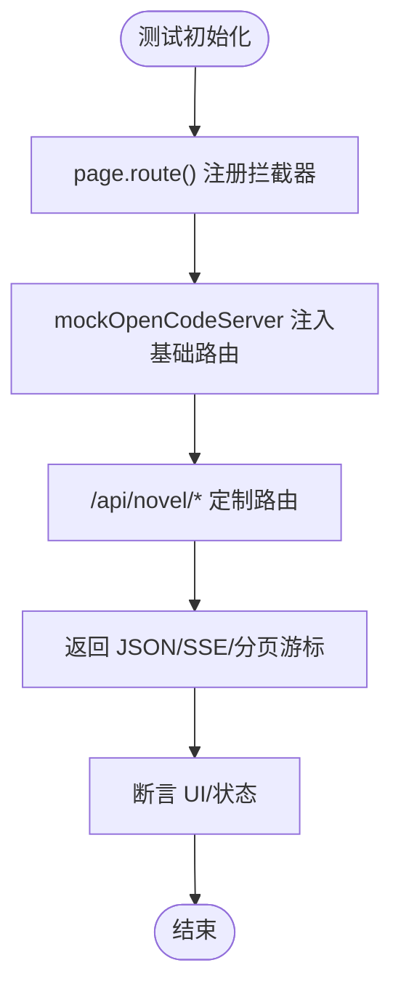
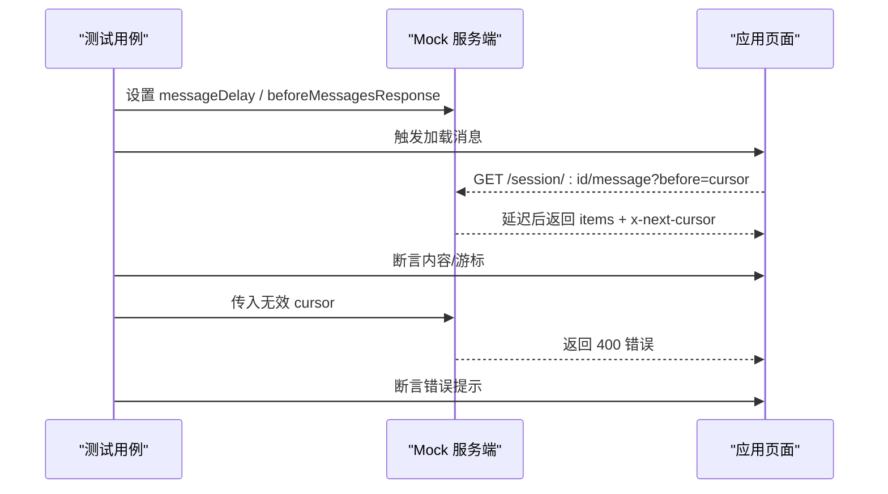
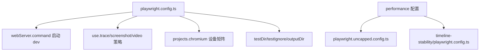
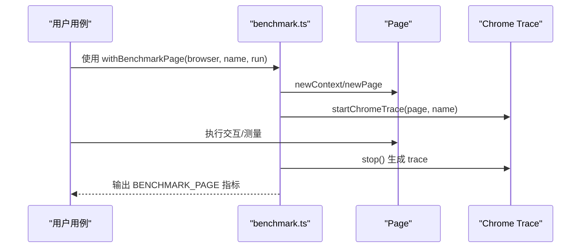
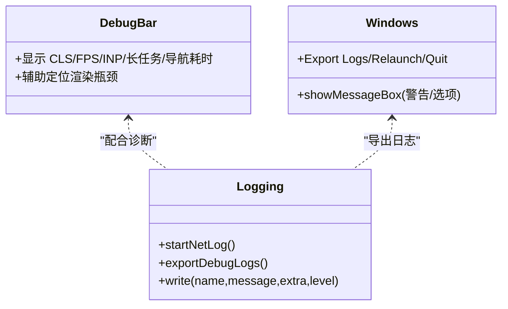
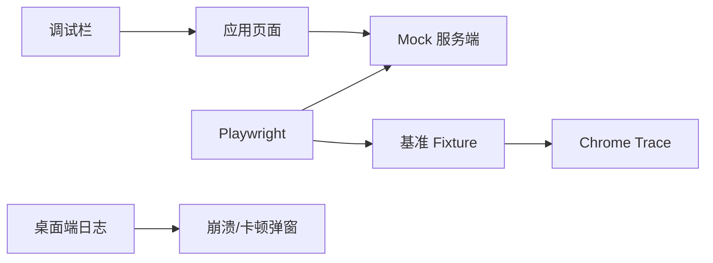

# 插件测试与调试

<cite>
**本文引用的文件**   
- [packages/app/e2e/novel.spec.ts](file://packages/app/e2e/novel.spec.ts)
- [packages/app/e2e/utils/mock-server.ts](file://packages/app/e2e/utils/mock-server.ts)
- [packages/app/playwright.config.ts](file://packages/app/playwright.config.ts)
- [packages/app/e2e/performance/README.md](file://packages/app/e2e/performance/README.md)
- [packages/app/e2e/performance/benchmark.ts](file://packages/app/e2e/performance/benchmark.ts)
- [packages/app/e2e/performance/playwright.uncapped.config.ts](file://packages/app/e2e/performance/playwright.uncapped.config.ts)
- [packages/app/e2e/performance/timeline-stability/playwright.config.ts](file://packages/app/e2e/performance/timeline-stability/playwright.config.ts)
- [packages/app/src/components/debug-bar.tsx](file://packages/app/src/components/debug-bar.tsx)
- [packages/desktop/src/main/logging.ts](file://packages/desktop/src/main/logging.ts)
- [packages/desktop/src/main/windows.ts](file://packages/desktop/src/main/windows.ts)
- [package.json](file://package.json)
</cite>

## 目录
1. [简介](#简介)
2. [项目结构](#项目结构)
3. [核心组件](#核心组件)
4. [架构总览](#架构总览)
5. [详细组件分析](#详细组件分析)
6. [依赖关系分析](#依赖关系分析)
7. [性能考量](#性能考量)
8. [故障排查指南](#故障排查指南)
9. [结论](#结论)
10. [附录](#附录)

## 简介
本文件面向 openNovel 插件的测试与调试，覆盖单元测试编写方法（Mock 数据、异步操作、错误处理）、端到端测试搭建与执行（集成场景、性能测试）、调试技巧与工具使用（日志输出、断点调试、性能分析），以及覆盖率要求与最佳实践。文档基于仓库中现有的 Playwright E2E、性能基准套件与桌面端调试能力进行系统化说明，帮助读者快速建立稳定可靠的测试与调试流程。

## 项目结构
- E2E 测试位于 packages/app/e2e，包含常规集成测试与 performance 子集。
- 性能基准套件位于 packages/app/e2e/performance，提供专用 fixture、报告与 Chrome Trace 采集。
- Playwright 配置在 packages/app/playwright.config.ts，统一端口、服务器启动、截图/视频/trace 策略等。
- 桌面端调试与日志导出在 packages/desktop/src/main 下。
- 根 package.json 管理脚本与工作区依赖。

**图示来源** 
- [packages/app/playwright.config.ts:1-45](file://packages/app/playwright.config.ts#L1-L45)
- [packages/app/e2e/novel.spec.ts:1-445](file://packages/app/e2e/novel.spec.ts#L1-L445)
- [packages/app/e2e/utils/mock-server.ts:1-190](file://packages/app/e2e/utils/mock-server.ts#L1-L190)
- [packages/app/e2e/performance/benchmark.ts:1-145](file://packages/app/e2e/performance/benchmark.ts#L1-L145)
- [packages/app/e2e/performance/README.md:1-80](file://packages/app/e2e/performance/README.md#L1-L80)
- [packages/app/e2e/performance/playwright.uncapped.config.ts:1-13](file://packages/app/e2e/performance/playwright.uncapped.config.ts#L1-L13)
- [packages/app/e2e/performance/timeline-stability/playwright.config.ts:1-17](file://packages/app/e2e/performance/timeline-stability/playwright.config.ts#L1-L17)
- [packages/app/src/components/debug-bar.tsx:140-173](file://packages/app/src/components/debug-bar.tsx#L140-L173)
- [packages/desktop/src/main/logging.ts:44-88](file://packages/desktop/src/main/logging.ts#L44-L88)
- [packages/desktop/src/main/windows.ts:307-350](file://packages/desktop/src/main/windows.ts#L307-L350)

**章节来源**
- [packages/app/playwright.config.ts:1-45](file://packages/app/playwright.config.ts#L1-L45)
- [packages/app/e2e/performance/README.md:1-80](file://packages/app/e2e/performance/README.md#L1-L80)
- [package.json:1-162](file://package.json#L1-L162)

## 核心组件
- Playwright E2E 框架：统一入口、WebServer 启动、浏览器实例与报告。
- Mock 服务端：拦截 API、返回固定或动态数据、支持 SSE 事件流与分页游标。
- 性能基准 Fixture：扩展 test/page/report，自动采集导航历史、Chrome Trace、指标上报。
- 调试与日志：前端调试栏展示关键指标；桌面端支持网络日志捕获与打包导出。

**章节来源**
- [packages/app/playwright.config.ts:1-45](file://packages/app/playwright.config.ts#L1-L45)
- [packages/app/e2e/utils/mock-server.ts:1-190](file://packages/app/e2e/utils/mock-server.ts#L1-L190)
- [packages/app/e2e/performance/benchmark.ts:1-145](file://packages/app/e2e/performance/benchmark.ts#L1-L145)
- [packages/app/src/components/debug-bar.tsx:140-173](file://packages/app/src/components/debug-bar.tsx#L140-L173)
- [packages/desktop/src/main/logging.ts:44-88](file://packages/desktop/src/main/logging.ts#L44-L88)

## 架构总览
下图展示了 E2E 测试从用例到 Mock 服务、再到性能采集与报告的调用链。

**图示来源** 
- [packages/app/e2e/novel.spec.ts:1-445](file://packages/app/e2e/novel.spec.ts#L1-L445)
- [packages/app/playwright.config.ts:1-45](file://packages/app/playwright.config.ts#L1-L45)
- [packages/app/e2e/utils/mock-server.ts:1-190](file://packages/app/e2e/utils/mock-server.ts#L1-L190)
- [packages/app/e2e/performance/benchmark.ts:1-145](file://packages/app/e2e/performance/benchmark.ts#L1-L145)

## 详细组件分析

### 单元测试与 Mock 数据准备
- 使用 Playwright 的 page.route() 拦截 API，构造稳定的 Mock 数据，避免外部依赖波动。
- 通过 mockOpenCodeServer 统一注入基础路由（会话、权限、VCS、文件列表等），并支持自定义回调（如消息延迟、分页游标）。
- 针对小说模块的接口（/api/novel/*）集中路由处理，确保 E2E 场景的数据一致性。

**图示来源** 
- [packages/app/e2e/utils/mock-server.ts:1-190](file://packages/app/e2e/utils/mock-server.ts#L1-L190)
- [packages/app/e2e/novel.spec.ts:1-445](file://packages/app/e2e/novel.spec.ts#L1-L445)

**章节来源**
- [packages/app/e2e/utils/mock-server.ts:1-190](file://packages/app/e2e/utils/mock-server.ts#L1-L190)
- [packages/app/e2e/novel.spec.ts:1-445](file://packages/app/e2e/novel.spec.ts#L1-L445)

### 异步操作测试与错误处理验证
- 使用 page.waitForURL/waitForSelector 等待异步渲染完成，结合超时控制保证稳定性。
- Mock 服务端支持 messageDelay、beforeMessagesResponse、eventRetry 等参数模拟网络延迟与重试。
- 对异常路径（如无效 cursor、未找到消息）返回 4xx 状态码，便于断言错误分支。

**图示来源** 
- [packages/app/e2e/utils/mock-server.ts:1-190](file://packages/app/e2e/utils/mock-server.ts#L1-L190)
- [packages/app/e2e/novel.spec.ts:1-445](file://packages/app/e2e/novel.spec.ts#L1-L445)

**章节来源**
- [packages/app/e2e/utils/mock-server.ts:1-190](file://packages/app/e2e/utils/mock-server.ts#L1-L190)
- [packages/app/e2e/novel.spec.ts:1-445](file://packages/app/e2e/novel.spec.ts#L1-L445)

### 端到端测试搭建与执行
- 使用 Playwright 配置文件统一管理测试目录、超时、并行度、Reporter、WebServer 启动与环境变量。
- 通过 playwright.config.ts 的 webServer.command 启动开发服务器，复用本地进程减少启动开销。
- 性能测试通过独立配置（uncapped、timeline-stability）隔离运行，避免干扰主流程。

**图示来源** 
- [packages/app/playwright.config.ts:1-45](file://packages/app/playwright.config.ts#L1-L45)
- [packages/app/e2e/performance/playwright.uncapped.config.ts:1-13](file://packages/app/e2e/performance/playwright.uncapped.config.ts#L1-L13)
- [packages/app/e2e/performance/timeline-stability/playwright.config.ts:1-17](file://packages/app/e2e/performance/timeline-stability/playwright.config.ts#L1-L17)

**章节来源**
- [packages/app/playwright.config.ts:1-45](file://packages/app/playwright.config.ts#L1-L45)
- [packages/app/e2e/performance/playwright.uncapped.config.ts:1-13](file://packages/app/e2e/performance/playwright.uncapped.config.ts#L1-L13)
- [packages/app/e2e/performance/timeline-stability/playwright.config.ts:1-17](file://packages/app/e2e/performance/timeline-stability/playwright.config.ts#L1-L17)

### 性能测试与基准套件
- 基准套件通过 benchmark.ts 扩展 fixture，强制每个用例调用 report() 上报指标，失败时附加导航历史与 Trace。
- withBenchmarkPage 提供隔离的浏览器上下文，自动开启/关闭 Chrome Trace，并在结束时输出结构化指标。
- 可通过环境变量 OPENCODE_PERFORMANCE_TRACE_DIR 启用 Trace 录制，OPENCODE_PERFORMANCE_SELECTOR_TRACE=1 启用选择器统计。

**图示来源** 
- [packages/app/e2e/performance/benchmark.ts:1-145](file://packages/app/e2e/performance/benchmark.ts#L1-L145)
- [packages/app/e2e/performance/README.md:1-80](file://packages/app/e2e/performance/README.md#L1-L80)

**章节来源**
- [packages/app/e2e/performance/benchmark.ts:1-145](file://packages/app/e2e/performance/benchmark.ts#L1-L145)
- [packages/app/e2e/performance/README.md:1-80](file://packages/app/e2e/performance/README.md#L1-L80)

### 调试技巧与工具使用
- 前端调试栏：debug-bar.tsx 暴露 CLS、FPS、INP、长任务、导航耗时等关键指标，便于定位渲染问题。
- 桌面端日志：logging.ts 支持网络日志捕获与打包导出，windows.ts 提供崩溃/卡顿弹窗，支持“导出日志”“重启”“退出”。
- 建议：在 E2E 失败时保留截图/视频/trace；在性能测试中启用 Trace 与选择器统计；在本地开发时打开调试栏观察实时指标。

**图示来源** 
- [packages/app/src/components/debug-bar.tsx:140-173](file://packages/app/src/components/debug-bar.tsx#L140-L173)
- [packages/desktop/src/main/logging.ts:44-88](file://packages/desktop/src/main/logging.ts#L44-L88)
- [packages/desktop/src/main/windows.ts:307-350](file://packages/desktop/src/main/windows.ts#L307-L350)

**章节来源**
- [packages/app/src/components/debug-bar.tsx:140-173](file://packages/app/src/components/debug-bar.tsx#L140-L173)
- [packages/desktop/src/main/logging.ts:44-88](file://packages/desktop/src/main/logging.ts#L44-L88)
- [packages/desktop/src/main/windows.ts:307-350](file://packages/desktop/src/main/windows.ts#L307-L350)

## 依赖关系分析
- Playwright 作为 E2E 与性能测试的统一运行时，负责浏览器生命周期、截图/视频/trace 与报告。
- Mock 服务端为所有 API 提供稳定数据源，降低外部依赖不确定性。
- 基准 Fixture 与 Chrome Trace 协同，形成可复用的性能度量体系。
- 桌面端日志与弹窗机制为复杂问题的现场取证提供支持。

**图示来源** 
- [packages/app/playwright.config.ts:1-45](file://packages/app/playwright.config.ts#L1-L45)
- [packages/app/e2e/utils/mock-server.ts:1-190](file://packages/app/e2e/utils/mock-server.ts#L1-L190)
- [packages/app/e2e/performance/benchmark.ts:1-145](file://packages/app/e2e/performance/benchmark.ts#L1-L145)
- [packages/app/src/components/debug-bar.tsx:140-173](file://packages/app/src/components/debug-bar.tsx#L140-L173)
- [packages/desktop/src/main/logging.ts:44-88](file://packages/desktop/src/main/logging.ts#L44-L88)
- [packages/desktop/src/main/windows.ts:307-350](file://packages/desktop/src/main/windows.ts#L307-L350)

**章节来源**
- [packages/app/playwright.config.ts:1-45](file://packages/app/playwright.config.ts#L1-L45)
- [packages/app/e2e/utils/mock-server.ts:1-190](file://packages/app/e2e/utils/mock-server.ts#L1-L190)
- [packages/app/e2e/performance/benchmark.ts:1-145](file://packages/app/e2e/performance/benchmark.ts#L1-L145)
- [packages/app/src/components/debug-bar.tsx:140-173](file://packages/app/src/components/debug-bar.tsx#L140-L173)
- [packages/desktop/src/main/logging.ts:44-88](file://packages/desktop/src/main/logging.ts#L44-L88)
- [packages/desktop/src/main/windows.ts:307-350](file://packages/desktop/src/main/windows.ts#L307-L350)

## 性能考量
- 使用 withBenchmarkPage 隔离浏览器上下文，避免跨用例污染。
- 通过 OPENCODE_PERFORMANCE_TRACE_DIR 与 OPENCODE_PERFORMANCE_SELECTOR_TRACE 控制 Trace 与选择器统计，平衡精度与开销。
- 在无帧率限制模式下运行 uncapped 配置，获取更真实的渲染时序。
- 在 CI 环境中合理设置 workers 与 retries，提高吞吐同时保证稳定性。

[本节为通用指导，不直接分析具体文件]

## 故障排查指南
- 常见问题
  - 页面未就绪：检查 waitForURL/waitForSelector 的超时与条件，必要时增加等待或改用更稳定的选择器。
  - API 未命中：确认 route() 匹配规则与端口/路径是否正确，必要时打印请求 URL 定位差异。
  - 性能指标缺失：确保 benchmark 用例调用了 report()，并检查环境变量是否启用了 Trace。
  - 日志不足：在桌面端使用“导出日志”，或在 E2E 失败时查看截图/视频/trace。
- 解决步骤
  - 使用 debug-bar 观察 FPS/CLS/INP 等指标，定位渲染瓶颈。
  - 启用 logging.startNetLog() 捕获网络日志，结合 windows.ts 弹窗导出完整包。
  - 在 mock-server 中增加 messageDelay 或 beforeMessagesResponse，复现延迟/重试场景。

**章节来源**
- [packages/app/e2e/utils/mock-server.ts:1-190](file://packages/app/e2e/utils/mock-server.ts#L1-L190)
- [packages/app/src/components/debug-bar.tsx:140-173](file://packages/app/src/components/debug-bar.tsx#L140-L173)
- [packages/desktop/src/main/logging.ts:44-88](file://packages/desktop/src/main/logging.ts#L44-L88)
- [packages/desktop/src/main/windows.ts:307-350](file://packages/desktop/src/main/windows.ts#L307-L350)

## 结论
通过统一的 Playwright 配置、完善的 Mock 服务与强大的基准 Fixture，openNovel 的插件测试与调试具备高稳定性与可扩展性。结合前端调试栏与桌面端日志导出，能够快速定位渲染与网络问题。建议在团队内推广“必须上报指标”的基准规范，持续优化性能与可靠性。

[本节为总结，不直接分析具体文件]

## 附录
- 常用命令
  - 运行 E2E：bun run test（根级禁止，需在对应包内执行）
  - 运行性能基准：bun run test:bench（packages/app）
  - 无帧率限制模式：使用 playwright.uncapped.config.ts
- 覆盖率建议
  - 业务逻辑与工具函数优先采用单元/集成测试，E2E 聚焦关键用户旅程与回归场景。
  - 性能基准应覆盖冷/热启动、导航、重绘与流式更新等关键路径。
  - 建议将覆盖率阈值纳入 CI，防止退化。

[本节为补充信息，不直接分析具体文件]