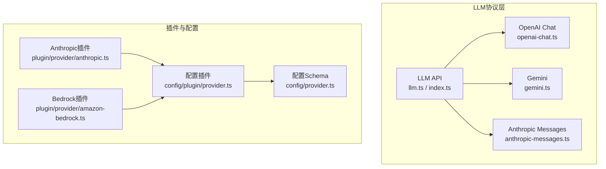
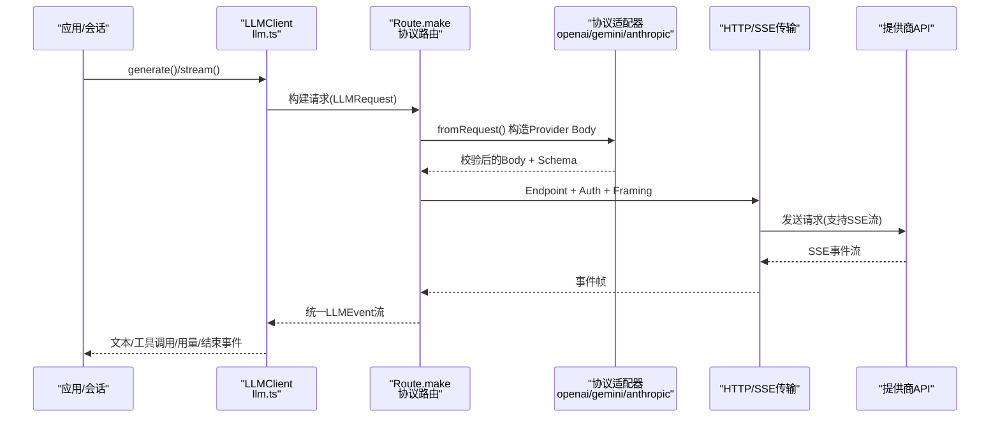
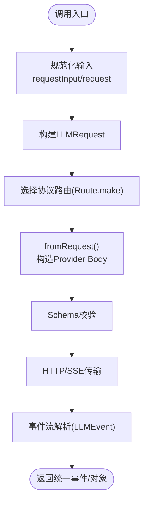
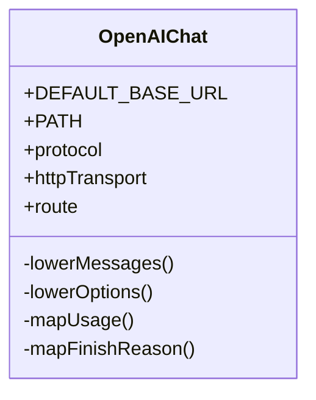
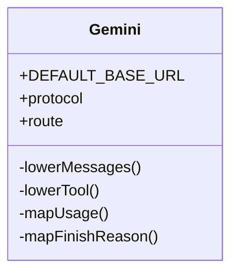
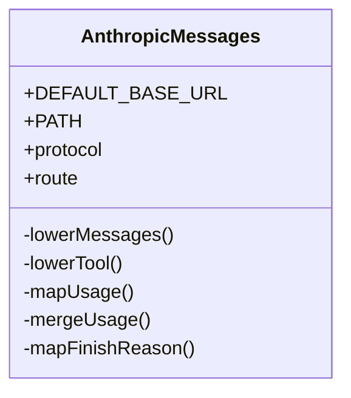
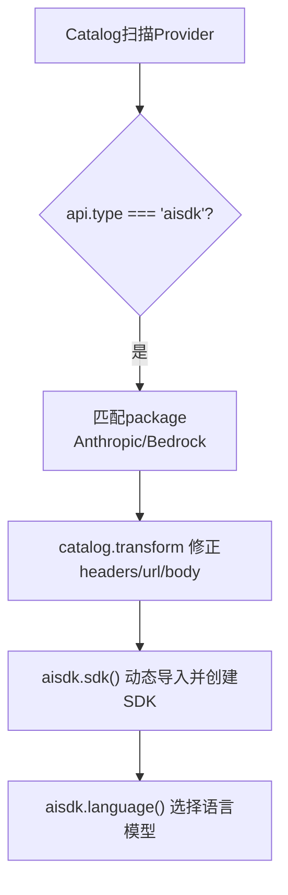
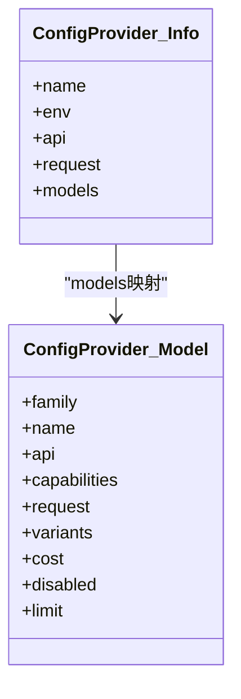
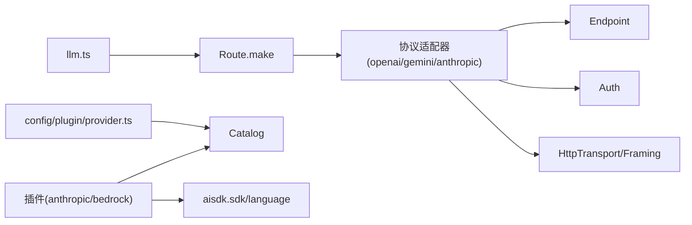

# AI提供商插件

<cite>
**本文引用的文件**   
- [packages/core/src/config/plugin/provider.ts](file://packages/core/src/config/plugin/provider.ts)
- [packages/core/src/config/provider.ts](file://packages/core/src/config/provider.ts)
- [packages/core/src/plugin/provider/anthropic.ts](file://packages/core/src/plugin/provider/anthropic.ts)
- [packages/core/src/plugin/provider/amazon-bedrock.ts](file://packages/core/src/plugin/provider/amazon-bedrock.ts)
- [packages/llm/src/index.ts](file://packages/llm/src/index.ts)
- [packages/llm/src/llm.ts](file://packages/llm/src/llm.ts)
- [packages/llm/src/protocols/openai-chat.ts](file://packages/llm/src/protocols/openai-chat.ts)
- [packages/llm/src/protocols/gemini.ts](file://packages/llm/src/protocols/gemini.ts)
- [packages/llm/src/protocols/anthropic-messages.ts](file://packages/llm/src/protocols/anthropic-messages.ts)
- [packages/llm/src/provider.ts](file://packages/llm/src/provider.ts)
- [packages/opencode/test/session/retry.test.ts](file://packages/opencode/test/session/retry.test.ts)
</cite>

## 目录
1. [简介](#简介)
2. [项目结构](#项目结构)
3. [核心组件](#核心组件)
4. [架构总览](#架构总览)
5. [详细组件分析](#详细组件分析)
6. [依赖关系分析](#依赖关系分析)
7. [性能与成本优化](#性能与成本优化)
8. [故障排查指南](#故障排查指南)
9. [结论](#结论)
10. [附录：配置与示例路径](#附录配置与示例路径)

## 简介
本文件面向 openNovel 的AI提供商插件，系统性说明如何集成主流模型（OpenAI、Anthropic、Google等），统一接口设计模式、多提供商无缝切换与故障转移策略，以及请求参数（温度、最大令牌数、响应格式）的配置方法。同时给出自定义适配层的实现要点（认证、请求封装、结果解析）、API密钥管理、速率限制与重试机制、流式响应与中断处理，以及性能与成本优化建议。

## 项目结构
openNovel 将“LLM协议适配”和“插件化配置/注册”解耦：
- LLM协议层：在 packages/llm 中为各提供商定义协议、请求体Schema、流事件解析、路由与传输（SSE/HTTP）。
- 插件与配置层：在 packages/core 中以插件形式注入默认头、SDK实例、语言模型选择器，并通过配置文档覆盖Provider/Model元数据。

**图表来源** 
- [packages/llm/src/protocols/openai-chat.ts:481-504](file://packages/llm/src/protocols/openai-chat.ts#L481-L504)
- [packages/llm/src/protocols/gemini.ts:486-510](file://packages/llm/src/protocols/gemini.ts#L486-L510)
- [packages/llm/src/protocols/anthropic-messages.ts:486-510](file://packages/llm/src/protocols/anthropic-messages.ts#L486-L510)
- [packages/llm/src/llm.ts:45-75](file://packages/llm/src/llm.ts#L45-L75)
- [packages/llm/src/index.ts:1-34](file://packages/llm/src/index.ts#L1-L34)
- [packages/core/src/config/plugin/provider.ts:1-114](file://packages/core/src/config/plugin/provider.ts#L1-L114)
- [packages/core/src/config/provider.ts:1-72](file://packages/core/src/config/provider.ts#L1-L72)
- [packages/core/src/plugin/provider/anthropic.ts:1-28](file://packages/core/src/plugin/provider/anthropic.ts#L1-L28)
- [packages/core/src/plugin/provider/amazon-bedrock.ts:62-127](file://packages/core/src/plugin/provider/amazon-bedrock.ts#L62-L127)

**章节来源**
- [packages/core/src/config/plugin/provider.ts:1-114](file://packages/core/src/config/plugin/provider.ts#L1-L114)
- [packages/core/src/config/provider.ts:1-72](file://packages/core/src/config/provider.ts#L1-L72)
- [packages/llm/src/index.ts:1-34](file://packages/llm/src/index.ts#L1-L34)
- [packages/llm/src/llm.ts:45-75](file://packages/llm/src/llm.ts#L45-L75)

## 核心组件
- LLMClient与生成接口：提供 generate/stream/requestInput/request 等统一入口，屏蔽底层协议差异。
- 协议适配器：每个提供商一个协议模块，负责：
  - 请求体构造（fromRequest）与Schema校验
  - 流事件解析（step/onHalt）并产出统一的 LLMEvent
  - 路由Endpoint、Auth、Transport/Framing
- 插件系统：通过 catalog.transform 修改Provider/Model元数据，或通过 aisdk.sdk/language 动态创建SDK实例与语言模型选择器。
- 配置Schema：声明 Provider/Model 的结构（headers/body、variants、cost、limit、capabilities等），由配置插件合并到Catalog。

关键职责映射：
- 统一调用：packages/llm/src/llm.ts
- OpenAI协议：packages/llm/src/protocols/openai-chat.ts
- Gemini协议：packages/llm/src/protocols/gemini.ts
- Anthropic协议：packages/llm/src/protocols/anthropic-messages.ts
- 插件注入（Anthropic/Bedrock）：packages/core/src/plugin/provider/*.ts
- 配置Schema与插件：packages/core/src/config/*.ts

**章节来源**
- [packages/llm/src/llm.ts:45-75](file://packages/llm/src/llm.ts#L45-L75)
- [packages/llm/src/protocols/openai-chat.ts:481-504](file://packages/llm/src/protocols/openai-chat.ts#L481-L504)
- [packages/llm/src/protocols/gemini.ts:486-510](file://packages/llm/src/protocols/gemini.ts#L486-L510)
- [packages/llm/src/protocols/anthropic-messages.ts:486-510](file://packages/llm/src/protocols/anthropic-messages.ts#L486-L510)
- [packages/core/src/config/plugin/provider.ts:1-114](file://packages/core/src/config/plugin/provider.ts#L1-L114)
- [packages/core/src/config/provider.ts:1-72](file://packages/core/src/config/provider.ts#L1-L72)

## 架构总览
下图展示从上层调用到具体提供商协议的完整链路，包括插件对Catalog的增强与SDK实例注入。

**图表来源** 
- [packages/llm/src/llm.ts:45-75](file://packages/llm/src/llm.ts#L45-L75)
- [packages/llm/src/protocols/openai-chat.ts:481-504](file://packages/llm/src/protocols/openai-chat.ts#L481-L504)
- [packages/llm/src/protocols/gemini.ts:486-510](file://packages/llm/src/protocols/gemini.ts#L486-L510)
- [packages/llm/src/protocols/anthropic-messages.ts:486-510](file://packages/llm/src/protocols/anthropic-messages.ts#L486-L510)

## 详细组件分析

### 统一接口与请求构造
- 入口函数：generate、stream、requestInput、request 暴露统一能力；内部将用户输入规范化为 LLMRequest。
- 结构化输出：generateObject 通过强制工具调用方式获得稳定JSON结构，避免不同提供商原生JSON模式的差异。

**图表来源** 
- [packages/llm/src/llm.ts:45-75](file://packages/llm/src/llm.ts#L45-L75)
- [packages/llm/src/llm.ts:110-186](file://packages/llm/src/llm.ts#L110-L186)

**章节来源**
- [packages/llm/src/llm.ts:45-75](file://packages/llm/src/llm.ts#L45-L75)
- [packages/llm/src/llm.ts:110-186](file://packages/llm/src/llm.ts#L110-L186)

### OpenAI Chat 协议适配
- 请求体：包含 model、messages、tools/tool_choice、stream_options、max_tokens、temperature、top_p、penalties、seed、stop 等字段。
- 流事件：choices.delta累积文本与tool_calls，usage汇总tokens，finish_reason映射为统一FinishReason。
- 路由：默认baseURL与/chat/completions路径，使用SSE JSON传输。

**图表来源** 
- [packages/llm/src/protocols/openai-chat.ts:91-108](file://packages/llm/src/protocols/openai-chat.ts#L91-L108)
- [packages/llm/src/protocols/openai-chat.ts:344-370](file://packages/llm/src/protocols/openai-chat.ts#L344-L370)
- [packages/llm/src/protocols/openai-chat.ts:378-405](file://packages/llm/src/protocols/openai-chat.ts#L378-L405)
- [packages/llm/src/protocols/openai-chat.ts:481-504](file://packages/llm/src/protocols/openai-chat.ts#L481-L504)

**章节来源**
- [packages/llm/src/protocols/openai-chat.ts:91-108](file://packages/llm/src/protocols/openai-chat.ts#L91-L108)
- [packages/llm/src/protocols/openai-chat.ts:344-370](file://packages/llm/src/protocols/openai-chat.ts#L344-L370)
- [packages/llm/src/protocols/openai-chat.ts:378-405](file://packages/llm/src/protocols/openai-chat.ts#L378-L405)
- [packages/llm/src/protocols/openai-chat.ts:481-504](file://packages/llm/src/protocols/openai-chat.ts#L481-L504)

### Google Gemini 协议适配
- 请求体：contents、systemInstruction、tools/toolConfig、generationConfig（含thinkingConfig）。
- 流事件：candidates.parts包含text/thought/functionCall，usageMetadata聚合token计数。
- 路由：基于模型ID的动态路径与SSE framing。

**图表来源** 
- [packages/llm/src/protocols/gemini.ts:108-116](file://packages/llm/src/protocols/gemini.ts#L108-L116)
- [packages/llm/src/protocols/gemini.ts:302-333](file://packages/llm/src/protocols/gemini.ts#L302-L333)
- [packages/llm/src/protocols/gemini.ts:342-361](file://packages/llm/src/protocols/gemini.ts#L342-L361)
- [packages/llm/src/protocols/gemini.ts:486-510](file://packages/llm/src/protocols/gemini.ts#L486-L510)

**章节来源**
- [packages/llm/src/protocols/gemini.ts:108-116](file://packages/llm/src/protocols/gemini.ts#L108-L116)
- [packages/llm/src/protocols/gemini.ts:302-333](file://packages/llm/src/protocols/gemini.ts#L302-L333)
- [packages/llm/src/protocols/gemini.ts:342-361](file://packages/llm/src/protocols/gemini.ts#L342-L361)
- [packages/llm/src/protocols/gemini.ts:486-510](file://packages/llm/src/protocols/gemini.ts#L486-L510)

### Anthropic Messages 协议适配
- 请求体：model、system/messages、tools/tool_choice、stream、max_tokens、temperature/top_p/top_k/stop_sequences、thinking。
- 流事件：content_block_start/delta/stop、message_start/delta、usage合并、server_tool_result透传。
- 特殊点：cache_control断点上限控制、thinking签名透传、工具调用增量拼装。

**图表来源** 
- [packages/llm/src/protocols/anthropic-messages.ts:156-171](file://packages/llm/src/protocols/anthropic-messages.ts#L156-L171)
- [packages/llm/src/protocols/anthropic-messages.ts:506-553](file://packages/llm/src/protocols/anthropic-messages.ts#L506-L553)
- [packages/llm/src/protocols/anthropic-messages.ts:573-617](file://packages/llm/src/protocols/anthropic-messages.ts#L573-L617)
- [packages/llm/src/protocols/anthropic-messages.ts:486-510](file://packages/llm/src/protocols/anthropic-messages.ts#L486-L510)

**章节来源**
- [packages/llm/src/protocols/anthropic-messages.ts:156-171](file://packages/llm/src/protocols/anthropic-messages.ts#L156-L171)
- [packages/llm/src/protocols/anthropic-messages.ts:506-553](file://packages/llm/src/protocols/anthropic-messages.ts#L506-L553)
- [packages/llm/src/protocols/anthropic-messages.ts:573-617](file://packages/llm/src/protocols/anthropic-messages.ts#L573-L617)
- [packages/llm/src/protocols/anthropic-messages.ts:486-510](file://packages/llm/src/protocols/anthropic-messages.ts#L486-L510)

### 插件系统与SDK注入
- Anthropic插件：为aisdk类型且package为@ai-sdk/anthropic的Provider追加特定请求头，并动态创建SDK实例。
- Bedrock插件：迁移endpoint至URL、根据region/model选择前缀、自动凭证链加载、按包名选择mantle或标准SDK。

**图表来源** 
- [packages/core/src/plugin/provider/anthropic.ts:1-28](file://packages/core/src/plugin/provider/anthropic.ts#L1-L28)
- [packages/core/src/plugin/provider/amazon-bedrock.ts:62-127](file://packages/core/src/plugin/provider/amazon-bedrock.ts#L62-L127)

**章节来源**
- [packages/core/src/plugin/provider/anthropic.ts:1-28](file://packages/core/src/plugin/provider/anthropic.ts#L1-L28)
- [packages/core/src/plugin/provider/amazon-bedrock.ts:62-127](file://packages/core/src/plugin/provider/amazon-bedrock.ts#L62-L127)

### 配置Schema与覆盖策略
- Provider级：name、env、api、request.headers/body。
- Model级：family/name、api（aisdk/native/id）、capabilities、request.headers/body/variant、variants数组、cost（含缓存读写）、disabled、limit（context/input/output）。
- 配置插件读取文档entries，合并到Catalog，设置默认模型与Provider/Model覆盖项。

**图表来源** 
- [packages/core/src/config/provider.ts:65-72](file://packages/core/src/config/provider.ts#L65-L72)
- [packages/core/src/config/provider.ts:47-63](file://packages/core/src/config/provider.ts#L47-L63)
- [packages/core/src/config/plugin/provider.ts:41-111](file://packages/core/src/config/plugin/provider.ts#L41-L111)

**章节来源**
- [packages/core/src/config/provider.ts:47-72](file://packages/core/src/config/provider.ts#L47-L72)
- [packages/core/src/config/plugin/provider.ts:41-111](file://packages/core/src/config/plugin/provider.ts#L41-L111)

## 依赖关系分析
- LLMClient依赖各协议Route，Route依赖Endpoint/Auth/Transport/Framing。
- 插件通过ctx.catalog.transform与ctx.aisdk/sdk、language钩子影响Provider/Model与SDK实例。
- 配置Schema驱动Catalog初始化与覆盖，确保部署期可配置性。

**图表来源** 
- [packages/llm/src/llm.ts:45-75](file://packages/llm/src/llm.ts#L45-L75)
- [packages/llm/src/protocols/openai-chat.ts:481-504](file://packages/llm/src/protocols/openai-chat.ts#L481-L504)
- [packages/llm/src/protocols/gemini.ts:486-510](file://packages/llm/src/protocols/gemini.ts#L486-L510)
- [packages/llm/src/protocols/anthropic-messages.ts:486-510](file://packages/llm/src/protocols/anthropic-messages.ts#L486-L510)
- [packages/core/src/config/plugin/provider.ts:1-114](file://packages/core/src/config/plugin/provider.ts#L1-L114)
- [packages/core/src/plugin/provider/anthropic.ts:1-28](file://packages/core/src/plugin/provider/anthropic.ts#L1-L28)
- [packages/core/src/plugin/provider/amazon-bedrock.ts:62-127](file://packages/core/src/plugin/provider/amazon-bedrock.ts#L62-L127)

**章节来源**
- [packages/llm/src/llm.ts:45-75](file://packages/llm/src/llm.ts#L45-L75)
- [packages/core/src/config/plugin/provider.ts:1-114](file://packages/core/src/config/plugin/provider.ts#L1-L114)

## 性能与成本优化
- 流式优先：所有协议默认启用SSE流，减少首字节延迟与内存占用。
- 工具调用增量拼装：OpenAI/Gemini/Anthropic均对tool_call增量进行状态机拼装，避免大JSON一次性拼接。
- 缓存控制：Anthropic支持cache_control断点（每请求最多4个），按优先级分配，超出则丢弃尾部断点。
- 用量统计：各协议将provider-specific usage归一化为统一Usage，便于计费与限流。
- 成本建模：Model.cost支持分层与缓存读写单价，可在上层做预算追踪与降级策略。

**章节来源**
- [packages/llm/src/protocols/openai-chat.ts:378-405](file://packages/llm/src/protocols/openai-chat.ts#L378-L405)
- [packages/llm/src/protocols/gemini.ts:342-361](file://packages/llm/src/protocols/gemini.ts#L342-L361)
- [packages/llm/src/protocols/anthropic-messages.ts:573-617](file://packages/llm/src/protocols/anthropic-messages.ts#L573-L617)
- [packages/core/src/config/provider.ts:17-31](file://packages/core/src/config/provider.ts#L17-L31)

## 故障排查指南
- 错误分类与重试：
  - 速率限制/配额超限：识别429、FreeUsageLimitError、BlackUsageLimitError等，支持retryAfter。
  - 服务端错误：5xx（500/502/503）通常可重试。
  - 网络异常：ZlibError解压失败、WebSocket提前关闭等。
- 中断与取消：
  - AbortSignal传播到HTTP/SSE/WebSocket，确保资源释放与错误上报。
- 诊断建议：
  - 检查Provider/Model配置是否生效（headers/body/variants）。
  - 确认环境变量与凭证链（如AWS/Bearer Token）。
  - 观察流事件中的finish_reason与usage，定位过早结束或超限。

**章节来源**
- [packages/opencode/test/session/retry.test.ts:136-268](file://packages/opencode/test/session/retry.test.ts#L136-L268)

## 结论
openNovel 通过“协议适配器+插件+配置Schema”的分层设计，实现了多AI提供商的统一接入与灵活扩展。开发者可按需新增协议适配器与插件，借助配置文档完成鉴权、请求头/体、模型能力与成本的精细控制。结合流式解析、用量统计与重试策略，可在保证体验的同时优化性能与成本。

## 附录：配置与示例路径
- 统一接口与结构化输出
  - [packages/llm/src/llm.ts:45-75](file://packages/llm/src/llm.ts#L45-L75)
  - [packages/llm/src/llm.ts:110-186](file://packages/llm/src/llm.ts#L110-L186)
- OpenAI Chat 协议
  - [packages/llm/src/protocols/openai-chat.ts:91-108](file://packages/llm/src/protocols/openai-chat.ts#L91-L108)
  - [packages/llm/src/protocols/openai-chat.ts:344-370](file://packages/llm/src/protocols/openai-chat.ts#L344-L370)
  - [packages/llm/src/protocols/openai-chat.ts:481-504](file://packages/llm/src/protocols/openai-chat.ts#L481-L504)
- Gemini 协议
  - [packages/llm/src/protocols/gemini.ts:108-116](file://packages/llm/src/protocols/gemini.ts#L108-L116)
  - [packages/llm/src/protocols/gemini.ts:302-333](file://packages/llm/src/protocols/gemini.ts#L302-L333)
  - [packages/llm/src/protocols/gemini.ts:486-510](file://packages/llm/src/protocols/gemini.ts#L486-L510)
- Anthropic 协议
  - [packages/llm/src/protocols/anthropic-messages.ts:156-171](file://packages/llm/src/protocols/anthropic-messages.ts#L156-L171)
  - [packages/llm/src/protocols/anthropic-messages.ts:506-553](file://packages/llm/src/protocols/anthropic-messages.ts#L506-L553)
  - [packages/llm/src/protocols/anthropic-messages.ts:573-617](file://packages/llm/src/protocols/anthropic-messages.ts#L573-L617)
- 插件与SDK注入
  - [packages/core/src/plugin/provider/anthropic.ts:1-28](file://packages/core/src/plugin/provider/anthropic.ts#L1-L28)
  - [packages/core/src/plugin/provider/amazon-bedrock.ts:62-127](file://packages/core/src/plugin/provider/amazon-bedrock.ts#L62-L127)
- 配置Schema与覆盖
  - [packages/core/src/config/provider.ts:47-72](file://packages/core/src/config/provider.ts#L47-L72)
  - [packages/core/src/config/plugin/provider.ts:41-111](file://packages/core/src/config/plugin/provider.ts#L41-L111)
- 错误与重试
  - [packages/opencode/test/session/retry.test.ts:136-268](file://packages/opencode/test/session/retry.test.ts#L136-L268)