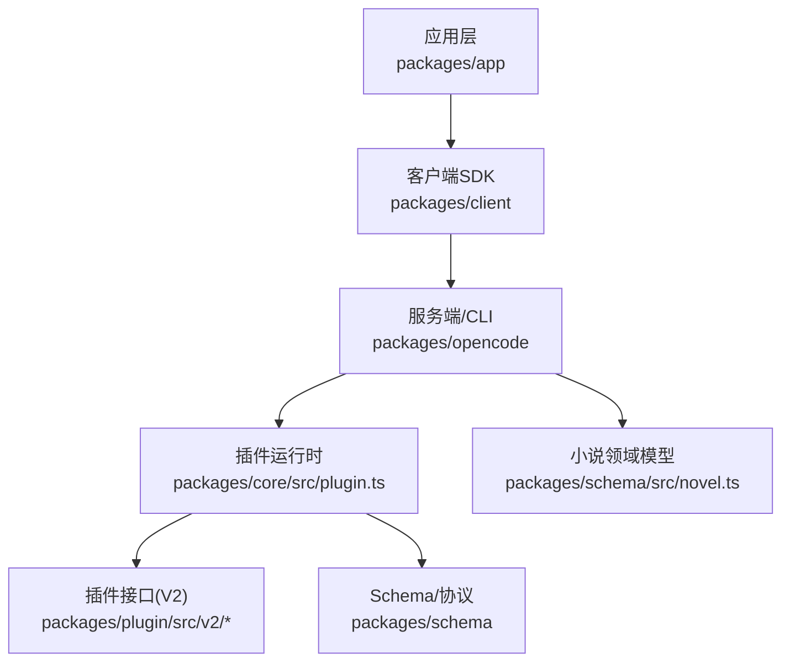
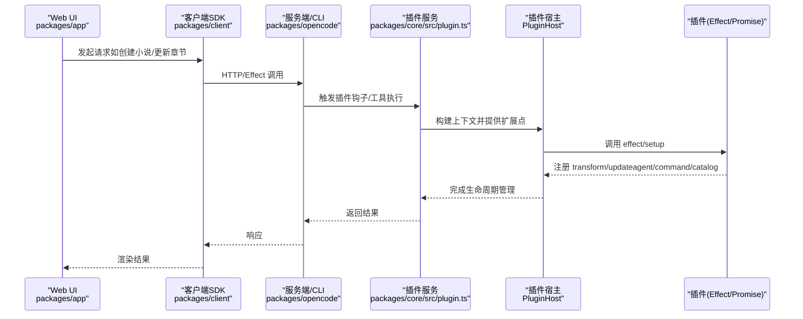
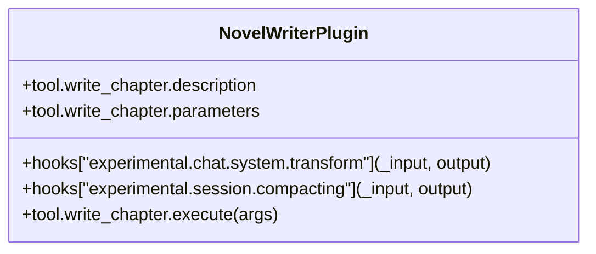
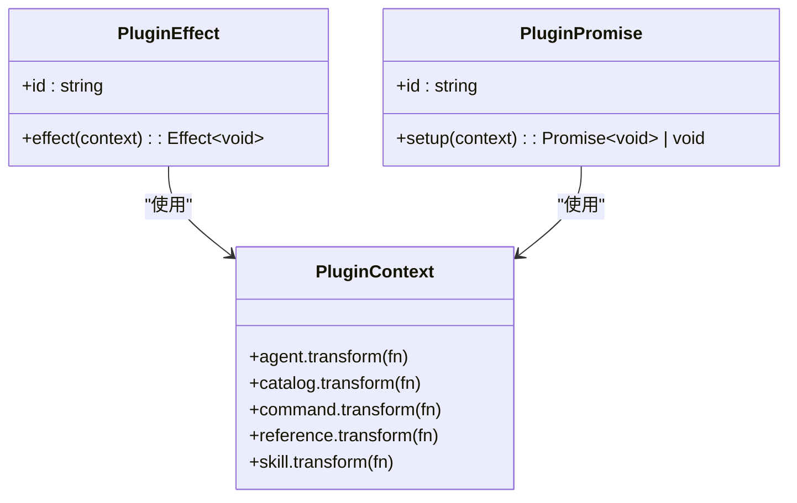
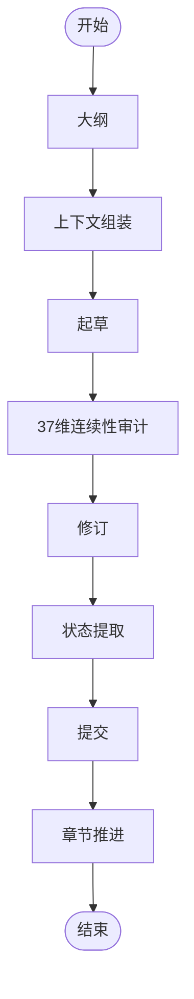
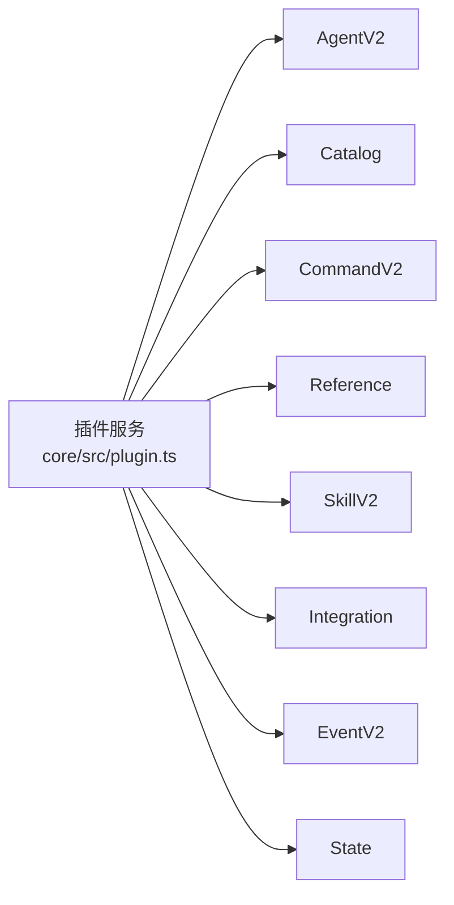

# 写作工具插件

<cite>
**本文引用的文件**   
- [README.md](file://README.md)
- [packages/core/src/plugin.ts](file://packages/core/src/plugin.ts)
- [packages/schema/src/plugin.ts](file://packages/schema/src/plugin.ts)
- [packages/plugin/src/v2/effect/plugin.ts](file://packages/plugin/src/v2/effect/plugin.ts)
- [packages/plugin/src/v2/promise/plugin.ts](file://packages/plugin/src/v2/promise/plugin.ts)
- [packages/core/src/plugin/promise.ts](file://packages/core/src/plugin/promise.ts)
- [packages/opencode/test/server/httpapi-exercise/index.ts](file://packages/opencode/test/server/httpapi-exercise/index.ts)
- [packages/client/src/generated-effect/client.ts](file://packages/client/src/generated-effect/client.ts)
- [packages/schema/src/novel.ts](file://packages/schema/src/novel.ts)
- [packages/app/src/pages/novel/wizard.tsx](file://packages/app/src/pages/novel/wizard.tsx)
- [packages/plugin/test/novel-writer/compat.test.ts](file://packages/plugin/test/novel-writer/compat.test.ts)
</cite>

## 目录
1. [简介](#简介)
2. [项目结构](#项目结构)
3. [核心组件](#核心组件)
4. [架构总览](#架构总览)
5. [详细组件分析](#详细组件分析)
6. [依赖关系分析](#依赖关系分析)
7. [性能考虑](#性能考虑)
8. [故障排查指南](#故障排查指南)
9. [结论](#结论)
10. [附录](#附录)

## 简介
本文件面向 openNovel 的“写作工具插件”开发者，系统性阐述如何开发文本处理与辅助写作插件，包括内容生成、格式转换、智能编辑（自动续写、段落优化、语法检查），以及内容创作插件（AI 集成、上下文管理、输出格式化）。文档同时给出插件配置选项、参数设置与错误处理的实践建议，并辅以代码级图示与示例路径，帮助读者快速上手。

openNovel 提供两条插件路径：
- V1 钩子式插件：通过返回 hooks 对象注册系统变换、会话压缩、工具等能力，适合快速实现写作辅助功能。
- V2 Effect/Promise 插件：通过 define 定义插件，使用 ctx.agent.transform、ctx.command.transform 等扩展点，具备更强的生命周期与资源管理能力。

## 项目结构
openNovel 为 monorepo，与写作插件相关的关键位置如下：
- packages/core/src/plugin.ts：V2 插件服务与宿主（PluginHost）装配，事件、锁、作用域管理与加载/卸载流程。
- packages/schema/src/plugin.ts：插件 ID 与事件类型定义。
- packages/plugin/src/v2/effect/plugin.ts 与 packages/plugin/src/v2/promise/plugin.ts：V2 插件接口定义（Effect 与 Promise 两种风格）。
- packages/core/src/plugin/promise.ts：Promise 风格插件到 Effect 的适配层。
- packages/plugin/test/novel-writer/compat.test.ts：V1/V2 插件共存与兼容性测试样例，展示 hooks 与 tool 的使用方式。
- packages/schema/src/novel.ts：小说领域数据模型（章节更新、风格指南、搜索等）。
- packages/client/src/generated-effect/client.ts：客户端生成的 SDK 调用封装。
- packages/app/src/pages/novel/wizard.tsx：创建向导 UI，体现前端与后端交互入口。
- README.md：项目特性与架构概览。

图表来源
- [packages/core/src/plugin.ts:1-168](file://packages/core/src/plugin.ts#L1-L168)
- [packages/plugin/src/v2/effect/plugin.ts:1-17](file://packages/plugin/src/v2/effect/plugin.ts#L1-L17)
- [packages/plugin/src/v2/promise/plugin.ts:1-16](file://packages/plugin/src/v2/promise/plugin.ts#L1-L16)
- [packages/schema/src/novel.ts:321-354](file://packages/schema/src/novel.ts#L321-L354)

章节来源
- [README.md:60-77](file://README.md#L60-L77)
- [packages/core/src/plugin.ts:1-168](file://packages/core/src/plugin.ts#L1-L168)

## 核心组件
- 插件服务与宿主（Plugin Service & Host）
  - 负责插件的添加、移除、等待加载完成、失败状态传播与作用域清理。
  - 暴露 add/remove/wait 接口，内部维护 active/loading/waiters/failures 等状态。
- V2 插件接口
  - Effect 风格：define({ id, effect })，effect(context) => Effect<void>。
  - Promise 风格：define({ id, setup })，setup(context) => Promise<void> | void。
- Schema 与事件
  - 插件 ID 类型与 plugin.added 事件，用于生命周期追踪。
- 适配器（Promise → Effect）
  - 将 Promise 风格的插件转换为 Effect 风格，统一由运行时调度。

章节来源
- [packages/core/src/plugin.ts:31-143](file://packages/core/src/plugin.ts#L31-L143)
- [packages/plugin/src/v2/effect/plugin.ts:1-17](file://packages/plugin/src/v2/effect/plugin.ts#L1-L17)
- [packages/plugin/src/v2/promise/plugin.ts:1-16](file://packages/plugin/src/v2/promise/plugin.ts#L1-L16)
- [packages/core/src/plugin/promise.ts:74-93](file://packages/core/src/plugin/promise.ts#L74-L93)
- [packages/schema/src/plugin.ts:1-14](file://packages/schema/src/plugin.ts#L1-L14)

## 架构总览
下图展示了从 UI 到插件运行时的关键调用链，以及插件如何扩展 Agent、Catalog、Command 等系统能力。

图表来源
- [packages/core/src/plugin.ts:31-143](file://packages/core/src/plugin.ts#L31-L143)
- [packages/core/src/plugin/promise.ts:74-93](file://packages/core/src/plugin/promise.ts#L74-L93)
- [packages/client/src/generated-effect/client.ts:1128-1154](file://packages/client/src/generated-effect/client.ts#L1128-L1154)
- [packages/app/src/pages/novel/wizard.tsx:1-31](file://packages/app/src/pages/novel/wizard.tsx#L1-L31)

## 详细组件分析

### V1 钩子式插件（写作辅助）
V1 插件通过返回 hooks 对象来扩展系统：
- experimental.chat.system.transform：注入系统提示词或上下文片段（例如“小说写作上下文快照”）。
- experimental.session.compacting：在会话压缩时注入蓝图或全局设定。
- tool.*：定义可被 AI agent 调用的工具（如 write_chapter），包含 description、parameters、execute。

适用场景
- 自动续写：在 system.transform 中注入角色设定、前文摘要，结合 tool.execute 写入章节。
- 段落优化：新增 tool.optimize_paragraph，接收段落与优化目标，返回优化后文本。
- 语法检查：新增 tool.check_grammar，返回问题列表与建议。

示例参考
- 钩子与工具定义与执行验证见测试用例中的 V1 插件写法。

章节来源
- [packages/plugin/test/novel-writer/compat.test.ts:39-66](file://packages/plugin/test/novel-writer/compat.test.ts#L39-L66)
- [packages/plugin/test/novel-writer/compat.test.ts:256-317](file://packages/plugin/test/novel-writer/compat.test.ts#L256-L317)

#### V1 插件类图

图表来源
- [packages/plugin/test/novel-writer/compat.test.ts:39-66](file://packages/plugin/test/novel-writer/compat.test.ts#L39-L66)

### V2 Effect/Promise 插件（AI 集成与上下文管理）
V2 插件通过 define 定义，支持 Effect 与 Promise 两种风格：
- Effect 风格：effect(context) => Effect<void>，可在 Effect 环境中进行副作用编排、错误处理与资源释放。
- Promise 风格：setup(context) => Promise<void> | void，简单直接，便于快速实现。

扩展点
- ctx.agent.transform：修改/新增 agent（如“小说写作助手”），设置 mode、description 等。
- ctx.catalog.transform：更新 provider（如“Novel Model Provider”）。
- ctx.command.transform：扩展命令（如“novel-write”）。
- ctx.reference/skill：扩展引用与技能。

适用场景
- AI 集成：通过 catalog.provider 切换模型提供商；通过 agent.transform 注入写作策略。
- 上下文管理：在 setup 中注册 transform，动态调整 agent 行为与提示词模板。
- 输出格式化：在 tool 或 agent 中统一输出结构（JSON/Markdown/结构化字段）。

示例参考
- V2 插件结构与上下文用法见测试用例中的 oh-my-openagent 示例。

章节来源
- [packages/plugin/src/v2/effect/plugin.ts:1-17](file://packages/plugin/src/v2/effect/plugin.ts#L1-L17)
- [packages/plugin/src/v2/promise/plugin.ts:1-16](file://packages/plugin/src/v2/promise/plugin.ts#L1-L16)
- [packages/core/src/plugin/promise.ts:74-93](file://packages/core/src/plugin/promise.ts#L74-L93)
- [packages/plugin/test/novel-writer/compat.test.ts:93-139](file://packages/plugin/test/novel-writer/compat.test.ts#L93-L139)

#### V2 插件类图

图表来源
- [packages/plugin/src/v2/effect/plugin.ts:1-17](file://packages/plugin/src/v2/effect/plugin.ts#L1-L17)
- [packages/plugin/src/v2/promise/plugin.ts:1-16](file://packages/plugin/src/v2/promise/plugin.ts#L1-L16)

### 写作流水线与领域模型
- 8 步写作流水线：大纲 → 上下文组装 → 起草 → 37 维连续性审计 → 修订 → 状态提取 → 提交 → 章节推进。
- 领域模型：章节内容更新、风格指南更新、搜索、审批输入等。

适用场景
- 自动续写：在“上下文组装”阶段注入角色/世界观/前文摘要，驱动起草。
- 段落优化：在“修订”阶段调用优化工具，结合风格指南规则。
- 语法检查：在“连续性审计”阶段引入语法维度检查。

章节来源
- [README.md:23-32](file://README.md#L23-L32)
- [packages/schema/src/novel.ts:321-354](file://packages/schema/src/novel.ts#L321-L354)
- [packages/opencode/test/server/httpapi-exercise/index.ts:1763-1804](file://packages/opencode/test/server/httpapi-exercise/index.ts#L1763-L1804)

#### 写作流水线流程图

[此图为概念性流程图，不映射具体源码]

### API 与客户端调用
- 客户端 SDK 生成器封装了服务端端点调用（如 novel.update-style-guide、novel.search）。
- 前端向导页面演示了创建小说的交互流程。

适用场景
- 插件可通过服务端扩展点暴露新的写作工具，并通过 SDK 供前端调用。
- 风格指南与搜索能力可直接复用 schema 定义。

章节来源
- [packages/client/src/generated-effect/client.ts:1128-1154](file://packages/client/src/generated-effect/client.ts#L1128-L1154)
- [packages/app/src/pages/novel/wizard.tsx:1-31](file://packages/app/src/pages/novel/wizard.tsx#L1-L31)

## 依赖关系分析
插件运行时依赖多个子系统（Agent、Catalog、Command、Reference、Skill、Integration、State、Event），并通过 Layer 组合与 locationLayer 提供统一的依赖注入。

图表来源
- [packages/core/src/plugin.ts:145-167](file://packages/core/src/plugin.ts#L145-L167)

章节来源
- [packages/core/src/plugin.ts:145-167](file://packages/core/src/plugin.ts#L145-L167)

## 性能考虑
- 插件加载并发与锁：add/remove 使用 keyed mutex 避免竞态，active/loading/waiters/failures 状态集中管理。
- 作用域与资源清理：每个插件在独立 Scope 中运行，退出时自动关闭，防止内存泄漏。
- 异步钩子：system.transform/session.compacting 支持同步与异步，注意避免阻塞主流程。
- 适配器开销：Promise 插件经适配器转为 Effect，尽量优先使用 Effect 以获得更好的编排与错误处理。

章节来源
- [packages/core/src/plugin.ts:31-143](file://packages/core/src/plugin.ts#L31-L143)
- [packages/core/src/plugin/promise.ts:74-93](file://packages/core/src/plugin/promise.ts#L74-L93)

## 故障排查指南
常见问题与定位方法：
- 插件加载循环：当检测到 loading 中存在相同 id 时会报错，检查重复注册或循环依赖。
- 无法移除正在加载的插件：remove 会拒绝在 loading 状态下的插件，需等待加载完成。
- 钩子未生效：确认 hooks 名称与命名空间正确（V1 使用 experimental.* 与 tool；V2 使用 ctx.*.transform）。
- 工具未执行：检查 tool 的 parameters 校验与 execute 返回值是否符合预期。
- 事件未触发：查看 plugin.added 事件是否发布，确认订阅者是否正确注册。

章节来源
- [packages/core/src/plugin.ts:43-98](file://packages/core/src/plugin.ts#L43-L98)
- [packages/schema/src/plugin.ts:9-13](file://packages/schema/src/plugin.ts#L9-L13)
- [packages/plugin/test/novel-writer/compat.test.ts:256-317](file://packages/plugin/test/novel-writer/compat.test.ts#L256-L317)

## 结论
openNovel 的插件体系为写作工具提供了强大的扩展能力：V1 钩子适合快速落地写作辅助功能，V2 插件则提供更强的上下文管理与生命周期控制。结合小说领域模型与客户端 SDK，开发者可以构建自动续写、段落优化、语法检查、AI 集成与输出格式化等丰富能力。遵循本文的配置与错误处理最佳实践，可显著提升插件质量与可维护性。

## 附录
- 插件配置与参数设置建议
  - 明确插件 id，避免冲突。
  - 在 V1 中合理拆分 hooks，保持单一职责。
  - 在 V2 中使用 ctx.*.transform 精确扩展，避免全局污染。
  - 对 tool.parameters 做严格校验，确保 AI 调用安全。
- 常见写作辅助功能的实现思路
  - 角色对话生成：在 system.transform 注入角色设定与对话约束，tool.generate_dialogue 基于上下文生成。
  - 场景描写建议：tool.suggest_scene 读取世界观与风格指南，返回多版本场景描述。
  - 情节发展提示：tool.plot_hint 结合前文摘要与节奏面板，输出情节分支建议。
- 错误处理最佳实践
  - 捕获异常并返回结构化错误信息，便于前端提示与日志记录。
  - 在 Effect 中使用错误流与重试策略，提升鲁棒性。
  - 对长时间运行的任务使用异步与超时控制。