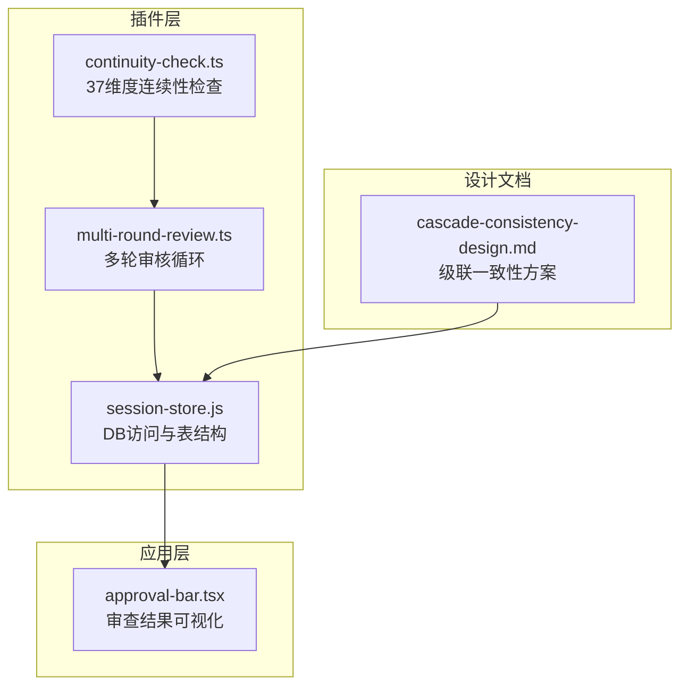
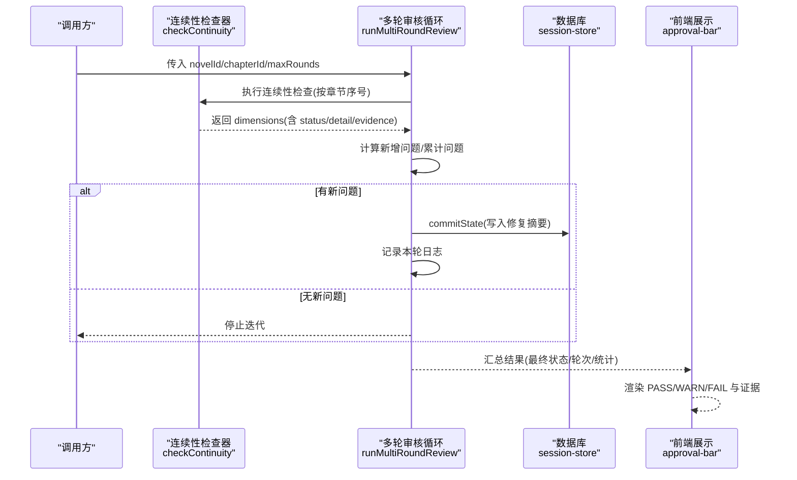
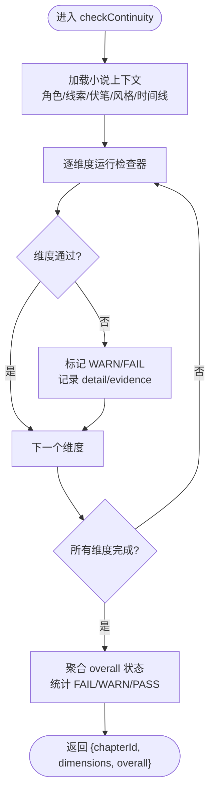
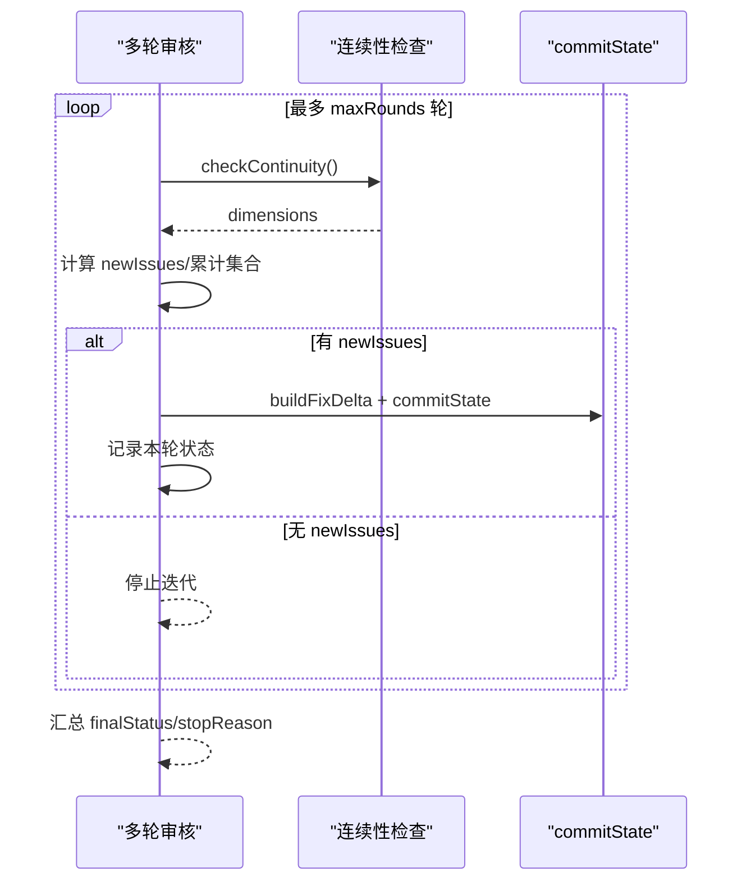
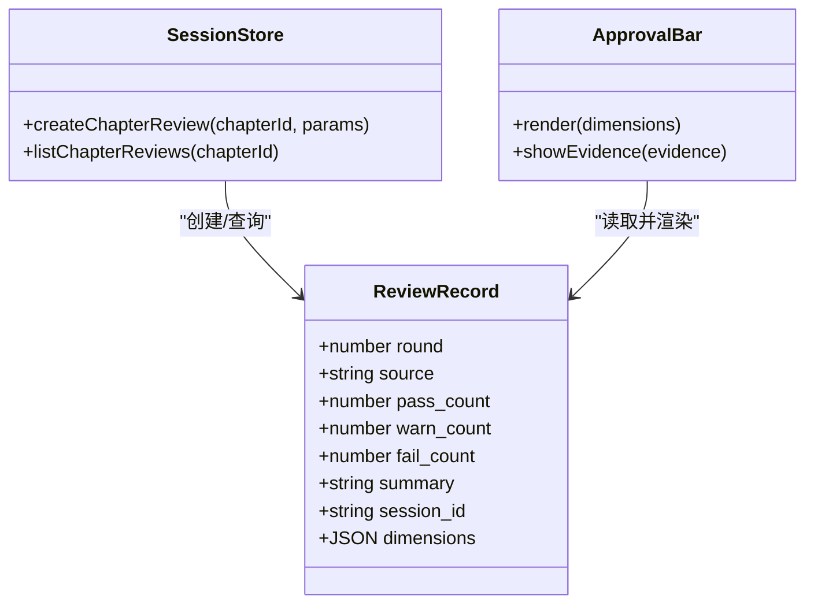
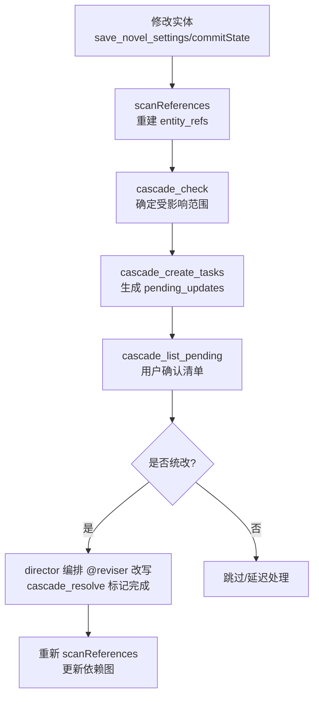
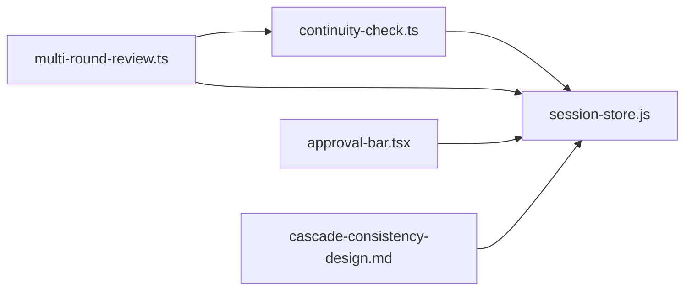

# 审查规则插件

<cite>
**本文引用的文件**   
- [continuity-check.ts](file://packages/plugin/src/novel-writer/continuity-check.ts)
- [multi-round-review.ts](file://packages/plugin/src/novel-writer/multi-round-review.ts)
- [review.test.ts](file://packages/plugin/test/novel-writer/review.test.ts)
- [cascade-consistency-design.md](file://docs/cascade-consistency-design.md)
- [approval-bar.tsx](file://packages/app/src/pages/novel/approval-bar.tsx)
- [session-store.js](file://packages/plugin/src/novel-writer/session-store.js)
</cite>

## 目录
1. [简介](#简介)
2. [项目结构](#项目结构)
3. [核心组件](#核心组件)
4. [架构总览](#架构总览)
5. [详细组件分析](#详细组件分析)
6. [依赖关系分析](#依赖关系分析)
7. [性能考虑](#性能考虑)
8. [故障排查指南](#故障排查指南)
9. [结论](#结论)
10. [附录](#附录)

## 简介
本文件为 openNovel 的“审查规则插件”提供系统化文档，面向开发者与内容创作者。重点包括：
- 如何开发自定义审查规则（规则定义、检查逻辑、报告生成）
- 37维度连续性审查系统的实现原理与扩展方式
- 复杂审查算法编写方法（正则匹配、语义分析、上下文理解）
- 常见规则的代码示例路径（重复内容检测、风格一致性、事实准确性）
- 规则优先级管理、性能优化与调试技巧

## 项目结构
审查规则插件位于 packages/plugin 下的 novel-writer 模块，核心由“连续性检查 + 多轮审核 + 评审持久化 + 级联一致性”组成。前端通过 approval-bar 展示各维度的 PASS/WARN/FAIL 结果与证据片段。

图表来源
- [continuity-check.ts](file://packages/plugin/src/novel-writer/continuity-check.ts)
- [multi-round-review.ts](file://packages/plugin/src/novel-writer/multi-round-review.ts)
- [session-store.js](file://packages/plugin/src/novel-writer/session-store.js)
- [cascade-consistency-design.md](file://docs/cascade-consistency-design.md)
- [approval-bar.tsx](file://packages/app/src/pages/novel/approval-bar.tsx)

章节来源
- [review.test.ts:144-151](file://packages/plugin/test/novel-writer/review.test.ts#L144-L151)

## 核心组件
- 连续性检查器（continuity-check.ts）
  - 负责按 37 个维度对章节进行一致性校验，输出每个维度的状态（PASS/WARN/FAIL）、详情与证据片段。
  - 对外暴露 checkContinuity(novelId, chapterNumber, directory?) 接口。
- 多轮审核循环（multi-round-review.ts）
  - 驱动 audit → fix → sync → log 的迭代流程，直到无新问题或达到最大轮次。
  - 导出 runMultiRoundReview(novelId, chapterId, maxRounds=5, directory?) 主函数。
- 评审持久化（session-store.js）
  - 提供 createChapterReview/listChapterReviews 等能力，维护 round、计数、dimensions 等评审记录。
- 级联一致性（cascade-consistency-design.md）
  - 定义 entity_refs/pending_updates 表与 cascade_* 工具链，确保设定变更能自动影响并修复相关引用。

章节来源
- [multi-round-review.ts:15-21](file://packages/plugin/src/novel-writer/multi-round-review.ts#L15-L21)
- [multi-round-review.ts:170-175](file://packages/plugin/src/novel-writer/multi-round-review.ts#L170-L175)
- [review.test.ts:144-151](file://packages/plugin/test/novel-writer/review.test.ts#L144-L151)
- [cascade-consistency-design.md:12-53](file://docs/cascade-consistency-design.md#L12-L53)

## 架构总览
下图展示了从“连续性检查”到“多轮审核”，再到“评审持久化”和“级联一致性”的整体数据流与控制流。

图表来源
- [multi-round-review.ts:170-175](file://packages/plugin/src/novel-writer/multi-round-review.ts#L170-L175)
- [multi-round-review.ts:185-284](file://packages/plugin/src/novel-writer/multi-round-review.ts#L185-L284)
- [approval-bar.tsx:179-209](file://packages/app/src/pages/novel/approval-bar.tsx#L179-L209)

## 详细组件分析

### 连续性检查器（37维度系统）
- 输入：novelId、chapterNumber（可选 directory）
- 输出：包含 chapterId 与 dimensions 数组的结构体，每个维度包含 dimension/status/detail/evidence
- 关键行为：
  - 角色一致性检查：同一角色在不同段落/场景中的名称、性格、动机是否一致
  - 时间线验证：事件顺序、时间戳前后矛盾、伏笔埋设与回收章节顺序
  - 情节逻辑分析：因果链完整性、线索状态与优先级一致性
  - 设定冲突检测：世界设定、力量体系、风格指南之间的冲突
- 扩展点：在 continuity-check.ts 中新增维度函数，并在聚合阶段纳入评分与证据提取

图表来源
- [continuity-check.ts](file://packages/plugin/src/novel-writer/continuity-check.ts)
- [review.test.ts:144-151](file://packages/plugin/test/novel-writer/review.test.ts#L144-L151)

章节来源
- [continuity-check.ts](file://packages/plugin/src/novel-writer/continuity-check.ts)
- [review.test.ts:144-151](file://packages/plugin/test/novel-writer/review.test.ts#L144-L151)

### 多轮审核循环
- 目标：通过多轮迭代逐步消除新问题，直至稳定或达到最大轮次
- 核心流程：
  - 每轮执行 checkContinuity
  - 提取 FAIL/WARN 维度集合，计算与上一轮差异得到 newIssues
  - 若无新问题则停止；否则构建修复 delta 并通过 commitState 同步
  - 记录本轮日志与状态，更新累计集合
- 终止条件：无新问题、达到 maxRounds、数据异常

图表来源
- [multi-round-review.ts:170-175](file://packages/plugin/src/novel-writer/multi-round-review.ts#L170-L175)
- [multi-round-review.ts:185-284](file://packages/plugin/src/novel-writer/multi-round-review.ts#L185-L284)

章节来源
- [multi-round-review.ts:15-21](file://packages/plugin/src/novel-writer/multi-round-review.ts#L15-L21)
- [multi-round-review.ts:170-175](file://packages/plugin/src/novel-writer/multi-round-review.ts#L170-L175)
- [multi-round-review.ts:185-284](file://packages/plugin/src/novel-writer/multi-round-review.ts#L185-L284)

### 评审持久化与展示
- session-store.js 提供 createChapterReview/listChapterReviews，支持 round 推导、计数统计、排序
- approval-bar.tsx 渲染每个维度的状态、详情与证据片段，区分 PASS/WARN/FAIL 颜色

图表来源
- [review.test.ts:67-133](file://packages/plugin/test/novel-writer/review.test.ts#L67-L133)
- [approval-bar.tsx:179-209](file://packages/app/src/pages/novel/approval-bar.tsx#L179-L209)

章节来源
- [review.test.ts:67-133](file://packages/plugin/test/novel-writer/review.test.ts#L67-L133)
- [approval-bar.tsx:179-209](file://packages/app/src/pages/novel/approval-bar.tsx#L179-L209)

### 级联一致性（统查统改）
- 目标：当实体（如角色、世界设定、风格指南）被修改时，自动识别受影响内容并生成统改任务
- 关键机制：
  - entity_refs：记录“谁引用了谁”，写入时扫描建立
  - pending_updates：为受影响实体创建待处理任务，带优先级
  - cascade_check/create_tasks/list_pending/resolve/rebuild_refs：确定性工具链
- 集成点：write_chapter/revise_chapter/save_novel_settings/commitState 等写入路径接入扫描与门禁

图表来源
- [cascade-consistency-design.md:12-53](file://docs/cascade-consistency-design.md#L12-L53)
- [cascade-consistency-design.md:77-128](file://docs/cascade-consistency-design.md#L77-L128)
- [cascade-consistency-design.md:209-220](file://docs/cascade-consistency-design.md#L209-L220)

章节来源
- [cascade-consistency-design.md:12-53](file://docs/cascade-consistency-design.md#L12-L53)
- [cascade-consistency-design.md:77-128](file://docs/cascade-consistency-design.md#L77-L128)
- [cascade-consistency-design.md:209-220](file://docs/cascade-consistency-design.md#L209-L220)

## 依赖关系分析
- continuity-check.ts 依赖 session-store.js 获取章节与上下文数据
- multi-round-review.ts 依赖 continuity-check.ts 与 session-store.js（commitState）
- 前端 approval-bar.tsx 依赖后端返回的 dimensions 数据进行渲染
- 级联一致性通过 DB 表 entity_refs/pending_updates 与现有写入路径耦合

图表来源
- [continuity-check.ts](file://packages/plugin/src/novel-writer/continuity-check.ts)
- [multi-round-review.ts:15-21](file://packages/plugin/src/novel-writer/multi-round-review.ts#L15-L21)
- [session-store.js](file://packages/plugin/src/novel-writer/session-store.js)
- [approval-bar.tsx:179-209](file://packages/app/src/pages/novel/approval-bar.tsx#L179-L209)
- [cascade-consistency-design.md:12-53](file://docs/cascade-consistency-design.md#L12-L53)

章节来源
- [multi-round-review.ts:15-21](file://packages/plugin/src/novel-writer/multi-round-review.ts#L15-L21)
- [review.test.ts:144-151](file://packages/plugin/test/novel-writer/review.test.ts#L144-L151)

## 性能考虑
- 批量与去重：在多轮审核中，使用 Set 累计问题维度，避免重复计算与冗余同步
- 短路径优先：连续性检查应优先执行低成本规则（如长度/格式），再执行高成本规则（如语义分析）
- 增量扫描：级联一致性仅在写入后触发 scanReferences，避免全量扫描
- 分页与限制：对大章节或长上下文，采用分块处理与上下文窗口限制
- 缓存热点：对频繁查询的角色/世界设定列表做内存缓存，减少 DB 压力

[本节为通用指导，不直接分析具体文件]

## 故障排查指南
- 常见问题定位
  - 连续性检查未返回 37 维度：检查 checkContinuity 的维度注册与聚合逻辑
  - 多轮审核无法收敛：查看 newIssues 计算与 buildFixDelta 是否正确映射到 chapter_summary 更新
  - 级联任务未生成：确认 commitState/update 分支是否调用 cascadeCreateTasks，以及 entity_refs 是否已重建
- 调试建议
  - 打印每轮的 failCount/warnCount/newIssues 与 synced 标志
  - 在 approval-bar 中展开 evidence 字段，核对证据片段是否与预期一致
  - 使用 cascade_list_pending 查看 pending_updates 状态，必要时 cascade_rebuild_refs 重建依赖图

章节来源
- [multi-round-review.ts:185-284](file://packages/plugin/src/novel-writer/multi-round-review.ts#L185-L284)
- [approval-bar.tsx:179-209](file://packages/app/src/pages/novel/approval-bar.tsx#L179-L209)
- [cascade-consistency-design.md:275-278](file://docs/cascade-consistency-design.md#L275-L278)

## 结论
openNovel 的审查规则插件以“连续性检查 + 多轮审核 + 评审持久化 + 级联一致性”为核心，形成闭环的内容质量保障体系。开发者可在 continuity-check.ts 中扩展维度规则，结合正则与语义分析提升检测精度；通过 multi-round-review.ts 实现自动化修复与收敛；借助级联一致性确保设定变更的全局一致性。配合前端可视化与完善的测试用例，可快速落地高质量、可维护的审查规则插件。

[本节为总结性内容，不直接分析具体文件]

## 附录

### 如何开发自定义审查规则
- 规则定义
  - 在 continuity-check.ts 中新增维度函数，返回 {dimension, status, detail, evidence?}
  - 将新维度加入聚合阶段，参与 overall 状态计算
- 检查逻辑
  - 基于正则表达式匹配（如重复句式、禁用词）
  - 基于语义分析（如角色动机缺失、线索状态不一致）
  - 基于上下文理解（如时间线倒置、伏笔未回收）
- 报告生成
  - 为每个维度提供 detail 与 evidence，便于前端展示与人工复核
  - 在 multi-round-review.ts 中，buildFixDelta 将 FAIL/WARN 维度转为 chapter_summary 更新条目

章节来源
- [continuity-check.ts](file://packages/plugin/src/novel-writer/continuity-check.ts)
- [multi-round-review.ts:136-150](file://packages/plugin/src/novel-writer/multi-round-review.ts#L136-L150)

### 常见规则示例（代码路径）
- 重复内容检测：参考 test 中 scale.test.ts 的审计模拟，利用 Map/Set 统计出现频次与位置
  - [scale.test.ts:384-406](file://packages/plugin/test/novel-writer/scale.test.ts#L384-L406)
- 风格一致性检查：依据 style 实体的 rules/tone/pov/tense 字段进行对比
  - [scale.test.ts:317-328](file://packages/plugin/test/novel-writer/scale.test.ts#L317-L328)
- 事实准确性验证：基于 timeline/plot_thread/foreshadow 的一致性校验
  - [scale.test.ts:330-362](file://packages/plugin/test/novel-writer/scale.test.ts#L330-L362)

章节来源
- [scale.test.ts:317-328](file://packages/plugin/test/novel-writer/scale.test.ts#L317-L328)
- [scale.test.ts:330-362](file://packages/plugin/test/novel-writer/scale.test.ts#L330-L362)
- [scale.test.ts:384-406](file://packages/plugin/test/novel-writer/scale.test.ts#L384-L406)

### 规则优先级管理与性能优化
- 优先级管理
  - 级联一致性中按 high/medium/low 优先级生成 pending_updates，确保关键变更优先处理
  - 多轮审核中按 newIssues 动态聚焦，避免无效迭代
- 性能优化
  - 使用 Set 去重与增量计算，降低复杂度
  - 分批处理大文本，控制上下文窗口
  - 缓存热点数据，减少 DB 查询

章节来源
- [cascade-consistency-design.md:209-220](file://docs/cascade-consistency-design.md#L209-L220)
- [multi-round-review.ts:185-284](file://packages/plugin/src/novel-writer/multi-round-review.ts#L185-L284)