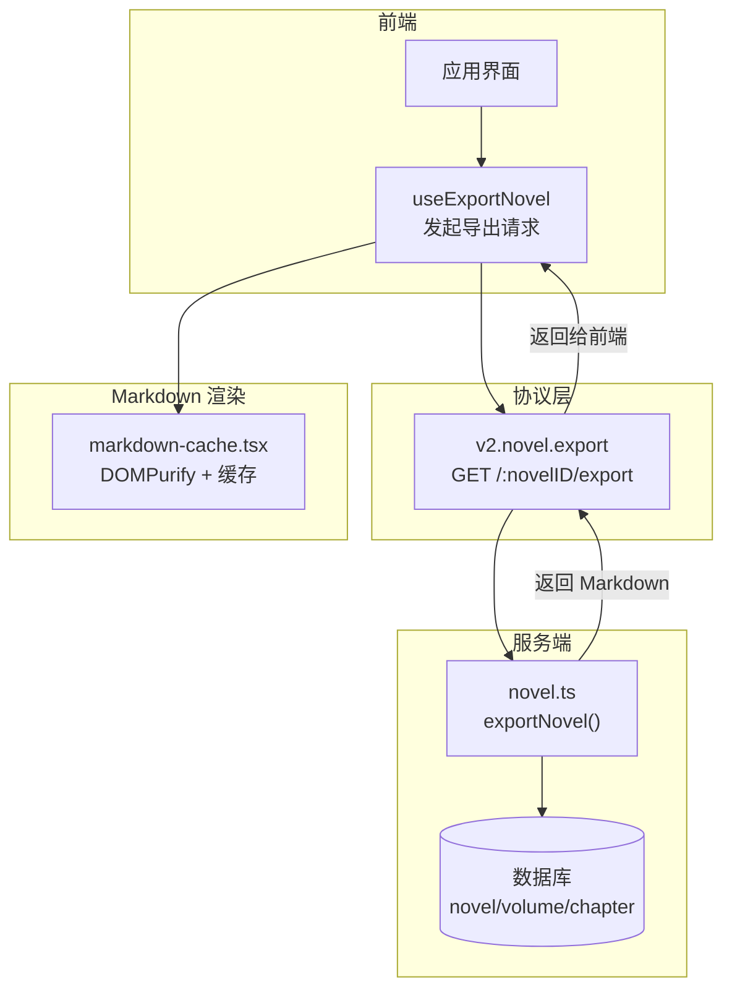
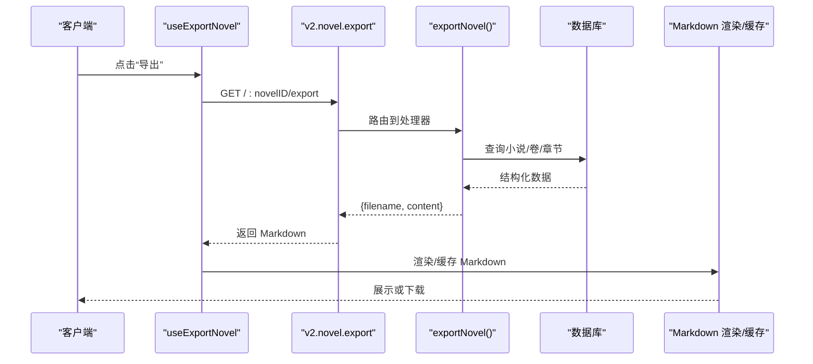
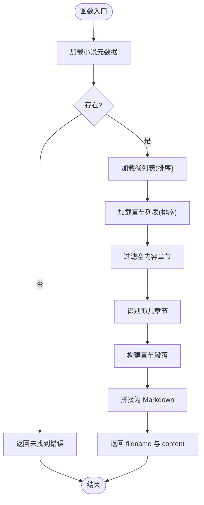
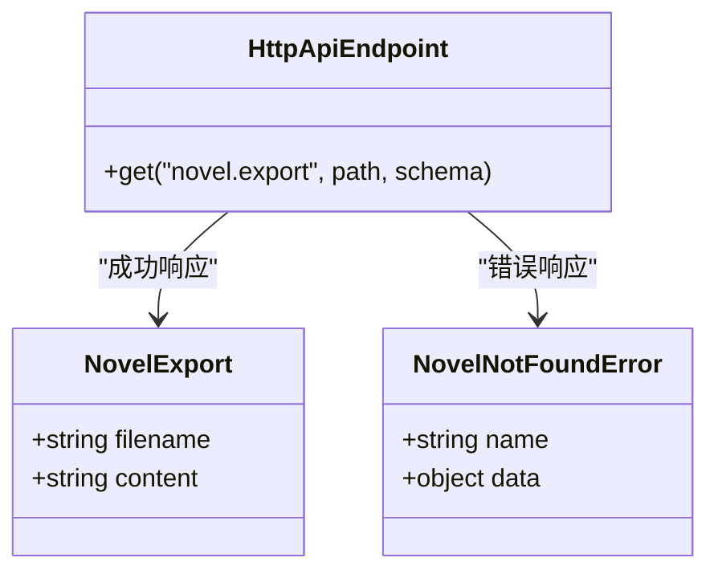
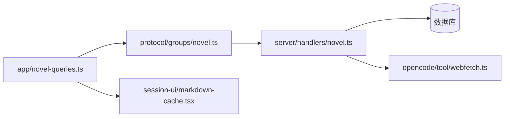

# 导出格式插件

<cite>
**本文引用的文件**
- [packages/server/src/handlers/novel.ts](file://packages/server/src/handlers/novel.ts)
- [packages/protocol/src/groups/novel.ts](file://packages/protocol/src/groups/novel.ts)
- [packages/app/src/context/novel-queries.ts](file://packages/app/src/context/novel-queries.ts)
- [packages/session-ui/src/components/markdown-cache.tsx](file://packages/session-ui/src/components/markdown-cache.tsx)
- [packages/opencode/src/tool/webfetch.ts](file://packages/opencode/src/tool/webfetch.ts)
</cite>

## 目录
1. [简介](#简介)
2. [项目结构](#项目结构)
3. [核心组件](#核心组件)
4. [架构总览](#架构总览)
5. [详细组件分析](#详细组件分析)
6. [依赖关系分析](#依赖关系分析)
7. [性能考虑](#性能考虑)
8. [故障排查指南](#故障排查指南)
9. [结论](#结论)
10. [附录](#附录)

## 简介
本文件面向 openNovel 的“导出格式插件”开发者，目标是说明如何扩展导出能力以支持 PDF、EPUB、MOBI、Word 等常见格式。当前仓库已提供 Markdown 导出的完整实现与 HTTP API 定义，可作为模板系统、富文本处理、批量导出、进度跟踪与错误恢复的基础骨架。本文基于现有代码进行系统化梳理，并给出可落地的扩展方案与最佳实践。

## 项目结构
与导出相关的关键位置：
- 服务端处理器：负责从数据库读取小说、卷、章节数据，组装为 Markdown 内容并返回文件名与内容。
- 协议层：定义导出接口（HTTP GET /:novelID/export）及响应类型。
- 前端调用：通过 useExportNovel 发起导出请求。
- Markdown 渲染与安全：前端对 Markdown 转 HTML 的安全清洗与缓存策略。
- HTML 到 Markdown 转换工具：用于将网页内容转换为 Markdown，便于统一中间表示。

**图表来源**
- [packages/protocol/src/groups/novel.ts:374-389](file://packages/protocol/src/groups/novel.ts#L374-L389)
- [packages/server/src/handlers/novel.ts:454-486](file://packages/server/src/handlers/novel.ts#L454-L486)
- [packages/app/src/context/novel-queries.ts:501-511](file://packages/app/src/context/novel-queries.ts#L501-L511)
- [packages/session-ui/src/components/markdown-cache.tsx:1-53](file://packages/session-ui/src/components/markdown-cache.tsx#L1-L53)

**章节来源**
- [packages/protocol/src/groups/novel.ts:374-389](file://packages/protocol/src/groups/novel.ts#L374-L389)
- [packages/server/src/handlers/novel.ts:454-486](file://packages/server/src/handlers/novel.ts#L454-L486)
- [packages/app/src/context/novel-queries.ts:501-511](file://packages/app/src/context/novel-queries.ts#L501-L511)
- [packages/session-ui/src/components/markdown-cache.tsx:1-53](file://packages/session-ui/src/components/markdown-cache.tsx#L1-L53)

## 核心组件
- 导出处理器 exportNovel：按顺序聚合小说标题、简介、卷与章节，生成单一 Markdown 文档，返回文件名与内容。
- 导出 API 定义：声明 v2.novel.export 端点，指定路径参数 novelID、LocationQuery 以及成功响应 NovelExport。
- 前端导出 Hook：封装客户端调用，传入 novelID 与目录信息，触发导出流程。
- Markdown 安全与缓存：使用 DOMPurify 过滤危险标签，维护 LRU 式缓存提升渲染性能。
- HTML→Markdown 工具：将网页内容转换为 Markdown，作为统一中间表示，便于后续多格式转换。

**章节来源**
- [packages/server/src/handlers/novel.ts:454-486](file://packages/server/src/handlers/novel.ts#L454-L486)
- [packages/protocol/src/groups/novel.ts:374-389](file://packages/protocol/src/groups/novel.ts#L374-L389)
- [packages/app/src/context/novel-queries.ts:501-511](file://packages/app/src/context/novel-queries.ts#L501-L511)
- [packages/session-ui/src/components/markdown-cache.tsx:1-53](file://packages/session-ui/src/components/markdown-cache.tsx#L1-L53)
- [packages/opencode/src/tool/webfetch.ts:158-192](file://packages/opencode/src/tool/webfetch.ts#L158-L192)

## 架构总览
导出流程采用“前端调用 → 协议定义 → 服务端处理器 → 数据库查询 → 返回 Markdown”的分层设计。该结构天然适合在“返回 Markdown”之后接入多种格式转换器（PDF、EPUB、MOBI、Word），形成统一的“中间表示 + 多格式输出”的插件化架构。

**图表来源**
- [packages/app/src/context/novel-queries.ts:501-511](file://packages/app/src/context/novel-queries.ts#L501-L511)
- [packages/protocol/src/groups/novel.ts:374-389](file://packages/protocol/src/groups/novel.ts#L374-L389)
- [packages/server/src/handlers/novel.ts:454-486](file://packages/server/src/handlers/novel.ts#L454-L486)
- [packages/session-ui/src/components/markdown-cache.tsx:1-53](file://packages/session-ui/src/components/markdown-cache.tsx#L1-L53)

## 详细组件分析

### 导出处理器 exportNovel
- 功能：根据 novelID 获取小说元数据、卷列表与章节列表，过滤空内容与孤儿章节，按顺序拼接为 Markdown 字符串，返回文件名与内容。
- 复杂度：主要开销在数据库查询与字符串拼接；时间复杂度近似 O(N+M)，N 为章节数，M 为卷数。
- 可扩展点：可在拼接阶段注入样式标记、导航锚点、图片占位符，以便后续模板系统渲染。

**图表来源**
- [packages/server/src/handlers/novel.ts:454-486](file://packages/server/src/handlers/novel.ts#L454-L486)

**章节来源**
- [packages/server/src/handlers/novel.ts:454-486](file://packages/server/src/handlers/novel.ts#L454-L486)

### 导出 API 定义
- 端点：GET /:novelID/export
- 参数：novelID（路径）、LocationQuery（查询）
- 成功响应：NovelExport（包含 filename 与 content）
- 错误响应：NovelNotFoundError

**图表来源**
- [packages/protocol/src/groups/novel.ts:374-389](file://packages/protocol/src/groups/novel.ts#L374-L389)

**章节来源**
- [packages/protocol/src/groups/novel.ts:374-389](file://packages/protocol/src/groups/novel.ts#L374-L389)

### 前端导出 Hook
- 作用：封装客户端导出调用，传入 novelID 与目录信息，触发服务器端导出。
- 集成点：可与 UI 按钮、快捷键、批量任务队列结合，实现批量导出与进度反馈。

**章节来源**
- [packages/app/src/context/novel-queries.ts:501-511](file://packages/app/src/context/novel-queries.ts#L501-L511)

### Markdown 渲染与安全
- 安全清洗：使用 DOMPurify 配置白名单与禁止标签，防止 XSS。
- 缓存策略：基于内容的哈希值维护 LRU 缓存，限制最大条目数，避免内存膨胀。
- 适用性：为导出后的预览与下载前渲染提供稳定、安全的中间环节。

**章节来源**
- [packages/session-ui/src/components/markdown-cache.tsx:1-53](file://packages/session-ui/src/components/markdown-cache.tsx#L1-L53)

### HTML→Markdown 转换工具
- 用途：将网页内容转换为 Markdown，统一中间表示，便于后续模板系统与多格式转换。
- 特点：移除脚本、样式等无关节点，保留标题、列表、代码块等语义结构。

**章节来源**
- [packages/opencode/src/tool/webfetch.ts:158-192](file://packages/opencode/src/tool/webfetch.ts#L158-L192)

## 依赖关系分析
- 前端依赖协议层定义的导出端点，调用 useExportNovel 发起请求。
- 服务端处理器依赖数据库访问与 ORM 查询，按序组装 Markdown。
- Markdown 渲染依赖安全库与缓存机制，确保展示质量与性能。
- HTML→Markdown 工具为外部内容导入提供统一中间表示。

**图表来源**
- [packages/app/src/context/novel-queries.ts:501-511](file://packages/app/src/context/novel-queries.ts#L501-L511)
- [packages/protocol/src/groups/novel.ts:374-389](file://packages/protocol/src/groups/novel.ts#L374-L389)
- [packages/server/src/handlers/novel.ts:454-486](file://packages/server/src/handlers/novel.ts#L454-L486)
- [packages/session-ui/src/components/markdown-cache.tsx:1-53](file://packages/session-ui/src/components/markdown-cache.tsx#L1-L53)
- [packages/opencode/src/tool/webfetch.ts:158-192](file://packages/opencode/src/tool/webfetch.ts#L158-L192)

**章节来源**
- [packages/app/src/context/novel-queries.ts:501-511](file://packages/app/src/context/novel-queries.ts#L501-L511)
- [packages/protocol/src/groups/novel.ts:374-389](file://packages/protocol/src/groups/novel.ts#L374-L389)
- [packages/server/src/handlers/novel.ts:454-486](file://packages/server/src/handlers/novel.ts#L454-L486)
- [packages/session-ui/src/components/markdown-cache.tsx:1-53](file://packages/session-ui/src/components/markdown-cache.tsx#L1-L53)
- [packages/opencode/src/tool/webfetch.ts:158-192](file://packages/opencode/src/tool/webfetch.ts#L158-L192)

## 性能考虑
- 数据库查询优化：按 order 字段排序，减少内存中排序开销；仅选择必要字段。
- 字符串拼接：使用数组收集段落后 join，避免频繁字符串连接。
- 渲染缓存：Markdown→HTML 的缓存策略降低重复渲染成本。
- 流式处理：对于超大文档，建议引入流式写入与分页输出，避免一次性加载导致内存峰值。

[本节为通用指导，不直接分析具体文件]

## 故障排查指南
- 未找到小说：检查 novelID 是否正确，确认数据库中存在对应记录。
- 空内容章节：导出会过滤空内容，若期望保留需调整过滤逻辑。
- 孤儿章节：未关联卷的章节会被单独列出，检查卷绑定是否完整。
- 渲染安全问题：确认 DOMPurify 配置是否允许所需标签，避免被误删。

**章节来源**
- [packages/server/src/handlers/novel.ts:454-486](file://packages/server/src/handlers/novel.ts#L454-L486)
- [packages/session-ui/src/components/markdown-cache.tsx:1-53](file://packages/session-ui/src/components/markdown-cache.tsx#L1-L53)

## 结论
当前 openNovel 的导出能力以 Markdown 为核心中间表示，具备清晰的 API 定义与服务端处理器实现。在此基础上，可通过“模板系统 + 多格式转换器”的插件化架构，轻松扩展至 PDF、EPUB、MOBI、Word 等格式。建议在导出处理器中预留样式与布局钩子，在前端渲染层完善安全与缓存策略，以实现高质量、高性能的多格式导出体验。

[本节为总结性内容，不直接分析具体文件]

## 附录

### 开发多格式导出插件的步骤建议
- 在 exportNovel 返回 Markdown 后，增加“格式选择”分支，根据目标格式调用相应转换器。
- 模板系统：定义模板变量（如标题、卷名、章节内容、图片占位符、表格结构），由转换器解析并生成目标格式。
- 富文本处理：图片插入建议使用占位符或外链引用；表格渲染保持 Markdown 表格语法；章节导航通过锚点或目录页实现。
- 批量导出：在前端维护任务队列，逐个调用导出 API，并聚合进度与结果。
- 进度跟踪：在服务端或前端维护状态机，记录每个任务的开始、完成、失败状态。
- 错误恢复：对失败任务进行重试或跳过，记录错误日志并提供用户提示。
- 注册新格式：在协议层新增端点或在现有端点增加 format 参数，在服务端处理器中扩展转换逻辑。
- 集成第三方库：选择成熟的转换库（如 Pandoc、ebook-convert、docx 生成器），通过进程调用或 SDK 集成。

[本节为概念性指导，不直接分析具体文件]