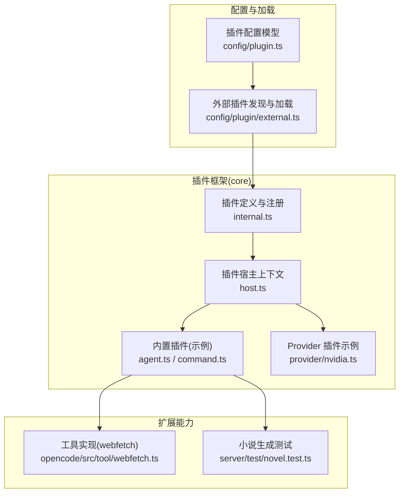
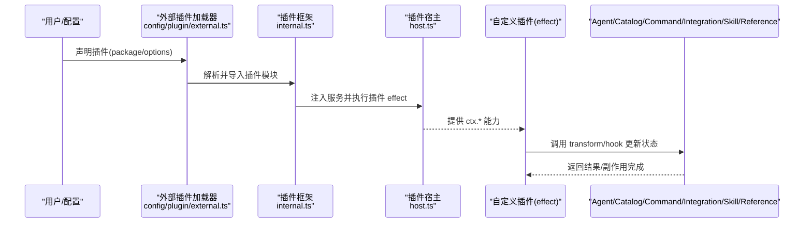
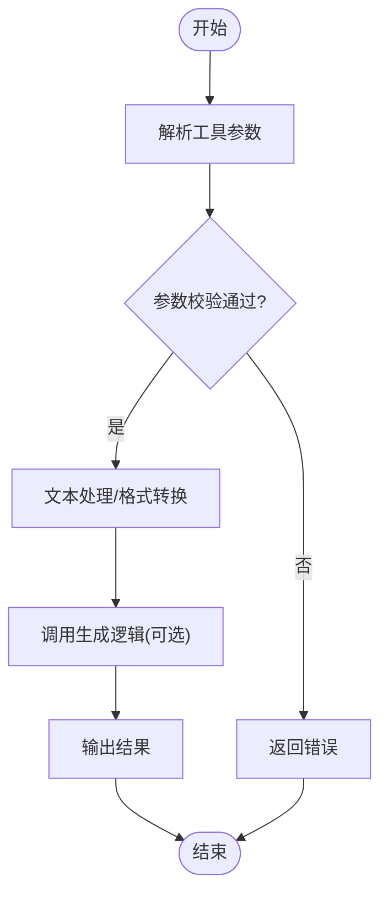
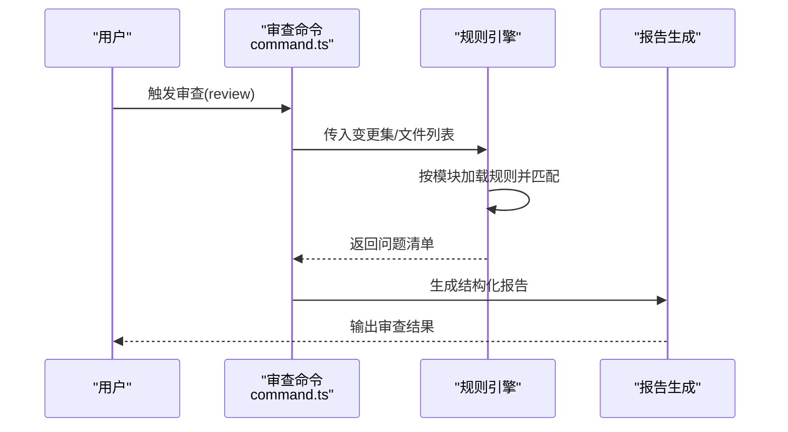
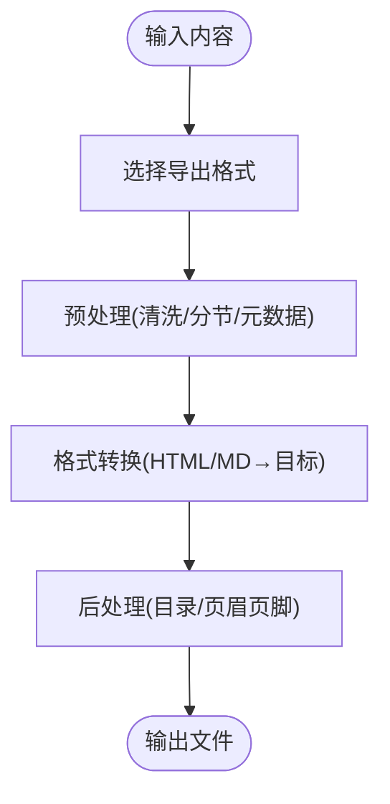
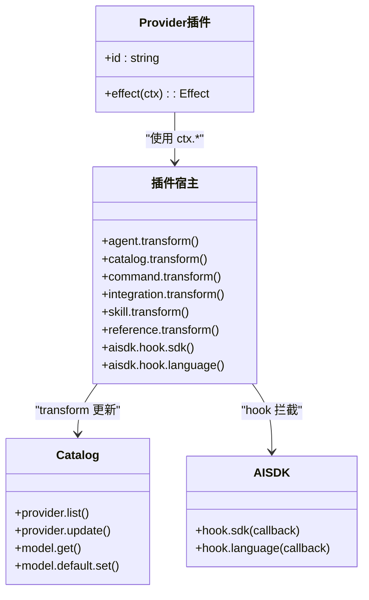
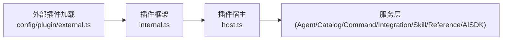

# 插件类型与功能

<cite>
**本文引用的文件**
- [packages/core/src/config/plugin.ts](file://packages/core/src/config/plugin.ts)
- [packages/core/src/plugin/host.ts](file://packages/core/src/plugin/host.ts)
- [packages/core/src/plugin/agent.ts](file://packages/core/src/plugin/agent.ts)
- [packages/core/src/plugin/command.ts](file://packages/core/src/plugin/command.ts)
- [packages/core/src/plugin/internal.ts](file://packages/core/src/plugin/internal.ts)
- [packages/core/src/plugin/provider/nvidia.ts](file://packages/core/src/plugin/provider/nvidia.ts)
- [packages/core/src/config/plugin/external.ts](file://packages/core/src/config/plugin/external.ts)
- [packages/opencode/test/tool/registry.test.ts](file://packages/opencode/test/tool/registry.test.ts)
- [packages/opencode/src/tool/webfetch.ts](file://packages/opencode/src/tool/webfetch.ts)
- [packages/server/test/novel.test.ts](file://packages/server/test/novel.test.ts)
</cite>

## 目录
1. [简介](#简介)
2. [项目结构](#项目结构)
3. [核心组件](#核心组件)
4. [架构总览](#架构总览)
5. [详细组件分析](#详细组件分析)
6. [依赖关系分析](#依赖关系分析)
7. [性能考量](#性能考量)
8. [故障排查指南](#故障排查指南)
9. [结论](#结论)
10. [附录](#附录)

## 简介
本文件面向 openNovel 的插件体系，系统化说明四类插件的开发方法与使用场景：写作工具插件、审查规则插件、导出格式插件、AI 提供商插件。文档从系统架构、数据流、处理逻辑、集成点与错误处理等维度展开，并提供可落地的开发指引与示例路径，帮助开发者快速构建高质量插件。

## 项目结构
openNovel 的插件能力由 core 层的插件框架提供统一入口与上下文，外部插件通过配置或动态加载机制接入。关键目录与职责如下：
- packages/core/src/plugin: 插件定义、宿主上下文、内置插件（Agent、Command、Skill、Provider 等）
- packages/core/src/config/plugin: 插件配置模型与类型
- packages/core/src/config/plugin/external.ts: 外部插件发现与加载
- packages/opencode/src/tool: 工具实现（如 webfetch），可作为写作工具插件的参考
- packages/server/test/novel.test.ts: 小说大纲/章节生成相关测试用例，体现内容生成流程

图表来源
- [packages/core/src/plugin/internal.ts:1-154](file://packages/core/src/plugin/internal.ts#L1-L154)
- [packages/core/src/plugin/host.ts:1-220](file://packages/core/src/plugin/host.ts#L1-L220)
- [packages/core/src/plugin/agent.ts:1-207](file://packages/core/src/plugin/agent.ts#L1-L207)
- [packages/core/src/plugin/command.ts:1-26](file://packages/core/src/plugin/command.ts#L1-L26)
- [packages/core/src/plugin/provider/nvidia.ts:1-22](file://packages/core/src/plugin/provider/nvidia.ts#L1-L22)
- [packages/core/src/config/plugin.ts:1-14](file://packages/core/src/config/plugin.ts#L1-L14)
- [packages/core/src/config/plugin/external.ts:42-78](file://packages/core/src/config/plugin/external.ts#L42-L78)
- [packages/opencode/src/tool/webfetch.ts:147-192](file://packages/opencode/src/tool/webfetch.ts#L147-L192)
- [packages/server/test/novel.test.ts:344-352](file://packages/server/test/novel.test.ts#L344-L352)

章节来源
- [packages/core/src/plugin/internal.ts:1-154](file://packages/core/src/plugin/internal.ts#L1-L154)
- [packages/core/src/config/plugin.ts:1-14](file://packages/core/src/config/plugin.ts#L1-L14)
- [packages/core/src/config/plugin/external.ts:42-78](file://packages/core/src/config/plugin/external.ts#L42-L78)

## 核心组件
- 插件定义与注册
  - 插件以 id + effect(context) 的形式定义，并通过 define 包装后统一注册到 PluginV2.Service。
  - internal.ts 中集中装配内置插件与 Provider 插件，并注入所需服务（Catalog、Command、Integration、Agent、Config、Location、Npm、Event、FS、Global、HttpClient、Skill、Reference）。
- 插件宿主上下文
  - host.ts 暴露 ctx.agent、ctx.catalog、ctx.command、ctx.integration、ctx.reference、ctx.skill、ctx.aisdk 等能力，供插件在运行时修改 Agent、Provider、Model、命令、技能、引用等。
- 配置模型
  - config/plugin.ts 定义了插件条目 Entry（package、options）与 Plugins 数组类型，用于声明式配置插件。

章节来源
- [packages/core/src/plugin/internal.ts:1-154](file://packages/core/src/plugin/internal.ts#L1-L154)
- [packages/core/src/plugin/host.ts:1-220](file://packages/core/src/plugin/host.ts#L1-L220)
- [packages/core/src/config/plugin.ts:1-14](file://packages/core/src/config/plugin.ts#L1-L14)

## 架构总览
下图展示插件从配置到运行时的整体链路：配置层声明插件，外部加载器发现并导入模块，内部框架将插件 effect 注入宿主上下文，插件通过 transform/hook 等方式对系统状态进行增量更新。

图表来源
- [packages/core/src/config/plugin/external.ts:42-78](file://packages/core/src/config/plugin/external.ts#L42-L78)
- [packages/core/src/plugin/internal.ts:1-154](file://packages/core/src/plugin/internal.ts#L1-L154)
- [packages/core/src/plugin/host.ts:1-220](file://packages/core/src/plugin/host.ts#L1-L220)

## 详细组件分析

### 写作工具插件
目标：为 AI 助手提供“写章节”“格式化文本”“内容生成”等工具能力。
- 开发要点
  - 通过 ctx.command.transform 或工具注册机制暴露工具；参数 schema 需明确描述字段与必填项。
  - 工具 execute 函数负责具体业务逻辑，例如写入章节、转换格式、调用 LLM 生成内容。
  - 可结合 webfetch 工具进行 HTML→Markdown 等格式转换，提升内容处理能力。
- 示例与参考
  - 工具注册与参数定义参考：packages/opencode/test/tool/registry.test.ts
  - 文本格式转换参考：packages/opencode/src/tool/webfetch.ts（HTML 提取与 Markdown 转换）
  - 内容生成流程参考：packages/server/test/novel.test.ts（大纲/卷/章节生成）

章节来源
- [packages/opencode/test/tool/registry.test.ts](file://packages/opencode/test/tool/registry.test.ts)
- [packages/opencode/src/tool/webfetch.ts:147-192](file://packages/opencode/src/tool/webfetch.ts#L147-L192)
- [packages/server/test/novel.test.ts:344-352](file://packages/server/test/novel.test.ts#L344-L352)

### 审查规则插件
目标：定义代码/文档审查规则，并在提交/分支/PR 等场景中自动检查并生成报告。
- 开发要点
  - 通过 ctx.command.transform 注入审查命令模板（如 review），支持 diff 扫描、文件读取、模式匹配。
  - 规则可按模块拆分，按需懒加载，避免一次性加载全部规则。
  - 报告建议结构化输出（问题类型、位置、严重级别、修复建议）。
- 示例与参考
  - 审查命令模板参考：packages/core/src/plugin/command.ts（update("review", ...)）
  - 规则组织方式可参考多语言文档中的 AGENTS.md 引用策略（按需加载、模块化）

章节来源
- [packages/core/src/plugin/command.ts:1-26](file://packages/core/src/plugin/command.ts#L1-L26)

### 导出格式插件
目标：支持多种文件格式（Markdown、PDF、EPUB、DOCX 等）的导出与定制。
- 开发要点
  - 通过工具或命令暴露导出入口，接收内容源与目标格式。
  - 内部可复用 webfetch 的文本提取与转换能力，或将 HTML/Markdown 转为目标格式。
  - 支持分页、目录、元数据、样式等选项。
- 示例与参考
  - 文本转换参考：packages/opencode/src/tool/webfetch.ts（HTML→Markdown）
  - 内容结构参考：packages/server/test/novel.test.ts（大纲/卷/章节结构）

[本图为概念流程图，不直接映射具体源码]

### AI 提供商插件
目标：集成不同 AI 提供商（OpenAI 兼容、Anthropic、Azure、NVIDIA 等），统一模型调用、参数配置与结果处理。
- 开发要点
  - 通过 ctx.catalog.transform 对 Provider/Model 进行增强（如添加请求头、覆盖 URL、设置默认值）。
  - 通过 ctx.aisdk.hook.sdk/language 拦截 SDK 初始化与语言适配，注入自定义行为。
  - 遵循统一的 Provider API 规范（type、package、url、headers、request.variant 等）。
- 示例与参考
  - NVIDIA Provider 增强示例：packages/core/src/plugin/provider/nvidia.ts
  - 插件宿主上下文能力：packages/core/src/plugin/host.ts（catalog/aisdk/command/integration/skill/reference）

图表来源
- [packages/core/src/plugin/host.ts:1-220](file://packages/core/src/plugin/host.ts#L1-L220)
- [packages/core/src/plugin/provider/nvidia.ts:1-22](file://packages/core/src/plugin/provider/nvidia.ts#L1-L22)

章节来源
- [packages/core/src/plugin/provider/nvidia.ts:1-22](file://packages/core/src/plugin/provider/nvidia.ts#L1-L22)
- [packages/core/src/plugin/host.ts:1-220](file://packages/core/src/plugin/host.ts#L1-L220)

## 依赖关系分析
- 插件框架 internal.ts 集中装配内置插件与 Provider 插件，并为每个插件 effect 注入服务依赖。
- 外部插件通过 external.ts 发现并导入，随后交由 internal.ts 统一注册。
- 宿主 host.ts 提供 ctx.* 能力，插件通过 transform/hook 与 Catalog、Agent、Command、Integration、Skill、Reference、AISDK 交互。

图表来源
- [packages/core/src/config/plugin/external.ts:42-78](file://packages/core/src/config/plugin/external.ts#L42-L78)
- [packages/core/src/plugin/internal.ts:1-154](file://packages/core/src/plugin/internal.ts#L1-L154)
- [packages/core/src/plugin/host.ts:1-220](file://packages/core/src/plugin/host.ts#L1-L220)

章节来源
- [packages/core/src/plugin/internal.ts:1-154](file://packages/core/src/plugin/internal.ts#L1-L154)
- [packages/core/src/config/plugin/external.ts:42-78](file://packages/core/src/config/plugin/external.ts#L42-L78)
- [packages/core/src/plugin/host.ts:1-220](file://packages/core/src/plugin/host.ts#L1-L220)

## 性能考量
- 插件 effect 应尽量避免阻塞 I/O，必要时使用异步与并发控制。
- 规则与模板按需加载，避免一次性加载大量规则导致启动延迟。
- 文本转换与内容生成建议使用流式处理与缓存策略，减少重复计算。
- Provider 请求头与参数尽量复用，减少网络开销。

[本节为通用指导，不直接分析具体文件]

## 故障排查指南
- 插件未生效
  - 检查 external.ts 是否正确发现插件文件与包名。
  - 确认 internal.ts 是否已将插件 effect 注册到 PluginV2.Service。
- 工具无法调用
  - 核对工具参数 schema 与必填项。
  - 检查工具 execute 是否返回预期结果。
- 提供商配置异常
  - 确认 catalog.transform 中对 provider/model 的更新是否生效。
  - 检查 aisdk.hook 是否正确拦截并修改 sdk/language。
- 文本转换失败
  - 验证 HTML 解析与 Markdown 转换链路的异常处理。

章节来源
- [packages/core/src/config/plugin/external.ts:42-78](file://packages/core/src/config/plugin/external.ts#L42-L78)
- [packages/core/src/plugin/internal.ts:1-154](file://packages/core/src/plugin/internal.ts#L1-L154)
- [packages/opencode/src/tool/webfetch.ts:147-192](file://packages/opencode/src/tool/webfetch.ts#L147-L192)
- [packages/core/src/plugin/provider/nvidia.ts:1-22](file://packages/core/src/plugin/provider/nvidia.ts#L1-L22)

## 结论
openNovel 的插件体系以 internal.ts 为核心装配点，通过 host.ts 提供的丰富上下文能力，使插件能够安全、可控地扩展 Agent、Provider、命令、技能、引用与 SDK 行为。写作工具、审查规则、导出格式与 AI 提供商四类插件分别对应不同的扩展点与最佳实践，开发者可依据本文档快速定位接口与示例，构建稳定高效的插件生态。

## 附录
- 插件配置模型：packages/core/src/config/plugin.ts
- 外部插件加载：packages/core/src/config/plugin/external.ts
- 插件宿主能力：packages/core/src/plugin/host.ts
- 内置插件示例：packages/core/src/plugin/agent.ts、packages/core/src/plugin/command.ts
- Provider 插件示例：packages/core/src/plugin/provider/nvidia.ts
- 工具与转换参考：packages/opencode/src/tool/webfetch.ts
- 内容生成测试：packages/server/test/novel.test.ts