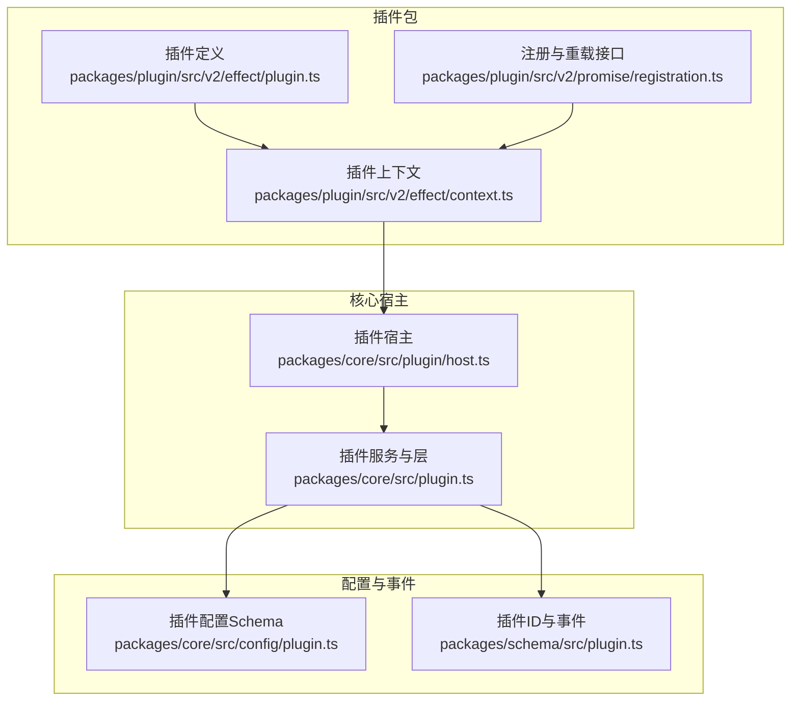
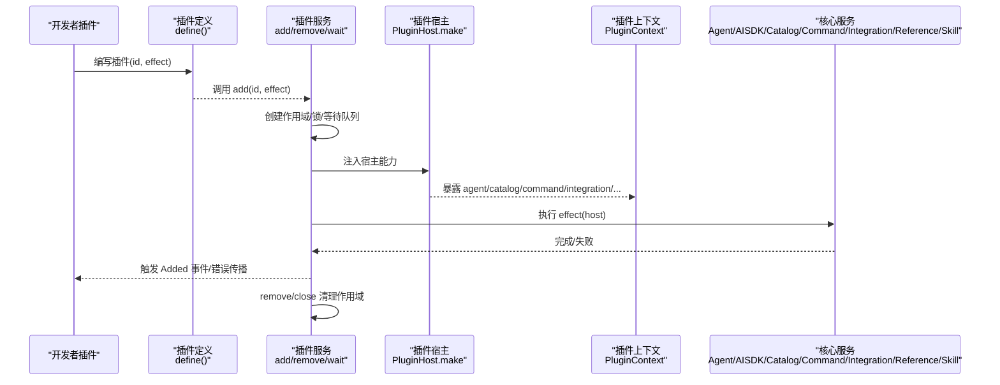
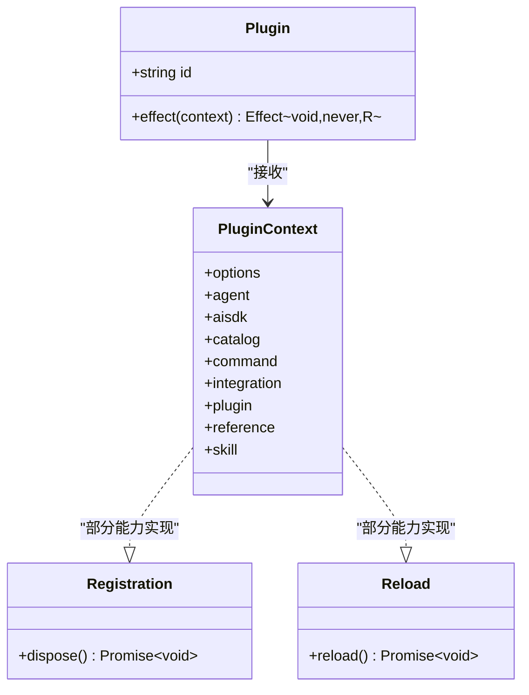
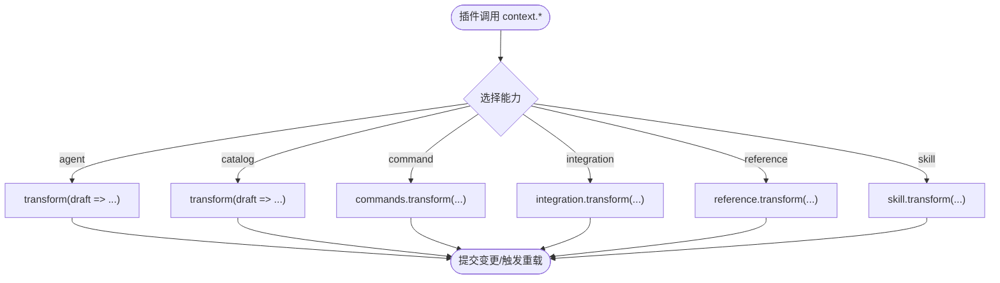
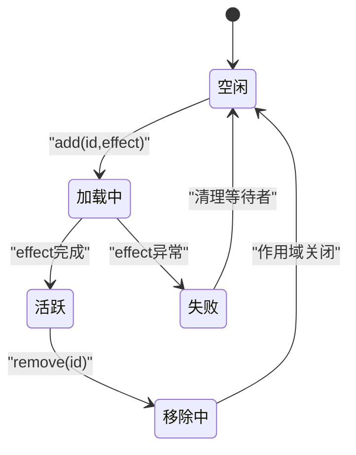
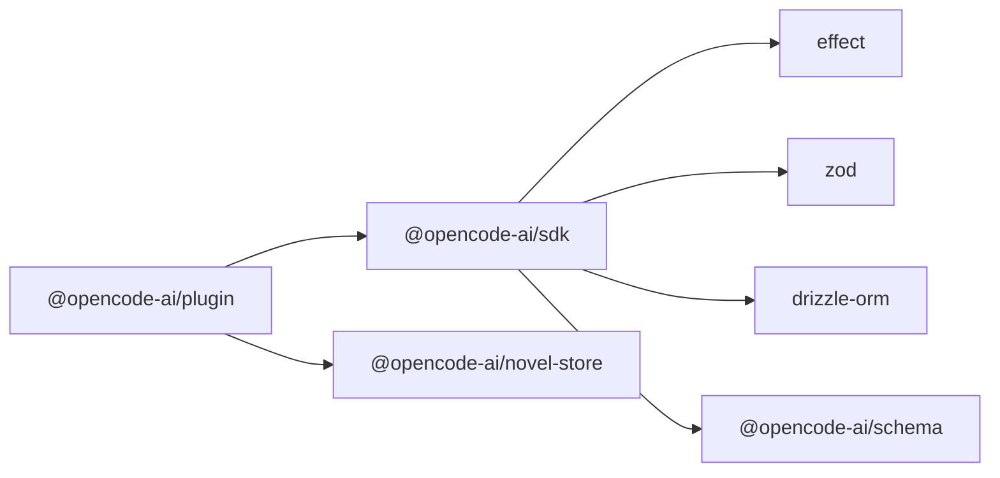

# 插件系统

<cite>
**本文引用的文件**
- [packages/core/src/plugin.ts](file://packages/core/src/plugin.ts)
- [packages/core/src/plugin/host.ts](file://packages/core/src/plugin/host.ts)
- [packages/core/src/config/plugin.ts](file://packages/core/src/config/plugin.ts)
- [packages/schema/src/plugin.ts](file://packages/schema/src/plugin.ts)
- [packages/plugin/src/v2/effect/plugin.ts](file://packages/plugin/src/v2/effect/plugin.ts)
- [packages/plugin/src/v2/effect/context.ts](file://packages/plugin/src/v2/effect/context.ts)
- [packages/plugin/src/v2/promise/registration.ts](file://packages/plugin/src/v2/promise/registration.ts)
- [packages/opencode/specs/tui-plugins.md](file://packages/opencode/specs/tui-plugins.md)
- [packages/core/test/plugin/promise.test.ts](file://packages/core/test/plugin/promise.test.ts)
- [packages/opencode/test/plugin/trigger.test.ts](file://packages/opencode/test/plugin/trigger.test.ts)
</cite>

## 目录
1. [简介](#简介)
2. [项目结构](#项目结构)
3. [核心组件](#核心组件)
4. [架构总览](#架构总览)
5. [详细组件分析](#详细组件分析)
6. [依赖关系分析](#依赖关系分析)
7. [性能考量](#性能考量)
8. [故障排查指南](#故障排查指南)
9. [结论](#结论)
10. [附录](#附录)

## 简介
本文件为 openNovel 的插件系统提供系统化、可操作的文档。内容覆盖插件架构设计（生命周期、钩子机制与扩展点）、开发模板与流程、调试技巧、发布规范，以及写作工具插件、审查规则插件、导出格式插件和 AI 提供商插件的开发方法。同时给出配置选项、参数传递与返回值处理的最佳实践，并解释插件与核心系统的集成与通信机制，包含测试策略与性能优化建议。

## 项目结构
openNovel 的插件系统由“插件定义与运行时”“宿主与上下文”“配置与事件”三部分组成：
- 插件定义与运行时：位于 packages/plugin，提供 v2 的 Effect/Promise 两种风格插件接口与上下文。
- 宿主与上下文：位于 packages/core/src/plugin，负责插件加载、作用域管理、事件分发与宿主能力暴露。
- 配置与事件：位于 packages/core/src/config/plugin.ts 与 packages/schema/src/plugin.ts，定义插件配置结构与事件类型。

**图表来源**
- [packages/plugin/src/v2/effect/plugin.ts:1-17](file://packages/plugin/src/v2/effect/plugin.ts#L1-L17)
- [packages/plugin/src/v2/effect/context.ts:1-23](file://packages/plugin/src/v2/effect/context.ts#L1-L23)
- [packages/plugin/src/v2/promise/registration.ts:1-11](file://packages/plugin/src/v2/promise/registration.ts#L1-L11)
- [packages/core/src/plugin.ts:1-168](file://packages/core/src/plugin.ts#L1-L168)
- [packages/core/src/plugin/host.ts:1-220](file://packages/core/src/plugin/host.ts#L1-L220)
- [packages/core/src/config/plugin.ts:1-14](file://packages/core/src/config/plugin.ts#L1-L14)
- [packages/schema/src/plugin.ts:1-14](file://packages/schema/src/plugin.ts#L1-L14)

**章节来源**
- [packages/core/src/plugin.ts:1-168](file://packages/core/src/plugin.ts#L1-L168)
- [packages/core/src/plugin/host.ts:1-220](file://packages/core/src/plugin/host.ts#L1-L220)
- [packages/core/src/config/plugin.ts:1-14](file://packages/core/src/config/plugin.ts#L1-L14)
- [packages/schema/src/plugin.ts:1-14](file://packages/schema/src/plugin.ts#L1-L14)
- [packages/plugin/src/v2/effect/plugin.ts:1-17](file://packages/plugin/src/v2/effect/plugin.ts#L1-L17)
- [packages/plugin/src/v2/effect/context.ts:1-23](file://packages/plugin/src/v2/effect/context.ts#L1-L23)
- [packages/plugin/src/v2/promise/registration.ts:1-11](file://packages/plugin/src/v2/promise/registration.ts#L1-L11)

## 核心组件
- 插件定义（Effect 风格）
  - 通过 define 声明插件 id 与 effect，effect(context) 返回 Effect<void, never, R>，在宿主作用域内执行。
- 插件上下文（PluginContext）
  - 暴露 options、agent、aisdk、catalog、command、integration、plugin、reference、skill 等能力，供插件扩展系统行为。
- 插件宿主（PluginHost）
  - 将核心服务（Agent、AISDK、Catalog、Command、Integration、Reference、Skill）以 transform/reload 等方式暴露给插件，支持副作用与 Effect 组合。
- 插件服务（Core Plugin Service）
  - 提供 add/remove/wait 能力，管理插件生命周期与作用域，统一事件与错误传播。
- 配置与事件
  - 配置项支持字符串或对象（package/options），事件包含 plugin.added 等。

**章节来源**
- [packages/plugin/src/v2/effect/plugin.ts:1-17](file://packages/plugin/src/v2/effect/plugin.ts#L1-L17)
- [packages/plugin/src/v2/effect/context.ts:1-23](file://packages/plugin/src/v2/effect/context.ts#L1-L23)
- [packages/core/src/plugin/host.ts:1-220](file://packages/core/src/plugin/host.ts#L1-L220)
- [packages/core/src/plugin.ts:1-168](file://packages/core/src/plugin.ts#L1-L168)
- [packages/core/src/config/plugin.ts:1-14](file://packages/core/src/config/plugin.ts#L1-L14)
- [packages/schema/src/plugin.ts:1-14](file://packages/schema/src/plugin.ts#L1-L14)

## 架构总览
下图展示插件从定义到加载、运行、卸载的全链路，以及宿主如何桥接核心服务。

**图表来源**
- [packages/core/src/plugin.ts:1-168](file://packages/core/src/plugin.ts#L1-L168)
- [packages/core/src/plugin/host.ts:1-220](file://packages/core/src/plugin/host.ts#L1-L220)
- [packages/plugin/src/v2/effect/plugin.ts:1-17](file://packages/plugin/src/v2/effect/plugin.ts#L1-L17)
- [packages/plugin/src/v2/effect/context.ts:1-23](file://packages/plugin/src/v2/effect/context.ts#L1-L23)

## 详细组件分析

### 插件定义与上下文（Effect 风格）
- 插件定义
  - 使用 define 返回 { id, effect }，effect 接收上下文并返回 Effect。
- 上下文能力
  - agent/catalg/command/integration/reference/skill 均提供 reload 与 transform，用于增量更新与热重载。
  - aisdk 提供 sdk/language 钩子，允许修改 SDK 实例与语言模型配置。
  - plugin 提供 add/remove 动态管理能力。

**图表来源**
- [packages/plugin/src/v2/effect/plugin.ts:1-17](file://packages/plugin/src/v2/effect/plugin.ts#L1-L17)
- [packages/plugin/src/v2/effect/context.ts:1-23](file://packages/plugin/src/v2/effect/context.ts#L1-L23)
- [packages/plugin/src/v2/promise/registration.ts:1-11](file://packages/plugin/src/v2/promise/registration.ts#L1-L11)

**章节来源**
- [packages/plugin/src/v2/effect/plugin.ts:1-17](file://packages/plugin/src/v2/effect/plugin.ts#L1-L17)
- [packages/plugin/src/v2/effect/context.ts:1-23](file://packages/plugin/src/v2/effect/context.ts#L1-L23)
- [packages/plugin/src/v2/promise/registration.ts:1-11](file://packages/plugin/src/v2/promise/registration.ts#L1-L11)

### 插件宿主与核心服务桥接
- 宿主职责
  - 将 Agent、AISDK、Catalog、Command、Integration、Reference、Skill 的能力以 transform/reload 的方式暴露给插件。
  - 对 AISDK 的 sdk/language 钩子进行拦截与回写，确保插件修改生效。
  - 对 Integration 的方法授权流程进行包装，统一返回 Effect 并生成 OAuth 凭证。
- 插件能力映射
  - agent.transform 提供 list/get/default/update/remove 等代理。
  - catalog.transform 提供 provider/model 的增删改查与默认值设置。
  - command/integration/reference/skill 均提供 transform 与 reload。

**图表来源**
- [packages/core/src/plugin/host.ts:1-220](file://packages/core/src/plugin/host.ts#L1-L220)

**章节来源**
- [packages/core/src/plugin/host.ts:1-220](file://packages/core/src/plugin/host.ts#L1-L220)

### 插件服务与生命周期
- 生命周期阶段
  - add：检测循环加载、加锁、创建子作用域、执行 effect、发布 Added 事件、记录活跃状态。
  - wait：等待插件加载成功或失败，支持多个等待者。
  - remove：关闭已激活的作用域，清理失败状态。
  - 最终化：进程退出时关闭所有作用域。
- 并发与错误
  - 使用 KeyedMutex 保证同一插件串行加载。
  - 失败时记录 Exit 并通知等待者，避免悬挂。

**图表来源**
- [packages/core/src/plugin.ts:1-168](file://packages/core/src/plugin.ts#L1-L168)

**章节来源**
- [packages/core/src/plugin.ts:1-168](file://packages/core/src/plugin.ts#L1-L168)

### 配置与事件
- 配置项
  - 支持字符串（包名）或对象 { package, options }。
- 事件
  - plugin.added：插件加载成功后广播 id。

**章节来源**
- [packages/core/src/config/plugin.ts:1-14](file://packages/core/src/config/plugin.ts#L1-L14)
- [packages/schema/src/plugin.ts:1-14](file://packages/schema/src/plugin.ts#L1-L14)

### TUI 插件规范与示例
- TUI 插件规范要点
  - 文件插件需导出 id；npm 插件可使用模块导出的 id 或包名。
  - exports["./server"].config 与 exports["./tui"].config 可提供默认插件选项。
  - 插件入口与生命周期由 CLI/TUI 驱动。

**章节来源**
- [packages/opencode/specs/tui-plugins.md](file://packages/opencode/specs/tui-plugins.md)

## 依赖关系分析
- 插件包依赖 Effect、Zod、Drizzle ORM 等，peer 依赖 @opentui/* 用于 UI 扩展。
- 核心插件服务依赖 EventV2、AgentV2、AISDK、Catalog、Command、Integration、Reference、Skill 等节点层。
- 宿主将上述服务以 transform/reload 方式暴露给插件上下文。

**图表来源**
- [packages/plugin/package.json:1-61](file://packages/plugin/package.json#L1-L61)
- [packages/core/src/plugin.ts:1-168](file://packages/core/src/plugin.ts#L1-L168)

**章节来源**
- [packages/plugin/package.json:1-61](file://packages/plugin/package.json#L1-L61)
- [packages/core/src/plugin.ts:1-168](file://packages/core/src/plugin.ts#L1-L168)

## 性能考量
- 作用域隔离：每个插件在独立 Scope 中运行，失败自动回收，避免内存泄漏。
- 串行加载：KeyedMutex 防止同一插件重复加载，减少竞争条件。
- 批量更新：State.batch 合并多次变更，降低重渲染与同步开销。
- 懒加载与等待：wait 机制避免阻塞主流程，提升启动速度。
- 钩子最小化：仅在必要处使用 transform，避免过度拦截。

[本节为通用指导，不直接分析具体文件]

## 故障排查指南
- 常见问题定位
  - 插件加载循环：检查 add 前是否重复加载，查看日志中的循环检测信息。
  - 异步钩子未等待：确保回调返回 Promise 或 Effect，并在宿主侧正确 await。
  - 资源未释放：确认 registration.dispose 被调用，或在插件卸载时清理。
- 调试技巧
  - 使用 Effect 的 Span 与日志追踪插件加载路径。
  - 通过 wait(id) 观察插件状态变化。
  - 在 transform 回调中打印输入输出，验证数据流。
- 测试参考
  - 异步钩子等待与同步钩子无崩溃的行为已在测试用例中覆盖。
  - 注册项 dispose 后应确保对应资源被移除。

**章节来源**
- [packages/core/test/plugin/promise.test.ts:43-67](file://packages/core/test/plugin/promise.test.ts#L43-L67)
- [packages/opencode/test/plugin/trigger.test.ts:75-108](file://packages/opencode/test/plugin/trigger.test.ts#L75-L108)

## 结论
openNovel 的插件系统以 Effect 为核心，结合宿主与上下文抽象，提供了稳定、可扩展的插件生态。通过清晰的配置与事件模型、严格的加载与生命周期管理，以及丰富的扩展点（Agent、AISDK、Catalog、Command、Integration、Reference、Skill），开发者可以构建高质量的写作工具、审查规则、导出格式与 AI 提供商插件。遵循本文最佳实践与测试策略，可获得更健壮的插件体验。

## 附录

### 插件开发模板与步骤
- 选择风格
  - Effect 风格：使用 define({ id, effect }) 返回 Effect 插件。
  - Promise 风格：使用 fromPromise 适配 Promise 插件。
- 编写插件
  - 在 effect(context) 中使用 context.agent/catalog/command/integration/reference/skill 的 transform/reload 扩展能力。
  - 如需动态管理其他插件，使用 context.plugin.add/remove。
- 配置与选项
  - 在配置中以字符串或 { package, options } 形式声明插件。
  - 插件内部通过 context.options 读取选项。
- 调试与测试
  - 使用 Effect 的 Span 与日志，结合 wait(id) 观察状态。
  - 参考测试用例编写断言，覆盖同步/异步钩子与资源释放。

**章节来源**
- [packages/plugin/src/v2/effect/plugin.ts:1-17](file://packages/plugin/src/v2/effect/plugin.ts#L1-L17)
- [packages/core/src/config/plugin.ts:1-14](file://packages/core/src/config/plugin.ts#L1-L14)
- [packages/core/test/plugin/promise.test.ts:43-67](file://packages/core/test/plugin/promise.test.ts#L43-L67)
- [packages/opencode/test/plugin/trigger.test.ts:75-108](file://packages/opencode/test/plugin/trigger.test.ts#L75-L108)

### 写作工具插件
- 扩展点
  - 使用 context.command.transform 添加命令或增强现有命令。
  - 使用 context.skill.source 注册技能源，配合上下文能力实现工作流。
- 参数与返回值
  - 命令输入/输出通过 Effect 管道传递，保持类型安全。
  - 使用 zod schema 校验输入，确保稳定性。

**章节来源**
- [packages/core/src/plugin/host.ts:1-220](file://packages/core/src/plugin/host.ts#L1-L220)

### 审查规则插件
- 扩展点
  - 使用 context.reference.transform 增加引用源或校验规则。
  - 使用 context.catalog.transform 调整模型与提供者策略。
- 参数与返回值
  - 规则函数应返回 Effect，便于异步校验与错误聚合。

**章节来源**
- [packages/core/src/plugin/host.ts:1-220](file://packages/core/src/plugin/host.ts#L1-L220)

### 导出格式插件
- 扩展点
  - 使用 context.command.transform 新增导出命令或扩展导出选项。
  - 使用 context.integration.method.update 配置认证与刷新流程。
- 参数与返回值
  - 导出参数通过 options 传入，返回值以 Effect 封装，便于错误处理。

**章节来源**
- [packages/core/src/plugin/host.ts:1-220](file://packages/core/src/plugin/host.ts#L1-L220)

### AI 提供商插件
- 扩展点
  - 使用 context.aisdk.sdk 与 context.aisdk.language 钩子定制 SDK 实例与语言模型配置。
  - 使用 context.catalog.provider/model 注册新的提供者与模型。
- 参数与返回值
  - 钩子回调返回 Effect 或 void，宿主会统一处理副作用与回写。

**章节来源**
- [packages/core/src/plugin/host.ts:1-220](file://packages/core/src/plugin/host.ts#L1-L220)

### 插件配置选项、参数传递与返回值处理
- 配置选项
  - 插件配置支持 package 与 options，options 为键值对，类型任意。
- 参数传递
  - 通过 context.options 读取，或使用 transform 回调的参数/返回值传递。
- 返回值处理
  - 所有副作用与计算通过 Effect 组合，宿主统一调度与错误传播。

**章节来源**
- [packages/core/src/config/plugin.ts:1-14](file://packages/core/src/config/plugin.ts#L1-L14)
- [packages/core/src/plugin/host.ts:1-220](file://packages/core/src/plugin/host.ts#L1-L220)

### 插件与核心系统的集成与通信机制
- 集成方式
  - 插件通过 define 声明，核心服务通过 add/remove/wait 管理生命周期。
  - 宿主将核心服务以 transform/reload 暴露给插件上下文。
- 通信机制
  - 事件：plugin.added 广播插件加载结果。
  - 作用域：每个插件在独立 Scope 中运行，失败自动回收。

**章节来源**
- [packages/core/src/plugin.ts:1-168](file://packages/core/src/plugin.ts#L1-L168)
- [packages/schema/src/plugin.ts:1-14](file://packages/schema/src/plugin.ts#L1-L14)

### 插件测试策略
- 单元测试
  - 覆盖同步/异步钩子、资源释放、错误路径。
- 集成测试
  - 模拟插件加载与宿主交互，验证事件与状态变化。
- 参考用例
  - 参见 promise.test.ts 与 trigger.test.ts 中的断言模式。

**章节来源**
- [packages/core/test/plugin/promise.test.ts:43-67](file://packages/core/test/plugin/promise.test.ts#L43-L67)
- [packages/opencode/test/plugin/trigger.test.ts:75-108](file://packages/opencode/test/plugin/trigger.test.ts#L75-L108)

### 插件发布流程
- 文件插件
  - 导出 id，按规范组织入口与配置。
- npm 插件
  - 使用包名作为 id，或通过模块导出 id。
- 默认配置
  - 在 exports["./server"].config 与 exports["./tui"].config 提供默认选项。

**章节来源**
- [packages/opencode/specs/tui-plugins.md](file://packages/opencode/specs/tui-plugins.md)