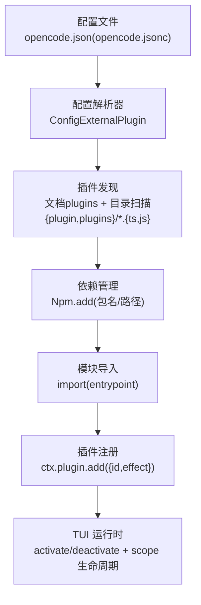
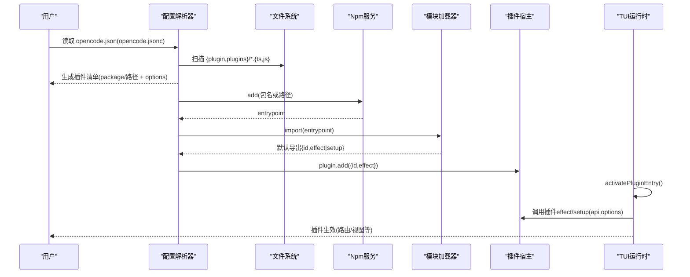
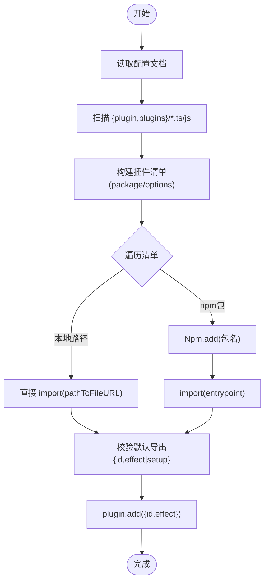
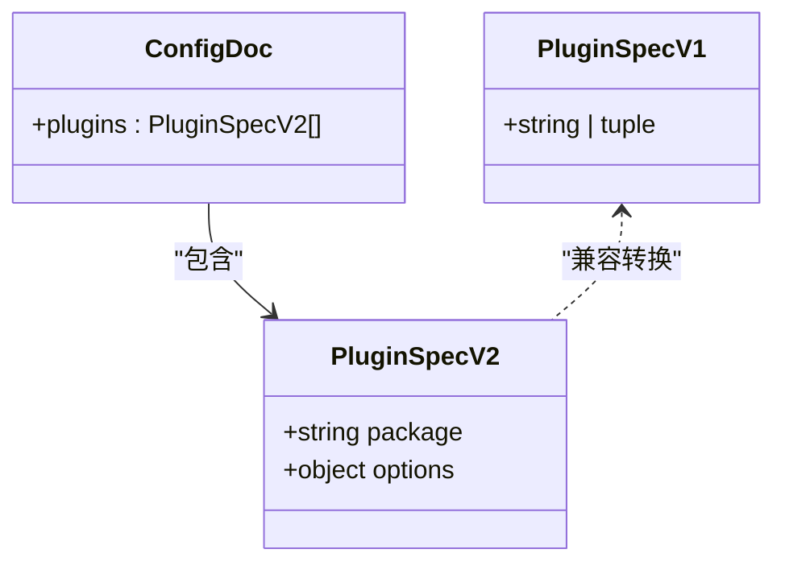
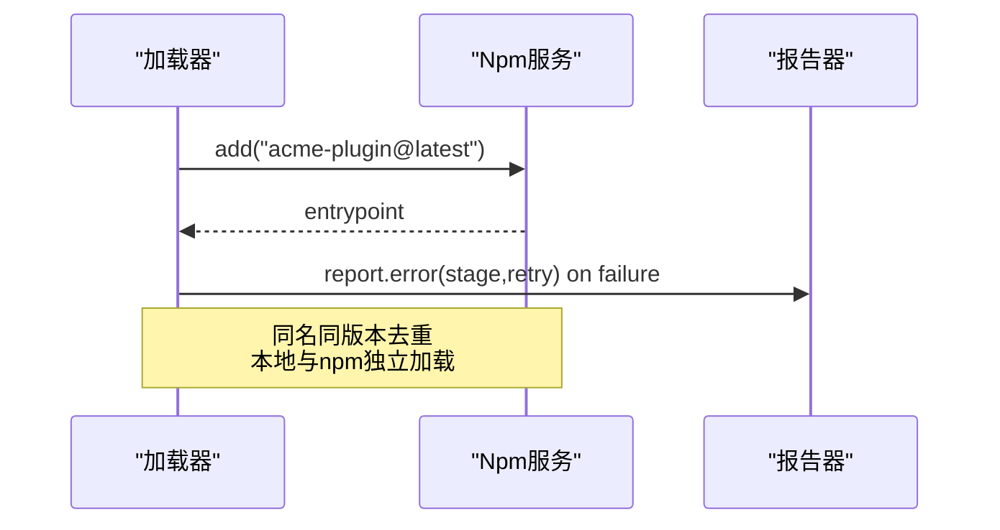
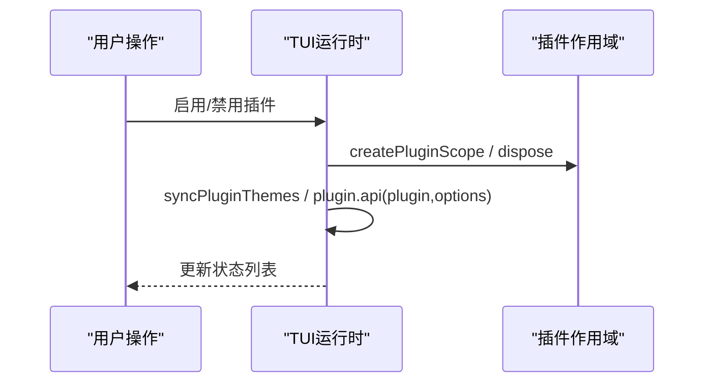
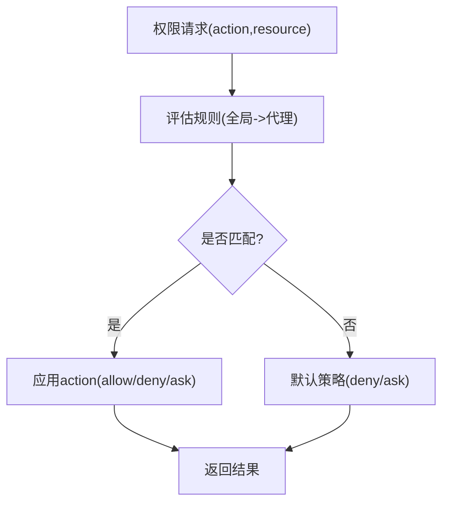
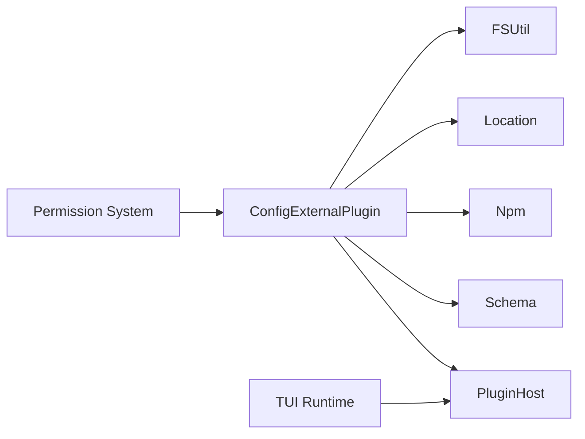

# 插件集成与配置

<cite>
**本文引用的文件**   
- [packages/core/src/config/plugin/external.ts](file://packages/core/src/config/plugin/external.ts)
- [packages/core/src/v1/config/plugin.ts](file://packages/core/src/v1/config/plugin.ts)
- [specs/v2/config.md](file://specs/v2/config.md)
- [packages/opencode/src/plugin/tui/runtime.ts](file://packages/opencode/src/plugin/tui/runtime.ts)
- [packages/core/src/plugin/promise.ts](file://packages/core/src/plugin/promise.ts)
- [packages/core/src/v1/config/permission.ts](file://packages/core/src/v1/config/permission.ts)
- [packages/protocol/src/groups/permission.ts](file://packages/protocol/src/groups/permission.ts)
- [packages/opencode/test/cli/tui/plugin-loader-entrypoint.test.ts](file://packages/opencode/test/cli/tui/plugin-loader-entrypoint.test.ts)
- [packages/opencode/test/plugin/install-concurrency.test.ts](file://packages/opencode/test/plugin/install-concurrency.test.ts)
- [packages/opencode/test/plugin/loader-shared.test.ts](file://packages/opencode/test/plugin/loader-shared.test.ts)
- [packages/core/src/plugin/provider/dynamic.ts](file://packages/core/src/plugin/provider/dynamic.ts)
- [packages/core/test/config/agent.test.ts](file://packages/core/test/config/agent.test.ts)
- [packages/opencode/test/config/config.test.ts](file://packages/opencode/test/config/config.test.ts)
</cite>

## 目录
1. [简介](#简介)
2. [项目结构](#项目结构)
3. [核心组件](#核心组件)
4. [架构总览](#架构总览)
5. [详细组件分析](#详细组件分析)
6. [依赖关系分析](#依赖关系分析)
7. [性能考量](#性能考量)
8. [故障排除指南](#故障排除指南)
9. [结论](#结论)
10. [附录](#附录)

## 简介
本文件面向 openNovel（OpenCode）插件系统的集成与配置，覆盖以下主题：
- 安装方式：npm 包安装、本地插件加载、目录扫描机制
- 配置文件结构与选项：v1/v2 兼容的 plugins 字段、options 传递、加载顺序
- 插件间依赖管理与冲突解决：版本去重、同名不同作用域、并发安装
- 动态加载与热重载：运行时启用/禁用、作用域隔离、资源释放
- 权限控制与安全：动作粒度、路径匹配、全局与代理级策略优先级
- 常见集成场景示例与排错建议

## 项目结构
插件系统由“配置解析 -> 插件发现 -> 依赖安装 -> 模块导入 -> 宿主注入”构成。关键实现位于 core 的配置与插件子系统，以及 opencode 的 TUI 运行时。

**图示来源** 
- [packages/core/src/config/plugin/external.ts:32-91](file://packages/core/src/config/plugin/external.ts#L32-L91)
- [packages/opencode/src/plugin/tui/runtime.ts:502-587](file://packages/opencode/src/plugin/tui/runtime.ts#L502-L587)

**章节来源**
- [packages/core/src/config/plugin/external.ts:32-91](file://packages/core/src/config/plugin/external.ts#L32-L91)
- [specs/v2/config.md:86-110](file://specs/v2/config.md#L86-L110)

## 核心组件
- 配置外部插件加载器：从配置文档与目录中收集插件条目，统一转为可注册的 effect/promise 插件
- 插件协议适配：支持 Effect 与 Promise 两种插件形态
- TUI 插件运行时：负责插件的激活、停用、作用域隔离与 API 注入
- 权限系统：定义动作与规则，支持路径匹配与优先级合并

**章节来源**
- [packages/core/src/config/plugin/external.ts:15-30](file://packages/core/src/config/plugin/external.ts#L15-L30)
- [packages/core/src/plugin/promise.ts:74-93](file://packages/core/src/plugin/promise.ts#L74-L93)
- [packages/opencode/src/plugin/tui/runtime.ts:502-587](file://packages/opencode/src/plugin/tui/runtime.ts#L502-L587)
- [packages/core/src/v1/config/permission.ts:1-51](file://packages/core/src/v1/config/permission.ts#L1-L51)

## 架构总览
下图展示从配置到运行时的完整流程，包括 npm 安装、模块导入、插件注册与 TUI 生命周期。

**图示来源** 
- [packages/core/src/config/plugin/external.ts:42-88](file://packages/core/src/config/plugin/external.ts#L42-L88)
- [packages/opencode/src/plugin/tui/runtime.ts:516-556](file://packages/opencode/src/plugin/tui/runtime.ts#L516-L556)

## 详细组件分析

### 插件安装与加载机制
- 支持的来源
  - 配置中的 plugins 数组：字符串或对象 { package, options? }
  - 目录扫描：在配置目录下扫描 {plugin,plugins}/*.{ts,js}
- 安装策略
  - 绝对路径或 file:// 直接作为入口
  - 相对路径 ./../ 基于配置目录解析为绝对路径
  - 其他字符串视为 npm 包名，通过 Npm.add 安装并获取 entrypoint
- 模块导入与协议适配
  - 默认导出需包含 id，并提供 effect 或 setup
  - Promise 插件通过适配器转换为 effect 形式

**图示来源** 
- [packages/core/src/config/plugin/external.ts:42-88](file://packages/core/src/config/plugin/external.ts#L42-L88)
- [packages/core/src/plugin/promise.ts:74-93](file://packages/core/src/plugin/promise.ts#L74-L93)

**章节来源**
- [packages/core/src/config/plugin/external.ts:42-88](file://packages/core/src/config/plugin/external.ts#L42-L88)
- [packages/core/src/v1/config/plugin.ts:1-9](file://packages/core/src/v1/config/plugin.ts#L1-L9)
- [specs/v2/config.md:86-110](file://specs/v2/config.md#L86-L110)

### 插件配置文件的结构与选项
- v2 配置约定
  - 使用复数键 plugins，保留加载顺序
  - 支持字符串包名或对象 { package, options? }
  - 仅包加载插件列入该字段；本地代码通过目录扫描发现
- v1 兼容
  - 支持字符串或元组 [package, options] 的旧格式
  - 解析时归一化为对象形式

**图示来源** 
- [specs/v2/config.md:86-110](file://specs/v2/config.md#L86-L110)
- [packages/core/src/v1/config/plugin.ts:1-9](file://packages/core/src/v1/config/plugin.ts#L1-L9)

**章节来源**
- [specs/v2/config.md:86-110](file://specs/v2/config.md#L86-L110)
- [packages/core/src/v1/config/plugin.ts:1-9](file://packages/core/src/v1/config/plugin.ts#L1-L9)

### 插件间的依赖管理与冲突解决
- 依赖安装
  - 通过 Npm.add 统一处理，支持并发安装与错误上报
- 冲突与去重
  - 同名同版本的 npm 包只加载一次
  - 本地插件与同名 npm 插件分别加载，互不干扰
- 并发与稳定性
  - 测试覆盖并发安装与失败回退场景

**图示来源** 
- [packages/opencode/test/plugin/loader-shared.test.ts:290-307](file://packages/opencode/test/plugin/loader-shared.test.ts#L290-L307)
- [packages/opencode/test/plugin/install-concurrency.test.ts:1-56](file://packages/opencode/test/plugin/install-concurrency.test.ts#L1-L56)

**章节来源**
- [packages/opencode/test/plugin/loader-shared.test.ts:290-307](file://packages/opencode/test/plugin/loader-shared.test.ts#L290-L307)
- [packages/opencode/test/plugin/install-concurrency.test.ts:1-56](file://packages/opencode/test/plugin/install-concurrency.test.ts#L1-L56)

### 动态加载与热重载机制
- 运行时启用/禁用
  - activatePluginEntry / deactivatePluginEntry 控制生命周期
  - 支持持久化 enabled 状态
- 作用域隔离
  - 每个插件拥有独立 scope，用于跟踪资源与清理
- 热重载
  - 通过 reference.reload/skill.reload 等接口触发重新加载
  - TUI 插件可通过 route.register 动态注册路由

**图示来源** 
- [packages/opencode/src/plugin/tui/runtime.ts:502-587](file://packages/opencode/src/plugin/tui/runtime.ts#L502-L587)

**章节来源**
- [packages/opencode/src/plugin/tui/runtime.ts:502-587](file://packages/opencode/src/plugin/tui/runtime.ts#L502-L587)

### 权限控制与安全配置
- 动作与规则
  - 支持 ask/allow/deny 三种动作
  - 支持按资源（如 read/edit/bash/grep/list/glob/task/external_directory/webfetch/websearch/lsp/skill 等）配置规则
- 路径匹配
  - 支持 POSIX 与 Windows 路径匹配，~ 与 $HOME 展开仅在安全范围内生效
- 优先级
  - 全局权限优先于代理级权限
  - 配置解析保持键顺序以维持优先级语义

**图示来源** 
- [packages/core/src/v1/config/permission.ts:1-51](file://packages/core/src/v1/config/permission.ts#L1-L51)
- [packages/core/test/config/agent.test.ts:22-57](file://packages/core/test/config/agent.test.ts#L22-L57)
- [packages/opencode/test/config/config.test.ts:1318-1357](file://packages/opencode/test/config/config.test.ts#L1318-L1357)

**章节来源**
- [packages/core/src/v1/config/permission.ts:1-51](file://packages/core/src/v1/config/permission.ts#L1-L51)
- [packages/core/test/config/agent.test.ts:22-57](file://packages/core/test/config/agent.test.ts#L22-L57)
- [packages/opencode/test/config/config.test.ts:1318-1357](file://packages/opencode/test/config/config.test.ts#L1318-L1357)

### 常见集成场景与配置示例
- 从 npm 安装插件并传入 options
  - 在 plugins 中添加 { package, options }
  - 插件内部通过 host.options 读取配置
- 本地插件开发
  - 将 .ts/.js 放入 {plugin,plugins} 目录，自动被发现
  - 默认导出需提供 id 与 effect 或 setup
- 多源加载顺序
  - 全局配置 -> 项目配置 -> 全局插件目录 -> 项目插件目录
- 动态 Provider（扩展点）
  - 通过 dynamic provider 按需加载第三方 SDK，要求导出 create* 工厂

**章节来源**
- [specs/v2/config.md:86-110](file://specs/v2/config.md#L86-L110)
- [packages/core/src/config/plugin/external.ts:42-88](file://packages/core/src/config/plugin/external.ts#L42-L88)
- [packages/core/src/plugin/provider/dynamic.ts:1-31](file://packages/core/src/plugin/provider/dynamic.ts#L1-L31)
- [packages/opencode/test/cli/tui/plugin-loader-entrypoint.test.ts:20-44](file://packages/opencode/test/cli/tui/plugin-loader-entrypoint.test.ts#L20-L44)

## 依赖关系分析
- 组件耦合
  - 配置解析器依赖 FSUtil、Location、Npm、Schema 校验
  - TUI 运行时依赖插件宿主与路由 API
  - 权限系统提供统一的 action/resource/effect 模型
- 外部依赖
  - npm 包管理器用于安装与解析 entrypoint
  - Effect 框架用于异步编排与错误处理

**图示来源** 
- [packages/core/src/config/plugin/external.ts:32-91](file://packages/core/src/config/plugin/external.ts#L32-L91)
- [packages/opencode/src/plugin/tui/runtime.ts:502-587](file://packages/opencode/src/plugin/tui/runtime.ts#L502-L587)

**章节来源**
- [packages/core/src/config/plugin/external.ts:32-91](file://packages/core/src/config/plugin/external.ts#L32-L91)
- [packages/opencode/src/plugin/tui/runtime.ts:502-587](file://packages/opencode/src/plugin/tui/runtime.ts#L502-L587)

## 性能考量
- 并发安装与错误隔离：避免阻塞主线程，失败不影响其他插件
- 模块懒加载：仅在需要时 import 插件模块
- 作用域隔离：减少内存泄漏风险，便于快速回收
- 配置解析优化：glob 扫描与排序保证稳定加载顺序

[本节为通用指导，无需源码引用]

## 故障排除指南
- 插件安装失败
  - 检查 npm 仓库可达性与认证设置
  - 查看错误输出中是否包含“No version matching”提示
- 插件未生效
  - 确认默认导出包含 id 与 effect/setup
  - 检查 TUI 运行时是否成功 activate
- 权限被拒绝
  - 核对 permission 规则顺序与作用域
  - 验证路径匹配是否符合预期（POSIX/Windows）

**章节来源**
- [packages/opencode/src/cli/cmd/plug.ts:75-102](file://packages/opencode/src/cli/cmd/plug.ts#L75-L102)
- [packages/opencode/test/plugin/loader-shared.test.ts:1276-1306](file://packages/opencode/test/plugin/loader-shared.test.ts#L1276-L1306)
- [packages/core/test/config/agent.test.ts:22-57](file://packages/core/test/config/agent.test.ts#L22-L57)

## 结论
openNovel 插件系统通过清晰的配置驱动与严格的运行时管理，实现了高内聚、低耦合的扩展能力。借助 npm 生态与目录扫描，开发者可以灵活地集成第三方功能；同时，权限系统与生命周期管理保障了安全性与稳定性。建议在集成时遵循 v2 配置约定，合理使用 options 与作用域，确保插件的可维护性与可观测性。

[本节为总结，无需源码引用]

## 附录
- 相关 API 与服务
  - Permission HTTP API：列出待审批与已保存的权限
- 参考测试用例
  - 插件入口与导出规范
  - 并发安装与错误上报

**章节来源**
- [packages/protocol/src/groups/permission.ts:12-47](file://packages/protocol/src/groups/permission.ts#L12-L47)
- [packages/opencode/test/cli/tui/plugin-loader-entrypoint.test.ts:20-44](file://packages/opencode/test/cli/tui/plugin-loader-entrypoint.test.ts#L20-L44)
- [packages/opencode/test/plugin/install-concurrency.test.ts:1-56](file://packages/opencode/test/plugin/install-concurrency.test.ts#L1-L56)