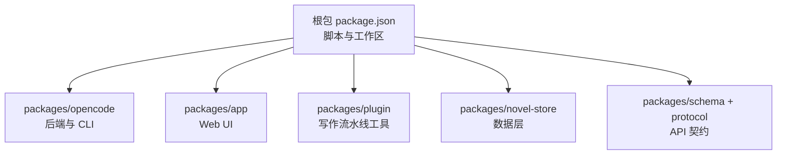
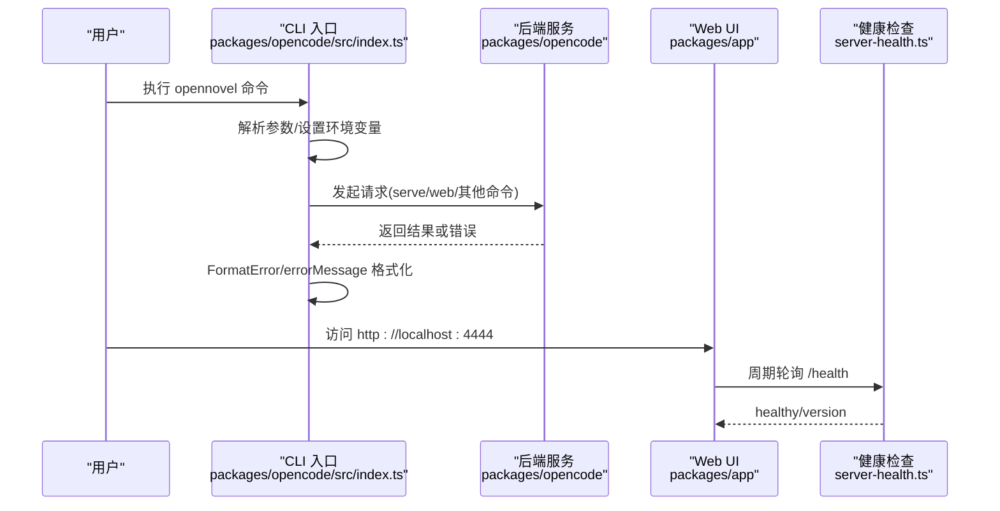
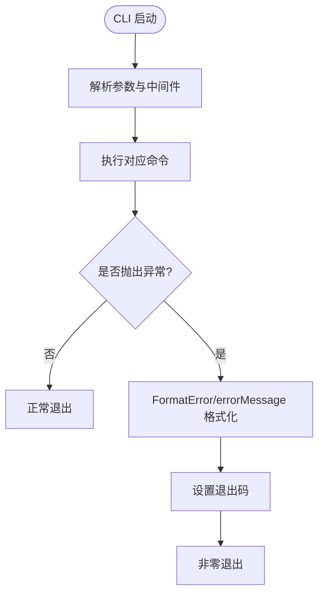
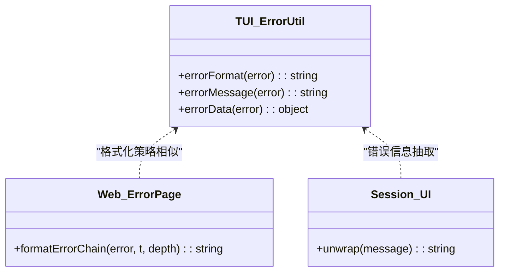
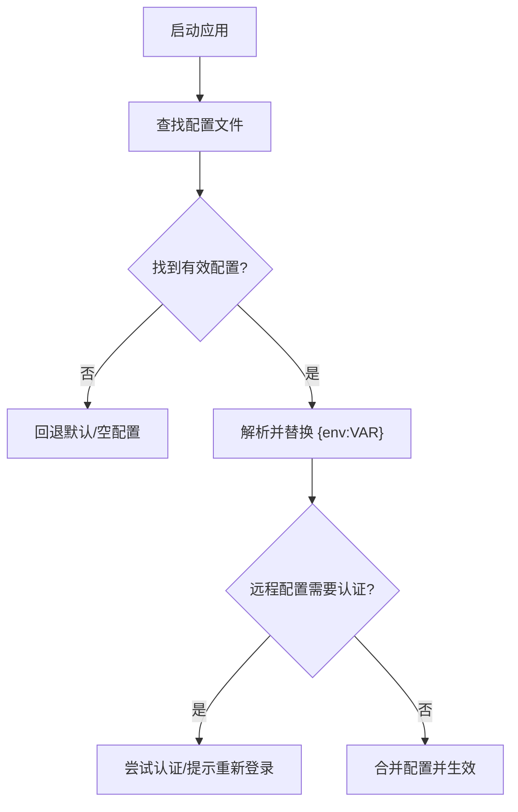
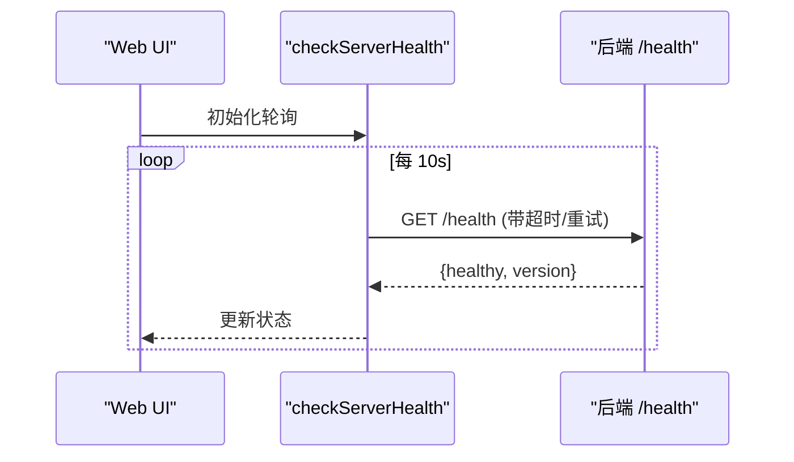
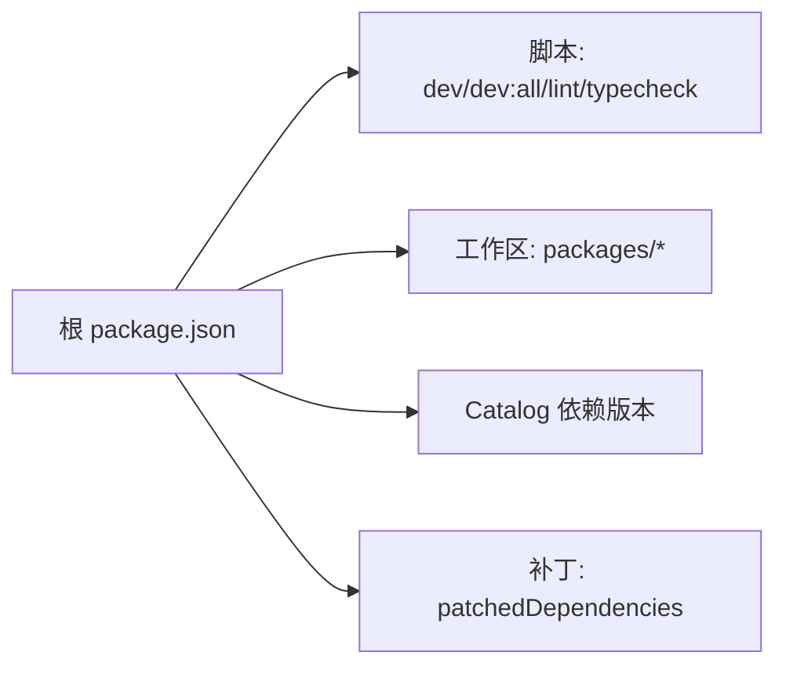

# 故障排除

<cite>
**本文引用的文件**   
- [README.md](file://README.md)
- [SECURITY.md](file://SECURITY.md)
- [package.json](file://package.json)
- [packages/opencode/src/index.ts](file://packages/opencode/src/index.ts)
- [packages/opencode/src/cli/error.ts](file://packages/opencode/src/cli/error.ts)
- [packages/tui/src/util/error.ts](file://packages/tui/src/util/error.ts)
- [packages/app/src/pages/error.tsx](file://packages/app/src/pages/error.tsx)
- [packages/session-ui/src/components/session-turn.tsx](file://packages/session-ui/src/components/session-turn.tsx)
- [packages/core/src/v1/config/formatter.ts](file://packages/core/src/v1/config/formatter.ts)
- [packages/web/src/content/docs/config.mdx](file://packages/web/src/content/docs/config.mdx)
- [packages/desktop/src/main/shell-env.ts](file://packages/desktop/src/main/shell-env.ts)
- [packages/consol e/core/migrations/20260420184535_aromatic_molten_man/migration.sql](file://packages/console/core/migrations/20260420184535_aromatic_molten_man/migration.sql)
- [packages/stats/core/src/database.ts](file://packages/stats/core/src/database.ts)
- [packages/stats/core/migrations/20260522121617_common_dust/snapshot.json](file://packages/stats/core/migrations/20260522121617_common_dust/snapshot.json)
- [packages/app/src/utils/server-health.ts](file://packages/app/src/utils/server-health.ts)
</cite>

## 目录
1. [简介](#简介)
2. [项目结构](#项目结构)
3. [核心组件](#核心组件)
4. [架构总览](#架构总览)
5. [详细组件分析](#详细组件分析)
6. [依赖关系分析](#依赖关系分析)
7. [性能注意事项](#性能注意事项)
8. [故障排除指南](#故障排除指南)
9. [结论](#结论)
10. [附录](#附录)

## 简介
本故障排除文档面向 openNovel 的安装、配置与运行阶段常见问题，提供系统化的定位与修复方法。内容涵盖：
- 常见安装问题（依赖、端口、Bun 环境）
- 配置问题（配置文件路径、环境变量、远程配置认证）
- 运行时错误（CLI 报错、Web UI 错误、会话错误）
- 性能瓶颈分析方法（内存、并发、数据库查询）
- 日志分析与诊断技巧
- 安全漏洞处理与应急响应流程
- 系统资源监控与健康检查
- 社区支持与问题报告渠道

## 项目结构
openNovel 为基于 Bun 的 monorepo，核心模块包括：
- packages/novel-store：小说数据层（书籍、章节、角色、审校记录）
- packages/schema + packages/protocol：前后端共享 API 契约
- packages/opencode：后端服务与 CLI
- packages/app：SolidJS Web UI（书架、工作区、审批流）
- packages/plugin：写作流水线工具（草稿、连续性审校、提交审校）

快速启动命令与端口说明见 README。

图表来源
- [package.json:1-162](file://package.json#L1-L162)
- [README.md:34-58](file://README.md#L34-L58)

章节来源
- [README.md:34-58](file://README.md#L34-L58)
- [package.json:1-162](file://package.json#L1-L162)

## 核心组件
- CLI 入口与全局选项：支持打印日志、设置日志级别、纯模式等；统一错误格式化与退出码管理
- 错误格式化与消息提取：CLI、TUI、Web UI 均具备错误格式化能力，支持链式 cause 与结构化错误对象
- 配置加载与环境变量：支持自定义配置文件路径、目录优先级、远程配置认证
- 健康检查：前端周期性轮询后端健康接口，支持超时与重试

章节来源
- [packages/opencode/src/index.ts:54-79](file://packages/opencode/src/index.ts#L54-L79)
- [packages/opencode/src/cli/error.ts:35-126](file://packages/opencode/src/cli/error.ts#L35-L126)
- [packages/tui/src/util/error.ts:97-145](file://packages/tui/src/util/error.ts#L97-L145)
- [packages/app/src/pages/error.tsx:167-212](file://packages/app/src/pages/error.tsx#L167-L212)
- [packages/web/src/content/docs/config.mdx:119-160](file://packages/web/src/content/docs/config.mdx#L119-L160)
- [packages/app/src/utils/server-health.ts:70-95](file://packages/app/src/utils/server-health.ts#L70-L95)

## 架构总览
下图展示了从 CLI 到后端服务、再到 Web UI 的关键调用路径与错误处理点。

图表来源
- [packages/opencode/src/index.ts:34-79](file://packages/opencode/src/index.ts#L34-L79)
- [packages/app/src/utils/server-health.ts:70-95](file://packages/app/src/utils/server-health.ts#L70-L95)

## 详细组件分析

### CLI 错误处理与日志
- 入口通过 yargs 注册命令与中间件，设置 OPENCODE_PRINT_LOGS、OPENCODE_LOG_LEVEL、OPENCODE_PURE 等环境变量
- fail 钩子处理未知参数、参数不足、非法值等场景，并输出帮助信息
- try/catch 捕获异常后使用 FormatError 与 errorMessage 进行格式化输出，确保进程退出码正确

图表来源
- [packages/opencode/src/index.ts:106-144](file://packages/opencode/src/index.ts#L106-L144)
- [packages/opencode/src/cli/error.ts:35-126](file://packages/opencode/src/cli/error.ts#L35-L126)

章节来源
- [packages/opencode/src/index.ts:54-79](file://packages/opencode/src/index.ts#L54-L79)
- [packages/opencode/src/index.ts:106-144](file://packages/opencode/src/index.ts#L106-L144)
- [packages/opencode/src/cli/error.ts:35-126](file://packages/opencode/src/cli/error.ts#L35-L126)

### TUI/Web 错误格式化
- TUI 的 errorFormat 与 errorMessage 支持 Error 实例、结构化对象、不可序列化对象的降级处理
- Web UI 的错误页面会递归拼接 cause 链，避免重复堆栈头，提升可读性
- Session UI 对 JSON 字符串中的错误信息进行抽取与展示

图表来源
- [packages/tui/src/util/error.ts:97-145](file://packages/tui/src/util/error.ts#L97-L145)
- [packages/app/src/pages/error.tsx:167-212](file://packages/app/src/pages/error.tsx#L167-L212)
- [packages/session-ui/src/components/session-turn.tsx:33-80](file://packages/session-ui/src/components/session-turn.tsx#L33-L80)

章节来源
- [packages/tui/src/util/error.ts:97-145](file://packages/tui/src/util/error.ts#L97-L145)
- [packages/app/src/pages/error.tsx:167-212](file://packages/app/src/pages/error.tsx#L167-L212)
- [packages/session-ui/src/components/session-turn.tsx:33-80](file://packages/session-ui/src/components/session-turn.tsx#L33-L80)

### 配置加载与环境变量
- 配置文件查找顺序：当前目录 → 最近 Git 目录 → 自定义路径 → 自定义目录 → 受管设置（最高优先级）
- 环境变量替换：支持在配置中使用 {env:VAR} 语法，保留原始占位符不污染文件
- 远程配置认证失败时给出明确提示与重新登录指引

图表来源
- [packages/web/src/content/docs/config.mdx:119-160](file://packages/web/src/content/docs/config.mdx#L119-L160)
- [packages/core/src/v1/config/formatter.ts:1-13](file://packages/core/src/v1/config/formatter.ts#L1-13)
- [packages/opencode/src/cli/error.ts:97-107](file://packages/opencode/src/cli/error.ts#L97-L107)

章节来源
- [packages/web/src/content/docs/config.mdx:119-160](file://packages/web/src/content/docs/config.mdx#L119-L160)
- [packages/core/src/v1/config/formatter.ts:1-13](file://packages/core/src/v1/config/formatter.ts#L1-13)
- [packages/opencode/src/cli/error.ts:97-107](file://packages/opencode/src/cli/error.ts#L97-L107)

### 健康检查与轮询
- 前端周期性调用 /health 接口，支持超时信号与指数退避重试
- 返回 healthy 与 version，用于界面状态展示与服务可用性判断

图表来源
- [packages/app/src/utils/server-health.ts:70-95](file://packages/app/src/utils/server-health.ts#L70-L95)

章节来源
- [packages/app/src/utils/server-health.ts:70-95](file://packages/app/src/utils/server-health.ts#L70-L95)

## 依赖关系分析
- 根 package.json 定义了 workspaces、scripts、catalog 依赖版本与 patchedDependencies
- 关键依赖包括 effect、hono、drizzle-orm、ai、solid-js、vite 等
- 通过 catalog 统一管理依赖版本，便于升级与一致性

图表来源
- [package.json:1-162](file://package.json#L1-L162)

章节来源
- [package.json:1-162](file://package.json#L1-L162)

## 性能注意事项
- 内存优化
  - 使用 Heap.start() 开启堆快照采集，结合 heap-snapshot-toolkit 分析内存泄漏
  - 减少大对象频繁创建与循环引用，注意错误对象链的深度控制
- 并发处理
  - 合理限制 LLM 调用并发，避免上游限流与排队
  - 使用 Promise.allSettled 聚合异步任务，避免单点阻塞
- 数据库查询优化
  - 统计服务使用 Drizzle ORM 与 PlanetScale，关注慢查询与索引
  - 迁移脚本中涉及字段与索引变更需评估影响范围

章节来源
- [packages/opencode/src/index.ts:74](file://packages/opencode/src/index.ts#L74)
- [packages/stats/core/src/database.ts:1-32](file://packages/stats/core/src/database.ts#L1-32)
- [packages/stats/core/migrations/20260522121617_common_dust/snapshot.json:321-378](file://packages/stats/core/migrations/20260522121617_common_dust/snapshot.json#L321-L378)

## 故障排除指南

### 安装问题
- 未安装 Bun 或版本不匹配
  - 现象：bun install 或 dev 脚本失败
  - 解决：安装指定版本的 Bun，参考根 package.json 的 packageManager
- 端口占用
  - 现象：后端 4096、Web UI 4444 端口无法启动
  - 解决：修改端口或释放占用端口
- 依赖安装失败
  - 现象：某些原生模块编译失败
  - 解决：查看 trustedDependencies 与 patches，确保构建环境满足要求

章节来源
- [package.json:1-162](file://package.json#L1-L162)
- [README.md:34-58](file://README.md#L34-L58)

### 配置问题
- 配置文件路径不正确
  - 现象：应用未读取到期望的配置
  - 解决：确认当前目录、Git 目录、自定义路径与目录优先级
- 环境变量替换无效
  - 现象：{env:VAR} 未被替换
  - 解决：确保环境变量已设置且名称一致
- 远程配置认证失败
  - 现象：加载远程配置返回登录页而非 JSON
  - 解决：按提示重新认证或检查代理/SSO 配置

章节来源
- [packages/web/src/content/docs/config.mdx:119-160](file://packages/web/src/content/docs/config.mdx#L119-L160)
- [packages/opencode/src/cli/error.ts:97-107](file://packages/opencode/src/cli/error.ts#L97-L107)

### 运行时错误
- CLI 报错
  - 现象：Unknown argument、Not enough non-option arguments、Invalid values
  - 解决：根据帮助信息修正参数或使用 --help
- 模型未找到或 Provider 初始化失败
  - 现象：ProviderModelNotFoundError、ProviderInitError
  - 解决：检查 opennovel.json 中 provider/model 名称与凭据
- Web UI 错误
  - 现象：页面显示错误堆栈或“未知错误”
  - 解决：查看浏览器控制台与网络请求，定位具体错误链

章节来源
- [packages/opencode/src/index.ts:106-144](file://packages/opencode/src/index.ts#L106-L144)
- [packages/opencode/src/cli/error.ts:58-89](file://packages/opencode/src/cli/error.ts#L58-L89)
- [packages/app/src/pages/error.tsx:167-212](file://packages/app/src/pages/error.tsx#L167-L212)

### 日志分析与诊断技巧
- 启用日志输出
  - 使用 --print-logs 将日志输出到 stderr
  - 设置 --log-level 调整日志级别（DEBUG/INFO/WARN/ERROR）
- 错误格式化
  - CLI/TUI/Web 均提供错误格式化，支持 cause 链与结构化对象
- Shell 环境变量
  - Desktop 环境下可探测 shell 登录环境变量，必要时回退到应用环境变量

章节来源
- [packages/opencode/src/index.ts:54-79](file://packages/opencode/src/index.ts#L54-L79)
- [packages/tui/src/util/error.ts:97-145](file://packages/tui/src/util/error.ts#L97-L145)
- [packages/desktop/src/main/shell-env.ts:86-101](file://packages/desktop/src/main/shell-env.ts#L86-L101)

### 安全漏洞处理与应急响应
- 威胁模型
  - 无沙箱：权限系统仅为 UX 提示，不提供隔离
  - 服务器模式：可选启用，必须设置 OPENNOVEL_SERVER_PASSWORD 以启用 HTTP Basic Auth
  - 外部依赖：LLM 提供商与 MCP 服务器行为不在信任边界内
- 报告流程
  - 通过 GitHub Security Advisory 提交漏洞报告
  - 团队响应后会告知后续步骤与修复进度

章节来源
- [SECURITY.md:1-44](file://SECURITY.md#L1-L44)

### 系统资源监控与健康检查
- 健康检查
  - 前端周期性轮询 /health，返回 healthy 与 version
  - 支持超时与重试机制，避免误判
- 统计与指标
  - stats 服务存储 p50/p95 延迟、TTFB 等指标，可用于性能趋势分析

章节来源
- [packages/app/src/utils/server-health.ts:70-95](file://packages/app/src/utils/server-health.ts#L70-L95)
- [packages/stats/core/migrations/20260522121617_common_dust/snapshot.json:321-378](file://packages/stats/core/migrations/20260522121617_common_dust/snapshot.json#L321-L378)

### 社区支持与问题报告指南
- 使用 GitHub Issues 报告问题
- 安全问题通过 Security Advisory 提交
- 参与讨论与贡献请参考 CONTRIBUTING 与仓库说明

章节来源
- [SECURITY.md:37-44](file://SECURITY.md#L37-L44)

## 结论
通过系统化的错误格式化、配置加载策略与健康检查机制，openNovel 提供了良好的可观测性与可维护性。建议在生产环境中：
- 严格配置环境变量与远程认证
- 启用日志输出与合适的日志级别
- 定期分析性能指标与健康状态
- 遵循安全最佳实践与漏洞报告流程

## 附录
- 常用命令
  - bun run dev:all：同时启动后端与 Web UI
  - opennovel --help：查看帮助
  - opennovel models：列出可用模型
- 相关脚本与依赖
  - 根 package.json 中的 scripts 与 catalog 依赖版本

章节来源
- [README.md:34-58](file://README.md#L34-L58)
- [package.json:1-162](file://package.json#L1-L162)