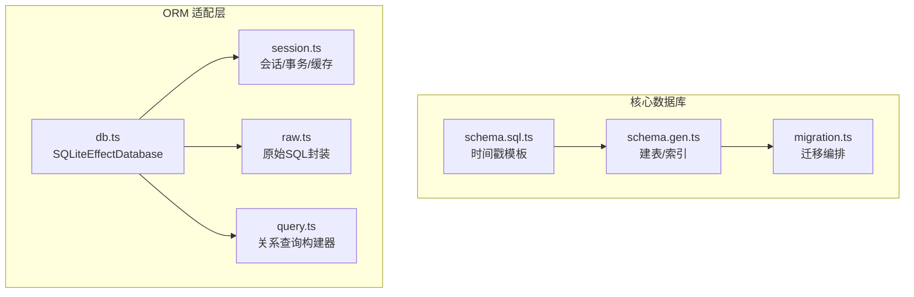
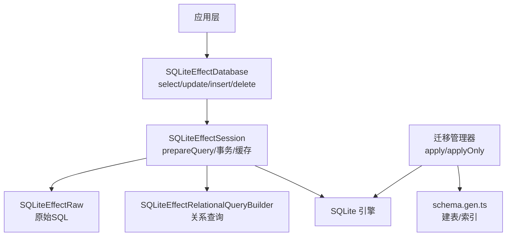
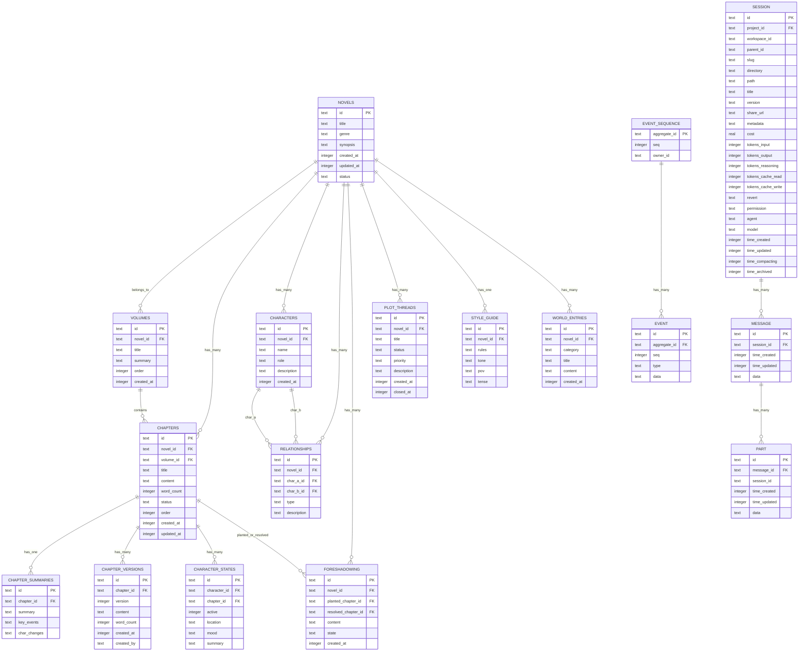
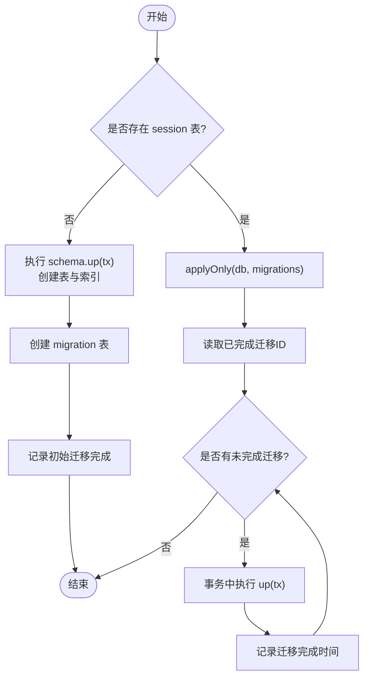
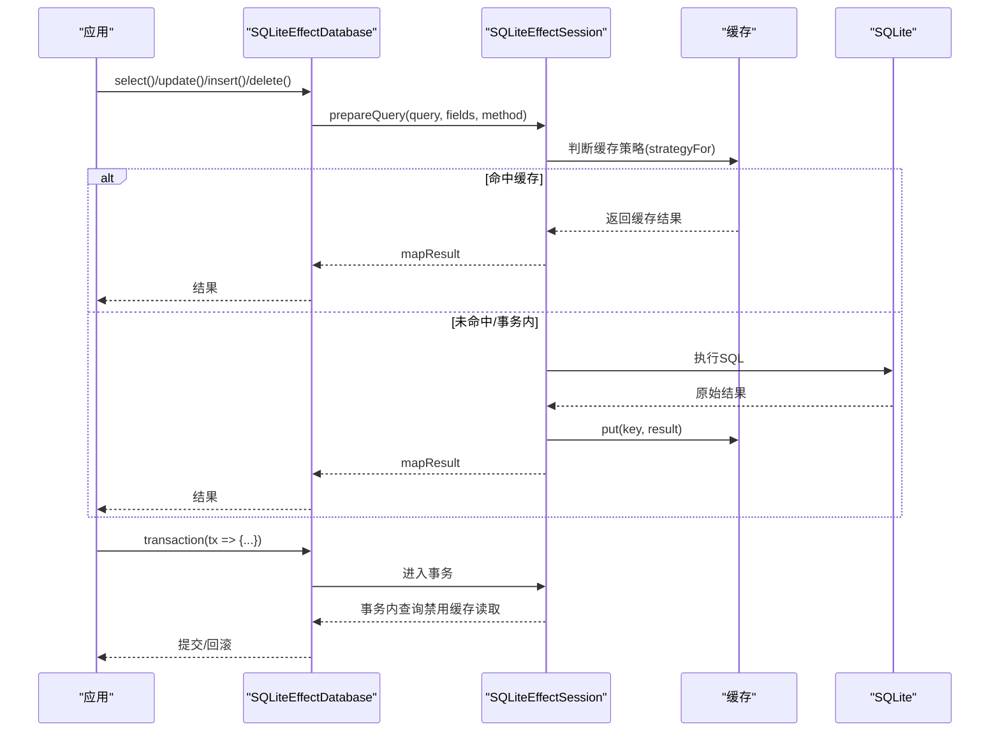
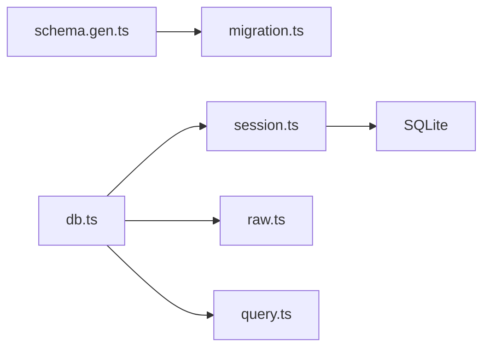

# 数据库架构设计

<cite>
**本文引用的文件**   
- [packages/core/src/database/schema.gen.ts](file://packages/core/src/database/schema.gen.ts)
- [packages/core/src/database/migration.ts](file://packages/core/src/database/migration.ts)
- [packages/core/src/database/schema.sql.ts](file://packages/core/src/database/schema.sql.ts)
- [packages/effect-drizzle-sqlite/src/sqlite-core/effect/db.ts](file://packages/effect-drizzle-sqlite/src/sqlite-core/effect/db.ts)
- [packages/effect-drizzle-sqlite/src/sqlite-core/effect/session.ts](file://packages/effect-drizzle-sqlite/src/sqlite-core/effect/session.ts)
- [packages/effect-drizzle-sqlite/src/sqlite-core/effect/raw.ts](file://packages/effect-drizzle-sqlite/src/sqlite-core/effect/raw.ts)
- [packages/effect-drizzle-sqlite/src/sqlite-core/effect/query.ts](file://packages/effect-drizzle-sqlite/src/sqlite-core/effect/query.ts)
- [specs/storage/effect-sqlite-package.md](file://specs/storage/effect-sqlite-package.md)
</cite>

## 目录
1. [简介](#简介)
2. [项目结构](#项目结构)
3. [核心组件](#核心组件)
4. [架构总览](#架构总览)
5. [详细组件分析](#详细组件分析)
6. [依赖关系分析](#依赖关系分析)
7. [性能考量](#性能考量)
8. [故障排查指南](#故障排查指南)
9. [结论](#结论)
10. [附录](#附录)

## 简介
本文件为 openNovel 的数据库架构文档，聚焦 SQLite 表结构设计、Drizzle ORM 使用模式与查询优化、迁移机制与版本管理、表关系图与数据流向、连接管理与会话处理、以及备份恢复策略。内容基于仓库中的迁移脚本、ORM 适配层与 Effect 集成实现进行系统化梳理，帮助读者从高层到代码级全面理解 openNovel 的数据层设计与实践。

## 项目结构
openNovel 的数据库相关能力主要分布在以下位置：
- 迁移与表结构定义：packages/core/src/database/schema.gen.ts（SQL 建表与索引）、packages/core/src/database/migration.ts（迁移编排与执行）、packages/core/src/database/schema.sql.ts（时间戳字段模板）
- Drizzle + Effect + SQLite 适配层：packages/effect-drizzle-sqlite/src/sqlite-core/effect/*（数据库对象、会话、事务、原始 SQL、关系查询构建器）
- 规范说明：specs/storage/effect-sqlite-package.md（Effect Drizzle SQLite 包的目标与对外契约）

图表来源 
- [packages/core/src/database/schema.gen.ts:1-487](file://packages/core/src/database/schema.gen.ts#L1-L487)
- [packages/core/src/database/migration.ts:1-82](file://packages/core/src/database/migration.ts#L1-L82)
- [packages/core/src/database/schema.sql.ts:1-11](file://packages/core/src/database/schema.sql.ts#L1-L11)
- [packages/effect-drizzle-sqlite/src/sqlite-core/effect/db.ts:1-297](file://packages/effect-drizzle-sqlite/src/sqlite-core/effect/db.ts#L1-L297)
- [packages/effect-drizzle-sqlite/src/sqlite-core/effect/session.ts:1-491](file://packages/effect-drizzle-sqlite/src/sqlite-core/effect/session.ts#L1-L491)
- [packages/effect-drizzle-sqlite/src/sqlite-core/effect/raw.ts:1-49](file://packages/effect-drizzle-sqlite/src/sqlite-core/effect/raw.ts#L1-L49)
- [packages/effect-drizzle-sqlite/src/sqlite-core/effect/query.ts:1-36](file://packages/effect-drizzle-sqlite/src/sqlite-core/effect/query.ts#L1-L36)

章节来源
- [packages/core/src/database/schema.gen.ts:1-487](file://packages/core/src/database/schema.gen.ts#L1-L487)
- [packages/core/src/database/migration.ts:1-82](file://packages/core/src/database/migration.ts#L1-L82)
- [packages/core/src/database/schema.sql.ts:1-11](file://packages/core/src/database/schema.sql.ts#L1-L11)
- [packages/effect-drizzle-sqlite/src/sqlite-core/effect/db.ts:1-297](file://packages/effect-drizzle-sqlite/src/sqlite-core/effect/db.ts#L1-L297)
- [packages/effect-drizzle-sqlite/src/sqlite-core/effect/session.ts:1-491](file://packages/effect-drizzle-sqlite/src/sqlite-core/effect/session.ts#L1-L491)
- [specs/storage/effect-sqlite-package.md:1-90](file://specs/storage/effect-sqlite-package.md#L1-L90)

## 核心组件
- 表结构与索引（schema.gen.ts）
  - 定义了小说、章节、卷、角色、伏笔、情节线、风格指南、世界条目等核心实体，以及会话、消息、输入、分享、待办等运行时数据。
  - 通过外键约束保证引用完整性，如 chapters.novel_id → novels.id，message.session_id → session.id 等。
  - 大量复合索引用于加速按 novel_id、session_id、time_created、status、type 等常见过滤与排序场景。
- 迁移系统（migration.ts）
  - 应用时检测数据库是否已有 session 表以区分全新初始化与增量升级。
  - 首次初始化会执行 schema.up(tx) 创建所有表与索引，并记录 migration 表；后续仅对未完成的迁移逐一在事务中执行。
  - 兼容旧版 Drizzle 迁移日志表 __drizzle_migrations，自动回填到新迁移表。
- 时间戳模板（schema.sql.ts）
  - 提供 time_created/time_updated 的默认值与更新钩子，确保审计字段一致性。
- ORM 适配层（effect-drizzle-sqlite）
  - SQLiteEffectDatabase：提供 select/update/insert/delete/run/all/get/values/transaction 等方法，统一 Effect 化。
  - SQLiteEffectSession：准备查询、结果映射、缓存策略、事务边界。
  - SQLiteEffectRaw：原始 SQL 的 Effect 封装。
  - SQLiteEffectRelationalQueryBuilder：关系查询构建器，支持 with 子查询与复杂关联。

章节来源
- [packages/core/src/database/schema.gen.ts:1-487](file://packages/core/src/database/schema.gen.ts#L1-L487)
- [packages/core/src/database/migration.ts:1-82](file://packages/core/src/database/migration.ts#L1-L82)
- [packages/core/src/database/schema.sql.ts:1-11](file://packages/core/src/database/schema.sql.ts#L1-L11)
- [packages/effect-drizzle-sqlite/src/sqlite-core/effect/db.ts:1-297](file://packages/effect-drizzle-sqlite/src/sqlite-core/effect/db.ts#L1-L297)
- [packages/effect-drizzle-sqlite/src/sqlite-core/effect/session.ts:1-491](file://packages/effect-drizzle-sqlite/src/sqlite-core/effect/session.ts#L1-L491)
- [packages/effect-drizzle-sqlite/src/sqlite-core/effect/raw.ts:1-49](file://packages/effect-drizzle-sqlite/src/sqlite-core/effect/raw.ts#L1-L49)
- [packages/effect-drizzle-sqlite/src/sqlite-core/effect/query.ts:1-36](file://packages/effect-drizzle-sqlite/src/sqlite-core/effect/query.ts#L1-L36)

## 架构总览
下图展示 openNovel 数据层的整体架构：上层业务通过 Effect 化的 Drizzle 接口访问 SQLite，迁移系统在启动时保障数据库状态一致，ORM 层负责查询构建、结果映射与缓存。

图表来源 
- [packages/effect-drizzle-sqlite/src/sqlite-core/effect/db.ts:1-297](file://packages/effect-drizzle-sqlite/src/sqlite-core/effect/db.ts#L1-L297)
- [packages/effect-drizzle-sqlite/src/sqlite-core/effect/session.ts:1-491](file://packages/effect-drizzle-sqlite/src/sqlite-core/effect/session.ts#L1-L491)
- [packages/effect-drizzle-sqlite/src/sqlite-core/effect/raw.ts:1-49](file://packages/effect-drizzle-sqlite/src/sqlite-core/effect/raw.ts#L1-L49)
- [packages/effect-drizzle-sqlite/src/sqlite-core/effect/query.ts:1-36](file://packages/effect-drizzle-sqlite/src/sqlite-core/effect/query.ts#L1-L36)
- [packages/core/src/database/migration.ts:1-82](file://packages/core/src/database/migration.ts#L1-L82)
- [packages/core/src/database/schema.gen.ts:1-487](file://packages/core/src/database/schema.gen.ts#L1-L487)

## 详细组件分析

### 表结构与关系图
- 主实体
  - novels：小说主表，包含标题、类型、简介、状态与时间戳。
  - volumes：卷，属于某部小说，有序号与摘要。
  - chapters：章节，属于某部小说与某卷，含内容与字数、状态、顺序。
  - characters：角色，属于某部小说，含名称、角色定位与描述。
  - relationships：角色关系，双向关联两个角色，归属某部小说。
  - foreshadowing：伏笔，关联小说与章节（埋设/解决）。
  - plot_threads：情节线，归属小说，含状态、优先级与描述。
  - style_guide：风格指南，归属小说，含规则、语气、视角与时态。
  - world_entries：世界条目，归属小说，含分类、标题与内容。
- 运行时数据
  - session：会话，归属项目，含元数据、成本与 token 统计。
  - message：消息，归属会话，含时间与数据。
  - part：消息片段，归属消息。
  - session_input：会话输入，含投递序列与确认序列。
  - session_message：会话消息，有序列与类型。
  - session_share：会话分享，含密钥与 URL。
  - todo：待办，归属会话，有序位与优先级。
  - chapter_summaries/chapter_versions：章节摘要与版本历史。
  - character_states：角色状态，关联角色与章节。
  - novel_state_log：小说状态日志，记录事实变更。
  - event_sequence/event：事件溯源聚合与事件。
  - project/workspace/account/permission/credential/control_account：项目与工作区、账户与权限等基础设施表。
- 关键外键与约束
  - 多数实体通过 novel_id 或 session_id 建立强引用，删除行为多为 CASCADE 或 SET NULL。
  - 复合主键用于多对多或有序集合，如 project_directory(project_id, directory)、todo(session_id, position)。
- 索引设计
  - 针对高频过滤与排序字段建立单列或复合索引，例如：
    - chapters(novel_id, order) 用于按小说顺序分页。
    - session_message(session_id, type, seq) 用于按会话与类型快速检索。
    - message(session_id, time_created, id) 用于会话消息列表加载。
    - foreshadowing(state) 用于筛选未解决的伏笔。
    - novel_state_log(novel_id, fact_type) 用于按事实类型回放。

图表来源 
- [packages/core/src/database/schema.gen.ts:1-487](file://packages/core/src/database/schema.gen.ts#L1-L487)

章节来源
- [packages/core/src/database/schema.gen.ts:1-487](file://packages/core/src/database/schema.gen.ts#L1-L487)

### Drizzle ORM 使用模式与查询优化
- 使用模式
  - 通过 SQLiteEffectDatabase 暴露 select/update/insert/delete 与 raw 方法，全部返回 Effect，便于组合与错误处理。
  - 关系查询通过 query.<table> 构建器与 with() 子查询组合，避免 N+1 问题。
  - 事务通过 db.transaction(tx => ...) 包裹，内部嵌套 use 仍可见当前事务上下文。
- 查询优化
  - 优先使用带索引的字段作为过滤条件，如 novel_id、session_id、time_created、status、type。
  - 利用复合索引减少回表，例如 chapters(novel_id, order)、session_message(session_id, type, seq)。
  - 使用 values/get 获取轻量结果，避免全量行映射开销。
  - 合理选择 distinct 与 join 深度，必要时拆分查询再合并。
  - 启用 Drizzle 缓存策略（strategyFor），在事务内跳过缓存读取以避免脏读。

章节来源
- [packages/effect-drizzle-sqlite/src/sqlite-core/effect/db.ts:1-297](file://packages/effect-drizzle-sqlite/src/sqlite-core/effect/db.ts#L1-L297)
- [packages/effect-drizzle-sqlite/src/sqlite-core/effect/session.ts:1-491](file://packages/effect-drizzle-sqlite/src/sqlite-core/effect/session.ts#L1-L491)
- [packages/effect-drizzle-sqlite/src/sqlite-core/effect/query.ts:1-36](file://packages/effect-drizzle-sqlite/src/sqlite-core/effect/query.ts#L1-L36)

### 迁移机制与版本管理
- 初始化流程
  - 检测是否存在 session 表：若存在则视为已安装，走增量迁移；否则执行 schema.up(tx) 创建所有表与索引，并写入 migration 表。
  - 兼容旧版 __drizzle_migrations 表，自动回填新迁移表，避免重复执行。
- 增量迁移
  - 读取已完成迁移 ID 集合，逐个执行未完成的 up(tx)，并在事务中记录完成时间。
  - 使用 Semaphore 保证并发安全，避免重复迁移。
- 版本策略
  - 每个迁移具备唯一 id，按顺序执行，失败即回滚。
  - 建议将表结构变更与数据修复拆分为独立迁移，便于回滚与审计。

图表来源 
- [packages/core/src/database/migration.ts:1-82](file://packages/core/src/database/migration.ts#L1-L82)
- [packages/core/src/database/schema.gen.ts:1-487](file://packages/core/src/database/schema.gen.ts#L1-L487)

章节来源
- [packages/core/src/database/migration.ts:1-82](file://packages/core/src/database/migration.ts#L1-L82)

### 数据库连接管理与会话处理
- 连接与数据库对象
  - SQLiteEffectDatabase 持有 dialect 与 session，提供统一的 CRUD 与 raw 接口。
  - withReplicas 可将读操作路由到副本，写操作始终走主库，提升读吞吐。
- 会话与事务
  - SQLiteEffectSession 负责 prepareQuery、结果映射、缓存策略与事务边界。
  - 事务内查询可禁用缓存读取，避免不一致；事务提交后由缓存 onMutate 失效。
- 原始 SQL
  - SQLiteEffectRaw 封装 run/all/get/values，保持与 ORM 一致的 Effect 语义。

图表来源 
- [packages/effect-drizzle-sqlite/src/sqlite-core/effect/db.ts:1-297](file://packages/effect-drizzle-sqlite/src/sqlite-core/effect/db.ts#L1-L297)
- [packages/effect-drizzle-sqlite/src/sqlite-core/effect/session.ts:1-491](file://packages/effect-drizzle-sqlite/src/sqlite-core/effect/session.ts#L1-L491)
- [packages/effect-drizzle-sqlite/src/sqlite-core/effect/raw.ts:1-49](file://packages/effect-drizzle-sqlite/src/sqlite-core/effect/raw.ts#L1-L49)

章节来源
- [packages/effect-drizzle-sqlite/src/sqlite-core/effect/db.ts:1-297](file://packages/effect-drizzle-sqlite/src/sqlite-core/effect/db.ts#L1-L297)
- [packages/effect-drizzle-sqlite/src/sqlite-core/effect/session.ts:1-491](file://packages/effect-drizzle-sqlite/src/sqlite-core/effect/session.ts#L1-L491)
- [packages/effect-drizzle-sqlite/src/sqlite-core/effect/raw.ts:1-49](file://packages/effect-drizzle-sqlite/src/sqlite-core/effect/raw.ts#L1-L49)

### 数据流向说明
- 写入路径
  - 应用调用 insert/update/delete，经 SQLiteEffectDatabase -> SQLiteEffectSession -> SQLite 执行，事务完成后触发缓存失效。
- 读取路径
  - 应用调用 select/get/all，经 Session 的缓存策略决定是否直接返回缓存或查询 SQLite，再映射结果返回。
- 迁移路径
  - 启动时 apply/applyOnly 检查现有表与迁移记录，按需执行 schema.up(tx) 与迁移脚本，确保数据库状态与代码一致。

章节来源
- [packages/effect-drizzle-sqlite/src/sqlite-core/effect/session.ts:1-491](file://packages/effect-drizzle-sqlite/src/sqlite-core/effect/session.ts#L1-L491)
- [packages/core/src/database/migration.ts:1-82](file://packages/core/src/database/migration.ts#L1-L82)

## 依赖关系分析
- 模块耦合
  - schema.gen.ts 被 migration.ts 引用，用于初始化建表与索引。
  - effect-drizzle-sqlite 的 db/session/raw/query 相互依赖，形成完整的 ORM 适配层。
- 外部依赖
  - Drizzle ORM 的类型与构建器，Effect 的错误与并发原语（Semaphore）。
  - SQLite 驱动通过 Effect SQL 客户端接入。
- 潜在循环依赖
  - 各模块职责清晰，未见循环导入；迁移与 ORM 层解耦良好。

图表来源 
- [packages/core/src/database/schema.gen.ts:1-487](file://packages/core/src/database/schema.gen.ts#L1-L487)
- [packages/core/src/database/migration.ts:1-82](file://packages/core/src/database/migration.ts#L1-L82)
- [packages/effect-drizzle-sqlite/src/sqlite-core/effect/db.ts:1-297](file://packages/effect-drizzle-sqlite/src/sqlite-core/effect/db.ts#L1-L297)
- [packages/effect-drizzle-sqlite/src/sqlite-core/effect/session.ts:1-491](file://packages/effect-drizzle-sqlite/src/sqlite-core/effect/session.ts#L1-L491)
- [packages/effect-drizzle-sqlite/src/sqlite-core/effect/raw.ts:1-49](file://packages/effect-drizzle-sqlite/src/sqlite-core/effect/raw.ts#L1-L49)
- [packages/effect-drizzle-sqlite/src/sqlite-core/effect/query.ts:1-36](file://packages/effect-drizzle-sqlite/src/sqlite-core/effect/query.ts#L1-L36)

章节来源
- [packages/core/src/database/schema.gen.ts:1-487](file://packages/core/src/database/schema.gen.ts#L1-L487)
- [packages/core/src/database/migration.ts:1-82](file://packages/core/src/database/migration.ts#L1-L82)
- [packages/effect-drizzle-sqlite/src/sqlite-core/effect/db.ts:1-297](file://packages/effect-drizzle-sqlite/src/sqlite-core/effect/db.ts#L1-L297)
- [packages/effect-drizzle-sqlite/src/sqlite-core/effect/session.ts:1-491](file://packages/effect-drizzle-sqlite/src/sqlite-core/effect/session.ts#L1-L491)
- [packages/effect-drizzle-sqlite/src/sqlite-core/effect/raw.ts:1-49](file://packages/effect-drizzle-sqlite/src/sqlite-core/effect/raw.ts#L1-L49)
- [packages/effect-drizzle-sqlite/src/sqlite-core/effect/query.ts:1-36](file://packages/effect-drizzle-sqlite/src/sqlite-core/effect/query.ts#L1-L36)

## 性能考量
- 索引设计
  - 针对高频过滤与排序字段建立复合索引，如 chapters(novel_id, order)、session_message(session_id, type, seq)、message(session_id, time_created, id)。
  - 对枚举类字段（status、state、type）建立单列索引以加速筛选。
- 查询优化
  - 使用 values/get 获取轻量结果，避免不必要的列映射。
  - 合理使用 with() 子查询与关系查询构建器，减少 N+1 查询。
  - 在事务内禁用缓存读取，避免脏读；提交后再刷新缓存。
- 缓存策略
  - 通过 strategyFor 决定 skip/invalidate/try 策略，结合 autoInvalidate 与 tables 粒度控制失效范围。
- 连接与副本
  - 使用 withReplicas 将读操作路由到副本，写操作走主库，提升读吞吐与可用性。

[本节为通用指导，不直接分析具体文件]

## 故障排查指南
- 迁移失败
  - 检查 migration 表是否已记录迁移 ID，确认事务是否回滚。
  - 查看 __drizzle_migrations 兼容性逻辑是否正确回填。
- 查询异常
  - 检查索引是否覆盖查询条件，必要时添加复合索引。
  - 确认事务内缓存策略是否导致不一致。
- 连接问题
  - 确认 Effect SQL 客户端配置与 SQLite 驱动可用。
  - 使用 withReplicas 时检查副本连接健康。

章节来源
- [packages/core/src/database/migration.ts:1-82](file://packages/core/src/database/migration.ts#L1-L82)
- [packages/effect-drizzle-sqlite/src/sqlite-core/effect/session.ts:1-491](file://packages/effect-drizzle-sqlite/src/sqlite-core/effect/session.ts#L1-L491)

## 结论
openNovel 的数据库架构以 SQLite 为基础，通过 Drizzle ORM 与 Effect 集成实现类型安全、可组合的查询与事务模型。迁移系统确保数据库状态与代码同步，索引与缓存策略保障性能。建议在新增表与查询时遵循现有索引模式与 ORM 使用规范，持续优化查询路径与缓存粒度。

[本节为总结性内容，不直接分析具体文件]

## 附录
- 备份与恢复策略
  - 定期导出 SQLite 文件或使用 .dump 生成 SQL 快照，保留迁移记录以便重建。
  - 恢复时先校验迁移表与 schema 一致性，再导入数据。
  - 对于高可用场景，考虑主从复制与只读副本，配合 withReplicas 提升读性能。

[本节为通用指导，不直接分析具体文件]