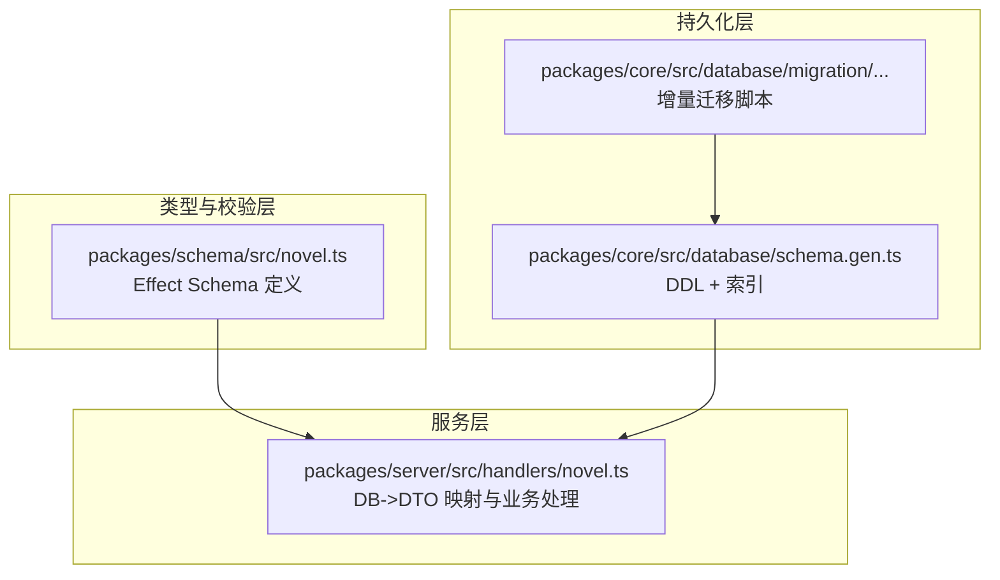
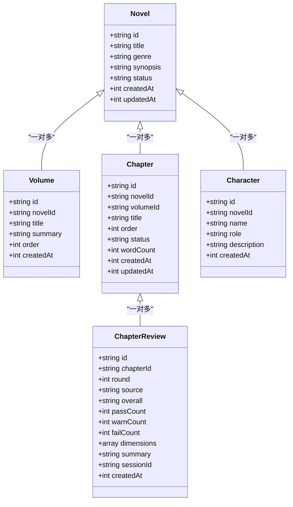
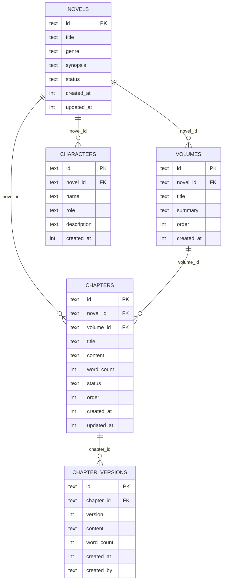

# 数据模型设计

<cite>
**本文引用的文件**   
- [packages/schema/src/novel.ts](file://packages/schema/src/novel.ts)
- [packages/core/src/database/schema.gen.ts](file://packages/core/src/database/schema.gen.ts)
- [packages/core/src/database/migration/20260721152252_novel_writing_tables.ts](file://packages/core/src/database/migration/20260721152252_novel_writing_tables.ts)
- [packages/server/src/handlers/novel.ts](file://packages/server/src/handlers/novel.ts)
- [packages/plugin/test/novel-writer/e2e.test.ts](file://packages/plugin/test/novel-writer/e2e.test.ts)
</cite>

## 目录
1. [简介](#简介)
2. [项目结构](#项目结构)
3. [核心组件](#核心组件)
4. [架构总览](#架构总览)
5. [详细组件分析](#详细组件分析)
6. [依赖关系分析](#依赖关系分析)
7. [性能考量](#性能考量)
8. [故障排查指南](#故障排查指南)
9. [结论](#结论)
10. [附录](#附录)

## 简介
本文件面向 openNovel 的数据模型，系统性梳理小说（Novel）、章节（Chapter）、角色（Character）、卷（Volume）、审查记录（Review）等核心实体的字段定义、数据类型与业务规则；解释实体间的关系映射、主外键约束与索引设计；说明数据库迁移策略与版本管理；总结 Drizzle ORM 的使用模式与查询优化技巧；给出数据验证规则与业务约束的详细说明；并提供数据库架构图表、示例数据以及数据生命周期管理与归档策略建议。

## 项目结构
openNovel 的数据模型由三部分协同构成：
- 类型与校验层：使用 Effect Schema 定义领域模型与输入输出校验，保证数据结构与取值范围的一致性。
- 持久化层：通过 SQL 迁移脚本与生成型 schema 描述数据库表结构、外键与索引。
- 服务层：服务端处理器将数据库行映射为 DTO，并承载业务逻辑与校验。

图表来源
- [packages/schema/src/novel.ts](file://packages/schema/src/novel.ts)
- [packages/core/src/database/schema.gen.ts](file://packages/core/src/database/schema.gen.ts)
- [packages/core/src/database/migration/20260721152252_novel_writing_tables.ts](file://packages/core/src/database/migration/20260721152252_novel_writing_tables.ts)
- [packages/server/src/handlers/novel.ts](file://packages/server/src/handlers/novel.ts)

章节来源
- [packages/schema/src/novel.ts](file://packages/schema/src/novel.ts)
- [packages/core/src/database/schema.gen.ts](file://packages/core/src/database/schema.gen.ts)
- [packages/core/src/database/migration/20260721152252_novel_writing_tables.ts](file://packages/core/src/database/migration/20260721152252_novel_writing_tables.ts)
- [packages/server/src/handlers/novel.ts](file://packages/server/src/handlers/novel.ts)

## 核心组件
- Novel（小说）
  - 字段：id、title、genre、synopsis、status、createdAt、updatedAt
  - 类型：字符串、枚举（题材）、文本、时间戳整数
  - 业务规则：题材限定于固定集合；状态用于区分草稿/发布等阶段；时间戳用于审计与排序
- Volume（卷）
  - 字段：id、novelId、title、summary、order、createdAt
  - 类型：字符串、整序数、文本、时间戳
  - 业务规则：属于某部小说；order 决定卷顺序；删除小说时级联删除
- Chapter（章节）
  - 字段：id、novelId、volumeId、title、order、status、wordCount、createdAt、updatedAt
  - 类型：字符串、可选卷ID、整序数、状态、字数、时间戳
  - 业务规则：可归属卷；按 order 排序；字数统计用于概览；删除小说时级联删除
- Character（角色）
  - 字段：id、novelId、name、role、description、createdAt
  - 类型：字符串、时间戳
  - 业务规则：属于某部小说；角色名唯一性建议在应用层或索引层保障
- Review（审查记录）
  - 字段：id、chapterId、round、source、overall、passCount、warnCount、failCount、dimensions、summary、sessionId、createdAt
  - 类型：字符串、正整数轮次、来源枚举、总体结果枚举、计数、维度数组、会话ID、时间戳
  - 业务规则：针对章节的多轮审查；支持确定性/审核员/人工来源；维度明细包含状态与证据

章节来源
- [packages/schema/src/novel.ts](file://packages/schema/src/novel.ts)
- [packages/server/src/handlers/novel.ts](file://packages/server/src/handlers/novel.ts)

## 架构总览
下图展示从类型校验到持久化的整体数据流与关键对象关系。

图表来源
- [packages/schema/src/novel.ts](file://packages/schema/src/novel.ts)
- [packages/core/src/database/schema.gen.ts](file://packages/core/src/database/schema.gen.ts)

## 详细组件分析

### Novel（小说）
- 字段与类型
  - id: 字符串主键
  - title: 标题
  - genre: 题材（枚举）
  - synopsis: 简介
  - status: 状态（如 draft）
  - createdAt/updatedAt: 创建/更新时间戳
- 业务规则
  - 题材限制在固定集合内
  - 状态机可由上层控制（如草稿、进行中、已发布）
- 关联
  - 被 Volume、Chapter、Character、PlotThread、Foreshadowing、WorldEntry、StyleGuide、SessionNovel 等多表引用
- 索引
  - novels.status_idx 用于按状态筛选

章节来源
- [packages/schema/src/novel.ts](file://packages/schema/src/novel.ts)
- [packages/core/src/database/schema.gen.ts](file://packages/core/src/database/schema.gen.ts)

### Volume（卷）
- 字段与类型
  - id: 主键
  - novelId: 所属小说
  - title/summary: 标题与摘要
  - order: 排序号
  - createdAt: 创建时间
- 业务规则
  - 删除小说时级联删除卷
  - 同一小说下 order 应唯一（建议应用层或索引约束）
- 索引
  - volumes.novel_id_idx、volumes.novel_order_idx

章节来源
- [packages/schema/src/novel.ts](file://packages/schema/src/novel.ts)
- [packages/core/src/database/schema.gen.ts](file://packages/core/src/database/schema.gen.ts)

### Chapter（章节）
- 字段与类型
  - id: 主键
  - novelId/volumeId: 所属小说与可选卷
  - title/order/status/wordCount: 标题、排序、状态、字数
  - createdAt/updatedAt: 时间戳
- 业务规则
  - 删除小说时级联删除章节；删除卷时置空卷ID（SET NULL）
  - 字数统计随内容更新
- 索引
  - chapters.novel_id_idx、chapters.volume_id_idx、chapters.novel_order_idx

章节来源
- [packages/schema/src/novel.ts](file://packages/schema/src/novel.ts)
- [packages/core/src/database/schema.gen.ts](file://packages/core/src/database/schema.gen.ts)

### Character（角色）
- 字段与类型
  - id: 主键
  - novelId/name/role/description: 所属小说、名称、角色、描述
  - createdAt: 创建时间
- 业务规则
  - 删除小说时级联删除角色
- 索引
  - characters.novel_id_idx

章节来源
- [packages/schema/src/novel.ts](file://packages/schema/src/novel.ts)
- [packages/core/src/database/schema.gen.ts](file://packages/core/src/database/schema.gen.ts)

### Review（审查记录）
- 字段与类型
  - id/chapterId: 主键与所属章节
  - round/source/overall: 轮次、来源（deterministic/auditor/human）、总体结果（PASS/WARN/FAIL）
  - passCount/warnCount/failCount: 各维度计数
  - dimensions: 维度数组（含 dimension/status/detail/evidence）
  - summary/sessionId/createdAt: 摘要、关联会话、创建时间
- 业务规则
  - 每轮审查产生一条记录；支持多维度评估与证据留存
- 索引
  - 可按 chapterId 建立索引以加速章节审查列表查询

章节来源
- [packages/schema/src/novel.ts](file://packages/schema/src/novel.ts)

### 章节版本（ChapterVersion）
- 字段与类型
  - id/chapterId/version/content/wordCount/created_at/created_by
- 业务规则
  - 记录章节历史版本，支持回滚与对比
- 索引
  - chapter_versions.chapter_id_idx、chapter_versions.chapter_version_idx

章节来源
- [packages/core/src/database/schema.gen.ts](file://packages/core/src/database/schema.gen.ts)

### 其他相关实体（简述）
- PlotThread（剧情线）、Foreshadowing（伏笔）、WorldEntry（世界观条目）、StyleGuide（风格指南）、TensionPoint（张力点）、Relationship（角色关系）、CharacterState（角色状态）、ChapterSummary（章节摘要）、VolumeSummary（卷摘要）、SessionNovel（会话-小说绑定）等，均围绕 Novel/Chapter/Character 展开，提供创作辅助与上下文管理。

章节来源
- [packages/core/src/database/schema.gen.ts](file://packages/core/src/database/schema.gen.ts)

## 依赖关系分析
- 外键与级联
  - 多数子表对 novels.id 设置 ON DELETE CASCADE，确保删除小说时清理所有关联数据
  - chapters.volume_id 对 volumes.id 设置 ON DELETE SET NULL，删除卷时保留章节但清空卷归属
  - foreshadowing.planted_chapter_id/resolved_chapter_id 对 chapters.id 设置 SET NULL，避免强耦合导致删除失败
- 索引设计
  - 高频查询列（novel_id、volume_id、status、state、time_created 等）均有索引
  - 复合索引（如 chapters(novel_id, order)、chapter_versions(chapter_id, version)）提升排序与分页效率

图表来源
- [packages/core/src/database/schema.gen.ts](file://packages/core/src/database/schema.gen.ts)

章节来源
- [packages/core/src/database/schema.gen.ts](file://packages/core/src/database/schema.gen.ts)

## 性能考量
- 查询优化
  - 使用复合索引（novel_id, order）进行章节/卷的顺序查询与分页
  - 利用 status/state 等过滤列的单列索引快速筛选
  - 对大字段（content、summary）避免频繁全表扫描，优先基于索引列检索后再按需加载
- 写入优化
  - 批量插入与事务合并减少锁竞争
  - 章节版本写入采用追加模式，避免覆盖历史
- 缓存策略
  - 对热点数据（如卷摘要、章节摘要）可在应用层做短期缓存，注意失效策略

[本节为通用指导，不直接分析具体文件]

## 故障排查指南
- 常见错误
  - 外键冲突：删除父记录时未遵循级联策略，检查 ON DELETE 行为
  - 唯一性冲突：如章节 order 重复、角色名重复，需在应用层或索引层约束
  - 类型不匹配：时间戳应为整数，枚举值需符合定义
- 定位方法
  - 查看迁移日志与生成的 schema，确认表结构与索引是否一致
  - 在服务端处理器中检查 DB->DTO 映射是否正确
  - 使用测试用例中的建表语句复现问题

章节来源
- [packages/core/src/database/schema.gen.ts](file://packages/core/src/database/schema.gen.ts)
- [packages/server/src/handlers/novel.ts](file://packages/server/src/handlers/novel.ts)
- [packages/plugin/test/novel-writer/e2e.test.ts](file://packages/plugin/test/novel-writer/e2e.test.ts)

## 结论
openNovel 的数据模型以 Effect Schema 定义领域类型与校验，以 SQL 迁移与生成 schema 描述持久化结构，并通过服务端处理器完成映射与业务处理。核心实体围绕 Novel 组织，辅以 Volume、Chapter、Character、Review 等支撑创作全流程。合理的索引设计与外键约束保障了数据一致性与查询性能。建议在生产环境中严格遵循迁移流程与校验规则，并结合缓存与批处理优化读写性能。

[本节为总结性内容，不直接分析具体文件]

## 附录

### 数据迁移策略与版本管理
- 迁移方式
  - 使用增量迁移脚本（按时间戳命名）逐步构建与变更表结构
  - 生成型 schema 汇总当前完整 DDL 与索引，便于一致性校验
- 版本管理
  - 每次变更新增迁移文件，确保幂等与可回滚
  - 部署前执行迁移并校验 schema.gen 与实际库结构一致

章节来源
- [packages/core/src/database/migration/20260721152252_novel_writing_tables.ts](file://packages/core/src/database/migration/20260721152252_novel_writing_tables.ts)
- [packages/core/src/database/schema.gen.ts](file://packages/core/src/database/schema.gen.ts)

### Drizzle ORM 使用模式与查询优化
- 使用模式
  - 通过 $inferSelect 获取行类型，配合 toXxx 映射函数转换为 DTO
  - 在处理器中集中维护映射逻辑，保持类型安全
- 查询优化
  - 优先选择带索引的列作为 WHERE/JOIN 条件
  - 使用 LIMIT/OFFSET 或游标分页，避免深翻页
  - 对聚合与统计类查询，尽量在数据库侧完成

章节来源
- [packages/server/src/handlers/novel.ts](file://packages/server/src/handlers/novel.ts)

### 数据验证规则与业务约束
- 类型与取值
  - 题材枚举、审查来源与结果枚举、非负整数等均在 Schema 层约束
- 业务约束
  - 章节 order 唯一性、卷 order 唯一性建议在应用层或索引层保障
  - 删除小说时级联清理，删除卷时章节置空卷ID
- 输入校验
  - 所有输入结构（Create/Update 等）均通过 Schema 校验，防止非法数据入库

章节来源
- [packages/schema/src/novel.ts](file://packages/schema/src/novel.ts)
- [packages/server/src/handlers/novel.ts](file://packages/server/src/handlers/novel.ts)

### 数据库架构图表与示例数据
- 架构图表
  - 见“依赖关系分析”中的 ER 图，展示核心实体与外键关系
- 示例数据（概念性）
  - Novel: {id, title, genre, synopsis, status, createdAt, updatedAt}
  - Volume: {id, novelId, title, summary, order, createdAt}
  - Chapter: {id, novelId, volumeId, title, order, status, wordCount, createdAt, updatedAt}
  - Character: {id, novelId, name, role, description, createdAt}
  - ChapterReview: {id, chapterId, round, source, overall, passCount, warnCount, failCount, dimensions, summary, sessionId, createdAt}

[本节为概念性示例，不直接分析具体文件]

### 数据生命周期管理与归档策略
- 生命周期
  - 创建：通过 Create*Input 校验后入库
  - 更新：Update*Input 仅更新必要字段，保持审计字段自动更新
  - 删除：遵循外键级联策略，必要时软删除（在应用层标记）
- 归档策略
  - 对历史版本（ChapterVersion）与审查记录（ChapterReview）长期保留
  - 对不再活跃的小说可归档至冷存储，保留元数据与索引以便检索

[本节为通用策略建议，不直接分析具体文件]