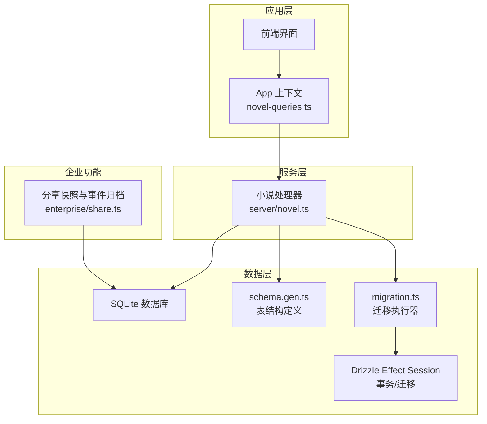
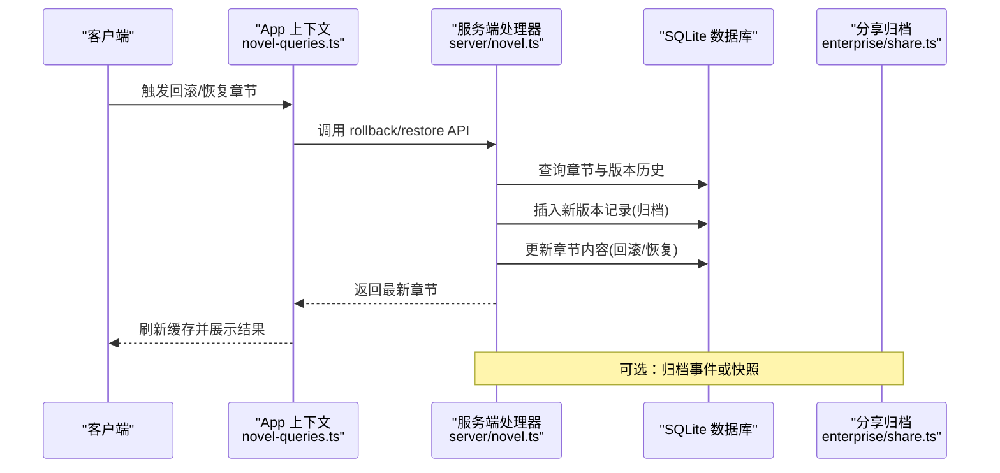
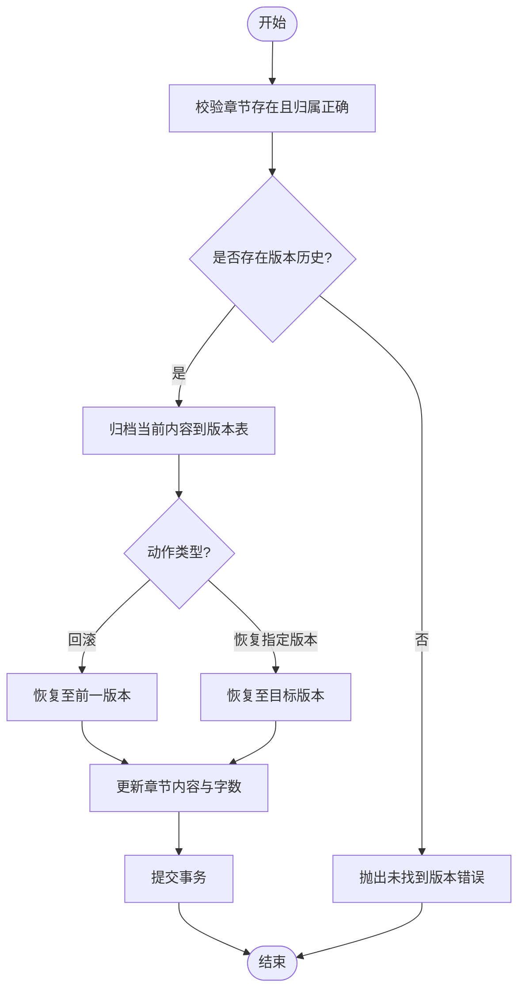
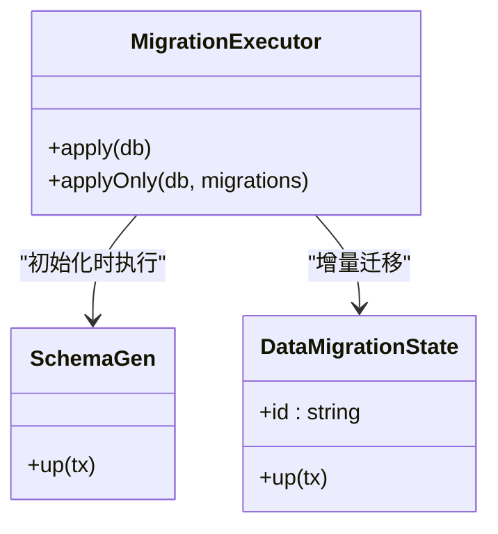
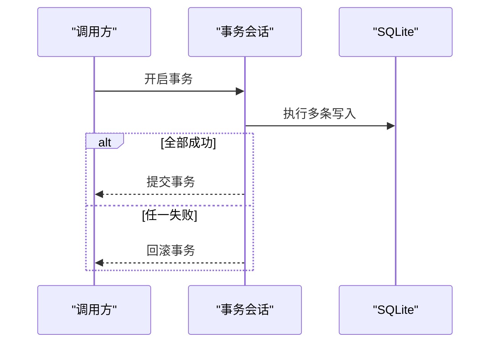
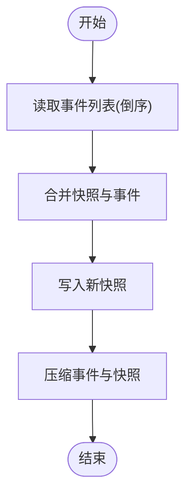
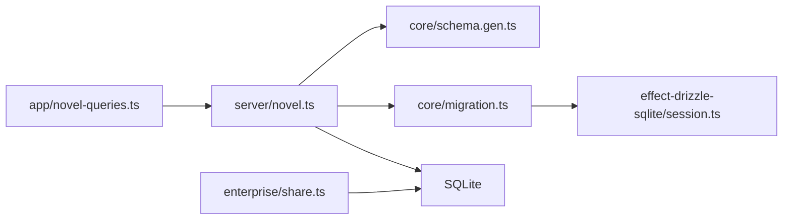

# 数据生命周期管理

<cite>
**本文引用的文件**
- [packages/core/src/database/migration.ts](file://packages/core/src/database/migration.ts)
- [packages/core/src/database/schema.gen.ts](file://packages/core/src/database/schema.gen.ts)
- [packages/core/src/database/migration/20260511000411_data_migration_state.ts](file://packages/core/src/database/migration/20260511000411_data_migration_state.ts)
- [packages/effect-drizzle-sqlite/src/sqlite-core/effect/session.ts](file://packages/effect-drizzle-sqlite/src/sqlite-core/effect/session.ts)
- [packages/server/src/handlers/novel.ts](file://packages/server/src/handlers/novel.ts)
- [packages/app/src/context/novel-queries.ts](file://packages/app/src/context/novel-queries.ts)
- [packages/enterprise/src/core/share.ts](file://packages/enterprise/src/core/share.ts)
- [packages/plugin/test/novel-writer/cascade.test.ts](file://packages/plugin/test/novel-writer/cascade.test.ts)
- [packages/opencode/test/storage/storage.test.ts](file://packages/opencode/test/storage/storage.test.ts)
</cite>

## 目录
1. [简介](#简介)
2. [项目结构](#项目结构)
3. [核心组件](#核心组件)
4. [架构总览](#架构总览)
5. [详细组件分析](#详细组件分析)
6. [依赖关系分析](#依赖关系分析)
7. [性能考量](#性能考量)
8. [故障排查指南](#故障排查指南)
9. [结论](#结论)
10. [附录](#附录)

## 简介
本文件面向 openNovel 的数据生命周期管理，覆盖数据的创建、更新、删除与归档流程；重点阐述章节版本控制（历史与回滚）、数据清理与存储优化、一致性保证与事务处理、软删除与硬删除的使用场景，以及数据迁移与升级、备份与灾难恢复的最佳实践。文档以仓库中的实际实现为依据，提供可视化图示与可追溯的源码引用，帮助读者从概念到代码层面全面理解。

## 项目结构
openNovel 采用多包架构，数据相关能力分布在以下关键位置：
- 数据库迁移与模式定义：core 包的 database 模块负责 schema 生成与迁移执行。
- 服务端接口与业务逻辑：server 包的 novel handler 暴露章节版本操作（回滚、恢复）。
- 客户端调用与缓存失效：app 包通过 SDK 调用服务端并刷新查询缓存。
- 事件与快照归档：enterprise 包提供分享场景的事件合并与快照写入。
- 事务与迁移工具：effect-drizzle-sqlite 提供 SQLite 事务与迁移支持。
- 测试用例：opencode 与 plugin 包包含存储与级联更新的验证。

**图表来源**
- [packages/app/src/context/novel-queries.ts](file://packages/app/src/context/novel-queries.ts)
- [packages/server/src/handlers/novel.ts](file://packages/server/src/handlers/novel.ts)
- [packages/core/src/database/schema.gen.ts](file://packages/core/src/database/schema.gen.ts)
- [packages/core/src/database/migration.ts](file://packages/core/src/database/migration.ts)
- [packages/effect-drizzle-sqlite/src/sqlite-core/effect/session.ts](file://packages/effect-drizzle-sqlite/src/sqlite-core/effect/session.ts)
- [packages/enterprise/src/core/share.ts](file://packages/enterprise/src/core/share.ts)

**章节来源**
- [packages/core/src/database/migration.ts:1-82](file://packages/core/src/database/migration.ts#L1-L82)
- [packages/core/src/database/schema.gen.ts:1-200](file://packages/core/src/database/schema.gen.ts#L1-L200)

## 核心组件
- 数据库迁移与模式
  - 使用 Drizzle ORM 与 Effect 组合，提供幂等迁移执行与事务封装。
  - 首次初始化时创建系统表与业务表，后续增量迁移按 id 顺序执行。
- 章节版本控制
  - chapters 表维护当前内容，chapter_versions 表记录每次变更的历史版本。
  - 服务端提供回滚与恢复接口，确保版本连续性与一致性。
- 事件与快照归档
  - enterprise/share.ts 将事件流合并为快照，减少读取开销并便于归档。
- 事务与一致性
  - effect-drizzle-sqlite 的 session 提供事务与回滚语义，保障复杂操作的原子性。
- 存储与清理
  - opencode 存储测试展示了写、读、列表与删除行为，体现键值存储的生命周期。

**章节来源**
- [packages/core/src/database/migration.ts:18-82](file://packages/core/src/database/migration.ts#L18-L82)
- [packages/core/src/database/schema.gen.ts:128-164](file://packages/core/src/database/schema.gen.ts#L128-L164)
- [packages/server/src/handlers/novel.ts:522-560](file://packages/server/src/handlers/novel.ts#L522-L560)
- [packages/server/src/handlers/novel.ts:800-840](file://packages/server/src/handlers/novel.ts#L800-L840)
- [packages/enterprise/src/core/share.ts:82-115](file://packages/enterprise/src/core/share.ts#L82-L115)
- [packages/effect-drizzle-sqlite/src/sqlite-core/effect/session.ts:413-459](file://packages/effect-drizzle-sqlite/src/sqlite-core/effect/session.ts#L413-L459)
- [packages/opencode/test/storage/storage.test.ts:173-212](file://packages/opencode/test/storage/storage.test.ts#L173-L212)

## 架构总览
数据生命周期贯穿“客户端调用 → 服务端处理 → 数据库持久化 → 归档与清理”的全链路。章节版本是核心对象，其创建、更新、回滚与恢复均通过事务保证一致性；企业级分享功能通过事件合并与快照写入提升可读性与归档效率。

**图表来源**
- [packages/app/src/context/novel-queries.ts:376-402](file://packages/app/src/context/novel-queries.ts#L376-L402)
- [packages/server/src/handlers/novel.ts:522-560](file://packages/server/src/handlers/novel.ts#L522-L560)
- [packages/server/src/handlers/novel.ts:800-840](file://packages/server/src/handlers/novel.ts#L800-L840)
- [packages/enterprise/src/core/share.ts:82-115](file://packages/enterprise/src/core/share.ts#L82-L115)

## 详细组件分析

### 章节版本控制与回滚机制
- 数据结构
  - chapters：当前章节内容、字数、状态、时间戳等。
  - chapter_versions：版本序列号、内容、字数、创建时间与创建者。
- 操作流程
  - 更新章节内容时，先归档当前内容至 chapter_versions，再更新 chapters。
  - 回滚操作：复制最新版本作为新归档，并将章节恢复到前一版本。
  - 恢复指定版本：插入当前内容的归档，再将章节内容替换为目标版本。
- 一致性保证
  - 所有写操作在事务中执行，失败自动回滚，避免部分更新导致的不一致。

**图表来源**
- [packages/server/src/handlers/novel.ts:522-560](file://packages/server/src/handlers/novel.ts#L522-L560)
- [packages/server/src/handlers/novel.ts:800-840](file://packages/server/src/handlers/novel.ts#L800-L840)
- [packages/core/src/database/schema.gen.ts:138-164](file://packages/core/src/database/schema.gen.ts#L138-L164)

**章节来源**
- [packages/server/src/handlers/novel.ts:522-560](file://packages/server/src/handlers/novel.ts#L522-L560)
- [packages/server/src/handlers/novel.ts:800-840](file://packages/server/src/handlers/novel.ts#L800-L840)
- [packages/core/src/database/schema.gen.ts:138-164](file://packages/core/src/database/schema.gen.ts#L138-L164)

### 数据迁移与升级
- 迁移执行器
  - apply：首次初始化时创建 schema 与迁移日志表，批量插入已执行的迁移记录。
  - applyOnly：增量迁移，跳过已完成的迁移，保证幂等性。
- 迁移表结构
  - migration：记录迁移 id 与完成时间，用于判断是否已执行。
  - data_migration：额外迁移状态表，用于更细粒度的数据迁移跟踪。
- 兼容性处理
  - 兼容旧版 Drizzle 迁移日志，自动迁移到新日志表，避免重复执行。

**图表来源**
- [packages/core/src/database/migration.ts:18-82](file://packages/core/src/database/migration.ts#L18-L82)
- [packages/core/src/database/schema.gen.ts:1-200](file://packages/core/src/database/schema.gen.ts#L1-200)
- [packages/core/src/database/migration/20260511000411_data_migration_state.ts:1-16](file://packages/core/src/database/migration/20260511000411_data_migration_state.ts#L1-L16)

**章节来源**
- [packages/core/src/database/migration.ts:18-82](file://packages/core/src/database/migration.ts#L18-L82)
- [packages/core/src/database/schema.gen.ts:1-200](file://packages/core/src/database/schema.gen.ts#L1-200)
- [packages/core/src/database/migration/20260511000411_data_migration_state.ts:1-16](file://packages/core/src/database/migration/20260511000411_data_migration_state.ts#L1-L16)

### 事务处理与一致性保证
- 事务封装
  - effect-drizzle-sqlite 的 session 提供 transaction 与 rollback 语义。
  - 所有写操作在 Effect 生成的事务中执行，失败自动回滚。
- 并发控制
  - 使用信号量限制迁移执行的并发，避免竞争条件。
- 错误处理
  - 明确区分成功与失败路径，抛出结构化错误以便上层捕获。

**图表来源**
- [packages/effect-drizzle-sqlite/src/sqlite-core/effect/session.ts:413-459](file://packages/effect-drizzle-sqlite/src/sqlite-core/effect/session.ts#L413-L459)
- [packages/core/src/database/migration.ts:11-17](file://packages/core/src/database/migration.ts#L11-L17)

**章节来源**
- [packages/effect-drizzle-sqlite/src/sqlite-core/effect/session.ts:413-459](file://packages/effect-drizzle-sqlite/src/sqlite-core/effect/session.ts#L413-L459)
- [packages/core/src/database/migration.ts:11-17](file://packages/core/src/database/migration.ts#L11-L17)

### 数据清理策略与存储空间优化
- 事件合并与快照
  - enterprise/share.ts 将事件流合并为快照，减少读取时的合并成本。
  - 定期写入快照并保留最近事件，平衡存储与读取性能。
- 存储生命周期
  - opencode 存储测试展示了 write/read/list/remove 的基本生命周期。
  - 建议对过期数据实施 TTL 或定期清理任务。

**图表来源**
- [packages/enterprise/src/core/share.ts:82-115](file://packages/enterprise/src/core/share.ts#L82-L115)
- [packages/opencode/test/storage/storage.test.ts:173-212](file://packages/opencode/test/storage/storage.test.ts#L173-L212)

**章节来源**
- [packages/enterprise/src/core/share.ts:82-115](file://packages/enterprise/src/core/share.ts#L82-L115)
- [packages/opencode/test/storage/storage.test.ts:173-212](file://packages/opencode/test/storage/storage.test.ts#L173-L212)

### 软删除与硬删除的使用场景
- 软删除
  - 适用于需要保留审计轨迹或允许恢复的场景，如章节草稿、角色状态。
  - 可通过新增 is_deleted 字段与索引实现高效过滤。
- 硬删除
  - 适用于无需保留的历史版本或临时数据，直接物理删除释放空间。
  - 建议在归档完成后执行，确保数据完整性。

[本节为概念说明，不直接分析具体文件]

### 数据迁移与升级最佳实践
- 幂等性
  - 每个迁移具备唯一 id，执行前检查是否已执行，避免重复。
- 兼容性
  - 兼容旧迁移日志表，自动迁移到新格式，平滑升级。
- 回滚策略
  - 设计 down 脚本或在应用层提供回滚逻辑，确保异常时可恢复。

**章节来源**
- [packages/core/src/database/migration.ts:43-82](file://packages/core/src/database/migration.ts#L43-L82)
- [packages/core/src/database/migration/20260511000411_data_migration_state.ts:1-16](file://packages/core/src/database/migration/20260511000411_data_migration_state.ts#L1-L16)

### 数据备份与灾难恢复策略
- 备份
  - 定期导出 SQLite 数据库文件，或使用 WAL 模式提升备份一致性。
  - 结合事件快照进行增量备份，缩短恢复时间。
- 恢复
  - 优先恢复快照，再回放事件，确保数据最终一致性。
  - 在恢复后运行迁移校验，确保 schema 与数据一致。

[本节为通用指导，不直接分析具体文件]

## 依赖关系分析
- 组件耦合
  - server/novel.ts 依赖 core/schema 与 core/migration，间接依赖 effect-drizzle-sqlite 的事务能力。
  - app 上下文通过 SDK 调用服务端，解耦前端与后端实现。
- 外部依赖
  - Drizzle ORM 提供 SQL 抽象与迁移支持。
  - Effect 库提供函数式错误处理与并发控制。

**图表来源**
- [packages/app/src/context/novel-queries.ts:376-402](file://packages/app/src/context/novel-queries.ts#L376-L402)
- [packages/server/src/handlers/novel.ts:522-560](file://packages/server/src/handlers/novel.ts#L522-L560)
- [packages/core/src/database/schema.gen.ts:1-200](file://packages/core/src/database/schema.gen.ts#L1-200)
- [packages/core/src/database/migration.ts:18-82](file://packages/core/src/database/migration.ts#L18-L82)
- [packages/effect-drizzle-sqlite/src/sqlite-core/effect/session.ts:413-459](file://packages/effect-drizzle-sqlite/src/sqlite-core/effect/session.ts#L413-L459)
- [packages/enterprise/src/core/share.ts:82-115](file://packages/enterprise/src/core/share.ts#L82-L115)

**章节来源**
- [packages/app/src/context/novel-queries.ts:376-402](file://packages/app/src/context/novel-queries.ts#L376-L402)
- [packages/server/src/handlers/novel.ts:522-560](file://packages/server/src/handlers/novel.ts#L522-L560)
- [packages/core/src/database/migration.ts:18-82](file://packages/core/src/database/migration.ts#L18-L82)
- [packages/effect-drizzle-sqlite/src/sqlite-core/effect/session.ts:413-459](file://packages/effect-drizzle-sqlite/src/sqlite-core/effect/session.ts#L413-L459)
- [packages/enterprise/src/core/share.ts:82-115](file://packages/enterprise/src/core/share.ts#L82-L115)

## 性能考量
- 版本历史查询
  - 对 chapter_versions 表按 chapter_id 与 version 建立索引，加速历史查询。
- 事件合并
  - 合理设置快照阈值，避免频繁合并与写入。
- 事务粒度
  - 尽量缩小事务范围，减少锁持有时间，提高并发性能。

[本节为通用指导，不直接分析具体文件]

## 故障排查指南
- 章节回滚失败
  - 检查是否存在版本历史，确认章节归属与权限。
  - 查看事务日志与错误码，定位失败步骤。
- 迁移冲突
  - 核对迁移 id 是否重复，检查迁移日志表状态。
  - 必要时手动清理或修复迁移记录。
- 存储异常
  - 验证读写权限与磁盘空间，检查存储路径配置。

**章节来源**
- [packages/server/src/handlers/novel.ts:522-560](file://packages/server/src/handlers/novel.ts#L522-560)
- [packages/core/src/database/migration.ts:43-82](file://packages/core/src/database/migration.ts#L43-L82)
- [packages/opencode/test/storage/storage.test.ts:173-212](file://packages/opencode/test/storage/storage.test.ts#L173-L212)

## 结论
openNovel 的数据生命周期管理以章节版本为核心，结合事务、迁移与归档机制，实现了高一致性与可回溯的数据操作。通过事件合并与快照优化存储与读取性能，同时提供清晰的迁移与恢复策略，确保系统在演进过程中的稳定性与可维护性。建议在生产环境中完善监控与告警，定期演练备份与恢复流程，进一步提升数据可靠性。

## 附录
- 术语表
  - 章节版本：章节内容的历史快照，用于回滚与恢复。
  - 事件合并：将多个事件合并为快照，减少读取开销。
  - 迁移：数据库结构与数据的增量更新过程。
- 参考实现
  - 章节回滚与恢复：server/novel.ts
  - 迁移执行器：core/migration.ts
  - 事件归档：enterprise/share.ts

[本节为补充信息，不直接分析具体文件]