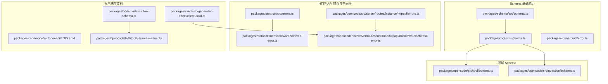
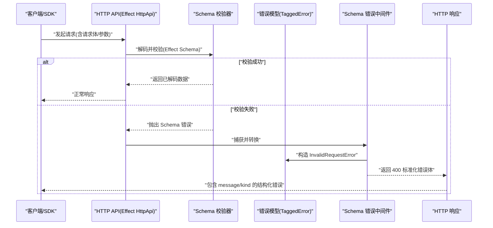
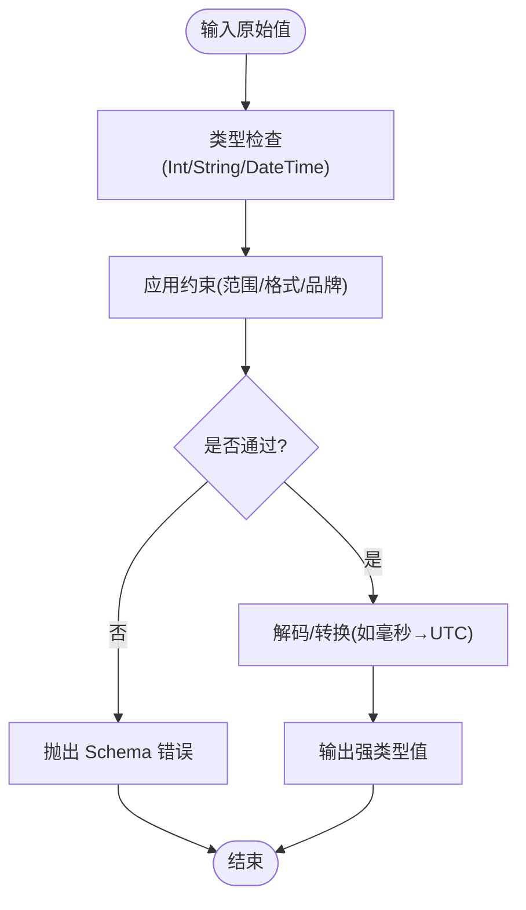
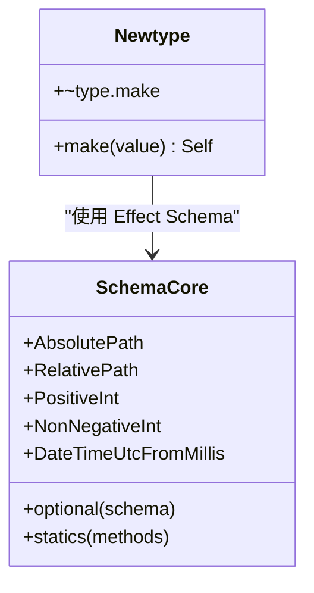
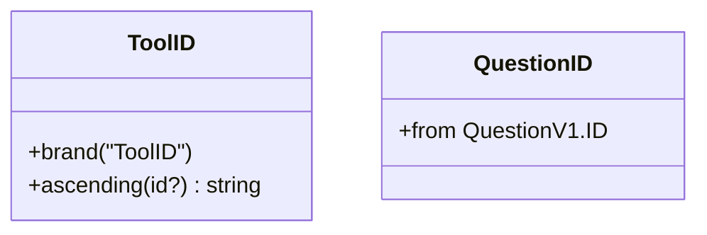
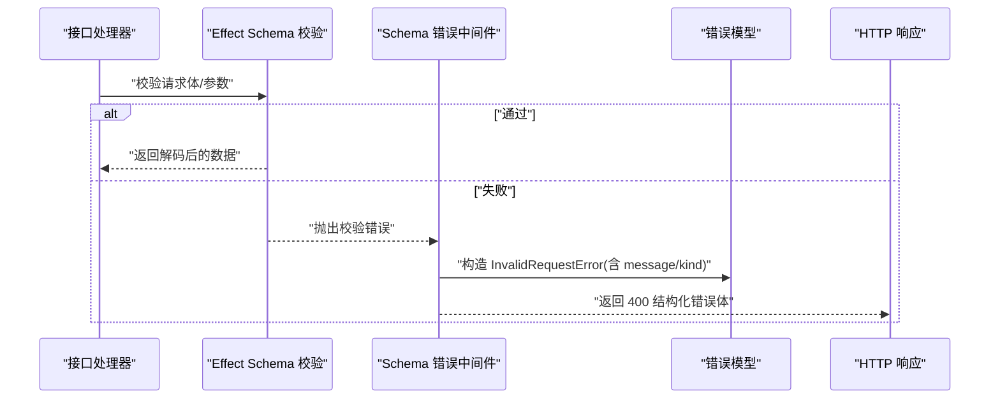
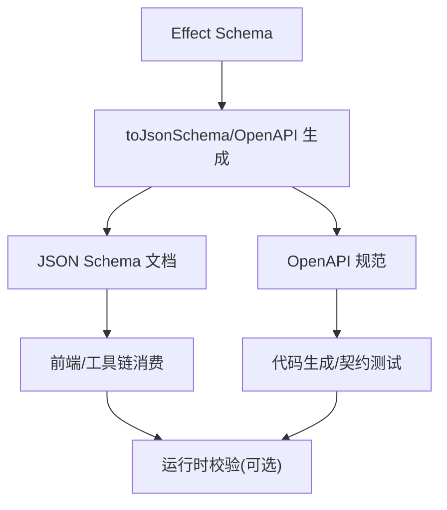
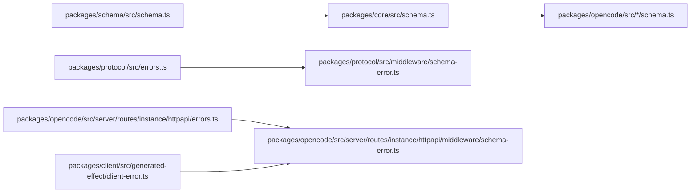

# 数据验证与约束

<cite>
**本文引用的文件**
- [packages/schema/src/schema.ts](file://packages/schema/src/schema.ts)
- [packages/core/src/schema.ts](file://packages/core/src/schema.ts)
- [packages/core/src/util/error.ts](file://packages/core/src/util/error.ts)
- [packages/opencode/src/tool/schema.ts](file://packages/opencode/src/tool/schema.ts)
- [packages/opencode/src/question/schema.ts](file://packages/opencode/src/question/schema.ts)
- [packages/protocol/src/errors.ts](file://packages/protocol/src/errors.ts)
- [packages/protocol/src/middleware/schema-error.ts](file://packages/protocol/src/middleware/schema-error.ts)
- [packages/opencode/src/server/routes/instance/httpapi/errors.ts](file://packages/opencode/src/server/routes/instance/httpapi/errors.ts)
- [packages/opencode/src/server/routes/instance/httpapi/middleware/schema-error.ts](file://packages/opencode/src/server/routes/instance/httpapi/middleware/schema-error.ts)
- [packages/client/src/generated-effect/client-error.ts](file://packages/client/src/generated-effect/client-error.ts)
- [packages/codemode/src/tool-schema.ts](file://packages/codemode/src/tool-schema.ts)
- [packages/codemode/src/openapi/TODO.md](file://packages/codemode/src/openapi/TODO.md)
- [packages/opencode/test/tool/parameters.test.ts](file://packages/opencode/test/tool/parameters.test.ts)
</cite>

## 目录
1. [简介](#简介)
2. [项目结构](#项目结构)
3. [核心组件](#核心组件)
4. [架构总览](#架构总览)
5. [详细组件分析](#详细组件分析)
6. [依赖关系分析](#依赖关系分析)
7. [性能考量](#性能考量)
8. [故障排查指南](#故障排查指南)
9. [结论](#结论)
10. [附录](#附录)

## 简介
本文件系统化梳理 openNovel 的数据验证体系，围绕 Effect Schema 的运行时校验、类型安全、错误处理与用户体验优化展开。内容覆盖：
- 基于 Effect Schema 的验证机制与最佳实践
- 常见验证规则（类型检查、格式校验、业务约束）
- 自定义验证器开发与集成方式
- 错误处理策略与响应规范
- 运行时验证与编译时验证的区别与应用场景
- 完整的配置示例与可操作建议

## 项目结构
openNovel 将“通用 Schema 能力”下沉到独立包，并在 core 层提供增强工具，在 opencode 与 protocol 中落地为 HTTP API 的错误模型与中间件，同时在客户端生成错误类型以统一 SDK 体验。



**图表来源**
- [packages/schema/src/schema.ts:1-31](file://packages/schema/src/schema.ts#L1-L31)
- [packages/core/src/schema.ts:1-80](file://packages/core/src/schema.ts#L1-L80)
- [packages/core/src/util/error.ts:1-71](file://packages/core/src/util/error.ts#L1-L71)
- [packages/opencode/src/tool/schema.ts:1-15](file://packages/opencode/src/tool/schema.ts#L1-L15)
- [packages/opencode/src/question/schema.ts:1-5](file://packages/opencode/src/question/schema.ts#L1-L5)
- [packages/protocol/src/errors.ts:1-112](file://packages/protocol/src/errors.ts#L1-L112)
- [packages/protocol/src/middleware/schema-error.ts:1-7](file://packages/protocol/src/middleware/schema-error.ts#L1-L7)
- [packages/opencode/src/server/routes/instance/httpapi/errors.ts:1-194](file://packages/opencode/src/server/routes/instance/httpapi/errors.ts#L1-L194)
- [packages/opencode/src/server/routes/instance/httpapi/middleware/schema-error.ts:1-41](file://packages/opencode/src/server/routes/instance/httpapi/middleware/schema-error.ts#L1-L41)
- [packages/client/src/generated-effect/client-error.ts:1-5](file://packages/client/src/generated-effect/client-error.ts#L1-L5)
- [packages/codemode/src/tool-schema.ts:67-86](file://packages/codemode/src/tool-schema.ts#L67-L86)
- [packages/codemode/src/openapi/TODO.md:1-20](file://packages/codemode/src/openapi/TODO.md#L1-L20)
- [packages/opencode/test/tool/parameters.test.ts:56-84](file://packages/opencode/test/tool/parameters.test.ts#L56-L84)

**章节来源**
- [packages/schema/src/schema.ts:1-31](file://packages/schema/src/schema.ts#L1-L31)
- [packages/core/src/schema.ts:1-80](file://packages/core/src/schema.ts#L1-L80)
- [packages/core/src/util/error.ts:1-71](file://packages/core/src/util/error.ts#L1-L71)
- [packages/opencode/src/tool/schema.ts:1-15](file://packages/opencode/src/tool/schema.ts#L1-L15)
- [packages/opencode/src/question/schema.ts:1-5](file://packages/opencode/src/question/schema.ts#L1-L5)
- [packages/protocol/src/errors.ts:1-112](file://packages/protocol/src/errors.ts#L1-L112)
- [packages/protocol/src/middleware/schema-error.ts:1-7](file://packages/protocol/src/middleware/schema-error.ts#L1-L7)
- [packages/opencode/src/server/routes/instance/httpapi/errors.ts:1-194](file://packages/opencode/src/server/routes/instance/httpapi/errors.ts#L1-L194)
- [packages/opencode/src/server/routes/instance/httpapi/middleware/schema-error.ts:1-41](file://packages/opencode/src/server/routes/instance/httpapi/middleware/schema-error.ts#L1-L41)
- [packages/client/src/generated-effect/client-error.ts:1-5](file://packages/client/src/generated-effect/client-error.ts#L1-L5)
- [packages/codemode/src/tool-schema.ts:67-86](file://packages/codemode/src/tool-schema.ts#L67-L86)
- [packages/codemode/src/openapi/TODO.md:1-20](file://packages/codemode/src/openapi/TODO.md#L1-L20)
- [packages/opencode/test/tool/parameters.test.ts:56-84](file://packages/opencode/test/tool/parameters.test.ts#L56-L84)

## 核心组件
- 通用 Schema 能力（packages/schema/src/schema.ts）
  - 提供正整数、非负整数、路径品牌化、可选键封装、UTC 毫秒时间转换等常用校验与转换。
- Core 增强（packages/core/src/schema.ts）
  - 暴露 packages/schema 的能力，并提供 Newtype 抽象与 DeepMutable 类型工具，便于构建强类型标识符与可变类型。
- 命名错误基类（packages/core/src/util/error.ts）
  - 统一的 NamedError 抽象，支持通过 Schema 描述错误数据结构，并生成带 tag/name/data 的统一错误对象。
- 领域 Schema（packages/opencode/src/tool/schema.ts, packages/opencode/src/question/schema.ts）
  - 定义 ToolID、QuestionID 等强类型标识符，使用字符串前缀 + brand 的方式保证 ID 语义正确性。
- HTTP API 错误模型（packages/protocol/src/errors.ts, packages/opencode/src/server/routes/instance/httpapi/errors.ts）
  - 使用 Schema.TaggedErrorClass 定义各类 HTTP 错误，附带 httpApiStatus，确保服务端与客户端一致的错误语义。
- 错误中间件（packages/protocol/src/middleware/schema-error.ts, packages/opencode/src/server/routes/instance/httpapi/middleware/schema-error.ts）
  - 将 Effect Schema 校验失败转换为标准 HTTP 错误响应，并对原因信息进行截断保护隐私与安全。
- 客户端错误（packages/client/src/generated-effect/client-error.ts）
  - 生成的 ClientError 用于统一包装网络或校验异常，便于上层统一处理。
- JSON Schema 与 OpenAPI 集成（packages/codemode/src/tool-schema.ts, packages/opencode/test/tool/parameters.test.ts, packages/codemode/src/openapi/TODO.md）
  - 从 Effect Schema 导出 JSON Schema/OpenAPI，保持 required/nullable/allOf 等约束；测试覆盖行为一致性。

**章节来源**
- [packages/schema/src/schema.ts:1-31](file://packages/schema/src/schema.ts#L1-L31)
- [packages/core/src/schema.ts:1-80](file://packages/core/src/schema.ts#L1-L80)
- [packages/core/src/util/error.ts:1-71](file://packages/core/src/util/error.ts#L1-L71)
- [packages/opencode/src/tool/schema.ts:1-15](file://packages/opencode/src/tool/schema.ts#L1-L15)
- [packages/opencode/src/question/schema.ts:1-5](file://packages/opencode/src/question/schema.ts#L1-L5)
- [packages/protocol/src/errors.ts:1-112](file://packages/protocol/src/errors.ts#L1-L112)
- [packages/protocol/src/middleware/schema-error.ts:1-7](file://packages/protocol/src/middleware/schema-error.ts#L1-L7)
- [packages/opencode/src/server/routes/instance/httpapi/errors.ts:1-194](file://packages/opencode/src/server/routes/instance/httpapi/errors.ts#L1-L194)
- [packages/opencode/src/server/routes/instance/httpapi/middleware/schema-error.ts:1-41](file://packages/opencode/src/server/routes/instance/httpapi/middleware/schema-error.ts#L1-L41)
- [packages/client/src/generated-effect/client-error.ts:1-5](file://packages/client/src/generated-effect/client-error.ts#L1-L5)
- [packages/codemode/src/tool-schema.ts:67-86](file://packages/codemode/src/tool-schema.ts#L67-L86)
- [packages/opencode/test/tool/parameters.test.ts:56-84](file://packages/opencode/test/tool/parameters.test.ts#L56-L84)
- [packages/codemode/src/openapi/TODO.md:1-20](file://packages/codemode/src/openapi/TODO.md#L1-L20)

## 架构总览
Effect Schema 贯穿“输入校验—错误建模—响应格式化—客户端适配”的全链路。



**图表来源**
- [packages/protocol/src/middleware/schema-error.ts:1-7](file://packages/protocol/src/middleware/schema-error.ts#L1-L7)
- [packages/opencode/src/server/routes/instance/httpapi/middleware/schema-error.ts:1-41](file://packages/opencode/src/server/routes/instance/httpapi/middleware/schema-error.ts#L1-L41)
- [packages/protocol/src/errors.ts:1-112](file://packages/protocol/src/errors.ts#L1-L112)
- [packages/opencode/src/server/routes/instance/httpapi/errors.ts:1-194](file://packages/opencode/src/server/routes/instance/httpapi/errors.ts#L1-L194)

## 详细组件分析

### 通用 Schema 能力（packages/schema/src/schema.ts）
- 正整型与非负整型：通过 Int.check 与比较约束组合，避免越界与非法值。
- 路径品牌化：RelativePath/AbsolutePath 使用 brand 强化类型语义，防止误用。
- optional 封装：对可选字段进行 decode/encode 的双向处理，兼容严格/宽松模式。
- DateTimeUtcFromMillis：在毫秒与 UTC 日期之间安全转换，统一时间表示。



**图表来源**
- [packages/schema/src/schema.ts:1-31](file://packages/schema/src/schema.ts#L1-L31)

**章节来源**
- [packages/schema/src/schema.ts:1-31](file://packages/schema/src/schema.ts#L1-L31)

### Core 增强与 Newtype（packages/core/src/schema.ts）
- 暴露 packages/schema 的常用能力，供上层直接使用。
- Newtype：为标量类型创建名义类型（如 ID），结合 make 工厂方法，提升类型安全性与可读性。
- DeepMutable：解决 readonly 深拷贝的类型问题，保障复杂结构的可变性需求。



**图表来源**
- [packages/core/src/schema.ts:1-80](file://packages/core/src/schema.ts#L1-L80)

**章节来源**
- [packages/core/src/schema.ts:1-80](file://packages/core/src/schema.ts#L1-L80)

### 命名错误基类（packages/core/src/util/error.ts）
- 抽象基类 NamedError：要求子类实现 schema() 与 toObject()，统一错误结构与序列化。
- create(name, data)：根据名称与 Schema 动态生成错误类，具备静态 isInstance、tag、Schema/EfffectSchema 属性。
- UnknownError 默认实现：提供通用未知错误模板。

```mermaid
classDiagram
class NamedError {
<<abstract>>
+schema() Top
+toObject() {name : string; data : unknown}
+hasName(error,name) bool
+create(name,data) Class
}
class UnknownError {
+schema() Struct
+toObject() {name : "UnknownError"; data : {message : string; ref? : string}}
}
NamedError <|-- UnknownError
```

**图表来源**
- [packages/core/src/util/error.ts:1-71](file://packages/core/src/util/error.ts#L1-L71)

**章节来源**
- [packages/core/src/util/error.ts:1-71](file://packages/core/src/util/error.ts#L1-L71)

### 领域 Schema（ToolID、QuestionID）
- ToolID：以 tool 前缀的品牌化字符串，配合 statics 扩展便捷方法（如 ascending）。
- QuestionID：复用 @opencode-ai/schema/question-v1 的 ID 定义，保证跨模块一致性。



**图表来源**
- [packages/opencode/src/tool/schema.ts:1-15](file://packages/opencode/src/tool/schema.ts#L1-L15)
- [packages/opencode/src/question/schema.ts:1-5](file://packages/opencode/src/question/schema.ts#L1-L5)

**章节来源**
- [packages/opencode/src/tool/schema.ts:1-15](file://packages/opencode/src/tool/schema.ts#L1-L15)
- [packages/opencode/src/question/schema.ts:1-5](file://packages/opencode/src/question/schema.ts#L1-L5)

### HTTP API 错误模型与中间件
- 错误模型：InvalidRequestError、UnauthorizedError、ConflictError、ServiceUnavailableError、UnknownError、ProviderNotFoundError、SessionNotFoundError、MessageNotFoundError、InvalidCursorError、PermissionNotFoundError、QuestionNotFoundError、ForbiddenError、PtyNotFoundError、UpstreamError、TimeoutError、ModelNotFoundError、McpServerNotFoundError、ApiNotFoundError 等，均通过 TaggedErrorClass 声明，附带 httpApiStatus。
- 中间件：
  - protocol 层：注册 Schema 错误服务，绑定 InvalidRequestError。
  - opencode 实例路由层：对校验失败的原因进行截断，区分 /api/ 与其他路径的响应格式，统一记录日志。



**图表来源**
- [packages/protocol/src/errors.ts:1-112](file://packages/protocol/src/errors.ts#L1-L112)
- [packages/protocol/src/middleware/schema-error.ts:1-7](file://packages/protocol/src/middleware/schema-error.ts#L1-L7)
- [packages/opencode/src/server/routes/instance/httpapi/errors.ts:1-194](file://packages/opencode/src/server/routes/instance/httpapi/errors.ts#L1-L194)
- [packages/opencode/src/server/routes/instance/httpapi/middleware/schema-error.ts:1-41](file://packages/opencode/src/server/routes/instance/httpapi/middleware/schema-error.ts#L1-L41)

**章节来源**
- [packages/protocol/src/errors.ts:1-112](file://packages/protocol/src/errors.ts#L1-L112)
- [packages/protocol/src/middleware/schema-error.ts:1-7](file://packages/protocol/src/middleware/schema-error.ts#L1-L7)
- [packages/opencode/src/server/routes/instance/httpapi/errors.ts:1-194](file://packages/opencode/src/server/routes/instance/httpapi/errors.ts#L1-L194)
- [packages/opencode/src/server/routes/instance/httpapi/middleware/schema-error.ts:1-41](file://packages/opencode/src/server/routes/instance/httpapi/middleware/schema-error.ts#L1-L41)

### 客户端错误与 SDK 适配（packages/client/src/generated-effect/client-error.ts）
- ClientError：统一包装 HttpClient 或 Schema 校验错误，使上层能以一致方式处理失败。

**章节来源**
- [packages/client/src/generated-effect/client-error.ts:1-5](file://packages/client/src/generated-effect/client-error.ts#L1-L5)

### JSON Schema 与 OpenAPI 集成（packages/codemode/src/tool-schema.ts, packages/opencode/test/tool/parameters.test.ts, packages/codemode/src/openapi/TODO.md）
- 从 Effect Schema 导出 JSON Schema/OpenAPI，保留 required、nullable、allOf 等约束，确保模型与文档一致。
- 测试覆盖：内联子 Schema、保留 nullable、重复 allOf、整数安全边界等关键行为。
- TODO：未来计划完善认证、序列化、SSE/WebSocket、二进制响应、读写属性投影等。



**图表来源**
- [packages/codemode/src/tool-schema.ts:67-86](file://packages/codemode/src/tool-schema.ts#L67-L86)
- [packages/opencode/test/tool/parameters.test.ts:56-84](file://packages/opencode/test/tool/parameters.test.ts#L56-L84)
- [packages/codemode/src/openapi/TODO.md:1-20](file://packages/codemode/src/openapi/TODO.md#L1-L20)

**章节来源**
- [packages/codemode/src/tool-schema.ts:67-86](file://packages/codemode/src/tool-schema.ts#L67-L86)
- [packages/opencode/test/tool/parameters.test.ts:56-84](file://packages/opencode/test/tool/parameters.test.ts#L56-L84)
- [packages/codemode/src/openapi/TODO.md:1-20](file://packages/codemode/src/openapi/TODO.md#L1-L20)

## 依赖关系分析
- 低耦合高内聚：packages/schema 提供基础能力，core 做增强，opencode/protocol 负责具体业务与 HTTP 层集成。
- 错误模型集中管理：TaggedErrorClass 统一错误结构与状态码，中间件负责转换与响应。
- 客户端与服务器端通过一致的错误结构交互，SDK 自动生成 ClientError 简化调用方处理。



**图表来源**
- [packages/schema/src/schema.ts:1-31](file://packages/schema/src/schema.ts#L1-L31)
- [packages/core/src/schema.ts:1-80](file://packages/core/src/schema.ts#L1-L80)
- [packages/opencode/src/tool/schema.ts:1-15](file://packages/opencode/src/tool/schema.ts#L1-L15)
- [packages/opencode/src/question/schema.ts:1-5](file://packages/opencode/src/question/schema.ts#L1-L5)
- [packages/protocol/src/errors.ts:1-112](file://packages/protocol/src/errors.ts#L1-L112)
- [packages/protocol/src/middleware/schema-error.ts:1-7](file://packages/protocol/src/middleware/schema-error.ts#L1-L7)
- [packages/opencode/src/server/routes/instance/httpapi/errors.ts:1-194](file://packages/opencode/src/server/routes/instance/httpapi/errors.ts#L1-L194)
- [packages/opencode/src/server/routes/instance/httpapi/middleware/schema-error.ts:1-41](file://packages/opencode/src/server/routes/instance/httpapi/middleware/schema-error.ts#L1-L41)
- [packages/client/src/generated-effect/client-error.ts:1-5](file://packages/client/src/generated-effect/client-error.ts#L1-L5)

**章节来源**
- [packages/schema/src/schema.ts:1-31](file://packages/schema/src/schema.ts#L1-L31)
- [packages/core/src/schema.ts:1-80](file://packages/core/src/schema.ts#L1-L80)
- [packages/opencode/src/tool/schema.ts:1-15](file://packages/opencode/src/tool/schema.ts#L1-L15)
- [packages/opencode/src/question/schema.ts:1-5](file://packages/opencode/src/question/schema.ts#L1-L5)
- [packages/protocol/src/errors.ts:1-112](file://packages/protocol/src/errors.ts#L1-L112)
- [packages/protocol/src/middleware/schema-error.ts:1-7](file://packages/protocol/src/middleware/schema-error.ts#L1-L7)
- [packages/opencode/src/server/routes/instance/httpapi/errors.ts:1-194](file://packages/opencode/src/server/routes/instance/httpapi/errors.ts#L1-L194)
- [packages/opencode/src/server/routes/instance/httpapi/middleware/schema-error.ts:1-41](file://packages/opencode/src/server/routes/instance/httpapi/middleware/schema-error.ts#L1-L41)
- [packages/client/src/generated-effect/client-error.ts:1-5](file://packages/client/src/generated-effect/client-error.ts#L1-L5)

## 性能考量
- 校验开销：Effect Schema 在运行时执行类型与约束检查，建议在入口层（HTTP 解码处）集中校验，避免重复。
- 错误信息大小：中间件对校验失败原因进行截断，防止大负载导致响应过大或泄露敏感信息。
- JSON Schema 生成：按需生成，避免全量导出造成体积膨胀；测试覆盖关键分支，减少回归风险。
- 时间转换：DateTimeUtcFromMillis 使用高效转换，避免频繁解析开销。

[本节为通用指导，不直接分析具体文件]

## 故障排查指南
- 常见问题定位
  - 校验失败：查看 InvalidRequestError 的 message/kind，确认字段与约束。
  - 授权失败：UnauthorizedError/ForbiddenError 的状态码与消息提示。
  - 资源未找到：Session/Message/Project/McpServer/Pty 等 NotFound 错误。
  - 上游错误：UpstreamError/ServiceUnavailableError/TimeoutError 指示外部依赖问题。
- 调试建议
  - 启用日志：中间件会记录“schema rejection”，包含 kind 与 reason。
  - 缩小范围：逐步注释校验规则，定位具体失败的约束。
  - 客户端侧：检查 ClientError.cause，追溯底层网络或校验错误。

**章节来源**
- [packages/protocol/src/errors.ts:1-112](file://packages/protocol/src/errors.ts#L1-L112)
- [packages/opencode/src/server/routes/instance/httpapi/errors.ts:1-194](file://packages/opencode/src/server/routes/instance/httpapi/errors.ts#L1-L194)
- [packages/opencode/src/server/routes/instance/httpapi/middleware/schema-error.ts:1-41](file://packages/opencode/src/server/routes/instance/httpapi/middleware/schema-error.ts#L1-L41)
- [packages/client/src/generated-effect/client-error.ts:1-5](file://packages/client/src/generated-effect/client-error.ts#L1-L5)

## 结论
openNovel 的数据验证体系以 Effect Schema 为核心，贯穿类型安全、运行时校验、错误建模与响应格式化，形成端到端的健壮性保障。通过统一的错误模型与中间件，既保证了开发体验的一致性，也提升了用户反馈的可操作性。结合 JSON Schema/OpenAPI 的生成与测试，进一步确保了契约与实现的同步演进。

[本节为总结性内容，不直接分析具体文件]

## 附录

### 运行时验证与编译时验证
- 运行时验证（Effect Schema）
  - 适用场景：HTTP 请求/响应解码、外部输入校验、动态配置加载。
  - 优势：精确的错误定位、可组合的约束、与 TypeScript 类型联动。
- 编译时验证（TypeScript 类型系统）
  - 适用场景：IDE 提示、静态检查、契约约束、重构安全。
  - 优势：零运行时开销、早期发现类型错误。
- 最佳实践
  - 以 Effect Schema 作为单一事实源，同时导出 JSON Schema/OpenAPI。
  - 使用 Newtype/Brand 强化领域语义，减少误用。
  - 在接口边界集中校验，内部逻辑假设输入已合法。

[本节为概念性说明，不直接分析具体文件]

### 自定义验证器开发与集成
- 步骤
  - 使用 Schema.String.check(Schema.isPattern(...)) 或 Schema.Int.check(...) 添加约束。
  - 使用 Schema.brand 创建品牌化类型，提升类型安全。
  - 使用 optional/decodeTo/encode 定制可选字段与编解码逻辑。
  - 在 HTTP 层通过中间件统一处理校验失败，返回结构化错误。
- 示例参考
  - ToolID 的前缀校验与静态方法扩展。
  - RelativePath/AbsolutePath 的品牌化。
  - DateTimeUtcFromMillis 的毫秒↔UTC 转换。

**章节来源**
- [packages/opencode/src/tool/schema.ts:1-15](file://packages/opencode/src/tool/schema.ts#L1-L15)
- [packages/schema/src/schema.ts:1-31](file://packages/schema/src/schema.ts#L1-L31)

### 完整验证规则配置示例（路径指引）
- 类型与约束
  - 正整数/非负整数：packages/schema/src/schema.ts
  - 路径品牌化：packages/schema/src/schema.ts
  - 可选字段：packages/schema/src/schema.ts
  - 时间转换：packages/schema/src/schema.ts
- 错误模型
  - HTTP 错误分类与状态码：packages/protocol/src/errors.ts、packages/opencode/src/server/routes/instance/httpapi/errors.ts
- 中间件与响应
  - 错误转换与截断：packages/protocol/src/middleware/schema-error.ts、packages/opencode/src/server/routes/instance/httpapi/middleware/schema-error.ts
- JSON Schema/OpenAPI
  - 生成与渲染：packages/codemode/src/tool-schema.ts
  - 行为测试：packages/opencode/test/tool/parameters.test.ts

**章节来源**
- [packages/schema/src/schema.ts:1-31](file://packages/schema/src/schema.ts#L1-L31)
- [packages/protocol/src/errors.ts:1-112](file://packages/protocol/src/errors.ts#L1-L112)
- [packages/opencode/src/server/routes/instance/httpapi/errors.ts:1-194](file://packages/opencode/src/server/routes/instance/httpapi/errors.ts#L1-L194)
- [packages/protocol/src/middleware/schema-error.ts:1-7](file://packages/protocol/src/middleware/schema-error.ts#L1-L7)
- [packages/opencode/src/server/routes/instance/httpapi/middleware/schema-error.ts:1-41](file://packages/opencode/src/server/routes/instance/httpapi/middleware/schema-error.ts#L1-L41)
- [packages/codemode/src/tool-schema.ts:67-86](file://packages/codemode/src/tool-schema.ts#L67-L86)
- [packages/opencode/test/tool/parameters.test.ts:56-84](file://packages/opencode/test/tool/parameters.test.ts#L56-L84)