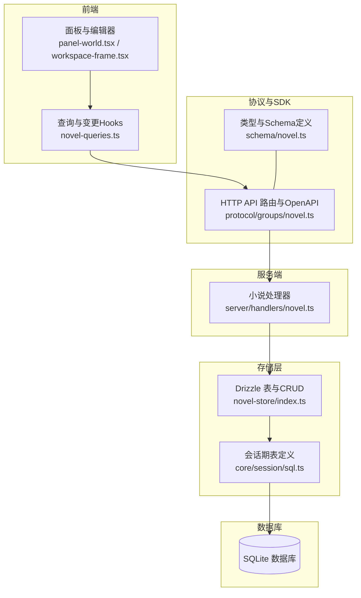
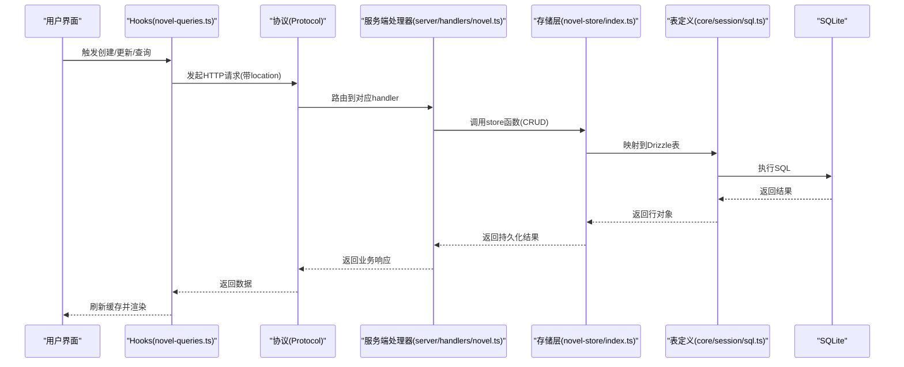
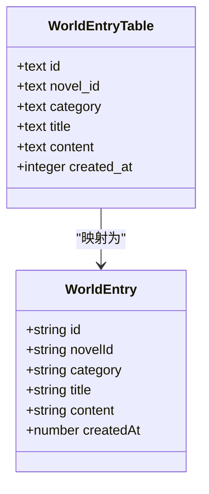
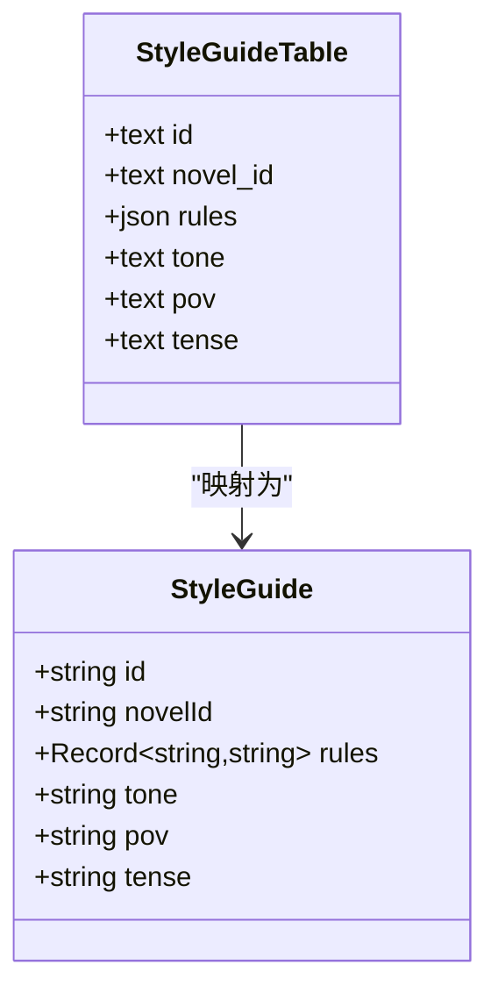
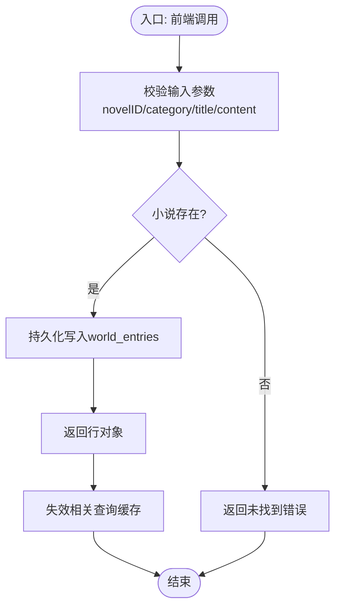
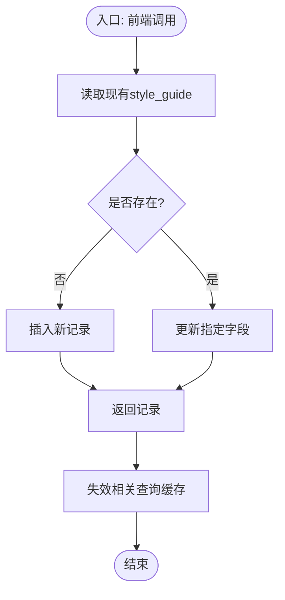

# 世界观实体

<cite>
**本文引用的文件**   
- [packages/schema/src/novel.ts](file://packages/schema/src/novel.ts)
- [packages/core/src/session/sql.ts](file://packages/core/src/session/sql.ts)
- [packages/novel-store/src/index.ts](file://packages/novel-store/src/index.ts)
- [packages/server/src/handlers/novel.ts](file://packages/server/src/handlers/novel.ts)
- [packages/app/src/context/novel-queries.ts](file://packages/app/src/context/novel-queries.ts)
- [packages/protocol/src/groups/novel.ts](file://packages/protocol/src/groups/novel.ts)
- [packages/app/src/pages/novel/panel-world.tsx](file://packages/app/src/pages/novel/panel-world.tsx)
- [packages/app/src/pages/novel/workspace-frame.tsx](file://packages/app/src/pages/novel/workspace-frame.tsx)
</cite>

## 目录
1. [简介](#简介)
2. [项目结构](#项目结构)
3. [核心组件](#核心组件)
4. [架构总览](#架构总览)
5. [详细组件分析](#详细组件分析)
6. [依赖关系分析](#依赖关系分析)
7. [性能考量](#性能考量)
8. [故障排查指南](#故障排查指南)
9. [结论](#结论)
10. [附录：创建、更新与查询示例路径](#附录创建更新与查询示例路径)

## 简介
本文件围绕 WorldEntry（世界观条目）与 StyleGuide（风格指南）两个核心实体，系统化阐述其数据结构、存储模型、API 接口、前端交互与后端处理流程。重点说明：
- 世界观条目的分类管理与知识组织方式（category、title、content、createdAt 等字段的作用）。
- 风格指南的写作规范配置（rules 规则字典、tone 语调、pov 视角、tense 时态）如何保障写作一致性。
- 从前端到服务端再到数据库的完整数据流与错误处理策略。
- 提供创建、更新、查询的代码示例路径，便于快速定位实现。

## 项目结构
WorldEntry 与 StyleGuide 贯穿“协议定义 → 客户端 SDK → 应用层 Hooks → 服务端处理器 → 存储层 → 数据库表”的全链路。关键位置如下：
- 协议与类型定义：packages/schema/src/novel.ts
- 数据库表定义（SQLite Drizzle）：packages/core/src/session/sql.ts、packages/novel-store/src/index.ts
- 服务端处理器：packages/server/src/handlers/novel.ts
- 协议路由与 OpenAPI 描述：packages/protocol/src/groups/novel.ts
- 前端查询与变更 Hook：packages/app/src/context/novel-queries.ts
- 前端面板与编辑界面：packages/app/src/pages/novel/panel-world.tsx、workspace-frame.tsx

**图表来源** 
- [packages/schema/src/novel.ts:177-195](file://packages/schema/src/novel.ts#L177-L195)
- [packages/protocol/src/groups/novel.ts:326-340](file://packages/protocol/src/groups/novel.ts#L326-L340)
- [packages/server/src/handlers/novel.ts:1217-1249](file://packages/server/src/handlers/novel.ts#L1217-L1249)
- [packages/novel-store/src/index.ts:179-186](file://packages/novel-store/src/index.ts#L179-L186)
- [packages/core/src/session/sql.ts:429-442](file://packages/core/src/session/sql.ts#L429-L442)

**章节来源**
- [packages/schema/src/novel.ts:177-195](file://packages/schema/src/novel.ts#L177-L195)
- [packages/protocol/src/groups/novel.ts:326-340](file://packages/protocol/src/groups/novel.ts#L326-L340)
- [packages/server/src/handlers/novel.ts:1217-1249](file://packages/server/src/handlers/novel.ts#L1217-L1249)
- [packages/novel-store/src/index.ts:179-186](file://packages/novel-store/src/index.ts#L179-L186)
- [packages/core/src/session/sql.ts:429-442](file://packages/core/src/session/sql.ts#L429-L442)

## 核心组件
- WorldEntry（世界观条目）
  - 字段：id、novelId、category、title、content、createdAt
  - 作用：以 category 为维度对世界观知识进行分组管理；title/content 承载具体设定；createdAt 记录创建时间。
- StyleGuide（风格指南）
  - 字段：id、novelId、rules（键值对）、tone、pov、tense
  - 作用：通过 rules 维护可插拔的规则集；tone/pov/tense 统一叙事风格，确保跨章节一致。

**章节来源**
- [packages/schema/src/novel.ts:177-195](file://packages/schema/src/novel.ts#L177-L195)

## 架构总览
下图展示“前端调用 → 协议路由 → 服务端处理 → 存储层 → 数据库”的端到端流程，覆盖 WorldEntry 与 StyleGuide 的关键操作。

**图表来源** 
- [packages/app/src/context/novel-queries.ts:295-304](file://packages/app/src/context/novel-queries.ts#L295-L304)
- [packages/protocol/src/groups/novel.ts:326-340](file://packages/protocol/src/groups/novel.ts#L326-L340)
- [packages/server/src/handlers/novel.ts:1217-1249](file://packages/server/src/handlers/novel.ts#L1217-L1249)
- [packages/novel-store/src/index.ts:912-948](file://packages/novel-store/src/index.ts#L912-L948)
- [packages/core/src/session/sql.ts:429-442](file://packages/core/src/session/sql.ts#L429-L442)

## 详细组件分析

### WorldEntry（世界观条目）
- 数据结构与语义
  - id：唯一标识
  - novelId：所属小说ID
  - category：分类标签（用于分组与检索）
  - title：标题
  - content：内容正文
  - createdAt：创建时间戳
- 存储模型
  - SQLite 表 world_entries，包含 novel_id、category、title、content、created_at 等列，并对 novel_id 与 (novel_id, category) 建立索引以提升查询性能。
- 服务端能力
  - 列表：GET /api/novel/:novelID/world-entries
  - 创建：POST 或等效方法 create-world-entry
  - 更新：PUT 或等效方法 update-world-entry
  - 删除：DELETE /api/novel/:novelID/world-entries/:entryID
- 前端交互
  - 列表查询 useWorldEntries
  - 创建 useCreateWorldEntry
  - 更新 useUpdateWorldEntry
  - 删除 useDeleteWorldEntry
  - 面板按 category 分组展示，支持搜索过滤

**图表来源** 
- [packages/schema/src/novel.ts:177-185](file://packages/schema/src/novel.ts#L177-L185)
- [packages/core/src/session/sql.ts:377-391](file://packages/core/src/session/sql.ts#L377-L391)
- [packages/novel-store/src/index.ts:371](file://packages/novel-store/src/index.ts#L371)

**章节来源**
- [packages/schema/src/novel.ts:177-185](file://packages/schema/src/novel.ts#L177-L185)
- [packages/core/src/session/sql.ts:377-391](file://packages/core/src/session/sql.ts#L377-L391)
- [packages/novel-store/src/index.ts:371](file://packages/novel-store/src/index.ts#L371)
- [packages/protocol/src/groups/novel.ts:326-340](file://packages/protocol/src/groups/novel.ts#L326-L340)
- [packages/server/src/handlers/novel.ts:1217-1249](file://packages/server/src/handlers/novel.ts#L1217-L1249)
- [packages/app/src/context/novel-queries.ts:1158-1221](file://packages/app/src/context/novel-queries.ts#L1158-L1221)
- [packages/app/src/pages/novel/panel-world.tsx:1-67](file://packages/app/src/pages/novel/panel-world.tsx#L1-L67)

### StyleGuide（风格指南）
- 数据结构与语义
  - id：唯一标识
  - novelId：所属小说ID
  - rules：键值对规则字典（如避免现代词汇、使用成语等）
  - tone：语调（如热血激昂）
  - pov：视角（如第三人称有限视角）
  - tense：时态（如过去时）
- 存储模型
  - SQLite 表 style_guide，包含 novel_id、rules（JSON）、tone、pov、tense，并对 novel_id 建立索引。
- 服务端能力
  - 获取：GET /api/novel/:novelID/style-guide
  - 更新：PUT /api/novel/:novelID/style-guide（upsert 模式）
- 前端交互
  - 查询 useStyleGuide
  - 更新 useUpdateStyleGuide
  - 工作区编辑框将 rules 解析为键值对后提交

**图表来源** 
- [packages/schema/src/novel.ts:187-195](file://packages/schema/src/novel.ts#L187-L195)
- [packages/core/src/session/sql.ts:429-442](file://packages/core/src/session/sql.ts#L429-L442)
- [packages/novel-store/src/index.ts:179-186](file://packages/novel-store/src/index.ts#L179-L186)

**章节来源**
- [packages/schema/src/novel.ts:187-195](file://packages/schema/src/novel.ts#L187-L195)
- [packages/core/src/session/sql.ts:429-442](file://packages/core/src/session/sql.ts#L429-L442)
- [packages/novel-store/src/index.ts:179-186](file://packages/novel-store/src/index.ts#L179-L186)
- [packages/protocol/src/groups/novel.ts:859-871](file://packages/protocol/src/groups/novel.ts#L859-L871)
- [packages/server/src/handlers/novel.ts:1043-1051](file://packages/server/src/handlers/novel.ts#L1043-L1051)
- [packages/app/src/context/novel-queries.ts:295-304](file://packages/app/src/context/novel-queries.ts#L295-L304)
- [packages/app/src/context/novel-queries.ts:809-837](file://packages/app/src/context/novel-queries.ts#L809-L837)
- [packages/app/src/pages/novel/workspace-frame.tsx:103-150](file://packages/app/src/pages/novel/workspace-frame.tsx#L103-L150)

### 数据流与处理逻辑（WorldEntry）

**图表来源** 
- [packages/server/src/handlers/novel.ts:1217-1249](file://packages/server/src/handlers/novel.ts#L1217-L1249)
- [packages/novel-store/src/index.ts:912-948](file://packages/novel-store/src/index.ts#L912-L948)

**章节来源**
- [packages/server/src/handlers/novel.ts:1217-1249](file://packages/server/src/handlers/novel.ts#L1217-L1249)
- [packages/novel-store/src/index.ts:912-948](file://packages/novel-store/src/index.ts#L912-L948)

### 数据流与处理逻辑（StyleGuide）

**图表来源** 
- [packages/novel-store/src/index.ts:691-721](file://packages/novel-store/src/index.ts#L691-L721)
- [packages/server/src/handlers/novel.ts:1043-1051](file://packages/server/src/handlers/novel.ts#L1043-L1051)

**章节来源**
- [packages/novel-store/src/index.ts:691-721](file://packages/novel-store/src/index.ts#L691-L721)
- [packages/server/src/handlers/novel.ts:1043-1051](file://packages/server/src/handlers/novel.ts#L1043-L1051)

## 依赖关系分析
- 类型与协议
  - schema/novel.ts 定义 WorldEntry 与 StyleGuide 的结构，供前后端共享。
  - protocol/groups/novel.ts 声明 HTTP 路由与 OpenAPI 注解，驱动客户端生成。
- 服务端与存储
  - server/handlers/novel.ts 负责校验小说存在性、调用 store 层完成 CRUD。
  - novel-store/index.ts 提供 Drizzle 表与 upsert/CRUD 函数。
  - core/session/sql.ts 定义会话期表结构与索引。
- 前端与缓存
  - app/context/novel-queries.ts 封装查询与变更 Hook，并在成功后失效相应缓存 key。
  - panel-world.tsx 与 workspace-frame.tsx 负责用户交互与数据绑定。

**图表来源** 
- [packages/schema/src/novel.ts:177-195](file://packages/schema/src/novel.ts#L177-L195)
- [packages/protocol/src/groups/novel.ts:326-340](file://packages/protocol/src/groups/novel.ts#L326-L340)
- [packages/app/src/context/novel-queries.ts:295-304](file://packages/app/src/context/novel-queries.ts#L295-L304)
- [packages/server/src/handlers/novel.ts:1217-1249](file://packages/server/src/handlers/novel.ts#L1217-L1249)
- [packages/novel-store/src/index.ts:179-186](file://packages/novel-store/src/index.ts#L179-L186)
- [packages/core/src/session/sql.ts:429-442](file://packages/core/src/session/sql.ts#L429-L442)

**章节来源**
- [packages/schema/src/novel.ts:177-195](file://packages/schema/src/novel.ts#L177-L195)
- [packages/protocol/src/groups/novel.ts:326-340](file://packages/protocol/src/groups/novel.ts#L326-L340)
- [packages/app/src/context/novel-queries.ts:295-304](file://packages/app/src/context/novel-queries.ts#L295-L304)
- [packages/server/src/handlers/novel.ts:1217-1249](file://packages/server/src/handlers/novel.ts#L1217-L1249)
- [packages/novel-store/src/index.ts:179-186](file://packages/novel-store/src/index.ts#L179-L186)
- [packages/core/src/session/sql.ts:429-442](file://packages/core/src/session/sql.ts#L429-L442)

## 性能考量
- 索引优化
  - world_entries 表在 novel_id 与 (novel_id, category) 上建立索引，提升按小说与分类的查询效率。
  - style_guide 表在 novel_id 上建立索引，加速按小说获取风格指南。
- 缓存与失效
  - 前端使用 queryKey 精确失效，避免全量刷新，提高响应速度。
- JSON 字段
  - rules 使用 JSON 存储，减少多列冗余，但需注意序列化与反序列化的开销。

**章节来源**
- [packages/core/src/session/sql.ts:429-442](file://packages/core/src/session/sql.ts#L429-L442)
- [packages/core/src/session/sql.ts:377-391](file://packages/core/src/session/sql.ts#L377-L391)
- [packages/app/src/context/novel-queries.ts:1158-1221](file://packages/app/src/context/novel-queries.ts#L1158-L1221)

## 故障排查指南
- 常见错误
  - 小说不存在：服务端会返回未找到错误，需检查 novelID 是否正确。
  - 参数缺失：创建/更新时需确保必填字段齐全（如 category/title）。
  - 缓存不一致：变更后未失效导致显示旧数据，确认 onSuccess 中是否触发了 invalidateQueries。
- 定位建议
  - 查看服务端日志与返回值。
  - 检查前端 Hook 的请求参数与缓存 key。
  - 核对数据库表结构与索引是否生效。

**章节来源**
- [packages/server/src/handlers/novel.ts:1217-1249](file://packages/server/src/handlers/novel.ts#L1217-L1249)
- [packages/app/src/context/novel-queries.ts:1158-1221](file://packages/app/src/context/novel-queries.ts#L1158-L1221)

## 结论
WorldEntry 与 StyleGuide 构成了小说创作中的“世界构建”与“写作风格”两大基石。前者通过分类与结构化字段支撑知识组织，后者通过规则字典与叙事规范保障一致性。系统采用清晰的层次化架构与严格的类型约束，配合高效的索引与缓存机制，确保良好的可扩展性与性能表现。

## 附录：创建、更新与查询示例路径
- WorldEntry
  - 创建：useCreateWorldEntry（Hook）→ server.novel.create-world-entry（协议）→ createWorldEntry（store）
    - [packages/app/src/context/novel-queries.ts:1158-1178](file://packages/app/src/context/novel-queries.ts#L1158-L1178)
    - [packages/server/src/handlers/novel.ts:1217-1227](file://packages/server/src/handlers/novel.ts#L1217-L1227)
    - [packages/novel-store/src/index.ts:912-934](file://packages/novel-store/src/index.ts#L912-L934)
  - 更新：useUpdateWorldEntry（Hook）→ server.novel.update-world-entry（协议）→ updateWorldEntry（store）
    - [packages/app/src/context/novel-queries.ts:1180-1201](file://packages/app/src/context/novel-queries.ts#L1180-L1201)
    - [packages/server/src/handlers/novel.ts:1229-1237](file://packages/server/src/handlers/novel.ts#L1229-L1237)
    - [packages/novel-store/src/index.ts:936-948](file://packages/novel-store/src/index.ts#L936-L948)
  - 查询：useWorldEntries（Hook）→ server.novel.world-entries（协议）→ list（store）
    - [packages/app/src/context/novel-queries.ts:184-190](file://packages/app/src/context/novel-queries.ts#L184-L190)
    - [packages/protocol/src/groups/novel.ts:326-340](file://packages/protocol/src/groups/novel.ts#L326-L340)
- StyleGuide
  - 查询：useStyleGuide（Hook）→ server.novel.style-guide（协议）→ get（store）
    - [packages/app/src/context/novel-queries.ts:295-304](file://packages/app/src/context/novel-queries.ts#L295-L304)
    - [packages/protocol/src/groups/novel.ts:859-871](file://packages/protocol/src/groups/novel.ts#L859-L871)
  - 更新：useUpdateStyleGuide（Hook）→ server.novel.update-style-guide（协议）→ upsertStyleGuide（store）
    - [packages/app/src/context/novel-queries.ts:809-837](file://packages/app/src/context/novel-queries.ts#L809-L837)
    - [packages/server/src/handlers/novel.ts:1043-1051](file://packages/server/src/handlers/novel.ts#L1043-L1051)
    - [packages/novel-store/src/index.ts:691-721](file://packages/novel-store/src/index.ts#L691-L721)