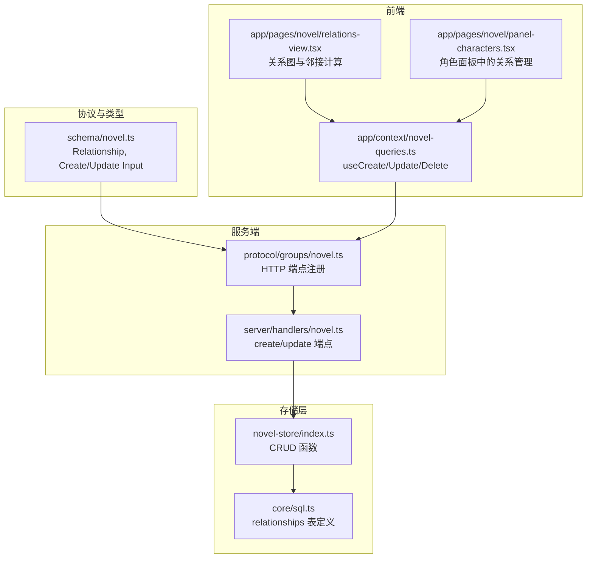
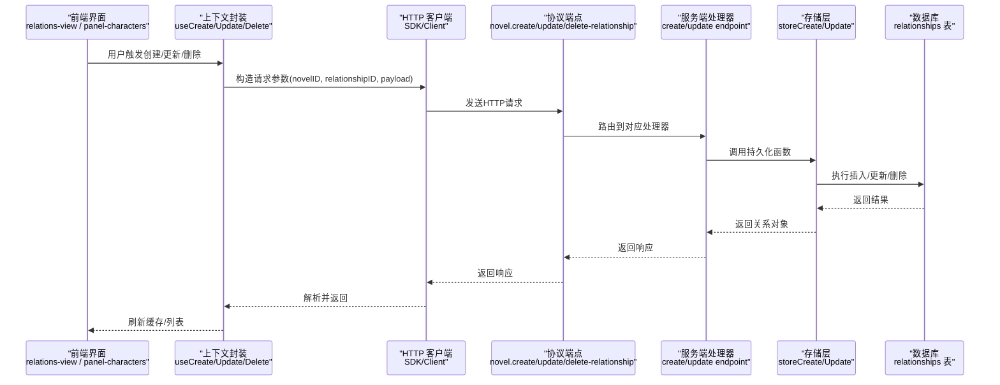
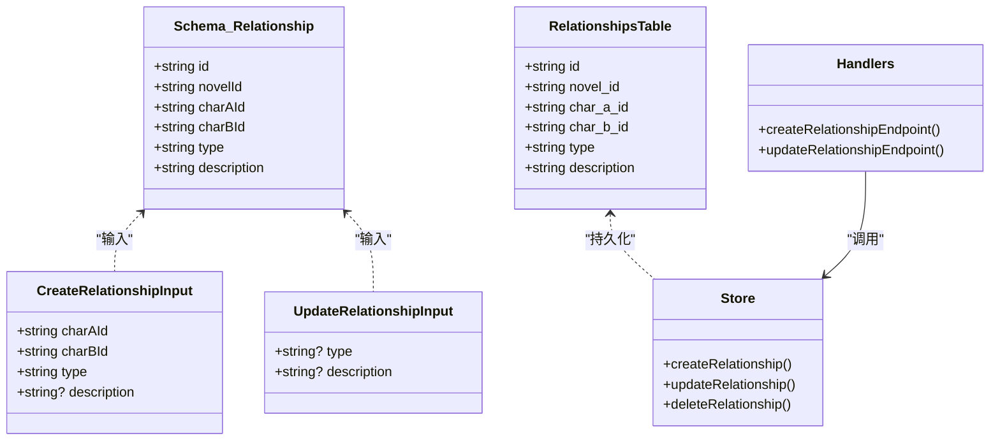
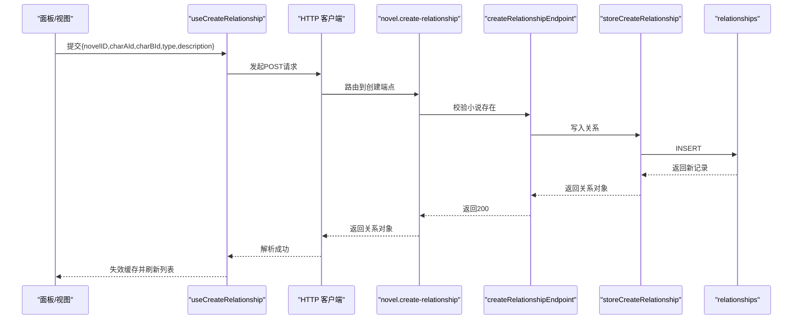
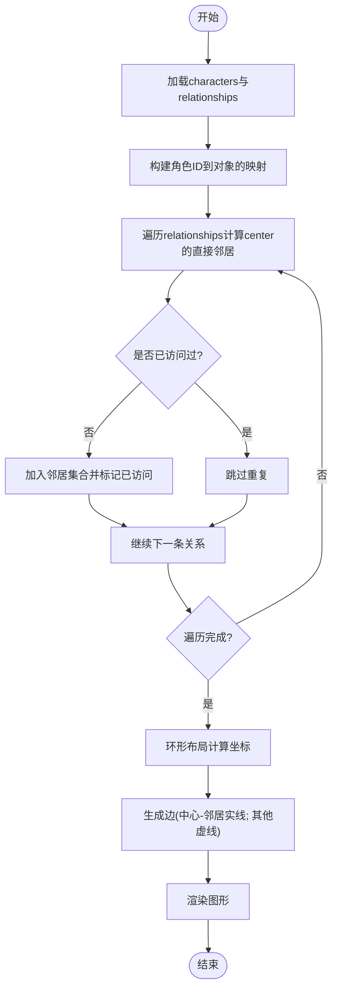
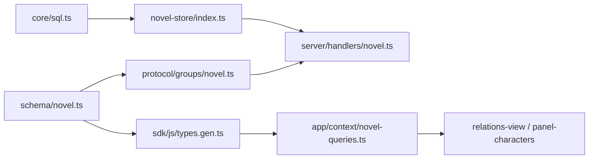

# 关系实体 (Relationship)

<cite>
**本文引用的文件**   
- [packages/schema/src/novel.ts](file://packages/schema/src/novel.ts)
- [packages/core/src/session/sql.ts](file://packages/core/src/session/sql.ts)
- [packages/novel-store/src/index.ts](file://packages/novel-store/src/index.ts)
- [packages/server/src/handlers/novel.ts](file://packages/server/src/handlers/novel.ts)
- [packages/protocol/src/groups/novel.ts](file://packages/protocol/src/groups/novel.ts)
- [packages/app/src/context/novel-queries.ts](file://packages/app/src/context/novel-queries.ts)
- [packages/app/src/pages/novel/relations-view.tsx](file://packages/app/src/pages/novel/relations-view.tsx)
- [packages/app/src/pages/novel/panel-characters.tsx](file://packages/app/src/pages/novel/panel-characters.tsx)
</cite>

## 目录
1. [简介](#简介)
2. [项目结构](#项目结构)
3. [核心组件](#核心组件)
4. [架构总览](#架构总览)
5. [详细组件分析](#详细组件分析)
6. [依赖分析](#依赖分析)
7. [性能考虑](#性能考虑)
8. [故障排查指南](#故障排查指南)
9. [结论](#结论)
10. [附录](#附录)

## 简介
本文件围绕 Relationship（关系）实体进行系统化文档化，覆盖字段语义、类型定义、角色对关联机制、在人物网络分析中的作用与图谱构建方法，以及创建、更新、查询的端到端流程。同时给出双向关系的处理策略与最佳实践，帮助读者在不深入代码细节的情况下也能正确使用和扩展该能力。

## 项目结构
Relationship 实体贯穿“协议定义 → 数据模型 → 存储表 → 服务端接口 → 前端交互”的全链路：
- 协议与类型：在 schema 中定义 Relationship、CreateRelationshipInput、UpdateRelationshipInput
- 数据库表：在 core/sql 与 novel-store 中定义 relationships 表结构与索引
- 服务端：在 server handlers 中实现 create/update/delete 等逻辑
- 协议路由：在 protocol groups 中声明 HTTP API 端点
- 前端：在 app context 提供 useMutation/useQuery 封装，并在 relations-view 与 panel-characters 中展示与操作

图表来源
- [packages/schema/src/novel.ts:144-152](file://packages/schema/src/novel.ts#L144-L152)
- [packages/core/src/session/sql.ts:313-334](file://packages/core/src/session/sql.ts#L313-L334)
- [packages/novel-store/src/index.ts:126-133](file://packages/novel-store/src/index.ts#L126-L133)
- [packages/server/src/handlers/novel.ts:876-901](file://packages/server/src/handlers/novel.ts#L876-L901)
- [packages/protocol/src/groups/novel.ts:496-532](file://packages/protocol/src/groups/novel.ts#L496-L532)
- [packages/app/src/context/novel-queries.ts:655-718](file://packages/app/src/context/novel-queries.ts#L655-L718)
- [packages/app/src/pages/novel/relations-view.tsx:75-151](file://packages/app/src/pages/novel/relations-view.tsx#L75-L151)
- [packages/app/src/pages/novel/panel-characters.tsx:568-690](file://packages/app/src/pages/novel/panel-characters.tsx#L568-L690)

章节来源
- [packages/schema/src/novel.ts:144-152](file://packages/schema/src/novel.ts#L144-L152)
- [packages/core/src/session/sql.ts:313-334](file://packages/core/src/session/sql.ts#L313-L334)
- [packages/novel-store/src/index.ts:126-133](file://packages/novel-store/src/index.ts#L126-L133)
- [packages/server/src/handlers/novel.ts:876-901](file://packages/server/src/handlers/novel.ts#L876-L901)
- [packages/protocol/src/groups/novel.ts:496-532](file://packages/protocol/src/groups/novel.ts#L496-L532)
- [packages/app/src/context/novel-queries.ts:655-718](file://packages/app/src/context/novel-queries.ts#L655-L718)
- [packages/app/src/pages/novel/relations-view.tsx:75-151](file://packages/app/src/pages/novel/relations-view.tsx#L75-L151)
- [packages/app/src/pages/novel/panel-characters.tsx:568-690](file://packages/app/src/pages/novel/panel-characters.tsx#L568-L690)

## 核心组件
- Relationship 数据模型
  - id：关系记录唯一标识
  - novelId：所属小说标识
  - charAId：关系起点角色标识
  - charBId：关系终点角色标识
  - type：关系类型（字符串），用于描述关系类别（如“朋友”“敌对”“亲属”等）
  - description：关系描述（可选），补充说明关系背景或细节
- 输入模型
  - CreateRelationshipInput：创建关系时必填 charAId、charBId、type；description 可选
  - UpdateRelationshipInput：更新关系时可更新 type、description
- 数据库表 relationships
  - 字段映射：id、novel_id、char_a_id、char_b_id、type、description
  - 外键约束：novel_id 引用 NovelTable.id；char_a_id、char_b_id 引用 CharacterTable.id，级联删除
  - 索引：novel_id、char_a_id、char_b_id 三列均建立索引，优化按小说与角色维度的查询

章节来源
- [packages/schema/src/novel.ts:144-152](file://packages/schema/src/novel.ts#L144-L152)
- [packages/schema/src/novel.ts:291-303](file://packages/schema/src/novel.ts#L291-L303)
- [packages/core/src/session/sql.ts:313-334](file://packages/core/src/session/sql.ts#L313-L334)
- [packages/novel-store/src/index.ts:126-133](file://packages/novel-store/src/index.ts#L126-L133)

## 架构总览
下图展示了从前端到数据库的关系 CRUD 调用链，以及关系数据如何被用于人物网络分析。

图表来源
- [packages/app/src/context/novel-queries.ts:655-718](file://packages/app/src/context/novel-queries.ts#L655-L718)
- [packages/protocol/src/groups/novel.ts:496-532](file://packages/protocol/src/groups/novel.ts#L496-L532)
- [packages/server/src/handlers/novel.ts:876-901](file://packages/server/src/handlers/novel.ts#L876-L901)
- [packages/novel-store/src/index.ts:620-647](file://packages/novel-store/src/index.ts#L620-L647)

## 详细组件分析

### 数据模型与字段语义
- id：全局唯一主键，用于定位具体关系记录
- novelId：限定关系归属的小说范围，确保多小说隔离
- charAId / charBId：无方向性语义，仅表示两个角色的关联；实际方向由 type 表达
- type：关系类型标签，支持自由文本；前端以标签形式展示，便于分类与筛选
- description：可选描述，用于补充关系背景、事件或状态变化

章节来源
- [packages/schema/src/novel.ts:144-152](file://packages/schema/src/novel.ts#L144-L152)
- [packages/core/src/session/sql.ts:313-334](file://packages/core/src/session/sql.ts#L313-L334)

### 数据库表设计与索引
- 表名：relationships
- 字段：id、novel_id、char_a_id、char_b_id、type、description
- 外键：novel_id→NovelTable.id；char_a_id、char_b_id→CharacterTable.id，onDelete cascade
- 索引：relationships_novel_id_idx、relationships_char_a_id_idx、relationships_char_b_id_idx
- 设计要点：
  - 通过双角色 ID 表示无向边，方向信息统一由 type 承载
  - 针对 novel_id 与角色维度查询建立索引，提升按小说与角色检索的性能
  - 级联删除保证数据一致性（删除角色或小说时自动清理相关关系）

章节来源
- [packages/core/src/session/sql.ts:313-334](file://packages/core/src/session/sql.ts#L313-L334)

### 存储层 CRUD 实现
- createRelationship：生成 id，写入 relationships 表，返回完整记录
- updateRelationship：按 id 更新 type/description，返回最新记录
- deleteRelationship：按 id 删除关系记录
- 事务与错误：上层 handler 负责校验小说存在性与权限，存储层专注数据一致性

章节来源
- [packages/novel-store/src/index.ts:620-647](file://packages/novel-store/src/index.ts#L620-L647)

### 服务端处理器与协议端点
- createRelationshipEndpoint：校验小说存在，调用 storeCreateRelationship，返回 Relationship
- updateRelationshipEndpoint：校验关系归属小说，调用 storeUpdateRelationship，返回 Relationship
- deleteRelationshipEndpoint：按 id 删除，返回 { deleted: boolean }
- 协议端点：
  - POST /api/novel/:novelID/relationships
  - PUT /api/novel/:novelID/relationships/:relationshipID
  - DELETE /api/novel/:novelID/relationships/:relationshipID

章节来源
- [packages/server/src/handlers/novel.ts:876-901](file://packages/server/src/handlers/novel.ts#L876-L901)
- [packages/protocol/src/groups/novel.ts:496-532](file://packages/protocol/src/groups/novel.ts#L496-L532)

### 前端交互与网络分析
- useCreateRelationship / useUpdateRelationship / useDeleteRelationship：封装 mutation，成功后失效关系列表缓存
- RelationsView：
  - 基于 relationships 计算每个角色的直接邻居与度数
  - 使用环形布局绘制中心角色与其邻接节点，非邻接边以虚线显示
  - 将多条 type 合并为边标签，增强可读性
- PanelCharacters：
  - 在角色面板内维护当前角色的关系集合
  - 提供添加/删除关系的交互表单，自动过滤候选目标角色

章节来源
- [packages/app/src/context/novel-queries.ts:655-718](file://packages/app/src/context/novel-queries.ts#L655-L718)
- [packages/app/src/pages/novel/relations-view.tsx:75-151](file://packages/app/src/pages/novel/relations-view.tsx#L75-L151)
- [packages/app/src/pages/novel/panel-characters.tsx:568-690](file://packages/app/src/pages/novel/panel-characters.tsx#L568-L690)

### 双向关系的处理策略
- 数据模型层面：charAId/charBId 是无序的角色对，不强制方向；方向语义由 type 表达
- 前端展示：
  - 邻接计算时根据 center.id 匹配另一端角色，避免重复
  - 同一对角色可能有多条关系（不同 type），边标签以“/”连接多个类型
- 推荐实践：
  - 若需严格有向关系，可在 type 中体现方向（如“喜欢→”“暗恋←”）
  - 若需去重，建议在业务层增加“同小说+同角色对+同类型”的唯一性校验（可通过新增唯一索引或应用层检查实现）

章节来源
- [packages/app/src/pages/novel/relations-view.tsx:75-151](file://packages/app/src/pages/novel/relations-view.tsx#L75-L151)
- [packages/app/src/pages/novel/panel-characters.tsx:568-690](file://packages/app/src/pages/novel/panel-characters.tsx#L568-L690)

### 类图（代码级关系）

图表来源
- [packages/schema/src/novel.ts:144-152](file://packages/schema/src/novel.ts#L144-L152)
- [packages/schema/src/novel.ts:291-303](file://packages/schema/src/novel.ts#L291-L303)
- [packages/core/src/session/sql.ts:313-334](file://packages/core/src/session/sql.ts#L313-L334)
- [packages/novel-store/src/index.ts:620-647](file://packages/novel-store/src/index.ts#L620-L647)
- [packages/server/src/handlers/novel.ts:876-901](file://packages/server/src/handlers/novel.ts#L876-L901)

### 序列图（创建关系）

图表来源
- [packages/app/src/context/novel-queries.ts:655-676](file://packages/app/src/context/novel-queries.ts#L655-L676)
- [packages/protocol/src/groups/novel.ts:496-505](file://packages/protocol/src/groups/novel.ts#L496-L505)
- [packages/server/src/handlers/novel.ts:876-886](file://packages/server/src/handlers/novel.ts#L876-L886)
- [packages/novel-store/src/index.ts:620-629](file://packages/novel-store/src/index.ts#L620-L629)

### 流程图（邻接计算与可视化）

图表来源
- [packages/app/src/pages/novel/relations-view.tsx:75-151](file://packages/app/src/pages/novel/relations-view.tsx#L75-L151)

## 依赖分析
- 模块耦合
  - schema 定义对外暴露的数据契约，被 protocol、sdk、前端共享
  - core/sql 与 novel-store 共同维护数据库表与持久化函数
  - server handlers 依赖 store 与 schema 进行校验与转换
  - 前端通过 SDK/Client 调用协议端点，并使用 context 封装的 mutations 管理缓存
- 外部依赖
  - Drizzle ORM：表定义与查询
  - Effect 库：服务端异步流控制
  - React Query：前端缓存与失效策略

图表来源
- [packages/schema/src/novel.ts:144-152](file://packages/schema/src/novel.ts#L144-L152)
- [packages/protocol/src/groups/novel.ts:496-532](file://packages/protocol/src/groups/novel.ts#L496-L532)
- [packages/core/src/session/sql.ts:313-334](file://packages/core/src/session/sql.ts#L313-L334)
- [packages/novel-store/src/index.ts:620-647](file://packages/novel-store/src/index.ts#L620-L647)
- [packages/server/src/handlers/novel.ts:876-901](file://packages/server/src/handlers/novel.ts#L876-L901)
- [packages/app/src/context/novel-queries.ts:655-718](file://packages/app/src/context/novel-queries.ts#L655-L718)

章节来源
- [packages/schema/src/novel.ts:144-152](file://packages/schema/src/novel.ts#L144-L152)
- [packages/protocol/src/groups/novel.ts:496-532](file://packages/protocol/src/groups/novel.ts#L496-L532)
- [packages/core/src/session/sql.ts:313-334](file://packages/core/src/session/sql.ts#L313-L334)
- [packages/novel-store/src/index.ts:620-647](file://packages/novel-store/src/index.ts#L620-L647)
- [packages/server/src/handlers/novel.ts:876-901](file://packages/server/src/handlers/novel.ts#L876-L901)
- [packages/app/src/context/novel-queries.ts:655-718](file://packages/app/src/context/novel-queries.ts#L655-L718)

## 性能考虑
- 索引优化：relationships 表对 novel_id、char_a_id、char_b_id 建立索引，显著提升按小说与角色维度的查询效率
- 前端计算：邻接计算采用 O(E) 复杂度（E 为关系数），使用 Map/Set 去重，避免重复遍历
- 缓存策略：mutation 成功后主动失效关系列表缓存，减少不必要的重新请求
- 建议：
  - 当关系规模较大时，可考虑分页或增量加载
  - 对高频查询（如某角色的直接邻居）可增加前端内存缓存或二次索引

[本节为通用指导，无需引用具体文件]

## 故障排查指南
- 常见错误
  - 小说不存在：创建/更新时需先校验小说存在，否则返回 NovelNotFoundError
  - 关系不属于指定小说：更新时需校验 relationship.novel_id 与传入 novelID 一致
  - 缺少必填字段：type 为空会导致无效请求
- 排查步骤
  - 检查协议端点参数是否正确传递（novelID、relationshipID、payload）
  - 查看服务端日志确认 handler 校验与 store 调用是否成功
  - 验证数据库外键约束是否导致级联删除异常
  - 前端缓存未刷新：确认 mutation onSuccess 中是否失效了正确的 queryKey

章节来源
- [packages/server/src/handlers/novel.ts:876-901](file://packages/server/src/handlers/novel.ts#L876-L901)
- [packages/protocol/src/groups/novel.ts:496-532](file://packages/protocol/src/groups/novel.ts#L496-L532)
- [packages/app/src/context/novel-queries.ts:655-718](file://packages/app/src/context/novel-queries.ts#L655-L718)

## 结论
Relationship 实体以简洁的无向边模型承载角色间关系，配合灵活的 type 与可选 description，既能满足基础的人物关系建模，也能支撑复杂的人物网络分析与可视化。通过完善的索引与前后端协作，系统在可扩展性与性能之间取得良好平衡。未来可根据业务需要引入更严格的唯一性约束或有向关系语义，进一步提升数据质量与分析能力。

[本节为总结性内容，无需引用具体文件]

## 附录

### 关系类型与示例
- 类型建议：使用简短明确的标签，如“朋友”“敌对”“亲属”“同事”“恋人”等
- 方向表达：如需方向，可在 type 中加入箭头或后缀，如“暗恋→”“仰慕←”
- 描述补充：在 description 中记录关键事件、时间或背景，便于后续分析

[本节为概念性内容，无需引用具体文件]

### 代码示例路径（不展示代码内容）
- 创建关系
  - 前端封装：[packages/app/src/context/novel-queries.ts:655-676](file://packages/app/src/context/novel-queries.ts#L655-L676)
  - 协议端点：[packages/protocol/src/groups/novel.ts:496-505](file://packages/protocol/src/groups/novel.ts#L496-L505)
  - 服务端处理器：[packages/server/src/handlers/novel.ts:876-886](file://packages/server/src/handlers/novel.ts#L876-L886)
  - 存储实现：[packages/novel-store/src/index.ts:620-629](file://packages/novel-store/src/index.ts#L620-L629)
- 更新关系
  - 前端封装：[packages/app/src/context/novel-queries.ts:678-698](file://packages/app/src/context/novel-queries.ts#L678-L698)
  - 协议端点：[packages/protocol/src/groups/novel.ts:507-518](file://packages/protocol/src/groups/novel.ts#L507-L518)
  - 服务端处理器：[packages/server/src/handlers/novel.ts:888-901](file://packages/server/src/handlers/novel.ts#L888-L901)
  - 存储实现：[packages/novel-store/src/index.ts:631-642](file://packages/novel-store/src/index.ts#L631-L642)
- 删除关系
  - 前端封装：[packages/app/src/context/novel-queries.ts:700-718](file://packages/app/src/context/novel-queries.ts#L700-L718)
  - 协议端点：[packages/protocol/src/groups/novel.ts:520-532](file://packages/protocol/src/groups/novel.ts#L520-L532)
  - 存储实现：[packages/novel-store/src/index.ts:644-647](file://packages/novel-store/src/index.ts#L644-L647)

章节来源
- [packages/app/src/context/novel-queries.ts:655-718](file://packages/app/src/context/novel-queries.ts#L655-L718)
- [packages/protocol/src/groups/novel.ts:496-532](file://packages/protocol/src/groups/novel.ts#L496-L532)
- [packages/server/src/handlers/novel.ts:876-901](file://packages/server/src/handlers/novel.ts#L876-L901)
- [packages/novel-store/src/index.ts:620-647](file://packages/novel-store/src/index.ts#L620-L647)