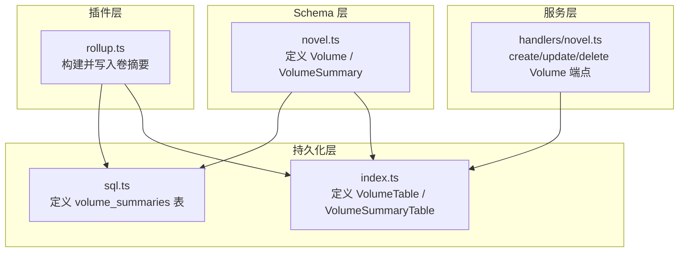
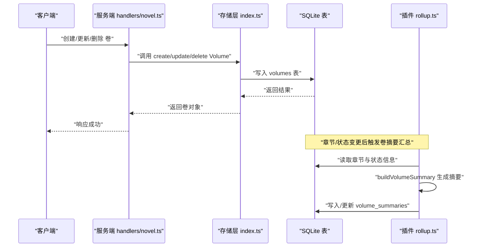
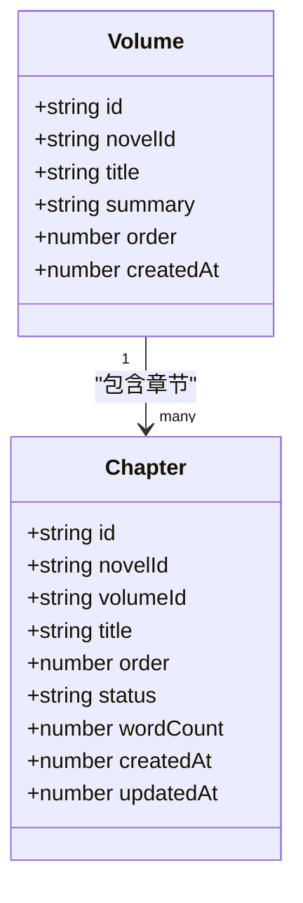
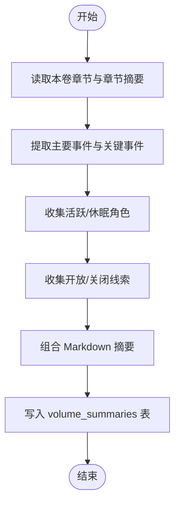
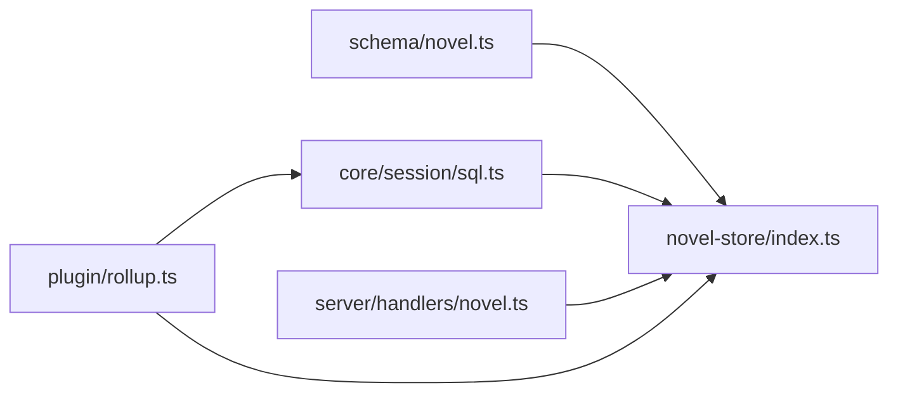

# 卷实体 (Volume)

<cite>
**本文引用的文件**   
- [packages/schema/src/novel.ts](file://packages/schema/src/novel.ts)
- [packages/core/src/session/sql.ts](file://packages/core/src/session/sql.ts)
- [packages/novel-store/src/index.ts](file://packages/novel-store/src/index.ts)
- [packages/server/src/handlers/novel.ts](file://packages/server/src/handlers/novel.ts)
- [packages/plugin/src/novel-writer/rollup.ts](file://packages/plugin/src/novel-writer/rollup.ts)
</cite>

## 目录
1. [简介](#简介)
2. [项目结构](#项目结构)
3. [核心组件](#核心组件)
4. [架构总览](#架构总览)
5. [详细组件分析](#详细组件分析)
6. [依赖关系分析](#依赖关系分析)
7. [性能考量](#性能考量)
8. [故障排查指南](#故障排查指南)
9. [结论](#结论)

## 简介
本文件围绕“卷（Volume）”实体进行系统化文档化，涵盖数据结构设计、摘要结构 VolumeSummary 的组织方式、卷在小说结构中的作用与章节/角色/线索的关联，以及创建、更新、删除等管理操作的实现路径与调用流程。读者无需深入代码即可理解卷的语义与使用方式。

## 项目结构
- 数据模型定义：位于 schema 层，统一描述 Volume、VolumeSummary、Chapter 等实体的字段与类型约束。
- 持久化表结构：core 与 novel-store 层分别定义了 SQLite 表结构与索引，确保卷与卷摘要的存储与查询效率。
- API 处理层：server 层的 handlers 暴露了卷的创建、更新、删除等接口，负责鉴权、参数校验与调用 store。
- 业务聚合与汇总：plugin 层的 rollup 逻辑根据章节与状态变化生成卷摘要，并写入卷摘要表。



**图表来源** 
- [packages/schema/src/novel.ts:40-59](file://packages/schema/src/novel.ts#L40-L59)
- [packages/core/src/session/sql.ts:412-426](file://packages/core/src/session/sql.ts#L412-L426)
- [packages/novel-store/src/index.ts:188-196](file://packages/novel-store/src/index.ts#L188-L196)
- [packages/server/src/handlers/novel.ts:770-798](file://packages/server/src/handlers/novel.ts#L770-L798)
- [packages/plugin/src/novel-writer/rollup.ts:416-483](file://packages/plugin/src/novel-writer/rollup.ts#L416-L483)

**章节来源**
- [packages/schema/src/novel.ts:40-72](file://packages/schema/src/novel.ts#L40-L72)
- [packages/core/src/session/sql.ts:412-426](file://packages/core/src/session/sql.ts#L412-L426)
- [packages/novel-store/src/index.ts:188-196](file://packages/novel-store/src/index.ts#L188-L196)
- [packages/server/src/handlers/novel.ts:770-798](file://packages/server/src/handlers/novel.ts#L770-L798)
- [packages/plugin/src/novel-writer/rollup.ts:416-483](file://packages/plugin/src/novel-writer/rollup.ts#L416-L483)

## 核心组件
- 卷实体 Volume
  - id：卷的唯一标识
  - novelId：所属小说标识
  - title：卷标题
  - summary：卷级摘要文本
  - order：卷在小说中的排序序号（非负整数）
  - createdAt：创建时间戳（毫秒）
- 卷摘要 VolumeSummary
  - id：摘要记录唯一标识
  - volumeId：关联的卷标识
  - summary：结构化摘要文本（Markdown）
  - charActive：活跃角色 ID 列表
  - charDormant：休眠角色 ID 列表
  - threadsOpen：开放线索 ID 列表
  - threadsClosed：已关闭线索 ID 列表
- 章节 Chapter（与卷的关系）
  - volumeId：可选，表示章节归属的卷；未归属时为空

这些字段共同支撑“按卷组织章节内容、追踪角色状态与线索进展”的小说结构设计。

**章节来源**
- [packages/schema/src/novel.ts:40-72](file://packages/schema/src/novel.ts#L40-L72)

## 架构总览
下图展示了从 API 到存储与汇总的完整链路：客户端通过服务端接口操作卷，服务端调用存储层完成持久化；同时，插件层基于章节与状态变更生成卷摘要并落库。



**图表来源** 
- [packages/server/src/handlers/novel.ts:770-798](file://packages/server/src/handlers/novel.ts#L770-L798)
- [packages/novel-store/src/index.ts:507-541](file://packages/novel-store/src/index.ts#L507-L541)
- [packages/plugin/src/novel-writer/rollup.ts:416-483](file://packages/plugin/src/novel-writer/rollup.ts#L416-L483)

## 详细组件分析

### 卷实体 Volume 的数据结构与设计
- 字段含义
  - id：全局唯一标识，用于跨模块引用与外键关联
  - novelId：归属小说，保证卷与小说的一对多关系
  - title：人类可读的卷名，便于导航与展示
  - summary：卷级摘要，供概览或导出使用
  - order：排序字段，决定卷在小说目录中的顺序
  - createdAt：审计与排序辅助字段
- 设计要点
  - 使用非负整数作为 order，避免负序导致排序异常
  - createdAt 为整型时间戳，便于范围查询与排序
  - 与 Chapter.volumeId 形成一对多关系，支持章节可归属或游离于卷之外



**图表来源** 
- [packages/schema/src/novel.ts:40-72](file://packages/schema/src/novel.ts#L40-L72)

**章节来源**
- [packages/schema/src/novel.ts:40-72](file://packages/schema/src/novel.ts#L40-L72)

### 卷摘要 VolumeSummary 的结构与组织
- 字段说明
  - id：摘要记录主键
  - volumeId：指向对应卷
  - summary：Markdown 格式的卷级摘要，包含主要事件、角色变化、线索进展三部分
  - charActive：活跃角色 ID 数组
  - charDormant：休眠角色 ID 数组
  - threadsOpen：开放线索 ID 数组
  - threadsClosed：已关闭线索 ID 数组
- 组织方式
  - 摘要文本由插件层 buildVolumeSummary 生成，依据章节摘要、关键事件、角色状态与线索状态综合构造
  - 字符与线索以 ID 数组形式存储，便于快速检索与统计
  - 通过 volume_id 索引提升按卷查询的性能



**图表来源** 
- [packages/plugin/src/novel-writer/rollup.ts:416-483](file://packages/plugin/src/novel-writer/rollup.ts#L416-L483)

**章节来源**
- [packages/schema/src/novel.ts:50-59](file://packages/schema/src/novel.ts#L50-L59)
- [packages/core/src/session/sql.ts:412-426](file://packages/core/src/session/sql.ts#L412-L426)
- [packages/novel-store/src/index.ts:188-196](file://packages/novel-store/src/index.ts#L188-L196)
- [packages/plugin/src/novel-writer/rollup.ts:416-483](file://packages/plugin/src/novel-writer/rollup.ts#L416-L483)

### 卷在小说结构中的作用
- 组织章节：Chapter.volumeId 将章节归入特定卷，便于分卷阅读与导航
- 角色发展：VolumeSummary.charActive/charDormant 反映本卷内角色的活跃与休眠状态，帮助作者把握角色节奏
- 线索推进：threadsOpen/threadsClosed 体现本卷内情节线索的状态变化，支撑悬念与收束的设计
- 摘要聚合：通过卷摘要提供高层概览，减少长篇小说的阅读与维护成本

**章节来源**
- [packages/schema/src/novel.ts:40-72](file://packages/schema/src/novel.ts#L40-L72)
- [packages/plugin/src/novel-writer/rollup.ts:416-483](file://packages/plugin/src/novel-writer/rollup.ts#L416-L483)

### 卷的创建、更新与管理（API 与实现）
- 创建卷
  - 入口：createVolumeEndpoint
  - 行为：校验小说存在性，计算下一个 order，插入 volumes 表，返回卷对象
- 更新卷
  - 入口：updateVolumeEndpoint
  - 行为：校验卷归属小说，选择性更新 title/summary，返回最新卷对象
- 删除卷
  - 入口：deleteVolumeEndpoint
  - 行为：校验卷归属小说，解除章节关联（volume_id 置空），删除卷记录

```mermaid
sequenceDiagram
participant Client as "客户端"
participant Handler as "handlers/novel.ts"
participant Store as "store index.ts"
participant DB as "SQLite"
Client->>Handler : "POST 创建卷"
Handler->>Handler : "校验 novelID"
Handler->>Store : "createVolume(novelId, title, summary)"
Store->>DB : "INSERT volumes"
DB-->>Store : "返回行"
Store-->>Handler : "返回卷对象"
Handler-->>Client : "200 成功"
Client->>Handler : "PUT 更新卷"
Handler->>Store : "updateVolume(volumeId, fields)"
Store->>DB : "UPDATE volumes"
DB-->>Store : "返回行"
Store-->>Handler : "返回卷对象"
Handler-->>Client : "200 成功"
Client->>Handler : "DELETE 删除卷"
Handler->>Store : "deleteVolume(volumeId)"
Store->>DB : "UPDATE chapters SET volume_id=null; DELETE volumes"
DB-->>Store : "完成"
Store-->>Handler : "{deleted : true}"
Handler-->>Client : "200 成功"
```

**图表来源** 
- [packages/server/src/handlers/novel.ts:770-798](file://packages/server/src/handlers/novel.ts#L770-L798)
- [packages/novel-store/src/index.ts:507-541](file://packages/novel-store/src/index.ts#L507-L541)

**章节来源**
- [packages/server/src/handlers/novel.ts:770-798](file://packages/server/src/handlers/novel.ts#L770-L798)
- [packages/novel-store/src/index.ts:507-541](file://packages/novel-store/src/index.ts#L507-L541)

## 依赖关系分析
- Schema 层对持久化层提供类型契约，确保字段一致性与约束
- 存储层直接操作 SQLite 表，维护 volumes 与 volume_summaries 的一致性
- 服务端 handlers 依赖存储层函数，封装权限校验与错误处理
- 插件层 rollup 依赖数据库视图与索引，高效生成并更新卷摘要



**图表来源** 
- [packages/schema/src/novel.ts:40-72](file://packages/schema/src/novel.ts#L40-L72)
- [packages/core/src/session/sql.ts:412-426](file://packages/core/src/session/sql.ts#L412-L426)
- [packages/novel-store/src/index.ts:188-196](file://packages/novel-store/src/index.ts#L188-L196)
- [packages/server/src/handlers/novel.ts:770-798](file://packages/server/src/handlers/novel.ts#L770-L798)
- [packages/plugin/src/novel-writer/rollup.ts:416-483](file://packages/plugin/src/novel-writer/rollup.ts#L416-L483)

**章节来源**
- [packages/schema/src/novel.ts:40-72](file://packages/schema/src/novel.ts#L40-L72)
- [packages/core/src/session/sql.ts:412-426](file://packages/core/src/session/sql.ts#L412-L426)
- [packages/novel-store/src/index.ts:188-196](file://packages/novel-store/src/index.ts#L188-L196)
- [packages/server/src/handlers/novel.ts:770-798](file://packages/server/src/handlers/novel.ts#L770-L798)
- [packages/plugin/src/novel-writer/rollup.ts:416-483](file://packages/plugin/src/novel-writer/rollup.ts#L416-L483)

## 性能考量
- 索引优化：volume_summaries 表针对 volume_id 建立索引，加速按卷查询与汇总
- 批量写入：卷摘要生成后一次性写入，减少频繁 I/O
- 排序策略：order 字段为非负整数，避免负值导致的排序异常与额外比较开销
- 关联解耦：删除卷时将章节的 volume_id 置空而非级联删除，降低级联删除带来的锁竞争

[本节为通用指导，不直接分析具体文件]

## 故障排查指南
- 常见错误
  - 小说不存在或卷不属于该小说：服务端会返回相应错误，检查 novelID 与 volumeID 的归属关系
  - 卷摘要未更新：确认插件层是否触发 rollup，检查 chapter 与 character/plot 状态变更是否被正确捕获
- 定位方法
  - 查看 handlers 的错误分支与日志
  - 检查 volume_summaries 表的索引与数据一致性
  - 验证 buildVolumeSummary 的输入（章节摘要、角色状态、线索状态）是否完整

**章节来源**
- [packages/server/src/handlers/novel.ts:770-798](file://packages/server/src/handlers/novel.ts#L770-L798)
- [packages/plugin/src/novel-writer/rollup.ts:416-483](file://packages/plugin/src/novel-writer/rollup.ts#L416-L483)

## 结论
卷（Volume）是小说结构的核心组织单元，通过明确的字段设计与摘要机制，有效串联章节、角色与线索，提升长篇创作的可维护性与可读性。服务端接口与存储层提供了稳健的 CRUD 能力，插件层则保障卷摘要的自动化生成与更新。遵循本文档的结构与最佳实践，可在复杂叙事中保持清晰的层次与稳定的性能。