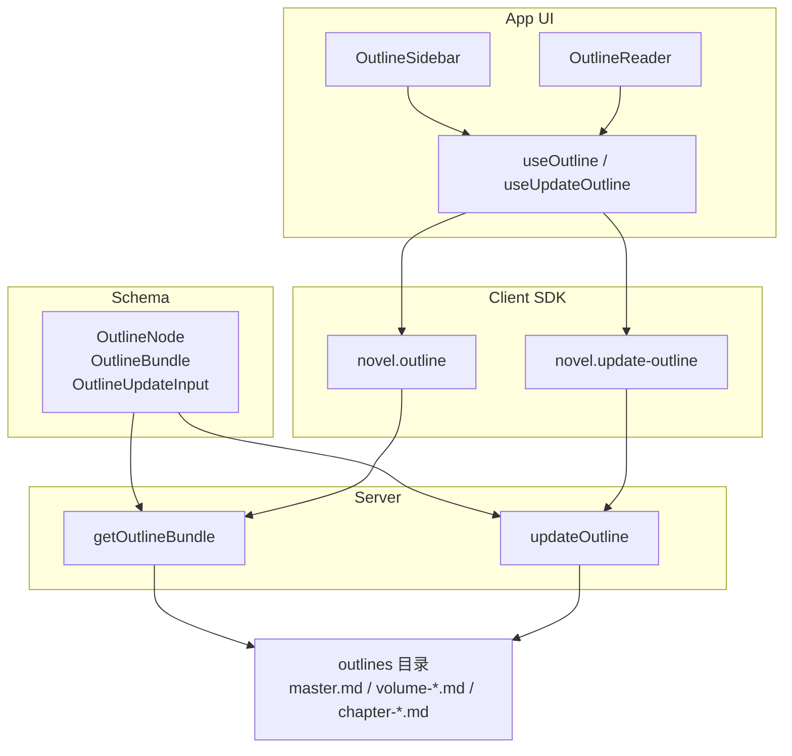
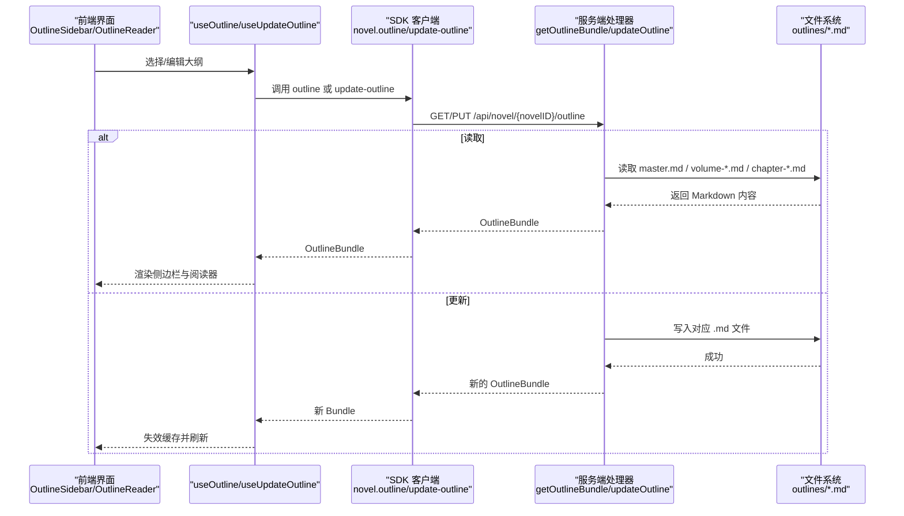
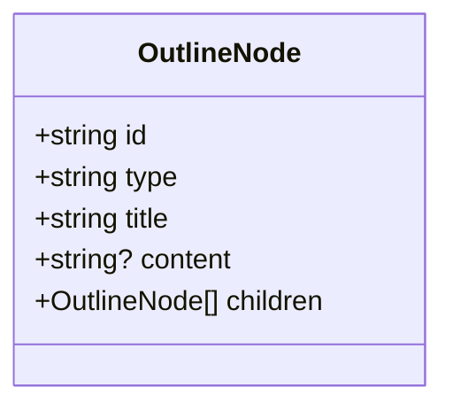
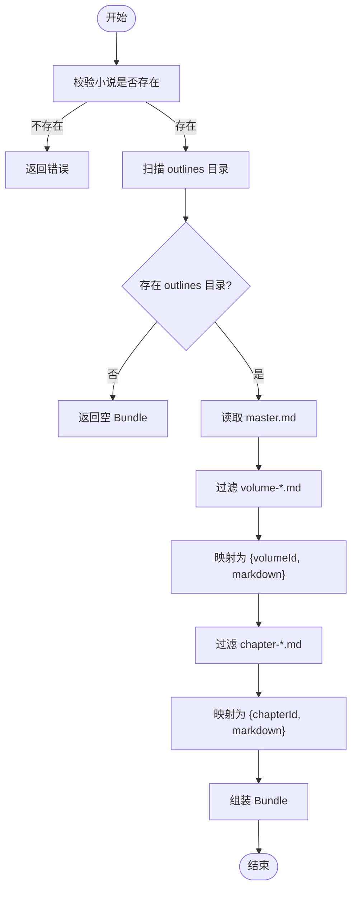
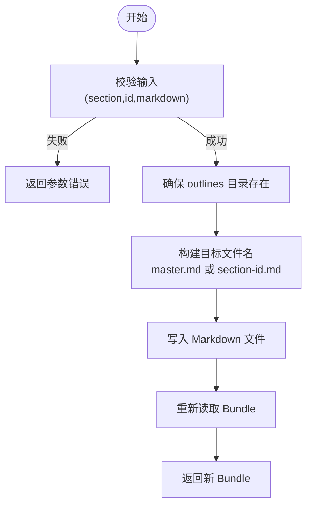
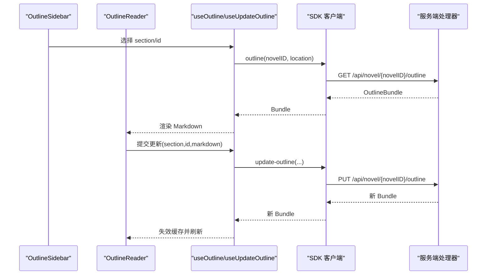
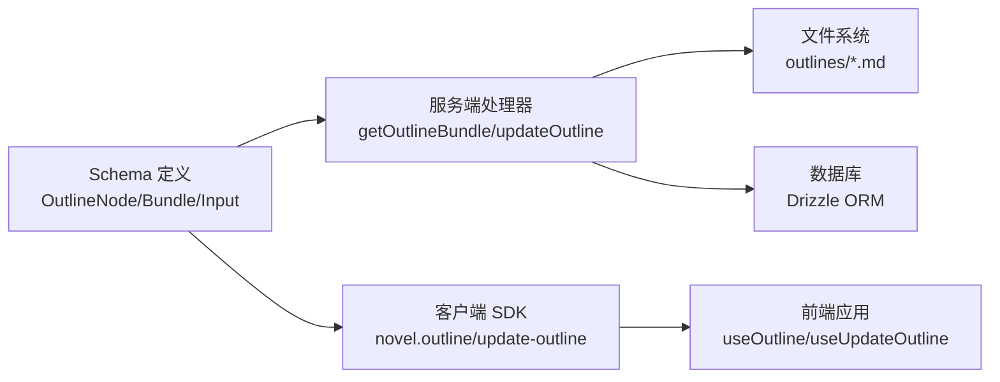

# 大纲实体

<cite>
**本文引用的文件**   
- [packages/schema/src/novel.ts](file://packages/schema/src/novel.ts)
- [packages/server/src/handlers/novel.ts](file://packages/server/src/handlers/novel.ts)
- [packages/app/src/context/novel-queries.ts](file://packages/app/src/context/novel-queries.ts)
- [packages/app/src/pages/novel/outline-sidebar.tsx](file://packages/app/src/pages/novel/outline-sidebar.tsx)
- [packages/app/src/pages/novel/outline-reader.tsx](file://packages/app/src/pages/novel/outline-reader.tsx)
- [packages/client/src/generated-effect/client.ts](file://packages/client/src/generated-effect/client.ts)
- [packages/opencode/src/server/routes/instance/httpapi/novel-reader.ts](file://packages/opencode/src/server/routes/instance/httpapi/novel-reader.ts)
- [packages/opencode/test/server/httpapi-exercise/index.ts](file://packages/opencode/test/server/httpapi-exercise/index.ts)
- [packages/server/test/novel.test.ts](file://packages/server/test/novel.test.ts)
</cite>

## 目录
1. [简介](#简介)
2. [项目结构](#项目结构)
3. [核心组件](#核心组件)
4. [架构总览](#架构总览)
5. [详细组件分析](#详细组件分析)
6. [依赖关系分析](#依赖关系分析)
7. [性能考虑](#性能考虑)
8. [故障排查指南](#故障排查指南)
9. [结论](#结论)
10. [附录：使用示例与最佳实践](#附录使用示例与最佳实践)

## 简介
本文件围绕“大纲”相关实体进行系统化文档化，重点覆盖以下三类数据结构与流程：
- OutlineNode（大纲节点）：递归式树形结构，用于表达 master/volume/chapter 的层级关系。
- OutlineBundle（大纲包）：以 Markdown 为载体的内容聚合，包含 master、volumes、chapters 三部分。
- OutlineUpdateInput（大纲更新输入）：统一的大纲变更输入模型，支持对 master、volume、chapter 的增量更新。

同时，文档将解释大纲包的读取与同步机制、更新操作的输入校验与变更处理，并提供创建、编辑、版本同步与批量更新的参考路径与调用序列图，帮助读者快速理解并正确使用该子系统。

## 项目结构
与大纲相关的代码分布在 schema 定义、服务端处理器、客户端 SDK/查询 Hook、以及前端页面中：
- Schema 层：定义 OutlineNode、OutlineBundle、OutlineUpdateInput 等类型约束。
- 服务端：提供 getOutlineBundle、updateOutline 等能力，直接读写 outlines 目录下的 Markdown 文件。
- 客户端 SDK：生成 HTTP API 调用封装，如 novel.outline、novel.update-outline。
- 前端应用：通过 useOutline/useUpdateOutline 等 Hook 发起请求、刷新缓存、渲染编辑器与侧边栏。

**图表来源** 
- [packages/schema/src/novel.ts:223-254](file://packages/schema/src/novel.ts#L223-L254)
- [packages/server/src/handlers/novel.ts:692-735](file://packages/server/src/handlers/novel.ts#L692-L735)
- [packages/client/src/generated-effect/client.ts:859-882](file://packages/client/src/generated-effect/client.ts#L859-L882)
- [packages/app/src/context/novel-queries.ts:194-229](file://packages/app/src/context/novel-queries.ts#L194-L229)

**章节来源**
- [packages/schema/src/novel.ts:223-254](file://packages/schema/src/novel.ts#L223-L254)
- [packages/server/src/handlers/novel.ts:692-735](file://packages/server/src/handlers/novel.ts#L692-L735)
- [packages/client/src/generated-effect/client.ts:859-882](file://packages/client/src/generated-effect/client.ts#L859-L882)
- [packages/app/src/context/novel-queries.ts:194-229](file://packages/app/src/context/novel-queries.ts#L194-L229)

## 核心组件
- OutlineNode（大纲节点）
  - 字段：id、type（"master" | "volume" | "chapter"）、title、content（可选）、children（递归数组）。
  - 设计要点：通过 children 实现任意深度的树形结构；type 限定节点语义；content 可承载简要摘要或富文本片段。
- OutlineBundle（大纲包）
  - 字段：master（字符串）、volumes（{ volumeId, markdown } 数组）、chapters（{ chapterId, markdown } 数组）。
  - 设计要点：以 Markdown 为持久化载体，按 section 维度组织；便于跨工具链与版本管理。
- OutlineUpdateInput（大纲更新输入）
  - 字段：section（"master" | "volume" | "chapter"）、id（可选，卷/章标识）、markdown（必填）。
  - 设计要点：统一入口，避免多接口分散；服务端根据 section/id 决定写入目标文件。

**章节来源**
- [packages/schema/src/novel.ts:223-254](file://packages/schema/src/novel.ts#L223-L254)

## 架构总览
下图展示从前端到后端的完整数据流，包括读取大纲包与更新大纲的流程。

**图表来源** 
- [packages/app/src/context/novel-queries.ts:194-229](file://packages/app/src/context/novel-queries.ts#L194-L229)
- [packages/client/src/generated-effect/client.ts:859-882](file://packages/client/src/generated-effect/client.ts#L859-L882)
- [packages/server/src/handlers/novel.ts:692-735](file://packages/server/src/handlers/novel.ts#L692-L735)

## 详细组件分析

### OutlineNode（大纲节点）
- 结构说明
  - id：唯一标识，用于定位节点。
  - type：限定为 master、volume、chapter，表示节点在大纲中的角色。
  - title：标题，用于展示与导航。
  - content：可选内容，可用于简短描述或结构化摘要。
  - children：子节点数组，支持无限深度嵌套，形成递归树。
- 复杂度与性能
  - 遍历/序列化时间复杂度 O(n)，n 为节点数。
  - 建议在前端按需加载与懒展开，避免一次性渲染超大树。
- 错误处理
  - 类型校验由 Schema 保证；若出现非法 type 或缺失 id，应在上游拦截。

**图表来源** 
- [packages/schema/src/novel.ts:223-230](file://packages/schema/src/novel.ts#L223-L230)

**章节来源**
- [packages/schema/src/novel.ts:223-230](file://packages/schema/src/novel.ts#L223-L230)

### OutlineBundle（大纲包）
- 结构说明
  - master：字符串，存放总纲 Markdown。
  - volumes：数组，每项包含 volumeId 与 markdown，对应卷级大纲。
  - chapters：数组，每项包含 chapterId 与 markdown，对应章级大纲。
- 存储约定
  - 服务端基于 outlines 目录扫描：
    - master.md 对应 master。
    - volume-{id}.md 对应 volumes。
    - chapter-{id}.md 对应 chapters。
- 读取流程
  - 校验小说存在性，扫描 outlines 目录，过滤并读取匹配文件，组装为 Bundle。

**图表来源** 
- [packages/server/src/handlers/novel.ts:692-718](file://packages/server/src/handlers/novel.ts#L692-L718)

**章节来源**
- [packages/server/src/handlers/novel.ts:692-718](file://packages/server/src/handlers/novel.ts#L692-L718)

### OutlineUpdateInput（大纲更新输入）
- 字段说明
  - section：目标段，"master"|"volume"|"chapter"。
  - id：当 section 为 volume 或 chapter 时必填，作为文件名后缀。
  - markdown：要写入的 Markdown 内容。
- 更新流程
  - 校验小说存在性，确保 outlines 目录存在（不存在则创建），根据 section/id 计算目标文件名并写入。
  - 成功后重新读取并返回最新 Bundle，以便前端刷新。

**图表来源** 
- [packages/server/src/handlers/novel.ts:720-735](file://packages/server/src/handlers/novel.ts#L720-L735)

**章节来源**
- [packages/server/src/handlers/novel.ts:720-735](file://packages/server/src/handlers/novel.ts#L720-L735)

### 前端交互与状态管理
- useOutline/useUpdateOutline
  - useOutline：获取 OutlineBundle，作为只读数据源。
  - useUpdateOutline：提交更新，成功后使能 queryKey 失效，触发重新拉取。
- OutlineSidebar
  - 展示 master、各卷及其章节的大纲条目，支持点击选中不同 section/id。
- OutlineReader
  - 渲染当前选中项的 Markdown，提供编辑模式与保存操作。

**图表来源** 
- [packages/app/src/context/novel-queries.ts:194-229](file://packages/app/src/context/novel-queries.ts#L194-L229)
- [packages/app/src/pages/novel/outline-sidebar.tsx:1-178](file://packages/app/src/pages/novel/outline-sidebar.tsx#L1-L178)
- [packages/app/src/pages/novel/outline-reader.tsx:1-77](file://packages/app/src/pages/novel/outline-reader.tsx#L1-L77)
- [packages/client/src/generated-effect/client.ts:859-882](file://packages/client/src/generated-effect/client.ts#L859-L882)
- [packages/server/src/handlers/novel.ts:692-735](file://packages/server/src/handlers/novel.ts#L692-L735)

**章节来源**
- [packages/app/src/context/novel-queries.ts:194-229](file://packages/app/src/context/novel-queries.ts#L194-L229)
- [packages/app/src/pages/novel/outline-sidebar.tsx:1-178](file://packages/app/src/pages/novel/outline-sidebar.tsx#L1-L178)
- [packages/app/src/pages/novel/outline-reader.tsx:1-77](file://packages/app/src/pages/novel/outline-reader.tsx#L1-L77)

## 依赖关系分析
- Schema 定义被服务端与客户端共同引用，确保类型一致。
- 服务端处理器直接依赖文件系统（fs）与数据库（Drizzle ORM）进行数据一致性校验与持久化。
- 客户端 SDK 自动生成 HTTP 调用方法，简化前端集成。
- 前端通过 React/Solid Hooks 管理状态与缓存失效，提升用户体验。

**图表来源** 
- [packages/schema/src/novel.ts:223-254](file://packages/schema/src/novel.ts#L223-L254)
- [packages/server/src/handlers/novel.ts:692-735](file://packages/server/src/handlers/novel.ts#L692-L735)
- [packages/client/src/generated-effect/client.ts:859-882](file://packages/client/src/generated-effect/client.ts#L859-L882)
- [packages/app/src/context/novel-queries.ts:194-229](file://packages/app/src/context/novel-queries.ts#L194-L229)

**章节来源**
- [packages/schema/src/novel.ts:223-254](file://packages/schema/src/novel.ts#L223-L254)
- [packages/server/src/handlers/novel.ts:692-735](file://packages/server/src/handlers/novel.ts#L692-L735)
- [packages/client/src/generated-effect/client.ts:859-882](file://packages/client/src/generated-effect/client.ts#L859-L882)
- [packages/app/src/context/novel-queries.ts:194-229](file://packages/app/src/context/novel-queries.ts#L194-L229)

## 性能考虑
- I/O 优化
  - 读取 Bundle 时仅扫描必要前缀的文件（volume-*.md、chapter-*.md），减少无关文件开销。
  - 建议在大数据量场景下对 outlines 目录做分页或增量同步。
- 前端渲染
  - 使用懒加载与虚拟滚动，避免一次性渲染大量 Markdown。
  - 对 HTML 输出进行安全清洗（如 sanitize），防止 XSS。
- 缓存策略
  - 使用 queryKey 精确失效，避免全量刷新。
  - 合理设置缓存过期时间，平衡实时性与性能。

[本节为通用指导，不直接分析具体文件]

## 故障排查指南
- 常见问题
  - 大纲包为空：检查 outlines 目录是否存在，确认 master.md/volume-*.md/chapter-*.md 命名是否符合约定。
  - 更新失败：确认 section/id/markdown 是否齐全且合法；检查目录权限与磁盘空间。
  - 前端未刷新：确认 onSuccess 中是否触发了 queryClient.invalidateQueries。
- 调试建议
  - 在服务端日志中打印 getOutlineBundle/updateOutline 的执行路径与结果。
  - 使用测试用例验证文件读写与 Bundle 组装逻辑。

**章节来源**
- [packages/server/test/novel.test.ts:340-353](file://packages/server/test/novel.test.ts#L340-L353)
- [packages/opencode/test/server/httpapi-exercise/index.ts:2018-2032](file://packages/opencode/test/server/httpapi-exercise/index.ts#L2018-L2032)

## 结论
OutlineNode、OutlineBundle、OutlineUpdateInput 构成了大纲系统的核心数据模型与操作契约。通过统一的输入模型与 Markdown 持久化方案，系统实现了灵活、可扩展的大纲管理能力。结合前端 Hook 与 SDK 封装，开发者可以高效地完成大纲的创建、编辑、同步与批量更新。

[本节为总结性内容，不直接分析具体文件]

## 附录：使用示例与最佳实践
- 创建大纲包（初始化 master）
  - 调用 updateOutline，section="master"，id 留空，markdown 填写总纲内容。
  - 参考路径：[packages/server/src/handlers/novel.ts:720-735](file://packages/server/src/handlers/novel.ts#L720-L735)
- 编辑卷/章大纲
  - 调用 updateOutline，section="volume"/"chapter"，id 为卷/章标识，markdown 为新内容。
  - 参考路径：[packages/app/src/context/novel-queries.ts:204-229](file://packages/app/src/context/novel-queries.ts#L204-L229)
- 版本同步（读取最新 Bundle）
  - 调用 outline 接口获取最新 Bundle，用于展示与对比。
  - 参考路径：[packages/client/src/generated-effect/client.ts:859-867](file://packages/client/src/generated-effect/client.ts#L859-L867)
- 批量更新
  - 循环调用 updateOutline 对多个 section/id 进行更新，注意控制并发与错误重试。
  - 参考路径：[packages/server/src/handlers/novel.ts:720-735](file://packages/server/src/handlers/novel.ts#L720-L735)
- 最佳实践
  - 保持 Markdown 结构清晰，合理使用标题与列表。
  - 在前端对 HTML 输出进行安全清洗，避免注入风险。
  - 使用 queryKey 精准失效，避免不必要的重渲染。

**章节来源**
- [packages/server/src/handlers/novel.ts:720-735](file://packages/server/src/handlers/novel.ts#L720-L735)
- [packages/app/src/context/novel-queries.ts:204-229](file://packages/app/src/context/novel-queries.ts#L204-L229)
- [packages/client/src/generated-effect/client.ts:859-882](file://packages/client/src/generated-effect/client.ts#L859-L882)