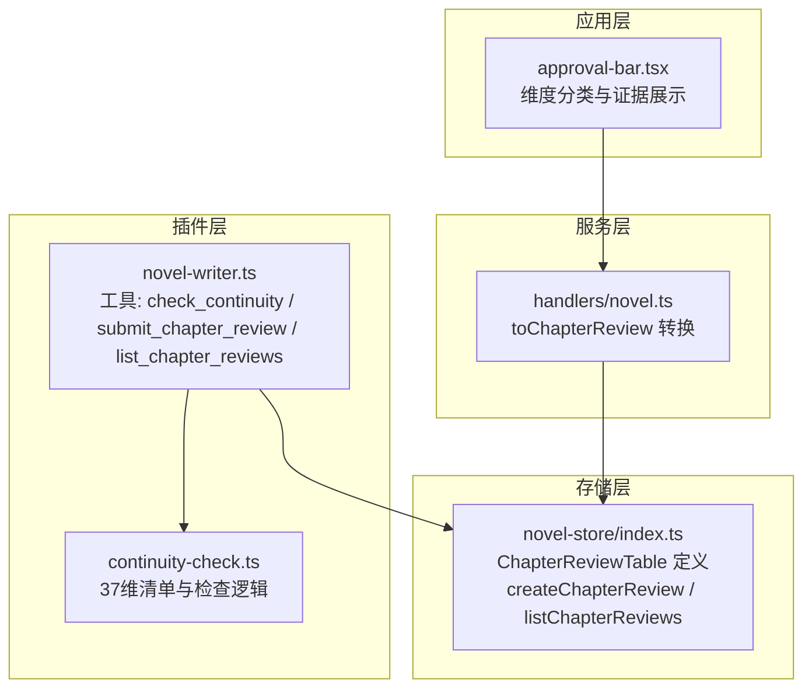
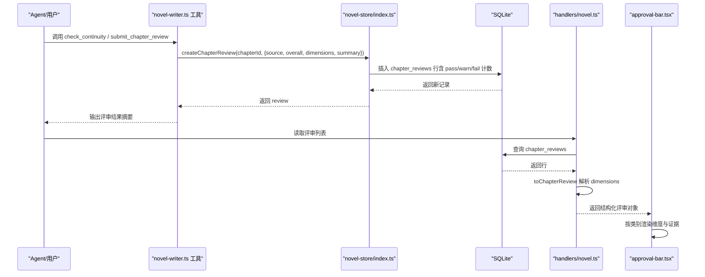
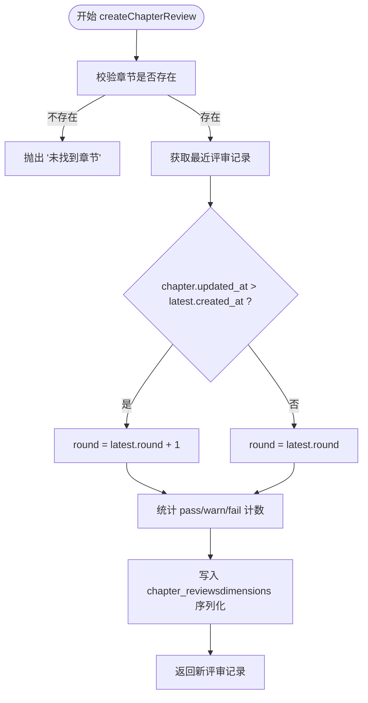
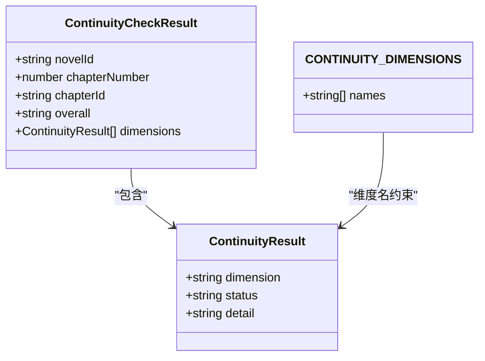
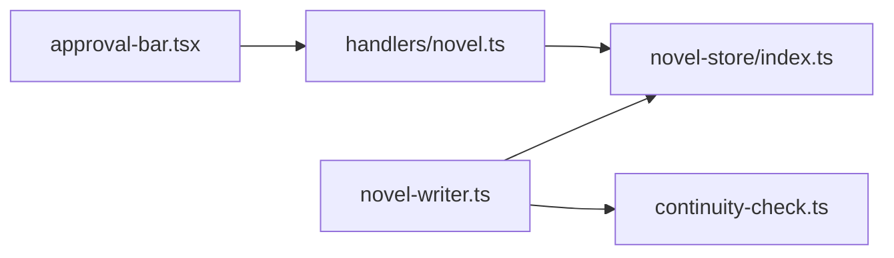

# 审查系统实体

<cite>
**本文引用的文件**   
- [packages/novel-store/src/index.ts](file://packages/novel-store/src/index.ts)
- [packages/plugin/src/novel-writer.ts](file://packages/plugin/src/novel-writer.ts)
- [packages/plugin/src/novel-writer/continuity-check.ts](file://packages/plugin/src/novel-writer/continuity-check.ts)
- [packages/server/src/handlers/novel.ts](file://packages/server/src/handlers/novel.ts)
- [packages/app/src/pages/novel/approval-bar.tsx](file://packages/app/src/pages/novel/approval-bar.tsx)
- [packages/plugin/test/novel-writer/review.test.ts](file://packages/plugin/test/novel-writer/review.test.ts)
- [packages/server/test/novel.test.ts](file://packages/server/test/novel.test.ts)
</cite>

## 目录
1. [简介](#简介)
2. [项目结构](#项目结构)
3. [核心组件](#核心组件)
4. [架构总览](#架构总览)
5. [详细组件分析](#详细组件分析)
6. [依赖关系分析](#依赖关系分析)
7. [性能考量](#性能考量)
8. [故障排查指南](#故障排查指南)
9. [结论](#结论)
10. [附录：使用示例与最佳实践](#附录使用示例与最佳实践)

## 简介
本文件围绕 ReviewDimension（审查维度）与 ChapterReview（章节审查）两个核心实体，系统化阐述审查系统的结构化设计、数据模型、存储与分析机制，以及多轮审查的支持方式。重点包括：
- ReviewDimension 的字段语义：dimension、status（PASS/WARN/FAIL）、detail、evidence
- ChapterReview 的整体审查结果：round（轮次）、source（来源：deterministic/auditor/human）、overall 评分、passCount/warnCount/failCount 统计、dimensions 数组与 summary 总结
- 评审记录的创建、查询、分析与报告生成流程
- 多轮评审的自动推导规则与触发条件

## 项目结构
审查系统涉及以下关键模块与职责：
- 数据存储与表定义：novel-store（SQLite + Drizzle ORM）
- 连续性检查与维度清单：plugin/novel-writer/continuity-check.ts
- 工具层与调用入口：plugin/novel-writer.ts（check_continuity、submit_chapter_review、list_chapter_reviews 等）
- 服务端接口转换：server/src/handlers/novel.ts（toChapterReview 将数据库行转换为 API 对象）
- 前端展示：app/src/pages/novel/approval-bar.tsx（按类别渲染维度与证据）
- 测试用例：review.test.ts、server/test/novel.test.ts（覆盖 round 推导、计数、排序、解析 dimensions）

**图表来源** 
- [packages/plugin/src/novel-writer.ts:770-850](file://packages/plugin/src/novel-writer.ts#L770-L850)
- [packages/plugin/src/novel-writer/continuity-check.ts:61-112](file://packages/plugin/src/novel-writer/continuity-check.ts#L61-L112)
- [packages/novel-store/src/index.ts:99-114](file://packages/novel-store/src/index.ts#L99-L114)
- [packages/server/src/handlers/novel.ts:139-159](file://packages/server/src/handlers/novel.ts#L139-L159)
- [packages/app/src/pages/novel/approval-bar.tsx:154-209](file://packages/app/src/pages/novel/approval-bar.tsx#L154-L209)

**章节来源**
- [packages/novel-store/src/index.ts:99-114](file://packages/novel-store/src/index.ts#L99-L114)
- [packages/plugin/src/novel-writer.ts:770-850](file://packages/plugin/src/novel-writer.ts#L770-L850)
- [packages/plugin/src/novel-writer/continuity-check.ts:61-112](file://packages/plugin/src/novel-writer/continuity-check.ts#L61-L112)
- [packages/server/src/handlers/novel.ts:139-159](file://packages/server/src/handlers/novel.ts#L139-L159)
- [packages/app/src/pages/novel/approval-bar.tsx:154-209](file://packages/app/src/pages/novel/approval-bar.tsx#L154-L209)

## 核心组件
- ReviewDimension（审查维度）
  - dimension：维度名称（来自 37 维清单）
  - status：状态枚举 PASS | WARN | FAIL
  - detail：具体说明（通过原因/潜在风险/矛盾点）
  - evidence：可选证据（引用章节中的具体内容）
- ChapterReview（章节审查记录）
  - id：主键
  - chapter_id：关联章节
  - round：轮次（自动推导）
  - source：来源 deterministic | auditor | human
  - overall：总体评估 PASS | WARN | FAIL
  - pass_count / warn_count / fail_count：按 dimensions 统计
  - dimensions：JSON 数组（ReviewDimension[]）
  - summary：总结文本
  - session_id：会话标识（可选）
  - created_at：创建时间戳

**章节来源**
- [packages/novel-store/src/index.ts:99-114](file://packages/novel-store/src/index.ts#L99-L114)
- [packages/novel-store/src/index.ts:957-962](file://packages/novel-store/src/index.ts#L957-L962)
- [packages/server/src/handlers/novel.ts:139-159](file://packages/server/src/handlers/novel.ts#L139-L159)

## 架构总览
审查系统的数据流与调用链如下：
- 确定性检查（deterministic）：由 continuity-check.ts 执行 37 维检查，返回整体结果与维度列表；插件层通过 check_continuity 工具写入评审记录
- 审计提交（auditor）：审计 Agent 完成深度审计后，通过 submit_chapter_review 工具提交结构化评审结果
- 人工审批（human）：人工直接提交评审（可无 dimensions），用于驳回或确认
- 存储与查询：createChapterReview 自动推导 round 并持久化；listChapterReviews 按创建时间倒序返回
- 展示与消费：服务端 toChapterReview 将 JSON 字符串反序列化为 dimensions 数组供前端消费；前端按类别分组展示并通过颜色区分状态

**图表来源** 
- [packages/plugin/src/novel-writer.ts:770-850](file://packages/plugin/src/novel-writer.ts#L770-L850)
- [packages/novel-store/src/index.ts:968-1009](file://packages/novel-store/src/index.ts#L968-L1009)
- [packages/server/src/handlers/novel.ts:139-159](file://packages/server/src/handlers/novel.ts#L139-L159)
- [packages/app/src/pages/novel/approval-bar.tsx:154-209](file://packages/app/src/pages/novel/approval-bar.tsx#L154-L209)

## 详细组件分析

### ReviewDimension（审查维度）
- 字段与约束
  - dimension：必须为 37 维清单中的名称（由 submit_chapter_review 校验）
  - status：枚举 PASS | WARN | FAIL
  - detail：必填，描述通过/警告/失败的原因
  - evidence：可选，提供证据片段
- 用途
  - 作为 ChapterReview.dimensions 的元素，支撑多维度审查与可视化
- 复杂度
  - 单条维度对象 O(1)，统计 pass/warn/fail 时遍历数组 O(n)

**章节来源**
- [packages/novel-store/src/index.ts:957-962](file://packages/novel-store/src/index.ts#L957-L962)
- [packages/plugin/src/novel-writer.ts:803-848](file://packages/plugin/src/novel-writer.ts#L803-L848)
- [packages/plugin/src/novel-writer/continuity-check.ts:61-112](file://packages/plugin/src/novel-writer/continuity-check.ts#L61-L112)

### ChapterReview（章节审查记录）
- 字段与语义
  - round：轮次自动推导
    - 首次评审 round=1
    - 若最新评审的 created_at < chapter.updated_at，则开启新轮（round+1）
    - 否则并入当前轮（保持 round 不变）
  - source：deterministic（确定性检查）、auditor（审计 Agent）、human（人工）
  - overall：PASS | WARN | FAIL
  - pass_count / warn_count / fail_count：基于 dimensions 统计
  - dimensions：JSON 字符串序列化 ReviewDimension[]
  - summary：总结文本
  - session_id：可选，关联会话
- 存储与查询
  - 插入：createChapterReview 计算 round 与计数，写入 chapter_reviews
  - 查询：listChapterReviews 按 created_at 倒序返回
- 错误处理
  - 章节不存在时抛出“未找到章节”异常

**图表来源** 
- [packages/novel-store/src/index.ts:968-1009](file://packages/novel-store/src/index.ts#L968-L1009)

**章节来源**
- [packages/novel-store/src/index.ts:968-1009](file://packages/novel-store/src/index.ts#L968-L1009)
- [packages/plugin/test/novel-writer/review.test.ts:67-133](file://packages/plugin/test/novel-writer/review.test.ts#L67-L133)

### 37 维清单与连续性检查
- 维度清单 CONTINUITY_DIMENSIONS：包含角色、关系、时间线、地点、剧情、世界观、风格、逻辑、细节九大类共 37 项
- 检查流程
  - 并行查询小说相关元数据（章节、角色、关系、伏笔、风格指南等）
  - 逐类执行启发式检查，汇总各维度结果
  - 整体判定：有 FAIL → FAIL；有 WARN 且无 FAIL → WARN；全 PASS → PASS
- 集成到评审
  - checkContinuity 返回 chapterId 与 dimensions，插件层将其持久化为 deterministic 评审

**图表来源** 
- [packages/plugin/src/novel-writer/continuity-check.ts:34-59](file://packages/plugin/src/novel-writer/continuity-check.ts#L34-L59)
- [packages/plugin/src/novel-writer/continuity-check.ts:61-112](file://packages/plugin/src/novel-writer/continuity-check.ts#L61-L112)

**章节来源**
- [packages/plugin/src/novel-writer/continuity-check.ts:149-232](file://packages/plugin/src/novel-writer/continuity-check.ts#L149-L232)
- [packages/plugin/src/novel-writer/continuity-check.ts:61-112](file://packages/plugin/src/novel-writer/continuity-check.ts#L61-L112)

### 工具层与调用入口
- check_continuity：执行 37 维检查并自动写入 deterministic 评审
- submit_chapter_review：审计提交，校验维度名称在 37 维清单中，写入 auditor 评审
- list_chapter_reviews：读取评审记录，限制数量，格式化输出

**章节来源**
- [packages/plugin/src/novel-writer.ts:770-850](file://packages/plugin/src/novel-writer.ts#L770-L850)
- [packages/plugin/src/novel-writer.ts:803-848](file://packages/plugin/src/novel-writer.ts#L803-L848)
- [packages/plugin/src/novel-writer.ts:1093-1130](file://packages/plugin/src/novel-writer.ts#L1093-L1130)

### 服务端接口转换
- toChapterReview：将数据库行转换为 API 对象，解析 dimensions 为数组，映射字段命名（如 pass_count → passCount）

**章节来源**
- [packages/server/src/handlers/novel.ts:139-159](file://packages/server/src/handlers/novel.ts#L139-L159)

### 前端展示
- approval-bar.tsx：按类别分组显示维度，根据 status 着色，展示 detail 与 evidence

**章节来源**
- [packages/app/src/pages/novel/approval-bar.tsx:154-209](file://packages/app/src/pages/novel/approval-bar.tsx#L154-L209)

## 依赖关系分析
- 插件层依赖 novelty-store 进行数据读写
- 插件层依赖 continuity-check 提供维度清单与检查逻辑
- 服务端 handler 依赖 novelty-store 的表结构与类型推断
- 前端依赖服务端返回的结构化评审对象

**图表来源** 
- [packages/plugin/src/novel-writer.ts:770-850](file://packages/plugin/src/novel-writer.ts#L770-L850)
- [packages/novel-store/src/index.ts:968-1009](file://packages/novel-store/src/index.ts#L968-L1009)
- [packages/plugin/src/novel-writer/continuity-check.ts:61-112](file://packages/plugin/src/novel-writer/continuity-check.ts#L61-L112)
- [packages/server/src/handlers/novel.ts:139-159](file://packages/server/src/handlers/novel.ts#L139-L159)
- [packages/app/src/pages/novel/approval-bar.tsx:154-209](file://packages/app/src/pages/novel/approval-bar.tsx#L154-L209)

**章节来源**
- [packages/plugin/src/novel-writer.ts:770-850](file://packages/plugin/src/novel-writer.ts#L770-L850)
- [packages/novel-store/src/index.ts:968-1009](file://packages/novel-store/src/index.ts#L968-L1009)
- [packages/plugin/src/novel-writer/continuity-check.ts:61-112](file://packages/plugin/src/novel-writer/continuity-check.ts#L61-L112)
- [packages/server/src/handlers/novel.ts:139-159](file://packages/server/src/handlers/novel.ts#L139-L159)
- [packages/app/src/pages/novel/approval-bar.tsx:154-209](file://packages/app/src/pages/novel/approval-bar.tsx#L154-L209)

## 性能考量
- 查询优化
  - listChapterReviews 使用 created_at 倒序索引，保证分页与排序效率
- 存储格式
  - dimensions 以 JSON 字符串存储，避免额外表结构，但需客户端解析
- 并发检查
  - continuity-check 并行查询多个表，减少 I/O 等待
- 建议
  - 对频繁访问的评审记录增加缓存层（如内存缓存或 Redis）
  - 大章节评审的 dimensions 数组较大时，考虑分页或按需加载

[本节为通用指导，不直接分析具体文件]

## 故障排查指南
- 常见错误
  - “未找到章节”：传入的 chapterId 不存在
  - 维度名称无效：submit_chapter_review 校验失败，需确保在 37 维清单中
  - dimensions 解析失败：list_chapter_reviews 内部尝试 JSON.parse，失败时回退为空数组
- 定位步骤
  - 检查 chapter_reviews 表是否有对应记录
  - 核对 source、overall、dimensions 是否符合预期
  - 查看 round 推导是否正确（比较 chapter.updated_at 与 latest.created_at）

**章节来源**
- [packages/novel-store/src/index.ts:968-1009](file://packages/novel-store/src/index.ts#L968-L1009)
- [packages/plugin/src/novel-writer.ts:1093-1130](file://packages/plugin/src/novel-writer.ts#L1093-L1130)
- [packages/plugin/test/novel-writer/review.test.ts:116-133](file://packages/plugin/test/novel-writer/review.test.ts#L116-L133)

## 结论
审查系统通过 ReviewDimension 与 ChapterReview 实现了结构化、可追溯的多维度章节审查。其核心优势包括：
- 明确的维度清单与状态枚举，便于统一处理与展示
- 自动轮次推导，支持内容变更后的新一轮评审
- 多来源评审（deterministic/auditor/human）并存，便于混合工作流
- 清晰的存储与查询机制，支持高效分析与报告生成

## 附录：使用示例与最佳实践
- 创建评审（代码路径参考）
  - 确定性检查：check_continuity 工具调用后自动写入评审
    - [packages/plugin/src/novel-writer.ts:770-850](file://packages/plugin/src/novel-writer.ts#L770-L850)
  - 审计提交：submit_chapter_review 工具提交结构化评审
    - [packages/plugin/src/novel-writer.ts:803-848](file://packages/plugin/src/novel-writer.ts#L803-L848)
  - 直接调用存储层：createChapterReview
    - [packages/novel-store/src/index.ts:968-1009](file://packages/novel-store/src/index.ts#L968-L1009)
- 查询评审（代码路径参考）
  - listChapterReviews 按创建时间倒序返回
    - [packages/novel-store/src/index.ts:1011-1023](file://packages/novel-store/src/index.ts#L1011-L1023)
  - 服务端 toChapterReview 解析 dimensions
    - [packages/server/src/handlers/novel.ts:139-159](file://packages/server/src/handlers/novel.ts#L139-L159)
- 展示与交互（代码路径参考）
  - 前端按类别渲染维度与证据
    - [packages/app/src/pages/novel/approval-bar.tsx:154-209](file://packages/app/src/pages/novel/approval-bar.tsx#L154-L209)
- 测试用例（代码路径参考）
  - 轮次推导、计数、排序、dimensions 解析
    - [packages/plugin/test/novel-writer/review.test.ts:67-151](file://packages/plugin/test/novel-writer/review.test.ts#L67-L151)
    - [packages/server/test/novel.test.ts:229-266](file://packages/server/test/novel.test.ts#L229-L266)

**章节来源**
- [packages/plugin/src/novel-writer.ts:770-850](file://packages/plugin/src/novel-writer.ts#L770-L850)
- [packages/novel-store/src/index.ts:968-1023](file://packages/novel-store/src/index.ts#L968-L1023)
- [packages/server/src/handlers/novel.ts:139-159](file://packages/server/src/handlers/novel.ts#L139-L159)
- [packages/app/src/pages/novel/approval-bar.tsx:154-209](file://packages/app/src/pages/novel/approval-bar.tsx#L154-L209)
- [packages/plugin/test/novel-writer/review.test.ts:67-151](file://packages/plugin/test/novel-writer/review.test.ts#L67-L151)
- [packages/server/test/novel.test.ts:229-266](file://packages/server/test/novel.test.ts#L229-L266)