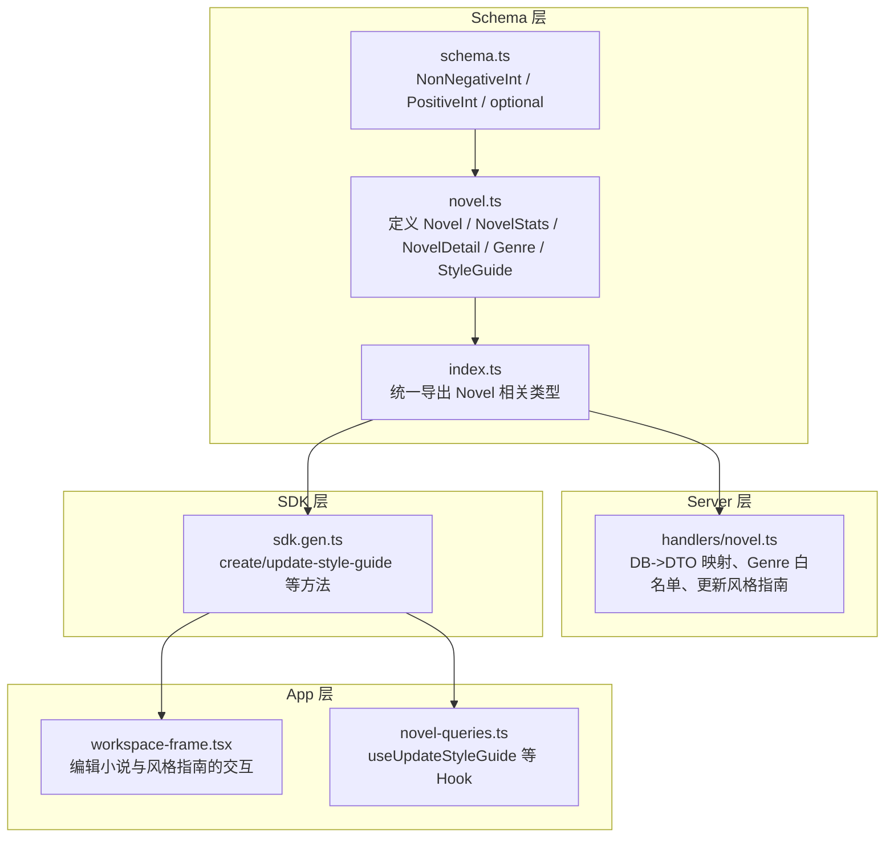
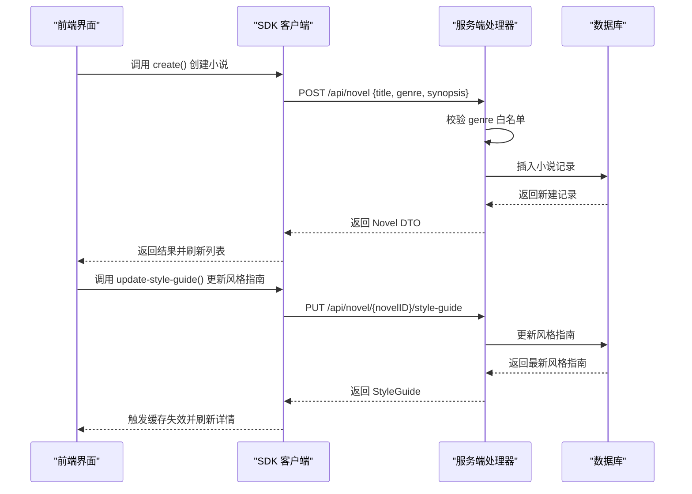
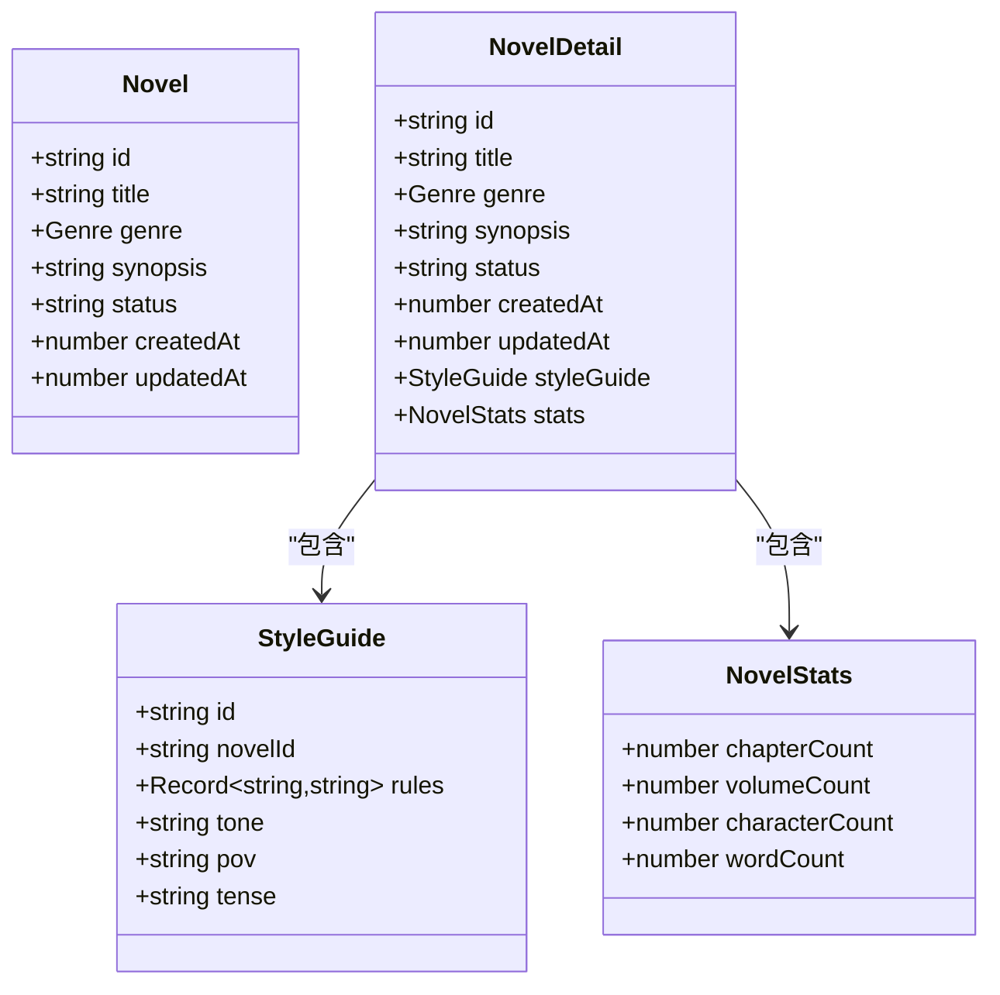
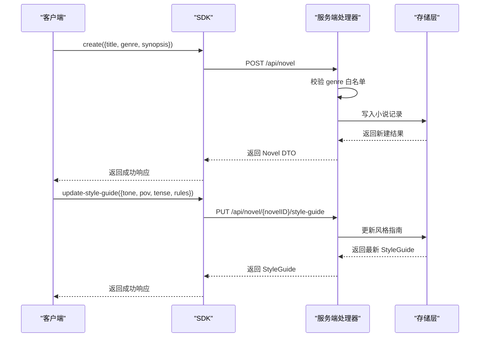
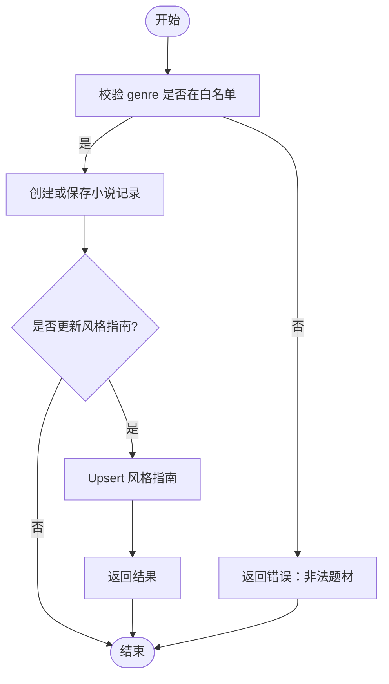
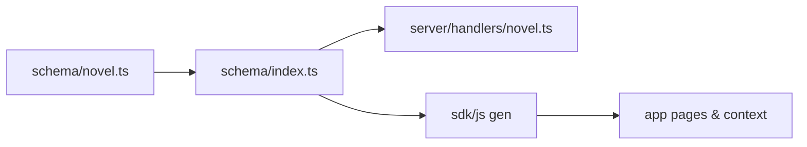

# 小说实体（Novel）

<cite>
**本文引用的文件**   
- [packages/schema/src/novel.ts](file://packages/schema/src/novel.ts)
- [packages/schema/src/schema.ts](file://packages/schema/src/schema.ts)
- [packages/schema/src/index.ts](file://packages/schema/src/index.ts)
- [packages/server/src/handlers/novel.ts](file://packages/server/src/handlers/novel.ts)
- [packages/sdk/js/src/v2/gen/sdk.gen.ts](file://packages/sdk/js/src/v2/gen/sdk.gen.ts)
- [packages/app/src/pages/novel/workspace-frame.tsx](file://packages/app/src/pages/novel/workspace-frame.tsx)
- [packages/app/src/context/novel-queries.ts](file://packages/app/src/context/novel-queries.ts)
</cite>

## 目录
1. [简介](#简介)
2. [项目结构](#项目结构)
3. [核心组件](#核心组件)
4. [架构总览](#架构总览)
5. [详细组件分析](#详细组件分析)
6. [依赖关系分析](#依赖关系分析)
7. [性能考量](#性能考量)
8. [故障排查指南](#故障排查指南)
9. [结论](#结论)
10. [附录：接口定义与使用示例](#附录接口定义与使用示例)

## 简介
本文件围绕 Novel（小说）实体进行系统化文档化，重点包括：
- 数据结构设计：id、title、genre、synopsis、status、createdAt、updatedAt 等字段的含义与约束
- Genre 枚举类型支持的文学流派：玄幻、都市、仙侠、历史、科幻、悬疑、言情、游戏
- NovelStats 统计信息结构：章节数、卷数、角色数、字数
- NovelDetail 扩展结构：包含 StyleGuide 风格指南与统计数据
- TypeScript 接口定义与最佳实践：创建、更新、查询操作

该文档面向开发者与产品/运营人员，既提供代码级细节，也给出易于理解的使用说明。

## 项目结构
与 Novel 实体相关的核心定义集中在 schema 包中，并通过 barrel 导出供其他包消费；服务端处理器负责数据映射与校验；SDK 生成客户端调用方法；前端页面与上下文封装了常用操作。

图表来源
- [packages/schema/src/novel.ts:1-38](file://packages/schema/src/novel.ts#L1-L38)
- [packages/schema/src/schema.ts:1-31](file://packages/schema/src/schema.ts#L1-L31)
- [packages/schema/src/index.ts:1-30](file://packages/schema/src/index.ts#L1-L30)
- [packages/server/src/handlers/novel.ts:63-93](file://packages/server/src/handlers/novel.ts#L63-L93)
- [packages/sdk/js/src/v2/gen/sdk.gen.ts:7156-7192](file://packages/sdk/js/src/v2/gen/sdk.gen.ts#L7156-L7192)
- [packages/app/src/pages/novel/workspace-frame.tsx:103-150](file://packages/app/src/pages/novel/workspace-frame.tsx#L103-L150)
- [packages/app/src/context/novel-queries.ts:809-837](file://packages/app/src/context/novel-queries.ts#L809-L837)

章节来源
- [packages/schema/src/novel.ts:1-38](file://packages/schema/src/novel.ts#L1-L38)
- [packages/schema/src/index.ts:1-30](file://packages/schema/src/index.ts#L1-L30)

## 核心组件
- Genre 枚举：限定小说题材为固定集合
- Novel：基础小说实体
- NovelStats：统计信息
- NovelDetail：扩展详情（含 StyleGuide 与 stats）
- StyleGuide：风格指南（语气、视角、时态、规则）

章节来源
- [packages/schema/src/novel.ts:5-38](file://packages/schema/src/novel.ts#L5-L38)
- [packages/schema/src/novel.ts:187-195](file://packages/schema/src/novel.ts#L187-L195)

## 架构总览
下图展示了从 Schema 定义到服务端处理、SDK 调用以及前端使用的整体流程。

图表来源
- [packages/sdk/js/src/v2/gen/sdk.gen.ts:7156-7192](file://packages/sdk/js/src/v2/gen/sdk.gen.ts#L7156-L7192)
- [packages/sdk/js/src/v2/gen/sdk.gen.ts:8724-8795](file://packages/sdk/js/src/v2/gen/sdk.gen.ts#L8724-L8795)
- [packages/server/src/handlers/novel.ts:63-93](file://packages/server/src/handlers/novel.ts#L63-L93)
- [packages/server/src/handlers/novel.ts:1043-1051](file://packages/server/src/handlers/novel.ts#L1043-L1051)

## 详细组件分析

### Genre 枚举类型
- 支持值：玄幻、都市、仙侠、历史、科幻、悬疑、言情、游戏
- 用途：限制小说题材，确保一致性
- 在服务端存在白名单校验，避免非法值进入系统

章节来源
- [packages/schema/src/novel.ts:5-6](file://packages/schema/src/novel.ts#L5-L6)
- [packages/server/src/handlers/novel.ts:63-65](file://packages/server/src/handlers/novel.ts#L63-L65)

### Novel 实体字段与约束
- id：字符串标识
- title：小说标题
- genre：题材，受 Genre 枚举约束
- synopsis：简介
- status：状态（字符串，具体取值由业务约定）
- createdAt：创建时间戳（整数）
- updatedAt：更新时间戳（整数）

章节来源
- [packages/schema/src/novel.ts:8-17](file://packages/schema/src/novel.ts#L8-L17)

### NovelStats 统计信息
- chapterCount：章节数（非负整数）
- volumeCount：卷数（非负整数）
- characterCount：角色数（非负整数）
- wordCount：总字数（非负整数）

章节来源
- [packages/schema/src/novel.ts:19-25](file://packages/schema/src/novel.ts#L19-L25)
- [packages/schema/src/schema.ts:3-4](file://packages/schema/src/schema.ts#L3-L4)

### NovelDetail 扩展结构
- 包含 Novel 的全部基础字段
- styleGuide：风格指南（通过延迟引用 StyleGuide）
- stats：统计信息（NovelStats）

章节来源
- [packages/schema/src/novel.ts:27-38](file://packages/schema/src/novel.ts#L27-L38)
- [packages/schema/src/novel.ts:187-195](file://packages/schema/src/novel.ts#L187-L195)

### StyleGuide 风格指南
- id：标识
- novelId：关联的小说 ID
- rules：规则字典（键值对字符串）
- tone：语气
- pov：视角
- tense：时态

章节来源
- [packages/schema/src/novel.ts:187-195](file://packages/schema/src/novel.ts#L187-L195)

### 类图：核心数据结构关系

图表来源
- [packages/schema/src/novel.ts:8-17](file://packages/schema/src/novel.ts#L8-L17)
- [packages/schema/src/novel.ts:19-25](file://packages/schema/src/novel.ts#L19-L25)
- [packages/schema/src/novel.ts:27-38](file://packages/schema/src/novel.ts#L27-L38)
- [packages/schema/src/novel.ts:187-195](file://packages/schema/src/novel.ts#L187-L195)

### 序列图：创建小说与更新风格指南

图表来源
- [packages/sdk/js/src/v2/gen/sdk.gen.ts:7156-7192](file://packages/sdk/js/src/v2/gen/sdk.gen.ts#L7156-L7192)
- [packages/sdk/js/src/v2/gen/sdk.gen.ts:8724-8795](file://packages/sdk/js/src/v2/gen/sdk.gen.ts#L8724-L8795)
- [packages/server/src/handlers/novel.ts:63-93](file://packages/server/src/handlers/novel.ts#L63-L93)
- [packages/server/src/handlers/novel.ts:1043-1051](file://packages/server/src/handlers/novel.ts#L1043-L1051)

### 流程图：Genre 校验与更新风格指南逻辑

图表来源
- [packages/server/src/handlers/novel.ts:63-93](file://packages/server/src/handlers/novel.ts#L63-L93)
- [packages/server/src/handlers/novel.ts:1043-1051](file://packages/server/src/handlers/novel.ts#L1043-L1051)

## 依赖关系分析
- Schema 层仅依赖 effect，作为单一真实数据源
- Server 层依赖 Schema 定义进行 DTO 映射与校验
- SDK 层根据 OpenAPI 生成客户端方法，调用服务端接口
- App 层通过 SDK 和 React Query/Hook 管理状态与缓存

图表来源
- [packages/schema/src/novel.ts:1-38](file://packages/schema/src/novel.ts#L1-L38)
- [packages/schema/src/index.ts:1-30](file://packages/schema/src/index.ts#L1-L30)
- [packages/server/src/handlers/novel.ts:63-93](file://packages/server/src/handlers/novel.ts#L63-L93)
- [packages/sdk/js/src/v2/gen/sdk.gen.ts:7156-7192](file://packages/sdk/js/src/v2/gen/sdk.gen.ts#L7156-L7192)
- [packages/app/src/pages/novel/workspace-frame.tsx:103-150](file://packages/app/src/pages/novel/workspace-frame.tsx#L103-L150)

章节来源
- [packages/schema/src/index.ts:1-30](file://packages/schema/src/index.ts#L1-L30)

## 性能考量
- 使用 NonNegativeInt/PositiveInt 在 Schema 层保证数值合法性，减少后端校验开销
- NovelDetail 中的 styleGuide 使用延迟引用，避免循环依赖带来的解析成本
- 前端更新风格指南后主动失效相关查询缓存，提升响应速度

[本节为通用指导，不直接分析具体文件]

## 故障排查指南
- 题材非法：检查传入的 genre 是否在白名单内（玄幻、都市、仙侠、历史、科幻、悬疑、言情、游戏）
- 风格指南未更新：确认请求体包含必要字段（tone/pov/tense/rules），并确保 novelID 正确
- 缓存不一致：更新成功后需使相关查询失效，确保前端显示最新数据

章节来源
- [packages/server/src/handlers/novel.ts:63-65](file://packages/server/src/handlers/novel.ts#L63-L65)
- [packages/app/src/context/novel-queries.ts:809-837](file://packages/app/src/context/novel-queries.ts#L809-L837)

## 结论
Novel 实体以 Effect Schema 为核心，严格约束数据类型与取值范围，配合服务端的白名单校验与 SDK 生成的客户端方法，形成端到端的一致性保障。NovelDetail 将风格指南与统计信息聚合，便于前端展示与编辑。遵循本文的最佳实践可显著提升开发效率与系统稳定性。

[本节为总结性内容，不直接分析具体文件]

## 附录：接口定义与使用示例

### TypeScript 接口定义（路径引用）
- Novel：[packages/schema/src/novel.ts:8-17](file://packages/schema/src/novel.ts#L8-L17)
- NovelStats：[packages/schema/src/novel.ts:19-25](file://packages/schema/src/novel.ts#L19-L25)
- NovelDetail：[packages/schema/src/novel.ts:27-38](file://packages/schema/src/novel.ts#L27-L38)
- StyleGuide：[packages/schema/src/novel.ts:187-195](file://packages/schema/src/novel.ts#L187-L195)
- Genre：[packages/schema/src/novel.ts:5-6](file://packages/schema/src/novel.ts#L5-L6)

### 创建小说（Create）
- 输入：title、genre、synopsis
- 调用：SDK 的 create 方法
- 参考：[packages/sdk/js/src/v2/gen/sdk.gen.ts:7156-7192](file://packages/sdk/js/src/v2/gen/sdk.gen.ts#L7156-L7192)

### 更新风格指南（Update StyleGuide）
- 输入：tone、pov、tense、rules
- 调用：SDK 的 update-style-guide 方法
- 参考：[packages/sdk/js/src/v2/gen/sdk.gen.ts:8724-8795](file://packages/sdk/js/src/v2/gen/sdk.gen.ts#L8724-L8795)

### 查询与编辑（前端最佳实践）
- 编辑小说基本信息与风格指南的交互流程
- 参考：[packages/app/src/pages/novel/workspace-frame.tsx:103-150](file://packages/app/src/pages/novel/workspace-frame.tsx#L103-L150)
- 更新风格指南后失效相关查询缓存
- 参考：[packages/app/src/context/novel-queries.ts:809-837](file://packages/app/src/context/novel-queries.ts#L809-L837)

### 服务端映射与校验
- DB->DTO 映射与 Genre 白名单校验
- 参考：[packages/server/src/handlers/novel.ts:63-93](file://packages/server/src/handlers/novel.ts#L63-L93)
- 更新风格指南端点实现
- 参考：[packages/server/src/handlers/novel.ts:1043-1051](file://packages/server/src/handlers/novel.ts#L1043-L1051)