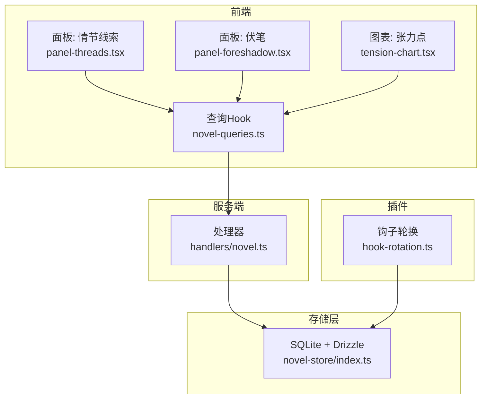
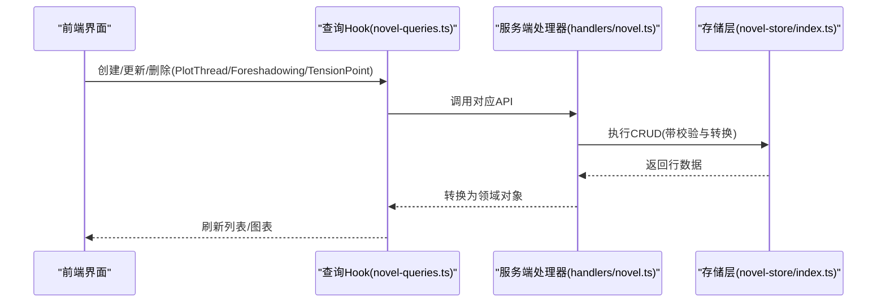
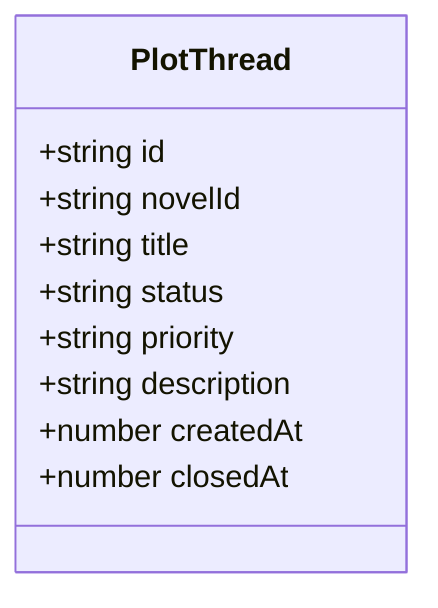
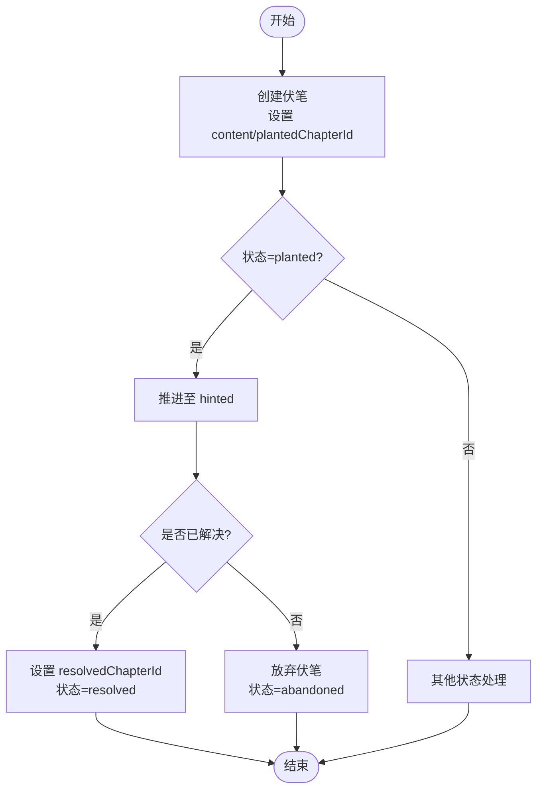
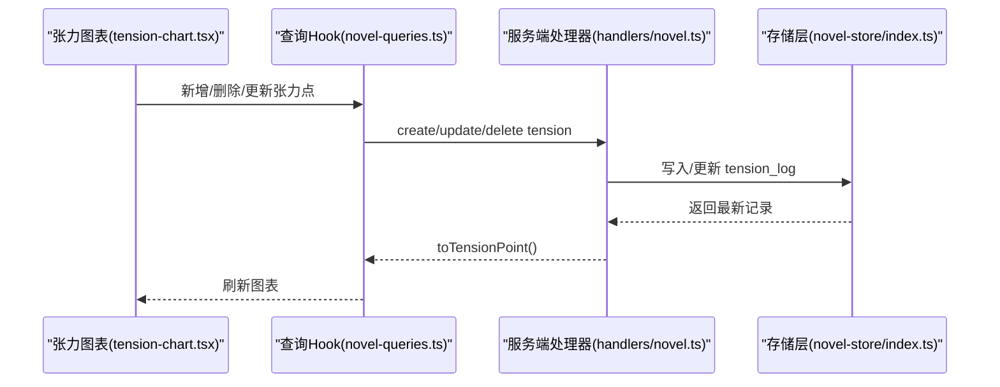
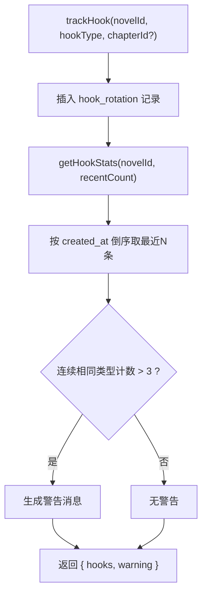
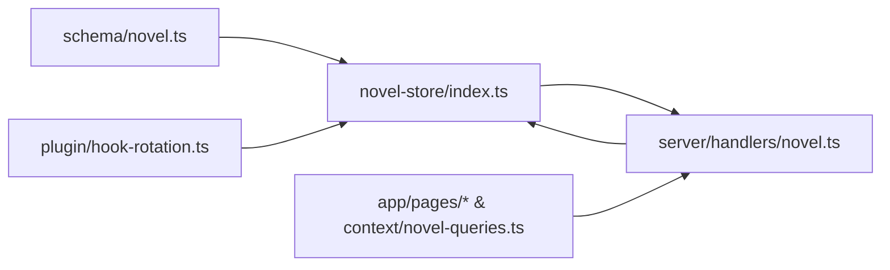

# 情节管理实体

<cite>
**本文引用的文件**   
- [packages/schema/src/novel.ts](file://packages/schema/src/novel.ts)
- [packages/novel-store/src/index.ts](file://packages/novel-store/src/index.ts)
- [packages/server/src/handlers/novel.ts](file://packages/server/src/handlers/novel.ts)
- [packages/app/src/pages/novel/panel-threads.tsx](file://packages/app/src/pages/novel/panel-threads.tsx)
- [packages/app/src/pages/novel/panel-foreshadow.tsx](file://packages/app/src/pages/novel/panel-foreshadow.tsx)
- [packages/app/src/pages/novel/tension-chart.tsx](file://packages/app/src/pages/novel/tension-chart.tsx)
- [packages/app/src/context/novel-queries.ts](file://packages/app/src/context/novel-queries.ts)
- [packages/plugin/src/novel-writer/hook-rotation.ts](file://packages/plugin/src/novel-writer/hook-rotation.ts)
- [packages/plugin/test/novel-writer/scale.test.ts](file://packages/plugin/test/novel-writer/scale.test.ts)
</cite>

## 目录
1. [简介](#简介)
2. [项目结构](#项目结构)
3. [核心实体与数据结构](#核心实体与数据结构)
4. [架构总览](#架构总览)
5. [详细组件分析](#详细组件分析)
6. [依赖关系分析](#依赖关系分析)
7. [性能考量](#性能考量)
8. [故障排查指南](#故障排查指南)
9. [结论](#结论)
10. [附录：最佳实践与示例](#附录最佳实践与示例)

## 简介
本文件围绕 PlotThread（情节线索）、Foreshadowing（伏笔）、TensionPoint（张力点）、HookRotation（悬念轮换）四类情节管理实体，系统梳理其数据结构、状态与生命周期、业务规则以及前后端交互流程。文档同时给出可视化图示与代码级引用路径，帮助读者快速理解并正确使用这些能力。

## 项目结构
- 类型定义集中在 schema 层，确保跨端一致的数据契约。
- 存储层使用 SQLite + Drizzle ORM，提供表结构与索引。
- 服务端处理器封装 CRUD 操作与校验逻辑。
- 前端页面负责数据展示与用户交互，并通过 SDK/查询 Hook 调用服务端接口。
- 插件侧提供钩子轮换统计与审计能力。

**图示来源** 
- [packages/app/src/pages/novel/panel-threads.tsx](file://packages/app/src/pages/novel/panel-threads.tsx)
- [packages/app/src/pages/novel/panel-foreshadow.tsx](file://packages/app/src/pages/novel/panel-foreshadow.tsx)
- [packages/app/src/pages/novel/tension-chart.tsx](file://packages/app/src/pages/novel/tension-chart.tsx)
- [packages/app/src/context/novel-queries.ts](file://packages/app/src/context/novel-queries.ts)
- [packages/server/src/handlers/novel.ts](file://packages/server/src/handlers/novel.ts)
- [packages/novel-store/src/index.ts](file://packages/novel-store/src/index.ts)
- [packages/plugin/src/novel-writer/hook-rotation.ts](file://packages/plugin/src/novel-writer/hook-rotation.ts)

**章节来源**
- [packages/schema/src/novel.ts](file://packages/schema/src/novel.ts)
- [packages/novel-store/src/index.ts](file://packages/novel-store/src/index.ts)
- [packages/server/src/handlers/novel.ts](file://packages/server/src/handlers/novel.ts)
- [packages/app/src/pages/novel/panel-threads.tsx](file://packages/app/src/pages/novel/panel-threads.tsx)
- [packages/app/src/pages/novel/panel-foreshadow.tsx](file://packages/app/src/pages/novel/panel-foreshadow.tsx)
- [packages/app/src/pages/novel/tension-chart.tsx](file://packages/app/src/pages/novel/tension-chart.tsx)
- [packages/app/src/context/novel-queries.ts](file://packages/app/src/context/novel-queries.ts)
- [packages/plugin/src/novel-writer/hook-rotation.ts](file://packages/plugin/src/novel-writer/hook-rotation.ts)

## 核心实体与数据结构
- PlotThread（情节线索）
  - 字段：id、novelId、title、status、priority、description、createdAt、closedAt（可选）
  - 状态：open/closed（默认 open），closedAt 记录关闭时间
  - 优先级：字符串（如 medium），用于排序与筛选
  - 生命周期：创建后为 open；更新时可变更 title/status/priority/description；关闭时设置 closedAt
- Foreshadowing（伏笔）
  - 字段：id、novelId、plantedChapterId（可选）、resolvedChapterId（可选）、content、state、createdAt
  - 状态：planted → hinted → resolved / abandoned（UI 中定义了顺序与颜色）
  - 埋设与解决：plantedChapterId 标记埋设章节，resolvedChapterId 标记解决章节；两者均可空
- TensionPoint（张力点）
  - 字段：id、novelId、chapterNumber（正整数）、level（数值）、createdAt
  - 用途：按章节序号标注节奏强度，支持增删改
- HookRotation（悬念轮换）
  - 字段：id、novelId、hookType、chapterId（可选）、createdAt
  - 类型：foreshadow_plant、face_slap、power_up、emotional_peak
  - 用途：记录最近使用的钩子类型，检测连续同类以提示节奏单一

**章节来源**
- [packages/schema/src/novel.ts](file://packages/schema/src/novel.ts)
- [packages/novel-store/src/index.ts](file://packages/novel-store/src/index.ts)

## 架构总览
下图展示了从前端到存储层的完整调用链，涵盖三类实体的关键操作。

**图示来源** 
- [packages/app/src/context/novel-queries.ts](file://packages/app/src/context/novel-queries.ts)
- [packages/server/src/handlers/novel.ts](file://packages/server/src/handlers/novel.ts)
- [packages/novel-store/src/index.ts](file://packages/novel-store/src/index.ts)

## 详细组件分析

### PlotThread（情节线索）
- 数据结构
  - id、novelId、title、status、priority、description、createdAt、closedAt
- 状态与优先级
  - status 控制可见性（前端过滤 closed）
  - priority 用于排序与筛选（如 high/medium/low）
- 生命周期
  - 创建：传入 title、priority、description
  - 更新：可修改 title/status/priority/description
  - 删除：直接移除
- 前端交互
  - 列表仅显示未关闭的线索
  - 支持新增、编辑、删除

**图示来源** 
- [packages/schema/src/novel.ts](file://packages/schema/src/novel.ts)
- [packages/novel-store/src/index.ts](file://packages/novel-store/src/index.ts)

**章节来源**
- [packages/schema/src/novel.ts](file://packages/schema/src/novel.ts)
- [packages/novel-store/src/index.ts](file://packages/novel-store/src/index.ts)
- [packages/server/src/handlers/novel.ts](file://packages/server/src/handlers/novel.ts)
- [packages/app/src/pages/novel/panel-threads.tsx](file://packages/app/src/pages/novel/panel-threads.tsx)
- [packages/app/src/context/novel-queries.ts](file://packages/app/src/context/novel-queries.ts)

### Foreshadowing（伏笔）
- 数据结构
  - id、novelId、plantedChapterId、resolvedChapterId、content、state、createdAt
- 状态流转
  - planted → hinted → resolved / abandoned
  - 前端对状态进行排序与着色
- 埋设与解决
  - plantedChapterId：埋设章节ID
  - resolvedChapterId：解决章节ID
  - 审计会检查 plantedChapterId 是否超过当前章节（未来埋设视为矛盾）
- 前端交互
  - 列表按状态优先、创建时间倒序
  - 根据选中章节过滤出与该章节相关的伏笔

**图示来源** 
- [packages/app/src/pages/novel/panel-foreshadow.tsx](file://packages/app/src/pages/novel/panel-foreshadow.tsx)
- [packages/plugin/test/novel-writer/scale.test.ts](file://packages/plugin/test/novel-writer/scale.test.ts)

**章节来源**
- [packages/schema/src/novel.ts](file://packages/schema/src/novel.ts)
- [packages/novel-store/src/index.ts](file://packages/novel-store/src/index.ts)
- [packages/server/src/handlers/novel.ts](file://packages/server/src/handlers/novel.ts)
- [packages/app/src/pages/novel/panel-foreshadow.tsx](file://packages/app/src/pages/novel/panel-foreshadow.tsx)
- [packages/plugin/test/novel-writer/scale.test.ts](file://packages/plugin/test/novel-writer/scale.test.ts)

### TensionPoint（张力点）
- 数据结构
  - id、novelId、chapterNumber（正整数）、level（数值）、createdAt
- 节奏控制
  - 通过 chapterNumber 定位章节，level 表示该章的紧张程度
  - 支持在图表上添加、删除、查看历史
- 前端交互
  - 折线图按 chapterNumber 排序绘制
  - 支持窗口化显示最近若干章节

**图示来源** 
- [packages/app/src/pages/novel/tension-chart.tsx](file://packages/app/src/pages/novel/tension-chart.tsx)
- [packages/app/src/context/novel-queries.ts](file://packages/app/src/context/novel-queries.ts)
- [packages/server/src/handlers/novel.ts](file://packages/server/src/handlers/novel.ts)
- [packages/novel-store/src/index.ts](file://packages/novel-store/src/index.ts)

**章节来源**
- [packages/schema/src/novel.ts](file://packages/schema/src/novel.ts)
- [packages/novel-store/src/index.ts](file://packages/novel-store/src/index.ts)
- [packages/server/src/handlers/novel.ts](file://packages/server/src/handlers/novel.ts)
- [packages/app/src/pages/novel/tension-chart.tsx](file://packages/app/src/pages/novel/tension-chart.tsx)
- [packages/app/src/context/novel-queries.ts](file://packages/app/src/context/novel-queries.ts)

### HookRotation（悬念轮换）
- 数据结构
  - id、novelId、hookType、chapterId（可选）、createdAt
- 钩子类型
  - foreshadow_plant、face_slap、power_up、emotional_peak
- 轮换策略
  - 记录最近 N 条钩子使用
  - 若连续 4 次以上同一类型，返回警告消息，提示保持节奏变化
- 使用场景
  - 写作辅助：避免过度使用单一种类钩子
  - 审计与复盘：分析节奏分布

**图示来源** 
- [packages/plugin/src/novel-writer/hook-rotation.ts](file://packages/plugin/src/novel-writer/hook-rotation.ts)
- [packages/novel-store/src/index.ts](file://packages/novel-store/src/index.ts)

**章节来源**
- [packages/schema/src/novel.ts](file://packages/schema/src/novel.ts)
- [packages/novel-store/src/index.ts](file://packages/novel-store/src/index.ts)
- [packages/plugin/src/novel-writer/hook-rotation.ts](file://packages/plugin/src/novel-writer/hook-rotation.ts)

## 依赖关系分析
- Schema 层定义所有实体类型，保证前后端与服务端一致性。
- 存储层通过 Drizzle 表定义与索引优化查询（如 hook_rotation_novel_id_idx）。
- 服务端处理器统一入口，完成参数校验、数据库操作与对象转换。
- 前端通过 Hooks 发起请求，并在成功回调中刷新相关查询缓存。
- 插件侧独立维护钩子轮换统计，不侵入主业务流。

**图示来源** 
- [packages/schema/src/novel.ts](file://packages/schema/src/novel.ts)
- [packages/novel-store/src/index.ts](file://packages/novel-store/src/index.ts)
- [packages/server/src/handlers/novel.ts](file://packages/server/src/handlers/novel.ts)
- [packages/app/src/context/novel-queries.ts](file://packages/app/src/context/novel-queries.ts)
- [packages/plugin/src/novel-writer/hook-rotation.ts](file://packages/plugin/src/novel-writer/hook-rotation.ts)

**章节来源**
- [packages/schema/src/novel.ts](file://packages/schema/src/novel.ts)
- [packages/novel-store/src/index.ts](file://packages/novel-store/src/index.ts)
- [packages/server/src/handlers/novel.ts](file://packages/server/src/handlers/novel.ts)
- [packages/app/src/context/novel-queries.ts](file://packages/app/src/context/novel-queries.ts)
- [packages/plugin/src/novel-writer/hook-rotation.ts](file://packages/plugin/src/novel-writer/hook-rotation.ts)

## 性能考量
- 存储层索引
  - hook_rotation 针对 novel_id 与 (novel_id, created_at) 建立索引，提升按小说与时间范围查询效率。
- 前端渲染
  - 张力图采用窗口化切片（最近若干章节），减少 SVG 节点数量。
  - 伏笔列表按状态与创建时间排序，避免复杂计算。
- 服务端处理
  - 使用 Effect 管线与 Promise 桥接，避免阻塞；toXxx 转换集中处理，降低重复逻辑。

[本节为通用指导，无需具体文件引用]

## 故障排查指南
- 伏笔埋设章节超出当前章节
  - 现象：审计检测到 plantedChapterId 指向未来章节，报告矛盾
  - 处理：修正 plantedChapterId 或调整章节顺序
  - 参考测试用例验证行为
- 张力点更新为空 level
  - 现象：update-tension 未传 level 时，服务端回查日志表返回原值
  - 处理：确认输入参数；如需读取原值，使用无 level 的更新调用
- 情节线索未显示
  - 现象：前端过滤 closed 状态，导致关闭的线索不可见
  - 处理：确认 status 是否为 closed；如需显示，调整过滤条件

**章节来源**
- [packages/plugin/test/novel-writer/scale.test.ts](file://packages/plugin/test/novel-writer/scale.test.ts)
- [packages/server/src/handlers/novel.ts](file://packages/server/src/handlers/novel.ts)
- [packages/app/src/pages/novel/panel-threads.tsx](file://packages/app/src/pages/novel/panel-threads.tsx)

## 结论
PlotThread、Foreshadowing、TensionPoint、HookRotation 共同构成小说创作中的“线索—伏笔—节奏—钩子”闭环管理。Schema 层保障契约一致性，存储层提供高效持久化，服务端处理器实现稳健的业务编排，前端提供直观交互，插件侧补充节奏审计。遵循本文的状态与规则，可有效提升故事结构的连贯性与阅读体验。

[本节为总结，无需具体文件引用]

## 附录：最佳实践与示例
- 情节线索
  - 创建时明确优先级与描述，便于后续筛选与排序
  - 关闭前确保关联内容已落地（章节/事件）
  - 参考路径：[create/update/delete 处理器](file://packages/server/src/handlers/novel.ts)
- 伏笔
  - 埋设章节应早于解决章节；必要时使用 hinted 过渡
  - 解决时务必回填 resolvedChapterId，形成闭环
  - 参考路径：[伏笔面板与排序逻辑](file://packages/app/src/pages/novel/panel-foreshadow.tsx)
- 张力点
  - 按章节序号递增添加，level 建议保持在合理区间（如 0–10）
  - 删除误标点后立即刷新图表
  - 参考路径：[张力图表与查询Hook](file://packages/app/src/pages/novel/tension-chart.tsx), [useCreateTensionPoint/useUpdateTensionPoint](file://packages/app/src/context/novel-queries.ts)
- 悬念轮换
  - 定期调用 getHookStats 获取最近记录与警告
  - 当出现“连续同类过多”警告时，主动引入新钩子类型
  - 参考路径：[hook-rotation 模块](file://packages/plugin/src/novel-writer/hook-rotation.ts)

**章节来源**
- [packages/server/src/handlers/novel.ts](file://packages/server/src/handlers/novel.ts)
- [packages/app/src/pages/novel/panel-foreshadow.tsx](file://packages/app/src/pages/novel/panel-foreshadow.tsx)
- [packages/app/src/pages/novel/tension-chart.tsx](file://packages/app/src/pages/novel/tension-chart.tsx)
- [packages/app/src/context/novel-queries.ts](file://packages/app/src/context/novel-queries.ts)
- [packages/plugin/src/novel-writer/hook-rotation.ts](file://packages/plugin/src/novel-writer/hook-rotation.ts)