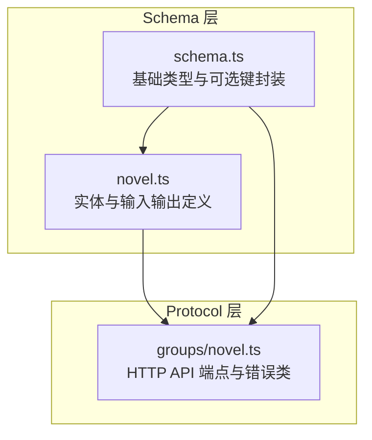
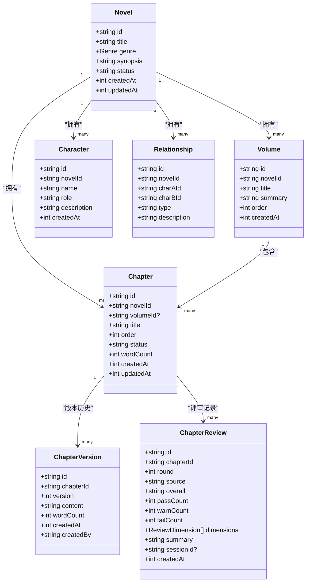
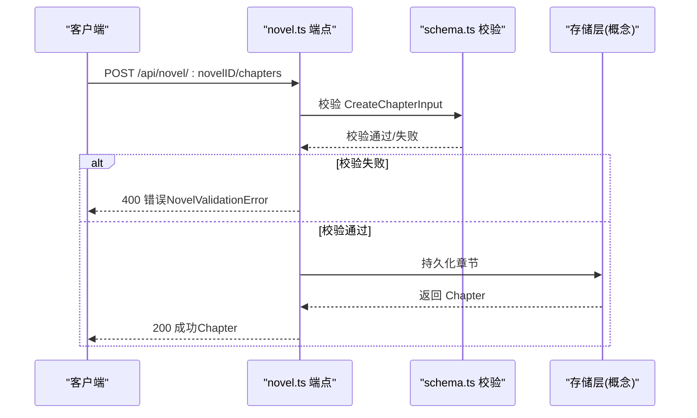
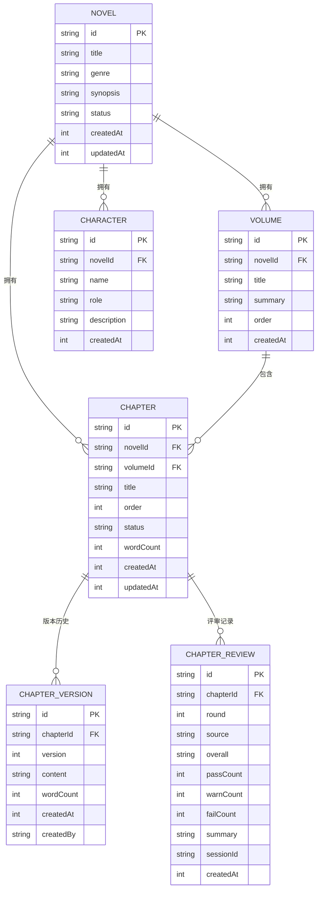

# 核心实体模型

<cite>
**本文引用的文件**   
- [packages/schema/src/novel.ts](file://packages/schema/src/novel.ts)
- [packages/schema/src/schema.ts](file://packages/schema/src/schema.ts)
- [packages/protocol/src/groups/novel.ts](file://packages/protocol/src/groups/novel.ts)
</cite>

## 目录
1. [简介](#简介)
2. [项目结构](#项目结构)
3. [核心组件](#核心组件)
4. [架构总览](#架构总览)
5. [详细组件分析](#详细组件分析)
6. [依赖关系分析](#依赖关系分析)
7. [性能考虑](#性能考虑)
8. [故障排查指南](#故障排查指南)
9. [结论](#结论)
10. [附录](#附录)

## 简介
本文件为 openNovel 的核心实体模型提供系统化文档，覆盖 Novel（小说）、Chapter（章节）、Volume（卷）、Character（角色）等关键实体的数据结构、字段含义、数据类型与业务规则；阐述实体间的关系映射（如 Novel 与 Chapter 的一对多、Chapter 与 Volume 的关联）；说明状态管理与时间戳设计；给出 TypeScript 接口定义与使用示例；并解释数据验证规则与约束条件。

## 项目结构
openNovel 的核心实体定义集中在 schema 包中，协议层通过 protocol 包暴露 HTTP API，统一引用 schema 中的类型进行输入输出校验。

图表来源 
- [packages/schema/src/novel.ts:1-441](file://packages/schema/src/novel.ts#L1-L441)
- [packages/schema/src/schema.ts:1-31](file://packages/schema/src/schema.ts#L1-L31)
- [packages/protocol/src/groups/novel.ts:1-200](file://packages/protocol/src/groups/novel.ts#L1-L200)

章节来源
- [packages/schema/src/novel.ts:1-441](file://packages/schema/src/novel.ts#L1-L441)
- [packages/schema/src/schema.ts:1-31](file://packages/schema/src/schema.ts#L1-L31)
- [packages/protocol/src/groups/novel.ts:1-200](file://packages/protocol/src/groups/novel.ts#L1-L200)

## 核心组件
- Novel（小说）：作品级元数据与统计信息，包含标题、题材、简介、状态与时间戳。
- Volume（卷）：对章节进行分组组织，支持顺序与摘要。
- Chapter（章节）：内容载体，含标题、排序、状态、字数与时间戳；并提供详情视图与版本历史。
- Character（角色）：人物档案，含名称、角色定位与描述。
- 辅助实体：ReviewDimension、ChapterReview、Relationship、PlotThread、Foreshadowing、WorldEntry、StyleGuide、TensionPoint、HookRotation、OutlineNode/Bundle 等，用于评审、关系、剧情线、伏笔、世界观、风格指南、张力点、钩子轮换与大纲管理。

章节来源
- [packages/schema/src/novel.ts:8-17](file://packages/schema/src/novel.ts#L8-L17)
- [packages/schema/src/novel.ts:40-48](file://packages/schema/src/novel.ts#L40-L48)
- [packages/schema/src/novel.ts:61-72](file://packages/schema/src/novel.ts#L61-L72)
- [packages/schema/src/novel.ts:123-131](file://packages/schema/src/novel.ts#L123-L131)

## 架构总览
下图展示核心实体之间的关系与主要 API 交互流程。

图表来源 
- [packages/schema/src/novel.ts:8-17](file://packages/schema/src/novel.ts#L8-L17)
- [packages/schema/src/novel.ts:40-48](file://packages/schema/src/novel.ts#L40-L48)
- [packages/schema/src/novel.ts:61-72](file://packages/schema/src/novel.ts#L61-L72)
- [packages/schema/src/novel.ts:88-97](file://packages/schema/src/novel.ts#L88-L97)
- [packages/schema/src/novel.ts:107-121](file://packages/schema/src/novel.ts#L107-L121)
- [packages/schema/src/novel.ts:123-131](file://packages/schema/src/novel.ts#L123-L131)
- [packages/schema/src/novel.ts:144-152](file://packages/schema/src/novel.ts#L144-L152)

## 详细组件分析

### Novel（小说）
- 字段说明
  - id: 唯一标识
  - title: 标题
  - genre: 题材枚举（玄幻、都市、仙侠、历史、科幻、悬疑、言情、游戏）
  - synopsis: 简介
  - status: 状态（字符串，具体取值由业务约定）
  - createdAt/updatedAt: 创建与更新时间戳（毫秒整数）
- 业务规则
  - 题材必须来自预定义枚举
  - 时间戳为非负整数
- TypeScript 接口
  - Novel: 见 [packages/schema/src/novel.ts:17](file://packages/schema/src/novel.ts#L17)
  - Genre: 见 [packages/schema/src/novel.ts:6](file://packages/schema/src/novel.ts#L6)
- 使用示例
  - 创建小说输入 CreateNovelInput: [packages/schema/src/novel.ts:338-343](file://packages/schema/src/novel.ts#L338-L343)
  - 更新小说输入 UpdateNovelInput: [packages/schema/src/novel.ts:368-373](file://packages/schema/src/novel.ts#L368-L373)
  - 获取详情 NovelDetail（含 styleGuide 与 stats）: [packages/schema/src/novel.ts:27-38](file://packages/schema/src/novel.ts#L27-L38)

章节来源
- [packages/schema/src/novel.ts:5-6](file://packages/schema/src/novel.ts#L5-L6)
- [packages/schema/src/novel.ts:8-17](file://packages/schema/src/novel.ts#L8-L17)
- [packages/schema/src/novel.ts:27-38](file://packages/schema/src/novel.ts#L27-L38)
- [packages/schema/src/novel.ts:338-343](file://packages/schema/src/novel.ts#L338-L343)
- [packages/schema/src/novel.ts:368-373](file://packages/schema/src/novel.ts#L368-L373)

### Volume（卷）
- 字段说明
  - id: 唯一标识
  - novelId: 所属小说 ID
  - title: 卷名
  - summary: 卷摘要
  - order: 排序（非负整数）
  - createdAt: 创建时间戳
- 业务规则
  - order 必须非负
  - 同一小说内建议保持顺序一致性
- TypeScript 接口
  - Volume: [packages/schema/src/novel.ts:48](file://packages/schema/src/novel.ts#L48)
- 使用示例
  - 创建卷输入 CreateVolumeInput: [packages/schema/src/novel.ts:262-266](file://packages/schema/src/novel.ts#L262-L266)
  - 更新卷输入 UpdateVolumeInput: [packages/schema/src/novel.ts:268-272](file://packages/schema/src/novel.ts#L268-L272)
  - 列表接口返回 Volume[]: [packages/protocol/src/groups/novel.ts:147-161](file://packages/protocol/src/groups/novel.ts#L147-L161)

章节来源
- [packages/schema/src/novel.ts:40-48](file://packages/schema/src/novel.ts#L40-L48)
- [packages/schema/src/novel.ts:262-272](file://packages/schema/src/novel.ts#L262-L272)
- [packages/protocol/src/groups/novel.ts:147-161](file://packages/protocol/src/groups/novel.ts#L147-L161)

### Chapter（章节）
- 字段说明
  - id: 唯一标识
  - novelId: 所属小说 ID
  - volumeId: 所属卷 ID（可选）
  - title: 标题
  - order: 排序（非负整数）
  - status: 状态（字符串）
  - wordCount: 字数（非负整数）
  - createdAt/updatedAt: 创建与更新时间戳
- 业务规则
  - order 与 wordCount 必须非负
  - volumeId 可选，表示可归属到某卷或游离于卷外
- TypeScript 接口
  - Chapter: [packages/schema/src/novel.ts:72](file://packages/schema/src/novel.ts#L72)
  - ChapterDetail（含 content）: [packages/schema/src/novel.ts:86](file://packages/schema/src/novel.ts#L86)
- 使用示例
  - 创建章节输入 CreateChapterInput: [packages/schema/src/novel.ts:361-366](file://packages/schema/src/novel.ts#L361-L366)
  - 更新章节输入 UpdateChapterInput: [packages/schema/src/novel.ts:285-289](file://packages/schema/src/novel.ts#L285-L289)
  - 更新内容输入 UpdateChapterContentInput: [packages/schema/src/novel.ts:345-348](file://packages/schema/src/novel.ts#L345-L348)
  - 移动章节 MoveChapterInput（up/down/to-volume）: [packages/schema/src/novel.ts:279-283](file://packages/schema/src/novel.ts#L279-L283)
  - 列表与详情接口: [packages/protocol/src/groups/novel.ts:163-193](file://packages/protocol/src/groups/novel.ts#L163-L193)

章节来源
- [packages/schema/src/novel.ts:61-72](file://packages/schema/src/novel.ts#L61-L72)
- [packages/schema/src/novel.ts:74-86](file://packages/schema/src/novel.ts#L74-L86)
- [packages/schema/src/novel.ts:279-289](file://packages/schema/src/novel.ts#L279-L289)
- [packages/schema/src/novel.ts:345-366](file://packages/schema/src/novel.ts#L345-L366)
- [packages/protocol/src/groups/novel.ts:163-193](file://packages/protocol/src/groups/novel.ts#L163-L193)

### Character（角色）
- 字段说明
  - id: 唯一标识
  - novelId: 所属小说 ID
  - name: 名称
  - role: 角色定位
  - description: 描述
  - createdAt: 创建时间戳
- 业务规则
  - 所有字段均为字符串，无额外约束
- TypeScript 接口
  - Character: [packages/schema/src/novel.ts:131](file://packages/schema/src/novel.ts#L131)
- 使用示例
  - 创建角色输入 CreateCharacterInput: [packages/schema/src/novel.ts:375-380](file://packages/schema/src/novel.ts#L375-L380)
  - 更新角色输入 UpdateCharacterInput: [packages/schema/src/novel.ts:382-387](file://packages/schema/src/novel.ts#L382-L387)
  - 列表接口返回 Character[]: [packages/protocol/src/groups/novel.ts:278-292](file://packages/protocol/src/groups/novel.ts#L278-L292)

章节来源
- [packages/schema/src/novel.ts:123-131](file://packages/schema/src/novel.ts#L123-L131)
- [packages/schema/src/novel.ts:375-387](file://packages/schema/src/novel.ts#L375-L387)
- [packages/protocol/src/groups/novel.ts:278-292](file://packages/protocol/src/groups/novel.ts#L278-L292)

### 章节版本与评审
- ChapterVersion（版本历史）
  - 字段：id、chapterId、version（正整数）、content、wordCount、createdAt、createdBy
  - 用途：记录章节内容变更历史，支持回滚
  - 接口：[packages/schema/src/novel.ts:88-97](file://packages/schema/src/novel.ts#L88-L97)
- ChapterReview（评审记录）
  - 字段：id、chapterId、round（正整数）、source（deterministic/auditor/human）、overall（PASS/WARN/FAIL）、passCount/warnCount/failCount、dimensions、summary、sessionId（可选）、createdAt
  - ReviewDimension：dimension、status（PASS/WARN/FAIL）、detail、evidence（可选）
  - 接口：[packages/schema/src/novel.ts:99-121](file://packages/schema/src/novel.ts#L99-L121)
- 使用示例
  - 版本列表接口: [packages/protocol/src/groups/novel.ts:195-209](file://packages/protocol/src/groups/novel.ts#L195-L209)
  - 评审列表接口: [packages/protocol/src/groups/novel.ts:211-226](file://packages/protocol/src/groups/novel.ts#L211-L226)
  - 回滚接口: [packages/protocol/src/groups/novel.ts:228-242](file://packages/protocol/src/groups/novel.ts#L228-L242)

章节来源
- [packages/schema/src/novel.ts:88-121](file://packages/schema/src/novel.ts#L88-L121)
- [packages/protocol/src/groups/novel.ts:195-242](file://packages/protocol/src/groups/novel.ts#L195-L242)

### 角色关系与状态
- Relationship（角色关系）
  - 字段：id、novelId、charAId、charBId、type、description
  - 输入：CreateRelationshipInput、UpdateRelationshipInput
  - 接口：[packages/schema/src/novel.ts:144-152](file://packages/schema/src/novel.ts#L144-L152), [packages/schema/src/novel.ts:291-303](file://packages/schema/src/novel.ts#L291-L303)
- CharacterState（角色状态）
  - 字段：id、characterId、chapterId（可选）、active（整数）、location（可选）、mood（可选）、summary（可选）
  - 输入：CreateCharacterStateInput、UpdateCharacterStateInput
  - 接口：[packages/schema/src/novel.ts:133-142](file://packages/schema/src/novel.ts#L133-L142), [packages/schema/src/novel.ts:305-319](file://packages/schema/src/novel.ts#L305-L319)

章节来源
- [packages/schema/src/novel.ts:133-152](file://packages/schema/src/novel.ts#L133-L152)
- [packages/schema/src/novel.ts:291-319](file://packages/schema/src/novel.ts#L291-L319)

### 其他重要实体
- PlotThread（剧情线）：title、status、priority、description、closedAt（可选）
- Foreshadowing（伏笔）：plantedChapterId/resolvedChapterId（可选）、content、state
- WorldEntry（世界观条目）：category、title、content
- StyleGuide（风格指南）：rules（键值对）、tone、pov、tense
- TensionPoint（张力点）：chapterNumber（正整数）、level（数值）
- HookRotation（钩子轮换）：hookType、chapterId（可选）
- OutlineNode/OutlineBundle：大纲节点与打包结构，支持 master/volume/chapter 层级

章节来源
- [packages/schema/src/novel.ts:154-214](file://packages/schema/src/novel.ts#L154-L214)
- [packages/schema/src/novel.ts:232-254](file://packages/schema/src/novel.ts#L232-L254)

## 依赖关系分析
- Schema 层
  - novel.ts 定义所有实体与输入输出类型，使用 effect Schema 进行强类型与运行时校验。
  - schema.ts 提供基础类型 PositiveInt、NonNegativeInt、optional 封装等。
- Protocol 层
  - groups/novel.ts 基于 HttpApiEndpoint 声明 RESTful 端点，直接引用 schema 中的类型作为请求体与响应体，确保前后端契约一致。
- 错误处理
  - NovelNotFoundError、ChapterNotFoundError、NovelValidationError 等错误类在协议层定义，携带结构化消息与 HTTP 状态码。

图表来源 
- [packages/protocol/src/groups/novel.ts:163-177](file://packages/protocol/src/groups/novel.ts#L163-L177)
- [packages/schema/src/novel.ts:361-366](file://packages/schema/src/novel.ts#L361-L366)
- [packages/schema/src/schema.ts:3-4](file://packages/schema/src/schema.ts#L3-L4)

章节来源
- [packages/protocol/src/groups/novel.ts:1-200](file://packages/protocol/src/groups/novel.ts#L1-L200)
- [packages/schema/src/novel.ts:1-441](file://packages/schema/src/novel.ts#L1-L441)
- [packages/schema/src/schema.ts:1-31](file://packages/schema/src/schema.ts#L1-L31)

## 性能考虑
- 时间戳字段采用整型毫秒时间戳，避免时区转换开销，便于排序与比较。
- 章节详情与列表分离：ChapterDetail 包含 content，适合按需加载，减少大对象传输。
- 版本历史独立表/集合：ChapterVersion 与 Chapter 解耦，利于回滚与审计，避免主表膨胀。
- 评审记录按轮次与维度拆分：ChapterReview 与 ReviewDimension 分离，便于统计与过滤。
- 可选字段使用 optional 封装，降低序列化与反序列化成本。

## 故障排查指南
- 常见错误类
  - NovelNotFoundError：小说不存在
  - ChapterNotFoundError：章节不存在
  - NovelValidationError：参数校验失败
- 排查步骤
  - 检查请求路径与参数是否匹配端点定义
  - 确认输入是否符合 schema 约束（如 NonNegativeInt、PositiveInt、枚举值）
  - 查看错误响应 data 字段中的 message 与 field 提示
- 参考实现
  - 错误类定义与 HTTP 状态码：[packages/protocol/src/groups/novel.ts:54-80](file://packages/protocol/src/groups/novel.ts#L54-L80)

章节来源
- [packages/protocol/src/groups/novel.ts:54-80](file://packages/protocol/src/groups/novel.ts#L54-L80)

## 结论
openNovel 的核心实体模型以 Effect Schema 为中心，结合协议层的强契约定义，实现了从类型到校验再到 API 的全链路一致性。Novel、Volume、Chapter、Character 等实体清晰表达创作过程中的结构与状态，配合版本与评审机制，满足复杂创作协作需求。建议在新增字段或实体时，优先扩展 schema 定义并在协议层同步声明，以保持前后端一致性与可维护性。

## 附录

### 字段与约束速查
- 整数约束
  - PositiveInt：大于 0 的整数（如 version、round、chapterNumber）
  - NonNegativeInt：大于等于 0 的整数（如 order、wordCount）
- 可选字段
  - 使用 optional 封装，允许缺失或 undefined
- 枚举与字面量
  - Genre：固定题材枚举
  - ReviewDimension.status、ChapterReview.source/overall：固定字面量集合

章节来源
- [packages/schema/src/schema.ts:3-4](file://packages/schema/src/schema.ts#L3-L4)
- [packages/schema/src/novel.ts:5-6](file://packages/schema/src/novel.ts#L5-L6)
- [packages/schema/src/novel.ts:99-121](file://packages/schema/src/novel.ts#L99-L121)

### 实体关系图（简化）

图表来源 
- [packages/schema/src/novel.ts:8-17](file://packages/schema/src/novel.ts#L8-L17)
- [packages/schema/src/novel.ts:40-48](file://packages/schema/src/novel.ts#L40-L48)
- [packages/schema/src/novel.ts:61-72](file://packages/schema/src/novel.ts#L61-L72)
- [packages/schema/src/novel.ts:88-97](file://packages/schema/src/novel.ts#L88-L97)
- [packages/schema/src/novel.ts:107-121](file://packages/schema/src/novel.ts#L107-L121)
- [packages/schema/src/novel.ts:123-131](file://packages/schema/src/novel.ts#L123-L131)