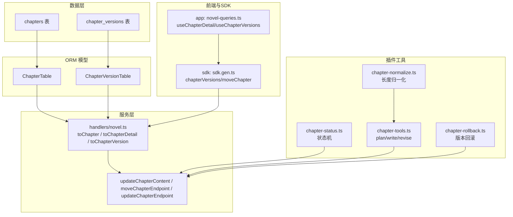
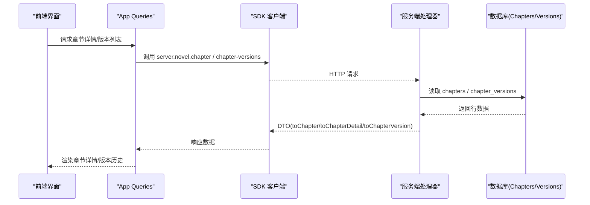
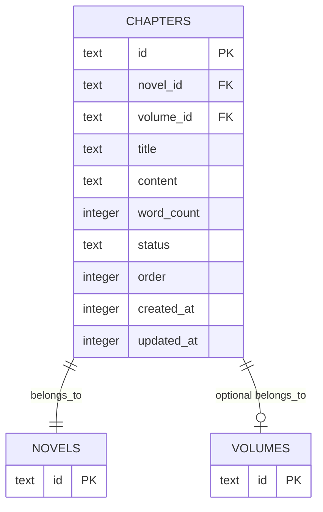
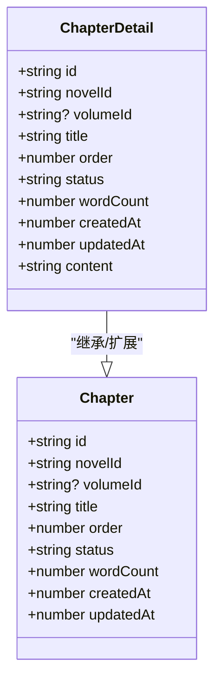
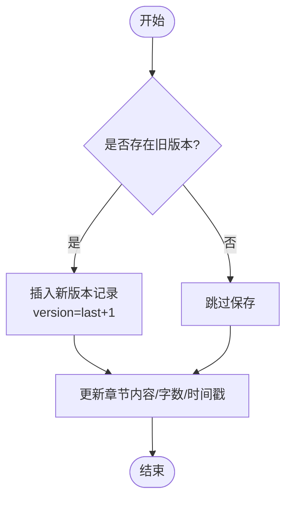
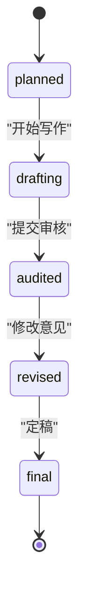
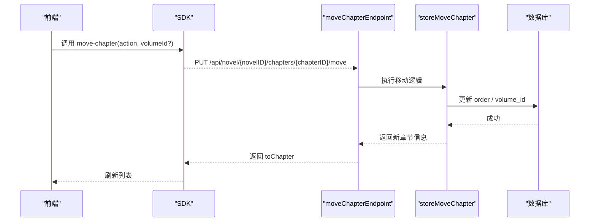
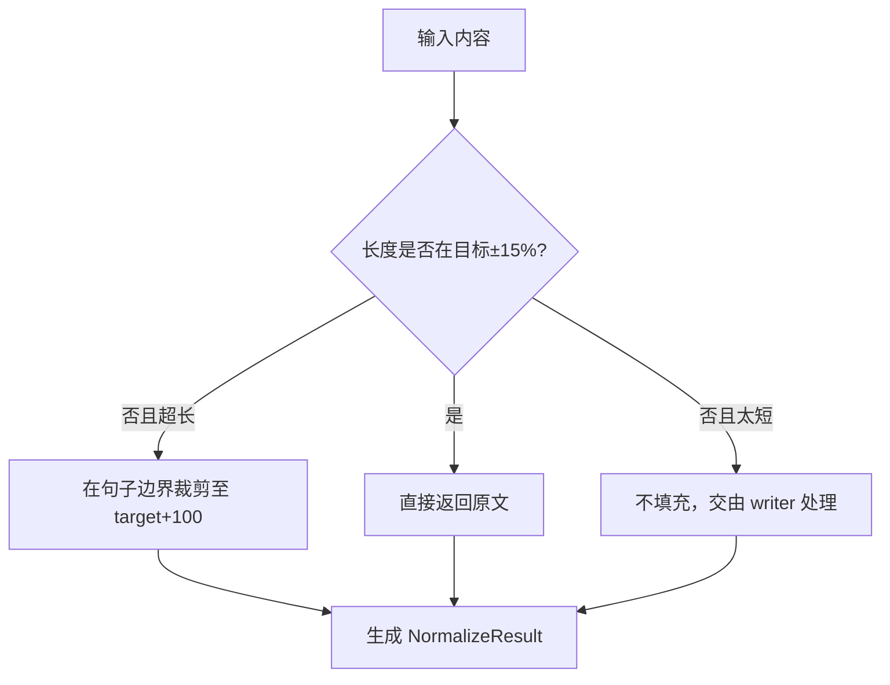
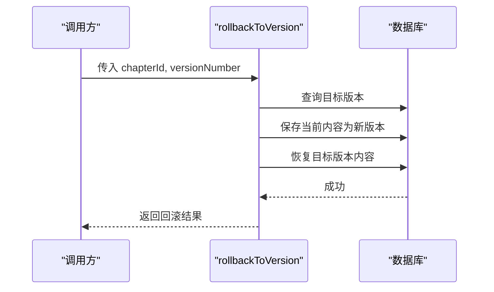
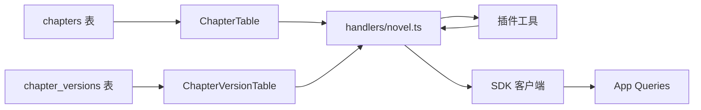

# 章节实体 (Chapter)

<cite>
**本文引用的文件**   
- [packages/core/src/database/migration/20260721152252_novel_writing_tables.ts](file://packages/core/src/database/migration/20260721152252_novel_writing_tables.ts)
- [packages/core/src/session/sql.ts](file://packages/core/src/session/sql.ts)
- [packages/server/src/handlers/novel.ts](file://packages/server/src/handlers/novel.ts)
- [packages/plugin/src/novel-writer/chapter-status.ts](file://packages/plugin/src/novel-writer/chapter-status.ts)
- [packages/plugin/src/novel-writer/chapter-tools.ts](file://packages/plugin/src/novel-writer/chapter-tools.ts)
- [packages/plugin/src/novel-writer/chapter-normalize.ts](file://packages/plugin/src/novel-writer/chapter-normalize.ts)
- [packages/plugin/src/novel-writer/chapter-rollback.ts](file://packages/plugin/src/novel-writer/chapter-rollback.ts)
- [packages/app/src/context/novel-queries.ts](file://packages/app/src/context/novel-queries.ts)
- [packages/sdk/js/src/v2/gen/sdk.gen.ts](file://packages/sdk/js/src/v2/gen/sdk.gen.ts)
</cite>

## 目录
1. [简介](#简介)
2. [项目结构](#项目结构)
3. [核心组件](#核心组件)
4. [架构总览](#架构总览)
5. [详细组件分析](#详细组件分析)
6. [依赖关系分析](#依赖关系分析)
7. [性能考量](#性能考量)
8. [故障排查指南](#故障排查指南)
9. [结论](#结论)
10. [附录](#附录)

## 简介
本文件围绕“章节（Chapter）”实体进行系统化文档化，涵盖：
- 完整数据结构与字段设计意图（id、novelId、volumeId、title、order、status、wordCount、createdAt、updatedAt 等）
- ChapterDetail 扩展结构如何包含 content 内容字段
- ChapterVersion 版本控制机制（version、content、wordCount、createdBy 等）
- 章节状态管理、排序逻辑与内容版本追踪的实现方式
- 章节创建、更新、版本管理与内容操作的代码示例路径

## 项目结构
与章节实体相关的关键位置如下：
- 数据库迁移与表定义：chapters、chapter_versions 等表的建表语句与索引
- ORM 表模型：Drizzle 定义的 ChapterTable、ChapterVersionTable
- 服务端处理器：DTO 映射、查询与更新接口实现
- 插件工具：状态机、内容写入/修订、长度归一化、版本回滚
- 前端调用：React Query 封装的章节详情与版本列表查询
- SDK 客户端：生成的 API 方法用于调用章节版本、移动等操作

**图表来源**
- [packages/core/src/database/migration/20260721152252_novel_writing_tables.ts:18-45](file://packages/core/src/database/migration/20260721152252_novel_writing_tables.ts#L18-L45)
- [packages/core/src/session/sql.ts:222-270](file://packages/core/src/session/sql.ts#L222-L270)
- [packages/server/src/handlers/novel.ts:106-137](file://packages/server/src/handlers/novel.ts#L106-L137)
- [packages/plugin/src/novel-writer/chapter-status.ts:1-104](file://packages/plugin/src/novel-writer/chapter-status.ts#L1-L104)
- [packages/plugin/src/novel-writer/chapter-tools.ts:1-163](file://packages/plugin/src/novel-writer/chapter-tools.ts#L1-L163)
- [packages/plugin/src/novel-writer/chapter-normalize.ts:1-132](file://packages/plugin/src/novel-writer/chapter-normalize.ts#L1-L132)
- [packages/plugin/src/novel-writer/chapter-rollback.ts:1-116](file://packages/plugin/src/novel-writer/chapter-rollback.ts#L1-L116)
- [packages/app/src/context/novel-queries.ts:99-127](file://packages/app/src/context/novel-queries.ts#L99-L127)
- [packages/sdk/js/src/v2/gen/sdk.gen.ts:7593-7630](file://packages/sdk/js/src/v2/gen/sdk.gen.ts#L7593-L7630)

**章节来源**
- [packages/core/src/database/migration/20260721152252_novel_writing_tables.ts:18-45](file://packages/core/src/database/migration/20260721152252_novel_writing_tables.ts#L18-L45)
- [packages/core/src/session/sql.ts:222-270](file://packages/core/src/session/sql.ts#L222-L270)

## 核心组件
- 章节实体（Chapter）
  - 主键 id：文本类型唯一标识
  - novelId：所属小说 ID，外键约束保证一致性
  - volumeId：可选归属卷 ID，删除卷时置空
  - title：章节标题
  - order：章节顺序号，配合索引支持按小说维度排序
  - status：章节状态（如 planned/drafting/audited/revised/final），由状态机约束转换
  - wordCount：字数统计，随内容变更同步更新
  - createdAt/updatedAt：时间戳，记录创建与更新时间
- 章节详情（ChapterDetail）
  - 在基础字段之上增加 content 字段，用于编辑器与阅读器展示
- 章节版本（ChapterVersion）
  - id：版本记录主键
  - chapterId：关联章节
  - version：版本号递增
  - content：快照内容
  - wordCount：快照字数
  - createdBy：来源标记（如 update-content、rollback、ai）
  - createdAt：版本创建时间

**章节来源**
- [packages/core/src/database/migration/20260721152252_novel_writing_tables.ts:18-45](file://packages/core/src/database/migration/20260721152252_novel_writing_tables.ts#L18-L45)
- [packages/core/src/session/sql.ts:222-270](file://packages/core/src/session/sql.ts#L222-L270)
- [packages/server/src/handlers/novel.ts:106-137](file://packages/server/src/handlers/novel.ts#L106-L137)

## 架构总览
章节实体的数据流贯穿“前端调用 → SDK → 服务端处理器 → ORM/DB”，并在插件侧提供状态机与版本操作能力。

**图表来源**
- [packages/app/src/context/novel-queries.ts:99-127](file://packages/app/src/context/novel-queries.ts#L99-L127)
- [packages/sdk/js/src/v2/gen/sdk.gen.ts:7593-7630](file://packages/sdk/js/src/v2/gen/sdk.gen.ts#L7593-L7630)
- [packages/server/src/handlers/novel.ts:106-137](file://packages/server/src/handlers/novel.ts#L106-L137)

## 详细组件分析

### 章节实体数据结构与字段设计
- id：文本主键，便于跨系统传递与存储
- novelId：强一致的外键，确保章节始终属于某部小说
- volumeId：弱外键，允许章节脱离卷存在，删除卷时置空
- title：可读性强的标题字段
- order：整数排序，配合复合索引 (novel_id, order) 高效分页与重排
- status：状态枚举，受状态机约束，避免非法流转
- wordCount：与内容长度保持一致，便于阅读与统计
- createdAt/updatedAt：审计与缓存失效依据

**图表来源**
- [packages/core/src/database/migration/20260721152252_novel_writing_tables.ts:18-32](file://packages/core/src/database/migration/20260721152252_novel_writing_tables.ts#L18-L32)
- [packages/core/src/session/sql.ts:222-248](file://packages/core/src/session/sql.ts#L222-L248)

**章节来源**
- [packages/core/src/database/migration/20260721152252_novel_writing_tables.ts:18-32](file://packages/core/src/database/migration/20260721152252_novel_writing_tables.ts#L18-L32)
- [packages/core/src/session/sql.ts:222-248](file://packages/core/src/session/sql.ts#L222-L248)

### ChapterDetail 扩展结构
- 在 toChapter 基础上追加 content 字段，形成 toChapterDetail
- 适用于编辑器与阅读器场景，避免额外加载大字段

**图表来源**
- [packages/server/src/handlers/novel.ts:106-125](file://packages/server/src/handlers/novel.ts#L106-L125)

**章节来源**
- [packages/server/src/handlers/novel.ts:106-125](file://packages/server/src/handlers/novel.ts#L106-L125)

### ChapterVersion 版本控制机制
- 每次内容变更或回滚前，都会将当前内容保存为新版本
- version 自增，确保可追溯；createdBy 区分来源（update-content、rollback、ai）
- 通过索引 (chapter_id, version) 快速查询最新版本与历史

**图表来源**
- [packages/server/src/handlers/novel.ts:572-611](file://packages/server/src/handlers/novel.ts#L572-L611)
- [packages/plugin/src/novel-writer/chapter-tools.ts:105-162](file://packages/plugin/src/novel-writer/chapter-tools.ts#L105-L162)
- [packages/plugin/src/novel-writer/chapter-rollback.ts:29-93](file://packages/plugin/src/novel-writer/chapter-rollback.ts#L29-L93)

**章节来源**
- [packages/server/src/handlers/novel.ts:572-611](file://packages/server/src/handlers/novel.ts#L572-L611)
- [packages/plugin/src/novel-writer/chapter-tools.ts:105-162](file://packages/plugin/src/novel-writer/chapter-tools.ts#L105-L162)
- [packages/plugin/src/novel-writer/chapter-rollback.ts:29-93](file://packages/plugin/src/novel-writer/chapter-rollback.ts#L29-L93)

### 章节状态管理
- 状态集合：planned → drafting → audited → revised → final
- 合法转换由 ALLOWED_TRANSITIONS 约束，非法转换抛出错误
- 提供查询与更新状态的函数，统一维护状态一致性

**图表来源**
- [packages/plugin/src/novel-writer/chapter-status.ts:14-28](file://packages/plugin/src/novel-writer/chapter-status.ts#L14-L28)

**章节来源**
- [packages/plugin/src/novel-writer/chapter-status.ts:14-28](file://packages/plugin/src/novel-writer/chapter-status.ts#L14-L28)
- [packages/plugin/src/novel-writer/chapter-status.ts:54-87](file://packages/plugin/src/novel-writer/chapter-status.ts#L54-L87)

### 排序逻辑与移动
- 使用 order 字段表示章节顺序，配合 (novel_id, order) 索引提升查询效率
- 移动操作支持 up/down 与移动到指定卷，内部通过 storeMoveChapter 实现

**图表来源**
- [packages/sdk/js/src/v2/gen/sdk.gen.ts:8329-8367](file://packages/sdk/js/src/v2/gen/sdk.gen.ts#L8329-L8367)
- [packages/server/src/handlers/novel.ts:842-850](file://packages/server/src/handlers/novel.ts#L842-L850)

**章节来源**
- [packages/core/src/database/migration/20260721152252_novel_writing_tables.ts:189-191](file://packages/core/src/database/migration/20260721152252_novel_writing_tables.ts#L189-L191)
- [packages/server/src/handlers/novel.ts:842-850](file://packages/server/src/handlers/novel.ts#L842-L850)

### 内容操作与长度归一化
- 内容写入：校验长度范围（例如 2000-3000 字），更新 content 与 wordCount，并设置状态为 draft
- 修订流程：先保存旧版本到 chapter_versions，再更新新内容
- 长度归一化：在目标长度 ±15% 范围内保持原文，超长则在句子边界裁剪

**图表来源**
- [packages/plugin/src/novel-writer/chapter-normalize.ts:49-77](file://packages/plugin/src/novel-writer/chapter-normalize.ts#L49-L77)
- [packages/plugin/src/novel-writer/chapter-tools.ts:60-97](file://packages/plugin/src/novel-writer/chapter-tools.ts#L60-L97)

**章节来源**
- [packages/plugin/src/novel-writer/chapter-normalize.ts:49-77](file://packages/plugin/src/novel-writer/chapter-normalize.ts#L49-L77)
- [packages/plugin/src/novel-writer/chapter-tools.ts:60-97](file://packages/plugin/src/novel-writer/chapter-tools.ts#L60-L97)

### 版本回滚
- 回滚到指定版本时，先将当前内容保存为新版本（确保可逆），再将章节恢复为目标版本内容
- 提供 listVersions 列出所有可用版本，按 version 降序排列

**图表来源**
- [packages/plugin/src/novel-writer/chapter-rollback.ts:29-93](file://packages/plugin/src/novel-writer/chapter-rollback.ts#L29-L93)

**章节来源**
- [packages/plugin/src/novel-writer/chapter-rollback.ts:29-93](file://packages/plugin/src/novel-writer/chapter-rollback.ts#L29-L93)

## 依赖关系分析
- 数据层依赖：chapters 与 chapter_versions 通过 chapter_id 建立一对多关系
- ORM 层：ChapterTable、ChapterVersionTable 定义字段与索引
- 服务层：handlers/novel.ts 负责 DTO 映射与业务编排
- 插件层：状态机、工具函数、归一化与回滚逻辑增强业务能力
- 前端与 SDK：React Query 与生成式 SDK 简化调用

**图表来源**
- [packages/core/src/session/sql.ts:222-270](file://packages/core/src/session/sql.ts#L222-L270)
- [packages/server/src/handlers/novel.ts:106-137](file://packages/server/src/handlers/novel.ts#L106-L137)
- [packages/app/src/context/novel-queries.ts:99-127](file://packages/app/src/context/novel-queries.ts#L99-L127)
- [packages/sdk/js/src/v2/gen/sdk.gen.ts:7593-7630](file://packages/sdk/js/src/v2/gen/sdk.gen.ts#L7593-L7630)

**章节来源**
- [packages/core/src/session/sql.ts:222-270](file://packages/core/src/session/sql.ts#L222-L270)
- [packages/server/src/handlers/novel.ts:106-137](file://packages/server/src/handlers/novel.ts#L106-L137)
- [packages/app/src/context/novel-queries.ts:99-127](file://packages/app/src/context/novel-queries.ts#L99-L127)
- [packages/sdk/js/src/v2/gen/sdk.gen.ts:7593-7630](file://packages/sdk/js/src/v2/gen/sdk.gen.ts#L7593-L7630)

## 性能考量
- 索引优化
  - chapters(novel_id, order)：加速按小说维度排序与分页
  - chapter_versions(chapter_id, version)：加速版本查询与最新值获取
- 大字段策略
  - content 仅在详情接口返回，列表接口不包含以避免网络开销
- 状态与版本
  - 状态机校验在应用层完成，减少无效写入
  - 版本记录按需生成，避免频繁快照造成写放大

[本节为通用指导，无需特定文件引用]

## 故障排查指南
- 常见错误
  - 状态转换非法：检查当前状态与目标状态是否符合 ALLOWED_TRANSITIONS
  - 未找到章节：确认 chapter_id 与 novel_id 匹配
  - 版本不存在：确认 version 编号有效
- 定位步骤
  - 查看 handlers/novel.ts 中的错误抛出点
  - 检查插件工具的状态机与回滚逻辑
  - 验证数据库索引与外键约束是否生效

**章节来源**
- [packages/plugin/src/novel-writer/chapter-status.ts:68-74](file://packages/plugin/src/novel-writer/chapter-status.ts#L68-L74)
- [packages/server/src/handlers/novel.ts:572-611](file://packages/server/src/handlers/novel.ts#L572-L611)
- [packages/plugin/src/novel-writer/chapter-rollback.ts:39-52](file://packages/plugin/src/novel-writer/chapter-rollback.ts#L39-L52)

## 结论
章节实体以清晰的字段设计与严格的版本控制为核心，结合状态机与长度归一化，形成了完整的创作与编辑闭环。通过前后端协作与 SDK 封装，开发者可以便捷地实现章节的创建、更新、移动与版本回溯，同时保障数据一致性与性能表现。

[本节为总结性内容，无需特定文件引用]

## 附录

### 代码示例路径（创建、更新、版本管理与内容操作）
- 章节详情与版本列表查询
  - [packages/app/src/context/novel-queries.ts:99-127](file://packages/app/src/context/novel-queries.ts#L99-L127)
  - [packages/sdk/js/src/v2/gen/sdk.gen.ts:7593-7630](file://packages/sdk/js/src/v2/gen/sdk.gen.ts#L7593-L7630)
- 更新章节内容（自动保存版本）
  - [packages/server/src/handlers/novel.ts:572-611](file://packages/server/src/handlers/novel.ts#L572-L611)
- 移动章节（up/down/to-volume）
  - [packages/sdk/js/src/v2/gen/sdk.gen.ts:8329-8367](file://packages/sdk/js/src/v2/gen/sdk.gen.ts#L8329-L8367)
  - [packages/server/src/handlers/novel.ts:842-850](file://packages/server/src/handlers/novel.ts#L842-L850)
- 状态机更新与查询
  - [packages/plugin/src/novel-writer/chapter-status.ts:54-87](file://packages/plugin/src/novel-writer/chapter-status.ts#L54-L87)
- 内容写入与修订（含版本保存）
  - [packages/plugin/src/novel-writer/chapter-tools.ts:60-97](file://packages/plugin/src/novel-writer/chapter-tools.ts#L60-L97)
  - [packages/plugin/src/novel-writer/chapter-tools.ts:105-162](file://packages/plugin/src/novel-writer/chapter-tools.ts#L105-L162)
- 长度归一化
  - [packages/plugin/src/novel-writer/chapter-normalize.ts:49-77](file://packages/plugin/src/novel-writer/chapter-normalize.ts#L49-L77)
- 版本回滚与列表
  - [packages/plugin/src/novel-writer/chapter-rollback.ts:29-93](file://packages/plugin/src/novel-writer/chapter-rollback.ts#L29-L93)
  - [packages/plugin/src/novel-writer/chapter-rollback.ts:100-115](file://packages/plugin/src/novel-writer/chapter-rollback.ts#L100-L115)