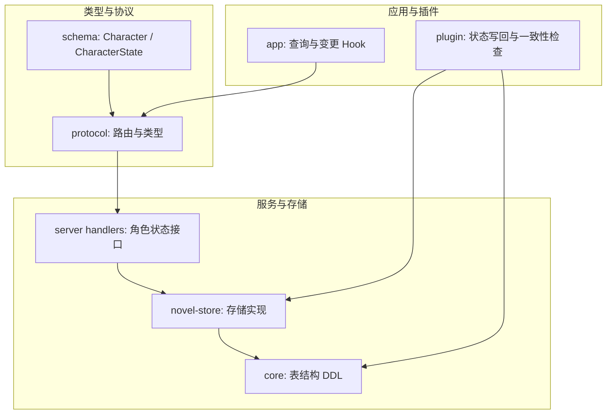
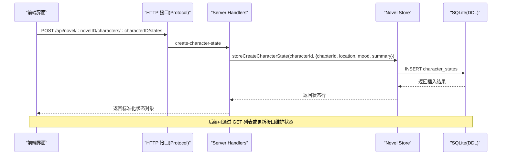
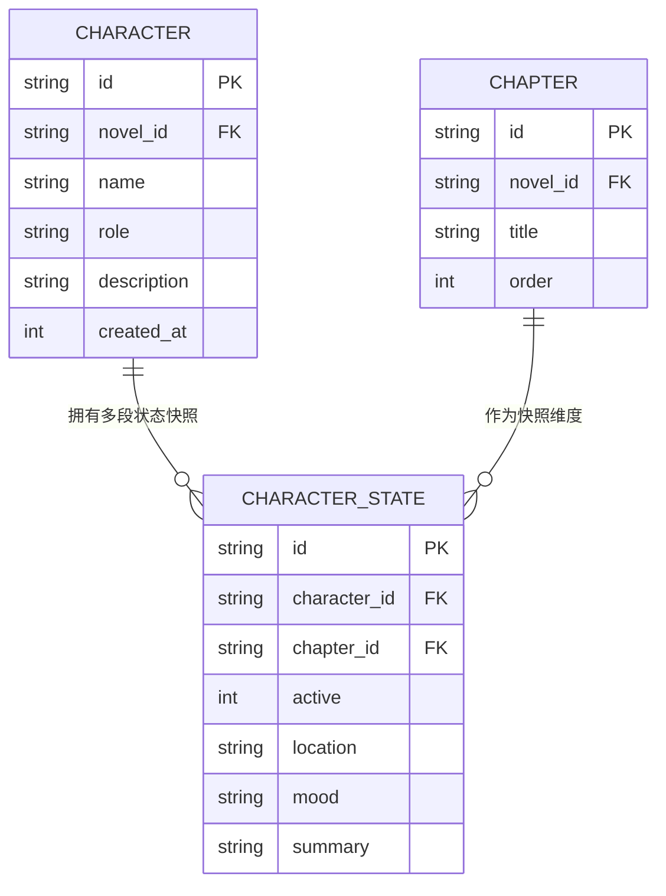
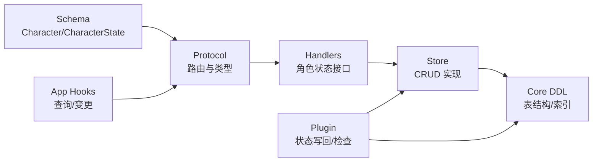
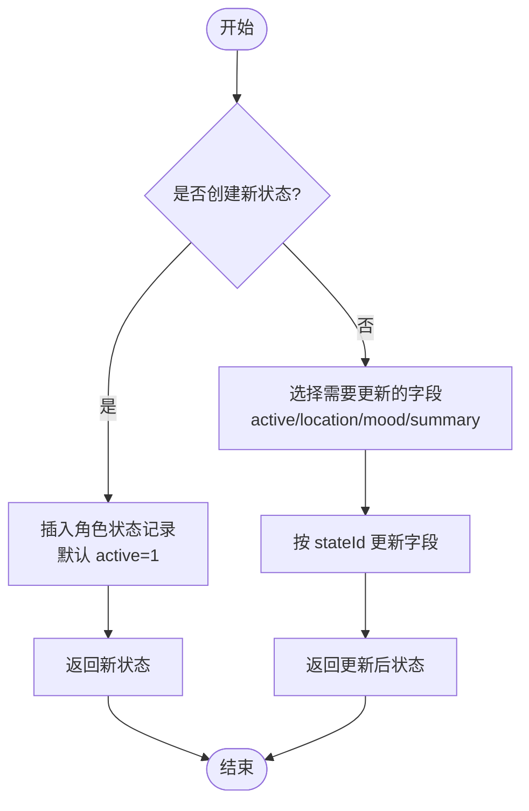

# 角色实体 (Character)

<cite>
**本文引用的文件**   
- [packages/schema/src/novel.ts](file://packages/schema/src/novel.ts)
- [packages/core/src/session/sql.ts](file://packages/core/src/session/sql.ts)
- [packages/novel-store/src/index.ts](file://packages/novel-store/src/index.ts)
- [packages/server/src/handlers/novel.ts](file://packages/server/src/handlers/novel.ts)
- [packages/protocol/src/groups/novel.ts](file://packages/protocol/src/groups/novel.ts)
- [packages/app/src/context/novel-queries.ts](file://packages/app/src/context/novel-queries.ts)
- [packages/plugin/src/novel-writer/state-commit.ts](file://packages/plugin/src/novel-writer/state-commit.ts)
- [packages/plugin/src/novel-writer/continuity-check.ts](file://packages/plugin/src/novel-writer/continuity-check.ts)
</cite>

## 目录
1. [简介](#简介)
2. [项目结构](#项目结构)
3. [核心组件](#核心组件)
4. [架构总览](#架构总览)
5. [详细组件分析](#详细组件分析)
6. [依赖关系分析](#依赖关系分析)
7. [性能考量](#性能考量)
8. [故障排查指南](#故障排查指南)
9. [结论](#结论)
10. [附录](#附录)

## 简介
本文件围绕 Character（角色）与 CharacterState（角色状态）两个核心实体，系统化阐述其数据结构、字段含义、与章节的关联方式，以及跨章节的状态跟踪与更新机制。文档同时给出角色创建、状态管理与生命周期管理的端到端流程说明，并辅以代码级图示帮助理解。

## 项目结构
- 类型定义：在 schema 层统一声明 Character 与 CharacterState 的数据结构与输入输出类型。
- 数据模型：在 core 层通过 Drizzle 表定义持久化结构，包含外键与索引。
- 存储实现：novel-store 提供增删改查等底层操作函数。
- 服务接口：server handlers 暴露 HTTP API，负责鉴权、校验与调用存储层。
- 协议定义：protocol 层定义 OpenAPI 路由与请求/响应类型。
- 前端交互：app 层封装查询与变更 Hook，驱动 UI 与缓存失效。
- 插件写回：plugin 层将写作过程中的“事实”写入数据库，维护角色状态快照。
- 一致性检查：plugin 层对角色情绪、位置等进行连续性分析与冲突检测。

图表来源
- [packages/schema/src/novel.ts:123-142](file://packages/schema/src/novel.ts#L123-L142)
- [packages/protocol/src/groups/novel.ts:529-564](file://packages/protocol/src/groups/novel.ts#L529-L564)
- [packages/server/src/handlers/novel.ts:913-990](file://packages/server/src/handlers/novel.ts#L913-L990)
- [packages/novel-store/src/index.ts:650-689](file://packages/novel-store/src/index.ts#L650-L689)
- [packages/core/src/session/sql.ts:290-310](file://packages/core/src/session/sql.ts#L290-L310)
- [packages/app/src/context/novel-queries.ts:720-806](file://packages/app/src/context/novel-queries.ts#L720-L806)
- [packages/plugin/src/novel-writer/state-commit.ts:260-275](file://packages/plugin/src/novel-writer/state-commit.ts#L260-L275)
- [packages/plugin/src/novel-writer/continuity-check.ts:1205-1359](file://packages/plugin/src/novel-writer/continuity-check.ts#L1205-L1359)

章节来源
- [packages/schema/src/novel.ts:123-142](file://packages/schema/src/novel.ts#L123-L142)
- [packages/core/src/session/sql.ts:290-310](file://packages/core/src/session/sql.ts#L290-L310)
- [packages/novel-store/src/index.ts:650-689](file://packages/novel-store/src/index.ts#L650-L689)
- [packages/server/src/handlers/novel.ts:913-990](file://packages/server/src/handlers/novel.ts#L913-L990)
- [packages/protocol/src/groups/novel.ts:529-564](file://packages/protocol/src/groups/novel.ts#L529-L564)
- [packages/app/src/context/novel-queries.ts:720-806](file://packages/app/src/context/novel-queries.ts#L720-L806)
- [packages/plugin/src/novel-writer/state-commit.ts:260-275](file://packages/plugin/src/novel-writer/state-commit.ts#L260-L275)
- [packages/plugin/src/novel-writer/continuity-check.ts:1205-1359](file://packages/plugin/src/novel-writer/continuity-check.ts#L1205-L1359)

## 核心组件
- Character（角色）
  - id: 角色唯一标识
  - novelId: 所属小说标识
  - name: 角色名称
  - role: 角色定位/身份
  - description: 角色描述
  - createdAt: 创建时间戳
- CharacterState（角色状态）
  - id: 状态记录唯一标识
  - characterId: 关联角色
  - chapterId: 关联章节（用于按章快照）
  - active: 活跃度计数（整数，默认 1）
  - location: 当前位置
  - mood: 当前情绪
  - summary: 状态摘要

章节来源
- [packages/schema/src/novel.ts:123-142](file://packages/schema/src/novel.ts#L123-L142)
- [packages/core/src/session/sql.ts:290-310](file://packages/core/src/session/sql.ts#L290-L310)
- [packages/novel-store/src/index.ts:48-57](file://packages/novel-store/src/index.ts#L48-57)

## 架构总览
角色与章节的关系通过 CharacterState 的 chapterId 建立，形成“每章快照”的状态历史。服务端提供 REST 接口进行状态的创建、更新与查询；前端通过 Hook 发起请求并管理缓存；插件在写作过程中产出“事实”，经 state-commit 逻辑落库，保证跨章节状态可追溯。

图表来源
- [packages/protocol/src/groups/novel.ts:560-564](file://packages/protocol/src/groups/novel.ts#L560-L564)
- [packages/server/src/handlers/novel.ts:948-967](file://packages/server/src/handlers/novel.ts#L948-L967)
- [packages/novel-store/src/index.ts:650-669](file://packages/novel-store/src/index.ts#L650-L669)
- [packages/core/src/session/sql.ts:290-310](file://packages/core/src/session/sql.ts#L290-L310)

## 详细组件分析

### 数据结构与关系图

图表来源
- [packages/core/src/session/sql.ts:290-310](file://packages/core/src/session/sql.ts#L290-L310)
- [packages/novel-store/src/index.ts:48-57](file://packages/novel-store/src/index.ts#L48-L57)

章节来源
- [packages/schema/src/novel.ts:123-142](file://packages/schema/src/novel.ts#L123-L142)
- [packages/core/src/session/sql.ts:290-310](file://packages/core/src/session/sql.ts#L290-L310)
- [packages/novel-store/src/index.ts:48-57](file://packages/novel-store/src/index.ts#L48-L57)

### 角色创建与更新
- 创建角色
  - 输入：name、role（可选）、description（可选）
  - 行为：生成 id、设置 novelId、初始化 createdAt
  - 参考路径：[createCharacter:742-764](file://packages/novel-store/src/index.ts#L742-L764)
- 更新角色
  - 输入：name、role、description（均为可选）
  - 行为：仅更新提供的字段，返回最新记录
  - 参考路径：[updateCharacter:766-778](file://packages/novel-store/src/index.ts#L766-L778)

章节来源
- [packages/novel-store/src/index.ts:742-778](file://packages/novel-store/src/index.ts#L742-L778)

### 角色状态管理（创建、更新、删除）
- 创建状态
  - 输入：chapterId（可选）、location、mood、summary（可选）
  - 行为：生成 id，默认 active=1，写入 character_states
  - 参考路径：[storeCreateCharacterState:650-669](file://packages/novel-store/src/index.ts#L650-L669)
- 更新状态
  - 输入：active、location、mood、summary（可选）
  - 行为：按 stateId 更新指定字段，返回最新记录
  - 参考路径：[updateCharacterState:671-684](file://packages/novel-store/src/index.ts#L671-L684)
- 删除状态
  - 输入：stateId
  - 行为：删除对应状态记录
  - 参考路径：[deleteCharacterState:686-689](file://packages/novel-store/src/index.ts#L686-L689)

章节来源
- [packages/novel-store/src/index.ts:650-689](file://packages/novel-store/src/index.ts#L650-L689)

### 与章节的关联与跨章节跟踪
- 关联方式：CharacterState.chapterId 指向 Chapter.id，形成“某角色在某章的状态快照”。
- 查询能力：
  - 按角色列出所有状态：listCharacterStates
  - 按小说列出全部角色的状态：listAllCharacterStates
- 参考路径：
  - [listCharacterStates:913-925](file://packages/server/src/handlers/novel.ts#L913-L925)
  - [listAllCharacterStates:927-946](file://packages/server/src/handlers/novel.ts#L927-L946)

章节来源
- [packages/server/src/handlers/novel.ts:913-946](file://packages/server/src/handlers/novel.ts#L913-L946)

### 插件侧状态写回与幂等性
- 写回逻辑：根据 delta 中的 character 事实，解析真实角色 ID，必要时创建角色并插入初始状态；更新时合并旧值避免丢失。
- 幂等清理：重跑章节时会先清理该章的角色状态、章节摘要与张力记录，再重新写入。
- 参考路径：
  - [insertCharacterStateRow:260-275](file://packages/plugin/src/novel-writer/state-commit.ts#L260-L275)
  - [resetChapterScopedState:296-311](file://packages/plugin/src/novel-writer/state-commit.ts#L296-L311)
  - [applyToMaterializedView（character分支）:330-390](file://packages/plugin/src/novel-writer/state-commit.ts#L330-L390)

章节来源
- [packages/plugin/src/novel-writer/state-commit.ts:260-311](file://packages/plugin/src/novel-writer/state-commit.ts#L260-L311)
- [packages/plugin/src/novel-writer/state-commit.ts:330-390](file://packages/plugin/src/novel-writer/state-commit.ts#L330-L390)

### 一致性检查与状态演进
- 情绪一致性：检测相邻状态间是否存在对立情绪的频繁切换。
- 位置连续性：统计位置变化次数，识别过于频繁的跳跃。
- 信息对称性：检测 active 状态在连续三章中 1→0→1 的异常模式。
- 参考路径：
  - [analyzeMoodConsistency:1205-1237](file://packages/plugin/src/novel-writer/continuity-check.ts#L1205-L1237)
  - [countLocationChanges:1316-1334](file://packages/plugin/src/novel-writer/continuity-check.ts#L1316-L1334)
  - [checkInformationSymmetry:1337-1359](file://packages/plugin/src/novel-writer/continuity-check.ts#L1337-L1359)

章节来源
- [packages/plugin/src/novel-writer/continuity-check.ts:1205-1359](file://packages/plugin/src/novel-writer/continuity-check.ts#L1205-L1359)

### 前端交互与缓存失效
- 查询角色状态：useCharacterStates、useAllCharacterStates
- 变更操作：useCreateCharacterState、useUpdateCharacterState、useDeleteCharacterState
- 成功回调：自动使相关 queryKey 失效，刷新列表
- 参考路径：
  - [useCharacterStates/useAllCharacterStates:266-287](file://packages/app/src/context/novel-queries.ts#L266-L287)
  - [useCreateCharacterState:720-751](file://packages/app/src/context/novel-queries.ts#L720-L751)
  - [useUpdateCharacterState:753-785](file://packages/app/src/context/novel-queries.ts#L753-L785)
  - [useDeleteCharacterState:787-806](file://packages/app/src/context/novel-queries.ts#L787-L806)

章节来源
- [packages/app/src/context/novel-queries.ts:266-287](file://packages/app/src/context/novel-queries.ts#L266-L287)
- [packages/app/src/context/novel-queries.ts:720-806](file://packages/app/src/context/novel-queries.ts#L720-L806)

## 依赖关系分析
- Schema → Protocol → Server Handlers → Novel Store → Core DDL
- App 通过 Protocol 调用 Server，触发 Store 操作 Core 表
- Plugin 直接操作 Store/DDL，保障写作过程的状态一致性

图表来源
- [packages/schema/src/novel.ts:123-142](file://packages/schema/src/novel.ts#L123-L142)
- [packages/protocol/src/groups/novel.ts:529-564](file://packages/protocol/src/groups/novel.ts#L529-L564)
- [packages/server/src/handlers/novel.ts:913-990](file://packages/server/src/handlers/novel.ts#L913-L990)
- [packages/novel-store/src/index.ts:650-689](file://packages/novel-store/src/index.ts#L650-L689)
- [packages/core/src/session/sql.ts:290-310](file://packages/core/src/session/sql.ts#L290-L310)
- [packages/app/src/context/novel-queries.ts:720-806](file://packages/app/src/context/novel-queries.ts#L720-L806)
- [packages/plugin/src/novel-writer/state-commit.ts:260-311](file://packages/plugin/src/novel-writer/state-commit.ts#L260-L311)

## 性能考量
- 索引优化：character_states 表针对 character_id 与 chapter_id 建立索引，提升按角色与按章节查询效率。
- 增量更新：updateCharacterState 支持部分字段更新，减少不必要的数据覆盖。
- 批量读取：listAllCharacterStates 先收集角色 ID 再一次性过滤，降低多次往返。
- 幂等重跑：重置章节范围状态后再写入，避免重复累积导致膨胀。

章节来源
- [packages/core/src/session/sql.ts:290-310](file://packages/core/src/session/sql.ts#L290-L310)
- [packages/novel-store/src/index.ts:671-684](file://packages/novel-store/src/index.ts#L671-L684)
- [packages/server/src/handlers/novel.ts:927-946](file://packages/server/src/handlers/novel.ts#L927-L946)
- [packages/plugin/src/novel-writer/state-commit.ts:296-311](file://packages/plugin/src/novel-writer/state-commit.ts#L296-L311)

## 故障排查指南
- 常见问题
  - 状态未出现：确认 chapterId 是否正确传入，且角色属于当前小说。
  - 状态不更新：检查 updateCharacterState 是否传入了有效 stateId 与字段。
  - 一致性告警：关注情绪对立快速切换、位置频繁跳跃、active 异常翻转等。
- 定位方法
  - 查看角色状态列表与全部状态列表，确认记录存在与顺序。
  - 检查插件日志与一致性检查结果，定位异常点。
- 参考路径
  - [listCharacterStates:913-925](file://packages/server/src/handlers/novel.ts#L913-L925)
  - [listAllCharacterStates:927-946](file://packages/server/src/handlers/novel.ts#L927-L946)
  - [一致性检查函数:1205-1359](file://packages/plugin/src/novel-writer/continuity-check.ts#L1205-L1359)

章节来源
- [packages/server/src/handlers/novel.ts:913-946](file://packages/server/src/handlers/novel.ts#L913-L946)
- [packages/plugin/src/novel-writer/continuity-check.ts:1205-1359](file://packages/plugin/src/novel-writer/continuity-check.ts#L1205-L1359)

## 结论
Character 与 CharacterState 构成了小说角色体系的核心：前者承载静态属性，后者以章节为维度记录动态状态。通过清晰的 DDL、稳健的存储实现、规范的 API 与前端 Hook，以及插件侧的状态写回与一致性检查，系统实现了跨章节的可追溯、可审计与可修复的角色生命周期管理。

## 附录

### 关键流程图：状态创建与更新

图表来源
- [packages/novel-store/src/index.ts:650-684](file://packages/novel-store/src/index.ts#L650-L684)

### 示例：角色创建与状态管理（路径引用）
- 创建角色：[createCharacter:742-764](file://packages/novel-store/src/index.ts#L742-L764)
- 更新角色：[updateCharacter:766-778](file://packages/novel-store/src/index.ts#L766-L778)
- 创建状态：[storeCreateCharacterState:650-669](file://packages/novel-store/src/index.ts#L650-L669)
- 更新状态：[updateCharacterState:671-684](file://packages/novel-store/src/index.ts#L671-L684)
- 删除状态：[deleteCharacterState:686-689](file://packages/novel-store/src/index.ts#L686-L689)
- 前端创建状态 Hook：[useCreateCharacterState:720-751](file://packages/app/src/context/novel-queries.ts#L720-L751)
- 前端更新状态 Hook：[useUpdateCharacterState:753-785](file://packages/app/src/context/novel-queries.ts#L753-L785)
- 前端删除状态 Hook：[useDeleteCharacterState:787-806](file://packages/app/src/context/novel-queries.ts#L787-L806)

章节来源
- [packages/novel-store/src/index.ts:650-778](file://packages/novel-store/src/index.ts#L650-L778)
- [packages/app/src/context/novel-queries.ts:720-806](file://packages/app/src/context/novel-queries.ts#L720-L806)