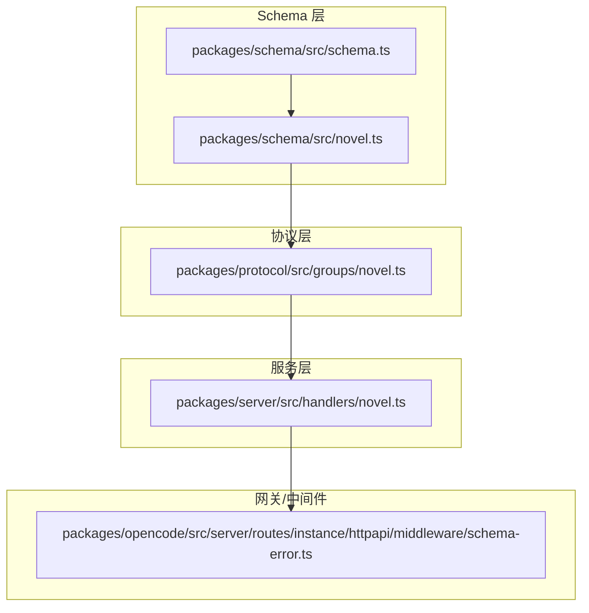
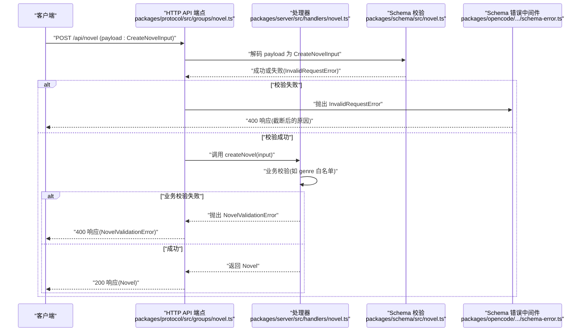
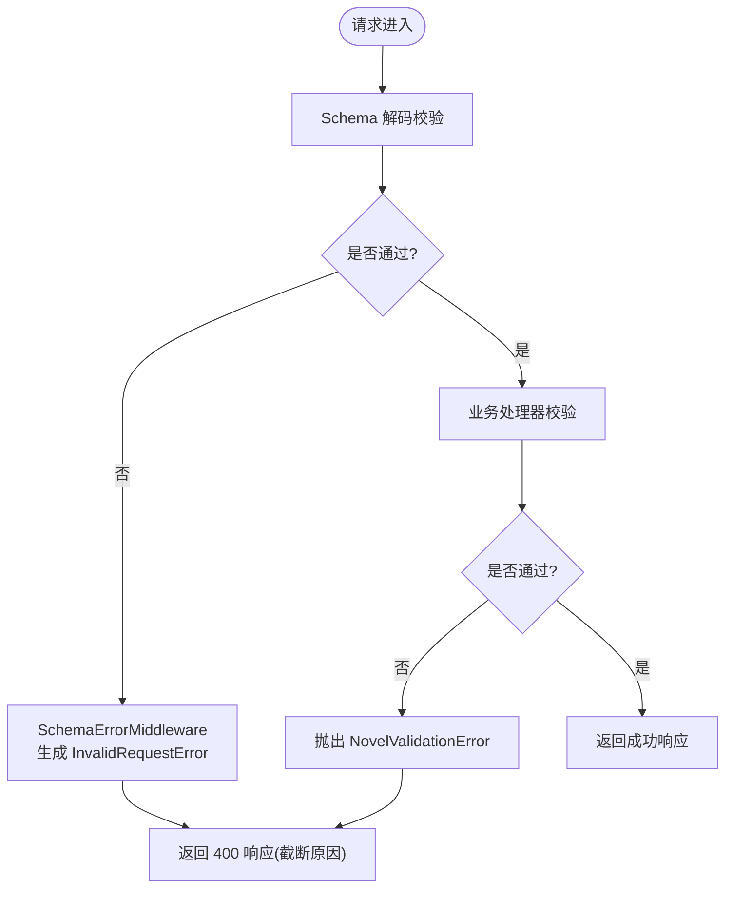
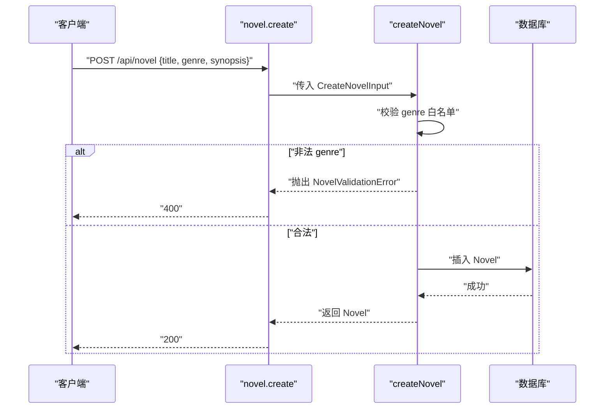
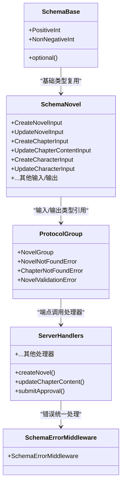

# 输入验证模式

<cite>
**本文引用的文件**   
- [packages/schema/src/novel.ts](file://packages/schema/src/novel.ts)
- [packages/schema/src/schema.ts](file://packages/schema/src/schema.ts)
- [packages/server/src/handlers/novel.ts](file://packages/server/src/handlers/novel.ts)
- [packages/protocol/src/groups/novel.ts](file://packages/protocol/src/groups/novel.ts)
- [packages/opencode/src/server/routes/instance/httpapi/middleware/schema-error.ts](file://packages/opencode/src/server/routes/instance/httpapi/middleware/schema-error.ts)
</cite>

## 目录
1. [简介](#简介)
2. [项目结构](#项目结构)
3. [核心组件](#核心组件)
4. [架构总览](#架构总览)
5. [详细组件分析](#详细组件分析)
6. [依赖关系分析](#依赖关系分析)
7. [性能考量](#性能考量)
8. [故障排查指南](#故障排查指南)
9. [结论](#结论)
10. [附录：CRUD 输入示例与最佳实践](#附录crud-输入示例与最佳实践)

## 简介
本文件系统性梳理并文档化所有与“小说”领域相关的输入验证模式，包括但不限于 CreateNovelInput、UpdateNovelInput、CreateChapterInput、UpdateChapterContentInput、CreateCharacterInput、UpdateCharacterInput 等。内容涵盖：
- 必填字段、可选字段与数据类型约束
- 枚举值与数值范围校验
- 输入模式与实体结构的关联方式
- 验证失败时的错误处理机制
- 常见 CRUD 操作的输入示例与最佳实践

## 项目结构
输入验证模式主要分布在以下位置：
- 类型与 Schema 定义：packages/schema/src/novel.ts
- 通用基础类型与工具：packages/schema/src/schema.ts
- HTTP API 端点与错误类：packages/protocol/src/groups/novel.ts
- 服务端处理器（业务逻辑与运行时校验）：packages/server/src/handlers/novel.ts
- 全局 Schema 错误中间件（统一 4xx 响应格式）：packages/opencode/src/server/routes/instance/httpapi/middleware/schema-error.ts

**图表来源** 
- [packages/schema/src/novel.ts:1-441](file://packages/schema/src/novel.ts#L1-L441)
- [packages/schema/src/schema.ts:1-31](file://packages/schema/src/schema.ts#L1-L31)
- [packages/protocol/src/groups/novel.ts:1-200](file://packages/protocol/src/groups/novel.ts#L1-L200)
- [packages/server/src/handlers/novel.ts:1-800](file://packages/server/src/handlers/novel.ts#L1-L800)
- [packages/opencode/src/server/routes/instance/httpapi/middleware/schema-error.ts:1-41](file://packages/opencode/src/server/routes/instance/httpapi/middleware/schema-error.ts#L1-L41)

**章节来源**
- [packages/schema/src/novel.ts:1-441](file://packages/schema/src/novel.ts#L1-L441)
- [packages/schema/src/schema.ts:1-31](file://packages/schema/src/schema.ts#L1-L31)
- [packages/protocol/src/groups/novel.ts:1-200](file://packages/protocol/src/groups/novel.ts#L1-L200)
- [packages/server/src/handlers/novel.ts:1-800](file://packages/server/src/handlers/novel.ts#L1-L800)
- [packages/opencode/src/server/routes/instance/httpapi/middleware/schema-error.ts:1-41](file://packages/opencode/src/server/routes/instance/httpapi/middleware/schema-error.ts#L1-L41)

## 核心组件
- Schema 定义与基础类型
  - 小说相关实体与输入输出类型集中在 packages/schema/src/novel.ts
  - 通用基础类型（如 PositiveInt、NonNegativeInt、optional）在 packages/schema/src/schema.ts
- HTTP API 协议与错误类
  - 端点声明与输入/输出 Schema 绑定在 packages/protocol/src/groups/novel.ts
  - 领域错误类 NovelValidationError、ChapterNotFoundError、NovelNotFoundError 在此定义
- 服务端处理器
  - 业务逻辑与运行时校验在 packages/server/src/handlers/novel.ts
  - 包含对 genre 的白名单校验、章节版本管理、状态更新等
- 全局 Schema 错误中间件
  - 将 Effect 的 Schema 校验失败转换为统一的 InvalidRequestError 响应，限制消息长度避免过大响应体

**章节来源**
- [packages/schema/src/novel.ts:1-441](file://packages/schema/src/novel.ts#L1-L441)
- [packages/schema/src/schema.ts:1-31](file://packages/schema/src/schema.ts#L1-L31)
- [packages/protocol/src/groups/novel.ts:1-200](file://packages/protocol/src/groups/novel.ts#L1-L200)
- [packages/server/src/handlers/novel.ts:1-800](file://packages/server/src/handlers/novel.ts#L1-L800)
- [packages/opencode/src/server/routes/instance/httpapi/middleware/schema-error.ts:1-41](file://packages/opencode/src/server/routes/instance/httpapi/middleware/schema-error.ts#L1-L41)

## 架构总览
下图展示了从客户端请求到服务端处理的输入验证流程，以及错误返回路径。

**图表来源** 
- [packages/protocol/src/groups/novel.ts:98-113](file://packages/protocol/src/groups/novel.ts#L98-L113)
- [packages/server/src/handlers/novel.ts:347-378](file://packages/server/src/handlers/novel.ts#L347-L378)
- [packages/schema/src/novel.ts:338-343](file://packages/schema/src/novel.ts#L338-L343)
- [packages/opencode/src/server/routes/instance/httpapi/middleware/schema-error.ts:25-41](file://packages/opencode/src/server/routes/instance/httpapi/middleware/schema-error.ts#L25-L41)

## 详细组件分析

### 输入模式总览与约束说明
以下按实体维度列出输入模式、必填/可选字段、数据类型与约束规则。所有字段均基于 Effect Schema 定义，确保强类型与可组合校验。

- CreateNovelInput
  - 必填字段
    - title: string
    - genre: 枚举值，限定为 ["玄幻", "都市", "仙侠", "历史", "科幻", "悬疑", "言情", "游戏"]
    - synopsis: string
  - 可选字段: 无
  - 关联实体: Novel（id、title、genre、synopsis、status、createdAt、updatedAt）
  - 运行时校验: 若 genre 不在白名单，处理器会抛出 NovelValidationError

- UpdateNovelInput
  - 可选字段
    - title?: string
    - synopsis?: string
    - genre?: 枚举值同上
  - 关联实体: Novel
  - 运行时校验: 若提供 genre，需满足枚举白名单

- CreateChapterInput
  - 必填字段
    - title: string
  - 可选字段
    - volumeId?: string
    - order?: NonNegativeInt（>= 0）
  - 关联实体: Chapter（id、novelId、volumeId、title、order、status、wordCount、createdAt、updatedAt）

- UpdateChapterContentInput
  - 必填字段
    - content: string
  - 关联实体: ChapterDetail（含 content 字段）
  - 运行时行为: 更新内容并记录版本历史

- CreateCharacterInput
  - 必填字段
    - name: string
  - 可选字段
    - role?: string
    - description?: string
  - 关联实体: Character（id、novelId、name、role、description、createdAt）

- UpdateCharacterInput
  - 可选字段
    - name?: string
    - role?: string
    - description?: string
  - 关联实体: Character

- 其他相关输入（补充）
  - CreateVolumeInput / UpdateVolumeInput
  - RestoreVersionInput（version: PositiveInt）
  - MoveChapterInput（action: "up" | "down" | "to-volume"; volumeId?: string）
  - UpdateChapterInput（title?: string; status?: string）
  - CreateRelationshipInput / UpdateRelationshipInput
  - CreateCharacterStateInput / UpdateCharacterStateInput
  - UpdateStyleGuideInput
  - CreateTensionPointInput / UpdateTensionPointInput
  - CreatePlotThreadInput / UpdatePlotThreadInput
  - CreateForeshadowingInput / UpdateForeshadowingInput
  - CreateWorldEntryInput / UpdateWorldEntryInput
  - ApprovalInput（action: "approve" | "reject"; comment?: string）
  - BindSessionInput（sessionID: string）

**章节来源**
- [packages/schema/src/novel.ts:338-343](file://packages/schema/src/novel.ts#L338-L343)
- [packages/schema/src/novel.ts:368-373](file://packages/schema/src/novel.ts#L368-L373)
- [packages/schema/src/novel.ts:361-366](file://packages/schema/src/novel.ts#L361-L366)
- [packages/schema/src/novel.ts:345-348](file://packages/schema/src/novel.ts#L345-L348)
- [packages/schema/src/novel.ts:375-380](file://packages/schema/src/novel.ts#L375-L380)
- [packages/schema/src/novel.ts:382-387](file://packages/schema/src/novel.ts#L382-L387)
- [packages/schema/src/novel.ts:262-272](file://packages/schema/src/novel.ts#L262-L272)
- [packages/schema/src/novel.ts:274-277](file://packages/schema/src/novel.ts#L274-L277)
- [packages/schema/src/novel.ts:279-283](file://packages/schema/src/novel.ts#L279-L283)
- [packages/schema/src/novel.ts:285-289](file://packages/schema/src/novel.ts#L285-L289)
- [packages/schema/src/novel.ts:291-303](file://packages/schema/src/novel.ts#L291-L303)
- [packages/schema/src/novel.ts:305-319](file://packages/schema/src/novel.ts#L305-L319)
- [packages/schema/src/novel.ts:321-327](file://packages/schema/src/novel.ts#L321-L327)
- [packages/schema/src/novel.ts:389-398](file://packages/schema/src/novel.ts#L389-L398)
- [packages/schema/src/novel.ts:400-413](file://packages/schema/src/novel.ts#L400-L413)
- [packages/schema/src/novel.ts:415-426](file://packages/schema/src/novel.ts#L415-L426)
- [packages/schema/src/novel.ts:428-440](file://packages/schema/src/novel.ts#L428-L440)
- [packages/schema/src/novel.ts:350-354](file://packages/schema/src/novel.ts#L350-L354)
- [packages/schema/src/novel.ts:356-359](file://packages/schema/src/novel.ts#L356-L359)

### 基础类型与工具
- PositiveInt: 大于 0 的整数
- NonNegativeInt: 大于等于 0 的整数
- optional(schema): 将字段标记为可选，并在编解码时处理 undefined

这些基础类型被广泛复用于各输入模式中，保证一致的数值约束与可选语义。

**章节来源**
- [packages/schema/src/schema.ts:1-31](file://packages/schema/src/schema.ts#L1-L31)

### 错误处理机制
- 协议层错误类
  - NovelValidationError: 业务校验失败（如 genre 非法），HTTP 状态码 400
  - ChapterNotFoundError / NovelNotFoundError: 资源不存在，HTTP 状态码 404
- 中间件统一处理
  - SchemaErrorMiddleware 将 Effect 的 Schema 校验失败转为 InvalidRequestError，限制 reason 长度，避免大响应体泄露敏感信息

**图表来源** 
- [packages/protocol/src/groups/novel.ts:74-80](file://packages/protocol/src/groups/novel.ts#L74-L80)
- [packages/server/src/handlers/novel.ts:301-309](file://packages/server/src/handlers/novel.ts#L301-L309)
- [packages/opencode/src/server/routes/instance/httpapi/middleware/schema-error.ts:25-41](file://packages/opencode/src/server/routes/instance/httpapi/middleware/schema-error.ts#L25-L41)

**章节来源**
- [packages/protocol/src/groups/novel.ts:54-80](file://packages/protocol/src/groups/novel.ts#L54-L80)
- [packages/server/src/handlers/novel.ts:287-309](file://packages/server/src/handlers/novel.ts#L287-L309)
- [packages/opencode/src/server/routes/instance/httpapi/middleware/schema-error.ts:1-41](file://packages/opencode/src/server/routes/instance/httpapi/middleware/schema-error.ts#L1-L41)

### 关键处理器与运行时校验
- 创建小说 createNovel
  - 校验 genre 是否在白名单；否则抛出 NovelValidationError
  - 成功后写入数据库并返回 Novel
- 更新章节内容 updateChapterContent
  - 校验 chapter 是否存在且属于当前 novel
  - 写入版本历史并更新 content 与 wordCount
- 提交审批 submitApproval
  - 校验 chapter 存在性
  - 调用外部审核流程并记录审核结果

**图表来源** 
- [packages/server/src/handlers/novel.ts:347-378](file://packages/server/src/handlers/novel.ts#L347-L378)
- [packages/server/src/handlers/novel.ts:301-309](file://packages/server/src/handlers/novel.ts#L301-L309)

**章节来源**
- [packages/server/src/handlers/novel.ts:347-378](file://packages/server/src/handlers/novel.ts#L347-L378)
- [packages/server/src/handlers/novel.ts:572-612](file://packages/server/src/handlers/novel.ts#L572-L612)
- [packages/server/src/handlers/novel.ts:614-634](file://packages/server/src/handlers/novel.ts#L614-L634)

## 依赖关系分析
- Schema 层依赖基础类型与工具函数（PositiveInt、NonNegativeInt、optional）
- 协议层引用 Schema 定义的输入/输出类型，并声明端点与错误类
- 处理器实现具体业务逻辑，并进行运行时校验（如 genre 白名单）
- 中间件统一处理 Schema 校验失败，保障响应一致性与安全性

**图表来源** 
- [packages/schema/src/novel.ts:1-441](file://packages/schema/src/novel.ts#L1-L441)
- [packages/schema/src/schema.ts:1-31](file://packages/schema/src/schema.ts#L1-L31)
- [packages/protocol/src/groups/novel.ts:1-200](file://packages/protocol/src/groups/novel.ts#L1-L200)
- [packages/server/src/handlers/novel.ts:1-800](file://packages/server/src/handlers/novel.ts#L1-L800)
- [packages/opencode/src/server/routes/instance/httpapi/middleware/schema-error.ts:1-41](file://packages/opencode/src/server/routes/instance/httpapi/middleware/schema-error.ts#L1-L41)

**章节来源**
- [packages/schema/src/novel.ts:1-441](file://packages/schema/src/novel.ts#L1-L441)
- [packages/schema/src/schema.ts:1-31](file://packages/schema/src/schema.ts#L1-L31)
- [packages/protocol/src/groups/novel.ts:1-200](file://packages/protocol/src/groups/novel.ts#L1-L200)
- [packages/server/src/handlers/novel.ts:1-800](file://packages/server/src/handlers/novel.ts#L1-L800)
- [packages/opencode/src/server/routes/instance/httpapi/middleware/schema-error.ts:1-41](file://packages/opencode/src/server/routes/instance/httpapi/middleware/schema-error.ts#L1-L41)

## 性能考量
- Schema 校验在协议层进行，尽早拒绝无效请求，减少后端负载
- 中间件对校验失败的原因信息进行截断，防止超大响应体影响网络与日志
- 处理器中避免不必要的重复查询，尽量批量获取数据后映射为 DTO

[本节为通用指导，不直接分析具体文件]

## 故障排查指南
- 常见 400 错误
  - 字段缺失或类型不符：检查请求体是否符合对应 Input 的 Schema
  - 枚举值非法：如 genre 不在允许列表，处理器会抛出 NovelValidationError
- 常见 404 错误
  - 资源不存在：novelId 或 chapterId 不正确或未绑定
- 调试建议
  - 查看中间件日志中的 reason（已截断），定位具体校验失败的字段
  - 确认请求路径与参数命名是否与端点定义一致

**章节来源**
- [packages/opencode/src/server/routes/instance/httpapi/middleware/schema-error.ts:25-41](file://packages/opencode/src/server/routes/instance/httpapi/middleware/schema-error.ts#L25-L41)
- [packages/server/src/handlers/novel.ts:287-309](file://packages/server/src/handlers/novel.ts#L287-L309)
- [packages/protocol/src/groups/novel.ts:54-80](file://packages/protocol/src/groups/novel.ts#L54-L80)

## 结论
本项目通过 Effect Schema 实现了强类型、可组合的输入验证体系，结合协议层的端点声明与服务器的运行时校验，确保了数据的一致性与安全性。错误处理采用统一中间件，既保证了用户体验，也提升了系统健壮性。遵循本文档的约束与最佳实践，可有效降低集成与维护成本。

[本节为总结，不直接分析具体文件]

## 附录：CRUD 输入示例与最佳实践
以下为各输入模式的典型使用要点与最佳实践（以描述为主，不展示代码片段）：

- 创建小说（CreateNovelInput）
  - 必须提供 title、genre、synopsis
  - genre 必须为允许的枚举值之一
  - 建议在客户端先做前端校验，再发送请求
  - 参考路径：[packages/schema/src/novel.ts:338-343](file://packages/schema/src/novel.ts#L338-L343)、[packages/server/src/handlers/novel.ts:347-378](file://packages/server/src/handlers/novel.ts#L347-L378)

- 更新小说（UpdateNovelInput）
  - 仅更新提供的字段，未提供的字段保持不变
  - 若提供 genre，需满足枚举白名单
  - 参考路径：[packages/schema/src/novel.ts:368-373](file://packages/schema/src/novel.ts#L368-L373)

- 创建章节（CreateChapterInput）
  - 必须提供 title
  - volumeId 与 order 可选；order 必须为非负整数
  - 参考路径：[packages/schema/src/novel.ts:361-366](file://packages/schema/src/novel.ts#L361-L366)

- 更新章节内容（UpdateChapterContentInput）
  - 必须提供 content
  - 服务端会记录版本历史并更新字数统计
  - 参考路径：[packages/schema/src/novel.ts:345-348](file://packages/schema/src/novel.ts#L345-L348)、[packages/server/src/handlers/novel.ts:572-612](file://packages/server/src/handlers/novel.ts#L572-L612)

- 创建角色（CreateCharacterInput）
  - 必须提供 name
  - role、description 可选
  - 参考路径：[packages/schema/src/novel.ts:375-380](file://packages/schema/src/novel.ts#L375-L380)

- 更新角色（UpdateCharacterInput）
  - 仅更新提供的字段
  - 参考路径：[packages/schema/src/novel.ts:382-387](file://packages/schema/src/novel.ts#L382-L387)

- 其他输入模式
  - Volume、TensionPoint、PlotThread、Foreshadowing、WorldEntry、StyleGuide、Relationship、CharacterState 等均有对应的 Create/Update 输入模式，遵循相同的设计原则：明确必填/可选字段、使用基础类型约束、必要时进行运行时校验
  - 参考路径：[packages/schema/src/novel.ts:262-440](file://packages/schema/src/novel.ts#L262-L440)

- 最佳实践
  - 前端预校验：利用 TypeScript 类型与 UI 控件约束（如数字范围、下拉枚举）减少无效请求
  - 后端强校验：始终依赖 Schema 与服务端处理器校验，确保数据一致性
  - 错误提示清晰：根据 field 与 message 向用户反馈具体问题
  - 幂等与事务：对写操作考虑幂等性与事务边界，避免部分更新导致不一致

[本节为通用指导，不直接分析具体文件]