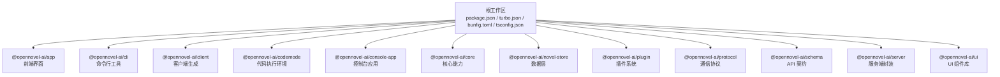
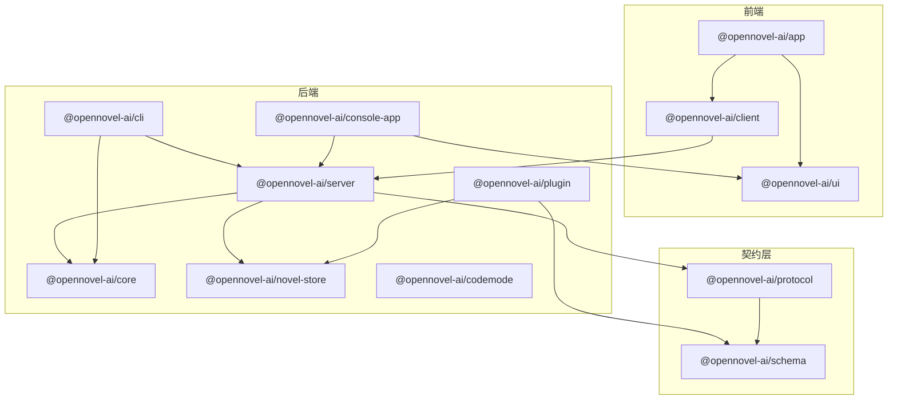
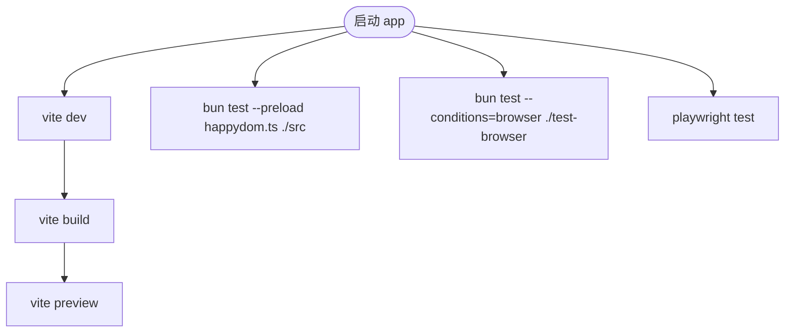
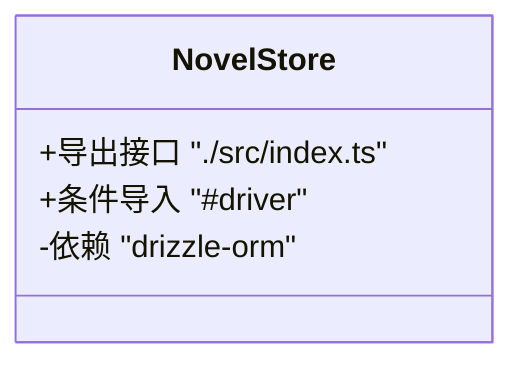
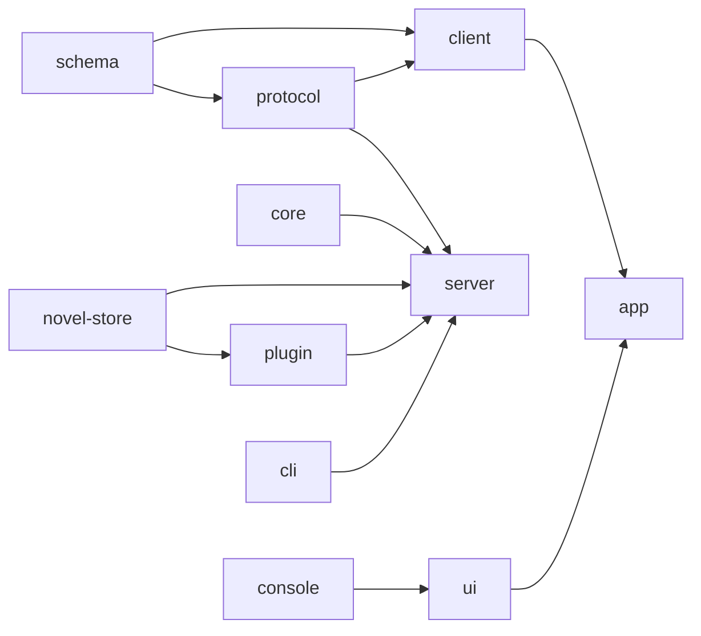

# Monorepo 架构模式

<cite>
**本文引用的文件**
- [package.json](file://package.json)
- [turbo.json](file://turbo.json)
- [bunfig.toml](file://bunfig.toml)
- [tsconfig.json](file://tsconfig.json)
- [README.md](file://README.md)
- [packages/app/package.json](file://packages/app/package.json)
- [packages/cli/package.json](file://packages/cli/package.json)
- [packages/client/package.json](file://packages/client/package.json)
- [packages/codemode/package.json](file://packages/codemode/package.json)
- [packages/console/app/package.json](file://packages/console/app/package.json)
- [packages/core/package.json](file://packages/core/package.json)
- [packages/novel-store/package.json](file://packages/novel-store/package.json)
- [packages/plugin/package.json](file://packages/plugin/package.json)
- [packages/protocol/package.json](file://packages/protocol/package.json)
- [packages/schema/package.json](file://packages/schema/package.json)
- [packages/server/package.json](file://packages/server/package.json)
- [packages/ui/package.json](file://packages/ui/package.json)
</cite>

## 更新摘要
**变更内容**
- 包名从 `@opencode-ai/*` 统一更新为 `@opennovel-ai/*`
- 更新了所有相关包的依赖引用和命名空间
- 保持了原有的架构结构和依赖关系不变

## 目录
1. [简介](#简介)
2. [项目结构](#项目结构)
3. [核心组件](#核心组件)
4. [架构总览](#架构总览)
5. [详细组件分析](#详细组件分析)
6. [依赖关系分析](#依赖关系分析)
7. [性能与构建特性](#性能与构建特性)
8. [故障排查指南](#故障排查指南)
9. [结论](#结论)
10. [附录](#附录)

## 简介
openNovel 是一个基于 Bun 的 Monorepo 工程，面向 AI 驱动的小说创作工具。仓库采用 Turborepo 进行任务编排，Bun 作为包管理器与运行时，TypeScript 提供统一的类型系统。Monorepo 将前端界面、后端服务、数据层、API 契约、通信协议与插件系统解耦为独立包，通过 workspace 机制实现依赖管理与版本一致性。

**更新** 包名已从 `@opencode-ai/*` 全面更新为 `@opennovel-ai/*`，包括数据库实现、会话管理和插件类型定义等所有相关包。

## 项目结构
- 根工作区使用 Bun Workspaces 管理 packages/* 下的所有子包，并支持 console/*、stats/*、sdk/js、slack 等嵌套工作区。
- 根脚本提供 dev:all、dev:web、dev:desktop、typecheck 等常用命令，统一开发体验。
- Turbo 负责跨包的 typecheck、build、test 等任务编排与缓存。
- Bun 配置集中定义安装策略（精确版本、最小发布年龄）与测试根路径限制。
- TypeScript 共享配置继承 @tsconfig/bun，并通过 jsxImportSource 统一 JSX 来源。

**图表来源**
- [package.json:26-33](file://package.json#L26-L33)
- [turbo.json:1-34](file://turbo.json#L1-L34)
- [bunfig.toml:1-9](file://bunfig.toml#L1-L9)
- [tsconfig.json:1-8](file://tsconfig.json#L1-L8)

**章节来源**
- [package.json:1-162](file://package.json#L1-L162)
- [turbo.json:1-34](file://turbo.json#L1-L34)
- [bunfig.toml:1-9](file://bunfig.toml#L1-L9)
- [tsconfig.json:1-8](file://tsconfig.json#L1-L8)
- [README.md:60-69](file://README.md#L60-L69)

## 核心组件
- app：SolidJS Web 前端，提供书架、工作台、审批流等界面，依赖 client、core、schema、sdk、session-ui、ui 等包。
- cli：命令行工具，集成 core、sdk、server、tui 等功能。
- client：客户端代码生成，依赖 schema 与 protocol，可选依赖 Effect。
- codemode：Effect-native 受限代码执行环境，基于 schema 描述的工具。
- console-app：控制台应用，包含 core、mail、resource 等模块。
- core：核心能力（会话运行器、系统上下文、Effect 层、SQLite/PTY/FFF 平台适配）。
- novel-store：以 Drizzle ORM 为核心的数据层，提供小说、章节、角色、审校等持久化能力。
- plugin：写作流水线工具（草稿、连续性审校、提交等），依赖 sdk、novel-store、Effect、Zod。
- protocol：通信协议定义，依赖 schema 并扩展网络交互模型。
- schema：API 契约定义，使用 Effect 进行类型与校验。
- server：服务端封装，组合 core、novel-store、protocol 暴露 HTTP API。
- ui：UI 组件库，提供主题、图标、样式与通用组件，供 app 消费。

**更新** 所有包名已更新为 `@opennovel-ai/*` 命名空间。

**章节来源**
- [packages/app/package.json:1-97](file://packages/app/package.json#L1-L97)
- [packages/cli/package.json:1-37](file://packages/cli/package.json#L1-L37)
- [packages/client/package.json:1-40](file://packages/client/package.json#L1-L40)
- [packages/codemode/package.json:1-27](file://packages/codemode/package.json#L1-L27)
- [packages/console/app/package.json:1-49](file://packages/console/app/package.json#L1-L49)
- [packages/core/package.json:1-133](file://packages/core/package.json#L1-L133)
- [packages/novel-store/package.json:1-34](file://packages/novel-store/package.json#L1-L34)
- [packages/plugin/package.json:1-61](file://packages/plugin/package.json#L1-L61)
- [packages/protocol/package.json:1-23](file://packages/protocol/package.json#L1-L23)
- [packages/schema/package.json:1-23](file://packages/schema/package.json#L1-L23)
- [packages/server/package.json:1-28](file://packages/server/package.json#L1-L28)
- [packages/ui/package.json:1-114](file://packages/ui/package.json#L1-L114)

## 架构总览
下图展示了 openNovel 的整体架构与包间依赖关系。app 作为前端入口，通过 client 调用 server；server 组合 core、novel-store、protocol 提供服务；plugin 在核心能力之上扩展写作流水线；schema 与 protocol 作为契约层贯穿前后端。

**图表来源**
- [packages/app/package.json:49-95](file://packages/app/package.json#L49-L95)
- [packages/client/package.json:17-20](file://packages/client/package.json#L17-L20)
- [packages/server/package.json:15-21](file://packages/server/package.json#L15-L21)
- [packages/core/package.json:92-96](file://packages/core/package.json#L92-L96)
- [packages/novel-store/package.json:24-26](file://packages/novel-store/package.json#L24-L26)
- [packages/plugin/package.json:27-34](file://packages/plugin/package.json#L27-L34)
- [packages/schema/package.json:14-16](file://packages/schema/package.json#L14-L16)
- [packages/protocol/package.json:13-16](file://packages/protocol/package.json#L13-L16)

## 详细组件分析

### 前端应用（@opennovel-ai/app）
- 职责：SolidJS 界面、路由、状态管理、国际化、Vite 构建与预览。
- 关键依赖：client、core、schema、sdk、session-ui、ui。
- 构建与测试：vite dev/build/serve，unit/browser/e2e 测试套件。

**图表来源**
- [packages/app/package.json:14-31](file://packages/app/package.json#L14-L31)

**章节来源**
- [packages/app/package.json:1-97](file://packages/app/package.json#L1-L97)

### 命令行工具（@opennovel-ai/cli）
- 职责：命令行接口，提供 lildax 命令，集成 core、sdk、server、tui 功能。
- 关键依赖：effect、solid-js、@opentui 系列包。
- 构建与开发：bun run script/build.ts 构建，bun run src/index.ts 开发。

**章节来源**
- [packages/cli/package.json:1-37](file://packages/cli/package.json#L1-L37)

### 客户端生成（@opennovel-ai/client）
- 职责：根据 schema 与 protocol 生成客户端代码，可选依赖 Effect。
- 构建与类型检查：生成脚本与 tsgo 类型检查。

**章节来源**
- [packages/client/package.json:1-40](file://packages/client/package.json#L1-L40)

### 代码执行环境（@opennovel-ai/codemode）
- 职责：Effect-native 受限代码执行环境，基于 schema 描述的工具。
- 关键特性：acorn 解析、effect 运行时、typescript 支持。
- 构建与测试：tsgo 类型检查，bun test 测试。

**章节来源**
- [packages/codemode/package.json:1-27](file://packages/codemode/package.json#L1-L27)

### 控制台应用（@opennovel-ai/console-app）
- 职责：Web 控制台应用，包含 core、mail、resource 等模块。
- 关键依赖：cloudflare vite 插件、stripe、upstash redis 等。
- 构建与部署：vite dev/build/start，支持远程开发模式。

**章节来源**
- [packages/console/app/package.json:1-49](file://packages/console/app/package.json#L1-L49)

### 核心能力（@opennovel-ai/core）
- 职责：会话运行器、系统上下文、Effect 层、SQLite/PTY/FFF 平台适配。
- 关键特性：条件导入 sqlite、pty、fff 以适配 Bun/Node。
- 构建与类型检查：tsgo 类型检查，包含迁移与修复脚本。

**章节来源**
- [packages/core/package.json:1-133](file://packages/core/package.json#L1-L133)

### 数据层（@opennovel-ai/novel-store）
- 职责：小说、章节、角色、审校等数据模型与持久化。
- 关键特性：通过 #driver 条件导入选择 Bun/Node 驱动，使用 Drizzle ORM。
- 构建与类型检查：tsc 构建，tsgo 类型检查。

**图表来源**
- [packages/novel-store/package.json:11-20](file://packages/novel-store/package.json#L11-L20)

**章节来源**
- [packages/novel-store/package.json:1-34](file://packages/novel-store/package.json#L1-L34)

### 插件系统（@opennovel-ai/plugin）
- 职责：写作流水线工具（草稿、连续性审校、提交等），提供 TUI 与 v2 集成。
- 关键依赖：sdk、novel-store、Effect、Zod；peerDependencies 声明可选 UI 依赖。
- 构建与类型检查：tsc 构建，tsgo 类型检查。

**章节来源**
- [packages/plugin/package.json:1-61](file://packages/plugin/package.json#L1-L61)

### API 契约（@opennovel-ai/schema）
- 职责：定义前后端共享的数据结构与校验规则。
- 关键特性：使用 Effect 进行类型与校验，无运行时依赖。
- 构建与类型检查：tsgo 类型检查。

**章节来源**
- [packages/schema/package.json:1-23](file://packages/schema/package.json#L1-L23)

### 通信协议（@opennovel-ai/protocol）
- 职责：定义网络传输协议与消息格式，依赖 schema 扩展。
- 关键特性：纯类型与 Effect 校验，无额外运行时依赖。
- 构建与类型检查：tsgo 类型检查。

**章节来源**
- [packages/protocol/package.json:1-23](file://packages/protocol/package.json#L1-L23)

### 服务端封装（@opennovel-ai/server）
- 职责：组合 core、novel-store、protocol 暴露 HTTP API。
- 构建与类型检查：tsgo 类型检查，bun test。

**章节来源**
- [packages/server/package.json:1-28](file://packages/server/package.json#L1-L28)

### UI 组件库（@opennovel-ai/ui）
- 职责：主题、图标、样式与通用组件，供 app 消费。
- 构建与类型检查：tsc 构建，tsgo 类型检查，Vite 开发。

**章节来源**
- [packages/ui/package.json:1-114](file://packages/ui/package.json#L1-L114)

## 依赖关系分析
- 包间依赖遵循"契约层 -> 核心层 -> 服务层 -> 前端"的分层原则。
- schema 与 protocol 作为契约层被 server、client、plugin 共同依赖。
- core 提供平台适配与基础能力，server 在其上封装 HTTP API。
- app 消费 client、ui、session-ui 等前端包，形成清晰的前后端边界。

**图表来源**
- [packages/schema/package.json:14-16](file://packages/schema/package.json#L14-L16)
- [packages/protocol/package.json:13-16](file://packages/protocol/package.json#L13-L16)
- [packages/client/package.json:17-20](file://packages/client/package.json#L17-L20)
- [packages/server/package.json:15-21](file://packages/server/package.json#L15-L21)
- [packages/core/package.json:92-96](file://packages/core/package.json#L92-L96)
- [packages/novel-store/package.json:24-26](file://packages/novel-store/package.json#L24-L26)
- [packages/plugin/package.json:27-34](file://packages/plugin/package.json#L27-L34)
- [packages/app/package.json:49-95](file://packages/app/package.json#L49-L95)

**章节来源**
- [packages/app/package.json:49-95](file://packages/app/package.json#L49-L95)
- [packages/cli/package.json:20-23](file://packages/cli/package.json#L20-L23)
- [packages/server/package.json:15-21](file://packages/server/package.json#L15-L21)
- [packages/client/package.json:17-20](file://packages/client/package.json#L17-L20)

## 性能与构建特性
- 包管理器与安装策略：
  - Bun 安装启用 exact 版本锁定与 minimumReleaseAge 策略，减少不稳定依赖引入。
  - trustedDependencies 与 patchedDependencies 用于原生模块与第三方补丁。
- 构建与任务编排：
  - Turborepo 定义 typecheck、build、test 任务，支持 dependsOn 与 outputs 缓存。
  - 各包 scripts 统一使用 tsgo 进行类型检查，提升类型检查性能。
- 运行时与调试：
  - 根脚本提供 dev:all、dev:web、dev:desktop 等多环境开发入口。
  - Bun 条件导入（imports）用于平台差异化实现（如 db、driver、sqlite、pty、fff）。

**章节来源**
- [package.json:129-160](file://package.json#L129-L160)
- [turbo.json:1-34](file://turbo.json#L1-L34)
- [bunfig.toml:1-9](file://bunfig.toml#L1-L9)
- [packages/core/package.json:25-41](file://packages/core/package.json#L25-L41)
- [packages/novel-store/package.json:14-20](file://packages/novel-store/package.json#L14-L20)

## 故障排查指南
- 类型检查失败：
  - 确认各包 scripts.typecheck 使用 tsgo，确保 tsconfig 继承 @tsconfig/bun。
  - 检查共享依赖版本是否一致（catalog 与 overrides）。
- 构建缓存问题：
  - 清理 Turborepo 缓存后重试，检查 outputs 配置是否正确。
- 原生模块安装失败：
  - 检查 trustedDependencies 与 patchedDependencies 是否覆盖相关包。
- 平台差异导入错误：
  - 确认 imports 条件映射（bun/node/default）与实际实现存在。
- 包名引用错误：
  - 确认所有包名已更新为 `@opennovel-ai/*` 命名空间。
  - 检查依赖引用是否使用了正确的包名。

**更新** 新增了包名引用错误的排查指南。

**章节来源**
- [turbo.json:5-15](file://turbo.json#L5-L15)
- [package.json:129-160](file://package.json#L129-L160)
- [packages/core/package.json:25-41](file://packages/core/package.json#L25-L41)
- [packages/novel-store/package.json:14-20](file://packages/novel-store/package.json#L14-L20)

## 结论
openNovel 的 Monorepo 架构通过清晰的包分层与契约隔离，实现了前后端解耦与可维护性。Turborepo 与 Bun 的组合提供了高效的构建与开发体验，条件导入与平台适配增强了跨环境兼容性。包名从 `@opencode-ai/*` 更新为 `@opennovel-ai/*` 的变更保持了架构的一致性和完整性。建议持续优化依赖版本管理与缓存策略，进一步提升开发与构建效率。

**更新** 强调了包名变更对架构一致性的积极影响。

## 附录
- 快速开始：参考 README 中的 dev:all 命令，同时启动后端与 Web UI。
- 开发工作流：
  - 并行开发：使用 Turborepo 并行执行 typecheck/build/test。
  - 热重载：Vite 提供前端热更新，Bun 提供后端快速重启。
  - 调试配置：在各包 scripts 中配置测试与调试入口。
- 包名规范：所有内部包使用 `@opennovel-ai/*` 命名空间，保持品牌一致性。

**更新** 新增了包名规范的说明。

**章节来源**
- [README.md:34-58](file://README.md#L34-L58)
- [turbo.json:1-34](file://turbo.json#L1-L34)
- [packages/app/package.json:14-31](file://packages/app/package.json#L14-L31)
- [packages/cli/package.json:14-16](file://packages/cli/package.json#L14-L16)