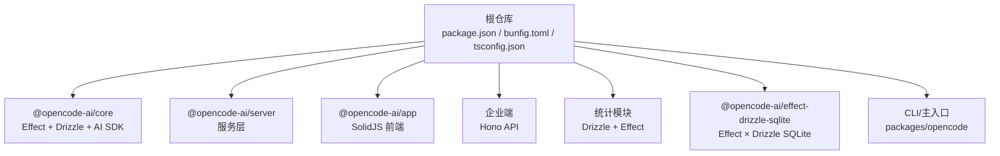
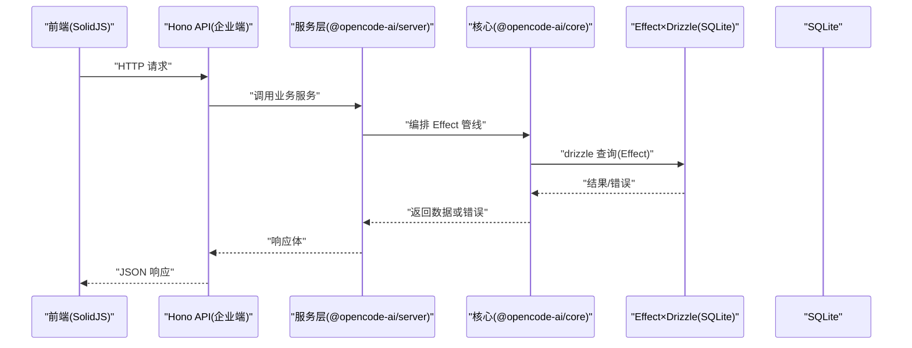
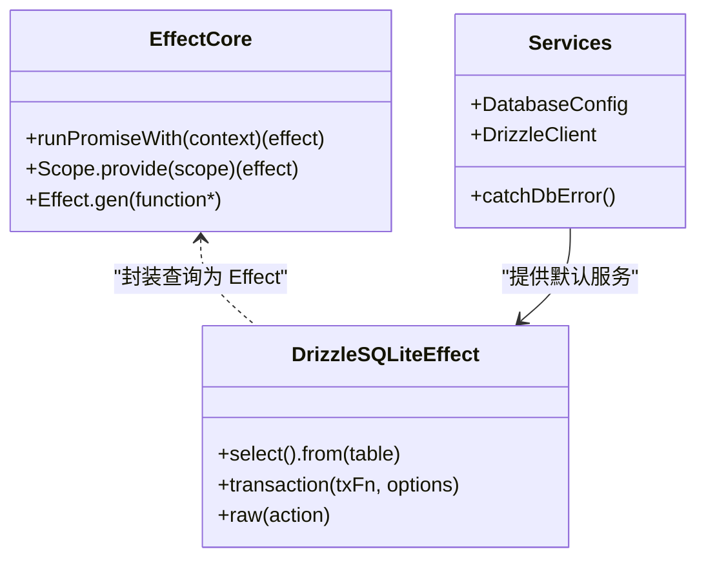
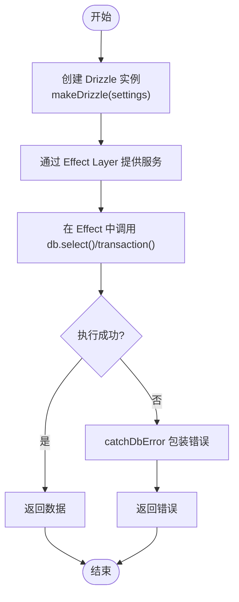
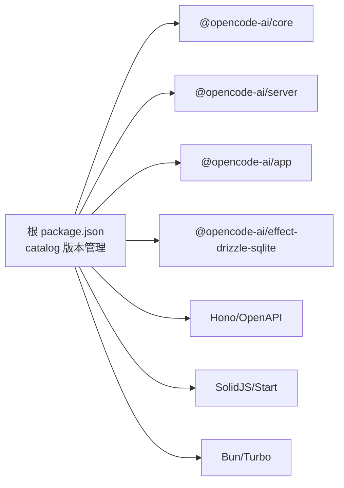

# 技术栈选择

<cite>
**本文引用的文件**   
- [package.json](file://package.json)
- [bunfig.toml](file://bunfig.toml)
- [tsconfig.json](file://tsconfig.json)
- [packages/core/package.json](file://packages/core/package.json)
- [packages/server/package.json](file://packages/server/package.json)
- [packages/app/package.json](file://packages/app/package.json)
- [packages/effect-drizzle-sqlite/package.json](file://packages/effect-drizzle-sqlite/package.json)
- [packages/effect-drizzle-sqlite/src/sqlite-core/effect/query.ts](file://packages/effect-drizzle-sqlite/src/sqlite-core/effect/query.ts)
- [packages/effect-drizzle-sqlite/src/sqlite-core/effect/raw.ts](file://packages/effect-drizzle-sqlite/src/sqlite-core/effect/raw.ts)
- [packages/stats/core/src/database.ts](file://packages/stats/core/src/database.ts)
- [packages/enterprise/src/routes/api/[...path].ts](file://packages/enterprise/src/routes/api/[...path].ts)
- [packages/function/src/api.ts](file://packages/function/src/api.ts)
- [packages/opencode/package.json](file://packages/opencode/package.json)
- [packages/console/app/src/entry-client.tsx](file://packages/console/app/src/entry-client.tsx)
- [packages/enterprise/src/entry-client.tsx](file://packages/enterprise/src/entry-client.tsx)
- [packages/stats/app/src/entry-client.tsx](file://packages/stats/app/src/entry-client.tsx)
- [packages/app/tsconfig.json](file://packages/app/tsconfig.json)
- [specs/storage/effect-sqlite-package.md](file://specs/storage/effect-sqlite-package.md)
</cite>

## 目录
1. [简介](#简介)
2. [项目结构](#项目结构)
3. [核心组件](#核心组件)
4. [架构总览](#架构总览)
5. [详细组件分析](#详细组件分析)
6. [依赖分析](#依赖分析)
7. [性能考量](#性能考量)
8. [故障排查指南](#故障排查指南)
9. [结论](#结论)
10. [附录](#附录)

## 简介
本文件为 openNovel 项目的技术栈选择提供系统化说明，重点解释以下选型的原因、权衡与集成方式：
- TypeScript 作为主要开发语言
- Effect Framework（effect）用于函数式编程与资源管理
- SolidJS 作为前端框架
- Bun 作为运行时与包管理器
- Drizzle ORM 进行数据库建模与查询
- Hono 作为 Web 框架

文档同时给出版本兼容性与升级策略、技术栈对比表与迁移指南，并解释为何选择这些技术而非其他替代方案。

## 项目结构
openNovel 采用多包 Monorepo 组织，根 package.json 通过 workspaces/catalog 统一管理依赖版本，Bun 作为包管理器与脚本执行器；TypeScript 配置统一继承 @tsconfig/bun，前端各应用使用 SolidJS Start 的入口挂载。

图表来源
- [package.json:1-162](file://package.json#L1-L162)
- [bunfig.toml:1-9](file://bunfig.toml#L1-L9)
- [tsconfig.json:1-8](file://tsconfig.json#L1-L8)

章节来源
- [package.json:1-162](file://package.json#L1-L162)
- [bunfig.toml:1-9](file://bunfig.toml#L1-L9)
- [tsconfig.json:1-8](file://tsconfig.json#L1-L8)

## 核心组件
- TypeScript：统一类型系统与构建工具链，根 tsconfig 继承 @tsconfig/bun，确保 Node/Bun 环境一致性；前端各子包按需扩展（如 packages/app/tsconfig.json）。
- Effect Framework：贯穿 core/server/stats 等后端包，提供可组合的 Effect 类型、Layer 依赖注入、资源管理与错误处理。
- SolidJS：前端 UI 框架，配合 @solidjs/start 提供 SSR/路由/客户端挂载能力，多个应用共享统一的 entry-client.tsx 模式。
- Bun：包管理器与运行时，锁定精确版本与最小发布年龄，提升安装稳定性与可重现性。
- Drizzle ORM：类型安全的 SQL 抽象，结合自定义 effect-drizzle-sqlite 适配层，将 Drizzle 查询封装为 Effect。
- Hono：轻量 Web 框架，用于企业端 API 路由与 OpenAPI 集成。

章节来源
- [packages/core/package.json:1-133](file://packages/core/package.json#L1-L133)
- [packages/server/package.json:1-28](file://packages/server/package.json#L1-L28)
- [packages/app/package.json:1-97](file://packages/app/package.json#L1-L97)
- [packages/effect-drizzle-sqlite/package.json:1-29](file://packages/effect-drizzle-sqlite/package.json#L1-L29)
- [packages/enterprise/src/routes/api/[...path].ts:1-10](file://packages/enterprise/src/routes/api/[...path].ts#L1-L10)
- [packages/function/src/api.ts:1-10](file://packages/function/src/api.ts#L1-L10)
- [packages/console/app/src/entry-client.tsx:1-4](file://packages/console/app/src/entry-client.tsx#L1-L4)
- [packages/enterprise/src/entry-client.tsx:1-4](file://packages/enterprise/src/entry-client.tsx#L1-L4)
- [packages/stats/app/src/entry-client.tsx:1-7](file://packages/stats/app/src/entry-client.tsx#L1-L7)

## 架构总览
下图展示从前端到后端、再到数据库的整体调用路径，以及 Effect 在数据访问层的贯穿作用。

图表来源
- [packages/enterprise/src/routes/api/[...path].ts:1-10](file://packages/enterprise/src/routes/api/[...path].ts#L1-L10)
- [packages/function/src/api.ts:1-10](file://packages/function/src/api.ts#L1-L10)
- [packages/core/package.json:1-133](file://packages/core/package.json#L1-L133)
- [packages/effect-drizzle-sqlite/src/sqlite-core/effect/query.ts:1-36](file://packages/effect-drizzle-sqlite/src/sqlite-core/effect/query.ts#L1-L36)
- [packages/effect-drizzle-sqlite/src/sqlite-core/effect/raw.ts:1-49](file://packages/effect-drizzle-sqlite/src/sqlite-core/effect/raw.ts#L1-L49)

## 详细组件分析

### TypeScript 选型与配置
- 根级 tsconfig 继承 @tsconfig/bun，启用 ESNext 目标与 bundler 解析，保证跨平台一致行为。
- 前端包（如 packages/app/tsconfig.json）针对 SolidJS 设置 jsxImportSource 与模块解析策略。
- 优势：强类型约束、更好的 IDE 体验、跨包共享类型定义；与 Bun/Node 生态无缝衔接。
- 权衡：严格模式与 noEmit 策略需在各包内协调，避免重复编译开销。

章节来源
- [tsconfig.json:1-8](file://tsconfig.json#L1-L8)
- [packages/app/tsconfig.json:1-26](file://packages/app/tsconfig.json#L1-L26)

### Effect Framework（effect）
- 在 core/server/stats 中广泛使用 Effect 表达异步副作用、错误传播与资源清理。
- 通过 Layer 实现依赖注入与服务装配，便于测试与替换实现。
- 与 Drizzle 的集成通过自定义 effect-drizzle-sqlite 包完成，将查询封装为 Effect，保持类型安全与事务语义。

图表来源
- [packages/core/src/plugin/promise.ts:28-43](file://packages/core/src/plugin/promise.ts#L28-L43)
- [packages/effect-drizzle-sqlite/src/sqlite-core/effect/query.ts:1-36](file://packages/effect-drizzle-sqlite/src/sqlite-core/effect/query.ts#L1-L36)
- [packages/stats/core/src/database.ts:34-69](file://packages/stats/core/src/database.ts#L34-L69)

章节来源
- [packages/core/src/plugin/promise.ts:28-43](file://packages/core/src/plugin/promise.ts#L28-L43)
- [packages/effect-drizzle-sqlite/src/sqlite-core/effect/query.ts:1-36](file://packages/effect-drizzle-sqlite/src/sqlite-core/effect/query.ts#L1-L36)
- [packages/effect-drizzle-sqlite/src/sqlite-core/effect/raw.ts:1-49](file://packages/effect-drizzle-sqlite/src/sqlite-core/effect/raw.ts#L1-L49)
- [packages/stats/core/src/database.ts:34-69](file://packages/stats/core/src/database.ts#L34-L69)

### SolidJS 前端框架
- 使用 @solidjs/start 提供 SSR/路由/客户端挂载，entry-client.tsx 统一挂载入口。
- 与 TailwindCSS、TanStack Query、Sentry 等生态集成良好，适合高性能、细粒度更新的前端应用。
- 优势：声明式响应式、极小运行时、良好的 DX；与 Vite 构建流程契合。
- 权衡：SSR/CSR 边界需明确，部分第三方库需适配 Solid 的响应式模型。

章节来源
- [packages/console/app/src/entry-client.tsx:1-4](file://packages/console/app/src/entry-client.tsx#L1-L4)
- [packages/enterprise/src/entry-client.tsx:1-4](file://packages/enterprise/src/entry-client.tsx#L1-L4)
- [packages/stats/app/src/entry-client.tsx:1-7](file://packages/stats/app/src/entry-client.tsx#L1-L7)
- [packages/app/package.json:1-97](file://packages/app/package.json#L1-L97)

### Bun 运行时与包管理
- 根 package.json 指定 packageManager=bun@1.3.14，scripts 以 bun 驱动 dev/build/test。
- bunfig.toml 开启 exact=true 与 minimumReleaseAge，确保依赖稳定与可重现安装。
- 优势：极速安装与运行、原生支持 TS/JSX、内置测试与打包优化。
- 权衡：生态兼容性需关注，某些原生模块需要额外补丁或条件导入。

章节来源
- [package.json:1-162](file://package.json#L1-L162)
- [bunfig.toml:1-9](file://bunfig.toml#L1-L9)

### Drizzle ORM 与 Effect 集成
- 通过 @opencode-ai/effect-drizzle-sqlite 将 Drizzle 查询封装为 Effect，保持类型安全与事务语义。
- stats 模块展示了 DrizzleClient 作为 Effect Service 的装配方式，并提供 catchDbError 统一错误包装。
- 优势：类型推断完善、SQL 生成透明、与 Effect 的错误/上下文模型一致。
- 权衡：自定义适配层需维护，迁移时需关注 Drizzle 版本变更。

图表来源
- [packages/stats/core/src/database.ts:34-69](file://packages/stats/core/src/database.ts#L34-L69)
- [packages/effect-drizzle-sqlite/src/sqlite-core/effect/query.ts:1-36](file://packages/effect-drizzle-sqlite/src/sqlite-core/effect/query.ts#L1-L36)
- [specs/storage/effect-sqlite-package.md:58-90](file://specs/storage/effect-sqlite-package.md#L58-L90)

章节来源
- [packages/effect-drizzle-sqlite/package.json:1-29](file://packages/effect-drizzle-sqlite/package.json#L1-L29)
- [packages/stats/core/src/database.ts:34-69](file://packages/stats/core/src/database.ts#L34-L69)
- [specs/storage/effect-sqlite-package.md:58-90](file://specs/storage/effect-sqlite-package.md#L58-L90)

### Hono Web 框架
- 企业端 API 使用 Hono 定义路由，并结合 hono-openapi 生成 OpenAPI 描述与校验。
- 优势：轻量、中间件生态丰富、与 Cloudflare Workers/Vercel 等平台兼容性好。
- 权衡：相比 Express/Koa，生态较小，但足以满足现代 API 需求。

章节来源
- [packages/enterprise/src/routes/api/[...path].ts:1-10](file://packages/enterprise/src/routes/api/[...path].ts#L1-L10)
- [packages/function/src/api.ts:1-10](file://packages/function/src/api.ts#L1-L10)

## 依赖分析
Monorepo 通过 catalog 集中管理依赖版本，确保各包间版本一致，减少冲突。关键依赖包括：
- TypeScript、Vite、SolidJS、TailwindCSS（前端）
- Effect、Drizzle、Hono（后端）
- Bun（运行时与包管理）

图表来源
- [package.json:1-162](file://package.json#L1-L162)

章节来源
- [package.json:1-162](file://package.json#L1-L162)

## 性能考量
- 前端：SolidJS 细粒度更新与 Vite 构建优化，减少重渲染与打包体积。
- 后端：Effect 的资源管理与错误传播降低内存泄漏风险；Drizzle 的类型安全查询减少运行时错误。
- 运行时：Bun 的快速启动与 I/O 性能提升整体吞吐。
- 建议：合理使用 createEffect/onMount，避免不必要的副作用；对热点查询添加缓存与分页。

## 故障排查指南
- 依赖问题：检查 bun.lock 与 catalog 版本是否一致，必要时更新 patches。
- 类型错误：确认各包 tsconfig 的 moduleResolution 与 jsxImportSource 设置。
- 数据库连接：查看 DrizzleClient 的 Layer 装配与 catchDbError 错误信息。
- 前端挂载：确认 entry-client.tsx 中的 #app 元素存在且正确挂载。

章节来源
- [packages/stats/core/src/database.ts:34-69](file://packages/stats/core/src/database.ts#L34-L69)
- [packages/console/app/src/entry-client.tsx:1-4](file://packages/console/app/src/entry-client.tsx#L1-L4)

## 结论
openNovel 的技术栈围绕 TypeScript、Effect、SolidJS、Bun、Drizzle、Hono 构建，形成高内聚、低耦合、类型安全、性能友好的全栈体系。该选型在开发效率、运行性能、可维护性与生态兼容性之间取得平衡，适合大型协作与长期演进。

## 附录

### 技术栈对比表
- TypeScript vs JavaScript：类型安全、IDE 支持、工程化更强。
- Effect vs Promise/Async-Await：结构化并发、错误传播、资源管理更优。
- SolidJS vs React/Vue：响应式粒度更细、运行时更小、DX 优秀。
- Bun vs Node.js：更快安装与运行、原生 TS/JSX 支持。
- Drizzle vs Prisma/Sequelize：类型安全、SQL 透明、轻量无侵入。
- Hono vs Express/Koa：更轻、云原生友好、OpenAPI 集成方便。

### 版本兼容性与升级策略
- 使用 catalog 集中管理版本，定期扫描依赖更新。
- 对不稳定的依赖（如 beta 版）通过 patches 临时修复。
- 升级前运行 typecheck 与 test，确保类型与行为一致。
- 对 Drizzle/Hono/SolidJS 等框架，优先跟随官方 LTS 或稳定版本。

### 迁移指南
- 从 JS 迁移到 TS：逐步启用 strict 模式，补充类型定义。
- 引入 Effect：将 Promise 链转换为 Effect.gen，使用 Layer 管理依赖。
- 前端重构：将 React/Vue 组件迁移至 SolidJS，注意响应式差异。
- 数据库迁移：使用 Drizzle Kit 生成迁移脚本，逐步替换原有 ORM 调用。
- 运行时切换：在 Bun 环境下验证兼容性，必要时调整 polyfill 或补丁。