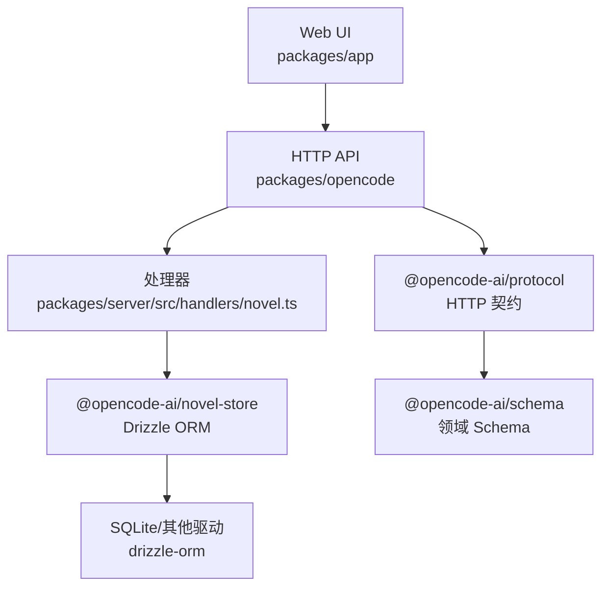
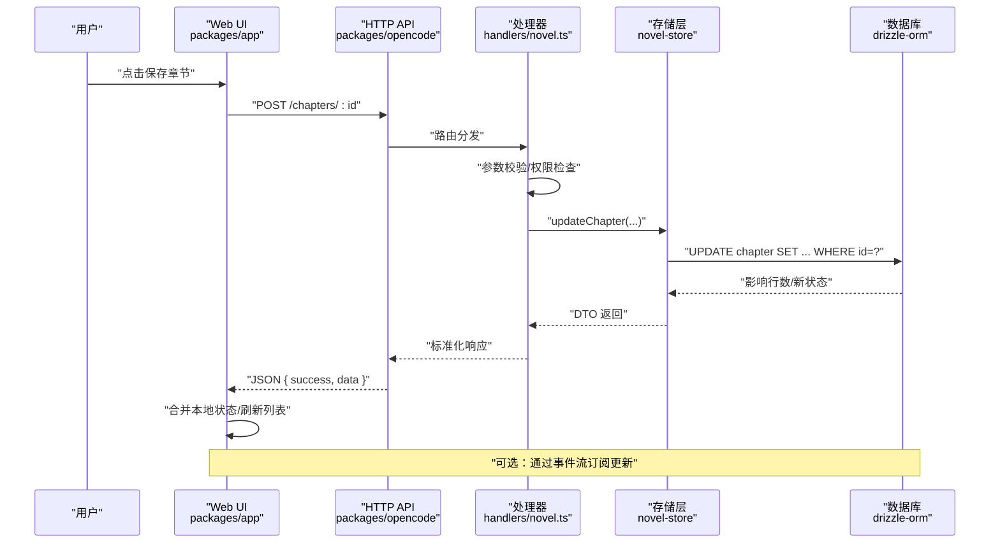
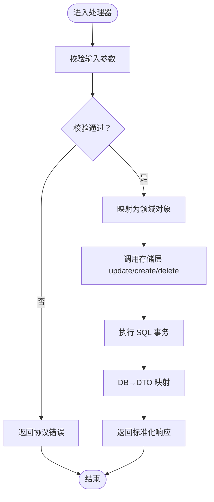
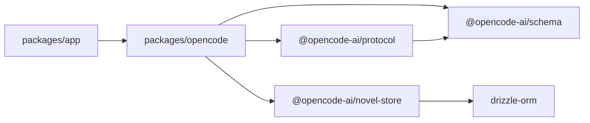
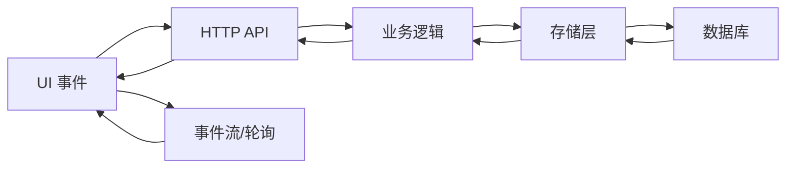
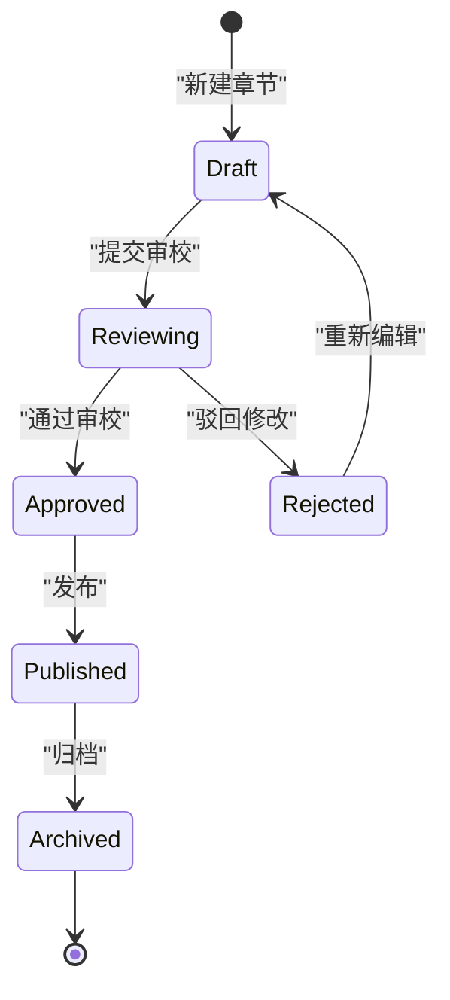

# 数据流设计

<cite>
**本文引用的文件**   
- [README.md](file://README.md)
- [CONTEXT.md](file://CONTEXT.md)
- [novel.ts](file://packages/server/src/handlers/novel.ts)
- [package.json (opencode)](file://packages/opencode/package.json)
- [package.json (schema)](file://packages/schema/package.json)
- [package.json (protocol)](file://packages/protocol/package.json)
- [package.json (novel-store)](file://packages/novel-store/package.json)
- [database.ts](file://packages/stats/core/src/database.ts)
</cite>

## 目录
1. [简介](#简介)
2. [项目结构](#项目结构)
3. [核心组件](#核心组件)
4. [架构总览](#架构总览)
5. [详细组件分析](#详细组件分析)
6. [依赖关系分析](#依赖关系分析)
7. [性能与缓存策略](#性能与缓存策略)
8. [故障排查指南](#故障排查指南)
9. [结论](#结论)
10. [附录](#附录)

## 简介
本文件面向 openNovel 的数据流设计，系统化阐述从用户操作到数据存储的完整路径：UI 事件 → API 调用 → 业务逻辑处理 → 数据库操作 → 实时更新。同时覆盖状态管理模式（客户端与服务端）、数据验证与转换（Schema → DTO → DB）、缓存与性能优化、事务与并发控制，以及关键数据流图与状态转换图。

## 项目结构
openNovel 为 Bun monorepo，核心数据层与协议约定分布如下：
- packages/novel-store：小说、章节、角色、审校等数据的持久化存储实现（Drizzle ORM）
- packages/schema + packages/protocol：共享的领域 Schema 与 HTTP 协议契约（服务端与客户端共用）
- packages/opencode：后端服务与 CLI（路由、中间件、处理器、存储适配）
- packages/app：SolidJS Web UI（书架、工作台、审批流程）
- packages/plugin：写作流水线工具（草稿、连续性审校、提交审校）

图表来源
- [novel.ts:1-60](file://packages/server/src/handlers/novel.ts#L1-L60)
- [package.json (opencode):88-95](file://packages/opencode/package.json#L88-L95)
- [package.json (protocol):14-16](file://packages/protocol/package.json#L14-L16)
- [package.json (schema):14-16](file://packages/schema/package.json#L14-L16)
- [package.json (novel-store):24-26](file://packages/novel-store/package.json#L24-L26)

章节来源
- [README.md:60-68](file://README.md#L60-L68)

## 核心组件
- 存储层（novel-store）：基于 Drizzle ORM 提供小说、卷、章节、版本、审校、角色、情节线、伏笔、世界观、风格指南、张力日志、关系、角色状态等实体的 CRUD 能力。
- 协议层（protocol）：定义 HTTP API 分组、请求/响应体、错误码、游标与流式接口，保证前后端一致契约。
- 领域模型（schema）：以 Effect Schema 声明领域值类型、校验规则与编解码，作为服务端与客户端共享的类型与校验基础。
- 服务器与处理器（opencode/server）：路由装配、中间件、处理器编排；处理器将 HTTP 输入映射为领域操作，调用存储层并返回 DTO。
- 前端（app）：SolidJS 应用，负责用户交互、本地状态管理、与服务端同步、实时事件订阅。

章节来源
- [novel.ts:1-60](file://packages/server/src/handlers/novel.ts#L1-L60)
- [package.json (novel-store):24-26](file://packages/novel-store/package.json#L24-L26)
- [package.json (protocol):14-16](file://packages/protocol/package.json#L14-L16)
- [package.json (schema):14-16](file://packages/schema/package.json#L14-L16)

## 架构总览
下图展示一次“保存章节”的端到端数据流：UI 触发编辑 → 发起 HTTP 请求 → 处理器校验与映射 → 存储层写入 → 返回结果 → 前端更新本地状态 → 可选地通过事件流推送变更。

图表来源
- [novel.ts:1-60](file://packages/server/src/handlers/novel.ts#L1-L60)
- [package.json (novel-store):24-26](file://packages/novel-store/package.json#L24-L26)

章节来源
- [novel.ts:1-60](file://packages/server/src/handlers/novel.ts#L1-L60)

## 详细组件分析

### 处理器与数据映射（novel.ts）
- 职责：解析 HTTP 请求，进行领域校验，调用存储层函数，完成 DB→DTO 映射，返回统一响应。
- 关键点：
  - 使用 drizzle-orm 查询表结构推断类型（如 NovelRow、ChapterRow），确保强类型映射。
  - 提供 toNovel/toChapter/toChapterVersion 等映射函数，将行记录转换为对外 DTO。
  - 错误处理：未找到资源时返回协议定义的 NotFound 错误。
  - 事务性：对多步写操作（如创建章节+版本）应在存储层或处理器内组合 Effect 事务。

图表来源
- [novel.ts:67-200](file://packages/server/src/handlers/novel.ts#L67-L200)

章节来源
- [novel.ts:67-200](file://packages/server/src/handlers/novel.ts#L67-L200)

### 存储层与 ORM（novel-store）
- 职责：封装 Drizzle ORM 访问，暴露领域级 CRUD 方法（如 createChapter、updateNovel、deleteRelationship）。
- 关键点：
  - 通过包导出统一的存储函数，屏蔽底层驱动差异（Bun/Node 驱动选择）。
  - 与 schema/protocol 解耦，仅关注数据存取与映射。
  - 可结合 Effect 进行错误包装与重试策略。

章节来源
- [package.json (novel-store):24-26](file://packages/novel-store/package.json#L24-L26)
- [novel.ts:1-60](file://packages/server/src/handlers/novel.ts#L1-L60)

### 协议与 Schema（protocol + schema）
- 职责：
  - schema：用 Effect Schema 声明领域值类型、约束与编解码，保证输入输出一致性。
  - protocol：定义 HTTP API 分组、路径、请求/响应体、错误、游标与流式接口。
- 关键点：
  - 前后端共享同一份 Schema，避免漂移。
  - 协议层在 Server 侧装配路由与中间件，Client 侧生成 SDK。

章节来源
- [package.json (schema):14-16](file://packages/schema/package.json#L14-L16)
- [package.json (protocol):14-16](file://packages/protocol/package.json#L14-L16)

### 运行时与数据库连接（stats/database.ts）
- 职责：示例展示了如何以 Effect Layer 构建 Drizzle 客户端，并提供统一的错误类型（DatabaseError/MigrationError）。
- 关键点：
  - 使用 Layer.effect 注入配置，构造 drizzle 实例。
  - 捕获并包装数据库异常，便于上层统一处理。

章节来源
- [database.ts:34-69](file://packages/stats/core/src/database.ts#L34-L69)

## 依赖关系分析
- opencode 依赖 protocol、schema、novel-store、server 等内部包。
- novel-store 依赖 drizzle-orm，并通过条件导入选择驱动（bun/node）。
- protocol 依赖 schema，用于类型与校验。
- app（前端）通过 protocol 生成的 SDK 调用后端 API。

图表来源
- [package.json (opencode):88-95](file://packages/opencode/package.json#L88-L95)
- [package.json (novel-store):24-26](file://packages/novel-store/package.json#L24-L26)
- [package.json (protocol):14-16](file://packages/protocol/package.json#L14-L16)
- [package.json (schema):14-16](file://packages/schema/package.json#L14-L16)

章节来源
- [package.json (opencode):88-95](file://packages/opencode/package.json#L88-L95)

## 性能与缓存策略
- 客户端缓存：
  - 列表分页使用游标（Page）减少重复加载，避免全量拉取。
  - 本地状态采用不可变更新（如 immer）提升渲染性能。
- 服务端缓存：
  - 热点数据（如角色设定、风格指南）可在内存缓存中短期驻留，配合失效策略。
  - 大文本内容（章节正文）建议分块读取与懒加载。
- 数据库优化：
  - 合理索引（novel_id、chapter_id、status、order 等字段）。
  - 批量写入与事务合并，减少锁竞争。
- 传输优化：
  - 使用 SSE/WS 推送增量更新，避免轮询。
  - 压缩与按需字段裁剪（GraphQL-like 投影）。

[本节为通用指导，不直接分析具体文件]

## 故障排查指南
- 常见错误分类：
  - 协议错误：未找到资源、参数校验失败、权限不足。
  - 存储错误：数据库连接失败、迁移失败、SQL 执行异常。
  - 网络错误：超时、中断、编码错误。
- 定位步骤：
  - 查看处理器日志与错误堆栈（novel.ts 中的错误分支）。
  - 检查 Drizzle 客户端与迁移状态（参考 database.ts 的错误类型）。
  - 核对 Schema 校验规则与协议定义是否一致。
- 恢复策略：
  - 重试机制（指数退避）适用于瞬时网络抖动。
  - 事务回滚保证数据一致性。
  - 前端降级显示与提示用户重试。

章节来源
- [novel.ts:1-60](file://packages/server/src/handlers/novel.ts#L1-L60)
- [database.ts:47-69](file://packages/stats/core/src/database.ts#L47-L69)

## 结论
openNovel 的数据流以 Schema 为单一事实源，通过 protocol 统一契约，由 opencode 服务器编排处理器与存储层，最终落盘至数据库。前端通过 SDK 与事件流保持状态同步。整体设计强调类型安全、可测试性与可扩展性，适合长篇小说创作场景下的复杂数据管理与协作需求。

[本节为总结，不直接分析具体文件]

## 附录

### 数据流图（UI → API → 业务 → DB → 实时更新）

[本图为概念性示意，不直接映射具体文件]

### 状态转换图（章节生命周期）

[本图为概念性示意，不直接映射具体文件]