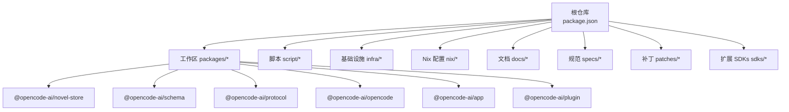
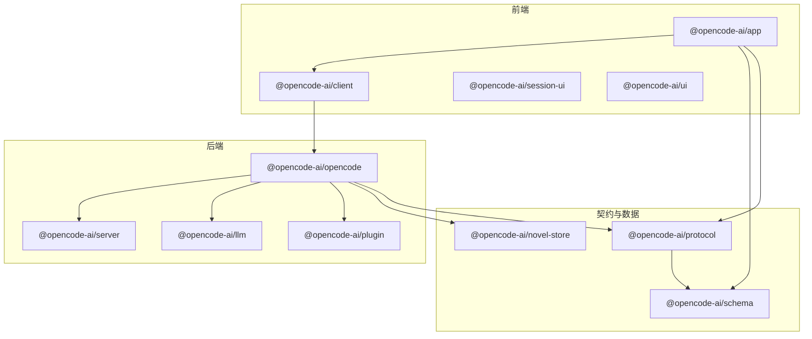
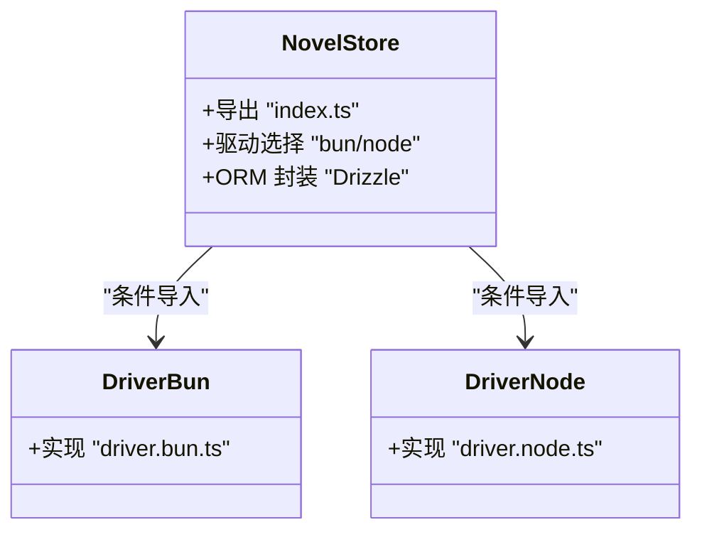
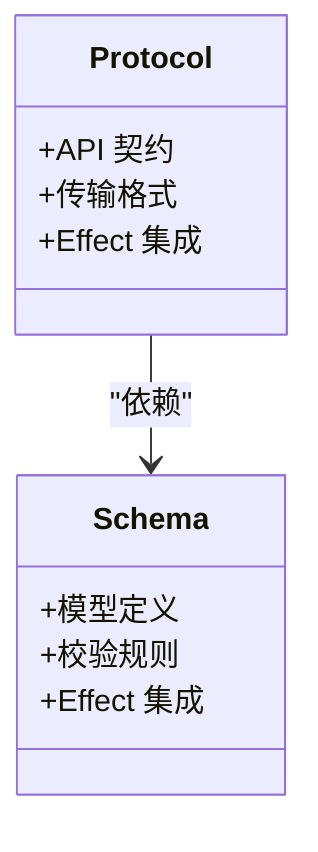
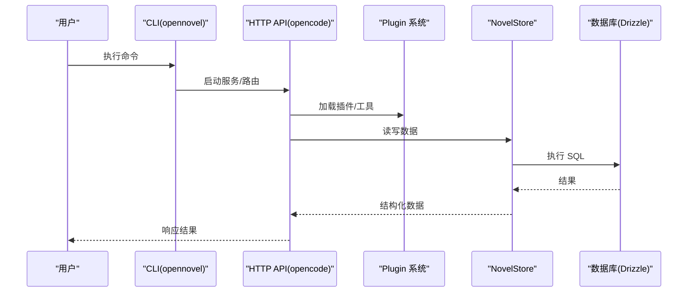
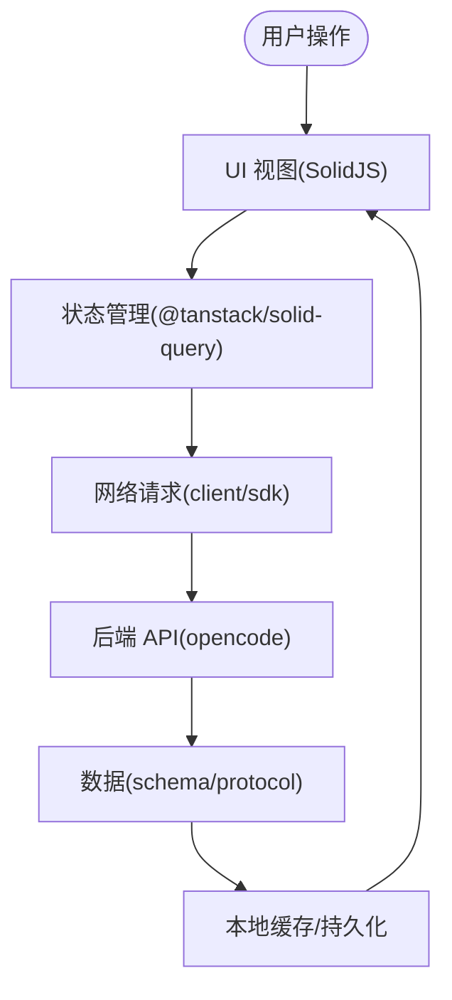
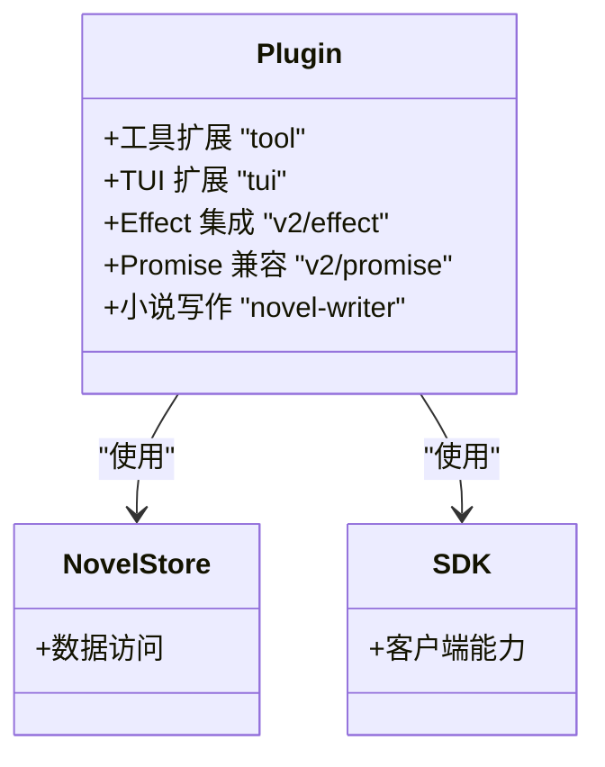
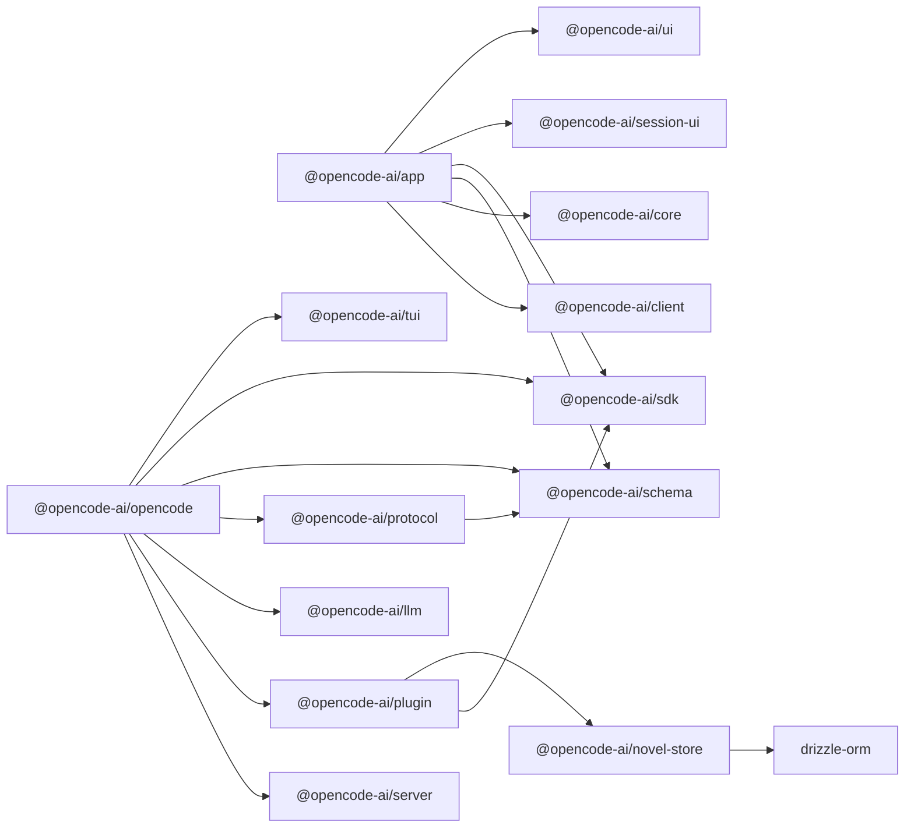

# 架构设计

<cite>
**本文引用的文件**   
- [package.json](file://package.json)
- [turbo.json](file://turbo.json)
- [bunfig.toml](file://bunfig.toml)
- [packages/novel-store/package.json](file://packages/novel-store/package.json)
- [packages/schema/package.json](file://packages/schema/package.json)
- [packages/protocol/package.json](file://packages/protocol/package.json)
- [packages/opencode/package.json](file://packages/opencode/package.json)
- [packages/app/package.json](file://packages/app/package.json)
- [packages/plugin/package.json](file://packages/plugin/package.json)
</cite>

## 目录
1. [简介](#简介)
2. [项目结构](#项目结构)
3. [核心组件](#核心组件)
4. [架构总览](#架构总览)
5. [详细组件分析](#详细组件分析)
6. [依赖关系分析](#依赖关系分析)
7. [性能考量](#性能考量)
8. [故障排查指南](#故障排查指南)
9. [结论](#结论)
10. [附录](#附录)

## 简介
本文件为 openNovel 的架构设计文档，面向 Monorepo 工程与多端（Web、桌面、CLI）一体化交付。文档聚焦以下方面：
- Monorepo 架构模式：包组织、依赖治理、构建编排
- 核心职责划分：novel-store（数据层）、schema/protocol（API 契约）、opencode（后端服务）、app（前端界面）、plugin（插件系统）
- 数据流设计：从用户操作到数据存储的完整路径
- 函数式编程模式（Effect Framework）的应用、错误处理策略与异步管理
- 架构图表、组件交互图与部署拓扑
- 技术选型原因与权衡

## 项目结构
openNovel 采用基于 Bun + Turbo 的 Monorepo 组织方式，根 package.json 定义工作区与 catalog 统一依赖版本；Turbo 负责任务编排与缓存；Bun 提供运行时与安装策略。

- 工作区与工作集
  - 根 package.json 声明 workspaces 与 catalog，集中管理 effect、hono、drizzle、solid、vite、sst 等关键依赖版本，确保跨包一致性
  - scripts 暴露 dev/dev:web/dev:desktop/dev:all 等多入口开发命令
- 构建与测试编排
  - turbo.json 定义 typecheck、build 及多个包的 test 任务，并设置依赖顺序与输出产物目录
- 包内条件导入
  - novel-store 与 opencode 使用 imports 字段实现 bun/node 环境差异化驱动（如数据库驱动），提升可移植性

**图表来源**
- [package.json:26-33](file://package.json#L26-L33)
- [turbo.json:1-34](file://turbo.json#L1-L34)

**章节来源**
- [package.json:1-162](file://package.json#L1-L162)
- [turbo.json:1-34](file://turbo.json#L1-L34)
- [bunfig.toml:1-9](file://bunfig.toml#L1-L9)

## 核心组件
- novel-store（数据层）
  - 职责：封装 Drizzle ORM 访问，抽象存储驱动（Bun/Node），对外暴露稳定的数据读写接口
  - 特点：通过 exports/imports 暴露模块与环境特定实现，便于在不同运行时复用
- schema/protocol（API 契约）
  - schema：以 Effect 为核心，定义领域模型与校验规则，作为跨层共享的类型与约束
  - protocol：在 schema 基础上定义 API 协议与传输契约，供前后端一致使用
- opencode（后端服务）
  - 职责：HTTP API、WebSocket、插件加载、LLM 集成、存储适配、CLI 入口
  - 特点：广泛使用 Effect 进行副作用编排，支持多 LLM Provider，具备丰富的生态集成
- app（前端界面）
  - 职责：SolidJS 驱动的 Web/桌面 UI，状态管理与网络请求，编辑器与会话体验
  - 特点：与 @opencode-ai/client、@opencode-ai/ui、@opencode-ai/session-ui 协作，使用 Effect 处理异步
- plugin（插件系统）
  - 职责：定义插件能力边界（tool/tui/effect/promise），提供小说写作与 TUI 增强能力
  - 特点：与 novel-store 和 SDK 集成，支持可选的 TUI 依赖

**章节来源**
- [packages/novel-store/package.json:1-34](file://packages/novel-store/package.json#L1-L34)
- [packages/schema/package.json:1-23](file://packages/schema/package.json#L1-L23)
- [packages/protocol/package.json:1-23](file://packages/protocol/package.json#L1-L23)
- [packages/opencode/package.json:1-159](file://packages/opencode/package.json#L1-L159)
- [packages/app/package.json:1-97](file://packages/app/package.json#L1-L97)
- [packages/plugin/package.json:1-61](file://packages/plugin/package.json#L1-L61)

## 架构总览
整体采用分层与解耦设计：前端 app 通过 client/sdk 调用 opencode 提供的 HTTP/WS API；opencode 整合 schema/protocol 保证契约一致性；novel-store 作为数据层屏蔽底层存储差异；plugin 扩展业务功能。Effect 贯穿各层，统一副作用与错误处理。

**图表来源**
- [packages/app/package.json:49-95](file://packages/app/package.json#L49-L95)
- [packages/opencode/package.json:87-153](file://packages/opencode/package.json#L87-L153)
- [packages/plugin/package.json:27-34](file://packages/plugin/package.json#L27-L34)
- [packages/novel-store/package.json:24-26](file://packages/novel-store/package.json#L24-L26)
- [packages/protocol/package.json:13-16](file://packages/protocol/package.json#L13-L16)
- [packages/schema/package.json:14-16](file://packages/schema/package.json#L14-L16)

## 详细组件分析

### novel-store（数据层）
- 职责与边界
  - 提供统一的 ORM 访问接口，屏蔽 Bun/Node 差异
  - 通过 imports 条件映射不同驱动实现，保持 API 稳定
- 数据结构与复杂度
  - 基于 Drizzle ORM，典型 CRUD 操作时间复杂度 O(1)~O(logN)，取决于索引与查询复杂度
- 依赖链
  - 依赖 drizzle-orm，被 plugin 与 opencode 引用
- 优化点
  - 批量写入、事务合并、连接池配置、查询计划优化
- 错误处理
  - 将数据库异常转换为 Effect 类型化错误，便于上层统一处理

**图表来源**
- [packages/novel-store/package.json:11-20](file://packages/novel-store/package.json#L11-L20)
- [packages/novel-store/package.json:24-26](file://packages/novel-store/package.json#L24-L26)

**章节来源**
- [packages/novel-store/package.json:1-34](file://packages/novel-store/package.json#L1-L34)

### schema/protocol（API 契约）
- schema
  - 使用 Effect 定义领域模型与校验，确保类型安全与运行时验证
- protocol
  - 在 schema 之上定义 API 协议，供前后端共享，减少契约漂移
- 依赖关系
  - protocol 依赖 schema，两者均依赖 effect

**图表来源**
- [packages/schema/package.json:14-16](file://packages/schema/package.json#L14-L16)
- [packages/protocol/package.json:13-16](file://packages/protocol/package.json#L13-L16)

**章节来源**
- [packages/schema/package.json:1-23](file://packages/schema/package.json#L1-L23)
- [packages/protocol/package.json:1-23](file://packages/protocol/package.json#L1-L23)

### opencode（后端服务）
- 职责与边界
  - 提供 CLI、HTTP API、WebSocket、插件加载、LLM 集成、存储适配
  - 使用 Effect 编排异步流程，统一错误与追踪（OpenTelemetry）
- 依赖关系
  - 依赖 protocol、schema、server、plugin、llm、sdk、tui 等内部包
  - 引入多种 LLM Provider（OpenAI、Anthropic、Google 等）
- 构建与运行
  - bin 暴露 opennovel 命令，dev 脚本支持浏览器条件运行

**图表来源**
- [packages/opencode/package.json:18-16](file://packages/opencode/package.json#L18-L16)
- [packages/opencode/package.json:87-153](file://packages/opencode/package.json#L87-L153)
- [packages/novel-store/package.json:24-26](file://packages/novel-store/package.json#L24-L26)

**章节来源**
- [packages/opencode/package.json:1-159](file://packages/opencode/package.json#L1-L159)

### app（前端界面）
- 职责与边界
  - SolidJS 应用，提供编辑器、会话、UI 组件与状态管理
  - 通过 client/sdk 与 opencode 通信，使用 Effect 处理异步与错误
- 依赖关系
  - 依赖 @opencode-ai/client、@opencode-ai/core、@opencode-ai/schema、@opencode-ai/sdk、@opencode-ai/session-ui、@opencode-ai/ui
  - 使用 Tailwind、Shiki、Marked 等渲染与样式库
- 构建与测试
  - Vite 构建，Playwright E2E，Happy DOM 单元测试

**图表来源**
- [packages/app/package.json:49-95](file://packages/app/package.json#L49-L95)

**章节来源**
- [packages/app/package.json:1-97](file://packages/app/package.json#L1-L97)

### plugin（插件系统）
- 职责与边界
  - 定义插件能力（tool/tui/effect/promise），提供小说写作与 TUI 增强
  - 与 novel-store、SDK 集成，支持可选 TUI 依赖
- 依赖关系
  - 依赖 @opencode-ai/sdk、@opencode-ai/novel-store、effect、zod
  - peerDependencies 声明可选的 @opentui/* 依赖

**图表来源**
- [packages/plugin/package.json:11-23](file://packages/plugin/package.json#L11-L23)
- [packages/plugin/package.json:27-34](file://packages/plugin/package.json#L27-L34)
- [packages/plugin/package.json:35-50](file://packages/plugin/package.json#L35-L50)

**章节来源**
- [packages/plugin/package.json:1-61](file://packages/plugin/package.json#L1-L61)

## 依赖关系分析
- 包间依赖
  - app 依赖 client、core、schema、sdk、session-ui、ui
  - opencode 依赖 server、plugin、llm、protocol、schema、sdk、tui
  - plugin 依赖 sdk、novel-store
  - protocol 依赖 schema
  - novel-store 依赖 drizzle-orm
- 构建与测试
  - turbo 编排 typecheck/build/test，确保依赖构建顺序与缓存命中
- 运行时差异
  - novel-store 与 opencode 使用 imports 条件导入，区分 bun/node 实现

**图表来源**
- [packages/app/package.json:49-95](file://packages/app/package.json#L49-L95)
- [packages/opencode/package.json:87-153](file://packages/opencode/package.json#L87-L153)
- [packages/plugin/package.json:27-34](file://packages/plugin/package.json#L27-L34)
- [packages/protocol/package.json:13-16](file://packages/protocol/package.json#L13-L16)
- [packages/novel-store/package.json:24-26](file://packages/novel-store/package.json#L24-L26)

**章节来源**
- [package.json:26-33](file://package.json#L26-L33)
- [turbo.json:1-34](file://turbo.json#L1-L34)

## 性能考量
- 构建与缓存
  - Turbo 的任务依赖与输出目录配置提升增量构建效率
- 依赖治理
  - catalog 统一管理依赖版本，避免重复与冲突
- 运行时优化
  - Bun 的安装策略（exact、minimumReleaseAge）提升稳定性与安装速度
  - 条件导入减少不必要的环境绑定
- 数据层优化
  - Drizzle ORM 的索引与查询优化、事务合并、连接池调优
- 前端优化
  - SolidJS 细粒度更新、虚拟列表、按需加载、资源压缩

[本节为通用指导，不直接分析具体文件]

## 故障排查指南
- 构建问题
  - 检查 turbo 任务依赖与输出目录配置
  - 确认 catalog 版本一致性与 overrides/patchedDependencies
- 运行时差异
  - 确认 imports 条件导入是否正确映射 bun/node
  - 检查环境变量与全局变量（CI、OPENCODE_DISABLE_SHARE）
- 数据库与存储
  - 检查 Drizzle 迁移与连接配置
  - 确认驱动实现（bun/node）可用
- 插件加载
  - 检查 peerDependencies 是否满足（@opentui/*）
  - 确认插件入口与导出路径正确

**章节来源**
- [turbo.json:1-34](file://turbo.json#L1-L34)
- [package.json:139-160](file://package.json#L139-L160)
- [bunfig.toml:1-9](file://bunfig.toml#L1-L9)

## 结论
openNovel 通过 Monorepo 与分层架构实现了清晰职责划分与高内聚低耦合。Effect 框架贯穿全栈，统一了副作用与错误处理；schema/protocol 保障契约一致性；novel-store 屏蔽存储差异；opencode 聚合后端能力；app 提供现代化前端体验；plugin 扩展业务场景。该设计兼顾可维护性、可扩展性与跨平台兼容性，适合持续演进与团队协作。

[本节为总结性内容，不直接分析具体文件]

## 附录
- 部署拓扑（概念）
  - 前端静态资源托管（CDN）
  - 后端服务容器化部署（Bun/Node）
  - 数据库独立部署（SQLite/其他）
  - 插件动态加载与沙箱隔离
- 技术选型权衡
  - Bun：快速安装与运行，但需关注生态兼容性
  - SolidJS：高性能响应式，学习曲线适中
  - Effect：强大的副作用与错误建模，生态成熟度持续提升
  - Drizzle：类型安全与轻量 ORM，适合复杂查询与迁移管理

[本节为概念性内容，不直接分析具体文件]