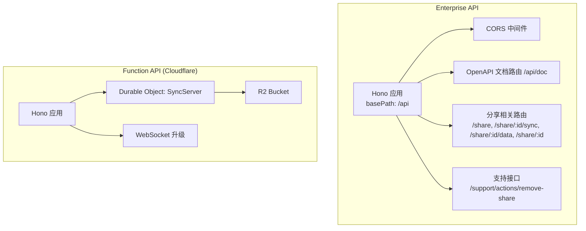
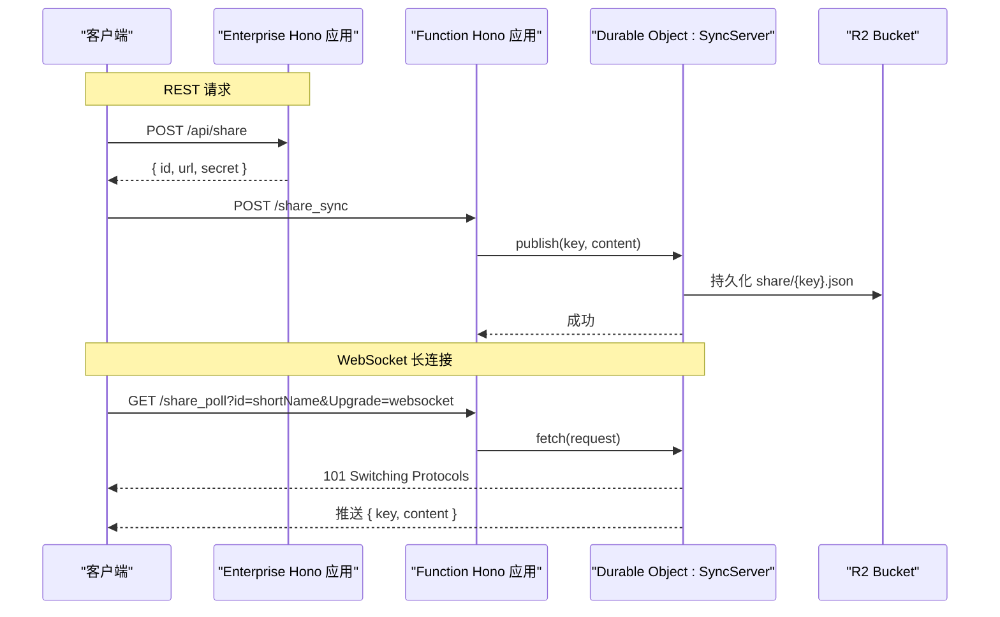
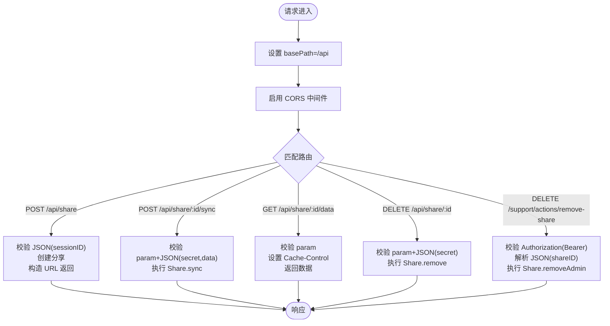
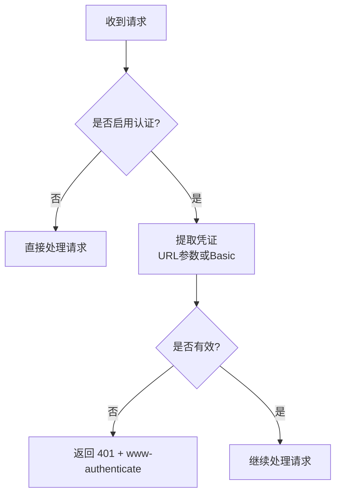
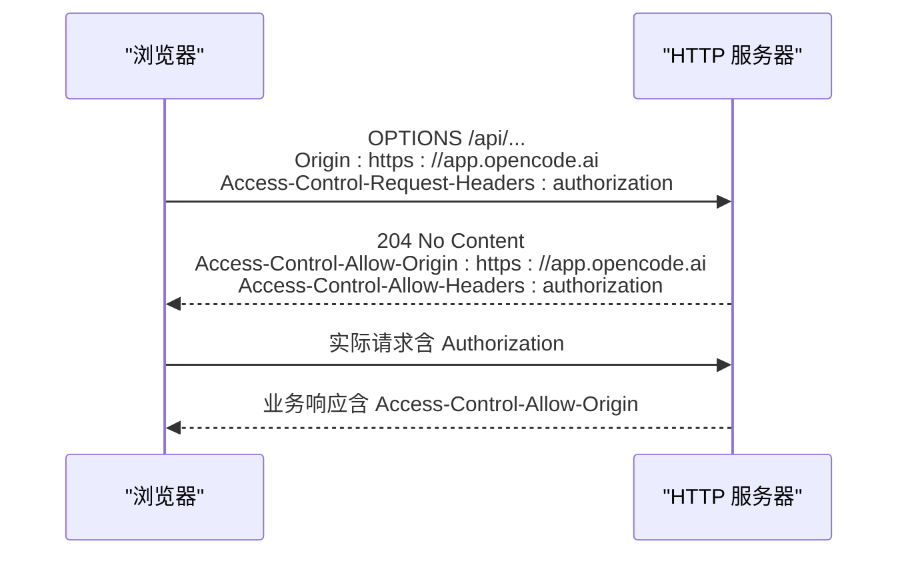
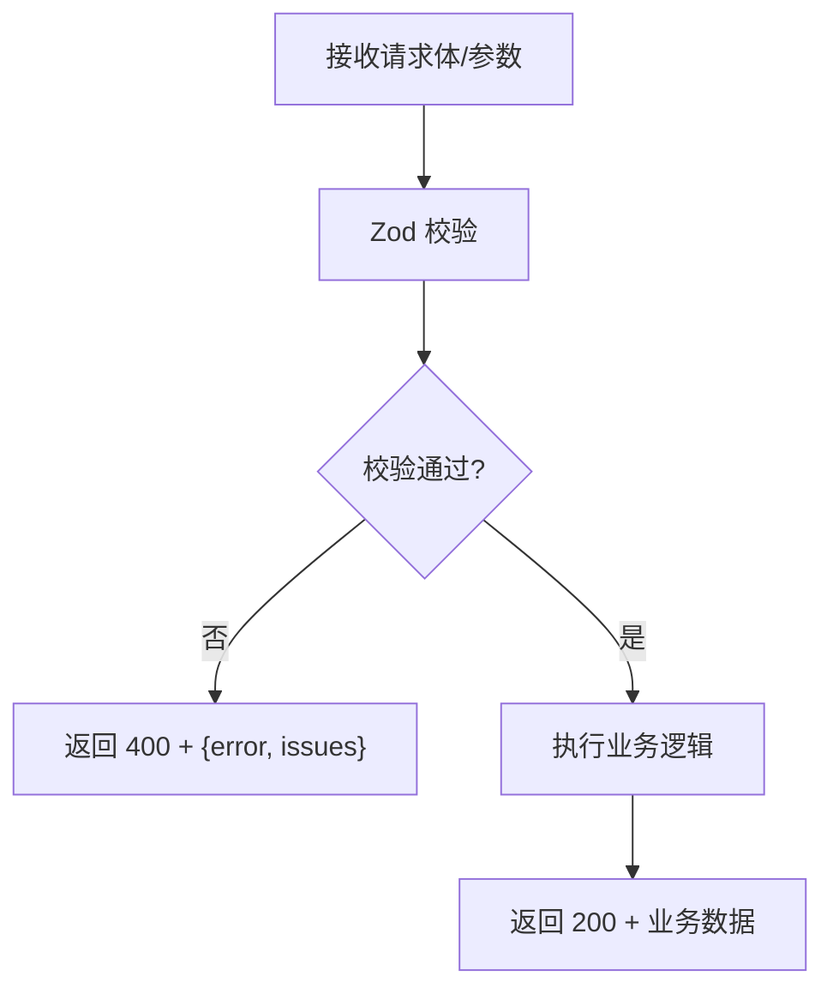
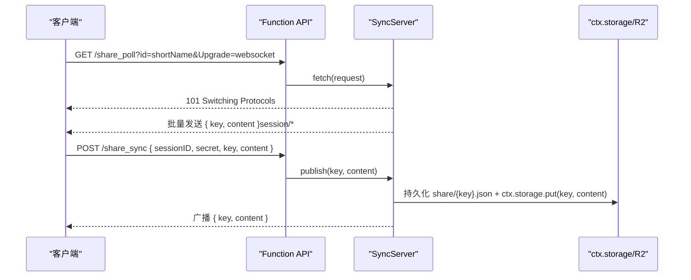
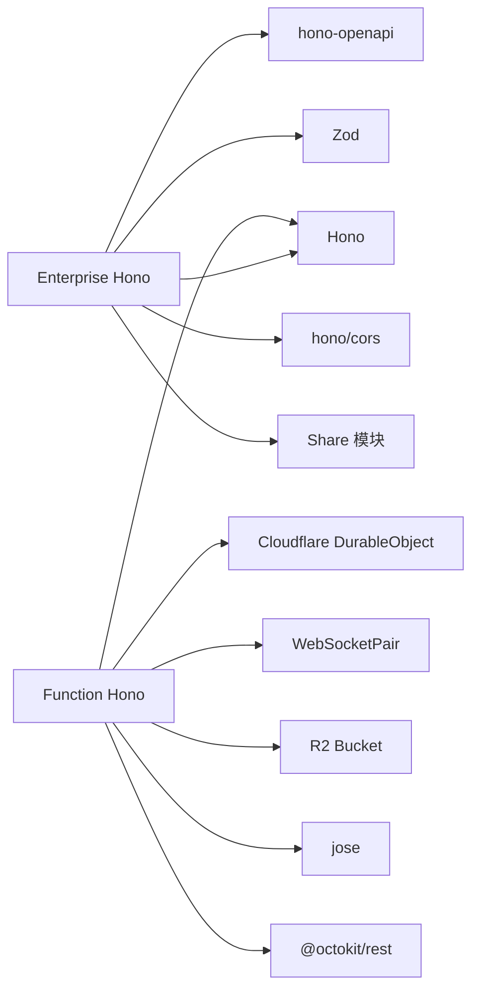

# HTTP API 服务器

<cite>
**本文引用的文件**   
- [packages/enterprise/src/routes/api/[...path].ts](file://packages/enterprise/src/routes/api/%5B...path%5D.ts)
- [packages/function/src/api.ts](file://packages/function/src/api.ts)
- [packages/opencode/test/server/httpapi-cors.test.ts](file://packages/opencode/test/server/httpapi-cors.test.ts)
- [packages/opencode/src/server/routes/instance/httpapi/middleware/authorization.ts](file://packages/opencode/src/server/routes/instance/httpapi/middleware/authorization.ts)
</cite>

## 目录
1. [简介](#简介)
2. [项目结构](#项目结构)
3. [核心组件](#核心组件)
4. [架构总览](#架构总览)
5. [详细组件分析](#详细组件分析)
6. [依赖关系分析](#依赖关系分析)
7. [性能考虑](#性能考虑)
8. [故障排查指南](#故障排查指南)
9. [结论](#结论)
10. [附录](#附录)

## 简介
本文件为 OpenCode HTTP API 服务器的权威技术文档，聚焦基于 Hono 的 HTTP API 服务与 Cloudflare Durable Object 的实时同步能力。内容涵盖：
- 路由组织、中间件管道与请求处理流程
- RESTful API 端点设计、请求响应格式与状态码规范
- 认证中间件、权限验证、请求校验与错误处理机制
- CORS 配置、速率限制、请求日志与性能监控（实践建议）
- WebSocket 实时通信的实现要点（连接管理、消息广播、事件订阅）
- API 调用示例、错误处理最佳实践与调试技巧

## 项目结构
OpenCode 的 HTTP API 由两个主要部分构成：
- Enterprise 端点：基于 Hono 的 REST API，提供分享数据创建、同步、读取与删除等能力，并内置 OpenAPI 文档生成与 Zod 请求校验。
- Function 端点：基于 Hono + Cloudflare Durable Object，提供会话共享、WebSocket 长连接、数据轮询与第三方集成（如飞书、GitHub App）。



图表来源 
- [packages/enterprise/src/routes/api/[...path].ts](file://packages/enterprise/src/routes/api/%5B...path%5D.ts#L1-L172)
- [packages/function/src/api.ts:1-389](file://packages/function/src/api.ts#L1-L389)

章节来源
- [packages/enterprise/src/routes/api/[...path].ts](file://packages/enterprise/src/routes/api/%5B...path%5D.ts#L1-L172)
- [packages/function/src/api.ts:1-389](file://packages/function/src/api.ts#L1-L389)

## 核心组件
- Hono 应用实例：用于定义路由、挂载中间件与统一响应。
- 中间件：CORS、OpenAPI 描述与校验、参数校验（Zod）、安全鉴权（Enterprise 侧通过 Bearer Token 或 Basic Auth）。
- 业务逻辑：分享数据的创建、同步、读取与删除；会话共享与持久化；第三方回调处理。
- 实时通信：Cloudflare Durable Object 维护 WebSocket 连接，实现消息广播与数据一致性。

章节来源
- [packages/enterprise/src/routes/api/[...path].ts](file://packages/enterprise/src/routes/api/%5B...path%5D.ts#L1-L172)
- [packages/function/src/api.ts:1-389](file://packages/function/src/api.ts#L1-L389)

## 架构总览
下图展示了从客户端到服务端的核心交互路径，包括 REST 与 WebSocket 两种模式。



图表来源 
- [packages/enterprise/src/routes/api/[...path].ts](file://packages/enterprise/src/routes/api/%5B...path%5D.ts#L1-L172)
- [packages/function/src/api.ts:1-389](file://packages/function/src/api.ts#L1-L389)

## 详细组件分析

### Enterprise REST API（/api/*）
- 基础路径：/api
- 中间件：CORS（允许跨域），OpenAPI 文档（/api/doc）
- 路由与职责：
  - POST /api/share：创建分享，返回 id、secret、url
  - POST /api/share/:shareID/sync：按 secret 同步分享数据
  - GET /api/share/:shareID/data：获取分享数据（带缓存头）
  - DELETE /api/share/:shareID：按 secret 删除分享
  - DELETE /support/actions/remove-share：管理员删除分享（Bearer Token 校验）



图表来源 
- [packages/enterprise/src/routes/api/[...path].ts](file://packages/enterprise/src/routes/api/%5B...path%5D.ts#L1-L172)

章节来源
- [packages/enterprise/src/routes/api/[...path].ts](file://packages/enterprise/src/routes/api/%5B...path%5D.ts#L1-L172)

### Function API（Cloudflare Durable Object）
- 基础能力：
  - 会话分享：/share_create、/share_delete、/share_delete_admin
  - 数据同步：/share_sync（需 secret 校验）
  - 数据轮询：/share_data（聚合 session/info 与 session/message/part）
  - WebSocket：/share_poll（Upgrade: websocket）
- Durable Object：SyncServer
  - 存储：ctx.storage（内存键值）+ R2 Bucket（持久化 share/{key}.json）
  - 广播：向所有已连接的 WebSocket 客户端推送消息
  - 生命周期：clear() 清理历史消息与 info

```mermaid
classDiagram
class SyncServer {
+fetch(request) Response
+webSocketMessage(ws, message) void
+webSocketClose(ws, code, reason, wasClean) void
+publish(key, content) Response
+share(sessionID) string
+getData() {key,content}[]
+assertSecret(secret) void
-getSecret() string
-getSessionID() string
+clear() void
+static shortName(id) string
}
class FunctionAPI {
+GET "/"
+POST "/share_create"
+POST "/share_delete"
+POST "/share_delete_admin"
+POST "/share_sync"
+GET "/share_poll"
+GET "/share_data"
+POST "/feishu"
+POST "/exchange_github_app_token"
+POST "/exchange_github_app_token_with_pat"
+GET "/get_github_app_installation"
}
FunctionAPI --> SyncServer : "通过 idFromName/get 调用"
```

图表来源 
- [packages/function/src/api.ts:1-389](file://packages/function/src/api.ts#L1-L389)

章节来源
- [packages/function/src/api.ts:1-389](file://packages/function/src/api.ts#L1-L389)

### 认证与授权中间件
- 支持方式：
  - URL 查询参数中的令牌（AUTH_TOKEN_QUERY）
  - HTTP Basic Authorization
- 行为：
  - 若未开启强制认证，直接放行
  - 若需要认证且凭证无效，返回 401 并附带 www-authenticate 头
  - 公开 UI 路径可跳过认证



图表来源 
- [packages/opencode/src/server/routes/instance/httpapi/middleware/authorization.ts:77-116](file://packages/opencode/src/server/routes/instance/httpapi/middleware/authorization.ts#L77-L116)

章节来源
- [packages/opencode/src/server/routes/instance/httpapi/middleware/authorization.ts:77-116](file://packages/opencode/src/server/routes/instance/httpapi/middleware/authorization.ts#L77-L116)

### CORS 配置与预检
- 行为验证：
  - 浏览器预检请求（OPTIONS）应返回 204，并包含允许的 origin 与 headers
  - 未认证响应也应携带正确的 CORS 头
  - 支持自定义允许的源列表



图表来源 
- [packages/opencode/test/server/httpapi-cors.test.ts:34-101](file://packages/opencode/test/server/httpapi-cors.test.ts#L34-L101)

章节来源
- [packages/opencode/test/server/httpapi-cors.test.ts:34-101](file://packages/opencode/test/server/httpapi-cors.test.ts#L34-L101)

### 请求校验与错误处理
- 使用 Zod 对 JSON 与路径参数进行强类型校验
- 错误响应统一返回 JSON 结构，包含 error 与可选 issues
- 管理员接口使用 timingSafeEqual 防止时序攻击



图表来源 
- [packages/enterprise/src/routes/api/[...path].ts](file://packages/enterprise/src/routes/api/%5B...path%5D.ts#L1-L172)

章节来源
- [packages/enterprise/src/routes/api/[...path].ts](file://packages/enterprise/src/routes/api/%5B...path%5D.ts#L1-L172)

### WebSocket 实时通信
- 连接建立：客户端通过 Upgrade: websocket 发起 /share_poll?id=shortName
- 初始数据：服务端先发送本地存储中 session/* 的数据快照
- 消息推送：publish(key, content) 将数据写入 R2 与内存，并向所有订阅者广播
- 关闭处理：Durable Object 关闭时主动关闭 WebSocket



图表来源 
- [packages/function/src/api.ts:1-389](file://packages/function/src/api.ts#L1-L389)

章节来源
- [packages/function/src/api.ts:1-389](file://packages/function/src/api.ts#L1-L389)

## 依赖关系分析
- Enterprise 依赖：
  - Hono：路由与中间件框架
  - hono-openapi：OpenAPI 描述与路由处理器
  - Zod：请求体与参数校验
  - hono/cors：跨域支持
  - Share：分享业务逻辑（外部模块）
- Function 依赖：
  - Hono：路由与中间件框架
  - Cloudflare Workers：DurableObject、WebSocketPair、R2Bucket
  - jose：JWT 验证（GitHub OIDC）
  - @octokit/rest：GitHub API 客户端



图表来源 
- [packages/enterprise/src/routes/api/[...path].ts](file://packages/enterprise/src/routes/api/%5B...path%5D.ts#L1-L172)
- [packages/function/src/api.ts:1-389](file://packages/function/src/api.ts#L1-L389)

章节来源
- [packages/enterprise/src/routes/api/[...path].ts](file://packages/enterprise/src/routes/api/%5B...path%5D.ts#L1-L172)
- [packages/function/src/api.ts:1-389](file://packages/function/src/api.ts#L1-L389)

## 性能考虑
- 缓存策略：GET /api/share/:id/data 设置 Cache-Control，提升 CDN/浏览器缓存命中率
- 持久化与内存：Durable Object 同时使用 ctx.storage 与 R2，减少重复 IO 压力
- 连接复用：WebSocket 长连接避免频繁短连接开销
- 限流建议：在网关层或边缘节点增加速率限制（例如 per IP/Token）
- 日志与监控：建议在入口与关键路径添加结构化日志与指标上报（延迟、错误率、QPS）

[本节为通用指导，不直接分析具体文件]

## 故障排查指南
- 认证失败（401）：
  - 检查 Authorization 头或 URL 参数中的令牌是否正确
  - 确认是否启用了强制认证，以及是否为公开 UI 路径
- 跨域问题：
  - 确认 Origin 是否在允许的列表中
  - 预检请求必须返回 204 并包含必要的 Access-Control-* 头
- 校验错误（400）：
  - 检查请求体结构与字段类型是否符合 Zod 定义
  - 查看错误响应中的 issues 定位具体字段
- WebSocket 连接异常：
  - 确认 Upgrade: websocket 头部存在
  - 检查 id 参数是否与 Durable Object 名称一致
  - 观察服务端日志中的连接数与消息推送情况

章节来源
- [packages/opencode/src/server/routes/instance/httpapi/middleware/authorization.ts:77-116](file://packages/opencode/src/server/routes/instance/httpapi/middleware/authorization.ts#L77-L116)
- [packages/opencode/test/server/httpapi-cors.test.ts:34-101](file://packages/opencode/test/server/httpapi-cors.test.ts#L34-L101)
- [packages/enterprise/src/routes/api/[...path].ts](file://packages/enterprise/src/routes/api/%5B...path%5D.ts#L1-L172)
- [packages/function/src/api.ts:1-389](file://packages/function/src/api.ts#L1-L389)

## 结论
OpenCode 的 HTTP API 以 Hono 为核心，结合 hono-openapi 与 Zod 实现了类型安全的接口描述与校验；Enterprise 侧提供稳定的 REST 能力，Function 侧借助 Cloudflare Durable Object 实现高性能的实时同步与广播。通过合理的认证、CORS、缓存与错误处理策略，系统具备良好的可扩展性与可观测性。建议在生产环境补充速率限制、结构化日志与指标监控，进一步提升稳定性与可运维性。

[本节为总结性内容，不直接分析具体文件]

## 附录

### REST 端点清单与规范
- 基础路径：/api
- 通用响应：application/json
- 通用状态码：
  - 200：成功
  - 400：请求校验失败
  - 401：未认证或凭证无效
  - 404：资源不存在
  - 500：服务器内部错误

端点说明：
- POST /api/share
  - 请求体：{ sessionID: string }
  - 响应：{ id: string, url: string, secret: string }
- POST /api/share/:shareID/sync
  - 路径参数：shareID: string
  - 请求体：{ secret: string, data: Share.Data[] }
  - 响应：{}
- GET /api/share/:shareID/data
  - 路径参数：shareID: string
  - 响应：Share.Data[]
  - 缓存头：public, max-age=30, s-maxage=300, stale-while-revalidate=86400
- DELETE /api/share/:shareID
  - 路径参数：shareID: string
  - 请求体：{ secret: string }
  - 响应：{}
- DELETE /support/actions/remove-share
  - 认证：Authorization: Bearer <SUPPORT_API_KEY>
  - 请求体：{ shareID: string }
  - 响应：{ success: boolean, message: string } 或 { error: string }

章节来源
- [packages/enterprise/src/routes/api/[...path].ts](file://packages/enterprise/src/routes/api/%5B...path%5D.ts#L1-L172)

### WebSocket 端点与事件
- GET /share_poll?id=<shortName>&Upgrade=websocket
  - 建立连接后，服务端推送 session/* 的初始数据
  - 后续通过 /share_sync 触发消息广播
- POST /share_sync
  - 请求体：{ sessionID: string, secret: string, key: string, content: any }
  - 成功后，所有订阅者收到 { key, content }

章节来源
- [packages/function/src/api.ts:1-389](file://packages/function/src/api.ts#L1-L389)

### 认证与权限最佳实践
- 优先使用 Bearer Token 并通过安全比较函数验证
- 对敏感操作（如管理员删除）实施额外校验
- 公开接口与受保护接口分离，减少不必要的鉴权开销

章节来源
- [packages/enterprise/src/routes/api/[...path].ts](file://packages/enterprise/src/routes/api/%5B...path%5D.ts#L1-L172)
- [packages/opencode/src/server/routes/instance/httpapi/middleware/authorization.ts:77-116](file://packages/opencode/src/server/routes/instance/httpapi/middleware/authorization.ts#L77-L116)

### 调试技巧
- 使用 OpenAPI 文档（/api/doc）快速生成与测试接口
- 启用结构化日志，记录请求 ID、耗时与关键上下文
- 针对 WebSocket，打印连接数与消息分发数量，便于定位广播问题

章节来源
- [packages/enterprise/src/routes/api/[...path].ts](file://packages/enterprise/src/routes/api/%5B...path%5D.ts#L1-L172)
- [packages/function/src/api.ts:1-389](file://packages/function/src/api.ts#L1-L389)