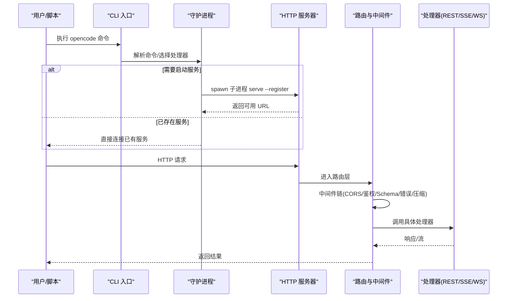
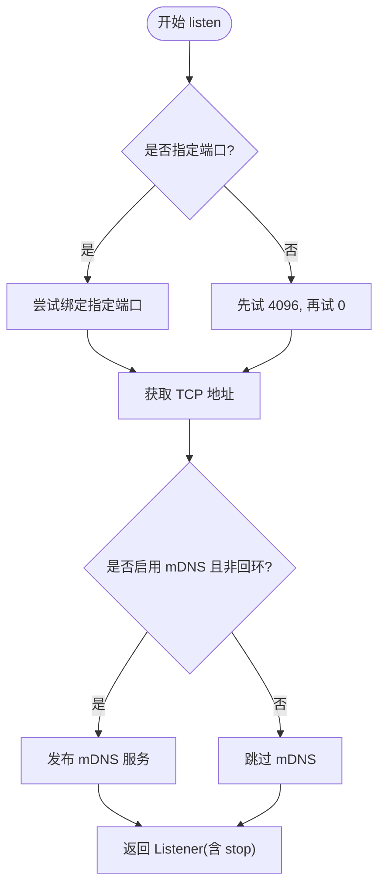
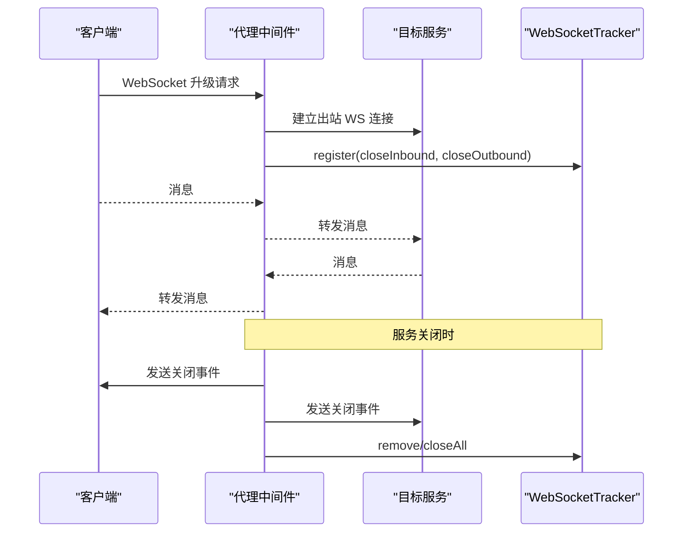
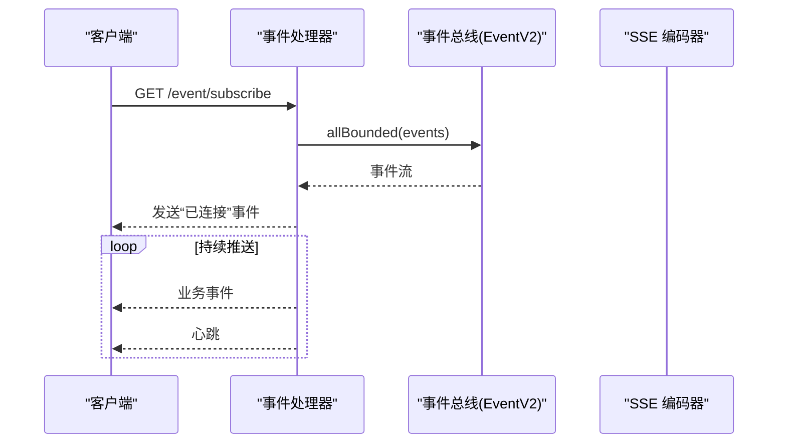
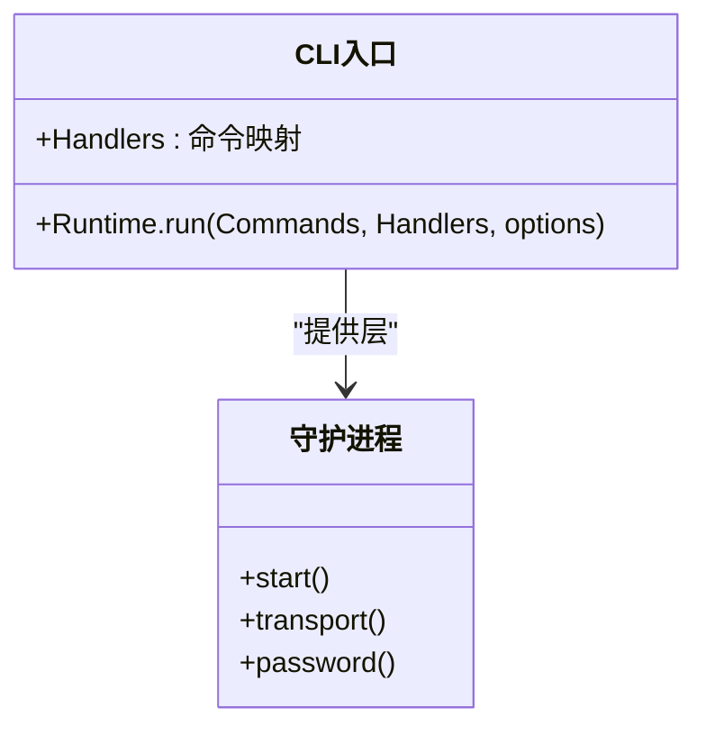
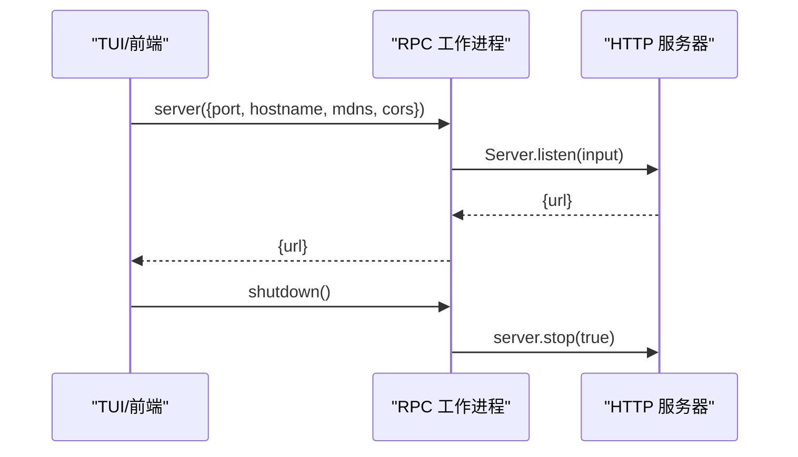
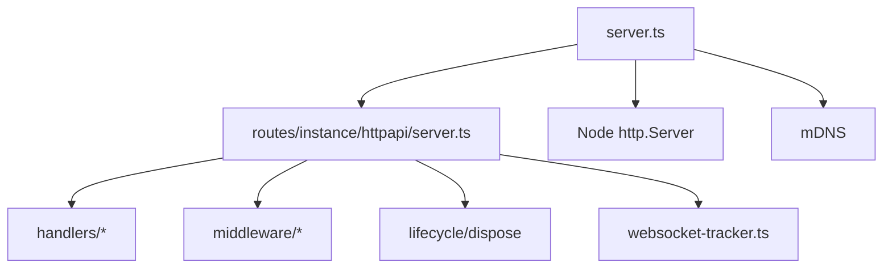

# OpenCode 主服务器

<cite>
**本文引用的文件**   
- [packages/opencode/src/server/server.ts](file://packages/opencode/src/server/server.ts)
- [packages/opencode/src/server/routes/instance/httpapi/server.ts](file://packages/opencode/src/server/routes/instance/httpapi/server.ts)
- [packages/opencode/src/server/routes/instance/httpapi/middleware/proxy.ts](file://packages/opencode/src/server/routes/instance/httpapi/middleware/proxy.ts)
- [packages/opencode/src/server/routes/instance/httpapi/websocket-tracker.ts](file://packages/opencode/src/server/routes/instance/httpapi/websocket-tracker.ts)
- [packages/opencode/src/server/routes/instance/httpapi/handlers/event.ts](file://packages/opencode/src/server/routes/instance/httpapi/handlers/event.ts)
- [packages/cli/src/index.ts](file://packages/cli/src/index.ts)
- [packages/cli/src/services/daemon.ts](file://packages/cli/src/services/daemon.ts)
- [packages/opencode/src/cli/tui/worker.ts](file://packages/opencode/src/cli/tui/worker.ts)
</cite>

## 目录
1. [简介](#简介)
2. [项目结构](#项目结构)
3. [核心组件](#核心组件)
4. [架构总览](#架构总览)
5. [详细组件分析](#详细组件分析)
6. [依赖分析](#依赖分析)
7. [性能考量](#性能考量)
8. [故障排除指南](#故障排除指南)
9. [结论](#结论)
10. [附录](#附录)

## 简介
本文件为 OpenCode 主服务器组件的权威文档，聚焦以下方面：
- 服务器启动流程与监听端口策略
- CLI 入口、命令注册与子命令组织
- HTTP API 路由系统、中间件管道与错误处理
- WebSocket 实时通信（代理、连接管理、事件订阅）
- 服务配置、环境变量与插件加载机制
- 生命周期管理、资源清理与优雅关闭
- 常见使用场景的配置示例与排错建议

## 项目结构
OpenCode 的主服务器由“CLI 进程”和“HTTP 服务进程”两部分组成：
- CLI 入口负责解析命令行参数、注册命令处理器，并在需要时以守护进程方式启动或连接后端服务。
- HTTP 服务基于 Effect Platform 构建，提供 REST/SSE/WebSocket 能力，并通过分层 Layer 组装路由、认证、鉴权、CORS、压缩、错误处理等横切关注点。

```mermaid
graph TB
subgraph "CLI"
CLI["cli/index.ts<br/>命令入口"]
Daemon["cli/services/daemon.ts<br/>守护进程管理"]
Worker["opencode/cli/tui/worker.ts<br/>RPC 工作进程"]
end
subgraph "HTTP 服务"
ServerCore["server/server.ts<br/>监听/停止/mDNS"]
Routes["routes/instance/httpapi/server.ts<br/>路由与中间件装配"]
Proxy["middleware/proxy.ts<br/>WebSocket 代理"]
WSTracker["websocket-tracker.ts<br/>连接追踪与关闭"]
EventH["handlers/event.ts<br/>SSE 事件流"]
end
CLI --> Daemon
Daemon --> |spawn serve --register| ServerCore
Worker --> |RPC| ServerCore
ServerCore --> Routes
Routes --> Proxy
Routes --> EventH
Routes --> WSTracker
```

**图表来源** 
- [packages/cli/src/index.ts:1-33](file://packages/cli/src/index.ts#L1-L33)
- [packages/cli/src/services/daemon.ts:110-139](file://packages/cli/src/services/daemon.ts#L110-L139)
- [packages/opencode/src/cli/tui/worker.ts:30-78](file://packages/opencode/src/cli/tui/worker.ts#L30-L78)
- [packages/opencode/src/server/server.ts:73-98](file://packages/opencode/src/server/server.ts#L73-L98)
- [packages/opencode/src/server/routes/instance/httpapi/server.ts:272-315](file://packages/opencode/src/server/routes/instance/httpapi/server.ts#L272-L315)
- [packages/opencode/src/server/routes/instance/httpapi/middleware/proxy.ts:14-52](file://packages/opencode/src/server/routes/instance/httpapi/middleware/proxy.ts#L14-L52)
- [packages/opencode/src/server/routes/instance/httpapi/websocket-tracker.ts:1-48](file://packages/opencode/src/server/routes/instance/httpapi/websocket-tracker.ts#L1-L48)
- [packages/opencode/src/server/routes/instance/httpapi/handlers/event.ts:20-52](file://packages/opencode/src/server/routes/instance/httpapi/handlers/event.ts#L20-L52)

**章节来源**
- [packages/cli/src/index.ts:1-33](file://packages/cli/src/index.ts#L1-L33)
- [packages/opencode/src/server/server.ts:73-98](file://packages/opencode/src/server/server.ts#L73-L98)
- [packages/opencode/src/server/routes/instance/httpapi/server.ts:272-315](file://packages/opencode/src/server/routes/instance/httpapi/server.ts#L272-L315)

## 核心组件
- 服务器监听器（Listener）：封装端口绑定、URL 生成、mDNS 发布、优雅关闭与强制关闭。
- HTTP API 应用：通过 HttpApiBuilder 声明式构建路由树，组合认证、鉴权、实例上下文、工作区路由、Schema 校验、错误处理、压缩、CORS 等中间件。
- WebSocket 代理：将客户端 WebSocket 升级请求转发到目标地址，双向透传消息，统一在关闭时广播服务端关闭事件。
- SSE 事件流：以 text/event-stream 推送事件，并维持心跳。
- CLI 与守护进程：CLI 负责命令分发；守护进程负责后台启动/停止/重启服务，维护密码与注册信息。

**章节来源**
- [packages/opencode/src/server/server.ts:73-98](file://packages/opencode/src/server/server.ts#L73-L98)
- [packages/opencode/src/server/routes/instance/httpapi/server.ts:120-193](file://packages/opencode/src/server/routes/instance/httpapi/server.ts#L120-L193)
- [packages/opencode/src/server/routes/instance/httpapi/middleware/proxy.ts:14-52](file://packages/opencode/src/server/routes/instance/httpapi/middleware/proxy.ts#L14-L52)
- [packages/opencode/src/server/routes/instance/httpapi/handlers/event.ts:20-52](file://packages/opencode/src/server/routes/instance/httpapi/handlers/event.ts#L20-L52)
- [packages/cli/src/services/daemon.ts:110-139](file://packages/cli/src/services/daemon.ts#L110-L139)

## 架构总览
下图展示从 CLI 启动到 HTTP 服务就绪的关键路径，以及请求进入后的中间件链路与处理器分组。



**图表来源** 
- [packages/cli/src/index.ts:10-32](file://packages/cli/src/index.ts#L10-L32)
- [packages/cli/src/services/daemon.ts:110-139](file://packages/cli/src/services/daemon.ts#L110-L139)
- [packages/opencode/src/server/server.ts:73-98](file://packages/opencode/src/server/server.ts#L73-L98)
- [packages/opencode/src/server/routes/instance/httpapi/server.ts:272-315](file://packages/opencode/src/server/routes/instance/httpapi/server.ts#L272-L315)

## 详细组件分析

### 服务器启动与监听（listen）
- listenEffect 负责：
  - 端口回退策略：优先尝试固定端口（如 4096），失败则回退到随机端口（0）。
  - 获取 TCP 地址并构造 URL。
  - 可选 mDNS 发布（非回环主机名时）。
  - 返回包含 stop 方法的 Listener，stop 支持优雅关闭与强制关闭。
- serverLayer 对 Node http.Server 进行包装，确保在优雅关闭超时后仍可通过 closeAllConnections 强制断开活跃连接。



**图表来源** 
- [packages/opencode/src/server/server.ts:117-122](file://packages/opencode/src/server/server.ts#L117-L122)
- [packages/opencode/src/server/server.ts:140-153](file://packages/opencode/src/server/server.ts#L140-L153)
- [packages/opencode/src/server/server.ts:155-170](file://packages/opencode/src/server/server.ts#L155-L170)
- [packages/opencode/src/server/server.ts:199-224](file://packages/opencode/src/server/server.ts#L199-L224)

**章节来源**
- [packages/opencode/src/server/server.ts:73-98](file://packages/opencode/src/server/server.ts#L73-L98)
- [packages/opencode/src/server/server.ts:117-122](file://packages/opencode/src/server/server.ts#L117-L122)
- [packages/opencode/src/server/server.ts:155-170](file://packages/opencode/src/server/server.ts#L155-L170)
- [packages/opencode/src/server/server.ts:199-224](file://packages/opencode/src/server/server.ts#L199-L224)

### HTTP API 路由系统与中间件管道
- 路由分组：
  - rootApiRoutes：全局与控制类接口，附带 RootHttpApi 认证声明。
  - eventApiRoutes：SSE 事件订阅，带工作区路由与实例上下文。
  - ptyConnectApiRoutes：PTY WebSocket 升级，票据鉴权。
  - instanceApiRoutes：实例级业务路由（会话、项目、权限、工具等）。
  - serverRoutes：服务端通用接口。
- 中间件栈（按装配顺序）：
  - CORS 与 Vary 修复
  - 授权/鉴权（ServerAuth、实例上下文、工作区路由）
  - Schema 校验与错误转换
  - 压缩、围栏（fence）、可观测性
  - 生命周期 disposeMiddleware 用于资源释放
- 文档端点 /doc 延迟生成 OpenAPI 规范，避免冷启动开销。


**图表来源** 
- [packages/opencode/src/server/routes/instance/httpapi/server.ts:120-193](file://packages/opencode/src/server/routes/instance/httpapi/server.ts#L120-L193)
- [packages/opencode/src/server/routes/instance/httpapi/server.ts:272-315](file://packages/opencode/src/server/routes/instance/httpapi/server.ts#L272-L315)

**章节来源**
- [packages/opencode/src/server/routes/instance/httpapi/server.ts:120-193](file://packages/opencode/src/server/routes/instance/httpapi/server.ts#L120-L193)
- [packages/opencode/src/server/routes/instance/httpapi/server.ts:272-315](file://packages/opencode/src/server/routes/instance/httpapi/server.ts#L272-L315)

### WebSocket 实时通信（代理与连接管理）
- 代理实现：
  - 接收客户端 Upgrade 请求，建立出站 WebSocket 连接到目标地址。
  - 双向写入：入站与出站 writer 互相转发消息。
  - 关闭事件：在服务关闭时向两端发送统一的关闭事件，保证一致性。
- 连接追踪：
  - 使用 WebSocketTracker 维护所有活动连接的关闭回调集合。
  - closeAll 会标记 closing 状态并并发触发所有关闭回调，超时保护避免阻塞。



**图表来源** 
- [packages/opencode/src/server/routes/instance/httpapi/middleware/proxy.ts:14-52](file://packages/opencode/src/server/routes/instance/httpapi/middleware/proxy.ts#L14-L52)
- [packages/opencode/src/server/routes/instance/httpapi/websocket-tracker.ts:1-48](file://packages/opencode/src/server/routes/instance/httpapi/websocket-tracker.ts#L1-L48)

**章节来源**
- [packages/opencode/src/server/routes/instance/httpapi/middleware/proxy.ts:14-52](file://packages/opencode/src/server/routes/instance/httpapi/middleware/proxy.ts#L14-L52)
- [packages/opencode/src/server/routes/instance/httpapi/websocket-tracker.ts:1-48](file://packages/opencode/src/server/routes/instance/httpapi/websocket-tracker.ts#L1-L48)

### SSE 事件订阅
- 事件处理器以 Stream 形式输出事件，合并心跳 tick，编码为 text/event-stream。
- 连接建立即发送“已连接”事件，随后持续推送后续事件。



**图表来源** 
- [packages/opencode/src/server/routes/instance/httpapi/handlers/event.ts:20-52](file://packages/opencode/src/server/routes/instance/httpapi/handlers/event.ts#L20-L52)

**章节来源**
- [packages/opencode/src/server/routes/instance/httpapi/handlers/event.ts:20-52](file://packages/opencode/src/server/routes/instance/httpapi/handlers/event.ts#L20-L52)

### CLI 入口与命令注册
- CLI 入口定义顶层命令与子命令处理器映射，采用懒加载按需引入处理器模块。
- Runtime.run 统一运行命令，注入守护进程与 Node 服务层。



**图表来源** 
- [packages/cli/src/index.ts:10-32](file://packages/cli/src/index.ts#L10-L32)
- [packages/cli/src/services/daemon.ts:110-139](file://packages/cli/src/services/daemon.ts#L110-L139)

**章节来源**
- [packages/cli/src/index.ts:10-32](file://packages/cli/src/index.ts#L10-L32)
- [packages/cli/src/services/daemon.ts:110-139](file://packages/cli/src/services/daemon.ts#L110-L139)

### RPC 工作进程与服务控制
- worker.ts 暴露 RPC 方法：
  - fetch：通过 Server.Default().app.fetch 发起 HTTP 请求（自动携带鉴权头）。
  - server：启动/重启监听器，返回 URL。
  - reload/shutdown：重载配置、释放实例、关闭服务与事件监听。
- 该模式便于前端/TUI 进程通过 RPC 控制服务器生命周期。



**图表来源** 
- [packages/opencode/src/cli/tui/worker.ts:30-78](file://packages/opencode/src/cli/tui/worker.ts#L30-L78)
- [packages/opencode/src/server/server.ts:73-98](file://packages/opencode/src/server/server.ts#L73-L98)

**章节来源**
- [packages/opencode/src/cli/tui/worker.ts:30-78](file://packages/opencode/src/cli/tui/worker.ts#L30-L78)
- [packages/opencode/src/server/server.ts:73-98](file://packages/opencode/src/server/server.ts#L73-L98)

### 服务配置、环境变量与插件加载
- 配置与环境：
  - 每个监听器提供独立的 ConfigProvider.fromEnv()，避免多实例共享快照导致的环境变量读取问题。
  - CORS 选项通过 CorsConfig 注入，isAllowedCorsOrigin 决定允许的源。
- 插件与扩展：
  - AppNodeBuilderV1.build(app) 聚合大量 Node 服务（数据库、存储、插件、LLM、MCP、权限、会话等）。
  - Observability.layer 最后提供，确保背景任务捕获正确的日志上下文。

**章节来源**
- [packages/opencode/src/server/server.ts:108-115](file://packages/opencode/src/server/server.ts#L108-L115)
- [packages/opencode/src/server/routes/instance/httpapi/server.ts:213-270](file://packages/opencode/src/server/routes/instance/httpapi/server.ts#L213-270)
- [packages/opencode/src/server/routes/instance/httpapi/server.ts:296-314](file://packages/opencode/src/server/routes/instance/httpapi/server.ts#L296-314)

### 生命周期管理、资源清理与优雅关闭
- 优雅关闭：
  - NodeHttpServer.gracefulShutdownTimeout 控制等待时间。
  - 自定义 closeAllConnections 在超时后强制断开活跃连接。
- 资源清理：
  - disposeMiddleware 在请求/连接结束时释放资源。
  - WebSocketTracker.closeAll 并发关闭所有连接，带超时保护。
  - mDNS 发布在停止时撤销。

**章节来源**
- [packages/opencode/src/server/server.ts:199-224](file://packages/opencode/src/server/server.ts#L199-L224)
- [packages/opencode/src/server/routes/instance/httpapi/websocket-tracker.ts:17-46](file://packages/opencode/src/server/routes/instance/httpapi/websocket-tracker.ts#L17-L46)
- [packages/opencode/src/server/server.ts:155-170](file://packages/opencode/src/server/server.ts#L155-L170)

## 依赖分析
- 组件耦合：
  - server.ts 依赖 routes/instance/httpapi/server.ts 提供的路由与中间件装配。
  - 路由层依赖多个 handlers 分组与中间件层（鉴权、Schema、错误、压缩、CORS）。
  - WebSocket 代理依赖 Socket 抽象与 WebSocketTracker。
- 外部依赖：
  - Effect Platform（HttpRouter、HttpServer、OpenApi、HttpClient、Socket）。
  - Node http.Server（底层网络 I/O）。
  - mDNS 库（局域网发现）。



**图表来源** 
- [packages/opencode/src/server/server.ts:73-98](file://packages/opencode/src/server/server.ts#L73-L98)
- [packages/opencode/src/server/routes/instance/httpapi/server.ts:272-315](file://packages/opencode/src/server/routes/instance/httpapi/server.ts#L272-315)

**章节来源**
- [packages/opencode/src/server/server.ts:73-98](file://packages/opencode/src/server/server.ts#L73-L98)
- [packages/opencode/src/server/routes/instance/httpapi/server.ts:272-315](file://packages/opencode/src/server/routes/instance/httpapi/server.ts#L272-315)

## 性能考量
- 路由与文档：
  - OpenAPI 文档延迟生成，减少冷启动开销。
  - JSON 响应体缓存，避免重复序列化。
- 中间件：
  - 压缩层减少传输体积。
  - CORS 预检缓存 maxAge 提升浏览器体验。
- 连接管理：
  - WebSocket 代理无额外序列化，直接透传二进制/文本。
  - 心跳保持长连接健康。
- 配置快照：
  - 每监听器独立 ConfigProvider，避免跨实例环境读取不一致导致的重试与错误。

[本节为通用指导，不直接分析具体文件]

## 故障排除指南
- 端口冲突：
  - 现象：指定端口无法绑定。
  - 解决：使用端口 0 让系统分配空闲端口，或更换端口号。
- CORS 预检失败：
  - 现象：浏览器 OPTIONS 请求被拒绝。
  - 检查：确认 allowedOrigins 配置包含来源域名，且 Access-Control-Allow-Headers 包含 authorization。
- WebSocket 连接中断：
  - 现象：客户端收到关闭事件但连接未释放。
  - 排查：确认 WebSocketTracker.closeAll 是否被调用，查看是否有异常导致未移除连接。
- 服务无法优雅关闭：
  - 现象：长时间挂起或连接未断开。
  - 处理：调用 stop(true) 强制关闭连接，检查 gracefulShutdownTimeout 设置。
- 环境变量未生效：
  - 现象：多实例下配置不一致。
  - 原因：默认 ConfigProvider 快照 process.env。
  - 解决：确保每个监听器提供新的 ConfigProvider.fromEnv()。

**章节来源**
- [packages/opencode/src/server/server.ts:108-115](file://packages/opencode/src/server/server.ts#L108-L115)
- [packages/opencode/src/server/routes/instance/httpapi/websocket-tracker.ts:17-46](file://packages/opencode/src/server/routes/instance/httpapi/websocket-tracker.ts#L17-L46)
- [packages/opencode/src/server/server.ts:199-224](file://packages/opencode/src/server/server.ts#L199-L224)

## 结论
OpenCode 主服务器以 Effect Platform 为核心，通过分层 Layer 清晰组织路由、中间件与业务处理器，结合 CLI 守护进程实现灵活的启动与管理。其 WebSocket 代理与 SSE 事件流提供了强大的实时通信能力，配合完善的生命周期管理与错误处理，满足高可用与可扩展的需求。

[本节为总结，不直接分析具体文件]

## 附录
- 常用配置项（示例说明）：
  - port：监听端口，0 表示随机分配。
  - hostname：绑定主机名，非回环时启用 mDNS。
  - mdns：是否启用局域网发现。
  - cors.allowedOrigins：允许的来源列表。
- 环境变量：
  - 各监听器独立读取 process.env，避免快照污染。
- 插件加载：
  - 通过 AppNodeBuilderV1 聚合服务节点，按需启用功能模块。

[本节为补充说明，不直接分析具体文件]