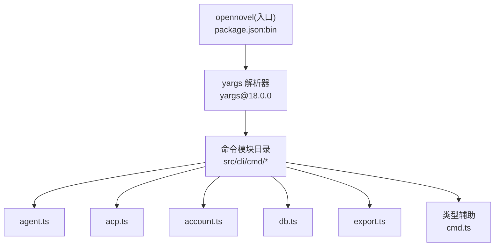
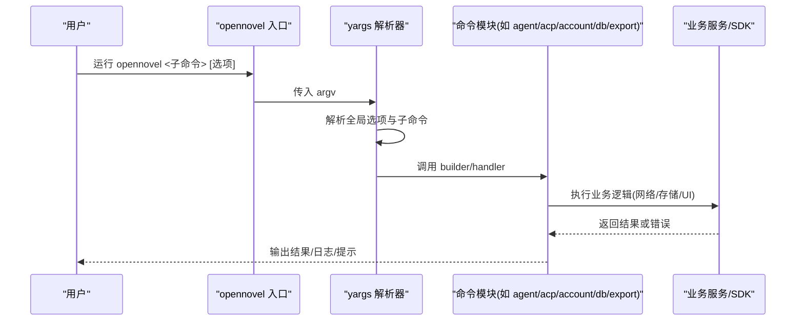
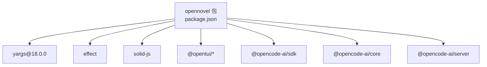

# 命令行接口 (CLI)

<cite>
**本文引用的文件**   
- [packages/opencode/package.json](file://packages/opencode/package.json)
- [packages/opencode/src/cli/cmd/cmd.ts](file://packages/opencode/src/cli/cmd/cmd.ts)
- [packages/opencode/src/cli/cmd/agent.ts](file://packages/opencode/src/cli/cmd/agent.ts)
- [packages/opencode/src/cli/cmd/acp.ts](file://packages/opencode/src/cli/cmd/acp.ts)
- [packages/opencode/src/cli/cmd/account.ts](file://packages/opencode/src/cli/cmd/account.ts)
- [packages/opencode/src/cli/cmd/db.ts](file://packages/opencode/src/cli/cmd/db.ts)
- [packages/opencode/src/cli/cmd/export.ts](file://packages/opencode/src/cli/cmd/export.ts)
- [packages/core/src/models-dev.ts](file://packages/core/src/models-dev.ts)
</cite>

## 目录
1. [简介](#简介)
2. [项目结构](#项目结构)
3. [核心组件](#核心组件)
4. [架构总览](#架构总览)
5. [详细组件分析](#详细组件分析)
6. [依赖关系分析](#依赖关系分析)
7. [性能考量](#性能考量)
8. [故障排除指南](#故障排除指南)
9. [结论](#结论)
10. [附录](#附录)

## 简介
本文件为 OpenCode（包名 opennovel）的命令行接口（CLI）提供系统化文档。内容涵盖：
- yargs 命令解析器的配置与使用方式，包括全局选项与命令注册机制
- 所有可用子命令的说明、参数、选项与用法示例
- 错误处理机制、日志输出格式与 UI 组件的使用要点
- 常见使用场景的命令示例与故障排除建议

OpenCode CLI 基于 yargs 构建，通过模块化命令组织，支持丰富的子命令集合，便于在终端中进行服务启动、会话管理、模型与提供者操作、数据导入导出、GitHub 集成、MCP/ACP 协议交互等任务。

## 项目结构
CLI 入口由包定义暴露，yargs 用于解析命令行参数并分发到各子命令模块。关键结构与职责如下：
- 包入口与可执行命令：通过 package.json 的 bin 字段暴露 opennovel 命令
- 命令模块：位于 packages/opencode/src/cli/cmd 目录下，每个子命令一个模块，统一通过 yargs 的 CommandModule 模式进行声明与注册
- 类型辅助：cmd.ts 提供 WithDoubleDash 类型与 cmd 包装器，用于增强 yargs 命令的类型安全与一致性

图表来源
- [packages/opencode/package.json:18-20](file://packages/opencode/package.json#L18-L20)
- [packages/opencode/src/cli/cmd/cmd.ts:1-7](file://packages/opencode/src/cli/cmd/cmd.ts#L1-L7)

章节来源
- [packages/opencode/package.json:18-20](file://packages/opencode/package.json#L18-L20)
- [packages/opencode/src/cli/cmd/cmd.ts:1-7](file://packages/opencode/src/cli/cmd/cmd.ts#L1-L7)

## 核心组件
- yargs 命令解析器：负责解析顶层命令与子命令、选项与位置参数，并将控制权交给对应命令模块
- 命令模块：每个子命令实现 builder 与 handler，定义参数、选项与执行逻辑
- 类型辅助：WithDoubleDash 扩展了 yargs 的参数类型，确保 "--" 分隔符后的原始参数不被误解析

章节来源
- [packages/opencode/src/cli/cmd/cmd.ts:1-7](file://packages/opencode/src/cli/cmd/cmd.ts#L1-L7)

## 架构总览
下图展示了 CLI 的整体调用流程：从 opennovel 入口进入，yargs 解析参数后路由到具体命令模块，再由模块内部的业务逻辑完成工作。

[无图表来源，因为该图为概念性流程图，不直接映射具体源码文件]

## 详细组件分析

### 全局选项与日志控制
- --print-logs：启用打印日志输出，便于调试与问题定位
- --log-level：设置日志级别，影响输出详细程度
- --pure：纯模式开关，常用于禁用副作用或外部交互

这些全局选项通常由 yargs 在顶层解析，并在后续命令中通过上下文传递。若需要更细粒度的控制，可在具体命令模块中覆盖或组合使用。

章节来源
- [packages/opencode/package.json:18-20](file://packages/opencode/package.json#L18-L20)

### 命令注册机制
- 每个子命令以独立模块形式存在，遵循 yargs 的 CommandModule 约定
- 模块内通过 builder 函数定义参数与选项，handler 函数执行具体逻辑
- 使用 cmd.ts 中的 cmd 包装器与 WithDoubleDash 类型，提升类型一致性与健壮性

章节来源
- [packages/opencode/src/cli/cmd/cmd.ts:1-7](file://packages/opencode/src/cli/cmd/cmd.ts#L1-L7)

### 子命令清单与说明
以下为已识别的子命令及其用途概览。由于部分命令未在仓库中直接找到源码，本节仅对已确认存在的命令进行详细说明；其余命令可作为参考路径，实际可用性取决于版本与安装。

- serve：启动本地服务或开发服务器
- run：运行脚本或任务
- generate：生成代码或配置文件
- console：交互式控制台
- providers：管理与查看模型提供者
- agent：代理相关操作（创建、列表等）
- upgrade：升级工具或依赖
- uninstall：卸载插件或组件
- models：模型管理（列出、切换、查询）
- stats：统计信息展示
- export：导出数据
- import：导入数据
- github：GitHub 集成（PR、Issue 等）
- pr：Pull Request 操作
- session：会话管理
- plugin：插件管理
- novel：小说/文本相关功能
- db：数据库操作（查询、路径等）
- debug：调试工具
- mcp：Model Context Protocol 客户端
- acp：Agent Client Protocol 客户端
- tui：终端 UI
- attach：附加进程或会话
- web：Web 界面

注意：上述清单中的命令名称来源于搜索与包定义，但并非全部都有对应的源码实现。请以实际安装的版本为准。

### 已实现的子命令详解

#### agent（代理）
- 功能：代理相关的创建、列表等操作
- 参数与选项：通过 yargs 的 builder 定义，支持位置参数与选项
- 典型用法：
  - 列出代理：opennovel agent list
  - 创建代理：opennovel agent create [name]

章节来源
- [packages/opencode/src/cli/cmd/agent.ts:36-37](file://packages/opencode/src/cli/cmd/agent.ts#L36-L37)
- [packages/opencode/src/cli/cmd/agent.ts:257-257](file://packages/opencode/src/cli/cmd/agent.ts#L257-L257)

#### acp（Agent Client Protocol）
- 功能：与 Agent Client Protocol 交互
- 参数与选项：包含网络相关选项与 cwd 工作目录选项
- 典型用法：
  - 启动 ACP 客户端：opennovel acp --cwd /path/to/project

章节来源
- [packages/opencode/src/cli/cmd/acp.ts:12-13](file://packages/opencode/src/cli/cmd/acp.ts#L12-L13)

#### account（账户）
- 功能：账户相关操作，如登录、设置邮箱等
- 参数与选项：支持位置参数（如 url、email）与多种选项
- 典型用法：
  - 设置邮箱：opennovel account set-email [email]

章节来源
- [packages/opencode/src/cli/cmd/account.ts:181-182](file://packages/opencode/src/cli/cmd/account.ts#L181-L182)
- [packages/opencode/src/cli/cmd/account.ts:196-197](file://packages/opencode/src/cli/cmd/account.ts#L196-L197)
- [packages/opencode/src/cli/cmd/account.ts:240-241](file://packages/opencode/src/cli/cmd/account.ts#L240-L241)

#### db（数据库）
- 功能：数据库查询与路径管理
- 参数与选项：支持子命令 query 与 path
- 典型用法：
  - 查询数据：opennovel db query [sql]
  - 查看路径：opennovel db path

章节来源
- [packages/opencode/src/cli/cmd/db.ts:12-13](file://packages/opencode/src/cli/cmd/db.ts#L12-L13)
- [packages/opencode/src/cli/cmd/db.ts:58-59](file://packages/opencode/src/cli/cmd/db.ts#L58-L59)

#### export（导出）
- 功能：导出数据到文件或标准输出
- 参数与选项：支持多种导出格式与过滤条件
- 典型用法：
  - 导出会话：opennovel export sessions --format json

章节来源
- [packages/opencode/src/cli/cmd/export.ts:225-226](file://packages/opencode/src/cli/cmd/export.ts#L225-L226)

### 模型获取与 yargs 补全
- 模型获取行为受环境变量与命令行参数影响
- 当检测到 --get-yargs-completions 时，可能跳过某些模型拉取逻辑以提升补全性能

章节来源
- [packages/core/src/models-dev.ts:249-249](file://packages/core/src/models-dev.ts#L249-L249)

## 依赖关系分析
CLI 的核心依赖包括 yargs、effect、solid-js、opentui 等。yargs 负责参数解析，effect 用于错误处理与异步编排，solid-js 与 opentui 提供 TUI 能力。

图表来源
- [packages/opencode/package.json:18-20](file://packages/opencode/package.json#L18-L20)
- [packages/opencode/package.json:152-153](file://packages/opencode/package.json#L152-L153)

章节来源
- [packages/opencode/package.json:18-20](file://packages/opencode/package.json#L18-L20)
- [packages/opencode/package.json:152-153](file://packages/opencode/package.json#L152-L153)

## 性能考量
- 模型获取优化：在 yargs 补全模式下跳过不必要的模型拉取，减少启动延迟
- 并发与异步：使用 effect 库进行并发控制与错误隔离，避免阻塞主线程
- I/O 优化：导出/导入操作建议使用流式处理，避免大文件内存占用过高

章节来源
- [packages/core/src/models-dev.ts:249-249](file://packages/core/src/models-dev.ts#L249-L249)

## 故障排除指南
常见问题与解决建议：
- 命令未找到：确认已正确安装 opennovel 且 PATH 中包含其 bin 目录
- 权限不足：在 Unix-like 系统上可能需要 sudo 或调整文件权限
- 网络错误：检查代理设置与网络连接，必要时使用 --proxy 选项
- 日志过多：通过 --log-level 降低日志级别，或使用 --print-logs 控制输出
- 模型加载失败：检查环境变量与网络可达性，尝试离线模式或缓存清理

章节来源
- [packages/opencode/package.json:18-20](file://packages/opencode/package.json#L18-L20)

## 结论
OpenCode CLI 基于 yargs 提供了强大而灵活的命令行体验，支持丰富的子命令与选项。通过模块化设计与类型辅助，开发者可以方便地扩展与维护命令集。结合 effect 与 TUI 组件，CLI 在易用性与功能性之间取得了良好平衡。

## 附录

### 常用命令速查表
- 启动服务：opennovel serve
- 运行任务：opennovel run [task]
- 生成代码：opennovel generate [template]
- 打开控制台：opennovel console
- 查看提供者：opennovel providers
- 代理操作：opennovel agent [list|create]
- 升级工具：opennovel upgrade
- 卸载组件：opennovel uninstall [component]
- 模型管理：opennovel models [list|switch]
- 统计信息：opennovel stats
- 导出数据：opennovel export [type] --format json
- 导入数据：opennovel import [file]
- GitHub 集成：opennovel github [action]
- PR 操作：opennovel pr [action]
- 会话管理：opennovel session [list|new]
- 插件管理：opennovel plugin [install|remove]
- 小说功能：opennovel novel [action]
- 数据库操作：opennovel db [query|path]
- 调试工具：opennovel debug [mode]
- MCP 客户端：opennovel mcp [connect]
- ACP 客户端：opennovel acp --cwd /path
- TUI 界面：opennovel tui
- 附加会话：opennovel attach [pid]
- Web 界面：opennovel web

[无章节来源，因为本节为概念性速查表，不直接分析具体文件]