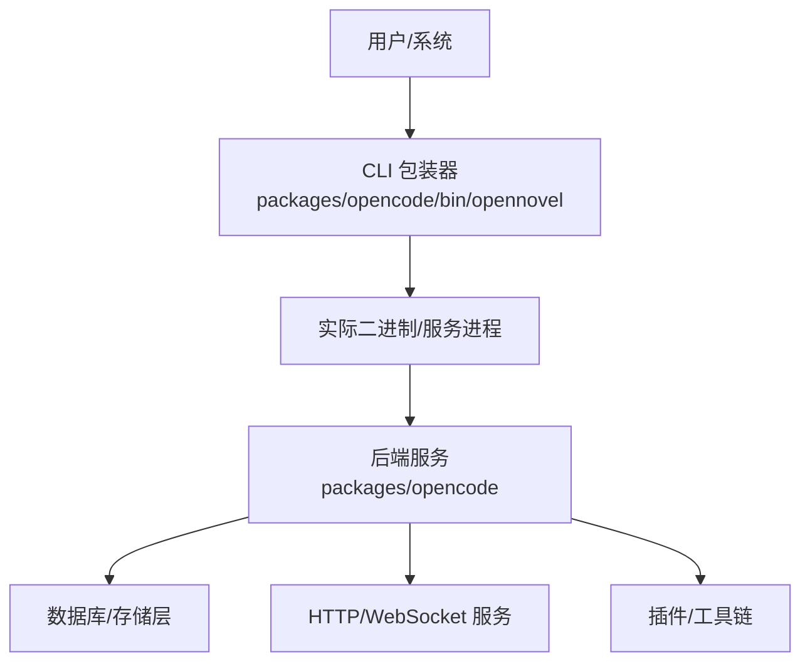
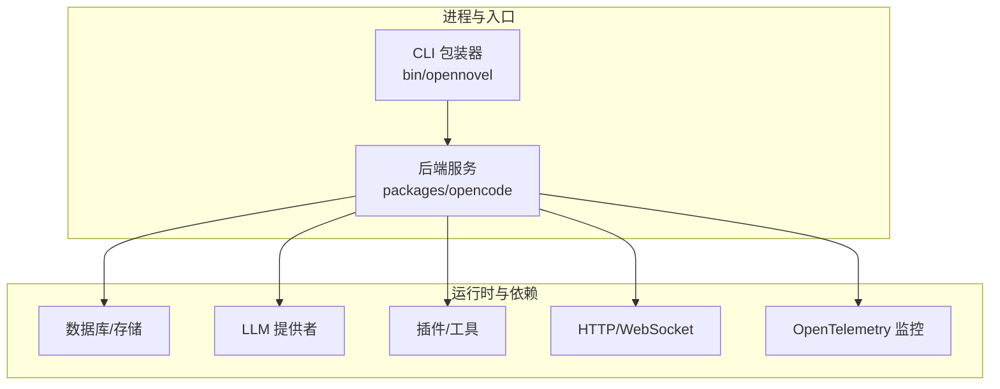
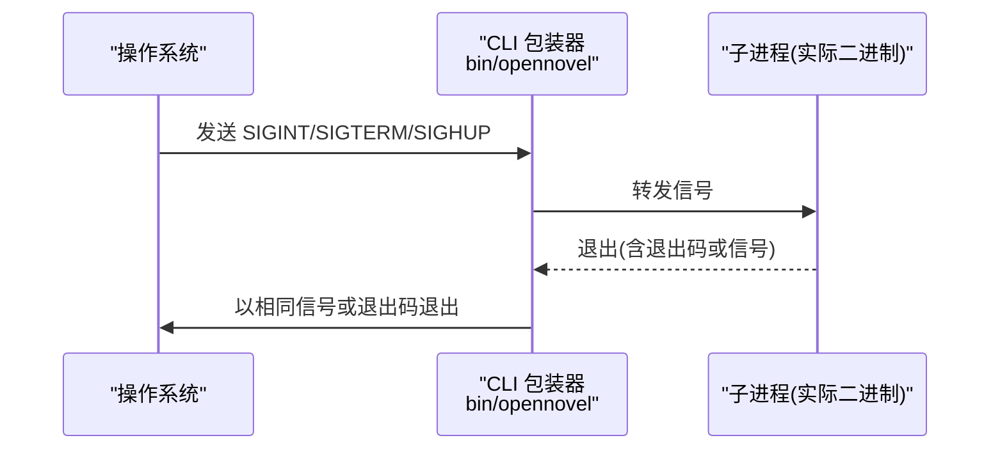
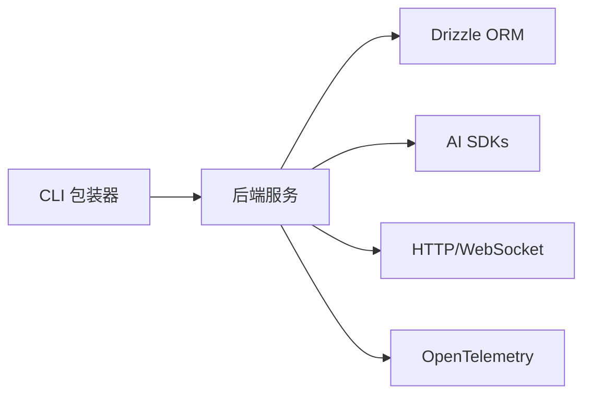
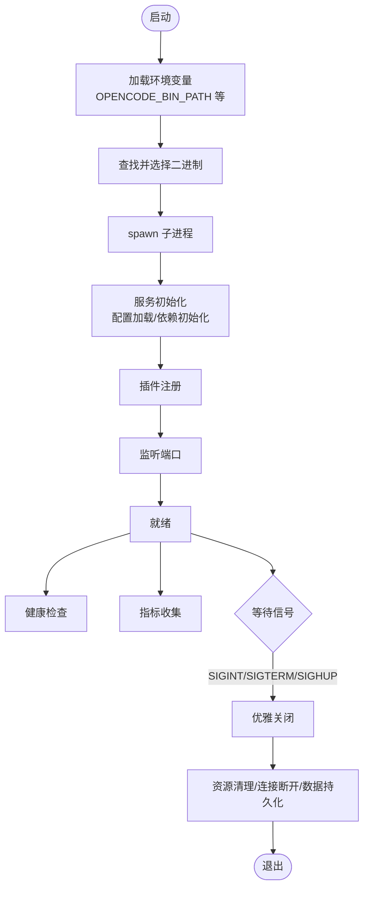

# 服务生命周期管理

<cite>
**本文引用的文件**   
- [README.md](file://README.md)
- [packages/opencode/package.json](file://packages/opencode/package.json)
- [packages/opencode/bin/opennovel](file://packages/opencode/bin/opennovel)
</cite>

## 目录
1. [简介](#简介)
2. [项目结构](#项目结构)
3. [核心组件](#核心组件)
4. [架构总览](#架构总览)
5. [详细组件分析](#详细组件分析)
6. [依赖分析](#依赖分析)
7. [性能考虑](#性能考虑)
8. [故障排查指南](#故障排查指南)
9. [结论](#结论)
10. [附录](#附录)

## 简介
本文件面向 OpenCode（openNovel）服务的生命周期管理，聚焦以下目标：
- 服务器启动流程：配置加载、依赖初始化、插件注册与端口监听
- 运行状态管理：健康检查与监控指标收集
- 优雅关闭：信号处理、资源清理、连接断开与数据持久化
- 进程管理与运行时优化：进程管理、内存监控与垃圾回收优化
- 部署与运维：环境变量、容器化支持、重启策略、故障恢复与灾难恢复

说明：当前仓库为 monorepo，后端服务入口由 packages/opencode 提供，CLI 包装器位于 packages/opencode/bin/opennovel。由于未直接获取到服务端源码实现细节，本文在“架构总览”和“详细组件分析”中给出基于现有入口文件的可验证路径与推断性设计建议，并以“概念性”图示区分非代码映射内容。

## 项目结构
- README.md 描述了整体架构与快速启动方式，指出后端服务与 Web UI 的端口分配与启动命令
- packages/opencode/package.json 定义了脚本、二进制入口与依赖关系
- packages/opencode/bin/opennovel 是跨平台二进制分发与进程转发入口，负责信号转发与子进程管理

图表来源
- [packages/opencode/bin/opennovel:1-200](file://packages/opencode/bin/opennovel#L1-L200)
- [packages/opencode/package.json:1-159](file://packages/opencode/package.json#L1-L159)
- [README.md:34-54](file://README.md#L34-L54)

章节来源
- [README.md:34-54](file://README.md#L34-L54)
- [packages/opencode/package.json:1-159](file://packages/opencode/package.json#L1-L159)
- [packages/opencode/bin/opennovel:1-200](file://packages/opencode/bin/opennovel#L1-L200)

## 核心组件
- CLI 包装器（opennovel）
  - 作用：根据平台与架构选择并执行实际二进制；转发 SIGINT/SIGTERM/SIGHUP 等信号给子进程；处理退出码与错误输出
  - 关键行为：信号转发、子进程启动、二进制查找与缓存路径解析
- 包脚本与依赖
  - 作用：定义 dev/build/test/bench/profile 等脚本；声明 HTTP API、LLM、Effect、OpenTelemetry、WebSocket 等依赖
  - 关键行为：通过 bun 条件导出与 imports 映射不同运行时环境
- 快速启动与端口约定
  - 作用：统一开发体验，后端默认端口 4096，Web UI 默认端口 4444

章节来源
- [packages/opencode/bin/opennovel:1-200](file://packages/opencode/bin/opennovel#L1-L200)
- [packages/opencode/package.json:1-159](file://packages/opencode/package.json#L1-L159)
- [README.md:34-54](file://README.md#L34-L54)

## 架构总览
下图展示从 CLI 包装器到后端服务、存储与外部依赖的整体交互。该图为概念性架构图，用于帮助理解生命周期各阶段如何协作。

[此图为概念性架构图，不直接映射具体源码文件]

## 详细组件分析

### CLI 包装器：进程管理与信号转发
- 进程管理
  - 使用 child_process.spawn 启动目标二进制，继承 stdio，便于日志透传
  - 支持 OPENCODE_BIN_PATH 环境变量覆盖二进制路径，优先读取缓存目录 .opencode
  - 自动探测平台与架构，按 musl/glibc、AVX2 能力选择合适二进制
- 信号处理与优雅关闭
  - 监听 SIGINT、SIGTERM、SIGHUP，将信号转发给子进程
  - 子进程退出时移除监听器，若因信号退出则向父进程再次发送相同信号，保证容器编排或守护进程能感知终止原因
- 错误处理
  - 子进程启动失败打印错误并退出
  - 找不到合适二进制时输出提示并退出

图表来源
- [packages/opencode/bin/opennovel:8-44](file://packages/opencode/bin/opennovel#L8-L44)
- [packages/opencode/bin/opennovel:46-199](file://packages/opencode/bin/opennovel#L46-L199)

章节来源
- [packages/opencode/bin/opennovel:1-200](file://packages/opencode/bin/opennovel#L1-L200)

### 包脚本与依赖：构建与运行环境
- 脚本
  - dev：浏览器条件下启动入口
  - build/test/bench/profile：构建、测试、基准与性能剖析
- 依赖
  - Effect、OpenTelemetry、WebSocket、Drizzle ORM、AI SDK 等，表明服务具备链路追踪、并发控制、网络通信与数据存储能力
- 导入映射
  - #db 在不同运行时（bun/node/default）下映射到对应实现，体现多运行时兼容

章节来源
- [packages/opencode/package.json:1-159](file://packages/opencode/package.json#L1-L159)

### 快速启动与端口约定
- 一键启动：bun run dev:all 同时启动后端与 Web UI
- 分端启动：后端端口 4096，Web UI 端口 4444
- 访问地址：http://localhost:4444

章节来源
- [README.md:34-54](file://README.md#L34-L54)

## 依赖分析
- 内部模块耦合
  - CLI 包装器仅负责进程与信号，对后端服务无直接代码耦合
  - 后端服务依赖 Effect、OpenTelemetry、WebSocket、Drizzle、AI SDK 等
- 外部集成点
  - 数据库/存储（Drizzle ORM）
  - LLM 提供商（多个 AI SDK）
  - 监控（OpenTelemetry）
  - 网络（HTTP/WebSocket）

图表来源
- [packages/opencode/package.json:1-159](file://packages/opencode/package.json#L1-L159)

章节来源
- [packages/opencode/package.json:1-159](file://packages/opencode/package.json#L1-L159)

## 性能考虑
- 进程与二进制选择
  - 根据平台与 CPU 特性（如 AVX2）选择最优二进制，减少运行时开销
- 运行时与 I/O
  - 使用 Bun 作为运行时，结合 Effect 进行并发与资源管理
  - Drizzle ORM 提升数据库访问效率
- 监控与可观测性
  - OpenTelemetry 集成可用于链路追踪与指标采集，建议在服务内启用并配置导出端点

[本节为通用指导，不直接分析具体文件]

## 故障排查指南
- 无法找到二进制
  - 现象：CLI 报错提示未安装正确版本
  - 排查：确认包管理器安装成功；设置 OPENCODE_BIN_PATH 指向可用二进制；检查 .opencode 缓存目录
- 服务异常退出
  - 现象：子进程退出后父进程立即退出
  - 排查：查看子进程日志；检查是否收到 SIGTERM/SIGINT；确认容器编排是否正确处理信号
- 端口冲突
  - 现象：后端或 Web UI 启动失败
  - 排查：修改端口参数；确保防火墙与安全组放行

章节来源
- [packages/opencode/bin/opennovel:190-199](file://packages/opencode/bin/opennovel#L190-L199)
- [README.md:34-54](file://README.md#L34-L54)

## 结论
- CLI 包装器提供了可靠的进程管理与信号转发机制，保障优雅关闭与可观测性
- 包脚本与依赖明确了后端服务的运行时环境与扩展点
- 快速启动与端口约定简化了开发与调试流程
- 对于更细粒度的生命周期管理（配置加载、插件注册、健康检查、指标收集、数据持久化），需结合后端源码进一步细化实现方案

[本节为总结性内容，不直接分析具体文件]

## 附录

### 启动流程（概念性）

[此图为概念性流程图，不直接映射具体源码文件]

### 环境变量与部署配置建议
- OPENCODE_BIN_PATH：指定实际二进制路径，便于容器或 CI/CD 注入
- 端口配置：后端 4096，Web UI 4444（可通过命令行参数调整）
- 容器化建议：
  - 暴露 4096 与 4444 端口
  - 挂载持久化卷至数据库目录
  - 设置健康检查探针（HTTP 或 TCP）
  - 配置日志输出到 stdout/stderr，便于日志采集

[本节为通用指导，不直接分析具体文件]

### 重启策略与灾难恢复
- 重启策略
  - 使用容器编排的重启策略（Always/OnFailure）
  - 通过健康检查避免频繁重启不稳定实例
- 故障恢复
  - 利用数据库事务与备份恢复
  - 借助 OpenTelemetry 定位问题根因
- 灾难恢复
  - 定期快照与异地备份
  - 演练恢复流程，确保 RTO/RPO 满足要求

[本节为通用指导，不直接分析具体文件]