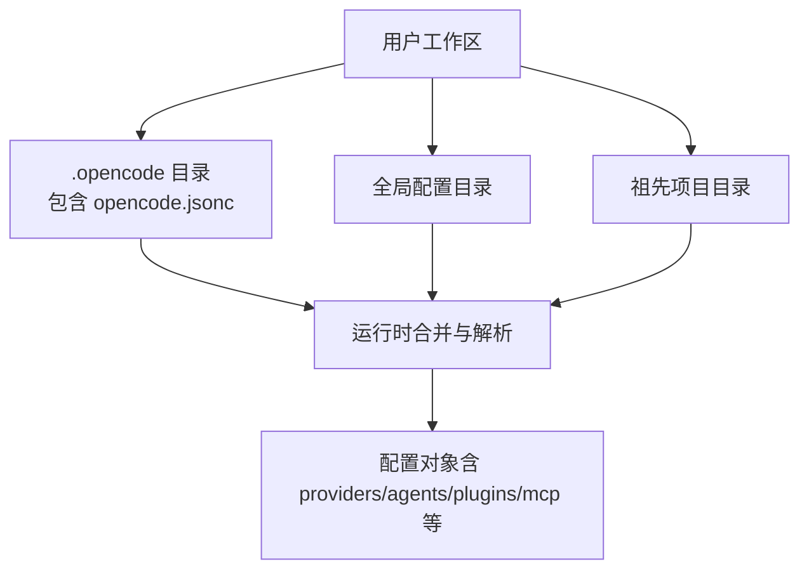
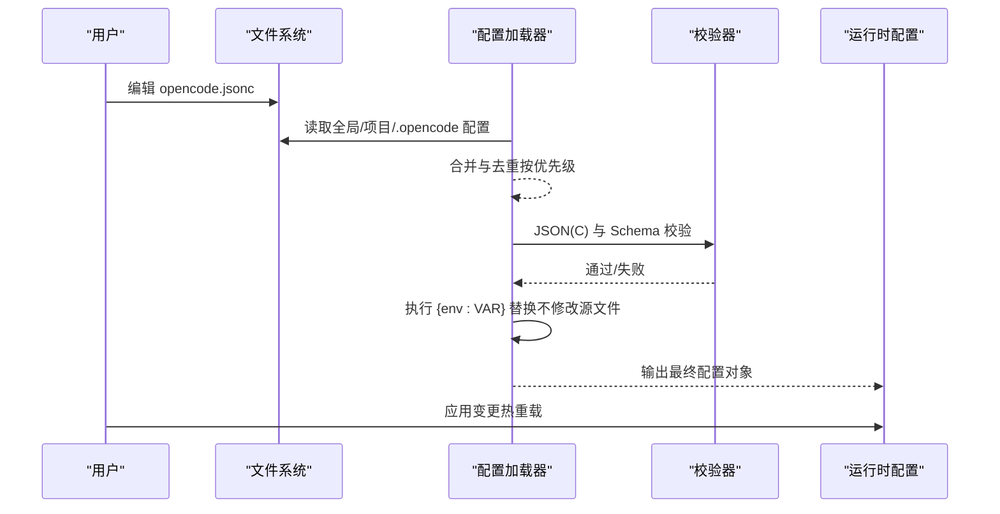
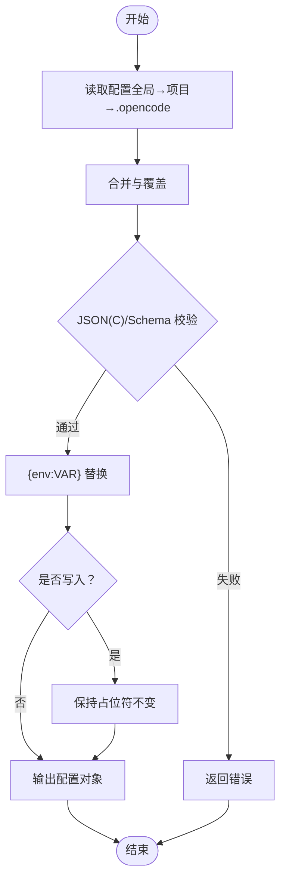
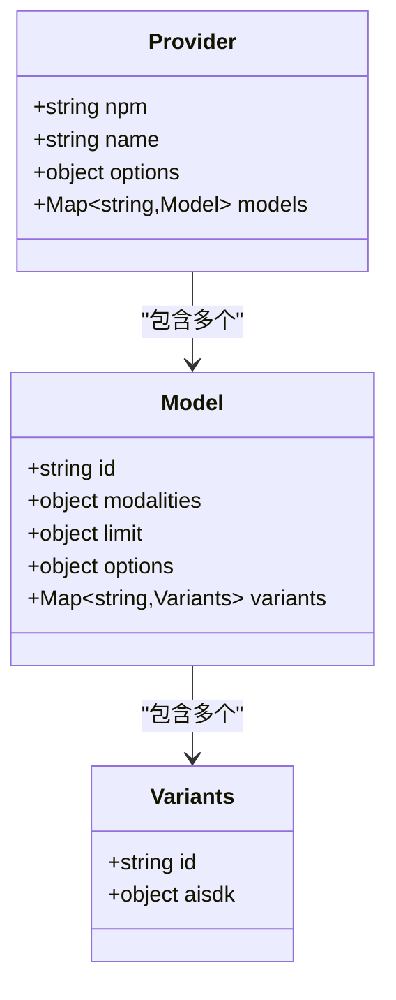
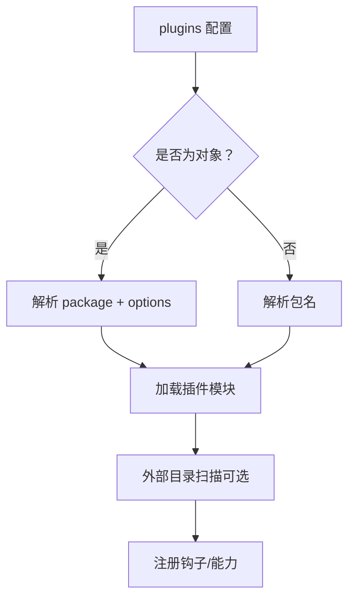
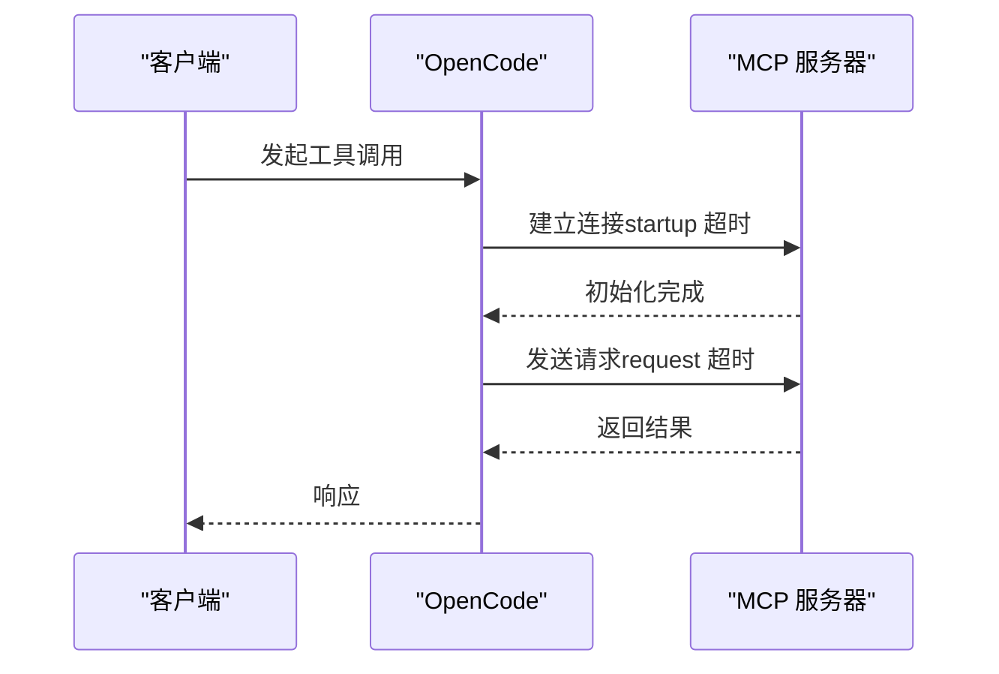
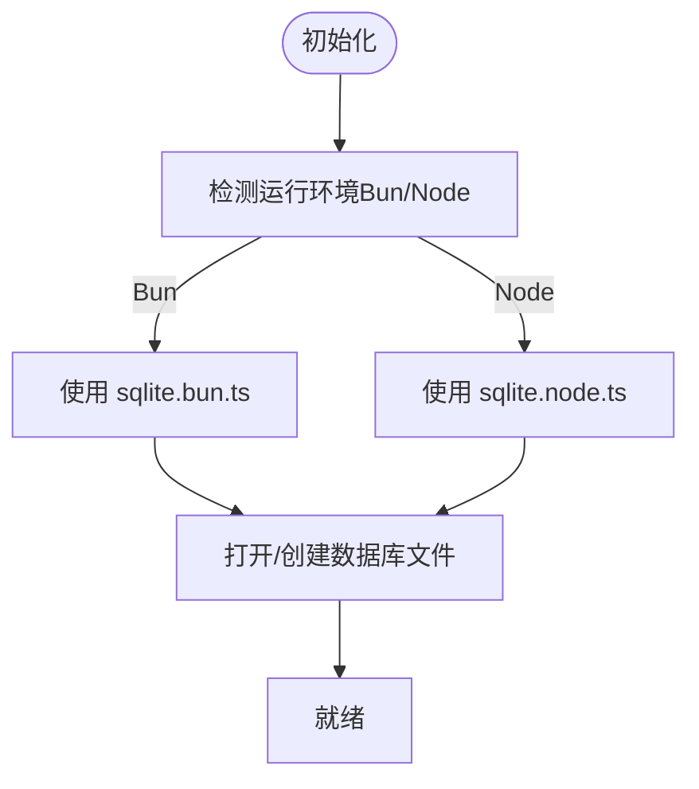
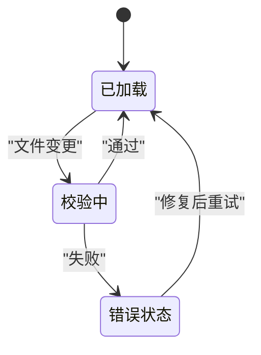
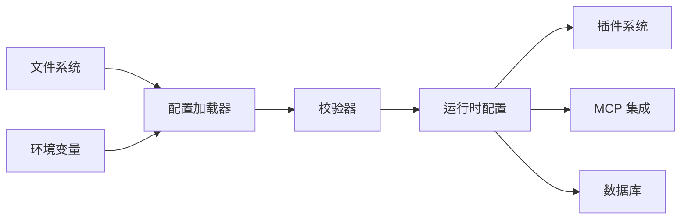

# 配置管理系统

<cite>
**本文引用的文件**   
- [opencode.jsonc](file://.opencode/opencode.jsonc)
- [config.md](file://specs/v2/config.md)
- [config.test.ts](file://packages/opencode/test/config/config.test.ts)
- [provider.test.ts](file://packages/core/test/config/provider.test.ts)
- [en.ts](file://packages/app/src/i18n/en.ts)
- [server-errors.ts](file://packages/app/src/utils/server-errors.ts)
- [markdown.ts](file://packages/core/src/config/markdown.ts)
- [external.ts](file://packages/core/src/config/plugin/external.ts)
- [sqlite.bun.ts](file://packages/core/src/database/sqlite.bun.ts)
- [sqlite.node.ts](file://packages/core/src/database/sqlite.node.ts)
</cite>

## 目录
1. [简介](#简介)
2. [项目结构](#项目结构)
3. [核心组件](#核心组件)
4. [架构总览](#架构总览)
5. [详细组件分析](#详细组件分析)
6. [依赖关系分析](#依赖关系分析)
7. [性能考量](#性能考量)
8. [故障排查指南](#故障排查指南)
9. [结论](#结论)
10. [附录](#附录)

## 简介
本文件为 OpenCode 配置管理系统的权威文档，覆盖配置文件结构、环境变量优先级与替换机制、动态配置更新与热重载、数据库/AI 提供商/插件/服务器配置项、配置校验与默认值处理、安全与敏感信息管理、多环境示例与最佳实践、配置迁移与版本兼容、以及备份恢复策略。读者可据此完成从开发到生产的端到端配置落地。

## 项目结构
OpenCode 的配置以 JSONC 为主，支持注释与 $schema 元数据；V2 规范将逐步收敛并重新组织字段，同时保留向后兼容的加载顺序与发现规则。

**图示来源** 
- [config.md:16](file://specs/v2/config.md#L16-L16)

**章节来源**
- [config.md:16](file://specs/v2/config.md#L16-L16)

## 核心组件
- 配置文件与发现：支持 opencode.json / opencode.jsonc，按“全局 → 项目 → .opencode”的顺序合并。
- 变量与模板：支持 {env:VAR} 占位符进行环境变量注入，且写入时保留原始占位符。
- 校验与错误：JSON(C) 语法校验、Schema 校验、国际化错误消息。
- 插件系统：支持包名或对象形式的插件声明，支持外部插件目录发现。
- 集成与协议：MCP 服务器配置（本地/远程）、OAuth、超时控制。
- 数据库：SQLite 后端（Bun/Node），通过文件名与选项初始化。
- V2 演进：providers/agents/permissions/mcp/compaction 等字段的规范化设计。

**章节来源**
- [config.md:16](file://specs/v2/config.md#L16-L16)
- [config.test.ts:492-529](file://packages/opencode/test/config/config.test.ts#L492-L529)
- [external.ts:69](file://packages/core/src/config/plugin/external.ts#L69-L69)
- [sqlite.bun.ts:158](file://packages/core/src/database/sqlite.bun.ts#L158-L158)
- [sqlite.node.ts:151](file://packages/core/src/database/sqlite.node.ts#L151-L151)

## 架构总览
下图展示配置加载、校验、变量替换与运行时生效的关键流程。

**图示来源** 
- [config.md:16](file://specs/v2/config.md#L16-L16)
- [config.test.ts:492-529](file://packages/opencode/test/config/config.test.ts#L492-L529)

## 详细组件分析

### 配置文件结构与字段说明
- 基础元数据
  - $schema：只读元数据，用于编辑器校验与补全；加载时不会写入或创建该字段。
- 进程与服务器
  - shell：终端与 Shell 工具默认 Shell。
  - autoupdate：自动更新/通知行为（true/false/"notify"）。
- 命令与项目资源
  - skills：技能发现源数组（本地路径或远程 URL）。
  - references：命名引用（本地路径/Git 仓库）。
  - instructions：自动注入的环境指令源（本地/通配/URL）。
- 插件
  - plugins：有序加载的包列表，支持字符串或 { package, options } 对象。
- 文件系统与工具运行时
  - watcher：忽略模式数组。
  - snapshots：快照开关（复数形式）。
  - formatter：格式化器开关与覆盖。
  - lsp：语言服务器开关与覆盖。
  - attachments：附件处理（如图片尺寸限制）。
  - tool_output：工具输出截断阈值。
- 共享与身份
  - share：会话共享策略（"manual"/"auto"/"disabled"）。
  - enterprise.url：企业分享服务地址。
  - username：显示用户名覆盖。
- 提供商与模型选择
  - providers：自定义提供商与模型覆盖（复数键）。
  - model：默认模型回退。
  - experimental.policies：提供商使用策略（allow/deny）。
- 代理与权限
  - agents：内置/自定义代理定义（含 model/variant/options/system/steps/color/disabled 等）。
  - permissions：有序规则集（action/resource/effect）。
- 集成
  - mcp.servers：本地/远程 MCP 服务器配置，支持 OAuth、headers、timeout。
- 对话生命周期
  - compaction：自动压缩、修剪、保留历史 token 预算与缓冲。

**章节来源**
- [config.md:18-400](file://specs/v2/config.md#L18-L400)

### 环境变量优先级与替换机制
- 优先级
  - 配置来源优先级：全局配置 → 项目根配置 → .opencode 配置。
  - 同一来源内，后加载的片段覆盖前者。
- 变量替换
  - 支持 {env:VAR} 占位符在运行时展开。
  - 写入配置时保留原始占位符，避免泄露明文。
- 测试要点
  - 验证变量替换生效与源文件不被改写。

**图示来源** 
- [config.test.ts:492-529](file://packages/opencode/test/config/config.test.ts#L492-L529)

**章节来源**
- [config.md:16](file://specs/v2/config.md#L16-L16)
- [config.test.ts:492-529](file://packages/opencode/test/config/config.test.ts#L492-L529)

### AI 提供商与模型配置
- 提供商
  - npm：适配器包名（如 openai-compatible）。
  - name：显示名称。
  - options：基础 URL、API Key、缓存键等。
- 模型
  - modalities：输入/输出模态（text/image）。
  - limit：上下文与输出长度限制。
  - options：thinking、temperature、top_p、top_k、reasoningEffort 等。
  - variants：同模型不同变体（低/中/高/极端）。
- 策略
  - experimental.policies：对 provider.use 的 allow/deny 规则。

**图示来源** 
- [opencode.jsonc:3-607](file://.opencode/opencode.jsonc#L3-L607)

**章节来源**
- [opencode.jsonc:3-607](file://.opencode/opencode.jsonc#L3-L607)
- [config.md:169-237](file://specs/v2/config.md#L169-L237)

### 插件配置与外部发现
- 声明方式
  - 字符串：直接指定包名。
  - 对象：{ package, options } 形式，便于传递参数。
- 外部插件目录
  - 支持从插件目录扫描并自动注册。

**图示来源** 
- [config.md:86-110](file://specs/v2/config.md#L86-L110)
- [external.ts:69](file://packages/core/src/config/plugin/external.ts#L69-L69)

**章节来源**
- [config.md:86-110](file://specs/v2/config.md#L86-L110)
- [external.ts:69](file://packages/core/src/config/plugin/external.ts#L69-L69)

### 服务器与 MCP 集成
- MCP 服务器
  - type：local（命令+环境变量）或 remote（URL+headers+oauth）。
  - timeout：startup（启动）与 request（请求）毫秒级超时。
  - disabled：禁用条目。
- 其他
  - server 相关设置不在位置配置阶段生效（由进程启动前决定）。

**图示来源** 
- [config.md:305-346](file://specs/v2/config.md#L305-L346)

**章节来源**
- [config.md:305-346](file://specs/v2/config.md#L305-L346)

### 数据库配置（SQLite）
- 后端
  - Bun 环境：sqlite.bun.ts
  - Node 环境：sqlite.node.ts
- 关键项
  - filename：数据库文件路径。
  - 其他初始化选项由对应驱动提供。

**图示来源** 
- [sqlite.bun.ts:158](file://packages/core/src/database/sqlite.bun.ts#L158-L158)
- [sqlite.node.ts:151](file://packages/core/src/database/sqlite.node.ts#L151-L151)

**章节来源**
- [sqlite.bun.ts:158](file://packages/core/src/database/sqlite.bun.ts#L158-L158)
- [sqlite.node.ts:151](file://packages/core/src/database/sqlite.node.ts#L151-L151)

### 配置校验与默认值处理
- JSON(C) 校验：确保语法正确，支持注释。
- Schema 校验：基于 $schema 的强类型约束。
- Markdown 兼容性：部分值以 YAML 块标量形式兼容旧配置。
- 默认值：未提供的字段采用空默认或运行时缺省。

**章节来源**
- [en.ts:602-608](file://packages/app/src/i18n/en.ts#L602-L608)
- [server-errors.ts:89-90](file://packages/app/src/utils/server-errors.ts#L89-L90)
- [markdown.ts:21](file://packages/core/src/config/markdown.ts#L21-L21)

### 安全配置与敏感信息管理
- 环境变量注入：使用 {env:VAR} 注入密钥，避免明文落盘。
- 写入保护：添加 $schema 时不改变原有占位符内容。
- 策略控制：experimental.policies 限制 provider.use，防止滥用。
- 建议
  - 所有密钥通过环境变量或受控密钥管理服务注入。
  - 生产环境启用最小权限策略与审计日志。

**章节来源**
- [config.test.ts:492-529](file://packages/opencode/test/config/config.test.ts#L492-L529)
- [config.md:181-200](file://specs/v2/config.md#L181-L200)

### 动态配置更新与热重载
- 触发时机：配置文件变更后，加载器重新读取、校验、替换并输出新配置。
- 影响范围：运行时配置对象即时更新，下游子系统按需消费。
- 注意事项：server 相关设置在进程启动前确定，位置配置无法热重载。

[本图为概念图，无需图示来源]

## 依赖关系分析
- 配置加载依赖文件系统与合并策略。
- 校验依赖 JSON(C) 解析与 Schema 定义。
- 变量替换依赖进程环境变量。
- 插件依赖包管理与外部目录扫描。
- MCP 依赖网络与认证。
- 数据库依赖平台驱动（Bun/Node）。

[本图为概念图，无需图示来源]

## 性能考量
- 配置合并与校验应在启动阶段批量完成，避免频繁 I/O。
- 大模型配置（variants/options）应精简，减少序列化开销。
- MCP 超时需合理设置，避免阻塞主线程。
- SQLite 文件路径与 WAL 模式可按负载调优。

[本节为通用指导，无需章节来源]

## 故障排查指南
- 常见错误
  - 配置文件非有效 JSON(C)。
  - 配置项不符合 Schema。
  - 环境变量缺失导致替换失败。
- 定位步骤
  - 检查 $schema 与字段拼写。
  - 确认环境变量存在且可访问。
  - 查看国际化错误消息获取具体原因。
- 参考
  - 错误消息与提示文案位于 i18n 与错误处理模块。

**章节来源**
- [en.ts:602-608](file://packages/app/src/i18n/en.ts#L602-L608)
- [server-errors.ts:89-90](file://packages/app/src/utils/server-errors.ts#L89-L90)

## 结论
OpenCode 的配置系统以 JSONC 为核心，结合 V2 规范的字段收敛与环境变量注入，提供了可扩展、可校验、可安全的配置管理能力。通过明确的优先级、策略控制与热重载机制，可在多环境中稳定运行。建议在生产中严格遵循最小权限与安全最佳实践，并结合监控与审计保障稳定性。

[本节为总结性内容，无需章节来源]

## 附录

### 多环境配置示例与最佳实践
- 开发
  - 使用本地模型或沙箱 API Key。
  - 开启 verbose 日志与调试工具。
  - 允许更多 provider 使用（宽松策略）。
- 测试
  - 固定模型与变体，确保可重复性。
  - 限制插件与 MCP 访问范围。
- 生产
  - 仅启用必要 provider 与插件。
  - 使用密钥管理服务注入敏感信息。
  - 启用策略 deny-all 后再白名单放行。

[本节为通用指导，无需章节来源]

### 配置迁移与版本兼容性
- 文件名：V2 支持 opencode.json / opencode.jsonc，不再支持 config.json。
- 字段迁移：按 V2 规范分组逐项评估（keep/remove/redesign）。
- 兼容性：$schema 作为只读元数据，不影响运行时。

**章节来源**
- [config.md:16](file://specs/v2/config.md#L16-L16)
- [config.md:18-400](file://specs/v2/config.md#L18-L400)

### 配置备份与恢复
- 备份
  - 定期备份 .opencode/opencode.jsonc 与全局配置目录。
  - 记录环境变量清单（不含敏感值）。
- 恢复
  - 还原配置文件后重启或触发热重载。
  - 校验 $schema 与字段有效性。

[本节为通用指导，无需章节来源]