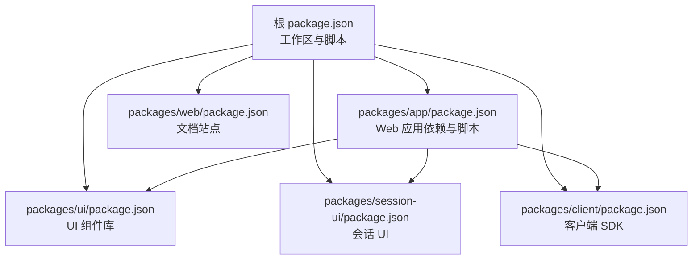
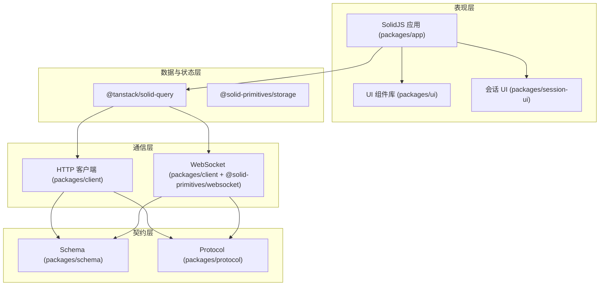
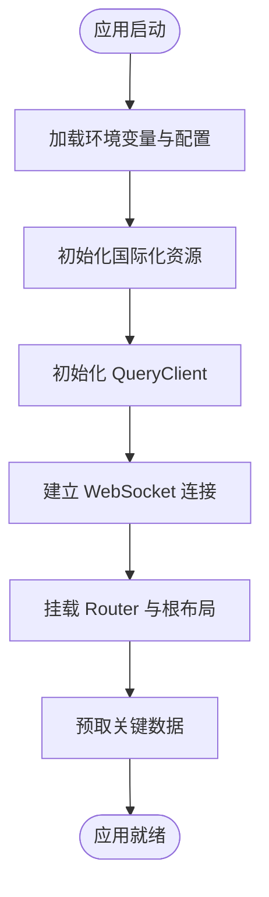
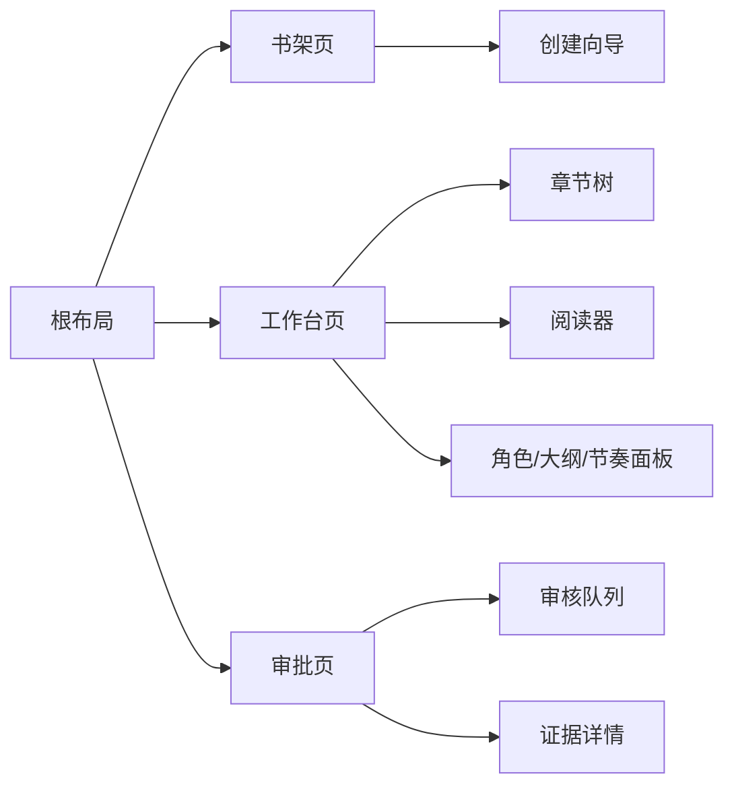
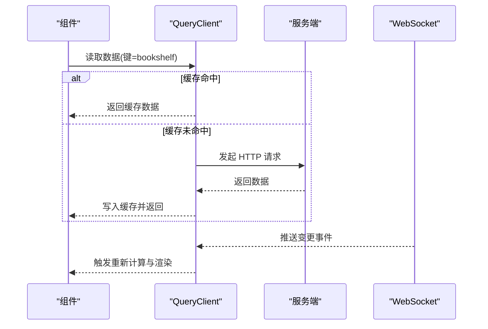
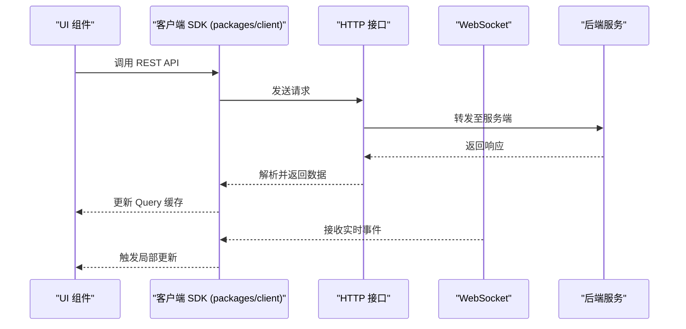
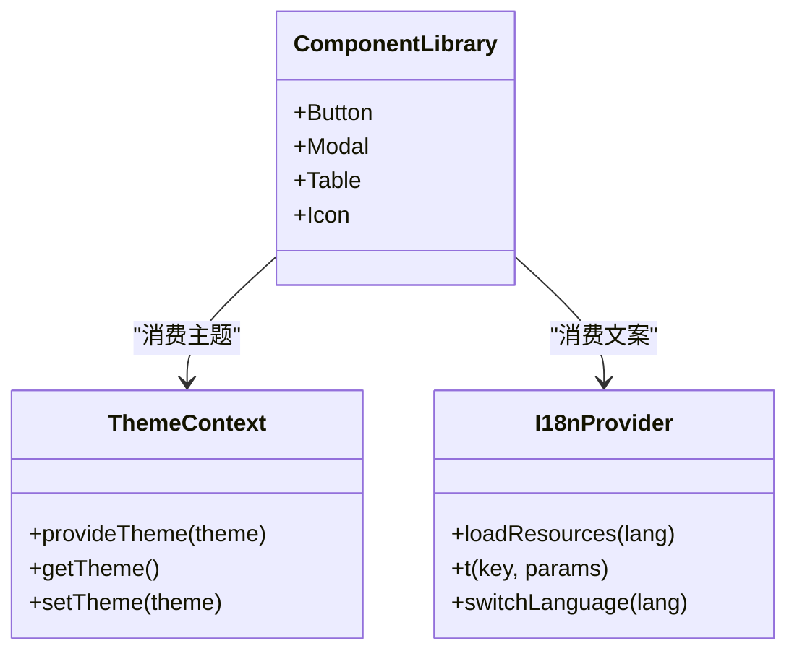
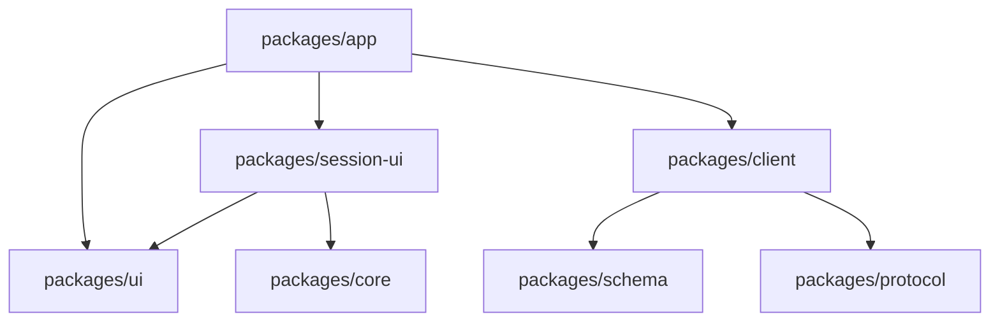

# SolidJS 前端应用

<cite>
**本文引用的文件**   
- [package.json](file://package.json)
- [README.md](file://README.md)
- [packages/app/package.json](file://packages/app/package.json)
- [packages/ui/package.json](file://packages/ui/package.json)
- [packages/session-ui/package.json](file://packages/session-ui/package.json)
- [packages/client/package.json](file://packages/client/package.json)
- [packages/web/package.json](file://packages/web/package.json)
</cite>

## 目录
1. [简介](#简介)
2. [项目结构](#项目结构)
3. [核心组件](#核心组件)
4. [架构总览](#架构总览)
5. [详细组件分析](#详细组件分析)
6. [依赖分析](#依赖分析)
7. [性能考量](#性能考量)
8. [故障排查指南](#故障排查指南)
9. [结论](#结论)
10. [附录](#附录)

## 简介
本仓库是一个以 Bun 为包管理器与运行时的 Monorepo，包含后端服务、SDK、协议、共享 Schema、以及基于 SolidJS 的 Web UI。Web 端位于 packages/app，使用 Vite + vite-plugin-solid 构建，集成 @solidjs/router 进行路由管理，@tanstack/solid-query 负责数据请求与缓存，@solid-primitives/i18n 提供国际化能力，@solid-primitives/websocket 用于实时通信。UI 层由 packages/ui 统一提供主题、样式与通用组件；会话相关 UI 由 packages/session-ui 封装；前后端契约通过 packages/schema 与 packages/protocol 定义，客户端 SDK 在 packages/client 中生成并暴露给上层应用调用。

## 项目结构
- 根 package.json 定义了工作区、脚本与依赖版本编排（catalog），并提供 dev:web 等命令启动 Web 应用。
- packages/app 是 SolidJS Web 应用入口，使用 Vite 开发/构建，依赖 @solidjs/router、@tanstack/solid-query、@solid-primitives/* 等生态库。
- packages/ui 是统一的 UI 组件库，提供主题、样式、图标与可复用组件，并通过 exports 暴露 i18n、hooks、context、theme 等模块。
- packages/session-ui 聚焦会话交互 UI（消息流、Markdown 渲染、差异对比等）。
- packages/client 基于 schema/protocol 生成 HTTP/WebSocket 客户端代码，供 app 调用。
- packages/web 是基于 Astro 的文档站点，非主应用，但同样集成 SolidJS。

**图表来源** 
- [package.json:1-162](file://package.json#L1-L162)
- [packages/app/package.json:1-97](file://packages/app/package.json#L1-L97)
- [packages/ui/package.json:1-114](file://packages/ui/package.json#L1-L114)
- [packages/session-ui/package.json:1-72](file://packages/session-ui/package.json#L1-L72)
- [packages/client/package.json:1-40](file://packages/client/package.json#L1-L40)
- [packages/web/package.json:1-45](file://packages/web/package.json#L1-L45)

**章节来源**
- [package.json:1-162](file://package.json#L1-L162)
- [README.md:1-77](file://README.md#L1-L77)

## 核心组件
- Web 应用（packages/app）
  - 构建工具：Vite + vite-plugin-solid
  - 路由：@solidjs/router
  - 数据层：@tanstack/solid-query（请求缓存、重试、同步）
  - 国际化：@solid-primitives/i18n
  - 实时通信：@solid-primitives/websocket
  - 拖拽：@dnd-kit/solid
  - 媒体与事件：@solid-primitives/media、event-listener、resize-observer 等
- UI 组件库（packages/ui）
  - 主题系统：theme/index.ts、theme/context.tsx、themes/*.json
  - 样式：styles/index.css、styles/tailwind/index.css
  - 导出：i18n、hooks、context、icons、fonts、audio 等
- 会话 UI（packages/session-ui）
  - Markdown 流式渲染、消息差异对比、行级评论样式等
- 客户端 SDK（packages/client）
  - 基于 schema/protocol 生成 HTTP/WebSocket 客户端，暴露 effect 适配

**章节来源**
- [packages/app/package.json:1-97](file://packages/app/package.json#L1-L97)
- [packages/ui/package.json:1-114](file://packages/ui/package.json#L1-L114)
- [packages/session-ui/package.json:1-72](file://packages/session-ui/package.json#L1-L72)
- [packages/client/package.json:1-40](file://packages/client/package.json#L1-L40)

## 架构总览
整体采用分层架构：
- 表现层：SolidJS 组件树（app）+ UI 组件库（ui）+ 会话 UI（session-ui）
- 状态与数据层：@tanstack/solid-query 管理服务端数据缓存与同步；本地持久化可通过 @solid-primitives/storage
- 通信层：HTTP REST（通过 client 生成的 SDK）与 WebSocket（@solid-primitives/websocket）
- 契约层：schema + protocol 定义 API 结构与行为，client 据此生成类型安全的客户端

**图表来源** 
- [packages/app/package.json:1-97](file://packages/app/package.json#L1-L97)
- [packages/ui/package.json:1-114](file://packages/ui/package.json#L1-L114)
- [packages/session-ui/package.json:1-72](file://packages/session-ui/package.json#L1-L72)
- [packages/client/package.json:1-40](file://packages/client/package.json#L1-L40)

## 详细组件分析

### 应用初始化流程
- 入口与脚本：根 package.json 的 dev:web 指向 packages/app 的 Vite 开发服务器；packages/app/package.json 定义了 start/dev/build/serve 等脚本。
- 构建与插件：Vite + vite-plugin-solid 编译 TSX；Tailwind 通过 @tailwindcss/vite 注入样式；Sentry 插件用于错误上报。
- 运行时依赖：SolidJS 框架、Router、Meta、Query、Primitives（i18n、websocket、storage、media、event-listener 等）。
- 初始化顺序建议：
  1) 加载配置与环境变量（API 地址、WebSocket 地址、功能开关）
  2) 初始化 i18n 资源与语言切换
  3) 初始化 QueryClient（缓存策略、重试、超时）
  4) 建立 WebSocket 连接（鉴权、重连、心跳）
  5) 挂载 Router 与根布局组件
  6) 按需预取关键数据（书架、最近项目、用户信息）

**章节来源**
- [package.json:1-25](file://package.json#L1-L25)
- [packages/app/package.json:1-31](file://packages/app/package.json#L1-L31)

### 路由配置与页面组织
- 路由库：@solidjs/router 提供声明式路由与嵌套路由能力。
- 页面组织建议：
  - 根布局：Header/Sidebar/Content 三栏结构
  - 书架页：书籍列表、创建向导入口
  - 工作台页：章节树、阅读器、角色/大纲/节奏面板、全文搜索
  - 审批页：审核队列、证据跳转、批注与决策
- 路由职责分离：每个页面作为独立模块，内部再拆分为子组件，保持高内聚低耦合。

[此图为概念性结构图，不直接映射具体源码文件]

### 组件树结构与状态管理模式
- 组件树：UI 组件库（packages/ui）提供基础原子组件；session-ui 提供会话相关复合组件；app 组合业务页面。
- 状态模式：
  - 服务端数据：@tanstack/solid-query 管理缓存、并发、失效与同步
  - 本地状态：@solid-primitives/storage 持久化用户偏好、语言、主题
  - 实时状态：@solid-primitives/websocket 维护连接与消息分发
- 数据流设计：
  - 组件触发查询 → Query 发起请求 → 缓存命中则返回 → 未命中则请求后端 → 更新缓存与订阅者
  - WebSocket 事件驱动更新：收到增量变更 → 局部更新 Query 缓存或本地状态

**章节来源**
- [packages/app/package.json:1-97](file://packages/app/package.json#L1-L97)
- [packages/ui/package.json:1-114](file://packages/ui/package.json#L1-L114)
- [packages/session-ui/package.json:1-72](file://packages/session-ui/package.json#L1-L72)

### 与后端的通信机制
- REST API：通过 packages/client 生成的 SDK 调用，遵循 packages/schema 与 packages/protocol 定义的契约。
- WebSocket：使用 @solid-primitives/websocket 建立长连接，处理鉴权、心跳、断线重连与消息分发。
- 实时同步：将 WebSocket 事件映射到 Query 缓存键，实现细粒度增量更新。

**章节来源**
- [packages/client/package.json:1-40](file://packages/client/package.json#L1-L40)
- [packages/app/package.json:1-97](file://packages/app/package.json#L1-L97)

### UI 组件库的使用、主题定制与国际化
- 组件使用：从 packages/ui 导入原子组件与布局组件，在 app 中组合成页面。
- 主题定制：通过 theme/index.ts 与 themes/*.json 定义颜色、字体、间距等；使用 theme/context.tsx 提供主题上下文。
- 国际化：packages/ui 暴露 i18n 模块；app 中使用 @solid-primitives/i18n 加载多语言资源并动态切换。

**图表来源** 
- [packages/ui/package.json:1-114](file://packages/ui/package.json#L1-L114)

**章节来源**
- [packages/ui/package.json:1-114](file://packages/ui/package.json#L1-L114)
- [packages/app/package.json:1-97](file://packages/app/package.json#L1-L97)

### 构建配置、开发环境设置与生产部署优化
- 开发环境：
  - 使用 Vite 快速热更新；Tailwind 按需生成样式；Sentry 插件开启错误上报
  - 根脚本 dev:all 同时启动后端与 Web UI，便于联调
- 生产构建：
  - Vite 构建产物最小化；启用 Tree Shaking 与 Code Splitting
  - 静态资源 CDN 化；开启 Gzip/Brotli
  - Sentry 生产上报与 Source Map 上传
- 部署优化：
  - 使用缓存策略（Cache-Control）与 ETag
  - 预加载关键资源（preload/prefetch）
  - 监控与告警（Sentry、日志采集）

**章节来源**
- [package.json:1-25](file://package.json#L1-L25)
- [packages/app/package.json:1-31](file://packages/app/package.json#L1-L31)

### 组件开发最佳实践与性能优化建议
- 组件设计：
  - 单一职责、可组合、可测试；避免过深嵌套
  - 使用 UI 组件库保持一致性与可维护性
- 性能优化：
  - 合理使用 @tanstack/solid-query 的缓存与失效策略，减少重复请求
  - 大列表使用虚拟滚动（@tanstack/solid-virtual）
  - 图片懒加载与按需加载；避免阻塞渲染
  - 使用 memoization 与选择性更新（SolidJS 原生优势）
- 可访问性与体验：
  - 键盘导航、ARIA 属性、色彩对比度
  - 错误边界与友好提示

[本节为通用指导，不直接分析具体文件]

## 依赖分析
- 应用依赖关系：
  - app 依赖 ui、session-ui、client、query、primitives
  - session-ui 依赖 ui、core、sdk
  - client 依赖 schema、protocol
- 外部依赖：
  - SolidJS 生态（router、meta、query、primitives）
  - Tailwind 样式体系
  - Sentry 错误上报
  - WebSocket 实时通信

**图表来源** 
- [packages/app/package.json:1-97](file://packages/app/package.json#L1-L97)
- [packages/ui/package.json:1-114](file://packages/ui/package.json#L1-L114)
- [packages/session-ui/package.json:1-72](file://packages/session-ui/package.json#L1-L72)
- [packages/client/package.json:1-40](file://packages/client/package.json#L1-L40)

**章节来源**
- [packages/app/package.json:1-97](file://packages/app/package.json#L1-L97)
- [packages/ui/package.json:1-114](file://packages/ui/package.json#L1-L114)
- [packages/session-ui/package.json:1-72](file://packages/session-ui/package.json#L1-L72)
- [packages/client/package.json:1-40](file://packages/client/package.json#L1-L40)

## 性能考量
- 渲染性能：利用 SolidJS 的细粒度更新与选择性订阅，避免不必要的重渲染
- 网络性能：合理设置 Query 缓存时间、重试次数与退避策略；对大文件分块下载
- 内存占用：及时释放 WebSocket 监听器与定时器；避免闭包引用导致泄漏
- 首屏优化：关键路径资源预加载；惰性加载非关键组件与数据

[本节为通用指导，不直接分析具体文件]

## 故障排查指南
- 常见问题定位：
  - 路由 404：检查路由配置与嵌套层级
  - 数据未更新：确认 Query 键一致性与失效策略
  - WebSocket 断开：检查鉴权、心跳与重连逻辑
  - 样式异常：确认 Tailwind 生成与 CSS 引入顺序
- 调试工具：
  - Sentry 错误上报与堆栈追踪
  - Vite 开发时 HMR 与网络面板
  - 浏览器开发者工具的性能与内存分析

**章节来源**
- [packages/app/package.json:1-31](file://packages/app/package.json#L1-L31)

## 结论
本项目以 Monorepo 形式组织，Web 端基于 SolidJS + Vite，结合 @tanstack/solid-query 与 @solid-primitives 生态，形成清晰的分层架构与数据流。UI 组件库与会话 UI 解耦，便于扩展与维护。通过 schema/protocol 与 client SDK 保证前后端契约一致性，WebSocket 支持实时同步。建议在开发中遵循组件最佳实践与性能优化策略，确保用户体验与可维护性。

[本节为总结，不直接分析具体文件]

## 附录
- 快速开始：参考 README 中的 Quickstart 步骤，使用 bun 安装依赖并启动后端与 Web UI
- 文档站点：packages/web 基于 Astro，集成 SolidJS，用于展示文档与示例

**章节来源**
- [README.md:1-77](file://README.md#L1-L77)
- [packages/web/package.json:1-45](file://packages/web/package.json#L1-L45)