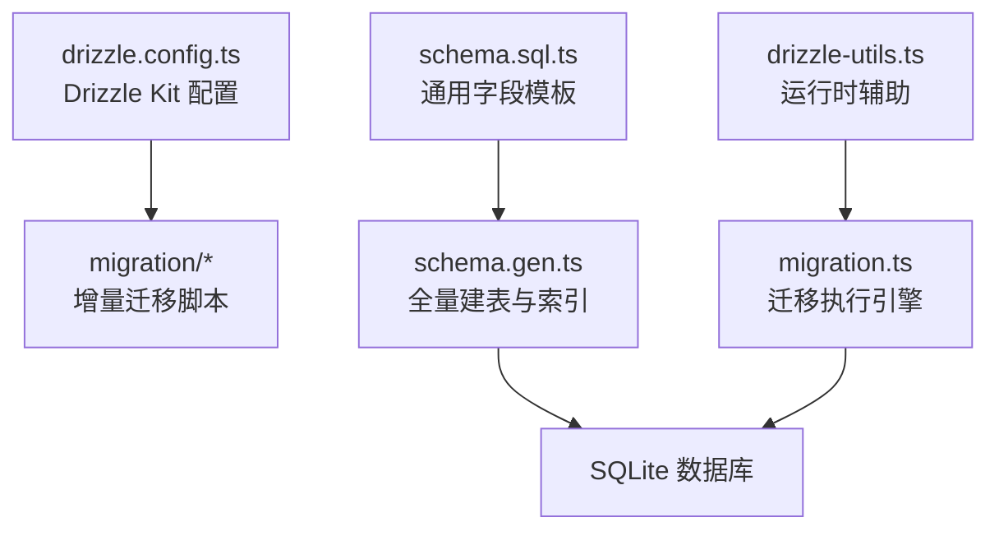
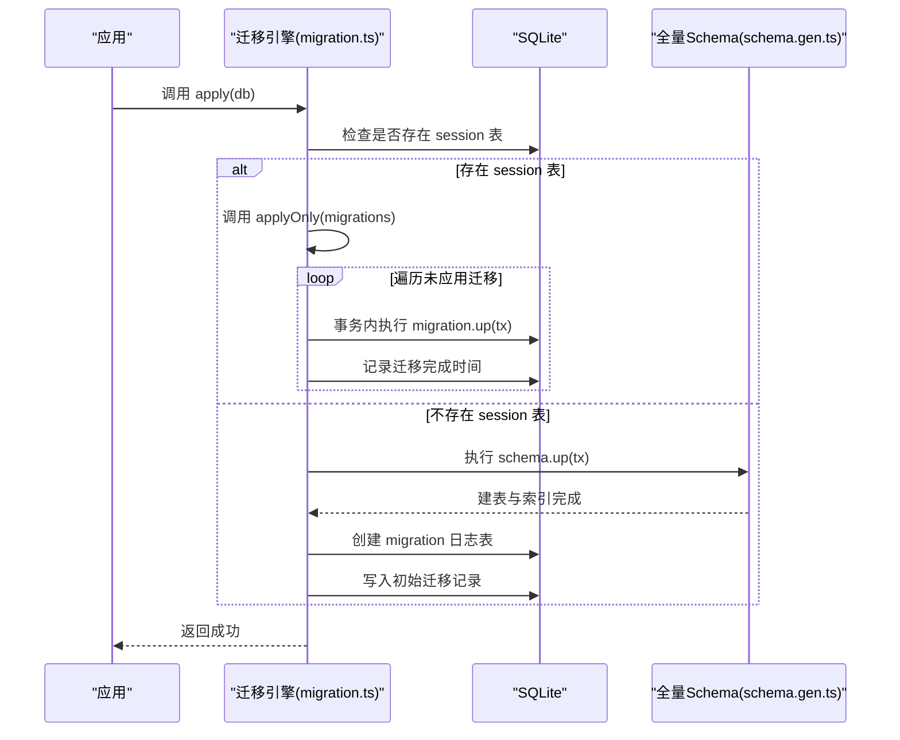
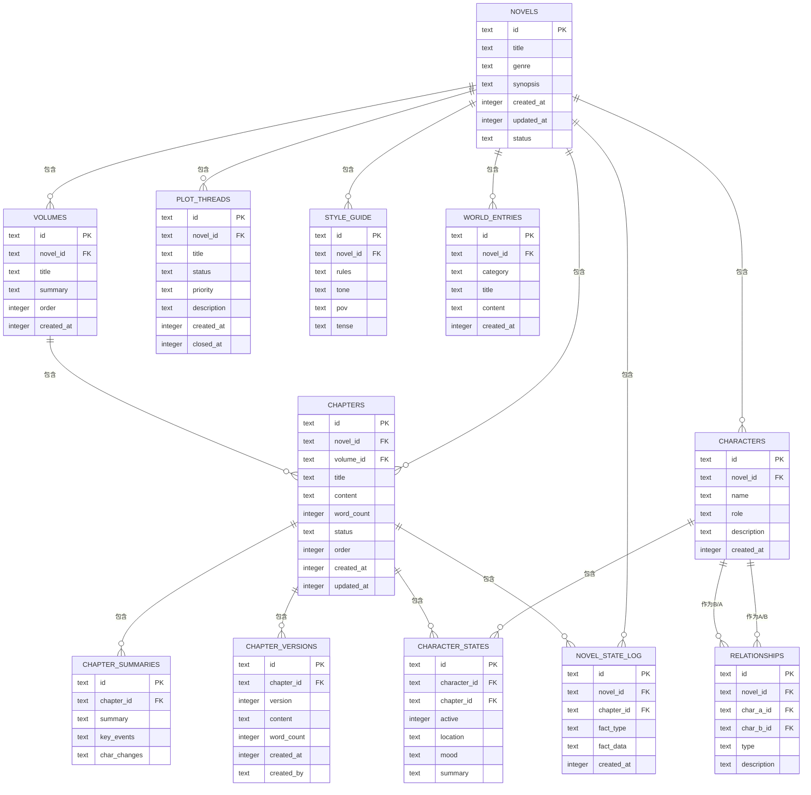
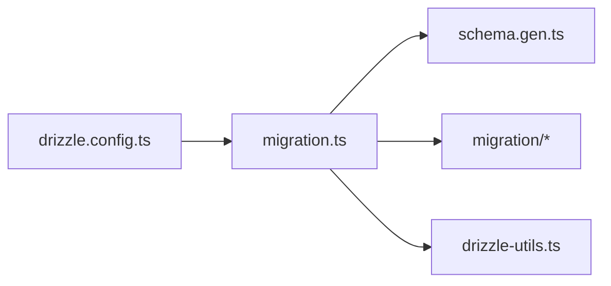
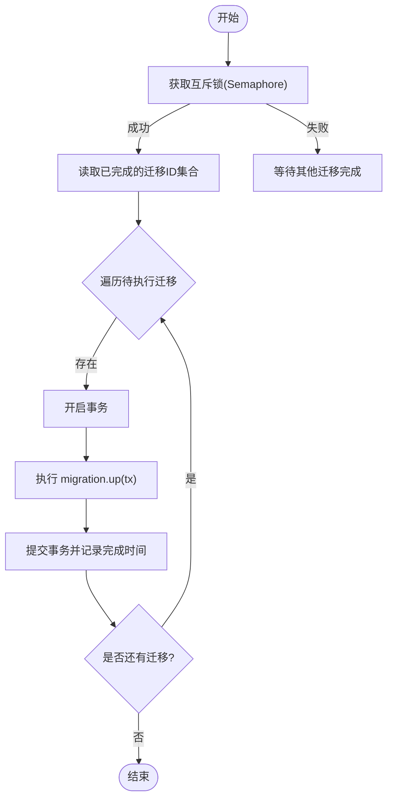

# 小说数据存储层

<cite>
**本文引用的文件**
- [packages/core/src/database/schema.gen.ts](file://packages/core/src/database/schema.gen.ts)
- [packages/core/src/database/migration.ts](file://packages/core/src/database/migration.ts)
- [packages/core/src/database/migration/20260721152252_novel_writing_tables.ts](file://packages/core/src/database/migration/20260721152252_novel_writing_tables.ts)
- [packages/core/drizzle.config.ts](file://packages/core/drizzle.config.ts)
- [packages/effect-drizzle-sqlite/src/internal/drizzle-utils.ts](file://packages/effect-drizzle-sqlite/src/internal/drizzle-utils.ts)
- [packages/core/src/database/schema.sql.ts](file://packages/core/src/database/schema.sql.ts)
</cite>

## 目录
1. [简介](#简介)
2. [项目结构](#项目结构)
3. [核心组件](#核心组件)
4. [架构总览](#架构总览)
5. [详细组件分析](#详细组件分析)
6. [依赖关系分析](#依赖关系分析)
7. [性能与索引优化](#性能与索引优化)
8. [事务与并发控制](#事务与并发控制)
9. [数据迁移与版本管理](#数据迁移与版本管理)
10. [缓存策略与查询模式](#缓存策略与查询模式)
11. [备份恢复与安全](#备份恢复与安全)
12. [故障排查指南](#故障排查指南)
13. [结论](#结论)

## 简介
本文件为“小说数据存储层”的权威技术文档，面向开发者与运维人员，系统性说明数据库表结构设计、实体关系映射、数据验证规则、Drizzle ORM 使用模式、查询构建器与事务机制、迁移策略与回滚方案、缓存与索引优化、查询性能调优、备份恢复、并发控制与数据安全保护措施，并总结常用查询模式与批量操作最佳实践。

## 项目结构
小说数据存储相关代码集中在 core 包的 database 目录以及 effect-drizzle-sqlite 工具包中：
- schema.gen.ts：集中生成型 SQL 建表与索引脚本（一次性初始化或全量重建）
- migration.ts：迁移执行引擎，负责迁移发现、去重、事务化执行与日志记录
- migration/*：按时间戳命名的增量迁移脚本，描述具体表结构与索引变更
- drizzle.config.ts：Drizzle Kit 配置，声明方言、schema 扫描路径与输出目录
- schema.sql.ts：通用字段模板（如时间戳）
- drizzle-utils.ts：Effect + Drizzle 的运行时辅助（结果映射、更新集映射、列名解析等）

图表来源
- [packages/core/drizzle.config.ts:1-11](file://packages/core/drizzle.config.ts#L1-L11)
- [packages/core/src/database/schema.gen.ts:1-487](file://packages/core/src/database/schema.gen.ts#L1-L487)
- [packages/core/src/database/migration.ts:1-82](file://packages/core/src/database/migration.ts#L1-L82)
- [packages/core/src/database/schema.sql.ts:1-11](file://packages/core/src/database/schema.sql.ts#L1-L11)
- [packages/effect-drizzle-sqlite/src/internal/drizzle-utils.ts:1-128](file://packages/effect-drizzle-sqlite/src/internal/drizzle-utils.ts#L1-L128)

章节来源
- [packages/core/drizzle.config.ts:1-11](file://packages/core/drizzle.config.ts#L1-L11)
- [packages/core/src/database/schema.gen.ts:1-487](file://packages/core/src/database/schema.gen.ts#L1-L487)
- [packages/core/src/database/migration.ts:1-82](file://packages/core/src/database/migration.ts#L1-L82)
- [packages/core/src/database/schema.sql.ts:1-11](file://packages/core/src/database/schema.sql.ts#L1-L11)
- [packages/effect-drizzle-sqlite/src/internal/drizzle-utils.ts:1-128](file://packages/effect-drizzle-sqlite/src/internal/drizzle-utils.ts#L1-L128)

## 核心组件
- 迁移执行引擎（apply / applyOnly）：负责检测数据库状态、初始化迁移日志表、增量应用迁移、兼容旧版 Drizzle 迁移日志
- 全量 Schema 生成器（schema.up）：一次性创建所有表与索引，用于首次初始化或重建
- Drizzle Kit 配置：定义 SQLite 方言、Schema 扫描路径、输出目录与连接信息
- 运行时辅助：统一结果映射、更新集映射、列名解析，保障 Effect 与 Drizzle 协同工作

章节来源
- [packages/core/src/database/migration.ts:1-82](file://packages/core/src/database/migration.ts#L1-L82)
- [packages/core/src/database/schema.gen.ts:1-487](file://packages/core/src/database/schema.gen.ts#L1-L487)
- [packages/core/drizzle.config.ts:1-11](file://packages/core/drizzle.config.ts#L1-L11)
- [packages/effect-drizzle-sqlite/src/internal/drizzle-utils.ts:1-128](file://packages/effect-drizzle-sqlite/src/internal/drizzle-utils.ts#L1-L128)

## 架构总览
整体采用“迁移优先 + 全量 Schema 兜底”的双轨设计：
- 首次启动时，若数据库为空且无 session 表，则执行 schema.up 完成全量建表与索引，并写入迁移日志
- 后续启动通过 applyOnly 对比已完成的迁移 ID，仅执行未应用的增量迁移
- 所有 DDL/DML 均包裹在事务中，确保一致性
- 使用 Effect 并发原语（Semaphore）保证迁移串行执行，避免竞态

图表来源
- [packages/core/src/database/migration.ts:18-41](file://packages/core/src/database/migration.ts#L18-L41)
- [packages/core/src/database/migration.ts:43-81](file://packages/core/src/database/migration.ts#L43-L81)
- [packages/core/src/database/schema.gen.ts:4-486](file://packages/core/src/database/schema.gen.ts#L4-L486)

## 详细组件分析

### 数据库表结构与实体关系
小说域的核心实体包括：novels、volumes、chapters、chapter_summaries、chapter_versions、characters、character_states、relationships、foreshadowing、plot_threads、style_guide、world_entries、novel_state_log 等。它们通过外键形成清晰的层级与关联关系。

图表来源
- [packages/core/src/database/schema.gen.ts:128-406](file://packages/core/src/database/schema.gen.ts#L128-L406)

章节来源
- [packages/core/src/database/schema.gen.ts:128-406](file://packages/core/src/database/schema.gen.ts#L128-L406)

### Drizzle ORM 使用模式与查询构建器
- 方言与 Schema 扫描：通过 drizzle.config.ts 指定 sqlite 方言与 schema 扫描路径
- 运行时辅助：drizzle-utils.ts 提供 mapResultRow、mapUpdateSet、getTableLikeName 等工具，统一列名解析与结果映射
- 时间戳模板：schema.sql.ts 提供 time_created/time_updated 默认值与更新钩子，便于统一审计字段

章节来源
- [packages/core/drizzle.config.ts:1-11](file://packages/core/drizzle.config.ts#L1-L11)
- [packages/effect-drizzle-sqlite/src/internal/drizzle-utils.ts:52-125](file://packages/effect-drizzle-sqlite/src/internal/drizzle-utils.ts#L52-L125)
- [packages/core/src/database/schema.sql.ts:1-11](file://packages/core/src/database/schema.sql.ts#L1-L11)

### 事务管理机制
- 迁移执行全部包裹在 db.transaction 中，失败自动回滚
- 应用级并发控制：使用 Semaphore(1) 保证迁移串行执行，避免多进程竞争
- 兼容旧版迁移日志：当检测到 __drizzle_migrations 表时，将历史迁移 ID 同步到新迁移日志表

章节来源
- [packages/core/src/database/migration.ts:1-82](file://packages/core/src/database/migration.ts#L1-L82)

## 依赖关系分析
- 迁移引擎依赖：
  - schema.gen.ts：提供全量建表脚本
  - migration/*：提供增量迁移脚本
  - drizzle-utils.ts：提供运行时辅助
- 配置依赖：
  - drizzle.config.ts：驱动方言与 schema 扫描
- 运行时依赖：
  - Effect 并发原语（Semaphore）
  - Drizzle ORM（SQL 构建与事务）

图表来源
- [packages/core/src/database/migration.ts:1-82](file://packages/core/src/database/migration.ts#L1-L82)
- [packages/core/src/database/schema.gen.ts:1-487](file://packages/core/src/database/schema.gen.ts#L1-L487)
- [packages/core/drizzle.config.ts:1-11](file://packages/core/drizzle.config.ts#L1-L11)
- [packages/effect-drizzle-sqlite/src/internal/drizzle-utils.ts:1-128](file://packages/effect-drizzle-sqlite/src/internal/drizzle-utils.ts#L1-L128)

章节来源
- [packages/core/src/database/migration.ts:1-82](file://packages/core/src/database/migration.ts#L1-L82)
- [packages/core/src/database/schema.gen.ts:1-487](file://packages/core/src/database/schema.gen.ts#L1-L487)
- [packages/core/drizzle.config.ts:1-11](file://packages/core/drizzle.config.ts#L1-L11)
- [packages/effect-drizzle-sqlite/src/internal/drizzle-utils.ts:1-128](file://packages/effect-drizzle-sqlite/src/internal/drizzle-utils.ts#L1-L128)

## 性能与索引优化
针对高频查询场景，已在 schema 中建立复合索引与单列索引，覆盖常见过滤与排序维度：
- 章节与卷：novel_id、volume_id、order 组合索引，支持按小说与顺序分页
- 角色与关系：novel_id、char_a_id、char_b_id 索引，支持角色检索与关系查询
- 伏笔与剧情线：novel_id、state/status 索引，支持按状态筛选
- 会话消息与输入：session_id、time_created、seq 等索引，支持时序与类型过滤
- 世界条目：novel_id、category 复合索引，支持分类检索

建议：
- 对大文本字段（content、summary、rules 等）避免 SELECT *，按需投影
- 对高基数字符串字段（title、name、type）可考虑前缀索引或全文索引（视引擎能力）
- 监控慢查询，结合 EXPLAIN 调整索引覆盖

章节来源
- [packages/core/src/database/schema.gen.ts:419-483](file://packages/core/src/database/schema.gen.ts#L419-L483)

## 事务与并发控制
- 迁移串行化：通过 Semaphore(1) 限制同时只有一个迁移任务运行
- 事务边界：每个迁移 up(tx) 内部的所有 DDL/DML 在一个事务内提交
- 幂等性：迁移 ID 唯一，重复执行会跳过已完成项
- 兼容性：自动识别并迁移旧版 Drizzle 迁移日志，避免重复执行

图表来源
- [packages/core/src/database/migration.ts:18-41](file://packages/core/src/database/migration.ts#L18-L41)
- [packages/core/src/database/migration.ts:43-81](file://packages/core/src/database/migration.ts#L43-L81)

章节来源
- [packages/core/src/database/migration.ts:1-82](file://packages/core/src/database/migration.ts#L1-L82)

## 数据迁移与版本管理
- 版本标识：每个迁移脚本以时间戳命名（如 20260721152252_novel_writing_tables.ts），并在脚本内声明 id
- 执行策略：
  - 首次初始化：执行 schema.up 创建所有表与索引，随后写入初始迁移记录
  - 增量升级：compare 已完成的迁移 ID，仅执行未应用的迁移
- 回滚方案：
  - 当前设计未提供 down 方法；如需回滚，应编写反向迁移脚本并纳入版本序列
  - 建议在测试环境先行验证，生产环境谨慎执行
- 兼容处理：自动从 __drizzle_migrations 迁移到新的 migration 日志表，避免重复执行

章节来源
- [packages/core/src/database/migration.ts:1-82](file://packages/core/src/database/migration.ts#L1-L82)
- [packages/core/src/database/migration/20260721152252_novel_writing_tables.ts:1-191](file://packages/core/src/database/migration/20260721152252_novel_writing_tables.ts#L1-L191)
- [packages/core/src/database/schema.gen.ts:4-486](file://packages/core/src/database/schema.gen.ts#L4-L486)

## 缓存策略与查询模式
- 应用层缓存：
  - 热点数据（如小说元数据、风格指南、世界条目）可在内存或 Redis 中缓存，设置合理过期策略
  - 写后失效：对频繁更新的章节内容、角色状态等，建议在写入成功后主动失效对应缓存
- 查询模式：
  - 分页：基于 order 与 limit/offset 或游标分页（seq 或 created_at）
  - 聚合：统计字数、章节数、角色出场次数等，尽量利用索引字段
  - 关联：避免 N+1 查询，使用 JOIN 或分批加载
- 批量操作：
  - 批量插入/更新：合并多次小事务为大事务，减少 IO 开销
  - UPSERT：根据业务主键或唯一约束实现幂等写入

[本节为概念性指导，不直接分析具体文件]

## 备份恢复与安全
- 备份策略：
  - 定期快照 SQLite 文件（冷备）或使用 WAL 模式在线热备
  - 增量备份：结合迁移日志与事件日志（如有）实现时间点恢复
- 恢复流程：
  - 停止服务 -> 还原备份 -> 校验完整性 -> 重新应用迁移 -> 启动服务
- 安全保护：
  - 敏感字段（token、secret）加密存储或交由密钥管理服务
  - 最小权限原则：数据库用户仅授予必要权限
  - 传输加密：API 与服务间通信启用 TLS
  - 审计：记录关键数据变更与访问日志

[本节为通用指导，不直接分析具体文件]

## 故障排查指南
- 迁移冲突：
  - 现象：重复执行迁移或迁移 ID 不一致导致失败
  - 排查：检查 migration 日志表中的已执行 ID，确认迁移脚本 id 与文件名一致
- 索引缺失：
  - 现象：查询变慢
  - 排查：核对 schema.gen.ts 中的索引定义，必要时补充复合索引
- 结果映射异常：
  - 现象：JOIN 结果字段为空或类型错误
  - 排查：使用 drizzle-utils.ts 的 mapResultRow 与列名解析逻辑，确认字段路径与 nullability
- 事务回滚：
  - 现象：部分写入成功但整体失败
  - 排查：确认事务边界与异常捕获，确保失败时回滚

章节来源
- [packages/core/src/database/migration.ts:1-82](file://packages/core/src/database/migration.ts#L1-L82)
- [packages/core/src/database/schema.gen.ts:419-483](file://packages/core/src/database/schema.gen.ts#L419-L483)
- [packages/effect-drizzle-sqlite/src/internal/drizzle-utils.ts:64-114](file://packages/effect-drizzle-sqlite/src/internal/drizzle-utils.ts#L64-L114)

## 结论
本小说数据存储层以 Drizzle ORM 为核心，结合 Effect 并发原语与迁移引擎，实现了稳定可靠的数据库初始化与增量升级。通过完善的索引设计与事务化迁移，保障了数据一致性与查询性能。建议在生产环境中配合备份、缓存与监控体系，持续优化查询与扩展性。