# AI 集成框架

<cite>
**本文引用的文件**   
- [packages/core/src/aisdk.ts](file://packages/core/src/aisdk.ts)
- [packages/core/src/model.ts](file://packages/core/src/model.ts)
- [packages/core/src/provider.ts](file://packages/core/src/provider.ts)
- [packages/core/src/util/retry.ts](file://packages/core/src/util/retry.ts)
- [packages/core/src/session/compaction.ts](file://packages/core/src/session/compaction.ts)
- [packages/core/src/models-dev.ts](file://packages/core/src/models-dev.ts)
- [packages/core/src/plugin/provider/google-vertex.ts](file://packages/core/src/plugin/provider/google-vertex.ts)
- [packages/console/app/src/routes/zen/util/handler.ts](file://packages/console/app/src/routes/zen/util/handler.ts)
- [packages/opencode/test/acp/usage.test.ts](file://packages/opencode/test/acp/usage.test.ts)
- [packages/tui/src/feature-plugins/sidebar/context.tsx](file://packages/tui/src/feature-plugins/sidebar/context.tsx)
- [packages/core/test/plugin/provider-groq.test.ts](file://packages/core/test/plugin/provider-groq.test.ts)
- [packages/core/test/plugin/provider-perplexity.test.ts](file://packages/core/test/plugin/provider-perplexity.test.ts)
- [packages/core/test/plugin/provider-google-vertex-anthropic.test.ts](file://packages/core/test/plugin/provider-google-vertex-anthropic.test.ts)
- [packages/opencode/test/session/retry.test.ts](file://packages/opencode/test/session/retry.test.ts)
- [packages/llm/DESIGN.md](file://packages/llm/DESIGN.md)
</cite>

## 目录
1. [简介](#简介)
2. [项目结构](#项目结构)
3. [核心组件](#核心组件)
4. [架构总览](#架构总览)
5. [详细组件分析](#详细组件分析)
6. [依赖关系分析](#依赖关系分析)
7. [性能考量](#性能考量)
8. [故障排查指南](#故障排查指南)
9. [结论](#结论)
10. [附录](#附录)

## 简介
本技术文档面向“统一 AI 接口”的抽象设计与实现，覆盖模型调用、流式响应处理与错误处理的标准化方案；解释多提供商适配机制（OpenAI、Anthropic、Google Vertex Anthropic 等）的插件化架构；并文档化故障转移策略、负载均衡与请求限流机制。同时提供提示词模板管理、上下文窗口优化与成本控制的实现思路，以及新 AI 提供商集成的开发指南与测试方法。

## 项目结构
本项目采用多包（monorepo）组织，AI 相关能力集中在 core、console、opencode、tui、llm 等包中：
- core：统一的 AISDK 服务、模型与提供商类型定义、重试工具、会话压缩与成本元数据等
- console：控制台侧的请求组装、认证与配额校验、格式适配（anthropic/google/openai/兼容）
- opencode：使用方示例与测试（含用量统计、重试判定）
- tui：终端 UI 侧的成本与上下文窗口百分比展示
- llm：下一代 LLM 库设计草案（概念性指导）

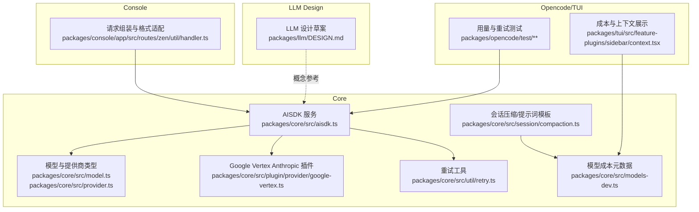

**图表来源** 
- [packages/core/src/aisdk.ts](file://packages/core/src/aisdk.ts)
- [packages/core/src/model.ts](file://packages/core/src/model.ts)
- [packages/core/src/provider.ts](file://packages/core/src/provider.ts)
- [packages/core/src/util/retry.ts](file://packages/core/src/util/retry.ts)
- [packages/core/src/session/compaction.ts](file://packages/core/src/session/compaction.ts)
- [packages/core/src/models-dev.ts](file://packages/core/src/models-dev.ts)
- [packages/core/src/plugin/provider/google-vertex.ts](file://packages/core/src/plugin/provider/google-vertex.ts)
- [packages/console/app/src/routes/zen/util/handler.ts](file://packages/console/app/src/routes/zen/util/handler.ts)
- [packages/opencode/test/acp/usage.test.ts](file://packages/opencode/test/acp/usage.test.ts)
- [packages/tui/src/feature-plugins/sidebar/context.tsx](file://packages/tui/src/feature-plugins/sidebar/context.tsx)
- [packages/llm/DESIGN.md](file://packages/llm/DESIGN.md)

**章节来源**
- [packages/core/src/aisdk.ts](file://packages/core/src/aisdk.ts)
- [packages/core/src/model.ts](file://packages/core/src/model.ts)
- [packages/core/src/provider.ts](file://packages/core/src/provider.ts)
- [packages/core/src/util/retry.ts](file://packages/core/src/util/retry.ts)
- [packages/core/src/session/compaction.ts](file://packages/core/src/session/compaction.ts)
- [packages/core/src/models-dev.ts](file://packages/core/src/models-dev.ts)
- [packages/core/src/plugin/provider/google-vertex.ts](file://packages/core/src/plugin/provider/google-vertex.ts)
- [packages/console/app/src/routes/zen/util/handler.ts](file://packages/console/app/src/routes/zen/util/handler.ts)
- [packages/opencode/test/acp/usage.test.ts](file://packages/opencode/test/acp/usage.test.ts)
- [packages/tui/src/feature-plugins/sidebar/context.tsx](file://packages/tui/src/feature-plugins/sidebar/context.tsx)
- [packages/llm/DESIGN.md](file://packages/llm/DESIGN.md)

## 核心组件
- AISDK 服务：提供 SDK 初始化钩子、语言模型选择钩子、缓存与超时控制、SSE 分块超时封装、统一语言模型获取入口
- 模型与提供商类型：统一描述 Provider/Model/Api/Info/Cost/Capabilities 等元数据
- 重试工具：通用指数退避重试，支持自定义判断条件
- 会话压缩与提示词模板：构建摘要提示词，用于长对话上下文压缩
- 模型成本元数据：结构化成本字段（输入/输出/缓存读写/分层定价）
- Google Vertex Anthropic 插件：按 providerID 匹配并注入 SDK 与语言模型选择逻辑

**章节来源**
- [packages/core/src/aisdk.ts](file://packages/core/src/aisdk.ts)
- [packages/core/src/model.ts](file://packages/core/src/model.ts)
- [packages/core/src/provider.ts](file://packages/core/src/provider.ts)
- [packages/core/src/util/retry.ts](file://packages/core/src/util/retry.ts)
- [packages/core/src/session/compaction.ts](file://packages/core/src/session/compaction.ts)
- [packages/core/src/models-dev.ts](file://packages/core/src/models-dev.ts)
- [packages/core/src/plugin/provider/google-vertex.ts](file://packages/core/src/plugin/provider/google-vertex.ts)

## 架构总览
统一 AI 接口通过 AISDK 服务作为中枢，向上暴露 language(model) 获取 LanguageModelV3 的能力；向下通过插件钩子完成 SDK 实例化与语言模型选择。控制台层负责将不同提供商的格式（anthropic/google/openai/兼容）转换为统一请求体，并在认证与配额层面进行前置校验。

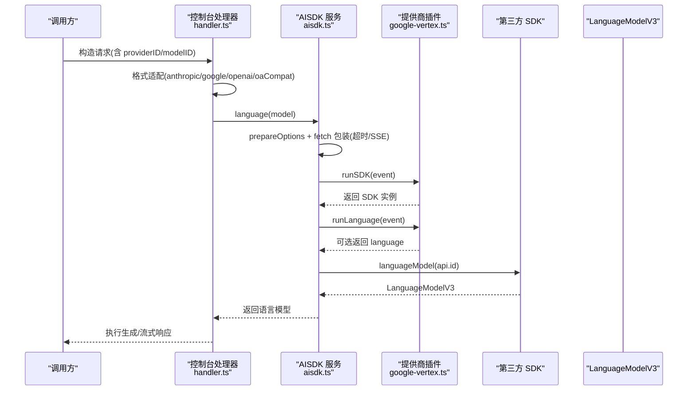

**图表来源** 
- [packages/console/app/src/routes/zen/util/handler.ts](file://packages/console/app/src/routes/zen/util/handler.ts)
- [packages/core/src/aisdk.ts](file://packages/core/src/aisdk.ts)
- [packages/core/src/plugin/provider/google-vertex.ts](file://packages/core/src/plugin/provider/google-vertex.ts)

**章节来源**
- [packages/console/app/src/routes/zen/util/handler.ts](file://packages/console/app/src/routes/zen/util/handler.ts)
- [packages/core/src/aisdk.ts](file://packages/core/src/aisdk.ts)
- [packages/core/src/plugin/provider/google-vertex.ts](file://packages/core/src/plugin/provider/google-vertex.ts)

## 详细组件分析

### AISDK 服务与统一语言模型获取
- 功能要点
  - 通过 hook.sdk 与 hook.language 扩展点，允许插件在 SDK 初始化与语言模型选择阶段介入
  - 对 fetch 进行包装，合并多种 AbortSignal（chunkTimeout、timeout），并对 SSE 响应增加分块超时保护
  - 针对特定包（如 OpenAI/Azure/Bedrock Mantle）对请求体做兼容性处理（例如移除 id 字段）
  - 以 key 缓存 SDK 与 LanguageModelV3 实例，避免重复创建
- 错误处理
  - 统一抛出 InitError，携带 providerID 与 cause，便于上层定位问题

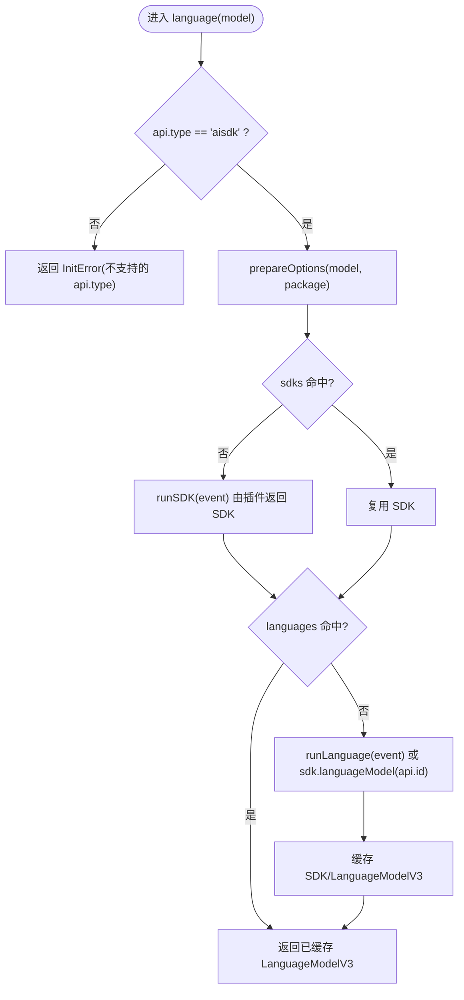

**图表来源** 
- [packages/core/src/aisdk.ts](file://packages/core/src/aisdk.ts)

**章节来源**
- [packages/core/src/aisdk.ts](file://packages/core/src/aisdk.ts)

### 提供商插件与多提供商适配
- Google Vertex Anthropic 插件
  - 根据 providerID 匹配 google-vertex-anthropic，动态设置 project/location/baseURL
  - 在 runLanguage 钩子中为指定 provider 选择语言模型（trim model ID）
- 其他提供商默认行为
  - Groq/Perplexity 等未实现自定义语言选择的插件时，回退到 sdk.languageModel(api.id)
- 控制台格式适配
  - 根据 format 选择 anthropic/google/openai/oaCompat 助手函数，统一请求体结构

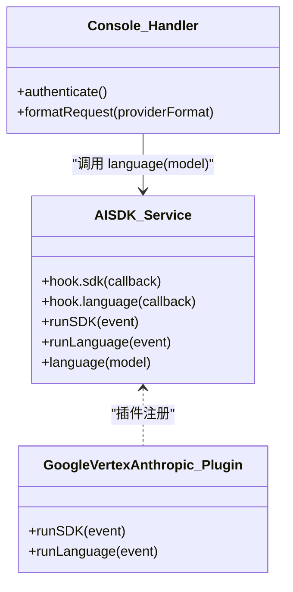

**图表来源** 
- [packages/core/src/aisdk.ts](file://packages/core/src/aisdk.ts)
- [packages/core/src/plugin/provider/google-vertex.ts](file://packages/core/src/plugin/provider/google-vertex.ts)
- [packages/console/app/src/routes/zen/util/handler.ts](file://packages/console/app/src/routes/zen/util/handler.ts)

**章节来源**
- [packages/core/src/plugin/provider/google-vertex.ts](file://packages/core/src/plugin/provider/google-vertex.ts)
- [packages/console/app/src/routes/zen/util/handler.ts](file://packages/console/app/src/routes/zen/util/handler.ts)
- [packages/core/test/plugin/provider-groq.test.ts](file://packages/core/test/plugin/provider-groq.test.ts)
- [packages/core/test/plugin/provider-perplexity.test.ts](file://packages/core/test/plugin/provider-perplexity.test.ts)
- [packages/core/test/plugin/provider-google-vertex-anthropic.test.ts](file://packages/core/test/plugin/provider-google-vertex-anthropic.test.ts)

### 流式响应与超时控制
- 分块超时（chunkTimeout）
  - 当 chunkTimeout > 0 且响应为 text/event-stream 时，包装 ReadableStream，若读取超时则触发 AbortController 取消
- 整体超时（timeout）
  - 通过 AbortSignal.timeout(options.timeout) 与用户提供的 signal 合并，确保请求级超时
- 兼容性处理
  - 对部分包的请求体进行清理（如删除 id 字段），保证与上游协议一致

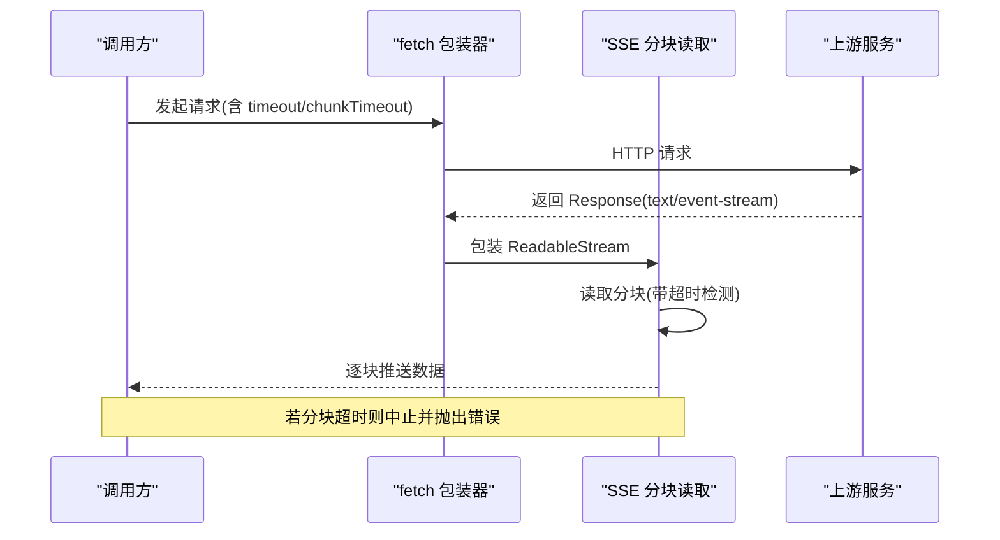

**图表来源** 
- [packages/core/src/aisdk.ts](file://packages/core/src/aisdk.ts)

**章节来源**
- [packages/core/src/aisdk.ts](file://packages/core/src/aisdk.ts)

### 错误处理与重试策略
- 通用重试（retry.ts）
  - 指数退避，默认尝试次数、延迟倍数、最大延迟可配置
  - 支持自定义 retryIf 判断（默认匹配常见网络/连接类错误消息）
- 会话重试（session retry test）
  - 针对 5xx、429、ZlibError 等场景的可重试判定
  - 文本型速率限制错误也能被识别并重试
- 控制台限流与配额
  - 基于订阅计划与固定用量检查，达到限额后抛出限流错误并附带重试时间

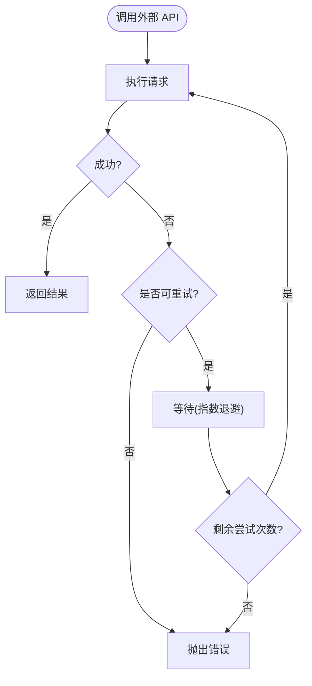

**图表来源** 
- [packages/core/src/util/retry.ts](file://packages/core/src/util/retry.ts)
- [packages/opencode/test/session/retry.test.ts](file://packages/opencode/test/session/retry.test.ts)
- [packages/console/app/src/routes/zen/util/handler.ts](file://packages/console/app/src/routes/zen/util/handler.ts)

**章节来源**
- [packages/core/src/util/retry.ts](file://packages/core/src/util/retry.ts)
- [packages/opencode/test/session/retry.test.ts](file://packages/opencode/test/session/retry.test.ts)
- [packages/console/app/src/routes/zen/util/handler.ts](file://packages/console/app/src/routes/zen/util/handler.ts)

### 提示词模板管理与上下文窗口优化
- 提示词模板
  - 构建锚定摘要提示词，支持更新已有摘要或从头生成
- 上下文窗口优化
  - 通过压缩历史对话生成摘要，减少上下文长度，降低 Token 消耗
  - TUI 侧计算当前消息的 Token 占比（input/output/reasoning/cache read/write），显示相对于模型上下文窗口的百分比

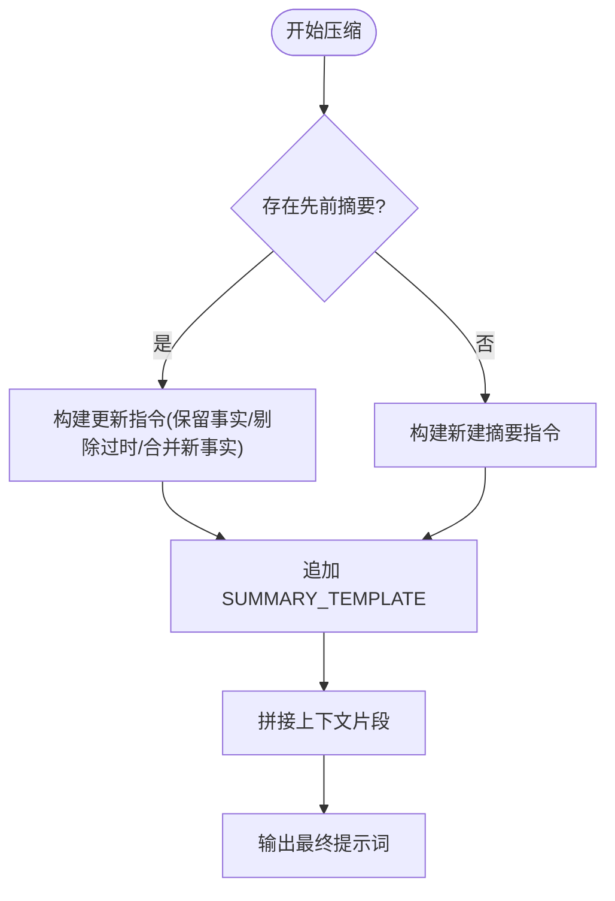

**图表来源** 
- [packages/core/src/session/compaction.ts](file://packages/core/src/session/compaction.ts)
- [packages/tui/src/feature-plugins/sidebar/context.tsx](file://packages/tui/src/feature-plugins/sidebar/context.tsx)

**章节来源**
- [packages/core/src/session/compaction.ts](file://packages/core/src/session/compaction.ts)
- [packages/tui/src/feature-plugins/sidebar/context.tsx](file://packages/tui/src/feature-plugins/sidebar/context.tsx)

### 成本控制与用量统计
- 模型成本元数据
  - 结构化字段包括 input/output/cache_read/cache_write 及分层定价 context_over_200k
- 用量统计
  - 测试用例中构造 Provider.Info/Model，包含 cost 与 limit.context 等字段，供上层统计与展示
- 控制台计费校验
  - 结合订阅计划与固定用量，超限后抛出限流错误并格式化重试时间

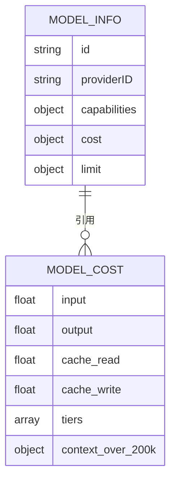

**图表来源** 
- [packages/core/src/models-dev.ts](file://packages/core/src/models-dev.ts)
- [packages/opencode/test/acp/usage.test.ts](file://packages/opencode/test/acp/usage.test.ts)

**章节来源**
- [packages/core/src/models-dev.ts](file://packages/core/src/models-dev.ts)
- [packages/opencode/test/acp/usage.test.ts](file://packages/opencode/test/acp/usage.test.ts)
- [packages/console/app/src/routes/zen/util/handler.ts](file://packages/console/app/src/routes/zen/util/handler.ts)

### 新 AI 提供商集成指南
- 步骤概览
  1. 在插件中实现 runSDK(event)：根据 model.providerID 与 options 初始化第三方 SDK
  2. 可选实现 runLanguage(event)：为特定 provider 定制语言模型选择逻辑（如 trim model ID）
  3. 确保 prepareOptions 生成的 baseURL/settings/fetch 等参数正确传递
  4. 编写测试用例验证默认语言模型回退与插件选择路径
- 参考实现
  - Google Vertex Anthropic 插件展示了如何按 providerID 匹配并注入 SDK 与语言模型选择
  - Groq/Perplexity 测试展示了未实现自定义语言选择时的默认回退行为

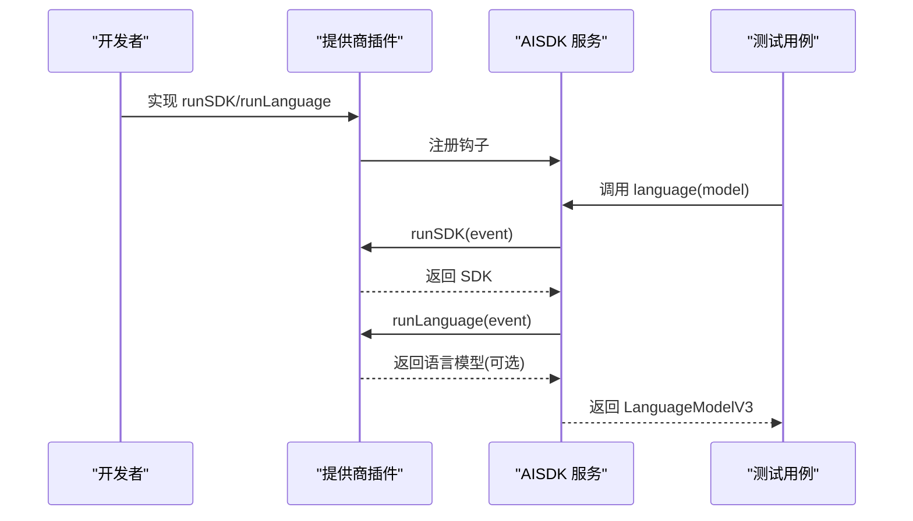

**图表来源** 
- [packages/core/src/plugin/provider/google-vertex.ts](file://packages/core/src/plugin/provider/google-vertex.ts)
- [packages/core/test/plugin/provider-groq.test.ts](file://packages/core/test/plugin/provider-groq.test.ts)
- [packages/core/test/plugin/provider-perplexity.test.ts](file://packages/core/test/plugin/provider-perplexity.test.ts)
- [packages/core/test/plugin/provider-google-vertex-anthropic.test.ts](file://packages/core/test/plugin/provider-google-vertex-anthropic.test.ts)

**章节来源**
- [packages/core/src/plugin/provider/google-vertex.ts](file://packages/core/src/plugin/provider/google-vertex.ts)
- [packages/core/test/plugin/provider-groq.test.ts](file://packages/core/test/plugin/provider-groq.test.ts)
- [packages/core/test/plugin/provider-perplexity.test.ts](file://packages/core/test/plugin/provider-perplexity.test.ts)
- [packages/core/test/plugin/provider-google-vertex-anthropic.test.ts](file://packages/core/test/plugin/provider-google-vertex-anthropic.test.ts)

### 概念性总览（下一代 LLM 库设计）
- 目标与原则
  - 简化模型调用、强默认值、可扩展钩子、Provider 边界隔离、Effect 原生
- 关键概念
  - Provider Definition、Configured Provider、Model、Request、Turn、Run、Protocol、Hooks
- 流式与结构化输出
  - stream/streamTurn 事件模型、output 选项驱动的结构化输出策略

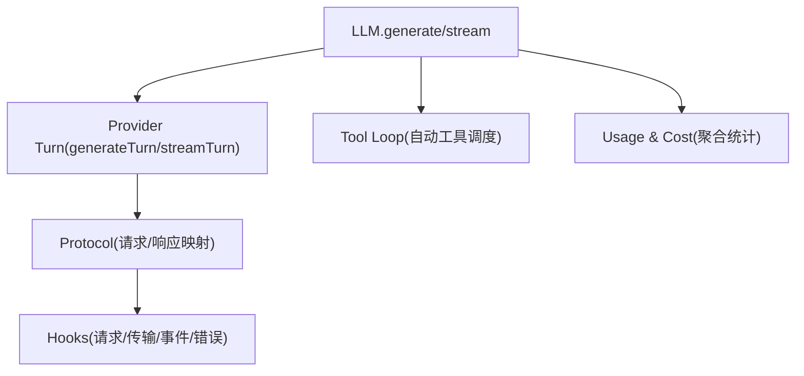

**图表来源** 
- [packages/llm/DESIGN.md](file://packages/llm/DESIGN.md)

**章节来源**
- [packages/llm/DESIGN.md](file://packages/llm/DESIGN.md)

## 依赖关系分析
- AISDK 服务依赖 Effect（Context/Layer/Scope）、Schema、AbortSignal 等
- 提供商插件通过 AISDK 钩子接入，不直接耦合上层调用方
- 控制台层依赖 AISDK 服务与提供商格式适配器
- 测试用例验证默认回退与插件选择路径

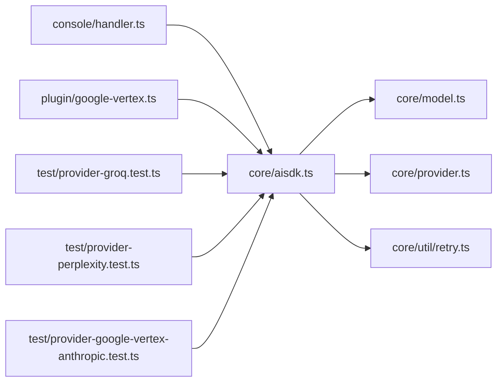

**图表来源** 
- [packages/core/src/aisdk.ts](file://packages/core/src/aisdk.ts)
- [packages/core/src/model.ts](file://packages/core/src/model.ts)
- [packages/core/src/provider.ts](file://packages/core/src/provider.ts)
- [packages/core/src/util/retry.ts](file://packages/core/src/util/retry.ts)
- [packages/console/app/src/routes/zen/util/handler.ts](file://packages/console/app/src/routes/zen/util/handler.ts)
- [packages/core/src/plugin/provider/google-vertex.ts](file://packages/core/src/plugin/provider/google-vertex.ts)
- [packages/core/test/plugin/provider-groq.test.ts](file://packages/core/test/plugin/provider-groq.test.ts)
- [packages/core/test/plugin/provider-perplexity.test.ts](file://packages/core/test/plugin/provider-perplexity.test.ts)
- [packages/core/test/plugin/provider-google-vertex-anthropic.test.ts](file://packages/core/test/plugin/provider-google-vertex-anthropic.test.ts)

**章节来源**
- [packages/core/src/aisdk.ts](file://packages/core/src/aisdk.ts)
- [packages/core/src/model.ts](file://packages/core/src/model.ts)
- [packages/core/src/provider.ts](file://packages/core/src/provider.ts)
- [packages/core/src/util/retry.ts](file://packages/core/src/util/retry.ts)
- [packages/console/app/src/routes/zen/util/handler.ts](file://packages/console/app/src/routes/zen/util/handler.ts)
- [packages/core/src/plugin/provider/google-vertex.ts](file://packages/core/src/plugin/provider/google-vertex.ts)
- [packages/core/test/plugin/provider-groq.test.ts](file://packages/core/test/plugin/provider-groq.test.ts)
- [packages/core/test/plugin/provider-perplexity.test.ts](file://packages/core/test/plugin/provider-perplexity.test.ts)
- [packages/core/test/plugin/provider-google-vertex-anthropic.test.ts](file://packages/core/test/plugin/provider-google-vertex-anthropic.test.ts)

## 性能考量
- 实例缓存
  - SDK 与 LanguageModelV3 按 key 缓存，避免重复初始化与模型选择开销
- 流式分块超时
  - 通过 chunkTimeout 防止长时间无数据导致的资源占用
- 并发与工具调用
  - 下一版 LLM 设计建议独立工具调用并发与有界并发度，提升吞吐
- 上下文压缩
  - 通过摘要压缩减少 Token 消耗，提高响应速度与降低成本

[本节为通用指导，无需具体文件引用]

## 故障排查指南
- 常见问题
  - 未找到 SDK：检查插件是否正确返回 SDK，确认 providerID 与 options 匹配
  - 语言模型为空：检查 runLanguage 钩子是否返回 language，或确认 sdk.languageModel(api.id) 可用
  - 流式响应卡住：检查 chunkTimeout 与上游 SSE 是否正常推送
  - 限流错误：查看控制台订阅与固定用量校验逻辑，确认配额与重试时间
- 调试建议
  - 使用 Effect Scope 与日志钩子观察生命周期
  - 通过测试用例对比默认回退与插件选择路径

**章节来源**
- [packages/core/src/aisdk.ts](file://packages/core/src/aisdk.ts)
- [packages/console/app/src/routes/zen/util/handler.ts](file://packages/console/app/src/routes/zen/util/handler.ts)
- [packages/opencode/test/session/retry.test.ts](file://packages/opencode/test/session/retry.test.ts)

## 结论
本框架通过 AISDK 服务与插件钩子实现了统一 AI 接口的抽象与多提供商适配，结合流式响应与超时控制、错误重试与配额限流、提示词模板与上下文压缩、成本元数据与用量统计，形成完整的 AI 集成解决方案。未来可参考下一代 LLM 设计，进一步简化调用流程、增强结构化输出与工具编排能力。

[本节为总结，无需具体文件引用]

## 附录
- 术语表
  - Provider：AI 服务提供商（如 OpenAI、Anthropic、Google）
  - Model：具体模型实例（如 claude-sonnet、gpt-4o-mini）
  - LanguageModelV3：统一的语言模型接口
  - Turn：单次 Provider 请求与响应
  - Run：完整交互（可能包含多个 Turn）
- 参考实现与测试
  - Google Vertex Anthropic 插件与对应测试
  - Groq/Perplexity 默认回退测试
  - 会话重试与限流测试

[本节为补充信息，无需具体文件引用]