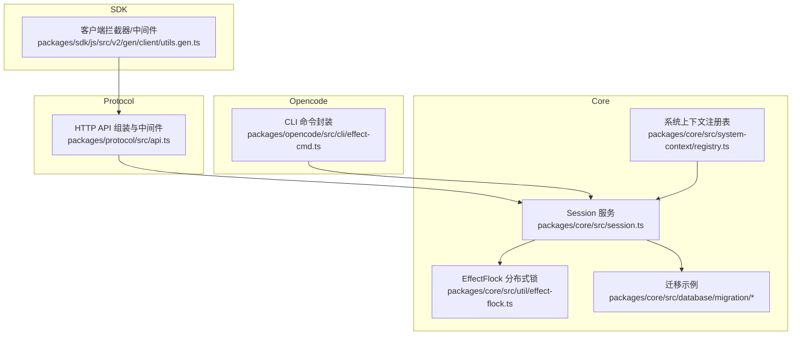
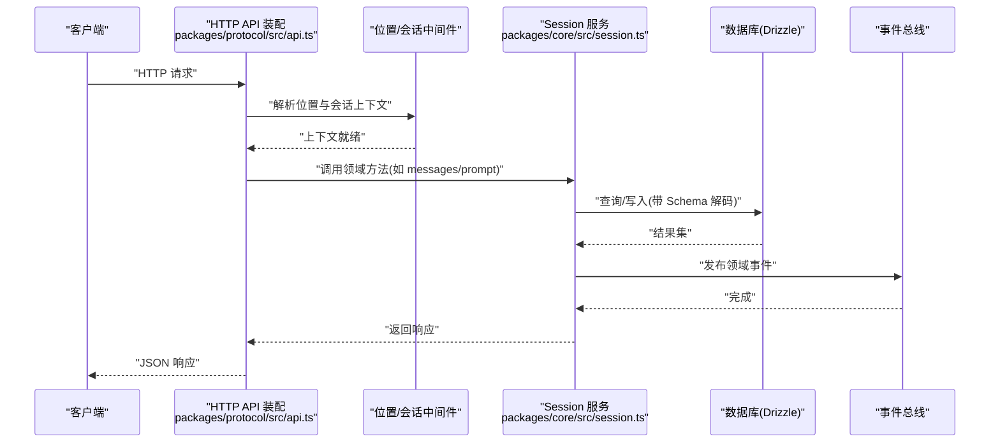
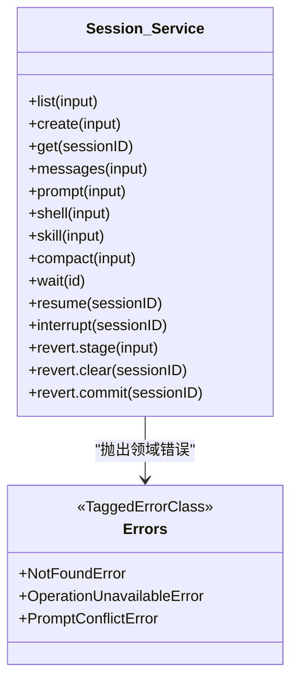
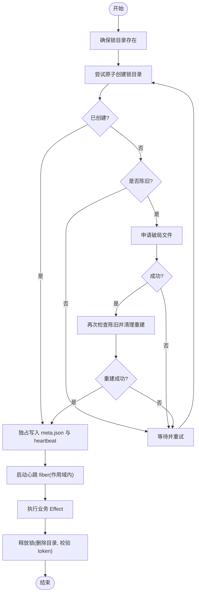
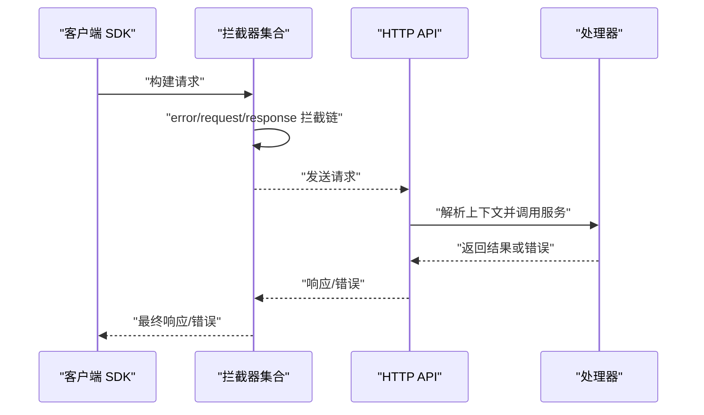
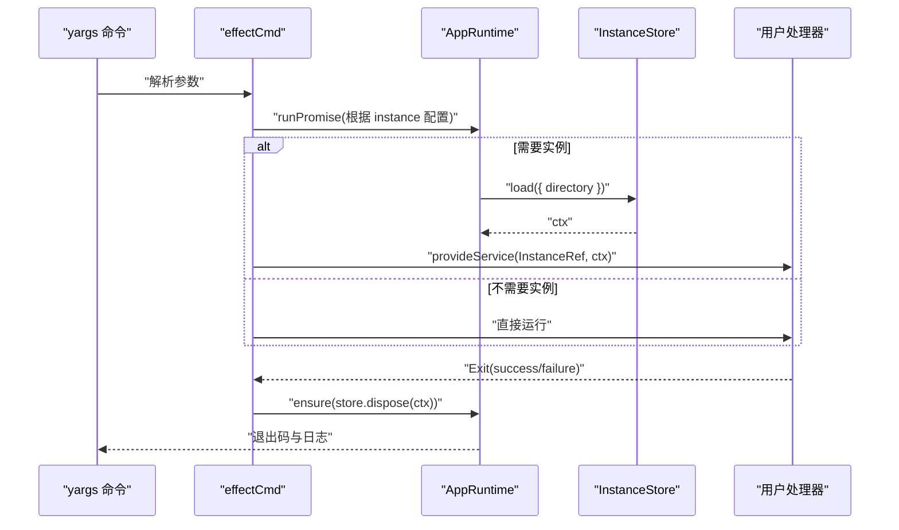
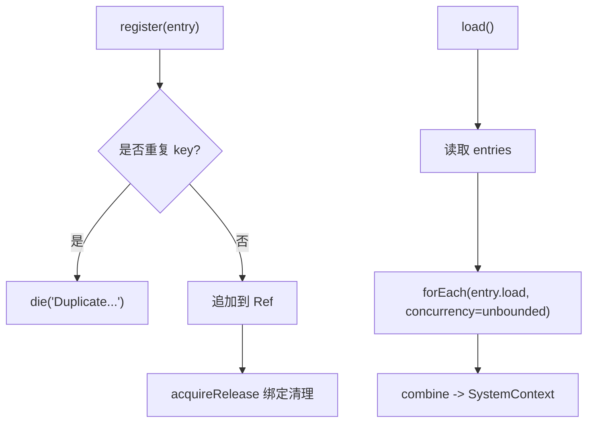
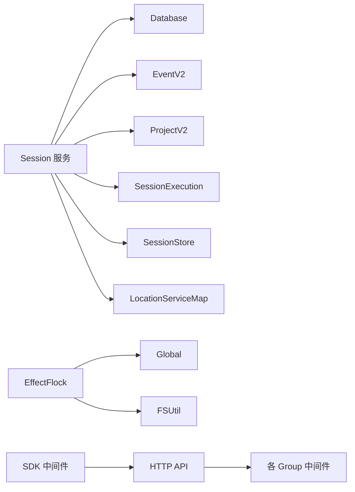

# Effect 框架应用

<cite>
**本文引用的文件**   
- [packages/core/src/session.ts](file://packages/core/src/session.ts)
- [packages/core/src/util/effect-flock.ts](file://packages/core/src/util/effect-flock.ts)
- [packages/core/src/database/migration/20260511173437_session-metadata.ts](file://packages/core/src/database/migration/20260511173437_session-metadata.ts)
- [packages/core/src/database/migration/20260605003541_add_session_context_snapshot.ts](file://packages/core/src/database/migration/20260605003541_add_session_context_snapshot.ts)
- [packages/protocol/src/api.ts](file://packages/protocol/src/api.ts)
- [packages/sdk/js/src/v2/gen/client/utils.gen.ts](file://packages/sdk/js/src/v2/gen/client/utils.gen.ts)
- [packages/opencode/src/cli/effect-cmd.ts](file://packages/opencode/src/cli/effect-cmd.ts)
- [packages/core/src/system-context/registry.ts](file://packages/core/src/system-context/registry.ts)
- [packages/core/src/plugin/layer-map.example.ts](file://packages/core/src/plugin/layer-map.example.ts)
- [.opencode/skills/effect/SKILL.md](file://.opencode/skills/effect/SKILL.md)
- [specs/v2/instructions.md](file://specs/v2/instructions.md)
</cite>

## 目录
1. [简介](#简介)
2. [项目结构](#项目结构)
3. [核心组件](#核心组件)
4. [架构总览](#架构总览)
5. [详细组件分析](#详细组件分析)
6. [依赖关系分析](#依赖关系分析)
7. [性能考量](#性能考量)
8. [故障排查指南](#故障排查指南)
9. [结论](#结论)
10. [附录](#附录)

## 简介
本文件面向在业务逻辑中实践 Effect v4 的开发者，系统性阐述本项目中函数式编程模式的具体落地：Effect 类型与组合、错误建模、异步编排、数据库会话与事务、并发控制、中间件与请求管道、数据转换、性能优化、内存与资源清理、调试与测试策略。文档以仓库中的真实实现为依据，提供可追溯的代码级图示与路径引用，帮助读者快速定位并复用最佳实践。

## 项目结构
本项目采用多包（monorepo）组织，Effect 相关能力分布在 core、protocol、sdk、opencode 等包中：
- core：领域服务、Schema、事件、迁移、并发原语（如分布式锁）、系统上下文注册等
- protocol：HTTP API 分组与中间件装配
- sdk：客户端拦截器与中间件管线
- opencode：CLI 命令封装、运行时装配、实例生命周期管理

图表来源 
- [packages/core/src/session.ts:182-205](file://packages/core/src/session.ts#L182-L205)
- [packages/core/src/util/effect-flock.ts:97-110](file://packages/core/src/util/effect-flock.ts#L97-L110)
- [packages/core/src/system-context/registry.ts:19-46](file://packages/core/src/system-context/registry.ts#L19-L46)
- [packages/protocol/src/api.ts:26-54](file://packages/protocol/src/api.ts#L26-L54)
- [packages/sdk/js/src/v2/gen/client/utils.gen.ts:212-263](file://packages/sdk/js/src/v2/gen/client/utils.gen.ts#L212-L263)
- [packages/opencode/src/cli/effect-cmd.ts:69-96](file://packages/opencode/src/cli/effect-cmd.ts#L69-L96)

章节来源
- [packages/core/src/session.ts:1-200](file://packages/core/src/session.ts#L1-L200)
- [packages/core/src/util/effect-flock.ts:1-120](file://packages/core/src/util/effect-flock.ts#L1-L120)
- [packages/protocol/src/api.ts:26-54](file://packages/protocol/src/api.ts#L26-L54)
- [packages/sdk/js/src/v2/gen/client/utils.gen.ts:212-263](file://packages/sdk/js/src/v2/gen/client/utils.gen.ts#L212-L263)
- [packages/opencode/src/cli/effect-cmd.ts:1-97](file://packages/opencode/src/cli/effect-cmd.ts#L1-L97)

## 核心组件
- Session 服务：定义领域接口、错误类型、层装配与消息解码；通过 Drizzle ORM 访问数据库，结合 Schema 校验与事件发布。
- EffectFlock：基于文件系统与原子操作的分布式锁服务，提供 acquire/withLock 以及心跳、过期清理、竞争破局等机制。
- HTTP API 中间件装配：按组装配路由，注入位置与会话上下文中间件，统一错误契约与传输细节。
- SDK 客户端中间件：统一的 request/response/error 拦截器集合，支持动态增删与替换。
- CLI 命令封装：将 yargs 命令与 Effect 运行期集成，自动提供 InstanceRef 与 AppServices，并在退出时释放资源。
- 系统上下文注册表：集中注册与加载系统上下文，支持并发加载与去重保护。

章节来源
- [packages/core/src/session.ts:182-205](file://packages/core/src/session.ts#L182-L205)
- [packages/core/src/util/effect-flock.ts:75-110](file://packages/core/src/util/effect-flock.ts#L75-L110)
- [packages/protocol/src/api.ts:26-54](file://packages/protocol/src/api.ts#L26-L54)
- [packages/sdk/js/src/v2/gen/client/utils.gen.ts:212-263](file://packages/sdk/js/src/v2/gen/client/utils.gen.ts#L212-L263)
- [packages/opencode/src/cli/effect-cmd.ts:69-96](file://packages/opencode/src/cli/effect-cmd.ts#L69-L96)
- [packages/core/src/system-context/registry.ts:19-46](file://packages/core/src/system-context/registry.ts#L19-L46)

## 架构总览
下图展示了从 HTTP 请求到领域服务的调用链，以及中间件、Schema 校验、事件与数据库交互的关键节点。

图表来源 
- [packages/protocol/src/api.ts:26-54](file://packages/protocol/src/api.ts#L26-L54)
- [packages/core/src/session.ts:182-205](file://packages/core/src/session.ts#L182-L205)

## 详细组件分析

### Session 服务（领域服务与数据流）
- 职责：会话列表、创建、消息读取、历史、切换 Agent/Model、Prompt 投递、Shell/Skill 执行、压缩、等待、恢复、回滚等。
- 错误建模：使用 Schema.TaggedErrorClass 定义 NotFoundError、OperationUnavailableError、PromptConflictError 等，便于类型化错误处理。
- 数据转换：通过 Schema.decodeUnknownEffect 对行数据进行强类型解码，失败映射为 MessageDecodeError。
- 层装配：Layer.effect 组合 Database、EventV2、ProjectV2、Execution、Store、LocationServiceMap 等依赖。

图表来源 
- [packages/core/src/session.ts:91-180](file://packages/core/src/session.ts#L91-L180)

章节来源
- [packages/core/src/session.ts:1-200](file://packages/core/src/session.ts#L1-L200)

### EffectFlock（并发控制与资源清理）
- 目标：跨进程/线程的互斥锁，保证同一 key 在同一时刻仅一个持有者。
- 关键机制：
  - 原子 mkdir 作为 POSIX 锁原语
  - 心跳文件定期更新，超时判定“陈旧”
  - 竞争破局文件 .breaker 用于安全清理陈旧锁
  - 指数退避+抖动重试，避免惊群
  - acquireRelease 确保 release 必执行，内部 fiber 负责心跳
- 错误模型：LockTimeoutError、LockCompromisedError、ReleaseError（内部 NotAcquired 不泄露）。

图表来源 
- [packages/core/src/util/effect-flock.ts:165-266](file://packages/core/src/util/effect-flock.ts#L165-L266)

章节来源
- [packages/core/src/util/effect-flock.ts:1-285](file://packages/core/src/util/effect-flock.ts#L1-L285)

### HTTP 中间件与请求管道
- 中间件装配：按 Group 挂载中间件，注入 Location 与 Session 上下文键，保持 Core 服务身份稳定。
- 错误契约：公共 JSON 错误应声明为端点级别的 Schema.ErrorClass，避免混用 HttpApiError 空体。
- 客户端中间件：request/response/error 三类拦截器，支持 use/eject/update/clear，形成可插拔的请求管道。

图表来源 
- [packages/protocol/src/api.ts:26-54](file://packages/protocol/src/api.ts#L26-L54)
- [packages/sdk/js/src/v2/gen/client/utils.gen.ts:212-263](file://packages/sdk/js/src/v2/gen/client/utils.gen.ts#L212-L263)

章节来源
- [packages/protocol/src/api.ts:26-54](file://packages/protocol/src/api.ts#L26-L54)
- [packages/sdk/js/src/v2/gen/client/utils.gen.ts:212-263](file://packages/sdk/js/src/v2/gen/client/utils.gen.ts#L212-L263)

### CLI 命令封装与实例生命周期
- effectCmd：将 yargs 命令包装为 Effect 处理器，按需加载 InstanceContext 并提供 InstanceRef，退出时自动 dispose。
- 错误输出：CliError 携带 message 与 exitCode，由全局错误格式化器统一处理。
- 运行时：AppRuntime.runPromise 驱动 Effect 执行，确保资源清理与 IPC 事件上报。

图表来源 
- [packages/opencode/src/cli/effect-cmd.ts:69-96](file://packages/opencode/src/cli/effect-cmd.ts#L69-L96)

章节来源
- [packages/opencode/src/cli/effect-cmd.ts:1-97](file://packages/opencode/src/cli/effect-cmd.ts#L1-L97)

### 系统上下文注册与加载
- 注册：register 使用 Ref 维护条目，重复 key 会 die，使用 acquireRelease 保证生命周期。
- 加载：load 并发加载所有 entry.load，合并为 SystemContext。

图表来源 
- [packages/core/src/system-context/registry.ts:19-46](file://packages/core/src/system-context/registry.ts#L19-L46)

章节来源
- [packages/core/src/system-context/registry.ts:1-49](file://packages/core/src/system-context/registry.ts#L1-49)

### 数据库会话与迁移（事务与一致性）
- 迁移示例：使用 Effect.gen 包裹 SQL，条件判断列是否存在，避免幂等问题。
- 会话元数据：session 表扩展 metadata 字段；新增 session_context_epoch 表存储快照基线。
- 建议：在迁移中使用事务语义（由迁移框架保障），在业务侧通过 Service 层进行读写与事件发布。

章节来源
- [packages/core/src/database/migration/20260511173437_session-metadata.ts:1-16](file://packages/core/src/database/migration/20260511173437_session-metadata.ts#L1-L16)
- [packages/core/src/database/migration/20260605003541_add_session_context_snapshot.ts:1-21](file://packages/core/src/database/migration/20260605003541_add_session_context_snapshot.ts#L1-L21)

### 层组合与缓存（LayerMap 模式）
- 模式：全局服务与上下文相关服务分离，使用 LayerMap 按 key 缓存 per-request/per-project 的服务实例。
- 生命周期：缓存项在空闲后按 TTL 销毁，invalidate 可主动失效。

章节来源
- [packages/core/src/plugin/layer-map.example.ts:1-94](file://packages/core/src/plugin/layer-map.example.ts#L1-L94)

## 依赖关系分析
- Session 服务依赖：Database、EventV2、ProjectV2、SessionExecution、SessionStore、LocationServiceMap、Schema 解码器等。
- EffectFlock 依赖：Global、FSUtil、OS/Crypto 工具，使用 Effect 的 Schedule、Scope、Layer 等。
- HTTP API 依赖：各 Group 中间件与位置/会话上下文键，保持 Core 服务解耦。
- SDK 中间件：独立于服务端，提供可插拔的请求/响应/错误处理。

图表来源 
- [packages/core/src/session.ts:182-205](file://packages/core/src/session.ts#L182-L205)
- [packages/core/src/util/effect-flock.ts:97-110](file://packages/core/src/util/effect-flock.ts#L97-L110)
- [packages/protocol/src/api.ts:26-54](file://packages/protocol/src/api.ts#L26-L54)
- [packages/sdk/js/src/v2/gen/client/utils.gen.ts:212-263](file://packages/sdk/js/src/v2/gen/client/utils.gen.ts#L212-L263)

章节来源
- [packages/core/src/session.ts:182-205](file://packages/core/src/session.ts#L182-L205)
- [packages/core/src/util/effect-flock.ts:97-110](file://packages/core/src/util/effect-flock.ts#L97-L110)
- [packages/protocol/src/api.ts:26-54](file://packages/protocol/src/api.ts#L26-L54)
- [packages/sdk/js/src/v2/gen/client/utils.gen.ts:212-263](file://packages/sdk/js/src/v2/gen/client/utils.gen.ts#L212-L263)

## 性能考量
- 并发与重试：EffectFlock 使用指数退避+抖动+时间上限的重试策略，避免风暴与死锁。
- 作用域与心跳：心跳 fiber 在 Scoped 内运行，释放时自动中断，避免泄漏。
- 层缓存：LayerMap 按 key 缓存服务实例，减少重复初始化开销。
- Schema 解码：批量解码前可考虑批处理与缓存热点键值，降低 CPU 压力。
- I/O 优化：迁移与数据库操作尽量批量化，避免频繁小事务。

[本节为通用指导，无需代码来源]

## 故障排查指南
- 锁定失败：检查 LockTimeoutError/LockCompromisedError，确认锁目录权限、磁盘空间与心跳文件状态。
- 会话解码失败：MessageDecodeError 通常由 Schema 不匹配引起，核对消息结构与版本。
- 中间件问题：检查 request/response/error 拦截器顺序与异常传播，确保错误契约一致。
- CLI 退出码：CliError 的 exitCode 决定进程退出码，配合全局错误格式化器查看堆栈。
- 层装配错误：检查依赖图与 makeLocationNode/makeGlobalNode 的 deps 声明，避免循环依赖。

章节来源
- [packages/core/src/util/effect-flock.ts:17-37](file://packages/core/src/util/effect-flock.ts#L17-L37)
- [packages/core/src/session.ts:91-111](file://packages/core/src/session.ts#L91-L111)
- [packages/sdk/js/src/v2/gen/client/utils.gen.ts:212-263](file://packages/sdk/js/src/v2/gen/client/utils.gen.ts#L212-L263)
- [packages/opencode/src/cli/effect-cmd.ts:13-18](file://packages/opencode/src/cli/effect-cmd.ts#L13-L18)

## 结论
本项目以 Effect v4 为核心，构建了类型安全、可组合、可观测的业务层。通过 Session 服务、EffectFlock、HTTP 中间件、SDK 拦截器、CLI 封装与系统上下文注册，形成了清晰的边界与稳定的运行时。遵循本地风格与 v2 指令，可在保持最小正确性的前提下持续演进。

[本节为总结性内容，无需代码来源]

## 附录

### 函数式编程与 Effect 风格指南
- 优先使用 Effect.gen(function* () {...}) 组合多步工作流。
- 使用 Effect.fn("Name") 或 Effect.fnUntraced(...) 命名重要方法与内部辅助。
- 使用 Schema 描述 API 与领域数据结构，branded schema 表示 ID，TaggedErrorClass 建模错误。
- HTTP 处理器保持薄：解码输入、读取上下文、调用服务、映射传输错误。
- 层组合显式化，避免隐藏依赖；测试中使用 repo 提供的 Effect 测试助手与 live 测试。

章节来源
- [.opencode/skills/effect/SKILL.md:19-30](file://.opencode/skills/effect/SKILL.md#L19-L30)
- [specs/v2/instructions.md:109-122](file://specs/v2/instructions.md#L109-L122)