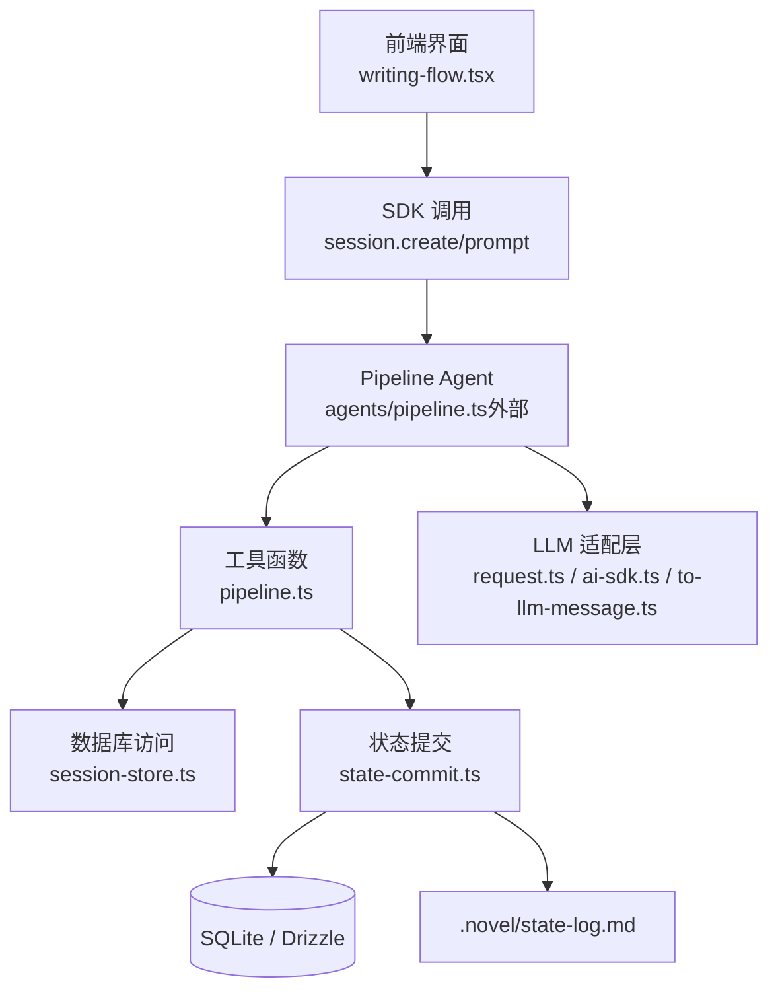
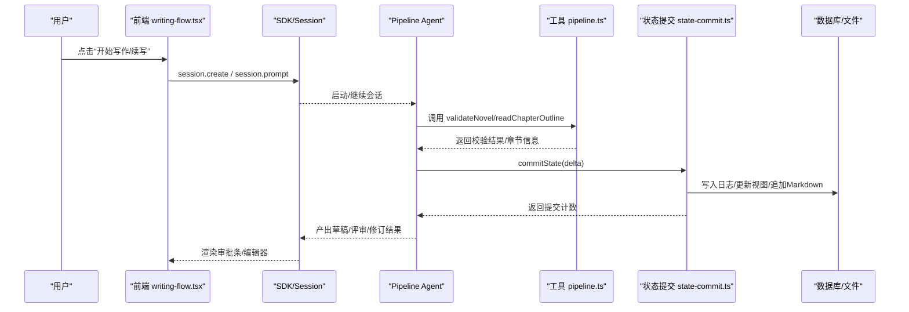
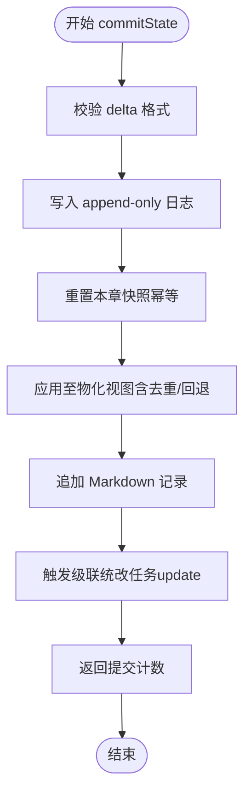
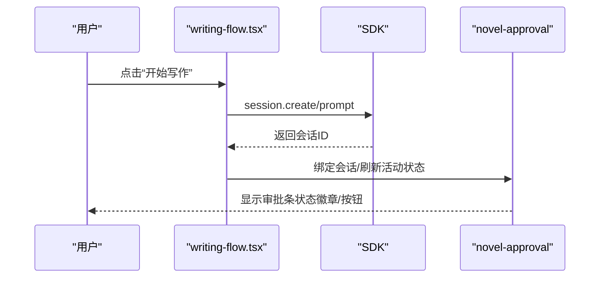
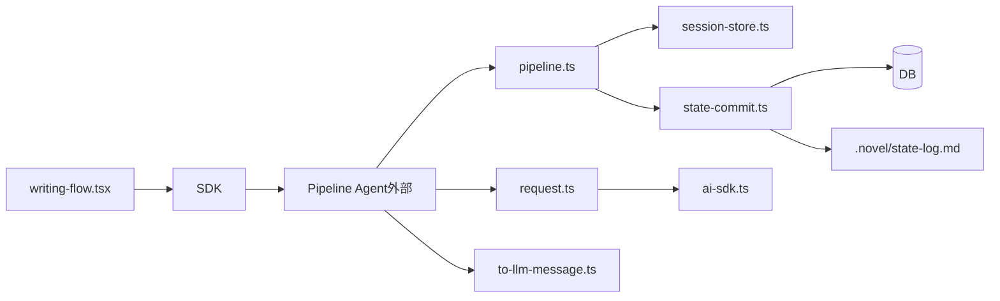

# 写作流水线系统

<cite>
**本文引用的文件**   
- [packages/plugin/src/novel-writer/pipeline.ts](file://packages/plugin/src/novel-writer/pipeline.ts)
- [packages/plugin/src/novel-writer/state-commit.ts](file://packages/plugin/src/novel-writer/state-commit.ts)
- [packages/plugin/src/novel-writer/session-store.ts](file://packages/plugin/src/novel-writer/session-store.ts)
- [packages/app/src/pages/novel/writing-flow.tsx](file://packages/app/src/pages/novel/writing-flow.tsx)
- [packages/app/src/pages/novel/approval-bar.tsx](file://packages/app/src/pages/novel/approval-bar.tsx)
- [packages/plugin/test/novel-writer/e2e.test.ts](file://packages/plugin/test/novel-writer/e2e.test.ts)
- [packages/plugin/test/novel-writer/review.test.ts](file://packages/plugin/test/novel-writer/review.test.ts)
- [packages/core/src/session/runner/to-llm-message.ts](file://packages/core/src/session/runner/to-llm-message.ts)
- [packages/opencode/src/session/llm/request.ts](file://packages/opencode/src/session/llm/request.ts)
- [packages/opencode/src/session/llm/ai-sdk.ts](file://packages/opencode/src/session/llm/ai-sdk.ts)
- [packages/core/src/session/runner/max-steps.ts](file://packages/core/src/session/runner/max-steps.ts)
</cite>

## 目录
1. [简介](#简介)
2. [项目结构](#项目结构)
3. [核心组件](#核心组件)
4. [架构总览](#架构总览)
5. [详细组件分析](#详细组件分析)
6. [依赖关系分析](#依赖关系分析)
7. [性能考量](#性能考量)
8. [故障排查指南](#故障排查指南)
9. [结论](#结论)
10. [附录：自定义步骤开发指南与扩展点](#附录自定义步骤开发指南与扩展点)

## 简介
本文件系统性地梳理并文档化“写作流水线”的完整实现，覆盖从大纲规划、上下文组装、草稿撰写、连续性审查、修订完善、状态提取、版本提交到章节推进等八个关键步骤。重点说明 AI 提示工程的设计模式、上下文管理策略与输出格式化机制，并给出错误处理、重试逻辑与降级方案。同时提供扩展点说明，帮助开发者按规范新增或替换流水线步骤。

## 项目结构
写作流水线由前端触发入口、Agent 编排（已迁移为 pipeline agent）、工具函数与持久化层组成。核心代码位于 plugin 包与 app 包中：
- 前端入口：创建会话、绑定小说、发送初始指令，进入写作流程
- 插件侧：提供确定性步骤辅助函数（校验、读取、状态提交）
- 状态提交：将 delta 写入 append-only 日志、更新物化视图、同步 Markdown 记录
- LLM 适配：消息转换、请求构建、用量统计、上下文溢出检测

图表来源 
- [packages/app/src/pages/novel/writing-flow.tsx:1-109](file://packages/app/src/pages/novel/writing-flow.tsx#L1-L109)
- [packages/plugin/src/novel-writer/pipeline.ts:1-131](file://packages/plugin/src/novel-writer/pipeline.ts#L1-L131)
- [packages/plugin/src/novel-writer/state-commit.ts:1-800](file://packages/plugin/src/novel-writer/state-commit.ts#L1-L800)
- [packages/plugin/src/novel-writer/session-store.ts:1-2](file://packages/plugin/src/novel-writer/session-store.ts#L1-L2)
- [packages/opencode/src/session/llm/request.ts:80-179](file://packages/opencode/src/session/llm/request.ts#L80-L179)
- [packages/core/src/session/runner/to-llm-message.ts:70-100](file://packages/core/src/session/runner/to-llm-message.ts#L70-L100)

章节来源
- [packages/app/src/pages/novel/writing-flow.tsx:1-109](file://packages/app/src/pages/novel/writing-flow.tsx#L1-L109)
- [packages/plugin/src/novel-writer/pipeline.ts:1-131](file://packages/plugin/src/novel-writer/pipeline.ts#L1-L131)
- [packages/plugin/src/novel-writer/state-commit.ts:1-800](file://packages/plugin/src/novel-writer/state-commit.ts#L1-L800)
- [packages/plugin/src/novel-writer/session-store.ts:1-2](file://packages/plugin/src/novel-writer/session-store.ts#L1-L2)

## 核心组件
- 前端写作入口：负责创建/绑定会话、注入提示词、导航至会话页
- 流水线工具：校验小说、读取章节大纲、验证与提交状态变更
- 状态提交器：解析 delta、去重实体、更新物化视图、追加 Markdown、级联任务
- LLM 适配：统一消息格式、合并 system/system-like 指令、工具注册、用量统计、上下文溢出识别

章节来源
- [packages/app/src/pages/novel/writing-flow.tsx:1-109](file://packages/app/src/pages/novel/writing-flow.tsx#L1-L109)
- [packages/plugin/src/novel-writer/pipeline.ts:1-131](file://packages/plugin/src/novel-writer/pipeline.ts#L1-L131)
- [packages/plugin/src/novel-writer/state-commit.ts:1-800](file://packages/plugin/src/novel-writer/state-commit.ts#L1-L800)
- [packages/opencode/src/session/llm/request.ts:80-179](file://packages/opencode/src/session/llm/request.ts#L80-L179)
- [packages/core/src/session/runner/to-llm-message.ts:70-100](file://packages/core/src/session/runner/to-llm-message.ts#L70-L100)

## 架构总览
八步写作流水线在运行时由 Agent 驱动，前端仅负责发起与导航；中间通过工具函数与状态提交器完成数据一致性保障；LLM 适配层保证跨模型一致性与资源使用可控。

图表来源 
- [packages/app/src/pages/novel/writing-flow.tsx:1-109](file://packages/app/src/pages/novel/writing-flow.tsx#L1-L109)
- [packages/plugin/src/novel-writer/pipeline.ts:1-131](file://packages/plugin/src/novel-writer/pipeline.ts#L1-L131)
- [packages/plugin/src/novel-writer/state-commit.ts:1-800](file://packages/plugin/src/novel-writer/state-commit.ts#L1-L800)

## 详细组件分析

### 步骤一：大纲规划（整体→卷→章）
- 目标：生成三级大纲，确保故事主线、卷主题、章节目标清晰
- 输入：小说 ID、卷号、章节序号
- 处理：由 Agent 根据全局设定与历史摘要生成结构化大纲
- 输出：包含“故事梗概/主线剧情/角色列表/世界观概要”等字段的大纲文本
- 验证：E2E 用例断言关键字段存在性

章节来源
- [packages/plugin/test/novel-writer/e2e.test.ts:414-449](file://packages/plugin/test/novel-writer/e2e.test.ts#L414-L449)

### 步骤二：上下文组装
- 目标：聚合角色状态、伏笔、世界设定、风格指南、最近章节摘要等
- 处理：读取数据库快照与增量日志，构造稳定上下文
- 输出：供 Writer 使用的结构化上下文对象
- 注意：上下文长度需受控，避免超出模型窗口

章节来源
- [packages/plugin/test/novel-writer/e2e.test.ts:642-657](file://packages/plugin/test/novel-writer/e2e.test.ts#L642-L657)
- [packages/core/src/session/runner/to-llm-message.ts:70-100](file://packages/core/src/session/runner/to-llm-message.ts#L70-L100)

### 步骤三：草稿撰写（Writer Agent + Chapter Tools）
- 目标：基于上下文与大纲生成章节草稿
- 处理：调用 chapter-tools 进行内容合成与字数控制
- 输出：章节内容与元数据（标题、字数、状态）
- 验证：E2E 用例断言写入成功与内容片段

章节来源
- [packages/plugin/test/novel-writer/e2e.test.ts:451-480](file://packages/plugin/test/novel-writer/e2e.test.ts#L451-L480)
- [packages/plugin/test/novel-writer/e2e.test.ts:659-671](file://packages/plugin/test/novel-writer/e2e.test.ts#L659-L671)

### 步骤四：连续性审查（Check Continuity）
- 目标：对草稿进行多维度一致性检查（姓名、性格、因果链等）
- 处理：生成维度清单与总体评价（PASS/WARN/FAIL）
- 输出：评审结果与证据定位（段落/行号）
- 幂等：内容未变更时复审并入同一轮次

章节来源
- [packages/plugin/test/novel-writer/review.test.ts:67-133](file://packages/plugin/test/novel-writer/review.test.ts#L67-L133)

### 步骤五：修订完善
- 目标：依据评审意见对草稿进行定向修改
- 处理：结合评审维度与证据，生成修订指令
- 输出：修订后的章节内容与修订摘要

章节来源
- [packages/plugin/test/novel-writer/review.test.ts:100-114](file://packages/plugin/test/novel-writer/review.test.ts#L100-L114)

### 步骤六：状态提取（Delta 生成）
- 目标：从草稿与上下文变化中提取结构化 delta
- 处理：识别新增/更新/删除的事实类型（角色、关系、伏笔、世界条目、风格、张力等）
- 输出：符合 StateDeltaSchema 的变更数组

章节来源
- [packages/plugin/src/novel-writer/state-commit.ts:55-78](file://packages/plugin/src/novel-writer/state-commit.ts#L55-L78)

### 步骤七：版本提交（commitState）
- 目标：将 delta 持久化为不可变日志，并更新物化视图与 Markdown 记录
- 处理：
  - 校验 delta 格式
  - 写入 novel_state_log
  - 重置本章快照（幂等）
  - 应用至物化视图（含实体去重、状态回退）
  - 追加 .novel/state-log.md
  - 触发级联统改任务（update 操作）
- 输出：提交条目数量

图表来源 
- [packages/plugin/src/novel-writer/state-commit.ts:694-749](file://packages/plugin/src/novel-writer/state-commit.ts#L694-L749)

章节来源
- [packages/plugin/src/novel-writer/state-commit.ts:694-749](file://packages/plugin/src/novel-writer/state-commit.ts#L694-L749)

### 步骤八：章节推进（状态切换与发布）
- 目标：将章节状态推进至可审阅/发布阶段
- 处理：validateStateDelta 校验内容有效性，persistStateDelta 提交并发布
- 输出：状态变更结果与提示信息

章节来源
- [packages/plugin/src/novel-writer/pipeline.ts:58-131](file://packages/plugin/src/novel-writer/pipeline.ts#L58-L131)

### 前端交互与审批流
- 写作入口：查找已绑定会话或新建会话，注入提示词后跳转至会话页
- 审批条：展示章节状态与整体评审结果，支持批准/驳回操作

图表来源 
- [packages/app/src/pages/novel/writing-flow.tsx:1-109](file://packages/app/src/pages/novel/writing-flow.tsx#L1-L109)
- [packages/app/src/pages/novel/approval-bar.tsx:1-39](file://packages/app/src/pages/novel/approval-bar.tsx#L1-L39)

章节来源
- [packages/app/src/pages/novel/writing-flow.tsx:1-109](file://packages/app/src/pages/novel/writing-flow.tsx#L1-L109)
- [packages/app/src/pages/novel/approval-bar.tsx:1-39](file://packages/app/src/pages/novel/approval-bar.tsx#L1-L39)

## 依赖关系分析
- 前端依赖 SDK 与 Novel 上下文，用于会话管理与状态查询
- 插件工具依赖 session-store（Drizzle 表定义）与 state-commit（状态提交）
- 状态提交器依赖多种物化视图表，并通过 scanReferences 建立实体引用关系
- LLM 适配层统一消息格式、工具注册与用量统计

图表来源 
- [packages/app/src/pages/novel/writing-flow.tsx:1-109](file://packages/app/src/pages/novel/writing-flow.tsx#L1-L109)
- [packages/plugin/src/novel-writer/pipeline.ts:1-131](file://packages/plugin/src/novel-writer/pipeline.ts#L1-L131)
- [packages/plugin/src/novel-writer/state-commit.ts:1-800](file://packages/plugin/src/novel-writer/state-commit.ts#L1-L800)
- [packages/opencode/src/session/llm/request.ts:80-179](file://packages/opencode/src/session/llm/request.ts#L80-L179)
- [packages/core/src/session/runner/to-llm-message.ts:70-100](file://packages/core/src/session/runner/to-llm-message.ts#L70-L100)

章节来源
- [packages/plugin/src/novel-writer/pipeline.ts:1-131](file://packages/plugin/src/novel-writer/pipeline.ts#L1-L131)
- [packages/plugin/src/novel-writer/state-commit.ts:1-800](file://packages/plugin/src/novel-writer/state-commit.ts#L1-L800)
- [packages/opencode/src/session/llm/request.ts:80-179](file://packages/opencode/src/session/llm/request.ts#L80-L179)

## 性能考量
- 上下文长度控制：通过 to-llm-message 过滤无意义部分，减少无效 token 消耗
- 幂等提交：resetChapterScopedState 保证重跑章节时的快照替换语义，避免重复写入
- 实体去重：resolveEntityId 降低重复创建开销，提升写入效率
- 批量操作：delta 遍历一次性写入日志与视图，减少往返
- 缓存与统计：ai-sdk 汇总用量，便于监控与限流

章节来源
- [packages/core/src/session/runner/to-llm-message.ts:70-100](file://packages/core/src/session/runner/to-llm-message.ts#L70-L100)
- [packages/plugin/src/novel-writer/state-commit.ts:296-311](file://packages/plugin/src/novel-writer/state-commit.ts#L296-L311)
- [packages/plugin/src/novel-writer/state-commit.ts:163-237](file://packages/plugin/src/novel-writer/state-commit.ts#L163-L237)
- [packages/opencode/src/session/llm/ai-sdk.ts:44-74](file://packages/opencode/src/session/llm/ai-sdk.ts#L44-L74)

## 故障排查指南
- 上下文溢出：当检测到 prompt 过长或 token 超限，抛出 ContextOverflowError，应缩短上下文或拆分任务
- 最大步数限制：达到 MAX_STEPS_PROMPT 后禁用工具，仅允许文本回复，需人工介入
- 状态提交失败：validateStateDelta 与 persistStateDelta 返回 fail 状态，检查章节是否存在与内容是否为空
- 评审轮次异常：内容未变更时复审应并入同一 round，若出现新 round，检查章节内容是否被修改

章节来源
- [packages/opencode/src/cli/cmd/github.handler.ts:931-959](file://packages/opencode/src/cli/cmd/github.handler.ts#L931-L959)
- [packages/core/src/session/runner/max-steps.ts:1-16](file://packages/core/src/session/runner/max-steps.ts#L1-L16)
- [packages/plugin/src/novel-writer/pipeline.ts:58-78](file://packages/plugin/src/novel-writer/pipeline.ts#L58-L78)
- [packages/plugin/test/novel-writer/review.test.ts:100-114](file://packages/plugin/test/novel-writer/review.test.ts#L100-L114)

## 结论
本写作流水线以 Agent 为核心编排器，结合强一致的状态提交与幂等快照机制，实现了从大纲到发布的端到端自动化。通过统一的 LLM 适配与上下文管理，系统在跨模型环境下保持稳定与高效。前端与审批流提供了良好的交互体验与质量门禁。

## 附录：自定义步骤开发指南与扩展点
- 新增步骤建议：
  - 在 pipeline.ts 中增加工具函数（如 validateXxx、readXxx、persistXxx），遵循现有签名与错误返回约定
  - 在 state-commit.ts 中扩展 FACT_TYPES 与 applyToMaterializedView 分支，支持新的实体类型
  - 在 LLM 适配层（request.ts）注册新工具或调整 system 指令模板
- 扩展点：
  - 工具注册：在 request.ts 中 resolveTools 处添加新工具
  - 消息转换：在 to-llm-message.ts 中扩展 content part 类型处理
  - 评审维度：在 review.test.ts 中定义新的维度与判定规则
  - 前端交互：在 writing-flow.tsx 中注入新的提示词或流程分支

章节来源
- [packages/plugin/src/novel-writer/pipeline.ts:1-131](file://packages/plugin/src/novel-writer/pipeline.ts#L1-L131)
- [packages/plugin/src/novel-writer/state-commit.ts:37-51](file://packages/plugin/src/novel-writer/state-commit.ts#L37-L51)
- [packages/opencode/src/session/llm/request.ts:148-179](file://packages/opencode/src/session/llm/request.ts#L148-L179)
- [packages/core/src/session/runner/to-llm-message.ts:70-100](file://packages/core/src/session/runner/to-llm-message.ts#L70-L100)
- [packages/plugin/test/novel-writer/review.test.ts:67-133](file://packages/plugin/test/novel-writer/review.test.ts#L67-L133)
- [packages/app/src/pages/novel/writing-flow.tsx:1-109](file://packages/app/src/pages/novel/writing-flow.tsx#L1-L109)